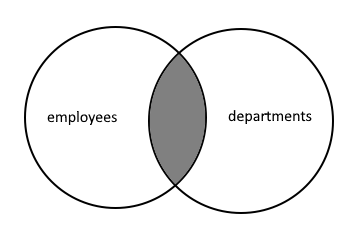

import SqlJoinTrainer from '@site/src/components/SqlJoinTrainer';

# Алиасы, JOIN и объединение таблиц

<div class="article-tags">
  <span class="tag tag-required">ОБЯЗАТЕЛЬНО</span>
  <span class="tag tag-beginner">ДЛЯ НОВИЧКОВ</span>
</div>

<span class="complexity-badge">Разработчику</span>
<span class="complexity-badge">Аналитику</span>
<span class="complexity-badge">Тестировщику</span>  
<span class="complexity-badge">Архитектору</span>
<span class="complexity-badge">Инженеру</span>

**Перед чтением:** [Операторы](/encyclopedia/4-code-dev/4-02-chto-takoe-kod-i-kak-on-rabotaet/33) — операнды и приоритеты; здесь — в `ON` и условиях соединения.

## Алиасы, JOIN и объединение таблиц

Данные редко лежат в одной таблице. **JOIN** собирает строки по ключу связи; **UNION** склеивает результаты с **одинаковой структурой** столбцов.

Сначала: [SELECT](./107.md), подзапросы вместо join: [108](./108.md).

### Алиасы

★ **Алиасы (AS)** используются для временного переименования таблиц или столбцов в запросе SQL. Они делают запросы более читаемыми и позволяют избежать конфликтов имён. 

Пример для столбцов (AS employee_name):
```sql
SELECT 
    name AS employee_name,
    salary * 12 AS annual_salary
FROM employees;
```
Немного английского - employee это работник, employer работодатель.

Пример для таблиц:
```sql
SELECT 
    e.name,
    d.name AS department_name
FROM employees AS e
JOIN departments AS d ON e.department_id = d.id;
```
Здесь мы видим, что таблица employees получила алиас (псевдоним) e, а departments получила алиас d. Это позволяет обращаться к ним не традиционно 
```
<имя таблицы>.<имя столбца>
```
а так:
```
<алиас>.<имя столбца>. 
```

Если имя столбца длинное и страшное, к примеру, `UltraHardMegaBigNameOfThisHugeDepartment`, можно уменьшить, используя алиас «u» - и запрос станет более читабельным.

В **тексте** `SELECT` пишут выше `FROM`, но **логический порядок** (упрощённо): `FROM` → `WHERE` → `GROUP BY` → `HAVING` → `SELECT` → `ORDER BY`. Алиас из `FROM employees AS e` доступен в `SELECT e.name` этого же запроса.

Ключевые моменты:
	- алиасы действуют только в рамках одного запроса;
	- алиас из `FROM` виден в `SELECT`, `WHERE`, `JOIN` того же запроса;
	- переставлять блоки в файле нельзя: без `FROM employees e` выражение `SELECT e.name` не скомпилируется;
	- ключевое слово `AS` можно опустить:
```sql
SELECT e.name FROM employees e
```

---

## Объединения (JOIN)

### Что такое JOIN?

★ **Объединения (JOIN)** используются для объединения данных из двух и более таблиц на основе связанных столбцов.

<SqlJoinTrainer />

Хорошая шпаргалка по объединениями есть здесь:

https://learnsql.com/blog/sql-join-cheat-sheet/

Представим, что нам надо объединить таблицы employees и departments:


У нас есть несколько вариантов объединения. Практически это нужно, к примеру, когда у вас данные раскиданы по нескольким таблицам, а вы хотите получить какой-то общий результат с данными из этих разных таблиц.

Основные типы JOIN: **INNER, OUTER (LEFT, RIGHT, FULL), CROSS**.

---

### INNER JOIN

★ INNER JOIN (внутреннее соединение) – возвращает только строки, где есть соответствие в обеих таблицах:
```sql
SELECT 
    e.name AS employee_name,
    d.name AS department_name
FROM employees e
INNER JOIN departments d ON e.department_id = d.id;
```
Пример:



Есть также внешние соединения (OUTER JOIN). Выделяют LEFT OUTER JOIN, RIGHT OUTER JOIN и FULL OUTER JOIN.

---

### LEFT JOIN

★ **LEFT JOIN или LEFT OUTER JOIN (Левое соединение)** возвращает все строки из левой таблицы и соответствующие из правой. 

Если соответствия нет – NULL:
```sql
SELECT 
    e.name AS employee_name,
    d.name AS department_name
FROM employees e
LEFT JOIN departments d ON e.department_id = d.id;
```
Пример:


---

### RIGHT JOIN 

★ **RIGHT JOIN или RIGHT OUTER JOIN (Правое соединение)** возвращает все строки из правой таблицы и соответствующие из левой. Если соответствия нет – NULL.
```sql
SELECT 
    e.name AS employee_name,
    d.name AS department_name
FROM employees e
RIGHT JOIN departments d ON e.department_id = d.id;
```

Пример:


---

### FULL JOIN

★ **FULL JOIN или FULL OUTER JOIN (Полное соединение)** возвращает все строки из обеих таблиц. Если соответствия нет – NULL:
```sql
SELECT 
    e.name AS employee_name,
    d.name AS department_name
FROM employees e
FULL JOIN departments d ON e.department_id = d.id;
```

Пример:


> **Диалект:** `FULL OUTER JOIN` — PostgreSQL, SQL Server, Oracle. В **MySQL** долго обходили через `UNION` LEFT+RIGHT; с 8.0.14+ есть нативная поддержка — проверяйте версию.

---

### CROSS JOIN

★ **CROSS JOIN (декартово произведение)** — каждая строка слева с каждой справа. Без `ON` легко получить огромный результат по ошибке; используйте осознанно.
```sql
SELECT 
    e.name AS employee_name,
    d.name AS department_name
FROM employees e
CROSS JOIN departments d;
```

---

### Эквисоединение и естественное соединение

**Эквисоединение (Equal Join)** - соединение, в котором условие ON основано на равенстве значений в столбцах двух таблиц. INNER JOIN, LEFT JOIN и т.д. с условием ON t1.col = t2.col — это и есть эквисоединения. Подавляющее большинство JOIN в реальных запросах — эквисоединения.

**Естественное соединение (NATURAL JOIN)** - автоматически объединяет таблицы по всем одноимённым столбцам. Не требует явного указания условия ON. Если в обеих таблицах есть столбцы с одинаковыми именами (например, id, department_id), то NATURAL JOIN использует их для соединения по равенству. Столбец, по которому происходит соединение, отображается только один раз в результате.

На практике NATURAL JOIN редко используется, потому что легко ошибиться, запрос становится хрупким (изменение имени столбца может непреднамеренно повлиять на JOIN) и не видно сразу, по каким полям происходит соединение.

---

## UNION

### Что такое UNION?

Ключевое слово **UNION** позволяет выполнить один или несколько дополнительных запросов SELECT и добавить их результаты к исходному запросу. То есть, это SQL-оператор, который позволяет объединять результаты двух или более запросов SELECT в один результирующий набор. Это очень удобно, когда нужно собрать данные из разных таблиц или условий, но с одинаковой структурой.


**UNION ALL** — повторяющиеся строки включаются (объединяет результаты, сохраняя все строки, включая дубли (работает быстрее)).
```sql
UNION ALL
```

**UNION** — повторяющиеся строки исключаются (объединяет результаты, удаляя дубликаты (работает медленнее)).
```sql
UNION
```

Основное правило UNION - все объединяемые запросы должны возвращать одинаковое количество столбцов, и типы данных в соответствующих столбцах должны быть совместимыми.

Операция UNION отличается от операции JOIN. В результате операции UNION сцепляются результирующие наборы двух запросов. При этом операция UNION не создает отдельные строки для столбцов, полученных из двух таблиц. Операция JOIN сравнивает столбцы из двух таблиц и создает результирующие строки, которые состоят из столбцов из двух таблиц.

На что обращать внимание при использовании UNION?

1. Совпадение количества и порядка столбцов. При использовании UNION, если в одном запросе 3 столбца, а в другом — 2, будет ошибка.
2. Совместимость типов данных. Например, нельзя сложить число и строку: `SELECT id FROM table1 UNION SELECT name FROM table2` — ошибка.
3. Использование ORDER BY. Чтобы отсортировать итоговый результат, ORDER BY указывается в самом конце, после всех UNION.
4. Производительность. UNION требует дополнительной работы — удаления дубликатов. Поэтому, если дубли не важны, лучше использовать UNION ALL.

Поэтому команду UNION нужно использовать тогда, когда нужно объединить данные из разных таблиц/запросов с одинаковой структурой, к примеру, при построении отчётов, где требуется выборка из нескольких источников или для создания сводных списков, например, «все клиенты», независимо от типа.

### INTERSECT и EXCEPT

**INTERSECT** — строки, присутствующие в **обоих** результатах (дубликаты убираются, как в `UNION`).

**EXCEPT** — строки из первого запроса, которых **нет** во втором. Порядок важен: `A EXCEPT B` ≠ `B EXCEPT A`.

```sql
-- Категории, в которых есть и товары, и заказы (упрощённый пример)
SELECT category FROM products
INTERSECT
SELECT category FROM products WHERE price > 1000;

-- Товары категории «Книги», которых нет среди дорогих (> 1500)
SELECT name FROM products WHERE category = 'Книги'
EXCEPT
SELECT name FROM products WHERE price > 1500;
```

**Приоритет без скобок:** сначала `INTERSECT`, затем `UNION` / `EXCEPT` слева направо. Для другого порядка используйте скобки:

```sql
(SELECT id FROM a UNION SELECT id FROM b)
INTERSECT
SELECT id FROM c;
```

В PostgreSQL из расширений «ALL» для `INTERSECT` / `EXCEPT` нет — только `UNION ALL`. Два `NULL` в одном столбце при `UNION` считаются равными при удалении дубликатов.

---
