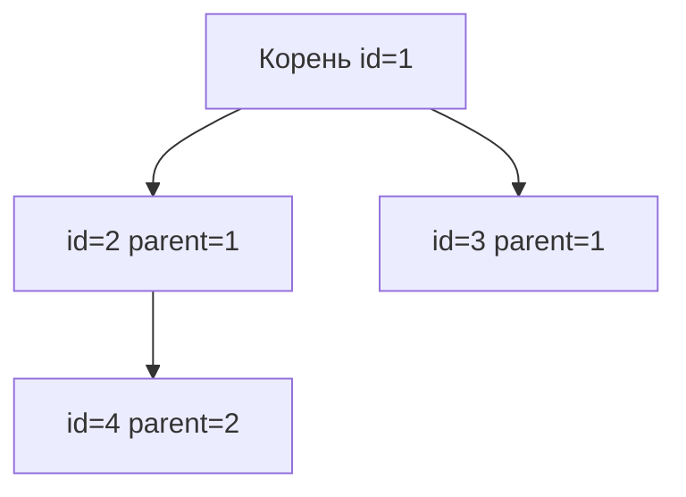

# Иерархические данные в реляционных БД

<div class="article-tags">
  <span class="tag tag-required">ОБЯЗАТЕЛЬНО</span>
  <span class="tag tag-beginner">ДЛЯ НОВИЧКОВ</span>
</div>

<span class="complexity-badge">Разработчику</span>
<span class="complexity-badge">Аналитику</span>

Категории товаров, оргструктура, меню, комментарии с ответами — **деревья** встречаются в каждом продукте. Реляционная модель — таблицы и строки; дерево нужно **смоделировать**.

База: [SQL](/encyclopedia/3-data-markup/3-07-sql/1), [JOIN](/encyclopedia/3-data-markup/3-07-sql/5).

---

## Три распространённые модели

| Модель | Идея | Чтение поддерева | Вставка узла | Сложность |
|--------|------|------------------|--------------|-----------|
| **Adjacency list** (`parent_id`) | Ссылка на родителя | Рекурсивный CTE | O(1) | Низкая |
| **Nested sets** (`left`, `right`) | Интервалы обхода | Один диапазон | O(n) сдвигов | Средняя |
| **Closure table** | Все пары предок–потомок | JOIN по `ancestor` | O(depth) строк | Выше объём |



---

## Adjacency list (parent_id)

```sql
CREATE TABLE category (
    id         BIGINT PRIMARY KEY,
    parent_id  BIGINT REFERENCES category(id),
    name       TEXT NOT NULL
);
```

**Плюсы:** просто объяснить, дешёвые вставки и перенос ветки (обновить `parent_id`).

**Минусы:** «все потомки узла 42» — рекурсия. В PostgreSQL, SQL Server, Oracle — **рекурсивный CTE**:

```sql
WITH RECURSIVE tree AS (
    SELECT id, parent_id, name, 1 AS depth
    FROM category WHERE id = 42
    UNION ALL
    SELECT c.id, c.parent_id, c.name, t.depth + 1
    FROM category c
    JOIN tree t ON c.parent_id = t.id
)
SELECT * FROM tree;
```

Для глубоких деревьев (тысячи уровней — редкость) следите за индексом `(parent_id)`.

---

## Nested sets

Каждый узел получает номера **left** и **right** обхода «в глубину». Потомки узла — все строки, у которых `left` и `right` лежат **внутри** интервала родителя.

**Плюсы:** выборка поддерева без рекурсии — один `WHERE left BETWEEN …`.

**Минусы:** вставка/удаление сдвигает границы у многих строк — плохо при частых изменениях и высокой конкуренции.

Подходит для **реже меняющихся** каталогов (справочники, таксономии).

---

## Closure table

Отдельная таблица `(ancestor_id, descendant_id, depth)` со всеми парами на пути.

**Плюсы:** быстрые запросы «все предки», «все потомки», гибкая глубина.

**Минусы:** больше строк при вставке; нужна дисциплина поддержания при переносе ветки.

Хорошо для **частых сложных запросов** по иерархии при умеренной частоте записи.

---

## Материализованный путь (дополнение)

Колонка `path` вида `/1/5/12/` — быстрый `LIKE '/1/5/%'`, но перенос узла требует обновления всех потомков. Иногда комбинируют с `parent_id`.

---

## Когда что выбирать

| Сценарий | Рекомендация |
|----------|--------------|
| Типичный CRUD, глубина &lt; 10 | `parent_id` + CTE |
| Частое чтение дерева целиком, редкие правки | Nested sets |
| Сложная аналитика по предкам/потомкам | Closure table |
| Граф «друзья друзей», не дерево | Таблица рёбер + [графовая БД](/encyclopedia/3-data-markup/3-06-nosql/7) |

---

## Ограничения целостности

- `FOREIGN KEY` на `parent_id` — не удалить родителя с детьми без CASCADE или переноса.
- Запрет циклов: триггер или проверка при переносе (в closure — проще валидировать).
- Для nested sets — транзакция на всю операцию сдвига.

---

## Связанные темы

- [Основы баз данных](/encyclopedia/3-data-markup/3-05-osnovy-baz-dannyh/1)
- [Компетенции бэкенда](/encyclopedia/1-basics/1-23-frontend-i-bekend/4)

---
