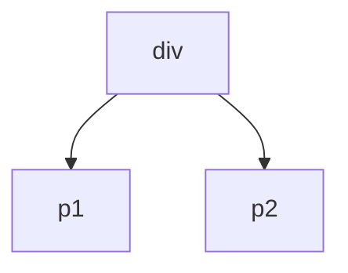
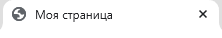
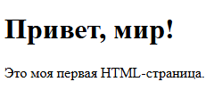
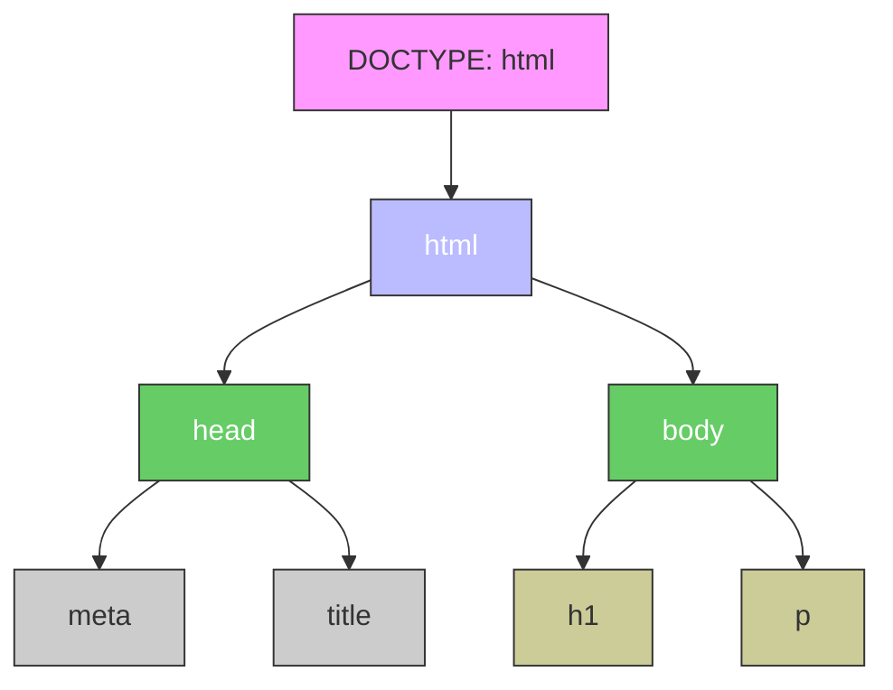
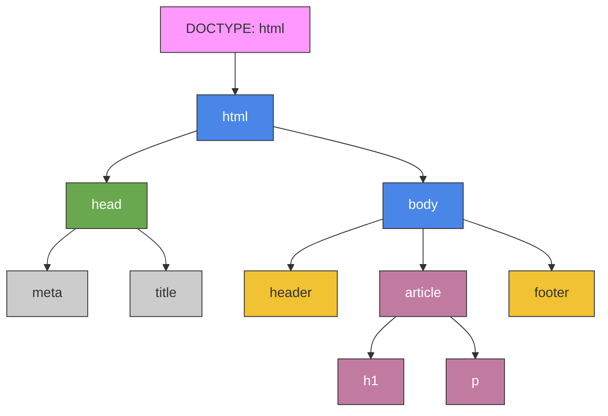

import HTMLPlayground from '@site/src/components/HTMLPlayground.js';

# HTML

<div class="article-tags">
  <span class="tag tag-required">ОБЯЗАТЕЛЬНО</span>
  <span class="tag tag-beginner">ДЛЯ НОВИЧКОВ</span>
</div>

<span class="complexity-badge">Разработчику</span>
<span class="complexity-badge">Аналитику</span>
<span class="complexity-badge">Тестировщику</span>  
<span class="complexity-badge">Архитектору</span>
<span class="complexity-badge">Инженеру</span>

## HTML

### Основы HTML

★ **HTML (HyperText Markup Language)** – язык разметки, который сообщает браузеру, отображать содержимое: где текст, где заголовки, где ссылки, где изображения. 

<HTMLPlayground />

HTML предоставляет следующие возможности:
	- организовать данные в логические блоки: заголовки, абзацы, списки, таблицы, формы и другие элементы;
	- создать иерархическую структуру документа, где каждый фрагмент имеет своё место и назначение;
	- возможность описать значение содержимого, а не только его внешний вид;
	- позволяет браузерам, поисковым системам и другим инструментам лучше понимать, что находится на странице;
	- гипертекстовое соединение — возможность ссылаться на другие документы, изображения, медиа и сервисы;
	- поддерживает элементы, которые становятся точками взаимодействия с пользователем: кнопки, поля ввода, меню;
	- выступает платформой, на которой работают CSS (для стилей) и JavaScript (для поведения);
	- предоставляет структуру, которую можно адаптировать под экраны разных размеров и типов устройств.
	
---

### Логические блоки

**Логический блок** — это фрагмент содержимого веб-страницы, объединённый общей смысловой или функциональной ролью. Такие блоки помогают структурировать информацию так, чтобы она была понятна не только человеку, но и машине: браузеру, поисковому роботу, скринридеру.

Примеры логических блоков:
- заголовок статьи (`<h1>`);
- абзац текста (`<p>`);
- список преимуществ продукта (`<ul>` или `<ol>`);
- форма обратной связи (`<form>`);
- навигационное меню (`<nav>`);
- футер сайта с контактами (`<footer>`).

Без логических блоков страница превращается в сплошной поток символов, который невозможно интерпретировать корректно.

---

### Иерархическая структура документа

**Документ** в контексте веб-разработки — это одна веб-страница, представленная в виде HTML-файла. Он может быть статичным (записан на диске) или динамически сгенерированным сервером при каждом запросе.

Каждый документ имеет **иерархическую структуру**, построенную на принципе вложенности: одни элементы находятся внутри других, формируя древовидную модель — **DOM (Document Object Model)**. Эта структура определяет, как части страницы связаны между собой и как они должны отображаться.

Пример иерархии:

```html
<html>
  <head>
    <title>Заголовок вкладки</title>
  </head>
  <body>
    <header>
      <h1>Основной заголовок</h1>
      <nav>
        <ul>
          <li><a href="/">Главная</a></li>
          <li><a href="/about">О нас</a></li>
        </ul>
      </nav>
    </header>
    <main>
      <p>Содержание страницы</p>
    </main>
    <footer>
      <p>© 2026</p>
    </footer>
  </body>
</html>
```

В этом примере:
- `<html>` — корневой элемент;
- `<head>` и `<body>` — его прямые потомки;
- `<header>`, `<main>`, `<footer>` — дочерние элементы `<body>`;
- каждый уровень вложенности задаёт семантическую роль.

---

### Содержимое веб-страницы

**Содержимое веб-страницы** — это всё, что пользователь видит или с чем взаимодействует: текст, изображения, видео, кнопки, формы, ссылки, аудио и другие медиаэлементы. В HTML содержимое всегда помещается внутрь тегов, которые описывают его тип и назначение.

Содержимое делится на:
- **текстовое** — слова, цифры, символы;
- **медиа** — изображения, звук, видео;
- **интерактивное** — поля ввода, кнопки, выпадающие списки;
- **навигационное** — ссылки, меню, хлебные крошки.

HTML не определяет, как именно будет выглядеть содержимое — этим занимается CSS. Но он чётко указывает, **что это за содержимое**.

---

### Внешний вид страницы

**Внешний вид страницы** — это визуальное представление содержимого: цвета, шрифты, отступы, позиционирование, анимации, адаптация под экраны. Этот слой полностью управляется **CSS (Cascading Style Sheets)**.

HTML отвечает за **структуру**, а CSS — за **оформление**. Например:
- HTML говорит: «Это заголовок первого уровня»;
- CSS говорит: «Отобрази его жирным шрифтом размером 32px, синим цветом, с отступом сверху 24px».

Такое разделение ролей позволяет:
- легко менять дизайн без переписывания структуры;
- обеспечивать доступность (скринридеры читают структуру, а не стиль);
- поддерживать адаптивность (одна структура — разные стили для телефона, планшета, ПК).


---

### Гипертекст и гиперссылки

**Гипертекст** — это текст, содержащий **гиперссылки** (обычно просто «ссылки»), то есть кликабельные элементы, ведущие к другим документам, разделам или ресурсам.

**Ссылка** — это техническая реализация перехода, создаваемая с помощью тега `<a>` (anchor). Пример:

```html
<a href="https://spirzen.ru">Перейти на сайт</a>
```

Различия:
- **Обычный текст** — статичен, не содержит активных элементов.
- **Гипертекст** — интерактивен, содержит ссылки, позволяющие переходить между документами.
- **Гиперссылка** — конкретный элемент (`<a>`) внутри гипертекста, указывающий на URL.

Примеры гипертекста:
- Википедия: почти каждое слово может быть ссылкой.
- Блог: «Подробнее читайте в [нашей статье про CSS](/encyclopedia/3-data-markup/3-10-css/1/)».
- Навигация: «Главная → Услуги → Веб-разработка».

Гипертекст — основа **World Wide Web**: без него интернет был бы набором изолированных документов.

---


## Как работает HTML?

### Разметка и теги

Для ясности, можно представить себе простую картину – вы хотите вывести текст с заголовком, ссылкой и изображением. Тогда в голове мы бы сразу структурировали информацию:

---

# Заголовок

Некое содержание

[Ссылка](https://example.com)

---

И как раз, чтобы браузер выполнял распределение всех элементов, компоновал, отрисовывал и отображал в нужном порядке, информацию структурируют разметкой.

HTML — язык разметки, а не язык программирования. Он не выполняет вычисления, не принимает решений, не управляет логикой. Он лишь **описывает**.

**Разметка** — это процесс добавления метаданных к содержимому с помощью специальных конструкций (тегов), чтобы описать его структуру, тип и назначение. В отличие от форматирования (жирный, курсив), разметка не говорит, **как** выглядеть, а говорит, **что это**.

Пример разметки:

```html
<article>
  <h2>Новость дня</h2>
  <time datetime="2026-03-15">15 марта 2026</time>
  <p>Сегодня произошло важное событие...</p>
</article>
```

Здесь:
- `<article>` — семантический блок статьи;
- `<h2>` — подзаголовок;
- `<time>` — машиночитаемая дата;
- `<p>` — абзац.

Браузер, поисковик и скринридер используют эту разметку для правильной интерпретации.

★ **Разметка** – это способ структурирования информации с помощью специальных меток (тегов).
 
★ **Теги** – это строительные блоки HTML, команды в угловых скобках «`<`» и «`>`». Они бывают:
	- парные: `<тег>…</тег>` (например, `<p>Текст</p>`);
	- одиночные: `<тег>` (например, `` для изображений).

#### Парные теги (имеют открывающую и закрывающую часть)

| Тег | Назначение |
|-----|------------|
| `<html>` | Корневой элемент всего документа |
| `<head>` | Метаданные (заголовок, скрипты, стили) |
| `<body>` | Видимое содержимое страницы |
| `<div>` | Универсальный блок-контейнер |
| `<p>` | Абзац текста |
| `<h1>–<h6>` | Заголовки разного уровня |
| `<ul>`, `<ol>`, `<li>` | Списки и их элементы |
| `<a>` | Гиперссылка |
| `<span>` | Встроенный контейнер для текста |
| `<form>` | Форма ввода данных |
| `<table>`, `<tr>`, `<td>` | Таблица, строка, ячейка |
| `<section>`, `<article>`, `<nav>`, `<aside>`, `<header>`, `<footer>` | Семантические блоки |

Пример:

```html
<p>Это <strong>важный</strong> текст.</p>
```

#### Одиночные (самозакрывающиеся) теги

| Тег | Назначение |
|-----|------------|
| `` | Изображение |
| `<br>` | Перенос строки |
| `<hr>` | Горизонтальная линия-разделитель |
| `<input>` | Поле ввода формы |
| `<meta>` | Метаданные (кодировка, описание, ключевые слова) |
| `<link>` | Подключение внешних ресурсов (например, CSS) |
| `<area>` | Область внутри карты изображения |
| `<source>` | Источник медиафайла (для `<audio>`, `<video>`) |
| `<track>` | Субтитры для видео |
| `<col>` | Колонка в таблице |

Пример:

```html

<br>
<input type="email" placeholder="Ваш email">
```

Все одиночные теги не требуют закрывающей части. В HTML5 их можно писать без `/` в конце (в отличие от XHTML).

Браузер видит тег – ключевое слово, размеченное угловыми скобками, и понимает, что в этом месте нужен специфический объект, тип которого определён ключевым словом. Теги позволяют структурировать информацию, вкладывая их друг в друга, словно матрёшку, благодаря чему выстраивается иерархическая структура-дерево DOM.

```html
<div>
  <p>Текст внутри блока</p>
  <p>Текст внутри блока</p>
</div>
```




<div class="callout callout--tip">
  <div class="callout-title">Интересный факт</div>
HTML родился из-за документов по физике. Физик Тим Бернерс-Ли работал в Европейском центре ядерных исследований, и столкнулся с проблемой – ученые писали документы на разных форматах, и было сложно делиться информацией, тогда он и собрал ENQUIRE – прототип будущего веба – HTML, HTTP, URL. Поэтому HTML был нужен, чтобы физики могли обмениваться научными статьями. Так, ученые в очередной раз сделали нашу жизнь интереснее.
</div>

---

### DOM-дерево

**Объектная модель документа (Document Object Model, DOM)** — это программный интерфейс, представляющий структуру HTML-документа в виде дерева объектов. Каждый элемент HTML-разметки становится отдельным объектом с определёнными свойствами и методами. 

В работе не стоит пугаться этого слова – DOM – это просто «дерево тегов», где каждый – элемент, то есть объект. Вложенные теги будут являться «детьми» родительского элемента. И всё это DOM-дерево именуется «document» в JavaScript. Но к JS мы придём гораздо позже.

Браузер при загрузке страницы читает HTML-код и строит из него внутреннюю структуру — дерево объектов. Эта структура позволяет программам (в первую очередь JavaScript) взаимодействовать с содержимым страницы: читать, изменять, удалять или добавлять новые элементы.

DOM не является частью языка JavaScript, это независимая спецификация, реализованная в браузерах. JavaScript лишь использует DOM как API для работы с документом.

Первый тег в парном теге является открывающим, второй – закрывающий. То есть:
	- `<div>` будет открывающим тегом;
	- `</div>` закрывающим.
	
В одиночном теге он единственный, так что он и открывающий, и закрывающий.

**Дерево** — это иерархическая структура данных, где каждый элемент (называемый **узлом**) может иметь **родителя** и **потомков**. В DOM-дереве:
- корневой узел — это `<html>`;
- каждый тег — узел-элемент;
- текст внутри тегов — текстовые узлы;
- комментарии и атрибуты — тоже узлы, но другого типа.

Особенности дерева:
- у каждого узла, кроме корня, ровно один родитель;
- узлы без потомков называются **листьями**;
- путь от корня до любого узла — уникален.

Такая структура позволяет точно определить положение любого элемента на странице и его отношение к другим элементам.

Связи в DOM-дереве строятся по принципу **вложенности** в HTML-разметке. Если один тег находится **внутри** другого, он становится его **дочерним элементом**, а внешний тег — **родительским**.

Основные типы связей:
- **Родитель (parent)** — элемент, внутри которого находится другой элемент.
- **Дочерний (child)** — элемент, находящийся непосредственно внутри другого.
- **Соседний (sibling)** — элементы, имеющие одного и того же родителя и расположенные на одном уровне вложенности.

Пример связи:

```html
<body>
  <header>
    <h1>Заголовок</h1>
    <nav>
      <ul>
        <li><a href="/">Главная</a></li>
        <li><a href="/about">О нас</a></li>
      </ul>
    </nav>
  </header>
  <main>
    <p>Текст статьи</p>
  </main>
</body>
```

В этом примере:
- `<body>` — родитель для `<header>` и `<main>`;
- `<header>` — родитель для `<h1>` и `<nav>`;
- `<nav>` — родитель для `<ul>`;
- `<ul>` — родитель для двух `<li>`;
- `<li>` — родитель для `<a>`;
- `<main>` — родитель для `<p>`;
- `<h1>`, `<nav>`, `<main>` — соседи (все дети `<body>`).

Элемент включает в себя **всё содержимое между открывающим и закрывающим тегами**, включая:
- другие элементы;
- текст;
- комментарии;
- пробельные символы (переносы строк, табуляции, пробелы между тегами).

Чтобы понять, что является дочерним для элемента, нужно найти всё, что находится **непосредственно внутри** его открывающего и закрывающего тегов.

Пример:

```html
<div id="container">
  <p>Первый абзац</p>
  <!-- комментарий -->
  <span>Второй фрагмент</span>
  Текст вне тегов
</div>
```

Для элемента `<div id="container">` дочерними являются:
- элемент `<p>`;
- комментарий `<!-- комментарий -->`;
- элемент `<span>`;
- текстовый узел `" Текст вне тегов"`.

Важно: даже перенос строки после `<div>` и перед `<p>` создаёт текстовый узел с пробелами и символами новой строки. Это часто вызывает путаницу при работе с DOM.

---

### Простые примеры DOM-дерева

#### Пример 1: Минимальная страница

```html
<!DOCTYPE html>
<html>
  <head>
    <title>Пример</title>
  </head>
  <body>
    <h1>Привет!</h1>
    <p>Это параграф.</p>
  </body>
</html>
```

DOM-дерево:
```
html
├── head
│   └── title
│       └── "Пример"
└── body
    ├── h1
    │   └── "Привет!"
    └── p
        └── "Это параграф."
```

#### Пример 2: Вложенность

```html
<ul>
  <li>Пункт 1</li>
  <li>
    Пункт 2
    <ul>
      <li>Подпункт 2.1</li>
      <li>Подпункт 2.2</li>
    </ul>
  </li>
</ul>
```

DOM-дерево:
```
ul
├── li
│   └── "Пункт 1"
└── li
    ├── "Пункт 2"
    └── ul
        ├── li
        │   └── "Подпункт 2.1"
        └── li
            └── "Подпункт 2.2"
```

#### Пример 3: Одиночные теги

```html
<div>
  
  <br>
  <input type="text">
</div>
```

DOM-дерево:
```
div
├── img
├── br
└── input
```

У одиночных тегов (``, `<br>`, `<input>`) нет дочерних узлов, так как они не имеют закрывающего тега и не могут содержать контент.

---

### Атрибуты

**Атрибут** — это дополнительная характеристика HTML-тега, которая уточняет его поведение, внешний вид или содержание. Атрибуты указываются внутри открывающего тега и всегда имеют пару «имя = значение».

Атрибут всегда привязан к конкретному элементу и расширяет его возможности. Например, тег `` без атрибутов не может отобразить изображение — ему обязательно нужен атрибут `src`, чтобы знать, какой файл загружать.

Атрибуты – настройки тегов, которые добавляют к тегам дополнительную информацию (значение атрибута), и указываются внутри открывающего тега:

```html

```

	- тег - ``;
	- `src` – атрибут, указывающий путь к изображению;
	- `"test.jpg"` – значение, которому равен src;
	- `alt` – атрибут, указывающий альтернативный текст;
	- `"Тест"` – значение, сам альтернативный текст.

**Значение атрибута** — это строка данных, которая определяет конкретную настройку для элемента. Значение всегда следует после знака равенства и заключается в кавычки (одинарные `'` или двойные `"`).

Правила записи значения:
- значение должно быть строкой;
- допускаются буквы, цифры, символы, пробелы, Unicode-символы;
- если значение содержит кавычки, их нужно экранировать или использовать противоположный тип кавычек;
- некоторые атрибуты могут иметь пустое значение (`""`) или вообще не требовать значения (булевы атрибуты, например `disabled`).

Примеры корректных значений:
```html
<input type="text" placeholder="Введите имя">

<button disabled>Недоступно</button>
<meta charset="utf-8">
```

В последнем примере `disabled` — булев атрибут: его наличие уже означает `true`, значение не требуется.

	
На первый взгляд, язык разметки HTML схож с XML. Однако, у них есть существенные отличия.

| HTML | XML |
| :--- | :---: |
|Фиксированный набор тегов;	|Теги придумывает сам разработчик;
|Теги предназначены для отображения контента в браузере;	|Теги предназначены для хранения и передачи данных;
|Можно пропускать некоторые закрывающие теги.	|Строгий синтаксис – все теги должны быть закрыты.

**Тег** определяет **тип элемента** — что это за объект на странице: заголовок, абзац, изображение, форма и так далее. Тег задаёт структуру и семантику.

**Атрибут** уточняет **свойства этого элемента** — где взять данные, как себя вести, как взаимодействовать с пользователем.

Сравнение:
- `<a>` — тег, создающий гиперссылку;
- `href="https://example.com"` — атрибут, указывающий адрес назначения;
- `<input>` — тег, создающий поле ввода;
- `type="email"` — атрибут, определяющий тип данных, которые можно ввести.

Тег — это «кто», атрибут — это «какой» или «куда».

Каждый HTML-тег поддерживает определённый набор атрибутов. Существует два типа атрибутов:

1. **Глобальные атрибуты** — доступны **всем** элементам. Примеры:
   - `id` — уникальный идентификатор;
   - `class` — список классов для стилизации и скриптов;
   - `style` — встроенные CSS-стили;
   - `title` — всплывающая подсказка;
   - `tabindex` — порядок перехода по клавише Tab;
   - `Данные-*` — пользовательские данные (например, `Данные-user-id="123"`).

2. **Специфические атрибуты** — работают только с определёнными тегами. Примеры:
   - `src` — только для ``, `<script>`, `<audio>`, `<video>`, `<iframe>`;
   - `href` — для `<a>`, `<link>`;
   - `type` — для `<input>`, `<button>`, `<script>`, `<style>`;
   - `alt` — только для `` и `<area>`;
   - `placeholder` — только для `<input>` и `<textarea>`;
   - `action`, `method` — только для `<form>`.

Чтобы узнать, какие атрибуты поддерживает тег, достаточно обратиться к официальной спецификации HTML или проверенной документации. В реальной практике разработчик запоминает наиболее часто используемые комбинации.

---

### Примеры атрибутов

#### Глобальные атрибуты

```html
<div id="main-content" class="container" title="Основной блок">
  <p Данные-role="intro">Этот абзац имеет пользовательские данные.</p>
</div>
```

#### Атрибуты для ссылок

```html
<a href="https://spirzen.ru" target="_blank" rel="noopener">Перейти на сайт</a>
```
- `href` — адрес;
- `target="_blank"` — открывать в новой вкладке;
- `rel="noopener"` — мера безопасности при открытии внешних ссылок.

#### Атрибуты для форм

```html
<form action="/submit" method="POST">
  <label for="email">Email:</label>
  <input type="email" id="email" name="user_email" required placeholder="user@example.com">
  <button type="submit">Отправить</button>
</form>
```
- `action` — куда отправлять данные;
- `method` — HTTP-метод;
- `type` — тип поля;
- `id` и `for` — связь метки и поля;
- `name` — имя переменной при отправке;
- `required` — обязательное поле;
- `placeholder` — подсказка внутри поля.

#### Атрибуты для медиа

```html

<video controls muted preload="metadata">
  <source src="movie.mp4" type="video/mp4">
</video>
```
- `alt` — альтернативный текст для доступности;
- `width`, `height` — размеры;
- `controls`, `muted`, `preload` — управление воспроизведением.

#### Булевы атрибуты

```html
<input type="checkbox" checked disabled readonly>
<option selected>Выбрано по умолчанию</option>
```
Наличие таких атрибутов уже активирует функцию. Их значение не указывается (хотя в старых стандартах иногда писали `checked="checked"` — сейчас это не требуется).

---

## Практика

Давайте попробуем сразу на практике – создайте первую страницу, открыв Блокнот (Windows) или иной текстовый редактор (VS Code, Notepad++) и добавив в него следующее:

```HTML
<!DOCTYPE html>
<html lang=”ru”>
  <head>
    <meta charset=”UTF-8”>
    <title>Моя страница</title>
  </head>
  <body>
    <h1>Привет, мир!</h1>
    <p>Это моя первая HTML-страница.</p>
  </body>
</html>

```

После этого попробуйте сохранить с расширением файла .html и открыть файл при помощи любого браузера.

---

## Структура

### Из чего состоит веб-страница на HTML

1. Пролог (DOCTYPE и корневой тег), включающий:

	- `<!DOCTYPE>` - тег, объявляющий тип документа (HTML).
	- `<html>` - корневой тег всей страницы, словно самый главный родитель всего дерева.

Корневой тег html имеет атрибут lang, который указывает язык (в нашем случае, это ru – русский).

---

2. Обязательные и базовые теги

Всегда есть ряд обязательных тегов:
	- `<head>` - голова документа, которая хранит служебную информацию:
		- `<meta charset=”UTF-8”>` - кодировка текста;
		- `<title>` - заголовок вкладки браузера;
		- опционально - `<style>` и `<script>`, но мы пока не будем их затрагивать.
		- `<body>` - тело документа, то, что отобразится на странице – текст, изображения, ссылки.
		
---

`<title>` будет отображаться только на вкладке (заголовке окна):

---



---

а `<body>` покажет внутренности:

---



---

DOM-дерево будет выглядеть так:



Этих тегов уже достаточно для работы HTML. Попробуйте поэкспериментировать с текстом, если вам интересно. Замените текст заголовка, содержимое, можете добавить и ещё собственный фрагмент текста с заголовком (жирным шрифтом), закрытым в `<h1>`, и основным текстом (более мелкий шрифт), закрытым в `<p>`.

Необязательные теги же используются для улучшения структуры:
	- `<header>` - шапка сайта, верхняя часть сайта;
	- `<footer>` - подвал, нижняя часть сайта;
	- `<nav>` - навигационное меню;
	- `<article>`, `<section>` - смысловые блоки.

Давайте попробуем расширить нашу часть с новыми тегами – замените ваш тег `<body>` на новый со следующим содержимым:

```HTML
<body>
  <header>Логотип и меню</header>
  <article>
    <h1>Статья</h1>
    <p>Текст...</p>
  </article>
  <footer>Контакты</footer>
</body>

```

Это и есть самый базовый шаблон структуры сайта – уже обладая этими знаниями, можно собрать свою структуру.

---

DOM-дерево будет следующим:



Помимо обязательных тегов, можно выделить универсальные атрибуты – это такие атрибуты, которые работают почти с любыми тегами:
	- id – уникальный идентификатор, который делает элемент «единственным» на странице;
	- class – определяет класс для группировки элементов, к примеру, если нужно сделать фрагмент «вкладкой» или «контентом вкладки»;
	- style – определяет стиль (CSS-стиль, но об этом позже);
	- title – всплывающая подсказка при наведении.

---

### Кавычки и запятые

В HTML, двойные кавычки — стандартное и рекомендуемое использование для значений атрибутов:
```html
<div class="main-content"></div>
```
Одинарные кавычки допускаются, но лучше использовать их только если внутри значения есть двойная кавычка:
```
<p title='He said "Hello"'>Some text</p>
```
Апострофы (`’`) — не используются в HTML как часть синтаксиса, но могут быть частью текста (например, в `&rsquo;`, `&#8217`; или Unicode).

Если вы используете фреймворки (React, Vue и т. д.), то часто предпочитают двойные кавычки для соответствия JSX/TSX.

Точка (`.`) : не используется в синтаксисе HTML.

Запятая (`,`) : может использоваться внутри атрибутов, если это часть значения:
```html
<div Данные-coords="100,200"></div>
```
Точка с запятой (`;`) : не используется в HTML, но встречается в URL (например, в параметрах):
```html
<a href="page.php?id=1;mode=dark">Link</a>
```
В чистом HTML эти символы не имеют специального значения для языка разметки, но могут быть частью значений.

---
