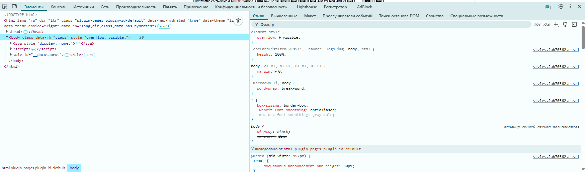

import HTMLPlayground from '@site/src/components/HTMLPlayground.js';
import CssHtmlBridgePlay from '@site/src/components/CssHtmlBridgePlay';

# Подключение и организация CSS-кода

<div class="article-tags">
  <span class="tag tag-required">ОБЯЗАТЕЛЬНО</span>
  <span class="tag tag-beginner">ДЛЯ НОВИЧКОВ</span>
</div>

<span class="complexity-badge">Разработчику</span>
<span class="complexity-badge">Аналитику</span>
<span class="complexity-badge">Тестировщику</span>  
<span class="complexity-badge">Архитектору</span>
<span class="complexity-badge">Инженеру</span>

---

## Работа с CSS

### Порядок работы

CSS представляет собой что-то вроде стилизатора HTML-страниц, поэтому браузер обрабатывает стили поверх скелета страницы.

Мы должны сформировать структуру в HTML, и лишь потом применять к ней стили.

Когда браузер встречает тег `<style>`, он отмечает, что для построения CSSOM, ему потребуется руководствоваться инструкциями из этого тега.


★ Как работает CSS?
	- Браузер загружает HTML и строит DOM (объектную модель документа);
	- Браузер загружает CSS и формирует CSSOM (объектную модель CSS);
	- DOM и CSSOM объединяются в Render Tree – дерево отрисовки, где каждому элементу присваиваются стили;
	- Браузер отображает страницу на основе дерева отрисовки.

<CssHtmlBridgePlay />


---

### Добавление

★ **Как добавить CSS в HTML?**

1. Встроенные стили (в теге через `style=`);
2. Внутри HTML (добавив тег `<style></style>`);
3. Внешний файл:
```html
<link rel="stylesheet" href="style.css">
```

<div class="callout callout--tip">
  <div class="callout-title">Интересный факт</div>

  <div class="callout-body">
До появления HTML5 и CSS3 анимации и интерактивность реализовывались через Flash. Сегодня всё это можно сделать даже в CSS, что делало его даже движком интерфейсов.
</div>
  </div>


<HTMLPlayground />

Связка «HTML в `<body>` + стили в `<style>`» разобрана на полных страницах — [HTML + CSS — готовые макеты](/lab/Примеры/110). Только разметка в одном `.html` — [HTML-страницы целиком](/lab/Примеры/1153). Вариант со стилями через utility-классы и CDN — [Tailwind — готовые блоки](/lab/Примеры/1117).

---

### Встроенные стили (inline styles)

Встроенные стили применяются непосредственно к отдельному HTML-элементу с помощью атрибута `style`. Этот атрибут содержит одну или несколько пар "свойство: значение", разделённых точкой с запятой.

Когда браузер обрабатывает HTML-документ, он читает атрибут `style` у элемента и применяет указанные CSS-правила только к этому конкретному элементу. Эти стили имеют наивысший приоритет в каскаде (выше, чем у правил из `<style>` или внешних файлов), за исключением правил с флагом `!important`.

```html
<p style="color: blue; font-size: 18px;">Этот абзац синий и крупный.</p>

<div style="background-color: #f0f0f0; padding: 20px; border-radius: 8px;">
  Блок с серым фоном и скруглёнными углами.
</div>

<span style="font-weight: bold; text-decoration: underline;">
  Жирный и подчёркнутый текст.
</span>
```

Особенности использования

- Встроенные стили применяются только к одному элементу.
- Они не поддерживают псевдоклассы (`:hover`, `:focus`) и медиавыражения (`@media`).
- Их использование рекомендуется ограничивать случаями, когда стили динамически генерируются (например, через JavaScript) или когда нужно быстро переопределить внешний вид одного элемента без изменения глобальных стилей.
- Чрезмерное применение встроенных стилей усложняет поддержку кода и нарушает принцип разделения содержимого и оформления.

---

### Тег `<style>`: внутренние стили

Тег `<style>` позволяет определить CSS-правила внутри самого HTML-документа. Обычно он размещается в секции `<head>`, хотя технически может находиться и в `<body>` (в современных браузерах это допустимо, но не рекомендуется).

Браузер считывает содержимое тега `<style>` как блок CSS-правил и применяет их ко всем соответствующим элементам на странице. Эти правила действуют только в рамках текущего документа.

Основные атрибуты:

- **`type`** — раньше использовался для указания MIME-типа (`type="text/css"`). В HTML5 этот атрибут не обязателен, так как `text/css` является значением по умолчанию.
- **`media`** — определяет, для каких устройств или условий применяются стили. Примеры: `screen`, `print`, `speech`, а также медиавыражения вроде `(max-width: 768px)`.
- **`nonce`** — используется для обеспечения безопасности при работе с Content Security Policy (CSP). Значение должно совпадать с тем, что указано в заголовках HTTP.

```html
<!DOCTYPE html>
<html lang="ru">
<head>
  <meta charset="UTF-8">
  <title>Пример внутренних стилей</title>
  <style media="screen">
    body {
      font-family: Arial, sans-serif;
      background-color: #fafafa;
    }
    h1 {
      color: #2c3e50;
    }
    .highlight {
      background-color: yellow;
    }
  </style>
</head>
<body>
  <h1>Заголовок</h1>
  <p class="highlight">Этот абзац выделен жёлтым.</p>
</body>
</html>
```

Особенности

- Внутренние стили удобны для одиночных страниц или прототипов.
- Они не могут быть переиспользованы на других страницах без копирования.
- Поддерживают все возможности CSS: селекторы, псевдоклассы, медиавыражения, `@import`, `@keyframes` и другие at-правила.
- При большом объёме стилей увеличивают размер HTML-файла, что замедляет загрузку.


---

### Тег `<link>`: подключение внешних таблиц стилей

Тег `<link>` используется для подключения внешних ресурсов к HTML-документу. Наиболее распространённое применение — подключение CSS-файлов.

Браузер отправляет HTTP-запрос по указанному пути (`href`) и загружает CSS-файл. После загрузки и парсинга содержимое файла применяется ко всему документу. Этот процесс может быть заблокирован рендерингом (в случае `rel="stylesheet"` без атрибута `media`, не соответствующего текущему устройству), поэтому важно оптимизировать количество и размер подключаемых файлов.

Основные атрибуты

- **`rel`** — обязательный атрибут. Для CSS всегда имеет значение `"stylesheet"`. Указывает тип связи между текущим документом и подключаемым ресурсом.
- **`href`** — путь к файлу стилей. Может быть:
  - относительным: `styles/main.css`
  - абсолютным: `/assets/css/reset.css`
  - полным URL: `https://example.com/styles/theme.css`
- **`type`** — MIME-тип ресурса. Для CSS — `text/css`. В HTML5 не обязателен.
- **`media`** — определяет, для каких устройств или условий применяется таблица стилей. Примеры:
  - `media="print"` — стили для печати
  - `media="(max-width: 600px)"` — адаптивные стили для мобильных устройств
  - Если не указан, по умолчанию `media="all"`
- **`crossorigin`** — управляет CORS-запросами при загрузке ресурсов с другого домена. Возможные значения: `anonymous`, `use-credentials`.
- **`integrity`** — используется для Subresource Integrity (SRI). Содержит хеш содержимого файла, чтобы браузер мог проверить его целостность.
- **`disabled`** — если присутствует, таблица стилей временно отключается (редко используется).

Атрибут `rel="stylesheet"` сообщает браузеру, что подключаемый ресурс является таблицей стилей и должен быть применён к документу. Это стандартный способ подключения CSS.

CSS следует принципу каскадирования: если несколько правил применяются к одному элементу, побеждает то, которое:
- Имеет более высокую специфичность селектора,
- Расположено ниже в порядке объявления.

Поэтому порядок подключения файлов через `<link>` важен:

```html
<link rel="stylesheet" href="reset.css">
<link rel="stylesheet" href="base.css">
<link rel="stylesheet" href="components.css">
<link rel="stylesheet" href="theme.css">
```

В этом примере `theme.css` может переопределять стили из предыдущих файлов.

Технически, подключить можно любое количество файлов. Однако каждый `<link>` создаёт отдельный HTTP-запрос (если не используется HTTP/2 или HTTP/3 с мультиплексированием). Поэтому на практике:
- Рекомендуется объединять стили в один или несколько логических файлов.
- Для больших проектов применяют сборщики (Webpack, Vite, Parcel), которые минифицируют и объединяют CSS.

Условия и правила

- Файл должен быть доступен по указанному пути.
- Должен содержать корректный CSS (браузер проигнорирует синтаксические ошибки, но правило не применится).
- При использовании `media`, стили применяются только если условие истинно.
- Внешние стили имеют меньший приоритет, чем встроенные, но больший, чем браузерные стили по умолчанию.

---

### Подключение онлайн-библиотек, сторонних стилей и шрифтов

Можно подключать CSS-ресурсы с удалённых серверов, включая библиотеки, фреймворки и шрифты.

Популярные CSS-фреймворки (Bootstrap, Tailwind CSS, Bulma) часто предоставляют CDN-ссылки:

```html
<link rel="stylesheet" href="https://cdn.jsdelivr.net/npm/bootstrap@5.3.3/dist/css/bootstrap.min.css">
```

**Tailwind CSS** на учебных страницах часто подключают скриптом Play CDN — классы пишут прямо в HTML:

```html
<script src="https://cdn.tailwindcss.com"></script>
```

Готовые блоки (карточка, navbar, grid, форма, hero) с **разбором каждого класса** — [Tailwind — готовые блоки](/lab/Примеры/1117). Сначала Flex/Grid на чистом CSS — [HTML + CSS — готовые макеты](/lab/Примеры/110).

Преимущества:
- Быстрое подключение без локальной установки.
- Возможность кэширования в браузере пользователя (если другие сайты используют тот же CDN).
- Автоматические обновления (при осторожном использовании).

Риски:
- Зависимость от внешнего сервиса (если CDN недоступен, стили не загрузятся).
- Потенциальные проблемы с безопасностью и конфиденциальностью (трекинг, отпечатки браузера).

Сервисы вроде Google Fonts позволяют подключать кастомные шрифты:

```html
<link rel="preconnect" href="https://fonts.googleapis.com">
<link rel="preconnect" href="https://fonts.gstatic.com" crossorigin>
<link href="https://fonts.googleapis.com/css2?family=Roboto:wght@400;700&display=swap" rel="stylesheet">
```

После подключения шрифт можно использовать в CSS:

```css
body {
  font-family: 'Roboto', sans-serif;
}
```

Подключение CSS с любого публичного URL технически возможно, если сервер разрешает CORS и не блокирует запросы. Однако:
- Не следует подключать стили с ненадёжных источников — это может привести к XSS-атакам или утечке данных.
- Некоторые сайты намеренно блокируют внешнее использование своих ресурсов через заголовки `Content-Security-Policy` или `X-Frame-Options`.

Рекомендации по безопасности

- Используйте атрибут `integrity` при подключении через CDN:
```html
  <link rel="stylesheet"
        href="https://example.com/style.css"
        integrity="sha384-...">
```
- Настройте Content Security Policy (CSP) на своём сайте, чтобы контролировать, откуда можно загружать стили.
- По возможности хостите критически важные стили локально, особенно для production-сред.

---

### Инструменты управления внешним видом

Страницы можно не только раскрашивать и располагать, но и добавлять более продвинутые фишки, к примеру, заставить объекты двигаться, динамически изменять свой внешний вид.

CSS предоставляет мощные инструменты для управления внешним видом и поведением элементов:
	- Трансформации и анимации — добавляют движение.
	- Блочная модель — основа компоновки.
	- Позиционирование — контроль над расположением.
	- Фон и текст — визуальная выразительность.
	- Эффекты — завершающие штрихи.

**Трансформация** — изменение внешнего вида элемента без влияния на поток документа: его положение, размер и поведение для соседей остаются неизменными.
  
Основные функции:  
- `translate(x, y)` — смещение по горизонтали и вертикали;  
- `scale(n)` — масштабирование (увеличение/уменьшение);  
- `rotate(angle)` — поворот на заданный угол;  
- `skew(ax, ay)` — наклон по осям;  
- `matrix()` — произвольная аффинная трансформация. 
 
Трансформации исполняются на GPU и почти не нагружают CPU, что делает их оптимальными для интерактивных эффектов. Могут применяться к 2D- и 3D-пространству.

**Анимация** — последовательное изменение стилевых свойств элемента во времени, создающее ощущение движения или перехода.
  
CSS-анимации строятся на двух составляющих:  
1. **@keyframes** — описание ключевых кадров, где задаются начальное, промежуточные и конечное состояния;  
2. **свойства `animation-`** — параметры воспроизведения: длительность, задержка, количество повторов, направление, плавность, имя анимации.
  
Пример использования: кнопка, которая плавно "прыгает" при наведении, или индикатор загрузки, вращающийся бесконечно. 
 
Анимации управляются целиком через CSS, без JavaScript, если не требуется сложная логика взаимодействия. Готовые файлы (fade in, спиннер, pulse, hover-кнопка) с построчным разбором — [CSS-анимации — готовые эффекты](/lab/Примеры/1116).

**Позиционирование** — способ размещения элемента на странице относительно других элементов или области просмотра.

CSS предлагает пять значений `position`, которые стоит знать при вёрстке:

- `static` — положение по умолчанию, элемент участвует в обычном потоке документа.
- `relative` — смещение относительно исходного положения в потоке; зарезервированное место сохраняется.
- `absolute` — элемент вынимается из потока и позиционируется относительно ближайшего спозиционированного предка (`relative`, `absolute`, `fixed`, `sticky`). Без такого предка — относительно области `<html>`.
- `fixed` — элемент привязан к viewport и остаётся на месте при прокрутке страницы.
- `sticky` — гибрид `relative` и `fixed`: в потоке до порога прокрутки, затем «прилипает» к заданному краю.

Координаты задают `top`, `right`, `bottom`, `left` (или `inset`). Позиционирование нужно для всплывающих подсказок, модальных окон, бейджей на карточках и липких шапок. Подробнее с примерами и таблицей — в разделе [position в основных стилях](./3.md#position); синтаксис свойств — в [справочнике](./71.md#position).

---

## Как проверять и отлаживать стили

### Консоль разработчика и инструменты отладки 
 
Браузеры предоставляют встроенные инструменты разработчика — DevTools — которые позволяют исследовать и изменять стили в реальном времени.  



В панели **Elements** (или "Элементы") отображается DOM-дерево страницы. При выборе любого элемента справа появляется панель **Styles**, где перечисляются все CSS-правила, применяемые к этому элементу:  
- активные правила отмечаются галочкой;  
- перечёркнутые свойства — те, что были переопределены другими, более приоритетными правилами;  
- рядом с каждым правилом указан источник: имя файла стилей и номер строки;  
- можно прямо в панели редактировать значения — изменения мгновенно отражаются на странице;  
- есть возможность временно отключать правила, ставя/снимая галочку слева от строки с селектором.  

Также доступны:  
- вкладка **Computed** — показывает итоговые вычисленные значения всех CSS-свойств для элемента, сгруппированные по категориям (цвет, размеры, отступы и т.д.);  
- интерактивные инструменты: "инспектор элемента" (значок курсора), "режим для устройств" (адаптивный просмотр под разные экраны), "отслеживание медиазапросов".

Эти инструменты критически важны для понимания того, какие стили реально работают, и почему элемент выглядит именно так.

---

### Агент пользователя и стили по умолчанию  

Агент пользователя — это браузер. У каждого браузера есть своя реализация так называемых **стилей по умолчанию** — базовый CSS, который применяется ко всем HTML-элементам, если разработчик не задал своих.  

Например:  
- `<h1>` по умолчанию крупный, жирный, с отступами сверху и снизу;  
- `<ul>` имеет отступ слева и маркеры у пунктов;  
- `<a>` — синий и подчёркнутый.  

Эти стили встроены в движок браузера (Blink в Chrome, Gecko в Firefox и т.д.). Они могут немного различаться между браузерами — именно поэтому дизайнеры часто подключают **CSS-ресеты** (например, `normalize.css`) — небольшие файлы, сглаживающие различия и приводящие стартовую точку к единому виду.  

В DevTools стили агента пользователя отображаются в нижней части панели Styles, в разделе `user agent stylesheet`. Их можно просмотреть, но не отредактировать напрямую — только переопределить своими правилами.

---

### Таблица стилей
  
Таблица стилей — это полный набор CSS-правил, загруженных для текущей страницы:  
- внешние файлы, подключённые через `<link rel="stylesheet">`;  
- внутренние стили из тега `<style>` в `<head>`;  
- встроенные стили через атрибут `style=""`.  

Браузер парсит все эти источники, объединяет их в единую CSSOM (CSS Object Model) — древовидную структуру, где каждое правило привязано к элементам DOM.  

Таблица стилей не фиксирована: можно динамически добавлять или удалять `<style>` и `<link>` через JavaScript — браузер обновит CSSOM и пересчитает отображение.  

Важно: таблица стилей — глобальный ресурс страницы. Даже если правило написано в самом конце файла, оно участвует в расчёте стилей для всех элементов, на которые распространяется селектор.

---

### Наследование стилей
  
Некоторые CSS-свойства передаются от родительского элемента к дочерним — это называется **наследованием**.  

Примеры наследуемых свойств:  
- `color` — цвет текста;  
- `font-family`, `font-size`, `line-height`;  
- `text-align`, `letter-spacing`;  
- `visibility`.  

Если у `<div>` задан `color: darkblue`, то весь текст внутри его дочерних элементов (`<p>`, `<span>`, `<a>` и т.д.) будет тёмно-синим — если только явно не переопределить.  

Наследуются только вычисленные значения, и только если дочерний элемент не имеет собственного объявления.  

Существуют три ключевых ключевых слова, управляющих наследованием:  
- `inherit` — явно указать: "возьми значение у родителя";  
- `initial` — сбросить к значению по умолчанию для этого свойства (не путать со стилями браузера);  
- `unset` — "верни поведение по умолчанию": если свойство наследуемое — действует как `inherit`, если нет — как `initial`.

---

### Иерархия применения стилей
  
Браузер строит итоговый внешний вид элемента по строгой иерархии:  

1. **Источник объявления**  
   Приоритет:  
   - `!important` в стилях пользователя (если заданы);  
   - `!important` в авторских стилях (ваши CSS);  
   - обычные авторские стили;  
   - `!important` в стилях агента пользователя — почти не встречается;  
   - стили агента пользователя (по умолчанию).  

2. **Специфичность селектора**  
   Рассчитывается по формуле *(в порядке убывания веса)*:  
   - инлайн-стили (`style=""`) — вес 1000;  
   - идентификаторы (`#id`) — 100 за каждый;  
   - классы, псевдоклассы, атрибуты (`[type]`, `:hover`, `.btn`) — 10 за каждый;  
   - теги и псевдоэлементы (`p`, `::before`) — 1 за каждый.  
   Пример: `#header .nav-item:hover` → 100 + 10 + 10 = 120.  

3. **Порядок следования**  
   При равной специфичности выигрывает правило, объявленное позже в таблице стилей — или позже по порядку загрузки файлов.

---

## Особенности работы с CSS

### Порядок записи правил в CSS-файле  

CSS **не требует** соблюдения строгого порядка объявления правил. Можно писать стили в любом порядке — сначала для заголовков, потом для кнопок, затем снова для заголовков, если это удобно для организации кода.  

При сборке итоговой таблицы стилей браузер учитывает:  
- порядок подключения CSS-файлов в HTML;  
- порядок правил *внутри одного файла* — позже объявленное правило имеет приоритет при равной специфичности.  

Это позволяет группировать стили логически: например, вынести все анимации в конец файла, или собрать все адаптивные медиазапросы отдельным блоком. Никаких технических ограничений нет.

---

### Повторное объявление одного и того же свойства  

Для одного элемента можно несколько раз задать одно и то же CSS-свойство — в одном правиле, в разных правилах, даже в одном селекторе.  

Пример:
```css
.button {
  color: red;
  font-size: 14px;
  color: blue;
}
```

В этом случае браузер применит последнее объявление в рамках одного блока: `color: blue`.  

Если повторение происходит в разных правилах:
```css
.highlight { color: yellow; }
.button { color: red; }
.highlight.button { color: green; }
```
…и элемент имеет оба класса — `<div class="button highlight">`, то сработает правило с наибольшей специфичностью (`highlight.button` = 20), и цвет будет `green`.  

Если специфичность равна — побеждает позже объявленное правило в порядке загрузки.

---

### Директива `!important`

`!important` — модификатор, прикрепляемый к значению свойства:
```css
.title {
  color: red !important;
}
```

Он повышает приоритет этого объявления до максимального уровня в своей категории (авторских стилей).  

`!important` применяется **только к одному свойству**, а не ко всему блоку. В примере выше `color` получает высший приоритет, но другие свойства (`font-size`, `margin`) — нет.  

Когда `!important` уместен:  
- быстрая отладка в DevTools (браузеры добавляют его автоматически при редактировании);  
- переопределение сторонних библиотек, где нет контроля над исходным CSS;  
- экстренные исправления, когда переписать селектор невозможно.  

Рекомендуется избегать `!important` в основной кодовой базе — это нарушает естественную иерархию каскада, затрудняет поддержку и усложняет поиск конфликтов. Лучше повышать специфичность селектора или перестраивать архитектуру стилей.

---

### Наследование

Некоторые CSS-свойства автоматически передаются от родительского элемента к дочерним. Это называется **наследованием**. К таким свойствам относятся:
- `color`, `font-family`, `font-size`, `line-height`;
- `text-align`, `letter-spacing`, `visibility`.

Наследование можно управлять явно с помощью ключевых слов:
- `inherit` — взять значение у родителя;
- `initial` — сбросить до начального значения, определённого в спецификации CSS;
- `unset` — применить поведение по умолчанию: `inherit` для наследуемых свойств, `initial` — для остальных.

---

### Контекст наложения

Контекст наложения — это трёхмерная система, определяющая, какие элементы отображаются поверх других. По умолчанию элементы рисуются в порядке следования в HTML: более поздние — ближе к пользователю.

Свойство `z-index` работает только внутри **позиционированного контекста наложения**. Новый контекст создаётся, когда элемент имеет:
- `position` со значением `relative`, `absolute`, `fixed` или `sticky` и `z-index`, отличный от `auto`;
- `opacity` меньше `1`;
- `transform`, `filter`, `mix-blend-mode`, отличные от значений по умолчанию;
- `isolation: isolate`.

Важно: элементы внутри одного контекста не могут быть визуально выше элементов из другого контекста, если их родительский контекст находится ниже. Это объясняет, почему иногда даже `z-index: 999999` не помогает — элемент "заперт" в своём контексте.

---

### Подход Pixel Perfect

Pixel Perfect — это методология вёрстки, при которой финальный результат в браузере должен в точности соответствовать графическому макету (например, в Figma или Photoshop) по каждому пикселю. Такой подход требует:
- точного соблюдения размеров, отступов, шрифтов;
- использования абсолютных единиц (`px`) вместо относительных (`em`, `rem`, `%`);
- внимательной проверки на разных устройствах и масштабах.

Хотя Pixel Perfect ценится в дизайне, в практике веб-разработки он часто уступает место **адаптивности** и **гибкости**, так как экраны пользователей сильно различаются.

---

### Mobile-first и Desktop-first

Это два подхода к созданию адаптивных стилей:

- **Mobile-first** — базовые стили пишутся для мобильных устройств, а медиазапросы с `min-width` добавляют улучшения для больших экранов. Это современный, рекомендуемый подход. Он обеспечивает лучшую производительность и прогрессивное улучшение.

- **Desktop-first** — базовые стили ориентированы на большие экраны, а медиазапросы с `max-width` упрощают макет для мобильных. Этот подход устарел, но встречается в легаси-проектах.

Пример mobile-first:
```css
.card { padding: 10px; }
@media (min-width: 768px) {
  .card { padding: 20px; }
}
```

---

### Свойство `all`

Свойство `all` сбрасывает все стили элемента до указанного значения. Возможные значения:
- `initial` — все свойства принимают начальные значения;
- `inherit` — все свойства наследуются от родителя;
- `unset` — каждое свойство ведёт себя по умолчанию (наследуется или сбрасывается).

Пример:
```css
.reset {
  all: initial;
}
```
Это полезно для создания "чистых" компонентов, не зависящих от внешних стилей.

<div class="callout callout--tip">
  <div class="callout-title">Порядок слоёв</div>

  <div class="callout-body">
  Явная иерархия reset → base → components → utilities — в главе <a href="./115.md">Каскадные слои @layer</a>.
</div>
  </div>


---

{/* http-basics-link  */}
<div class="callout callout--tip">
  <div class="callout-title">Основа по протоколу</div>

  <div class="callout-body">
  Базовый разбор HTTP и HTTPS находится в отдельной статье — [HTTP как основа веб-интеграций](/encyclopedia/2-system-network/2-09-osnovy-integratsionnogo-vzaimodeystviya/118).
</div>
  </div>


