import HTMLPlayground from '@site/src/components/HTMLPlayground.js';

# Типовые элементы интерфейса

<div class="article-tags">
  <span class="tag tag-required">ОБЯЗАТЕЛЬНО</span>
  <span class="tag tag-beginner">ДЛЯ НОВИЧКОВ</span>
</div>

<span class="complexity-badge">Разработчику</span>
<span class="complexity-badge">Аналитику</span>
<span class="complexity-badge">Тестировщику</span>  
<span class="complexity-badge">Архитектору</span>
<span class="complexity-badge">Инженеру</span>

## Типовые элементы интерфейса

Мы разберём различные примеры типовых элементов интерфейса, в формате HTML и CSS. Можете добавлять и экспериментировать - для удобства, в HTML-части будет создаваться элемент, а в CSS - стиль.

Можете создать минимальную страницу, к примеру, `test.html`, и добавлять новые элементы, к примеру, в `<body></body>` и добавить файл `style.css`.

```
<!DOCTYPE html>
<html>
  <head>
    <title>Пример</title>
	<link rel="stylesheet" href="style.css">
  </head>
  <body>
    <h1>Привет!</h1>
    <p>Это параграф.</p>
  </body>
</html>
```

Можете также использовать и интерактивный режим, но тогда ограничьтесь inline и тегом `<style>`.

<HTMLPlayground />

---

## Цвета

Цветовая палитра задаётся через CSS-переменные в корне документа. Это упрощает управление темами и повторное использование значений.

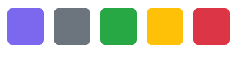

```html
<div class="color-palette">
  <div class="color-item primary"></div>
  <div class="color-item secondary"></div>
  <div class="color-item success"></div>
  <div class="color-item warning"></div>
  <div class="color-item danger"></div>
</div>
```

```css
:root {
  --color-primary: #7B68EE;
  --color-secondary: #6C757D;
  --color-success: #28A745;
  --color-warning: #FFC107;
  --color-danger: #DC3545;
  --color-light: #F8F9FA;
  --color-dark: #212529;
}

.color-palette {
  display: flex;
  gap: 1rem;
  padding: 1rem;
}

.color-item {
  width: 60px;
  height: 60px;
  border-radius: 8px;
}

.color-item.primary { background-color: var(--color-primary); }
.color-item.secondary { background-color: var(--color-secondary); }
.color-item.success { background-color: var(--color-success); }
.color-item.warning { background-color: var(--color-warning); }
.color-item.danger { background-color: var(--color-danger); }
```

---

## Шрифты

Шрифты настраиваются глобально через `body` и дополняются классами для заголовков и текстовых блоков.

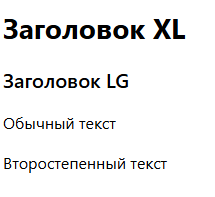

```html
<h1 class="heading-xl">Заголовок XL</h1>
<h2 class="heading-lg">Заголовок LG</h2>
<p class="text-body">Обычный текст</p>
<p class="text-muted">Второстепенный текст</p>
```

```css
:root {
  --font-family-base: -apple-system, BlinkMacSystemFont, 'Segoe UI', Roboto, sans-serif;
  --font-size-base: 1rem;
  --font-size-lg: 1.25rem;
  --font-size-xl: 1.75rem;
  --font-weight-normal: 400;
  --font-weight-semibold: 600;
  --font-weight-bold: 700;
  --line-height-base: 1.5;
}

body {
  font-family: var(--font-family-base);
  font-size: var(--font-size-base);
  font-weight: var(--font-weight-normal);
  line-height: var(--line-height-base);
  color: var(--color-dark);
}

.heading-xl {
  font-size: var(--font-size-xl);
  font-weight: var(--font-weight-bold);
  margin-bottom: 1rem;
}

.heading-lg {
  font-size: var(--font-size-lg);
  font-weight: var(--font-weight-semibold);
  margin-bottom: 0.75rem;
}

.text-body {
  margin-bottom: 1rem;
}

.text-muted {
  color: var(--color-secondary);
}
```

---

## Ссылки

Ссылки стилизуются с учётом состояний: обычное, наведение, фокус, активное.

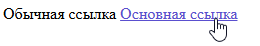

```html
<a href="#" class="link">Обычная ссылка</a>
<a href="#" class="link link--primary">Основная ссылка</a>
```

```css
.link {
  color: var(--color-primary);
  text-decoration: none;
  transition: color 0.2s ease;
}

.link:hover,
.link:focus {
  color: var(--color-dark);
  text-decoration: underline;
}

.link--primary {
  font-weight: var(--font-weight-semibold);
}

.link--primary:hover,
.link--primary:focus {
  color: #5A4FCF;
}
```

---

## Таблицы

Таблицы оформлены с чётким разделением строк и возможностью выделения заголовков.

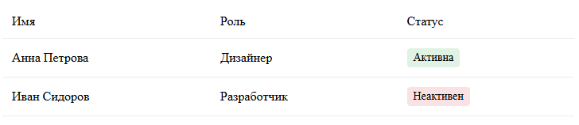

```html
<table class="table">
  <thead>
    <tr>
      <th>Имя</th>
      <th>Роль</th>
      <th>Статус</th>
    </tr>
  </thead>
  <tbody>
    <tr>
      <td>Анна Петрова</td>
      <td>Дизайнер</td>
      <td><span class="status status--active">Активна</span></td>
    </tr>
    <tr>
      <td>Иван Сидоров</td>
      <td>Разработчик</td>
      <td><span class="status status--inactive">Неактивен</span></td>
    </tr>
  </tbody>
</table>
```

```css
.table {
  width: 100%;
  border-collapse: collapse;
  margin-bottom: 1.5rem;
}

.table th,
.table td {
  padding: 0.75rem;
  text-align: left;
  border-bottom: 1px solid #E9ECEF;
}

.table th {
  font-weight: var(--font-weight-semibold);
  color: var(--color-dark);
  background-color: var(--color-light);
}

.status {
  display: inline-block;
  padding: 0.25rem 0.5rem;
  border-radius: 4px;
  font-size: 0.875rem;
  font-weight: var(--font-weight-semibold);
}

.status--active {
  background-color: rgba(40, 167, 69, 0.15);
  color: var(--color-success);
}

.status--inactive {
  background-color: rgba(220, 53, 69, 0.15);
  color: var(--color-danger);
}
```

---

## Карточки

Карточки — универсальный контейнер для группировки информации.

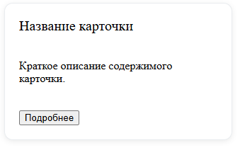

```html
<div class="card">
  <div class="card-header">
    <h3 class="card-title">Название карточки</h3>
  </div>
  <div class="card-body">
    <p>Краткое описание содержимого карточки.</p>
  </div>
  <div class="card-footer">
    <button class="button button--primary">Подробнее</button>
  </div>
</div>
```

```css
.card {
  background-color: #FFFFFF;
  border: 1px solid #E9ECEF;
  border-radius: 12px;
  box-shadow: 0 2px 8px rgba(0, 0, 0, 0.08);
  overflow: hidden;
  max-width: 320px;
}

.card-header {
  padding: 1.25rem 1.25rem 0;
}

.card-body {
  padding: 1.25rem;
}

.card-footer {
  padding: 0 1.25rem 1.25rem;
}

.card-title {
  font-size: 1.25rem;
  font-weight: var(--font-weight-bold);
  margin: 0;
}
```

---

## Кнопки

Кнопки реализованы как набор модификаторов к базовому классу.

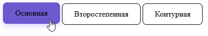

```html
<button class="button button--primary">Основная</button>
<button class="button button--secondary">Второстепенная</button>
<button class="button button--outline">Контурная</button>
<button class="button button--danger">Опасная</button>
```

```css
.button {
  display: inline-flex;
  align-items: center;
  justify-content: center;
  gap: 0.5rem;
  font-family: inherit;
  font-size: 1rem;
  font-weight: var(--font-weight-semibold);
  cursor: pointer;
  border: 1px solid transparent;
  border-radius: 8px;
  padding: 0.75rem 1.5rem;
  transition: all 0.2s ease;
  text-decoration: none;
  outline: none;
}

.button--primary {
  background-color: var(--color-primary);
  color: white;
  border-color: var(--color-primary);
}

.button--primary:hover {
  background-color: #6A5ACD;
  border-color: #6A5ACD;
  transform: translateY(-2px);
  box-shadow: 0 4px 12px rgba(123, 104, 238, 0.3);
}

.button--secondary {
  background-color: var(--color-secondary);
  color: white;
  border-color: var(--color-secondary);
}

.button--secondary:hover {
  background-color: #5A6268;
  border-color: #5A6268;
}

.button--outline {
  background-color: transparent;
  color: var(--color-primary);
  border-color: var(--color-primary);
}

.button--outline:hover {
  background-color: rgba(123, 104, 238, 0.1);
}

.button--danger {
  background-color: var(--color-danger);
  color: white;
  border-color: var(--color-danger);
}

.button--danger:hover {
  background-color: #C82333;
  border-color: #C82333;
}
```

---

## Поля ввода

Поля ввода стилизуются с учётом состояний: обычное, фокус, ошибка, отключённое.

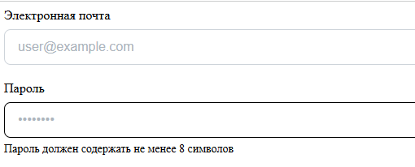

```html
<div class="form-group">
  <label for="email">Электронная почта</label>
  <input type="email" id="email" class="input" placeholder="user@example.com">
</div>

<div class="form-group">
  <label for="password">Пароль</label>
  <input type="password" id="password" class="input input--error" placeholder="••••••••">
  <span class="input-hint">Пароль должен содержать не менее 8 символов</span>
</div>
```

```css
.form-group {
  margin-bottom: 1.25rem;
}

.form-group label {
  display: block;
  font-weight: var(--font-weight-semibold);
  margin-bottom: 0.5rem;
  color: var(--color-dark);
}

.input {
  width: 100%;
  padding: 0.75rem 1rem;
  font-size: 1rem;
  border: 1px solid #CED4DA;
  border-radius: 8px;
  background-color: #FFFFFF;
  transition: border-color 0.2s ease, box-shadow 0.2s ease;
  outline: none;
}

.input:focus {
  border-color: var(--color-primary);
  box-shadow: 0 0 0 3px rgba(123, 104, 238, 0.2);
}

.input::placeholder {
  color: #ADB5BD;
}

.input--error {
  border-color: var(--color-danger);
}

.input--error:focus {
  box-shadow: 0 0 0 3px rgba(220, 53, 69, 0.2);
}

.input-hint {
  display: block;
  margin-top: 0.375rem;
  font-size: 0.875rem;
  color: var(--color-secondary);
}

.input-hint.error {
  color: var(--color-danger);
}
```

---

## Выпадающие списки (select)

Стилизация нативного `<select>` ограничена, поэтому часто используют кастомные реализации. Здесь — базовый вариант с улучшенным внешним видом.

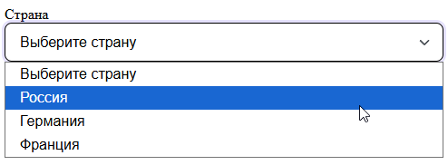

```html
<div class="form-group">
  <label for="country">Страна</label>
  <select id="country" class="select">
    <option value="">Выберите страну</option>
    <option value="ru">Россия</option>
    <option value="de">Германия</option>
    <option value="fr">Франция</option>
  </select>
</div>
```

```css
.select {
  width: 100%;
  padding: 0.75rem 2.5rem 0.75rem 1rem;
  font-size: 1rem;
  background-color: #FFFFFF;
  border: 1px solid #CED4DA;
  border-radius: 8px;
  appearance: none;
  background-image: url("data:image/svg+xml,%3csvg xmlns='http://www.w3.org/2000/svg' viewBox='0 0 16 16'%3e%3cpath fill='none' stroke='%23343a40' stroke-linecap='round' stroke-linejoin='round' stroke-width='2' d='m2 5 6 6 6-6'/%3e%3c/svg%3e");
  background-repeat: no-repeat;
  background-position: right 0.75rem center;
  background-size: 16px 12px;
  cursor: pointer;
}

.select:focus {
  border-color: var(--color-primary);
  outline: none;
  box-shadow: 0 0 0 3px rgba(123, 104, 238, 0.2);
}
```

---

## Слайдеры (range)

Слайдер оформляется с использованием псевдоэлементов WebKit и Mozilla.

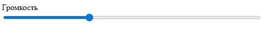

```html
<div class="form-group">
  <label for="volume">Громкость</label>
  <input type="range" id="volume" class="slider" min="0" max="100" value="70">
</div>
```

```css
.slider {
  width: 100%;
  height: 6px;
  /*-webkit-appearance: none;*/
  background: #E9ECEF;
  border-radius: 3px;
  outline: none;
}

.slider::-webkit-slider-thumb {
  -webkit-appearance: none;
  width: 20px;
  height: 20px;
  background: var(--color-primary);
  border-radius: 50%;
  cursor: pointer;
  transition: transform 0.2s ease;
}

.slider::-moz-range-thumb {
  width: 20px;
  height: 20px;
  background: var(--color-primary);
  border: none;
  border-radius: 50%;
  cursor: pointer;
  transition: transform 0.2s ease;
}

.slider::-webkit-slider-thumb:hover,
.slider::-moz-range-thumb:hover {
  transform: scale(1.2);
}
```

---

## Переключатели (switch)

Переключатель реализуется через `<input type="checkbox">` с обёрткой и псевдоэлементами.

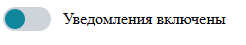

```html
<div class="form-group">
  <label class="switch">
    <input type="checkbox" checked>
    <span class="switch-track"></span>
    Уведомления включены
  </label>
</div>
```

```css
.switch {
  display: inline-flex;
  align-items: center;
  gap: 0.75rem;
  cursor: pointer;
  user-select: none;
}

.switch input {
  position: absolute;
  opacity: 0;
  width: 0;
  height: 0;
}

.switch-track {
  position: relative;
  display: inline-block;
  width: 48px;
  height: 24px;
  background-color: #CED4DA;
  border-radius: 12px;
  transition: background-color 0.2s ease;
}

.switch-track::before {
  position: absolute;
  content: "";
  height: 20px;
  width: 20px;
  left: 2px;
  bottom: 2px;
  background-color: rgb(15, 134, 155);
  border-radius: 50%;
  transition: transform 0.2s ease;
}

.switch input:checked + .switch-track {
  background-color: var(--color-primary);
}

.switch input:checked + .switch-track::before {
  transform: translateX(24px);
}
```

---

## Чекбоксы

Чекбоксы стилизуются аналогично переключателям, но с квадратной формой.

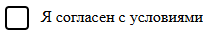

```html
<div class="form-group">
  <label class="checkbox">
    <input type="checkbox" checked>
    <span class="checkbox-box"></span>
    Я согласен с условиями
  </label>
</div>
```

```css
.checkbox {
  display: flex;
  align-items: flex-start;
  gap: 0.75rem;
  cursor: pointer;
  user-select: none;
  line-height: 1.4;
}

.checkbox input {
  position: absolute;
  opacity: 0;
  width: 0;
  height: 0;
}

.checkbox-box {
  position: relative;
  display: inline-block;
  width: 20px;
  height: 20px;
  border: 2px solid #CED4DA;
  border-radius: 4px;
  background-color: rgb(122, 73, 73);
  flex-shrink: 0;
  transition: border-color 0.2s ease, background-color 0.2s ease;
}

.checkbox input:focus + .checkbox-box {
  border-color: var(--color-primary);
  box-shadow: 0 0 0 3px rgba(123, 104, 238, 0.2);
}

.checkbox input:checked + .checkbox-box {
  background-color: var(--color-primary);
  border-color: var(--color-primary);
}

.checkbox input:checked + .checkbox-box::after {
  content: "✓";
  position: absolute;
  top: 50%;
  left: 50%;
  transform: translate(-50%, -50%);
  color: white;
  font-size: 12px;
  font-weight: bold;
}
```

---

## Меню

Простое вертикальное меню с поддержкой вложенных пунктов.

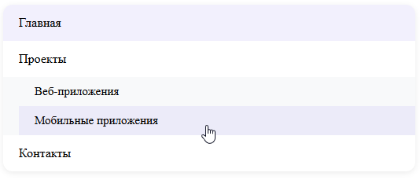

```html
<nav class="menu">
  <ul class="menu-list">
    <li><a href="#" class="menu-item active">Главная</a></li>
    <li>
      <a href="#" class="menu-item">Проекты</a>
      <ul class="menu-sublist">
        <li><a href="#" class="menu-item">Веб-приложения</a></li>
        <li><a href="#" class="menu-item">Мобильные приложения</a></li>
      </ul>
    </li>
    <li><a href="#" class="menu-item">Контакты</a></li>
  </ul>
</nav>
```

```css
.menu-list,
.menu-sublist {
  list-style: none;
  padding: 0;
  margin: 0;
}

.menu-list {
  background-color: #FFFFFF;
  border-radius: 12px;
  box-shadow: 0 2px 8px rgba(0, 0, 0, 0.08);
  overflow: hidden;
}

.menu-item {
  display: block;
  padding: 0.875rem 1.25rem;
  color: var(--color-dark);
  text-decoration: none;
  transition: background-color 0.2s ease;
}

.menu-item:hover,
.menu-item.active {
  background-color: rgba(123, 104, 238, 0.1);
  color: var(--color-primary);
}

.menu-sublist {
  padding-left: 1.25rem;
  background-color: #F8F9FA;
}

.menu-sublist .menu-item {
  padding: 0.625rem 1.25rem;
  font-size: 0.9375rem;
}
```

---

## Панели навигации (Navigation Bars)

Горизонтальная панель навигации с логотипом, ссылками и кнопкой действия.

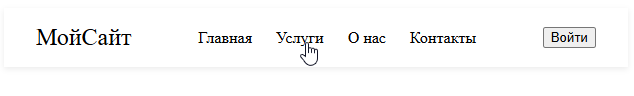

```html
<nav class="navbar">
  <div class="navbar-brand">МойСайт</div>
  <ul class="navbar-nav">
    <li><a href="#" class="nav-link active">Главная</a></li>
    <li><a href="#" class="nav-link">Услуги</a></li>
    <li><a href="#" class="nav-link">О нас</a></li>
    <li><a href="#" class="nav-link">Контакты</a></li>
  </ul>
  <button class="button button--primary">Войти</button>
</nav>
```

```css
.navbar {
  display: flex;
  align-items: center;
  justify-content: space-between;
  padding: 1rem 2rem;
  background-color: #FFFFFF;
  box-shadow: 0 2px 6px rgba(0, 0, 0, 0.08);
}

.navbar-brand {
  font-size: 1.5rem;
  font-weight: var(--font-weight-bold);
  color: var(--color-dark);
  text-decoration: none;
}

.navbar-nav {
  display: flex;
  list-style: none;
  margin: 0;
  padding: 0;
  gap: 1.5rem;
}

.nav-link {
  text-decoration: none;
  color: var(--color-dark);
  font-weight: var(--font-weight-semibold);
  transition: color 0.2s ease;
}

.nav-link:hover,
.nav-link.active {
  color: var(--color-primary);
}
```

---

## Хлебные крошки (Breadcrumbs)

Иерархическая навигация с разделителями.

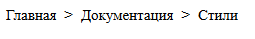

```html
<nav aria-label="Навигация по странице" class="breadcrumbs">
  <ol>
    <li><a href="/">Главная</a></li>
    <li><a href="/docs">Документация</a></li>
    <li><span>Стили</span></li>
  </ol>
</nav>
```

```css
.breadcrumbs ol {
  display: flex;
  list-style: none;
  padding: 0;
  margin: 0;
  gap: 0.5rem;
  font-size: 0.9375rem;
}

.breadcrumbs li a {
  color: var(--color-primary);
  text-decoration: none;
  transition: color 0.2s ease;
}

.breadcrumbs li a:hover {
  text-decoration: underline;
}

.breadcrumbs li span {
  color: var(--color-secondary);
}

.breadcrumbs li:not(:last-child)::after {
  content: ">";
  margin-left: 0.5rem;
  color: var(--color-secondary);
}
```

---

## Пагинация

Нумерованный переключатель страниц с активным состоянием и стрелками.

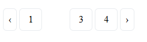

```html
<nav aria-label="Постраничная навигация" class="pagination">
  <a href="#" class="pagination-link pagination-prev">‹</a>
  <a href="#" class="pagination-link">1</a>
  <a href="#" class="pagination-link active">2</a>
  <a href="#" class="pagination-link">3</a>
  <a href="#" class="pagination-link">4</a>
  <a href="#" class="pagination-link pagination-next">›</a>
</nav>
```

```css
.pagination {
  display: flex;
  gap: 0.25rem;
  margin: 1.5rem 0;
}

.pagination-link {
  display: flex;
  align-items: center;
  justify-content: center;
  width: 36px;
  height: 36px;
  border: 1px solid #E9ECEF;
  background-color: #FFFFFF;
  color: var(--color-dark);
  text-decoration: none;
  border-radius: 6px;
  transition: all 0.2s ease;
}

.pagination-link:hover,
.pagination-link:focus {
  background-color: var(--color-light);
  color: var(--color-primary);
}

.pagination-link.active {
  background-color: var(--color-primary);
  color: white;
  border-color: var(--color-primary);
}

.pagination-prev,
.pagination-next {
  width: auto;
  padding: 0 0.5rem;
}
```

---

## Боковые панели (Sidebars)

Вертикальная боковая панель, фиксированная слева, с возможностью скрытия.

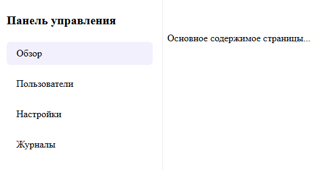

```html
<aside class="sidebar">
  <div class="sidebar-header">
    <h2>Панель управления</h2>
  </div>
  <nav class="sidebar-nav">
    <a href="#" class="sidebar-link active">Обзор</a>
    <a href="#" class="sidebar-link">Пользователи</a>
    <a href="#" class="sidebar-link">Настройки</a>
    <a href="#" class="sidebar-link">Журналы</a>
  </nav>
</aside>

<main class="main-content">
  <p>Основное содержимое страницы...</p>
</main>
```

```css
.sidebar {
  position: fixed;
  top: 0;
  left: 0;
  width: 240px;
  height: 100vh;
  background-color: #FFFFFF;
  border-right: 1px solid #E9ECEF;
  padding: 1.5rem 1rem;
  overflow-y: auto;
  z-index: 1000;
}

.sidebar-header h2 {
  font-size: 1.25rem;
  margin: 0 0 1.5rem;
  color: var(--color-dark);
}

.sidebar-nav {
  display: flex;
  flex-direction: column;
  gap: 0.75rem;
}

.sidebar-link {
  display: block;
  padding: 0.625rem 1rem;
  color: var(--color-dark);
  text-decoration: none;
  border-radius: 6px;
  transition: background-color 0.2s ease, color 0.2s ease;
}

.sidebar-link:hover,
.sidebar-link.active {
  background-color: rgba(123, 104, 238, 0.1);
  color: var(--color-primary);
}

.main-content {
  margin-left: 240px;
  padding: 2rem;
}
```

---

## Хэдеры и футеры

Стандартные шапка и подвал сайта с базовым оформлением.

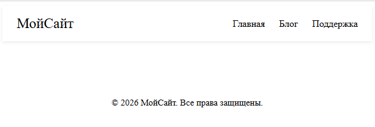

```html
<header class="header">
  <div class="container">
    <div class="header-content">
      <div class="header-logo">МойСайт</div>
      <nav class="header-nav">
        <a href="#" class="header-link">Главная</a>
        <a href="#" class="header-link">Блог</a>
        <a href="#" class="header-link">Поддержка</a>
      </nav>
    </div>
  </div>
</header>

<footer class="footer">
  <div class="container">
    <p>&copy; 2026 МойСайт. Все права защищены.</p>
  </div>
</footer>
```

```css
.container {
  max-width: 1200px;
  margin: 0 auto;
  padding: 0 1.5rem;
}

.header {
  background-color: #FFFFFF;
  box-shadow: 0 2px 6px rgba(0, 0, 0, 0.08);
}

.header-content {
  display: flex;
  justify-content: space-between;
  align-items: center;
  padding: 1rem 0;
}

.header-logo {
  font-size: 1.5rem;
  font-weight: var(--font-weight-bold);
  color: var(--color-dark);
}

.header-nav {
  display: flex;
  gap: 1.5rem;
}

.header-link {
  text-decoration: none;
  color: var(--color-dark);
  font-weight: var(--font-weight-semibold);
  transition: color 0.2s ease;
}

.header-link:hover {
  color: var(--color-primary);
}

.footer {
  background-color: var(--color-light);
  padding: 2rem 0;
  margin-top: 3rem;
}

.footer .container {
  text-align: center;
  color: var(--color-secondary);
  font-size: 0.9375rem;
}
```

---

## Уведомления (Notifications / Alerts)

Всплывающие сообщения с поддержкой типов и закрытия.

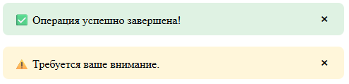

```html
<div class="alert alert--success">
  <span>✅ Операция успешно завершена!</span>
  <button class="alert-close" aria-label="Закрыть">&times;</button>
</div>

<div class="alert alert--warning">
  <span>⚠️ Требуется ваше внимание.</span>
  <button class="alert-close" aria-label="Закрыть">&times;</button>
</div>
```

```css
.alert {
  display: flex;
  align-items: center;
  justify-content: space-between;
  padding: 0.75rem 1rem;
  border-radius: 8px;
  margin-bottom: 1rem;
  font-weight: var(--font-weight-semibold);
}

.alert--success {
  background-color: rgba(40, 167, 69, 0.15);
  color: var(--color-success);
}

.alert--warning {
  background-color: rgba(255, 193, 7, 0.15);
  color: var(--color-warning);
}

.alert--danger {
  background-color: rgba(220, 53, 69, 0.15);
  color: var(--color-danger);
}

.alert-close {
  background: none;
  border: none;
  font-size: 1.25rem;
  cursor: pointer;
  color: inherit;
  margin-left: 0.75rem;
  line-height: 1;
}
```

---

## Контекстные меню

Меню, появляющееся по правому клику или программному вызову.

```html
<div class="context-trigger">Правый клик здесь</div>

<div class="context-menu" id="contextMenu">
  <button class="context-item">Копировать</button>
  <button class="context-item">Вырезать</button>
  <button class="context-item">Удалить</button>
</div>
```

```css
.context-trigger {
  padding: 1rem;
  background-color: #F8F9FA;
  border: 1px dashed #CED4DA;
  border-radius: 8px;
  cursor: pointer;
  user-select: none;
}

.context-menu {
  position: absolute;
  background-color: #FFFFFF;
  border: 1px solid #E9ECEF;
  border-radius: 8px;
  box-shadow: 0 4px 12px rgba(0, 0, 0, 0.15);
  min-width: 160px;
  z-index: 1001;
  display: none;
}

.context-menu.show {
  display: block;
}

.context-item {
  width: 100%;
  padding: 0.625rem 1rem;
  text-align: left;
  background: none;
  border: none;
  cursor: pointer;
  font-family: inherit;
  font-size: 0.9375rem;
  color: var(--color-dark);
  transition: background-color 0.2s ease;
}

.context-item:hover {
  background-color: var(--color-light);
}
```

> **Примечание**: Показ/скрытие контекстного меню требует JavaScript (например, обработка `contextmenu` и позиционирование через `event.clientX/Y`). CSS отвечает только за внешний вид.

---

## Анимации и переходы

Набор переиспользуемых анимаций на основе `@keyframes` и классов.

```html
<div class="box animate-fade-in">Появляется</div>
<div class="box animate-slide-up">Сдвигается сверху</div>
<div class="box animate-pulse">Пульсирует</div>
```

```css
.box {
  width: 120px;
  height: 120px;
  background-color: var(--color-primary);
  margin: 1rem;
  border-radius: 8px;
}

.animate-fade-in {
  animation: fadeIn 0.6s ease forwards;
}

.animate-slide-up {
  animation: slideUp 0.5s ease-out forwards;
}

.animate-pulse {
  animation: pulse 2s infinite;
}

@keyframes fadeIn {
  from { opacity: 0; }
  to { opacity: 1; }
}

@keyframes slideUp {
  from {
    opacity: 0;
    transform: translateY(20px);
  }
  to {
    opacity: 1;
    transform: translateY(0);
  }
}

@keyframes pulse {
  0%, 100% { transform: scale(1); }
  50% { transform: scale(1.05); }
}
```

---

## Модальные окна (Modal Windows)

Окно поверх содержимого с затемнением фона.

```html
<button id="openModal" class="button button--primary">Открыть окно</button>

<div class="modal" id="myModal">
  <div class="modal-overlay"></div>
  <div class="modal-content">
    <div class="modal-header">
      <h3>Подтверждение действия</h3>
      <button class="modal-close" aria-label="Закрыть">&times;</button>
    </div>
    <div class="modal-body">
      <p>Вы уверены, что хотите продолжить?</p>
    </div>
    <div class="modal-footer">
      <button class="button button--secondary">Отмена</button>
      <button class="button button--primary">Подтвердить</button>
    </div>
  </div>
</div>
```

```css
.modal {
  position: fixed;
  top: 0;
  left: 0;
  width: 100vw;
  height: 100vh;
  z-index: 2000;
  display: none;
}

.modal.active {
  display: flex;
  justify-content: center;
  align-items: center;
}

.modal-overlay {
  position: absolute;
  width: 100%;
  height: 100%;
  background-color: rgba(0, 0, 0, 0.5);
}

.modal-content {
  position: relative;
  background-color: #FFFFFF;
  border-radius: 12px;
  box-shadow: 0 10px 30px rgba(0, 0, 0, 0.2);
  max-width: 500px;
  width: 90%;
  z-index: 2001;
}

.modal-header {
  display: flex;
  justify-content: space-between;
  align-items: center;
  padding: 1.25rem 1.25rem 0.75rem;
}

.modal-header h3 {
  margin: 0;
  font-size: 1.25rem;
}

.modal-close {
  background: none;
  border: none;
  font-size: 1.5rem;
  cursor: pointer;
  color: var(--color-secondary);
}

.modal-body {
  padding: 0.75rem 1.25rem;
}

.modal-footer {
  display: flex;
  justify-content: flex-end;
  gap: 0.75rem;
  padding: 0.75rem 1.25rem 1.25rem;
}
```

> **Примечание**: Переключение класса `.active` на `.modal` осуществляется через JavaScript.

---

## Индикаторы прогресса (Progress Bars)

Визуализация выполнения задачи.

```html
<div class="progress">
  <div class="progress-bar" style="width: 65%;">65%</div>
</div>

<div class="progress progress--striped">
  <div class="progress-bar" style="width: 30%;"></div>
</div>
```

```css
.progress {
  height: 12px;
  background-color: #E9ECEF;
  border-radius: 6px;
  overflow: hidden;
  margin-bottom: 1rem;
}

.progress-bar {
  height: 100%;
  background-color: var(--color-primary);
  font-size: 0.75rem;
  font-weight: var(--font-weight-bold);
  color: white;
  display: flex;
  align-items: center;
  justify-content: center;
  transition: width 0.4s ease;
}

.progress--striped .progress-bar {
  background-image: linear-gradient(
    45deg,
    rgba(255, 255, 255, 0.15) 25%,
    transparent 25%,
    transparent 50%,
    rgba(255, 255, 255, 0.15) 50%,
    rgba(255, 255, 255, 0.15) 75%,
    transparent 75%,
    transparent
  );
  background-size: 12px 12px;
}
```

---
