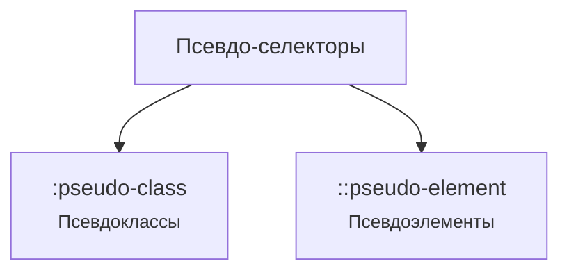

# Псевдоклассы и псевдоэлементы

<div class="article-tags">
  <span class="tag tag-required">ОБЯЗАТЕЛЬНО</span>
  <span class="tag tag-beginner">ДЛЯ НОВИЧКОВ</span>
</div>

<span class="complexity-badge">Разработчику</span>
<span class="complexity-badge">Аналитику</span>
<span class="complexity-badge">Тестировщику</span>  
<span class="complexity-badge">Архитектору</span>
<span class="complexity-badge">Инженеру</span>

**Перед чтением:** [Операторы](/encyclopedia/4-code-dev/4-02-chto-takoe-kod-i-kak-on-rabotaet/33) — общие понятия оператора, операнда и приоритетов; в CSS роль "операций" выполняют селекторы и комбинаторы.

---

## Псевдо-селекторы

### Синтаксис

Псевдоклассы изначально записывались с одним двоеточием (`:hover`), а псевдоэлементы — также с одним (`:before`). В CSS3 был введён чёткий синтаксис:  
- **Псевдоклассы** — одно двоеточие (`:nth-child`, `:focus-visible`)  
- **Псевдоэлементы** — два двоеточия (`::before`, `::backdrop`)

Браузеры по-прежнему поддерживают старый синтаксис (`:before`) для обратной совместимости, но современный стандарт рекомендует использовать два двоеточия для псевдоэлементов.

---

### Почему псевдо?

Псевдо-селекторы (псевдоклассы и псевдоэлементы) позволяют стилизовать элементы в особых состояниях или определённых частях документа без добавления лишних классов или HTML-разметки, чтобы точечно управлять стилями.



Псевдоклассы ( `:pseudo-class`) в определённом состоянии. Псевдоклассы пишутся с одним двоеточием.

Помните, что такое классы? Теперь представьте, что вы хотите изменить элемент не всегда, а только в определённой ситуации.

Например:
	- Когда пользователь наводит мышку на кнопку.
	- Когда ссылка уже была посещена.
	- Когда это первый элемент в списке.

Для этого используются псевдоклассы.

Они записываются через двоеточие после селектора:

```CSS
a:hover {
    color: orange;
}
```
— это значит: "когда на ссылку наводят мышкой — сделай её оранжевой".

Ещё примеры:

Если у нас есть DOM-элемент `p`:

```html
<p>Мы хотим изменить здесь шрифт</p>
```

...то в CSS мы пишем:

```CSS
p:first-child {
    font-weight: bold;
}
```
Проще говоря — если абзац — первый среди своих "братьев и сестёр" (соседей), сделай его жирным.

А если у нас есть форма, и мы хотим изменить фокус в теге `input`:

```css
input:focus {
    border: 2px solid green;
}
```

— когда поле ввода активно (на нём курсор), обведи его зелёной рамкой.

Это способ сказать: "примени стиль, если элемент находится в каком-то особом состоянии или занимает особое положение".

---

### Динамические


★ **Динамические (взаимодействие с пользователем)**

| Псевдокласс | Описание | Пример |
| :--- | :---: | ---: |
|`:hover`	|При наведении курсора	|`a:hover &#123; color: red; &#125;`|
|`:active`	|В момент клика	|`button:active &#123; opacity: 0.8; &#125;`|
|`:focus`	|При фокусе (например, input)	|`input:focus &#123; border-color: blue; &#125;`|
|`:visited`	|Посещённая ссылка	|`a:visited &#123; color: purple; &#125;`|
| `:focus-visible` | Элемент в фокусе, и фокус виден (например, при навигации клавиатурой) | `button:focus-visible &#123; outline: 2px solid blue; &#125;` |
| `:focus-within` | Элемент или один из его потомков в фокусе | `.form-group:focus-within &#123; border-color: green; &#125;` |
| `:target` | Элемент, чей `id` совпадает с хешем в URL | `#section1:target &#123; background: #f0f0f0; &#125;` |

**Динамические псевдоклассы** — это селекторы в CSS, которые применяют стили к элементам в зависимости от их текущего состояния взаимодействия с пользователем. Такие псевдоклассы позволяют создавать интерактивные и отзывчивые интерфейсы без использования JavaScript.

---

#### `:hover`

**`:hover`** применяется к элементу, когда пользователь наводит на него курсор мыши. Этот псевдокласс наиболее часто используется для ссылок, кнопок и других интерактивных элементов, чтобы дать визуальную обратную связь.

```css
a:hover {
  color: red;
}
```

В этом примере текст любой ссылки становится красным при наведении курсора. Псевдокласс работает не только на ссылках, но и на любых HTML-элементах, включая изображения, блоки и формы.

> **💡 Совет**  
> Не злоупотребляйте сложными анимациями на `:hover` на мобильных устройствах — они могут вызывать задержки или не работать корректно, так как концепция "наведения" на сенсорных экранах отличается. Рабочий пример hover-кнопки с `transition` и `:focus-visible` — [CSS-анимации — готовые эффекты](/lab/Примеры/1116#кнопка-с-hover-и-focus-transition).

---

#### `:active`

**`:active`** активируется в момент, когда элемент находится в состоянии нажатия (например, когда пользователь удерживает левую кнопку мыши над кнопкой или ссылкой).

```css
button:active {
  opacity: 0.8;
}
```

Этот стиль снижает прозрачность кнопки на время клика, создавая эффект "утопания". Состояние `:active` кратковременно и автоматически снимается после отпускания кнопки мыши или пальца на тачскрине.

> **📌 Внимание**  
> Порядок объявления псевдоклассов важен. Обычно рекомендуется следовать правилу **LVHA**: `:link`, `:visited`, `:hover`, `:active`. Это предотвращает перекрытие стилей.

---

#### `:focus`

**`:focus`** применяется к элементу, который получил фокус ввода — например, при клике на поле ввода (`<input>`), выборе текстовой области (`<textarea>`) или переходе по Tab.

```css
input:focus {
  border-color: blue;
}
```

Фокус указывает, какой элемент сейчас готов принимать ввод с клавиатуры. Он критически важен для доступности: пользователи, использующие клавиатуру вместо мыши, полагаются на визуальные индикаторы фокуса.

<div class="callout callout--tip">
<div class="callout-title">Доступность</div>

  <div class="callout-body">
Никогда не удаляйте стандартный outline через <code>outline: none</code> без замены его на другой визуальный индикатор фокуса. Это делает интерфейс недоступным для людей с ограниченными возможностями.
</div>
  </div>


---

#### `:visited`

**`:visited`** стилизует ссылки, которые пользователь уже посещал. Браузер определяет это на основе истории.

```css
a:visited {
  color: purple;
}
```

Из соображений приватности современные браузеры сильно ограничивают стили, которые можно применить через `:visited`. Разрешены только цветовые свойства (`color`, `background-color`, `border-color`, `outline-color`), и даже они могут быть частично заблокированы.

> **⚠️ Предупреждение**  
> Нельзя использовать `:visited` для определения, какие сайты посещал пользователь на других доменах — это защита от атак по стороне времени (timing attacks).

---

#### `:focus-visible`

**`:focus-visible`** применяется только тогда, когда фокус на элементе должен быть визуально обозначен — обычно при управлении с клавиатуры. Если пользователь кликнул на элемент мышью, `:focus-visible` может не сработать, в отличие от обычного `:focus`.

```css
button:focus-visible {
  outline: 2px solid blue;
}
```

Этот псевдокласс помогает улучшить UX: пользователи мыши не видят "лишних" обводок, а пользователи клавиатуры получают четкую визуальную подсказку.

<div class="callout callout--tip">
<div class="callout-title">Современная практика</div>

  <div class="callout-body">
Использование <code>:focus-visible</code> считается передовой практикой в области доступности и пользовательского опыта. Он заменяет старые хаки с JavaScript для определения типа навигации.
</div>
  </div>


---

#### `:focus-within`

**`:focus-within`** активируется, если сам элемент **или любой из его потомков** находится в фокусе.

```css
.form-group:focus-within {
  border-color: green;
}
```

Этот псевдокласс особенно полезен для группировки полей ввода. Например, контейнер формы может подсвечиваться зелёным, пока пользователь редактирует любое из полей внутри него.

Пример структуры:
```html
<div class="form-group">
  <label for="email">Email</label>
  <input type="email" id="email">
</div>
```
Когда фокус попадает на `<input>`, срабатывает стиль `.form-group:focus-within`.

---

#### `:target`

**`:target`** применяется к элементу, чей `id` совпадает с фрагментом URL (частью после символа `#`).

```css
#section1:target {
  background: #f0f0f0;
}
```

Если пользователь перешёл по ссылке `https://example.com/page#section1`, то элемент с `id="section1"` получит серый фон. Это используется для выделения текущего раздела страницы, например, в одностраничных сайтах или длинных статьях с оглавлением.

> **💡 Совет**  
> Комбинируйте `:target` с плавной прокруткой (`scroll-behavior: smooth`), чтобы улучшить восприятие переходов по якорным ссылкам.

---

### Структурные

★ **Структурные (положение в DOM)**

| Псевдокласс | Описание | Пример |
| :--- | :---: | ---: |
|`:first-child`	|Первый дочерний элемент среди **всех** детей родителя	|`li:first-child &#123; font-weight: bold; &#125;`|
|`:last-child`	|Последний дочерний элемент среди **всех** детей	|`div:last-child &#123; margin-bottom: 0; &#125;`|
|`:nth-child(n)`	|n-й ребёнок (формула `odd`, `even`, `2n`, `3n+1`…)	|`tr:nth-child(2n) &#123; background: #f5f5f5; &#125;`|
|`:nth-last-child(n)`	|n-й ребёнок, считая **с конца**	|`li:nth-last-child(2) &#123; border-bottom: none; &#125;`|
|`:only-child`	|Единственный дочерний элемент родителя	|`div:only-child &#123; width: 100%; &#125;`|
| `:first-of-type` | Первый элемент **своего тега** среди братьев | `h2:first-of-type &#123; margin-top: 0; &#125;` |
| `:last-of-type` | Последний элемент **своего тега** | `img:last-of-type &#123; border-radius: 8px; &#125;` |
| `:nth-of-type(n)` | n-й элемент **своего типа** | `p:nth-of-type(2) &#123; color: gray; &#125;` |
| `:nth-last-of-type(n)` | n-й элемент типа, считая **с конца среди однотипных** | `p:nth-last-of-type(1) &#123; margin-bottom: 0; &#125;` |
| `:only-of-type` | Единственный элемент своего типа у родителя | `span:only-of-type &#123; font-style: italic; &#125;` |
|`:not(selector)`	|Все элементы, кроме указанных	|`p:not(.warning) &#123; color: black; &#125;`|

**Структурные псевдоклассы** — это селекторы, которые применяют стили к элементам на основе их положения в дереве DOM относительно родительских и соседних элементов. Они позволяют точно выбирать элементы по их порядковому номеру, типу или уникальности без добавления дополнительных классов или атрибутов в HTML.

Эти псевдоклассы делают разметку чище, уменьшают зависимость от JavaScript для стилизации и поддерживают принцип "семантического HTML".

#### Две семьи — по позиции среди всех детей и по типу тега

Структурные псевдоклассы делятся на две группы. От выбора группы зависит, попадёт ли элемент под селектор.

| Семья | Псевдоклассы | Что считается |
| :--- | :--- | :--- |
| **Позиция среди всех детей** | `:first-child`, `:last-child`, `:nth-child()`, `:nth-last-child()`, `:only-child` | Порядковый номер среди **любых** соседних элементов родителя |
| **Позиция среди одного типа** | `:first-of-type`, `:last-of-type`, `:nth-of-type()`, `:nth-last-of-type()`, `:only-of-type` | Порядковый номер только среди элементов **с тем же тегом** |

Селектор `a:first-child` сработает только если `<a>` — **первый** ребёнок родителя. Селектор `a:first-of-type` сработает, если `<a>` — **первый тег `<a>`** среди братьев, даже когда перед ним стоят `<div>`, `<span>` и другие теги.

Ниже — типичные раскладки (дети родителя слева направо; подсвечен то, что выберет `a` в селекторе):

| Дети родителя | `a:first-child` | `a:last-child` | `a:first-of-type` | `a:last-of-type` |
| :--- | :---: | :---: | :---: | :---: |
| `<a>`, `<b>` | да | нет | да | да |
| `<b>`, `<a>` | нет | да | да | да |
| `<b>`, `<a>`, `<a>`, `<b>` | нет | нет | 1-й `<a>` | 2-й `<a>` |
| только `<a>` | да | да | да | да |

<div class="callout callout--tip">
  <div class="callout-title">Как запомнить</div>

  <div class="callout-body">
  <code>-child</code> смотрит на место в общем списке детей. <code>-of-type</code> — на место среди элементов с тем же именем тега. Если «первый пункт меню» ломается из‑за баннера перед списком, чаще нужен <code>li:first-of-type</code>, а не <code>li:first-child</code>.
  </div>
</div>

---

#### `:first-child`

**`:first-child`** выбирает элемент, который является первым дочерним элементом своего родителя **среди всех дочерних элементов**, независимо от тега.

```css
li:first-child {
  font-weight: bold;
}
```

В этом примере первый элемент списка `<li>` внутри любого родителя (`<ul>` или `<ol>`) будет выделен жирным шрифтом. Если перед первым `<li>` окажется другой элемент (например, `<div>`), то `:first-child` не применится к `<li>`, потому что он уже не будет первым ребёнком.

```html
<ul>
  <div class="banner">Акция</div>
  <li>Первый пункт</li>
  <li>Второй пункт</li>
</ul>
```

```css
li:first-child { font-weight: bold; }   /* не сработает: первый ребёнок — div */
li:first-of-type { font-weight: bold; } /* сработает на первом li */
```

> **📌 Важно**  
> `:first-child` требует, чтобы элемент был **первым среди всех детей**, а не просто первым своего типа.

---

#### `:last-child`

**`:last-child`** работает аналогично, но выбирает последний дочерний элемент родителя.

```css
div:last-child {
  margin-bottom: 0;
}
```

Этот стиль убирает нижний отступ у последнего `<div>` внутри контейнера. Как и в случае с `:first-child`, если после этого `<div>` есть хотя бы один другой элемент (даже текстовый узел или комментарий), правило не сработает.

---

#### `:nth-child(n)`

**`:nth-child(n)`** выбирает дочерний элемент по его порядковому номеру **среди всех детей родителя**, где `n` — целое число, начиная с 1.

```css
tr:nth-child(2n) {
  background: #f5f5f5;
}
```

Здесь каждая чётная строка таблицы (`2n` означает 2, 4, 6…) получает светло-серый фон — классическая "зебра" для улучшения читаемости.

Формула может быть:
- `odd` — нечётные элементы (`1, 3, 5…`),
- `even` — чётные элементы (`2, 4, 6…`),
- `3n+1` — каждый третий элемент, начиная с первого (`1, 4, 7…`),
- `5` — только пятый элемент.

> **💡 Примеры**  
> - `:nth-child(1)` эквивалентен `:first-child`  
> - `:nth-child(-n+3)` выбирает первые три элемента

Для родителя с детьми `<a>`, `<a>`, `<b>`, `<a>` селектор `a:nth-child(2n)` выделит **второй** и **четвёртый** ребёнок, если это теги `<a>` (2-й и 4-й ребёнок в общем списке). Третий ребёнок `<b>` в выборку не попадёт, хотя он чётный по счёту.

---

#### `:nth-last-child(n)`

**`:nth-last-child(n)`** считает дочерние элементы **с конца** родителя. Формулы те же, что у `:nth-child()` — `odd`, `even`, `2n`, `3n+1`, конкретное число.

```css
li:nth-last-child(2) {
  border-bottom: none;
}
```

У списка из пяти пунктов стиль получит **предпоследний** `<li>` (второй с конца), независимо от общего числа элементов — удобно для «хвоста» списка без знания точного количества пунктов.

Для детей `<a>`, `<a>`, `<b>`, `<a>` селектор `a:nth-last-child(3)` выберет **второй** `<a>` слева: с конца это 1-й `<a>`, 2-й `<b>`, 3-й — нужный `<a>`.

> **💡 Соответствия**  
> - `:nth-last-child(1)` эквивалентен `:last-child`  
> - `:nth-last-child(odd)` — нечётные позиции с конца (1-й, 3-й, 5-й с конца…)

---

#### `:not(selector)`

**`:not(selector)`** применяет стиль ко всем элементам, **кроме тех**, которые соответствуют указанному селектору.

```css
p:not(.warning) {
  color: black;
}
```

Все абзацы, кроме тех, у которых есть класс `warning`, будут чёрными. Это позволяет исключать определённые элементы из общего правила без дублирования стилей.

Для ссылок селектор `a:not(.c)` выберет все `<a>` **без** класса `c`. В разметке `<b>`, `<a class="c">`, `<a>`, `<a class="d">` стилизуются только второй и третий `<a>`.

Селектор внутри `:not()` может быть простым (`.class`, `#id`, `tag`) или сложным (в современных браузерах поддерживается даже составной селектор).

> **⚠️ Ограничение**  
> Внутри `:not()` нельзя использовать псевдоэлементы (`::before`, `::after`) или другие псевдоклассы, зависящие от состояния (например, `:hover`).

---

#### `:nth-of-type(n)`

**`:nth-of-type(n)`** выбирает n-й элемент **своего типа** среди братьев, игнорируя элементы других тегов.

```css
p:nth-of-type(2) {
  color: gray;
}
```

Это правило применится ко второму абзацу `<p>` внутри родителя, даже если между первым и вторым `<p>` находятся другие элементы, например `<div>` или `<h3>`.

Разница между `:nth-child` и `:nth-of-type`:
- `:nth-child(2)` — второй ребёнок вообще,
- `:nth-of-type(2)` — второй `<p>` среди всех `<p>`.

У родителя `<b>`, `<a>`, `<a>`, `<b>` селектор `a:nth-of-type(2n)` выделит **второй** `<a>` (третий ребёнок в общем списке) — это каждый второй элемент типа `<a>`, а не каждый второй ребёнок.

---

#### `:nth-last-of-type(n)`

**`:nth-last-of-type(n)`** считает элементы **одного тега** с конца. Селектор `a:nth-last-of-type(2)` выбирает **предпоследний** `<a>` среди всех ссылок внутри родителя.

```css
p:nth-last-of-type(1) {
  margin-bottom: 0;
}
```

Последний абзац в блоке теряет нижний отступ, даже если после него идут заголовки или списки других тегов.

Для `<b>`, `<a>`, `<a>`, `<b>` селектор `a:nth-last-of-type(2)` попадает в **первый** `<a>` слева (второй `<a>` с конца среди двух ссылок).

> **💡 Соответствия**  
> - `:nth-last-of-type(1)` эквивалентен `:last-of-type`  
> - `:nth-last-of-type(odd)` — нечётные позиции с конца среди элементов данного типа

---

#### `:first-of-type`

**`:first-of-type`** выбирает первый элемент своего тега среди всех соседей.

```css
h2:first-of-type {
  margin-top: 0;
}
```

Первый заголовок второго уровня в контейнере не будет иметь верхнего отступа, даже если перед ним есть другие элементы (например, `<p>` или ``).

```html
<article>
  <p>Вступление</p>
  <h2>Раздел 1</h2>
  <h2>Раздел 2</h2>
</article>
```

```css
h2:first-child { margin-top: 0; }    /* не сработает: первый ребёнок — p */
h2:first-of-type { margin-top: 0; }  /* сработает на «Раздел 1» */
```

Этот псевдокласс особенно полезен в статьях или блогах, где структура может быть гибкой.

---

#### `:last-of-type`

**`:last-of-type`** выбирает последний элемент своего типа среди братьев.

```css
img:last-of-type {
  border-radius: 8px;
}
```

Последнее изображение в блоке получит скруглённые углы, независимо от того, какие элементы идут после него.

---

#### `:only-child`

**`:only-child`** применяется, если элемент — **единственный дочерний** у своего родителя.

```css
div:only-child {
  width: 100%;
}
```

Если внутри какого-то контейнера есть ровно один `<div>` и ничего больше, он займёт всю ширину. Даже пробел или перенос строки в HTML могут нарушить это условие, так как браузер интерпретирует их как текстовые узлы.

> **📌 Практическое применение**  
> Часто используется в компонентах, которые могут содержать один или несколько элементов в зависимости от контекста (например, карточки товаров, модальные окна).

---

#### `:only-of-type`

**`:only-of-type`** выбирает элемент, если он — **единственный своего типа** среди всех дочерних элементов родителя.

```css
span:only-of-type {
  font-style: italic;
}
```

Если в родителе есть только один `<span>` (даже если есть другие элементы, например `<p>` или `<div>`), он будет курсивом.

Пример:
```html
<div>
  <p>Текст</p>
  <span>Единственный span</span>
  <p>Ещё текст</p>
</div>
```
Здесь `<span>` соответствует `:only-of-type`, потому что других `<span>` в этом `<div>` нет.

---

### Состояния

★ **Состояния элементов**

| Псевдокласс | Описание | Пример |
| :--- | :---: | ---: |
|`:checked`	|Выбранный чекбокс / радио-кнопка	|`input:checked + label &#123; color: green; &#125;`
|`:disabled`	|Отключённый элемент формы	|`button:disabled &#123; opacity: 0.5; &#125;`
|`:empty`	|Пустой элемент (без детей)	|`div:empty &#123; display: none; &#125;`

---

#### `:checked`

**`:checked`** применяется к переключателям (`<input type="checkbox">`) и радиокнопкам (`<input type="radio">`), когда они находятся в выбранном состоянии.

```css
input:checked + label {
  color: green;
}
```

В этом примере метка (`<label>`), следующая непосредственно за выбранным чекбоксом, становится зелёной. Это работает благодаря соседнему селектору `+`.

> **💡 Расширенное применение**  
> Комбинируя `:checked` с другими селекторами (например, `~` для всех последующих соседей), можно создавать сложные интерактивные компоненты: аккордеоны, табы, скрытые панели — всё на чистом CSS.

---

#### `:disabled`

**`:disabled`** выбирает элементы формы, у которых установлен атрибут `disabled`.

```css
button:disabled {
  opacity: 0.5;
}
```

Отключённые кнопки, поля ввода или выпадающие списки становятся полупрозрачными, сигнализируя пользователю, что взаимодействие с ними невозможно.

> **📌 Важно**  
> Элементы с `disabled` не отправляются при сабмите формы и не получают фокус. Для элементов, которые должны участвовать в отправке, но быть недоступными для редактирования, используйте атрибут `readonly` вместо `disabled`.

---

#### `:empty`

**`:empty`** применяется к элементу, который **не содержит ни дочерних элементов, ни текстового контента**, включая пробелы и переносы строк.

```css
div:empty {
  display: none;
}
```

Это полезно для скрытия контейнеров, которые могут оказаться пустыми в зависимости от данных (например, блоки с опциональной информацией).

> **⚠️ Предупреждение**  
> Даже один пробел внутри тега делает его **непустым**. Например, `<div> </div>` не соответствует `:empty`.

---

### Формы и валидация

| Псевдокласс | Описание | Пример |
| :--- | :--- | :--- |
| `:valid` | Поле формы прошло валидацию | `input:valid &#123; border-color: green; &#125;` |
| `:invalid` | Поле формы не прошло валидацию | `input:invalid &#123; border-color: red; &#125;` |
| `:required` | Обязательное для заполнения поле | `input:required &#123; background: #fff8e1; &#125;` |
| `:optional` | Необязательное поле | `input:optional &#123; opacity: 0.8; &#125;` |
| `:user-valid` / `:user-invalid` | Состояние после взаимодействия пользователя (экспериментальные) | `input:user-invalid &#123; box-shadow: 0 0 4px red; &#125;` |

Современные браузеры поддерживают встроенную валидацию форм на основе HTML5-атрибутов (`required`, `pattern`, `min`, `max`, `type="email"` и т.д.). CSS позволяет стилизовать поля в зависимости от результата этой валидации.

---

#### `:valid`

**`:valid`** активируется, когда значение поля соответствует всем правилам валидации.

```css
input:valid {
  border-color: green;
}
```

Поле с корректным email, числом в допустимом диапазоне или заполненным обязательным значением получит зелёную рамку.

> **💡 Совет**  
> Чтобы избежать преждевременной стилизации (например, зелёной рамки у пустого необязательного поля), комбинируйте `:valid` с `:not(:placeholder-shown)` или используйте `:user-valid`.

---

#### `:invalid`

**`:invalid`** применяется, когда поле **не проходит валидацию** — например, пустое обязательное поле, некорректный email или число вне диапазона.

```css
input:invalid {
  border-color: red;
}
```

Красная рамка сразу указывает на ошибку. Однако будьте осторожны: даже пустое поле с атрибутом `required` считается невалидным с самого начала, что может раздражать пользователя.

> **📌 Решение**  
> Используйте `:invalid` вместе с `:focus` или `:not(:placeholder-shown)`, чтобы показывать ошибку только после того, как пользователь начал взаимодействие:
> ```css
> input:invalid:not(:placeholder-shown) {
>   border-color: red;
> }
> ```

---

#### `:required`

**`:required`** выбирает все поля формы с атрибутом `required`.

```css
input:required {
  background: #fff8e1; /* светло-янтарный фон */
}
```

Такой фон помогает визуально выделить обязательные поля, особенно в длинных формах.

---

#### `:optional`

**`:optional`** применяется ко всем полям формы, **у которых нет атрибута `required`**.

```css
input:optional {
  opacity: 0.8;
}
```

Необязательные поля могут быть слегка затемнены, чтобы подчеркнуть их второстепенность.

> **💡 Примечание**  
> По умолчанию все поля считаются необязательными, если явно не указано иное. Поэтому `:optional` охватывает большинство полей в типичной форме.

---

#### `:user-valid` и `:user-invalid` (экспериментальные)

Эти псевдоклассы появились как решение проблемы "слишком ранней" валидации. Они активируются **только после того, как пользователь взаимодействовал с полем** — например, ввёл данные и покинул его (blur).

```css
input:user-invalid {
  box-shadow: 0 0 4px red;
}
```

Это позволяет показывать ошибки только тогда, когда пользователь действительно завершил ввод, а не сразу при загрузке страницы.

> **⚠️ Поддержка**  
> На начало 2026 года `:user-valid` и `:user-invalid` поддерживаются в основных движках (Blink, WebKit, Gecko), но всё ещё помечаются как экспериментальные. Используйте их с fallback-решениями (например, через `:invalid:focus` или JavaScript-классы) для максимальной совместимости.

---

## Псевдоэлементы

### Что такое псевдоэлемент?

Псевдоэлементы `(::pseudo-element)` стилизуют части элемента (например, первую букву или строку). Псевдоэлементы пишутся с двумя двоеточиями.

В отличие от псевдоклассов (которые описывают состояние), псевдоэлементы обращаются к виртуальным частям документа, не существующим как отдельные узлы DOM.

А теперь представьте, что вы хотите добавить что-то новое, чего нет в HTML. 

Например:
	- Маленькую иконку после каждой ссылки.
	- Кавычки в начале цитаты.
	- Стилизовать только первую букву абзаца.

Вы не хотите ради этого писать лишние теги. Вот тут и помогают псевдоэлементы. Они создают виртуальные части элемента — как будто они есть, но в коде их нет. Записываются через два двоеточия:

```CSS
.quote::before {
    content: "“";
    font-size: 1.5em;
}

.quote::after {
    content: "”";
    font-size: 1.5em;
}
```

— это добавит кавычки в начало и конец любого элемента с классом .quote.

Ещё пример:
```CSS
p::first-letter {
    font-size: 2em;
    float: left;
    margin-right: 5px;
}
```

— "сделай первую букву абзаца большой и обтекаемой".

```CSS
li::marker {
    color: red;
}
```

— "сделай маркер списка (точку или цифру) красным".

Это способ добавить или изменить часть элемента, не меняя HTML. Это как волшебная кисточка, которая рисует что-то сверху, снизу, внутри — там, где физически нет отдельного тега.

Эти инструменты вместе дают полный контроль над тем, как выглядит ваш сайт — от общих форм до мельчайших деталей.

---

### Основные псевдоэлементы

| Псевдокласс | Описание | Пример |
| :--- | :---: | ---: |
|`::before`	|Вставляет контент перед элементом	|`.quote::before &#123; content: ""; &#125;`|
|`::after`	|Вставляет контент после элемента	|`.link::after &#123; content: ""; &#125;`|
|`::first-letter`	|Первая буква элемента	|`p::first-letter &#123; font-size: 2em; &#125;`|
|`::first-line`	|Первая строка элемента	|`article::first-line &#123; font-weight: bold; &#125;`|
|`::selection`	|Стиль выделенного текста	|`::selection &#123; background: yellow; &#125;`|
| `::backdrop` | Фон под модальным окном (при `dialog::showModal()`) | `dialog::backdrop &#123; background: rgba(0,0,0,0.7); &#125;` |
| `::placeholder` | Стиль placeholder в полях ввода | `input::placeholder &#123; color: #999; &#125;` |
| `::file-selector-button` | Кнопка выбора файла в `<input type="file">` | `input[type="file"]::file-selector-button &#123; background: #007bff; &#125;` |
| `::cue` | Субтитры в медиаэлементах (WebVTT) | `video::cue &#123; color: white; background: transparent; &#125;` |

---

#### `::before`

**`::before`** создаёт псевдоэлемент, который вставляется **непосредственно перед содержимым целевого элемента**. Для работы обязательно требуется свойство `content`.

```css
.quote::before {
  content: "“";
  font-size: 2em;
  color: #666;
}
```

Этот пример добавляет открывающую кавычку перед текстом любого элемента с классом `.quote`. Псевдоэлемент становится первым дочерним узлом внутри элемента.

> **💡 Применение**  
> Часто используется для иконок, декоративных символов, технических меток (например, "[Важно]"), а также в методах вроде clearfix или создания треугольников через border.

---

#### `::after`

**`::after`** работает аналогично, но вставляет контент **после всего содержимого элемента**, перед закрывающим тегом.

```css
.link::after {
  content: " ↗";
  opacity: 0.6;
}
```

Здесь после каждой ссылки с классом `.link` появляется символ стрелки, указывающий на внешний ресурс. Это распространённый приём для обозначения исходящих ссылок.

> **📌 Важно**  
> Оба псевдоэлемента (`::before`, `::after`) требуют `content`, даже если он пустой (`content: ""`). Без него они не отображаются.

---

#### `::first-letter`

**`::first-letter`** применяет стиль к **первой букве** первого текстового узла в блочном элементе.

```css
p::first-letter {
  font-size: 2em;
  float: left;
  margin-right: 0.1em;
  font-weight: bold;
}
```

Это классический способ создания "буквицы" — увеличенной первой буквы абзаца, как в печатных изданиях. Псевдоэлемент учитывает пунктуацию: если абзац начинается с кавычки, то `::first-letter` может включать и её, и первую букву (поведение зависит от браузера).

> **⚠️ Ограничения**  
> Работает только на элементах с `display: block` или аналогичными (например, `inline-block` не подходит). Не применяется к строчным элементам без преобразования.

---

#### `::first-line`

**`::first-line`** стилизует **первую строку текста** внутри блочного элемента. Длина строки зависит от ширины контейнера и размера шрифта.

```css
article::first-line {
  font-weight: bold;
  color: #333;
}
```

Первая строка статьи становится жирной. Это полезно для акцента на начале текста, особенно в новостных лентах или блогах.

> **💡 Особенность**  
> Стили, применимые к `::first-line`, ограничены: можно менять цвет, шрифт, размер, межстрочный интервал, но нельзя использовать `margin`, `padding`, `background-image` или позиционирование.

---

#### `::selection`

**`::selection`** определяет внешний вид **текста, выделенного пользователем** мышью или клавиатурой.

```css
::selection {
  background: yellow;
  color: black;
}
```

Выделенный текст становится чёрным на жёлтом фоне вместо стандартного белого на синем. Это глобальное правило, но его можно применить и к конкретным элементам: `p::selection`.

> **📌 Поддержка**  
> Некоторые свойства игнорируются (например, `border`), но `background-color` и `color` работают повсеместно.

---

#### `::backdrop`

**`::backdrop`** стилизует **полупрозрачный фон**, который появляется **под модальным окном** при вызове `dialog.showModal()`.

```css
dialog::backdrop {
  background: rgba(0, 0, 0, 0.7);
  backdrop-filter: blur(4px);
}
```

Этот псевдоэлемент автоматически создаётся браузером и блокирует взаимодействие с остальной страницей. Он существует только для `<dialog>`, открытого в модальном режиме.

> **💡 Примечание**  
> Обычный вызов `dialog.show()` (без `Modal`) не создаёт `::backdrop`.

---

#### `::placeholder`

**`::placeholder`** управляет стилем **текста-заполнителя** в полях ввода (`<input>`, `<textarea>`), заданного через атрибут `placeholder`.

```css
input::placeholder {
  color: #999;
  font-style: italic;
}
```

Серый курсивный placeholder выглядит менее навязчиво, чем стандартный серый текст. Это улучшает восприятие формы.

> **⚠️ Важно**  
> Текст placeholder **не является содержимым элемента** и исчезает при фокусе или вводе. Его нельзя скопировать, и он не отправляется с формой.

---

#### `::file-selector-button`

**`::file-selector-button`** позволяет стилизовать **кнопку выбора файла** в `<input type="file">`.

```css
input[type="file"]::file-selector-button {
  background: #007bff;
  color: white;
  border: none;
  padding: 6px 12px;
  border-radius: 4px;
  cursor: pointer;
}
```

Стандартная кнопка "Выберите файл" заменяется на кастомную с синим фоном. Это особенно ценно, так как раньше стилизация этой кнопки была крайне сложной и требовала скрытия оригинального input.

> **📌 Совместимость**  
> Поддерживается в современных браузерах (Chrome 84+, Firefox 85+, Safari 16+). Для старых версий могут потребоваться vendor-префиксы или fallback-решения.

---

#### `::cue`

**`::cue`** применяет стили к **субтитрам**, отображаемым в `<video>` или `<audio>` при использовании WebVTT-треков.

```css
video::cue {
  color: white;
  background: transparent;
  font-size: 1.2em;
  text-shadow: 0 0 4px black;
}
```

Субтитры становятся белыми с чёрной тенью для лучшей читаемости на любом фоне видео.

> **💡 Примечание**  
> Псевдоэлемент работает только при наличии `<track kind="subtitles">` с корректным WebVTT-файлом. Некоторые свойства (например, `background`) могут быть ограничены из соображений безопасности.

---

### Особенности поведения

- Псевдоэлементы **не существуют в DOM**, поэтому к ним нельзя получить доступ через JavaScript.
- Содержимое, добавленное через `::before` и `::after`, отображается только если задано свойство `content`.
- Значение `content` может быть строкой, `url()`, `attr()` или даже пустым (`""`), но не может содержать HTML.
- Некоторые псевдоклассы, такие как `:visited`, ограничены в стилях из соображений приватности (нельзя менять `background-image`, `visibility` и др.).

<div class="callout callout--tip">
  <div class="callout-title">Современные селекторы</div>

  <div class="callout-body">
  Группировка <code>:is()</code> / <code>:where()</code> и родитель по потомку <code>:has()</code> — в главе <a href="./114.md">Селекторы :is, :where и :has</a>. Полный обзор функций значений и селекторов — <a href="./119.md">Функции в CSS</a>. Учёт настроек пользователя (движение, контраст) — <a href="./117.md">Доступность и пользовательские настройки в CSS</a>.
</div>
  </div>


---
