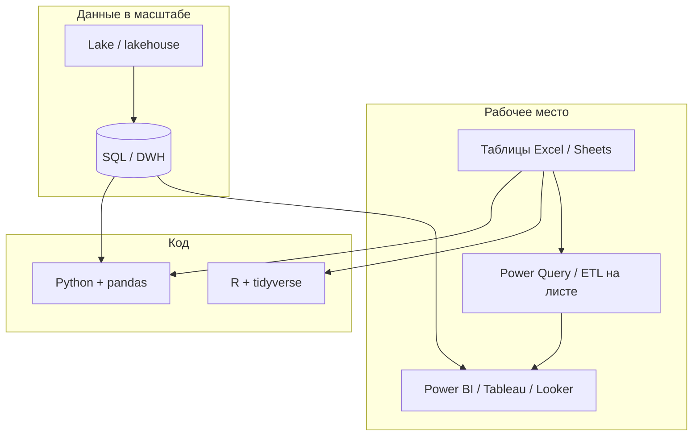

import ExternalPlayEmbed from '@site/src/components/ExternalPlayEmbed';


# Data Science

<div class="article-tags">
  <span class="tag tag-required">ОБЯЗАТЕЛЬНО</span>
  <span class="tag tag-beginner">ДЛЯ НОВИЧКОВ</span>
</div>

<span class="complexity-badge">Разработчику</span>
<span class="complexity-badge">Аналитику</span>
<span class="complexity-badge">Тестировщику</span>  
<span class="complexity-badge">Архитектору</span>
<span class="complexity-badge">Инженеру</span>

---

## Data Science

### Что такое Data Science?

**Data Science** (наука о данных) представляет собой междисциплинарную область, объединяющую методы статистики, информатики, математического моделирования и предметной экспертизы для извлечения знаний и измеримых представлений из структурированных и неструктурированных данных. 

В отличие от классической статистики, ориентированной преимущественно на проверку гипотез и интерпретацию, Data Science акцентирует внимание на предсказательной способности моделей, масштабируемости вычислений и автоматизации анализа в условиях больших объёмов данных.

Основной объект изучения Data Science — данные в их разнообразных формах: числовые, категориальные, временные ряды, тексты, изображения, графы. Цель — построить модели, способные обобщать закономерности и применять их к новым, ранее не наблюдавшимся наблюдениям.

Ключевые компоненты Data Science как дисциплины:
- **Сбор и подготовка данных** (data wrangling, curation, engineering),
- **Исследовательский анализ данных** (Exploratory Data Analysis, EDA),
- **Построение и валидация моделей** (машинное обучение, статистическое моделирование),
- **Визуализация и интерпретация результатов**,
- **Интеграция выводов в бизнес-процессы или автоматизированные системы**.

Data Science не сводится к применению готовых алгоритмов. Это системная инженерно-аналитическая деятельность, требующая понимания как математических основ, так и инфраструктурных ограничений реальных систем обработки данных.

<div class="callout callout--info">
  <div class="callout-title">Подготовка данных для ML</div>

  <div class="callout-body">
  Очистка таблиц в pandas — [Очистка и подготовка данных в Pandas](/encyclopedia/3-data-markup/3-11-analiz-dannyh/427); нормализация и split для sklearn — ниже и в [Python для анализа данных](/encyclopedia/3-data-markup/3-11-analiz-dannyh/424). Полный ML-трек: [кодирование категорий](/encyclopedia/6-ai/6-02-mashinnoe-obuchenie/4), [разбиение выборки](/encyclopedia/6-ai/6-02-mashinnoe-obuchenie/6), [Melbourne](/encyclopedia/6-ai/6-02-mashinnoe-obuchenie/7). Нейросети после таблиц — [Keras](/encyclopedia/6-ai/6-03-neyroseti/114), [MNIST на PyTorch](/encyclopedia/5-languages/5-02-python/335).
  </div>
</div>

<span id="podgotovka-dannyh-dlya-ml"></span>

### Подготовка данных для машинного обучения

Аналитик и дата-сайентист готовят данные **до** вызова `fit`. Типичный порядок:

1. **Очистка** — пропуски, дубликаты, типы столбцов ([Очистка и подготовка данных в Pandas — Pandas](/encyclopedia/3-data-markup/3-11-analiz-dannyh/427)).
2. **Разбиение** — train / validation / test **до** любых статистик по всей таблице (см. раздел [Утечка переменных](#утечка-переменных-data-leakage) ниже в этой статье).
3. **Нормализация и кодирование** — только по train, затем `transform` на val и test.
4. **Аугментация** (изображения, иногда текст) — только на train.

#### Нормализация числовых признаков

| Метод | Формула (идея) | Когда уместно |
|-------|----------------|---------------|
| **MinMaxScaler** | Привести к диапазону [0, 1] | Нейросети, когда важны границы |
| **StandardScaler** | Нулевое среднее, единичная дисперсия | SVM, логистическая регрессия, PCA |

```python
from sklearn.model_selection import train_test_split
from sklearn.preprocessing import StandardScaler

X_train, X_test, y_train, y_test = train_test_split(X, y, test_size=0.2, random_state=42)

scaler = StandardScaler()
X_train_scaled = scaler.fit_transform(X_train)   # fit только на train
X_test_scaled = scaler.transform(X_test)         # те же mean/std
```

Ошибка: `scaler.fit_transform(X)` на всей таблице, потом split — test "подглядел" в статистики train. То же для медианы при импутации пропусков.

#### Train, validation и test

| Выборка | Назначение |
|---------|------------|
| **Train** | Обучение весов модели |
| **Validation** | Подбор гиперпараметров, EarlyStopping между эпохами |
| **Test** | Однократная честная оценка перед продом |

```python
X_train, X_temp, y_train, y_temp = train_test_split(X, y, test_size=0.3, random_state=42)
X_val, X_test, y_val, y_test = train_test_split(X_temp, y_temp, test_size=0.5, random_state=42)
# ~70% train, ~15% val, ~15% test
```

Подробнее — [Разбиение данных и кросс-валидация](/encyclopedia/6-ai/6-02-mashinnoe-obuchenie/6).

#### Аугментация данных

Искусственное расширение **обучающей** выборки: поворот и отражение картинки, сдвиг яркости, обрезка. Для текста — синонимы, перестановка предложений (осторожно с смыслом).

- **Keras:** `ImageDataGenerator` или слои `tf.keras.layers.RandomFlip`, `RandomRotation` внутри модели (активны только на train).
- **PyTorch:** `torchvision.transforms` в `Dataset` — разные пайплайны для train и val.

Правило: аугментация **после** split и **никогда** на test. Иначе завышенная accuracy — см. [распознавание объектов](/encyclopedia/6-ai/6-06-primenenie-ii/120).

Маршрут "таблицы → нейросеть": [Очистка и подготовка данных в Pandas](/encyclopedia/3-data-markup/3-11-analiz-dannyh/427) → [Python для анализа данных](/encyclopedia/3-data-markup/3-11-analiz-dannyh/424) → [6-02/6](/encyclopedia/6-ai/6-02-mashinnoe-obuchenie/6) → [Keras и TensorFlow — нейросети](/encyclopedia/6-ai/6-03-neyroseti/114) или [практикум DL в Colab](/encyclopedia/6-ai/6-05-razrabotka-ii/122#vetka-dl--glubokoe-obuchenie-v-colab).

---

<span id="stek-analiza-dannyh"></span>

## Стек анализа данных

На практике роли из Data Science опираются на **слои инструментов**. Ниже — упрощённая карта (по мотивам обзора стека в учебниках прикладной аналитики); детальный маршрут "Excel → R → Python" — в [Маршрут Excel → R → Python](/encyclopedia/3-data-markup/3-11-analiz-dannyh/430).



| Слой | Типичные задачи | Материалы энциклопедии |
|------|-----------------|-------------------------|
| **Таблицы** | EDA, разовый расчёт, прототип метрики | [Разведочный анализ данных в Excel — EDA в Excel](/encyclopedia/3-data-markup/3-11-analiz-dannyh/429), [справочник Excel](/encyclopedia/1-basics/1-15-tekst/41) |
| **Подготовка без VBA** | объединение файлов, типы, повторяемая загрузка | [Power BI и self-service аналитика — Power BI](/encyclopedia/3-data-markup/3-11-analiz-dannyh/43) (Power Query) |
| **BI** | дашборды, семантическая модель, RLS | [Power BI и self-service аналитика](/encyclopedia/3-data-markup/3-11-analiz-dannyh/43), [Анализ данных — аналитика](/encyclopedia/3-data-markup/3-11-analiz-dannyh/1) |
| **SQL / хранилища** | витрины, история, большие объёмы | [SQL](/encyclopedia/3-data-markup/3-07-sql/intro), [Big Data — Big Data](/encyclopedia/3-data-markup/3-11-analiz-dannyh/11) |
| **R / Python** | статистика, ML, git, ноутбуки | [Python для анализа данных](/encyclopedia/3-data-markup/3-11-analiz-dannyh/424), [5-23-r](/encyclopedia/5-languages/5-23-r/intro), [Табличные данные — Pandas, Polars, SQL и PySpark](/encyclopedia/3-data-markup/3-11-analiz-dannyh/426), [практикум Pandas Data Viewer](/encyclopedia/5-languages/5-02-python/334), [практикум PyTorch — MNIST](/encyclopedia/5-languages/5-02-python/335) |

**Статистика**, **аналитика данных**, **бизнес-аналитика**, **наука о данных** и **машинное обучение** пересекаются: BI опирается на описательную статистику, DS добавляет модели и инженерию, ML — на промышленное развёртывание (блок "Роли в экосистеме данных" выше).

---

## Роли в экосистеме данных

<ExternalPlayEmbed example="data-markup/data-science-roles-play" title="Роли в Data Science" minHeight={480} />

В современной практике Data Science редко реализуется одним специалистом. Вместо этого формируется распределённая команда, в которой каждая роль отвечает за определённый этап жизненного цикла данных.

---

### Настоящий Data Scientist

**Data Scientist** — специалист, который формулирует исследовательские и прикладные задачи, разрабатывает модели машинного обучения, проводит статистический анализ и интерпретирует результаты в контексте предметной области. Его работа включает:
- постановку гипотез на основе бизнес-требований,
- выбор и адаптацию методов моделирования,
- оценку качества моделей с использованием метрик и статистических тестов,
- документирование и представление выводов заинтересованным сторонам.

Ключевая компетенция — способность "читать" данные как отражение реальных процессов, сопровождаемых шумом, смещениями и ограничениями. Настоящий Data Scientist понимает границы применимости моделей и не подменяет корреляцию причинностью без дополнительных обоснований.

---

### Data Engineer

**Data Engineer** (инженер данных) отвечает за построение и поддержку инфраструктуры, обеспечивающей надёжный, масштабируемый и своевременный доступ к данным. Его задачи включают:
- проектирование и управление конвейерами данных (data pipelines),
- интеграцию источников данных (лог-файлы, базы данных, API, IoT-устройства),
- обеспечение качества и целостности данных на этапе загрузки и трансформации ([ETL/ELT](/encyclopedia/3-data-markup/3-11-analiz-dannyh/425)),
- выбор и сопровождение слоёв хранения — **Data Warehouse**, **Data Lake**, **lakehouse**, а при зрелой организации — поддержку **data products** в модели [Data Mesh](/encyclopedia/3-data-markup/3-11-analiz-dannyh/11#data-warehouse-lake-mesh),
- оптимизацию запросов и хранения для аналитических нагрузок.

Без работы инженеров данных аналитики и учёные работают с неполными, устаревшими или некорректно агрегированными данными, что делает любые выводы недостоверными. Data Engineer — архитектор "магистралей данных", по которым информация поступает к конечным потребителям.

---

### Data Architect

**Data Architect** (архитектор данных) отвечает за стратегическое проектирование структуры данных на уровне всей организации или проекта. В отличие от инженера, который реализует конкретные пайплайны, архитектор определяет:
- общую модель данных (conceptual, logical, physical),
- принципы нормализации и денормализации,
- подходы к управлению метаданными, версионированию и каталогизации,
- соответствие требованиям регуляторных стандартов (GDPR, HIPAA и др.).

В Big Data-проектах, где задействованы распределённые хранилища (data lakes, data warehouses, lakehouses), архитектор определяет, как данные будут организованы, как будет обеспечена их согласованность между слоями (raw, curated, semantic), и как будут обеспечиваться производительность и безопасность. При переходе к **Data Mesh** он задаёт федеративные стандарты, границы доменов и требования к data products, распределяя ответственность между доменами и общими правилами платформы. Сравнение warehouse, lake и mesh — в [Big Data, раздел "Хранение"](/encyclopedia/3-data-markup/3-11-analiz-dannyh/11#data-warehouse-lake-mesh). Роль критически важна при переходе от пилотных моделей к производственным системам.

---

### Data Analyst

**Data Analyst** (аналитик данных) фокусируется на описательной статистике и отчётности. Его задача — превратить сырые данные в понятные метрики, выявить тренды, аномалии и зависимости с помощью визуализаций и интерактивных дашбордов. Часто использует BI-инструменты (Tableau, Power BI, Looker).  
Хотя аналитик может применять базовые статистические методы, он редко строит предсказательные модели. Его работа важна для оперативного принятия решений и мониторинга ключевых показателей эффективности (KPI).

---

### ML-инженер (Machine Learning Engineer)

**ML-инженер** занимается промышленным развёртыванием моделей машинного обучения. Он обеспечивает:
- интеграцию моделей в production-среду,
- масштабирование и мониторинг их работы,
- управление версиями моделей и данных (MLOps),
- обеспечение воспроизводимости и тестируемости.

Если Data Scientist отвечает за "научную новизну", то ML-инженер — за "инженерную надёжность". Часто именно он реализует конвейеры обучения, автоматизацию переобучения и обработку входных данных в реальном времени.

---

### BI-специалист и архитектор аналитики

**BI-специалист** (Business Intelligence) строит семантические слои над хранилищами данных, разрабатывает кубы, измерения и метрики, которые аналитики используют без знания SQL. В крупных организациях BI-архитектор определяет, как бизнес-логика будет отражена в структуре данных, чтобы пользователи разных отделов могли получать согласованные отчёты.


---

## Математические и программные основы анализа данных

Для эффективной работы с данными необходима строгая формальная база, позволяющая оперировать наблюдениями как математическими объектами. Современные инструменты Data Science реализуют эту базу в виде высокоуровневых библиотек, скрывающих сложность низкоуровневых операций, но сохраняющих их логическую структуру.

---

### NumPy

Библиотека **NumPy** (Numerical Python) является фундаментом экосистемы научных вычислений в Python. Она вводит тип данных **ndarray** — многомерный массив однородных элементов, размещаемый в непрерывном блоке памяти и оптимизированный для векторизованных операций. В отличие от встроенных списков Python, ndarray обеспечивает:
- фиксированный тип элементов (например, `float64`, `int32`),
- отсутствие накладных расходов на динамическую типизацию,
- параллельное выполнение арифметических операций без явных циклов.

Эффективность NumPy достигается за счёт реализации критических операций на языках C и Fortran, а также интеграции с BLAS/LAPACK — стандартными библиотеками линейной алгебры.

<div class="callout callout--tip">
  <div class="callout-title">Справочник по функциям NumPy</div>

  <div class="callout-body">
  Таблица частых вызовов (`array`, `zeros`, `arange`, `reshape`, `mean`, `min`, `dot` и др.) с примерами — в [Python для анализа данных](/encyclopedia/3-data-markup/3-11-analiz-dannyh/424#numpy-chasto-funktsii) и с подробными пояснениями в [главе про pandas и NumPy](/encyclopedia/5-languages/5-02-python/33#numpy-chasto-funktsii). Пошаговые скрипты с разбором — [NumPy — массивы и матрицы](/lab/Примеры/1129).
  </div>
</div>

---

### Векторы и матрицы как представление данных

В Data Science данные почти всегда организуются в виде **матриц наблюдений**. Каждая строка матрицы соответствует отдельному объекту (наблюдению, экземпляру), а каждый столбец — признаку (переменной, feature). Например, в задаче предсказания цен на недвижимость строка может представлять дом, а столбцы — его площадь, количество комнат, год постройки и т.д.

Формально:
- **Вектор** — одномерный массив, используемый для представления одного признака (например, вектор цен) или одного наблюдения в признаковом пространстве.
- **Матрица** — двумерный массив, объединяющий множество наблюдений по множеству признаков.

Такое представление позволяет применять мощные методы линейной алгебры: умножение матриц для трансформаций признаков, разложение по сингулярным числам (SVD) для снижения размерности, решение систем линейных уравнений в методе наименьших квадратов.

---

### Broadcasting

Одной из ключевых особенностей NumPy является механизм **broadcasting** — автоматического приведения массивов разной формы к совместимому виду для выполнения поэлементных операций. Например, при сложении матрицы размера `(m, n)` и вектора длины `n`, вектор "распространяется" по строкам матрицы без фактического копирования памяти.

Правила broadcasting:
1. Выравнивание размерностей справа налево.
2. Совместимость по размеру в каждом измерении: либо размеры равны, либо один из них равен 1.
3. Результирующая форма — максимум по каждому измерению.

Этот механизм позволяет писать компактный и читаемый код, избегая явных циклов, и при этом сохранять высокую производительность.

---

## pandas

Если NumPy предоставляет низкоуровневую числовую основу, то библиотека **pandas** добавляет высокоуровневую семантику, ориентированную на **табличные данные**. Пошаговые операции с таблицами — [Pandas — типовые операции](/lab/Примеры/1113). Её центральные структуры:
- **Series** — одномерный индексированный массив с метками (аналог вектора с именованными элементами),
- **DataFrame** — двумерная таблица с именованными столбцами и индексом строк (аналог электронной таблицы или SQL-таблицы).

pandas обеспечивает:
- гибкую индексацию и срезы (`.loc`, `.iloc`),
- обработку пропущенных значений (`NaN`),
- агрегацию и группировку (`groupby`),
- объединение таблиц (`merge`, `join`),
- работу с временными рядами (периоды, частоты, сдвиги).

Важно подчеркнуть: хотя pandas удобен для EDA и прототипирования, он не оптимизирован для работы с данными, не помещающимися в оперативную память. Для таких случаев используются распределённые альтернативы. До установки Pandas полезно освоить чтение `.txt` и CSV через stdlib — [Python — работа с файлами и текстом](/lab/Примеры/1126). Типовые вызовы (`read_csv`, `groupby`, `describe`, строки `.str`, экспорт) — [Pandas — типовые операции при анализе данных](/encyclopedia/3-data-markup/3-11-analiz-dannyh/428#pandas-tipovye-operatsii); **готовые скрипты с разбором** — [Pandas — типовые операции](/lab/Примеры/1113). Сводка команд очистки (`isnull`, `dropna` и др.) — [Очистка и подготовка данных в Pandas](/encyclopedia/3-data-markup/3-11-analiz-dannyh/427#pandas-ochistka-dannyh). Сравнение с **Polars**, **SQL** и **PySpark** — [Табличные данные — Pandas, Polars, SQL и PySpark](/encyclopedia/3-data-markup/3-11-analiz-dannyh/426#napominalka-tablichnye-dannye).

---

## Датасет

**Датасет** (dataset) — это не просто файл в формате CSV или Parquet. Это **семантически насыщенный объект**, включающий:
- сами данные (наблюдения и признаки),
- метаданные (описание признаков, единицы измерения, источники),
- контекст сбора (время, условия, инструменты),
- ограничения на использование (лицензии, конфиденциальность).

Качество анализа напрямую зависит от качества датасета. Наличие смещений (bias) в данных — например, недостаточное представительство определённых групп — приводит к несправедливым или опасным выводам. Поэтому современный Data Scientist обязан анализировать данные и критически оценивать их происхождение, полноту и релевантность.

---

## PySpark и распределённые вычисления

Когда объём данных превышает возможности одной машины, применяются **распределённые вычислительные фреймворки**. **Apache Spark** — один из наиболее распространённых инструментов для обработки больших данных. Его Python-интерфейс — **PySpark** — предоставляет API, во многом похожий на pandas, но работающий на кластере. Таблица "та же операция в Pandas / Polars / SQL / PySpark" — [Табличные данные — Pandas, Polars, SQL и PySpark](/encyclopedia/3-data-markup/3-11-analiz-dannyh/426).

Ключевые концепции Spark:
- **Resilient Distributed Dataset (RDD)** — неизменяемая коллекция объектов, распределённая по узлам кластера. RDD лениво вычисляется и автоматически восстанавливается при сбоях.
- **DataFrame API** — более высокоуровневый и оптимизированный интерфейс поверх Catalyst optimizer, позволяющий писать декларативные запросы.
- **Lazy evaluation** — операции строят план выполнения (DAG), который оптимизируется и запускается только при вызове действия (action), например `.count()` или `.write()`.

---

### Spark SQL

Spark SQL позволяет выполнять SQL-запросы над распределёнными данными, включая данные в форматах Parquet, JSON, Avro. Это особенно полезно при интеграции с существующими хранилищами и при работе с аналитиками, привыкшими к SQL. Spark SQL транслирует запросы в те же оптимизированные физические планы, что и DataFrame API.

Преимущество распределённых вычислений — в масштабируемости и в возможности обработки потоковых данных (Spark Streaming), выполнения графовых алгоритмов (GraphX) и машинного обучения (MLlib).

---

## Типология переменных

Понимание природы переменных — фундамент корректного анализа. Ошибка в интерпретации роли переменной ведёт к неверным выводам, неустойчивым моделям и, в крайних случаях, к принятию деструктивных решений. Ниже рассматриваются ключевые категории переменных, используемых в Data Science, с акцентом на их формальные свойства и практические последствия.

---

### Независимые и зависимые переменные

В контексте статистического моделирования и машинного обучения различают:
- **Зависимую переменную** (dependent variable, target, response) — величину, которую модель пытается предсказать или объяснить. Обозначается как `y`.
- **Независимые переменные** (independent variables, features, predictors, explanatory variables) — признаки, используемые для построения предсказания.

Важно: термины "независимая" и "зависимая" не подразумевают причинно-следственной связи сами по себе. Они отражают лишь роль переменных в рамках конкретной модели. Установление причинности требует дополнительных предпосылок: рандомизации, контроля конфаундеров, теоретической обоснованности.

---

### Спутывающие (конфаундерные) и коррелированные переменные

**Корреляция** — статистическая мера линейной зависимости между двумя переменными. Высокая корреляция не означает, что одна переменная "влияет" на другую. Например, продажи мороженого и число укусов акул положительно коррелированы, но обе зависят от третьей переменной — времени года (лето).

**Спутывающая переменная** (confounding variable, confounder) — это переменная, которая одновременно влияет и на независимую, и на зависимую переменную, создавая ложную ассоциацию между ними. Если такой фактор не контролируется, наблюдаемая связь может быть полностью или частично артефактом.

Пример: в исследовании связи между кофепитием и сердечными заболеваниями может возникнуть ложная корреляция, если не учитывать стресс — фактор, который повышает и потребление кофе, и риск заболеваний.

---

### Контрольные переменные

**Контрольная переменная** — признак, включаемый в модель для устранения влияния потенциальных конфаундеров. Например, при анализе эффективности препарата в регрессионной модели могут быть включены возраст, пол и сопутствующие заболевания как контрольные переменные.

Использование контрольных переменных позволяет "изолировать" эффект интересующего фактора от внешних влияний, приближая анализ к условию эксперимента.

---

### Латентные (скрытые) переменные

**Латентная переменная** — величина, которая не наблюдается напрямую, но предполагается как причина наблюдаемых данных. Примеры:
- "интеллект" в психометрии (измеряется через тесты),
- "потребительский интерес" в рекомендательных системах (выводится из кликов и покупок),
- "тематика документа" в анализе текстов (определяется через частоты слов).

Модели, работающие с латентными переменными (например, факторный анализ, тематическое моделирование LDA, вариационные автоэнкодеры), позволяют извлекать скрытые структуры из данных, но требуют осторожной интерпретации: латентные факторы — это математические конструкции, а не обязательно реальные сущности.

---

### Переменные взаимодействия

**Переменная взаимодействия** (interaction term) — производный признак, представляющий собой произведение (или другую комбинацию) двух или более исходных переменных. Она моделирует ситуацию, когда эффект одной переменной зависит от значения другой.

Например, эффект рекламы на продажи может быть сильнее для новых клиентов, чем для постоянных. Тогда в модель вводится терм `&#123;реклама&#125;x&#123;новый_клиент&#125;`. Без учёта взаимодействий модель будет давать усреднённые, неточные предсказания.

---

### Стационарные и нестационарные переменные

Понятие стационарности особенно важно при работе с **временными рядами**.

- **Стационарная переменная** — процесс, статистические свойства которого (среднее, дисперсия, автокорреляция) не изменяются во времени. Многие методы прогнозирования (ARIMA, линейные модели) предполагают стационарность или требуют её достижения (например, через дифференцирование).
- **Нестационарная переменная** — процесс с трендом, сезонностью или изменяющейся дисперсией. Прямое применение классических моделей к нестационарным данным приводит к переобучению и неустойчивым прогнозам.

Проверка стационарности осуществляется с помощью тестов (например, Дики–Фуллера), а преобразование — через сглаживание, логарифмирование, разностное преобразование.

---

### Отставшие (лаговые) переменные

**Отставшая переменная** (lagged variable) — значение признака в предыдущий момент времени.

Лаги используются:
- для моделирования инерции процессов (вчера было жарко → сегодня кондиционеры включены),
- в авторегрессионных моделях (AR, VAR),
- для создания признаков в задачах прогнозирования.

Наличие лагов позволяет моделям учитывать исторический контекст, но требует осторожности: чрезмерное количество лагов может привести к мультиколлинеарности и переобучению.

---

### Утечка переменных (Data leakage)

**Утечка данных** — одна из самых опасных и трудноуловимых ошибок в Data Science. Она возникает, когда в обучающий набор попадает информация, которая на практике будет недоступна на момент предсказания.

Примеры:
- использование среднего значения по всему датасету для нормализации до разделения на train/test,
- включение в признаки данных о будущем (например, итоговый счёт матча при предсказании исхода в его середине),
- использование идентификаторов клиентов, которые коррелируют с целевой переменной.

Утечка создаёт иллюзию высокой точности модели, но такая модель бесполезна в production. Профилактика — строгое разделение данных на этапе проектирования пайплайна и аудит признаков на предмет "временной корректности".

---

### Типы данных в Data Science

Переменные в Data Science классифицируются по **шкале измерения** и **структуре значений**:

1. **Числовые (количественные)**:
   - *Непрерывные*: вещественные числа (температура, цена).
   - *Дискретные*: целые числа (количество заказов, число детей).

2. **Категориальные (качественные)**:
   - *Номинальные*: категории без порядка (цвет, страна).
   - *Порядковые (ординальные)*: категории с естественным порядком (оценка от 1 до 5, уровень образования).

3. **Бинарные**: частный случай категориальных с двумя значениями (да/нет, 0/1).

4. **Текстовые**: последовательности символов, требующие специальной обработки (токенизация, векторизация).

5. **Временные**: дата, время, временные метки. Часто преобразуются в числовые признаки (день недели, час суток, количество дней с события).

6. **Геопространственные**: координаты, регионы, карты. Могут кодироваться как числовые пары (широта/долгота) или через эмбеддинги.

Выбор методов обработки, кодирования и моделирования напрямую зависит от типа данных. Категориальные признаки кодируют в числа (one-hot, ordinal, count и др.) — см. [Кодирование категориальных признаков](/encyclopedia/6-ai/6-02-mashinnoe-obuchenie/4); для высокой кардинальности иногда используют target encoding с защитой от утечки. Временные признаки часто превращают в циклические (синус и косинус дня недели, часа и т.п.).

---
