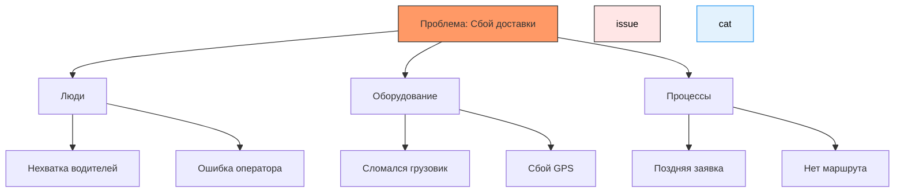

import CausalAnalysisPlay from '@site/src/components/CausalAnalysisPlay.jsx';

# Причинно-следственный анализ

  ОБЯЗАТЕЛЬНО
  ДЛЯ НОВИЧКОВ

Всем

## Причинно-следственный анализ

Фундаментальным элементом понимания любого процесса выступает взаимосвязь между действиями и результатами. Причина представляет собой событие, действие или условие, которое порождает изменение состояния системы. Следствие обозначает само это произошедшее изменение. Идентификация этой цепи позволяет управлять процессом и предсказывать итог при заданных условиях.

Наблюдаемые явления часто связаны множественными факторами. Иногда эти связи возникают спонтанно, иногда возникают по объективным законам физики или логики. Ключевой задачей становится разграничение случайного совпадения и закономерной зависимости.

### Корреляция и причинность

Любая статистика отображает степень сопряженности двух величин. Высокий коэффициент показывает, что значения одной переменной изменяются вместе с другой переменной. Однако такая констатация фактов не гарантирует наличие механизма прямого влияния.

Две переменные могут изменяться параллельно из-за наличия третьей скрытой переменной, которая воздействует на обе величины одновременно. Такое явление называют ложной корреляцией. Истинная причинно-следственная связь подразумевает механизм трансформации энергии, информации или материальных ресурсов от первопричины к результату.

---

## Основная методология исследования

Причинно-следственный анализ систематизирует процесс поиска глубинных мотивов наблюдаемых проблем. Главная цель заключается в выявлении факторов, способных повлиять на конечный результат при изменении параметров среды. Отличие данного метода от обычного описания ситуации кроется в фокусе на динамике изменений, а не на статичном состоянии.

Процесс включает следующие этапы:
1. Формулировка точного определения проблемы или вопроса.
2. Сбор всех возможных версий факторов, влияющих на ситуацию.
3. Проверка каждой версии путем сбора доказательств или проведения тестов.
4. Построение модели, подтверждающей цепочку событий от начала до конца.

Такой подход снижает вероятность ошибок в выводах, так как исключает интуитивные догадки без подтверждений. Структурированный метод позволяет применять единый стандарт оценки эффективности решений.

---

## Инструменты визуализации и диагностики

Для организации поиска первопричин традиционно применяют графические схемы и опросные методики. Эти техники структурируют хаотичный поток идей в логическую последовательность действий.

### Диаграмма Исикавы (Рыбий скелет)

Метод использует график, напоминающий скелет рыбы. Голова диаграммы содержит центральный вопрос или проблему. Хребет идет вправо, от него отходят основные ветви категорий причин. Каждая ветвь может разделяться на подветви более мелких деталей.

В классическом исполнении выделяют шесть основных направлений для производственных процессов:
- **Персонал** (люди, навыки, квалификация);
- **Оборудование** (станки, инструменты, программное обеспечение);
- **Материалы** (сырье, комплектующие, данные);
- **Методы** (технологии, инструкции, регламенты);
- **Измерения** (системы контроля, метрики);
- **Среда** (температура, освещение, внешние условия).

График помогает выявить пробелы в знаниях команды и точки концентрации риска.

#### Пример структуры схемы

Ниже представлен пример построения диаграммы с использованием нотации Mermaid Flowchart. Данный код создает дерево зависимостей.

### Метод «5 Почему» (5 Whys)

<CausalAnalysisPlay />

Этот инструмент работает через серию вопросов, каждое решение базируется на ответе предыдущего вопроса. Начало работы состоит из фиксации симптома. Затем команда задает вопрос «Почему это произошло?». Ответ становится причиной следующего вопроса. Процесс повторяют пять раз или до тех пор, пока ответ не упрется в базовый принцип управления ресурсами.

Пример цепочки рассуждений выглядит следующим образом:
1. Почему остановилась линия? Сработала защита двигателя.
2. Почему сработала защита? Перегрузился подшипник.
3. Почему подшипник перегрузился? Недостаточная смазка.
4. Почему недостаточная смазка? Соскочил фильтр насоса.
5. Почему соскочил фильтр? Отсутствие регулярной замены.

Пятый ответ указывает на необходимость внедрения профилактического регламента. Этот метод эффективен для технических систем и простых бизнес-процессов.

---

## Продвинутые подходы к анализу данных

В сложных средах экономические показатели или поведение пользователей зависят от множества неконтролируемых переменных. Простых методов здесь недостаточно. Математические модели позволяют количественно оценить эффект вмешательства в систему.

### Графовые модели и байесовские сети

Ученые используют направленные ациклические графы для визуализации вероятностных зависимостей. Каждый узел графа представляет переменную состояния. Ребра показывают направления влияния одних переменных на другие. Байесовская теория обновляет оценку вероятности гипотез при поступлении новых данных.

Такая структура позволяет учитывать условные независимости событий. Модель отвечает на вопросы типа «Как изменится вероятность события X, если мы изменим значение параметра Y?». Это критически важно для прогнозирования рисков и принятия управленческих решений.

### Метод разности разностей (Difference-in-Differences, DiD)

Данный подход применяется для оценки воздействия политики или события на конкретную группу. Сравнение ведется по двум временным промежуткам (до и после события) между двумя группами (экспериментальной и контрольной). Логика расчета основана на вычитании изменений контрольной группы из изменений экспериментальной группы.

Расчет показывает чистый эффект от вмешательства. Остальные факторы времени, такие как сезонность или рыночный тренд, компенсируются благодаря наличию контрольной выборки. Метод требует строгого соблюдения условий применимости: одинаковые тренды до вмешательства.

### Синтетический контроль

Когда найти подходящую единственную контрольную группу сложно, исследователи создают искусственную копию экспериментального объекта. Эта синтетическая группа формируется как взвешенная комбинация нескольких альтернативных единиц наблюдения.

Весовые коэффициенты подбираются так, чтобы синтетическая модель максимально точно воспроизводила показатели реального объекта до момента вмешательства. После старта события разница между реальными данными и прогнозом синтетической модели показывает силу эффекта.

---

## Применение

Знание механизмов причинности необходимо во многих сферах деятельности. Базовая постановка задачи определяет ценность получаемых результатов.

### Бизнес и управление

Руководители используют этот метод для устранения причин брака и снижения операционных расходов. Выявление факторов, ведущих к падению продаж, позволяет скорректировать стратегию маркетинга. Анализ задержек в производстве помогает найти уязвимые места в логистических цепочках.

Идеальная ситуация возникает, когда устранение корневой причины приносит долгосрочный позитивный результат вместо временного тушения пожаров.

### Data Science и искусственный интеллект

Построение причинно-следственных моделей улучшает качество алгоритмов машинного обучения. Традиционные модели часто опираются на корреляцию, что приводит к ошибкам при изменении распределения данных. Использование Causal Inference позволяет предотвратить смещения выборки (bias).

Прогнозирование того, как изменение одной метрики повлияет на всю систему, становится возможным только после построения правильной модели. Детали использования описаны в статье на Хабре о причинно-следственном анализе в машинном обучении. [Ссылка](https://habr.com/ru/articles/...)

Связанные материалы доступны в разделах энциклопедии:
- <a href="/encyclopedia/7.%20Проект/7.04.%20Аналитика/">7.04 Аналитика</a>
- <a href="/encyclopedia/6.%20Искусственный%20интеллект/">6. Искусственный интеллект</a>

### Пространственный анализ

Исследование влияния факторов с учетом географического распределения требует специализированного ПО. ГИС-системы позволяют накладывать слои данных (карты плотности населения, инфраструктуры, экономики) друг на друга. Статистическая обработка таких слоев выявляет скрытые паттерны.

Подробно описано в руководстве от Esri по анализу причинно-следственных связей в геопространственных данных.

### Технологические решения в документации

Системный анализ всегда начинается со сбора требований. Правильная постановка вопроса исключает работу над неверной проблемой. Документирование причинно-следственных связей повышает прозрачность архитектуры системы. Это особенно важно при работе с легаси-кодом, где исходный код не объясняет логику.

Справочные материалы по техническому проектированию содержат разделы про моделирование потоков данных.

---
