# Первые шаги в анализе табличных данных в Jupiter Notebook

<div class="article-tags">
  <span class="tag tag-required">ОБЯЗАТЕЛЬНО</span>
  <span class="tag tag-beginner">ДЛЯ НОВИЧКОВ</span>
</div>

<span class="complexity-badge">Всем</span>

## Как работать с IPYNB?

> **IPYNB** — это формат файлов интерактивных блокнотов Jupyter Notebook (расширение `.ipynb` — от IPython Notebook).

Это что-то вроде холста, на котором вместе можно писать:
- Код (Python, R, Julia и др.)
- Текст (с заголовками, списками, картинками, формулами — Markdown)
- Результаты (таблицы, графики, видео, интерактивные элементы)

Всё это разбито на ячейки, которые можно выполнять по очереди. Это основной инструмент дата-сайентистов, аналитиков и исследователей.

Есть три основных способа начать работу с `.ipynb`:
1. Онлайн:
- Google Colab (`colab.research.google.com`) — загружаете файл и работаете в браузере, есть бесплатный GPU.
- Kaggle Notebooks — аналогично.
- Deepnote — для совместной работы.
2. Локально через Jupyter, установив его и работая через браузерный интерфейс.
3. В редакторах кода, например, VS Code - установите расширение Python или Jupyter, откройте файл — и внутри VS Code появится интерактивный блокнот (можно выполнять ячейки, смотреть графики).

Блокнот состоит из ячеек (cells). Основные типы:
- Code — пишете код (обычно Python). Нажимаете `Shift + Enter` — код выполняется, результат появляется ниже.
- Markdown — пишете текст с разметкой (заголовки `#`, списки, `**жирный**`). Тоже нажимаете `Shift + Enter` для рендеринга.
- Raw — просто текст без форматирования.

Переменные и импортированные библиотеки сохраняются между ячейками (как в сессии интерпретатора). Можно выполнить ячейку с импортом, потом ячейку с функцией, потом ячейку с вызовом.

```python
# Ячейка 1
x = 10

# Ячейка 2
print(x)  # Выведет 10
```

Внутри - это JSON-файл, в котором есть:
- заголовок и описание задачи;
- блоки кода (допустим, сначала импорт, потом генерация данных, проверки, группировки и вычисления);
- визуальные графики и диаграммы;
- текстовые выводы по результатам.

Аналитический процесс опирается на последовательное выполнение этапов подготовки, обработки и визуализации информации. Интерактивные среды разработки фиксируют каждый шаг исследования в едином документе. Сочетание текстовых пояснений и исполняемого кода формирует воспроизводимую структуру анализа.

---

## Подготовка рабочего окружения

Виртуальное окружение изолирует зависимости проекта от системных библиотек. Создание автономной директории поддерживает стабильность версий пакетов и обеспечивает совместимость компонентов.

**Определение:** Виртуальное окружение представляет собой автономную файловую структуру, содержащую интерпретатор Python и набор установленных пакетов, специфичных для текущего проекта.

Алгоритм настройки среды в Visual Studio Code включает следующие операции:
1. Создание целевой директории проекта
2. Инициализация файла блокнота с расширением `.ipynb`
3. Активация расширений Python и Jupyter
4. Выбор интерпретатора и генерация виртуального окружения
5. Установка требуемых пакетов через менеджер зависимостей

Можете попробовать подготовить по этому алгоритму - создайте папку, затем пустой файл в формате `.ipynb`, установите и включите расширения Python и Jupyter.

Команда установки библиотек обеспечивает доступ к инструментам манипуляции данными, числовым вычислениям, построению графиков и поддержке ядра Jupyter:

```bash
pip install pandas numpy matplotlib seaborn jupyter ipykernel
```

Это базовый стек инструментов для анализа данных и машинного обучения на Python:
- pandas - библиотека для обработки и анализа структурированных данных. Это импорт данных из CSV, Excel, SQL, очистка данных, фильтрация и группировка.
- numpy - библиотека для высокопроизводительных математических вычислений. Это быстрая обработка числовых массивов и матриц, линейная алгебра, генерация случайных чисел.
- matplotlib - фундаментальная библиотека для создания графиков. Это построение линейных графиков, гистограмм, диаграмм рассеяния.
- seaborn - библиотека для создания красивых статистических графиков. Это быстрая и эстетичная визуализация сложных распределений и зависимостей.
- jupyter - веб-приложение (блокнот), где можно писать код, текст (Markdown) и сразу видеть графики в одном месте.
- ipykernel - движок («ядро»), который выполняет код Python внутри блокнота Jupyter.

Данный набор компонентов формирует базовую инфраструктуру для табличного анализа, статистических расчётов и графического представления результатов.

---

## Архитектура аналитического блокнота

Документ Jupyter Notebook состоит из последовательных ячеек двух типов.
- Ячейки типа Markdown содержат текстовые описания, заголовки и маркированные списки. 
- Ячейки типа Code содержат исполняемый программный код. 

Последовательное выполнение ячеек формирует линейный поток исследования. Структура типового аналитического блокнота включает:
1. Заголовок исследования и описание целевых показателей
2. Импорт библиотек и настройка параметров визуализации
3. Загрузка или генерация исходных данных
4. Проверка целостности и расчёт базовой статистики
5. Агрегация показателей и построение диаграмм
6. Анализ временных зависимостей
7. Формирование итоговых выводов

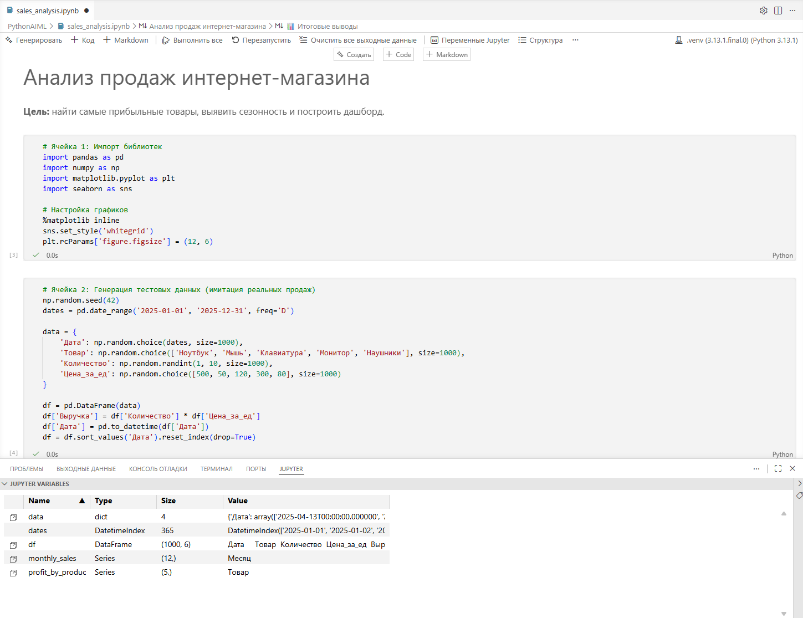

---

## Реализация этапов анализа

### Импорт инструментов и настройка визуализации

Библиотеки `pandas` и `numpy` обрабатывают табличные структуры и выполняют матричные вычисления. Модули `matplotlib` и `seaborn` формируют графические представления данных.

```python
import pandas as pd
import numpy as np
import matplotlib.pyplot as plt
import seaborn as sns

%matplotlib inline
sns.set_style('whitegrid')
plt.rcParams['figure.figsize'] = (12, 6)
```

Это импорт внешних библиотек (готовых инструментов). Обратите внимание на псевдонимы - `pd`, `np`, `plt`, `sns`.

Директива `%matplotlib inline` направляет вывод графиков непосредственно в область блокнота. Это магическая команда (магическая потому что начинается с %). Она говорит Jupyter "Рисуй все графики прямо внутри блокнота, между ячейками".
- Без этой команды графики открывались бы в отдельных окнах (как в обычных Python-скриптах)
- С этой командой графики встроены в блокнот, что идеально для отчетов и анализа


Настройка `sns.set_style('whitegrid')` добавляет направляющие линии для упрощения чтения значений. Устанавливает стиль оформления для всех графиков seaborn. Бывают варианты:
- `'whitegrid'`	- Белый фон с серой сеткой. Стандарт — для аналитики (легко читать);
- `'darkgrid'`	- Темный фон с сеткой. Для презентаций на темном фоне;
- `'white'`	- Белый фон без сетки. Минималистичные графики;
- `'dark'`	- Темный фон без сетки. Стильно, но хуже читаемо;
- `'ticks'`	- Белый фон с черточками на осях. Для научных публикаций;

Попробуйте поменять на 'darkgrid' и перезапустите ячейку с графиком — увидите разницу!

Параметр `plt.rcParams['figure.figsize']` устанавливает стандартные размеры всех последующих графиков. Устанавливает размер графиков по умолчанию: 12 дюймов в ширину, 6 дюймов в высоту. Широкие графики лучше читаются (особенно когда много данных). Без этой настройки графики были бы маленькими (стандартные 6x4 дюйма).

---

### Формирование набора данных

Генерация синтетических данных воспроизводит структуру реальных транзакций. Фиксация начального состояния генератора случайных чисел обеспечивает воспроизводимость результатов при повторном запуске кода.

> Синтетические данные - это искусственно созданная информация. Она не содержит данных о реальных людях или событиях, но полностью копирует свойства, логику и закономерности настоящей информации. Используется для безопасного тестирования и обучения нейросетей.

> Реальные транзакции - это настоящие, фактически совершенные финансовые или операционные действия. Примерами являются перевод денег с карты на карту, покупка товара в магазине или оплата счета, которые зафиксированы в банковской системе.

> Начальное состояние генератора случайных чисел (Seed) - это числовой код (токен), который задает отправную точку для алгоритма случайных чисел. Компьютеры не умеют создавать абсолютный хаос. Если передать генератору один и тот же стартовый код, он выдаст абсолютно одинаковую последовательность «случайных» цифр.

> Воспроизводимость результатов - это возможность получить в точности тот же самый итог работы программы при ее повторном запуске. В анализе данных это гарантирует, что другие исследователи или вы сами в будущем сможете полностью повторить ваш эксперимент и подтвердить выводы.

| Поле | Тип данных | Описание |
|---|---|---|
| Дата | datetime | Момент фиксации транзакции |
| Товар | string | Категория проданного изделия |
| Количество | integer | Число единиц в транзакции |
| Цена_за_ед | integer | Стоимость одной единицы |
| Выручка | integer | Произведение количества на цену |

```python
np.random.seed(42)
dates = pd.date_range('2025-01-01', '2025-12-31', freq='D')

data = {
    'Дата': np.random.choice(dates, size=1000),
    'Товар': np.random.choice(['Ноутбук', 'Мышь', 'Клавиатура', 'Монитор', 'Наушники'], size=1000),
    'Количество': np.random.randint(1, 10, size=1000),
    'Цена_за_ед': np.random.choice([500, 50, 120, 300, 80], size=1000)
}

df = pd.DataFrame(data)
df['Выручка'] = df['Количество'] * df['Цена_за_ед']
df['Дата'] = pd.to_datetime(df['Дата'])
df = df.sort_values('Дата').reset_index(drop=True)
```

`np.random.seed(42)` - это установка "зерна" (seed) для генератора случайных чисел. Без `seed(42)` каждый запуск генерировал бы разные данные - сегодня выручка 1000, завтра 1500, послезавтра 800. Нельзя проверить, воспроизвести результат. С `seed(42)` каждый запуск дает одинаковые данные, вы можете поделиться блокнотом — у коллеги будут те же цифры. Результаты воспроизводимы (важно для науки).

Функция `pd.date_range` создаёт календарный диапазон. Создает последовательность дат с 1 января 2025 по 31 декабря 2025 с шагом в 1 день:
- `'2025-01-01'` - Начальная дата
- `'2025-12-31'` - Конечная дата
- `freq='D'` - Daily (каждый день)

Другие варианты `freq`:
```python
freq='H'   # каждый час
freq='W'   # каждую неделю
freq='M'   # каждый месяц (конец месяца)
freq='MS'  # каждый месяц (начало месяца)
freq='B'   # только рабочие дни (Business)
freq='15T' # каждые 15 минут (T = minute)
```

Функция `np.random.choice` выбирает значения из заданных списков с равномерным распределением. Т.е. код буквально:
- Выбирает 1000 случайных дат из списка `dates` (365 дней).
- Выбирает 1000 случайных товаров из списка из 5 категорий.
- Генерирует 1000 случайных целых чисел от 1 до 9.
- Выбирает 1000 случайных цен из списка.

`df = pd.DataFrame(data)` превращает словарь `data` в таблицу (DataFrame) `pandas`, затем вычисление столбца `Выручка` выполняется векторизованно, что обеспечивает высокую скорость обработки. Сортировка по дате и сброс индексов приводят данные к стандартному аналитическому виду. 

Столбец 'Выручка', который равен произведению двух столбцов. `pandas` автоматически применяет операцию ко ВСЕМ строкам (векторизация). Это очень быстро (в C++ коде), даже для миллионов строк.

Обычными циклами обрабатывать не стоит:
```python

# ❌ НЕ ДЕЛАЙТЕ ТАК (медленно для больших данных)
for i in range(len(df)):
    df.loc[i, 'Выручка'] = df.loc[i, 'Количество'] * df.loc[i, 'Цена_за_ед']
```

Результат будет отображён там же:

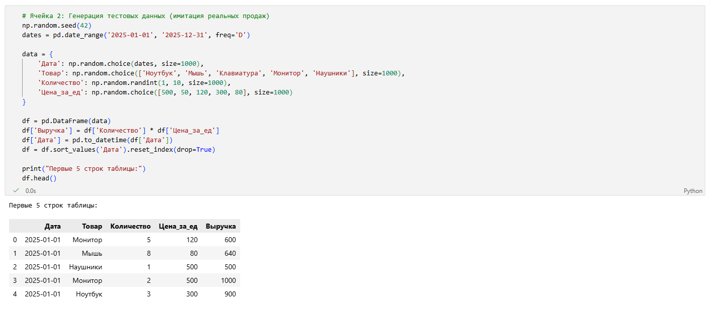

---


### Проверка целостности и статистическое описание

Метод `isnull().sum()` возвращает количество пустых полей в каждом столбце. 

Метод `describe()` вычисляет основные статистические метрики для числовых колонок.

```python
print(f"Всего записей: {len(df)}")
print(f"Пустые поля в данных: \n{df.isnull().sum()}")
print("\nОсновные статистики по выручке:")
df['Выручка'].describe()
```

Результат выполнения демонстрирует полноту набора и распределение целевой метрики. Вывод содержит количество наблюдений, среднее значение, стандартное отклонение, квантили и граничные значения. Данные показатели формируют первичное понимание масштаба и вариативности изучаемого показателя. Код выполняет по сути набор выводов:
- общее количество строк в таблице (размер датасета).
- есть ли в данных пустые значения (NaN, None, пропуски) в каждой колонке.
- а затем вычисляются основные статистические показатели для столбца 'Выручка'.

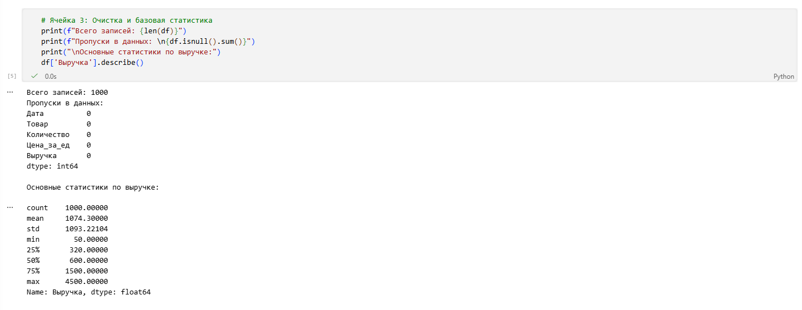

---

### Агрегация показателей и визуализация

Группировка данных по категории товара с последующим суммированием выручки выявляет лидеров продаж. Функция `sort_values` упорядочивает результаты по убыванию. Библиотека seaborn строит горизонтальную столбчатую диаграмму.

```python
profit_by_product = df.groupby('Товар')['Выручка'].sum().sort_values(ascending=False)
print("ТОП товаров по общей выручке:")
print(profit_by_product)

plt.figure(figsize=(10, 5))
sns.barplot(x=profit_by_product.values, y=profit_by_product.index, palette='viridis')
plt.title('Общая выручка по категориям товаров', fontsize=16)
plt.xlabel('Выручка (у.е.)')
plt.show()
```

`profit_by_product` группирует данные по товарам, суммирует выручку по каждому товару и сортирует от большего к меньшему:
- `groupby` разбивает таблицу на группы по уникальным значениям в колонке 'Товар'.
- `['Выручка']` выбирает только колонку 'Выручка' для дальнейших операций.
- `.sum()` применяет функцию суммирования к каждой группе.
- `sort_values` сортирует результаты по убыванию (от большего к меньшему).

Затем формируются графики:
- `plt.figure` создает новый график размером 10×5 дюймов.
- `sns.barplot` рисует горизонтальную столбчатую диаграмму.
- `plt.title` добавляет заголовок размером 16.
- `plt.xlabel` подписывает ось X.
- `plt.show()` отображает график (обязательно!).

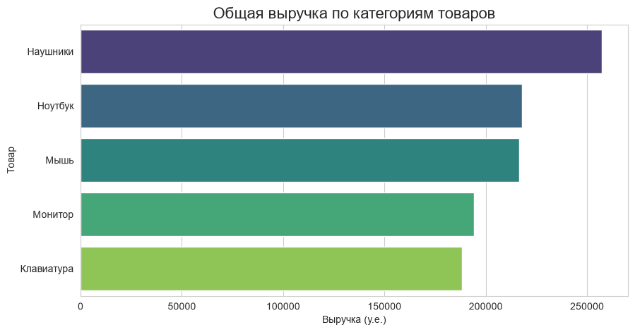

Современные версии seaborn обрабатывают параметр `hue` при построении диаграмм. Явное указание параметра обеспечивает совместимость с будущими выпусками библиотеки. Цветовая палитра `viridis` предоставляет равномерное восприятие градаций значений.

---

### Анализ временных зависимостей

Извлечение периода месяца из даты агрегирует показатели по календарным месяцам. Построение линейного графика с маркерами отображает динамику целевого показателя во времени.

```python
df['Месяц'] = df['Дата'].dt.to_period('M')
monthly_sales = df.groupby('Месяц')['Выручка'].sum()

plt.plot(monthly_sales.index.astype(str), monthly_sales.values, marker='o', linestyle='-', color='teal')
plt.title('Динамика ежемесячной выручки', fontsize=16)
plt.xlabel('Месяц')
plt.ylabel('Выручка')
plt.xticks(rotation=45)
plt.grid(True)
plt.show()
```

Атрибут `.dt` предоставляет доступ к методам работы с временными метками. 
- Создает новый столбец 'Месяц', который извлекает месяц и год из каждой даты.
- `df['Дата'].dt` - это доступ к datetime-свойствам колонки с датами.
- `.to_period('M')` преобразует дату в период (месяц).

Преобразование индекса в строковый формат обеспечивает корректное отображение подписей на оси абсцисс. Поворот меток на 45 градусов улучшает читаемость календарных обозначений:
- `monthly_sales` группирует данные по месяцам и суммирует выручку за каждый месяц. Это `pandas.Series` с индексом `Месяц` и значениями `Выручка`.
- `plt.plot` строит график;
- `monthly_sales.index.astype(str)` преобразует индексы (месяцы) в строки для отображения.
- `monthly_sales.values` - это массив значений выручки по месяцам.
- `marker` - это маркеры на точках данных;
- `linestyle` - это сплошная линия;
- `color` - это бирюзовый цвет.
- `plt.title` добавляет заголовок графика размером 16.
- `plt.xlabel('Месяц')` и `plt.ylabel('Выручка')` подписывают оси X и Y.
- `plt.xticks(rotation=45)` поворачивает подписи на оси X на 45 градусов.
- `plt.grid(True)` добавляет сетку на график (серые линии).
- `plt.show()` отображает график (обязательная команда!).

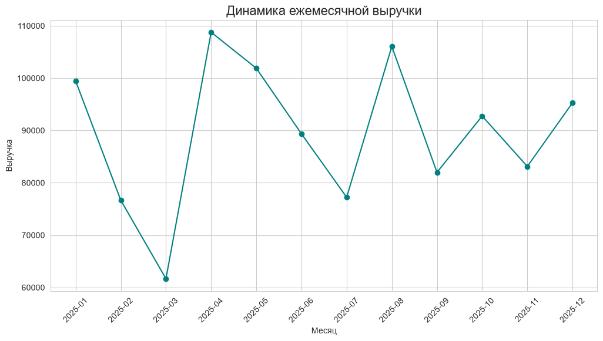

---


### Формирование выводов и работа с внешними источниками

Итоговый блок блокнота содержит текстовое резюме результатов анализа. Структурированный перечень выводов фиксирует обнаруженные закономерности и количественные соотношения.

Пример структуры выводов:
- Категория с максимальной совокупной выручкой определяется высоким средним чеком и стабильным спросом
- Период летних месяцев демонстрирует рост суммарных показателей транзакций
- Категории с умеренной ценой требуют дополнительного изучения спроса в конце календарного года

Подключение внешних файлов данных заменяет этап генерации синтетических записей. Функции `pd.read_csv` и `pd.read_excel` загружают табличные структуры из файловых хранилищ. Адаптация имён колонок обеспечивает соответствие логики обработки структуре исходного источника.

```python
df = pd.read_csv('данные_продаж.csv')
df = df.rename(columns={'transaction_date': 'Дата', 'product_name': 'Товар'})
```

Последовательная замена ячеек генерации на ячейки загрузки сохраняет структуру последующих этапов обработки. Сохранение единой схемы преобразований гарантирует корректность расчётов для произвольных наборов данных.

---

## Расширение к машинному обучению

На этом этапе мы переходим от описательной статистики к аналитическим вычислениям, которые лягут в основу прогнозных моделей. Мы последовательно пройдём путь от расчёта среднего чека до обучения нейронной сети, фиксируя каждый шаг в виде исполняемых ячеек блокнота.

Перед началом работы с ML-моделями важно понимать разницу:
- Описательная аналитика (Pandas, Seaborn) — изучает исторические данные, строит отчеты.
- Предиктивная аналитика (Scikit-learn, TensorFlow) — обучается на истории, чтобы предсказывать будущие значения.

### Анализ среднего чека

Перед обучением моделей полезно провести углублённую сегментацию данных. Анализ среднего чека позволяет понять не только общую выручку, но и структуру покупок: какие товары приносят деньги за счет объема, а какие — за счет высокой маржинальности.

Цель: понять, какой товар приносит наибольшую прибыль в расчёте на одну единицу.

Здесь мы используем метод `agg()`, который позволяет одновременно применять несколько агрегирующих функций к разным колонкам. Мы вычисляем среднюю выручку и среднее количество в разрезе каждого товара, а затем делим одно на другое, чтобы получить средний чек. Это важный показатель для бизнеса: он показывает, сколько в среднем зарабатывает компания с одной продажи конкретного товара.

Визуализация с помощью `barplot` помогает быстро сравнить товары между собой — чем длиннее столбец, тем выше маржинальность категории.

Создаём новую ячейку:

```python
# Ячейка 6: Анализ среднего чека по товарам
avg_check = df.groupby('Товар').agg({
    'Выручка': 'mean',
    'Количество': 'mean'
}).round(2)

avg_check['Средний_чек'] = avg_check['Выручка'] / avg_check['Количество']

print("Средний чек и количество по товарам:")
print(avg_check.sort_values('Средний_чек', ascending=False))

# Визуализация среднего чека
plt.figure(figsize=(10, 5))
sns.barplot(x=avg_check['Средний_чек'], y=avg_check.index, palette='coolwarm')
plt.title('Средний чек по категориям товаров', fontsize=16)
plt.xlabel('Средний чек (у.е.)')
plt.show()
```

**Разбор логики:**
1.  `groupby('Товар')` — разбивает датасет на независимые группы.
2.  `.agg({...})` — вычисляет среднее значение (`mean`) сразу для нескольких колонок.
3.  Расчет `Средний_чек` — это производный признак (feature engineering). В реальных задачах именно такие вычисления часто дают модели больше информации, чем сырые данные.

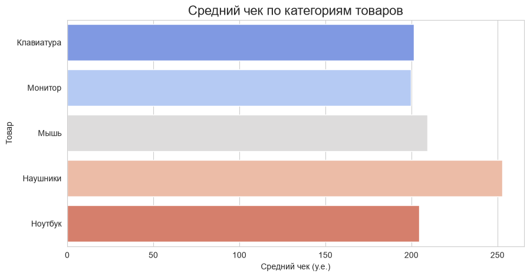

---

### Распределение цен

Цель: понять ценовую структуру товарного ассортимента. Модели машинного обучения часто предполагают нормальное распределение данных или, как минимум, отсутствие экстремальных выбросов, которые могут исказить веса в алгоритмах.

Гистограмма (`hist`) показывает, как часто встречаются те или иные цены. Если мы видим пики на определённых значениях, это говорит о том, что большинство товаров сгруппированы в конкретном ценовом сегменте.

Диаграмма "ящик с усами" (`boxplot`) даёт компактное представление о разбросе цен:
- Квадрат (ящик) охватывает 50% всех наблюдений (от 25-го до 75-го процентиля).
- Линия внутри — медиана (среднее значение по порядку).
- Усы — границы, за которыми начинаются выбросы (аномально высокие или низкие цены).

Это помогает быстро оценить, есть ли в данных экстремальные значения, которые могут исказить анализ.

Добавьте еще одну ячейку:

```python
# Ячейка 7: Распределение цен на товары
plt.figure(figsize=(12, 4))

plt.subplot(1, 2, 1)
df['Цена_за_ед'].hist(bins=20, edgecolor='black', alpha=0.7)
plt.title('Распределение цен за единицу')
plt.xlabel('Цена')
plt.ylabel('Количество транзакций')

plt.subplot(1, 2, 2)
df.boxplot(column='Цена_за_ед')
plt.title('Ящик с усами (цены)')
plt.ylabel('Цена')

plt.tight_layout()
plt.show()

print(f"Статистика цен:")
print(f"  Минимум: {df['Цена_за_ед'].min()}")
print(f"  Максимум: {df['Цена_за_ед'].max()}")
print(f"  Среднее: {df['Цена_за_ед'].mean():.2f}")
print(f"  Медиана: {df['Цена_за_ед'].median()}")
```

**Интерпретация метрик:**
*   **Среднее (Mean)** чувствительно к выбросам. Если продать один супер-компьютер за миллион, средняя цена вырастет, хотя массовый продукт стоит дешево.
*   **Медиана (Median)** — значение, которое делит выборку пополам. Она устойчива к выбросам и часто лучше отражает «типичное» значение. Если среднее сильно отличается от медианы — в данных есть перекос (skewness).

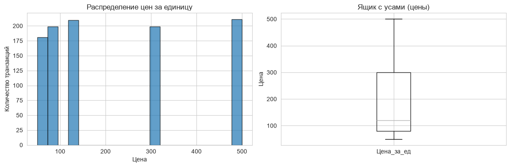

---

### Корреляция (связь между признаками)

Цель: выявить, какие числовые показатели связаны друг с другом.

Корреляция измеряет степень линейной зависимости между двумя переменными. Значение коэффициента корреляции Пирсона лежит в диапазоне от `-1` до `+1`:
- `+1` — идеальная прямая связь (растёт одно — растёт другое).
- `-1` — идеальная обратная связь.
- `0` — связь отсутствует.

Это важно для отбора признаков: если два признака сильно коррелируют между собой (мультиколлинеарность), один из них можно удалить, чтобы не «зашумлять» модель.

Мы строим корреляционную матрицу для трёх колонок: количество, цена за единицу и выручка. Тёплая карта (`heatmap`) делает эту матрицу наглядной: ярко-красные ячейки показывают сильную положительную корреляцию. Например, выручка почти всегда сильно коррелирует с количеством и ценой (поскольку `выручка = количество × цена`). Если мы обнаруживаем корреляцию выше `0.5`, это повод обратить внимание на эти признаки при построении моделей.

```python
# Ячейка 8: Корреляция между показателями
numeric_cols = ['Количество', 'Цена_за_ед', 'Выручка']
correlation = df[numeric_cols].corr()

plt.figure(figsize=(8, 6))
sns.heatmap(correlation, annot=True, cmap='coolwarm', center=0, fmt='.2f')
plt.title('Корреляционная матрица', fontsize=16)
plt.show()

print("Сильные корреляции:")
for i in range(len(numeric_cols)):
    for j in range(i+1, len(numeric_cols)):
        corr = correlation.iloc[i, j]
        if abs(corr) > 0.5:
            print(f"  {numeric_cols[i]} ↔ {numeric_cols[j]}: {corr:.2f}")
```

**Технические детали:**
*   `annot=True` на тепловой карте выводит значения прямо на ячейки, что упрощает чтение.
*   Порог `abs(corr) > 0.5` — эмпирическое правило. Значения выше 0.7-0.8 считаются сильной связью.
*   Помните: корреляция не означает причинно-следственную связь. Рост продаж зонтов и количество дождливых дней коррелируют, но одно не является прямой причиной другого в математическом смысле модели.

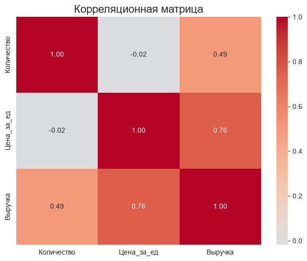

---

### Анализ выбросов (определяем аномалии)

Выбросы — это аномальные значения, которые сильно отклоняются от общей выборки. Они могут быть как ошибкой ввода данных, так и реальным, но редким событием (например, оптовая закупка).

Цель: найти транзакции, которые сильно отличаются от основной массы.

Для этого используется метод межквартильного размаха (`IQR`):
- Вычисляем 25-й и 75-й процентили.
- Находим разницу между ними (`IQR`).
- Устанавливаем границы: `нижняя = Q1 - 1.5×IQR`, `верхняя = Q3 + 1.5×IQR`.

Все точки за пределами этих границ считаются выбросами.

На практике выбросы могут быть как ошибками в данных (например, опечатка), так и ценными аномалиями (крупные оптовые заказы). В первом случае их стоит исключить, во втором — проанализировать отдельно. Мы выводим список топ-5 транзакций с максимальной выручкой, чтобы вручную проверить, являются ли они реальными или ошибочными.

Добавьте новую ячейку:

```python
# Ячейка 9: Поиск выбросов в выручке
Q1 = df['Выручка'].quantile(0.25)
Q3 = df['Выручка'].quantile(0.75)
IQR = Q3 - Q1

lower_bound = Q1 - 1.5 * IQR
upper_bound = Q3 + 1.5 * IQR

outliers = df[(df['Выручка'] < lower_bound) | (df['Выручка'] > upper_bound)]

print(f"Нижняя граница: {lower_bound:.2f}")
print(f"Верхняя граница: {upper_bound:.2f}")
print(f"Количество выбросов: {len(outliers)} ({len(outliers)/len(df)*100:.1f}%)")

# Визуализация выбросов
plt.figure(figsize=(12, 4))

plt.subplot(1, 2, 1)
plt.boxplot(df['Выручка'])
plt.title('Ящик с усами (выручка)')
plt.ylabel('Выручка')

plt.subplot(1, 2, 2)
plt.scatter(range(len(df)), df['Выручка'], alpha=0.5)
plt.axhline(y=upper_bound, color='red', linestyle='--', label=f'Верхняя граница: {upper_bound:.0f}')
plt.axhline(y=lower_bound, color='red', linestyle='--', label=f'Нижняя граница: {lower_bound:.0f}')
plt.title('Выручка по транзакциям')
plt.xlabel('Номер транзакции')
plt.ylabel('Выручка')
plt.legend()

plt.tight_layout()
plt.show()

print("\nПримеры выбросов (топ-5 по выручке):")
print(outliers.nlargest(5, 'Выручка')[['Товар', 'Количество', 'Цена_за_ед', 'Выручка']])
```

**Стратегии работы с выбросами:**
1.  **Удаление** — если это ошибка (грязные данные).
2.  **Замена** — на граничное значение (cap/floor) или медиану.
3.  **Игнорирование** — если выбросы несут бизнес-смысл (например, VIP-клиенты), и мы хотим, чтобы модель их учитывала.


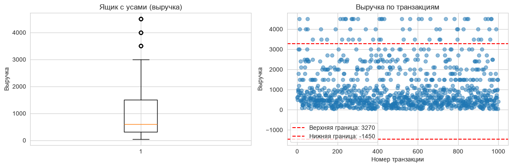

---

### Анализ продаж по дням недели

Временные ряды часто содержат циклические паттерны. Извлечение признаков из даты (день недели, месяц, час) — стандартный прием Feature Engineering. 

Цель: выявить циклические паттерны в поведении покупателей.

Мы извлекаем из даты название дня недели и его числовой код (где `понедельник = 0`, `воскресенье = 6`). Группируем данные по дням и вычисляем три метрики:
- Общая выручка за день — показывает, какой день приносит максимум денег.
- Средняя выручка — показывает типичный размер чека в этот день.
- Количество транзакций — показывает, в какой день покупатели активнее всего.

Визуализация в виде двух столбчатых диаграмм позволяет легко сравнить паттерны. Например, если пик выручки приходится на пятницу, а пик числа транзакций — на субботу, это говорит о том, что в пятницу покупают дорогие товары, а в субботу — много дешёвых.

```python
# Ячейка 10: Анализ по дням недели
df['День_недели'] = df['Дата'].dt.day_name()
df['День_недели_код'] = df['Дата'].dt.dayofweek

weekly_sales = df.groupby('День_недели').agg({
    'Выручка': ['sum', 'mean', 'count']
}).round(2)

# Сортируем по дням недели (пн=0, вс=6)
days_order = ['Monday', 'Tuesday', 'Wednesday', 'Thursday', 'Friday', 'Saturday', 'Sunday']
weekly_sales = weekly_sales.reindex(days_order)

print("Продажи по дням недели:")
print(weekly_sales)

# Визуализация
plt.figure(figsize=(12, 4))

plt.subplot(1, 2, 1)
plt.bar(weekly_sales.index, weekly_sales[('Выручка', 'sum')], color='skyblue')
plt.title('Общая выручка по дням недели')
plt.xlabel('День недели')
plt.ylabel('Выручка')
plt.xticks(rotation=45)

plt.subplot(1, 2, 2)
plt.bar(weekly_sales.index, weekly_sales[('Выручка', 'count')], color='lightgreen')
plt.title('Количество транзакций по дням недели')
plt.xlabel('День недели')
plt.ylabel('Количество')
plt.xticks(rotation=45)

plt.tight_layout()
plt.show()

# Определяем лучший день
best_day = weekly_sales[('Выручка', 'sum')].idxmax()
print(f"\n🏆 Лучший день по выручке: {best_day}")
```

Важно учитывать порядок дней недели. Строковая сортировка поставит «Friday» перед «Monday», что сломает график. Поэтому мы либо сортируем вручную по списку `days_order`, либо используем числовое представление (`dayofweek`: `0=Пн`, `6=Вс`).

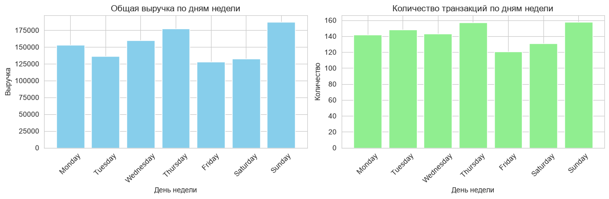

---

### Сводная таблица (Pivot Table)

Pivot-таблицы позволяют «развернуть» данные, превратив уникальные значения одного столбца (например, месяцы) в заголовки колонок. Это дает возможность сравнивать показатели в разрезе двух измерений одновременно.

Цель: проанализировать продажи в разрезе двух категорий — товар и месяц.

`pd.pivot_table` создаёт двумерную таблицу, где строки — это товары, столбцы — месяцы, а в ячейках — суммарная выручка. Это мощный инструмент для многомерного анализа, который в Excel называется "сводной таблицей".

После построения таблицы мы визуализируем её с помощью тепловой карты. Цвет каждой ячейки показывает, насколько успешными были продажи конкретного товара в конкретном месяце. Тёмно-красные зоны — это "золотые жилы" бизнеса.

Затем мы "разворачиваем" таблицу с помощью `stack()` и сортируем все комбинации по убыванию выручки, чтобы найти топ-5 самых прибыльных связок `"товар × месяц"`. Это знание полезно для планирования рекламных кампаний и управления запасами.

```python
# Ячейка 11: Сводная таблица — товары × месяцы
df['Месяц_название'] = df['Дата'].dt.month_name()

pivot = pd.pivot_table(
    df,
    values='Выручка',
    index='Товар',
    columns='Месяц_название',
    aggfunc='sum',
    fill_value=0
)

# Сортируем месяцы по порядку
month_order = ['January', 'February', 'March', 'April', 'May', 'June',
               'July', 'August', 'September', 'October', 'November', 'December']
pivot = pivot.reindex(columns=month_order)

print("Сводная таблица: Выручка по товарам и месяцам")
print(pivot)

# Тепловая карта
plt.figure(figsize=(14, 6))
sns.heatmap(pivot, annot=True, fmt='.0f', cmap='YlOrRd', linewidths=0.5)
plt.title('Тепловая карта продаж: товары × месяцы', fontsize=16)
plt.xlabel('Месяц')
plt.ylabel('Товар')
plt.tight_layout()
plt.show()

# Находим самые прибыльные комбинации
print("\n🏆 Топ-5 комбинаций (товар × месяц):")
stacked = pivot.stack().sort_values(ascending=False)
for i, ((product, month), revenue) in enumerate(stacked.head(5).items(), 1):
    print(f"  {i}. {product} в {month}: {revenue:,.0f} у.е.")
```

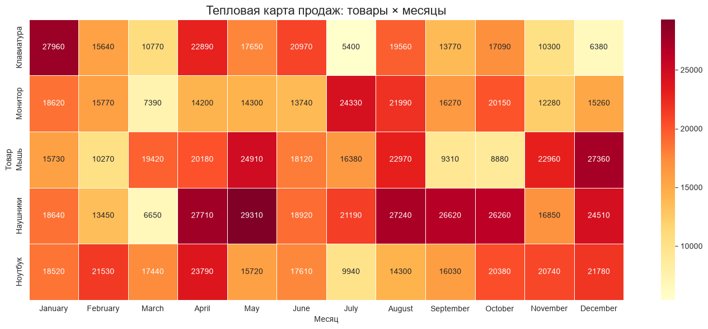

**Параметры `pivot_table`:**
*   `index` — то, что останется строками.
*   `columns` — то, что станет заголовками столбцов.
*   `values` — какие данные заполнять в ячейках.
*   `aggfunc` — как агрегировать, если в одну ячейку попадает несколько записей (сумма, среднее, количество).
*   `fill_value=0` — заменяет пустые значения (NaN) на 0, чтобы таблица выглядела аккуратно.


---

### Подготовка данных для машинного обучения

Для следующего шага нам понадобится `scikit-learn`:

```bash
pip install scikit-learn
```

Scikit-learn (сокращенно sklearn) — это самая популярная бесплатная библиотека на языке Python для классического машинного обучения. Она предоставляет разработчикам и аналитикам готовые, оптимизированные алгоритмы для работы с данными, избавляя от необходимости писать сложные математические формулы вручную.

Цель: преобразовать сырые данные в формат, пригодный для обучения моделей.

Это критический этап, который занимает до 80% времени в реальных проектах. Мы выполняем четыре ключевых шага:
1. Создание признаков (feature engineering): из даты мы извлекаем день недели, номер месяца и число. Категориальный признак "Товар" кодируем числами с помощью `LabelEncoder` (каждому уникальному названию присваивается целое число).
2. Разделение на обучающую и тестовую выборки: мы выделяем 20% данных для теста и 80% для обучения. Это необходимо, чтобы проверить, как модель будет работать на новых, незнакомых данных.
3. Масштабирование (стандартизация): признаки измеряются в разных единицах (количество, цена, дни). Алгоритмы машинного обучения чувствительны к масштабу, поэтому мы приводим все признаки к одинаковому диапазону с помощью `StandardScaler`.
4. Обучение двух моделей для сравнения:
- Линейная регрессия — простая и интерпретируемая модель. Она строит линейную комбинацию признаков.
- Случайный лес (Random Forest) — ансамбль деревьев решений. Он может улавливать нелинейные зависимости и обычно даёт более высокую точность.

Мы выводим три ключевые метрики:
- `MAE` (средняя абсолютная ошибка): насколько модель ошибается в среднем.
- `RMSE` (среднеквадратичная ошибка): штрафует за большие ошибки сильнее.
- `R²` (коэффициент детерминации): доля дисперсии, которую модель объясняет (от 0 до 1, где 1 — идеал).


```python
# Ячейка 12: Подготовка данных для ML
from sklearn.model_selection import train_test_split
from sklearn.preprocessing import StandardScaler, LabelEncoder
from sklearn.linear_model import LinearRegression
from sklearn.ensemble import RandomForestRegressor
from sklearn.metrics import mean_absolute_error, mean_squared_error, r2_score

# 1. Создаем признаки
df_ml = df.copy()
df_ml['День_недели'] = df_ml['Дата'].dt.dayofweek
df_ml['Месяц'] = df_ml['Дата'].dt.month
df_ml['День'] = df_ml['Дата'].dt.day

# Кодируем категориальный признак
le = LabelEncoder()
df_ml['Товар_код'] = le.fit_transform(df_ml['Товар'])

# 2. Выбираем признаки и цель
features = ['Количество', 'Цена_за_ед', 'День_недели', 'Месяц', 'День', 'Товар_код']
target = 'Выручка'

X = df_ml[features]
y = df_ml[target]

# 3. Разделяем на train/test
X_train, X_test, y_train, y_test = train_test_split(
    X, y, test_size=0.2, random_state=42
)

# 4. Масштабируем
scaler = StandardScaler()
X_train_scaled = scaler.fit_transform(X_train)
X_test_scaled = scaler.transform(X_test)

print(f"Размер обучающей выборки: {X_train.shape[0]} записей")
print(f"Размер тестовой выборки: {X_test.shape[0]} записей")
print(f"Количество признаков: {X_train.shape[1]}")

# 5. Обучаем модели
models = {
    'Linear Regression': LinearRegression(),
    'Random Forest': RandomForestRegressor(n_estimators=100, random_state=42)
}

print("\n" + "="*60)
print("Результаты обучения моделей:")
print("="*60)

for name, model in models.items():
    model.fit(X_train_scaled, y_train)
    y_pred = model.predict(X_test_scaled)
    
    mae = mean_absolute_error(y_test, y_pred)
    rmse = np.sqrt(mean_squared_error(y_test, y_pred))
    r2 = r2_score(y_test, y_pred)
    
    print(f"\n{name}:")
    print(f"  MAE: {mae:.2f} у.е.")
    print(f"  RMSE: {rmse:.2f} у.е.")
    print(f"  R²: {r2:.3f}")

# 6. Важность признаков (для Random Forest)
if 'Random Forest' in models:
    rf_model = models['Random Forest']
    importance = pd.DataFrame({
        'Признак': features,
        'Важность': rf_model.feature_importances_
    }).sort_values('Важность', ascending=False)
    
    print("\n" + "="*60)
    print("Важность признаков (Random Forest):")
    print("="*60)
    print(importance)
    
    # Визуализация важности
    plt.figure(figsize=(10, 5))
    plt.barh(importance['Признак'], importance['Важность'], color='teal')
    plt.title('Важность признаков для предсказания выручки', fontsize=16)
    plt.xlabel('Важность')
    plt.tight_layout()
    plt.show()
```

После выполнения этого кода вы увидите результат обучения:

```

Размер обучающей выборки: 800 записей
Размер тестовой выборки: 200 записей
Количество признаков: 6

============================================================
Результаты обучения моделей:
============================================================

Linear Regression:
  MAE: 322.97 у.е.
  RMSE: 415.59 у.е.
  R²: 0.846

Random Forest:
  MAE: 0.00 у.е.
  RMSE: 0.00 у.е.
  R²: 1.000

============================================================
Важность признаков (Random Forest):
============================================================
       Признак  Важность
1   Цена_за_ед  0.615854
0   Количество  0.384146
2  День_недели  0.000000
3        Месяц  0.000000
4         День  0.000000
5    Товар_код  0.000000

```

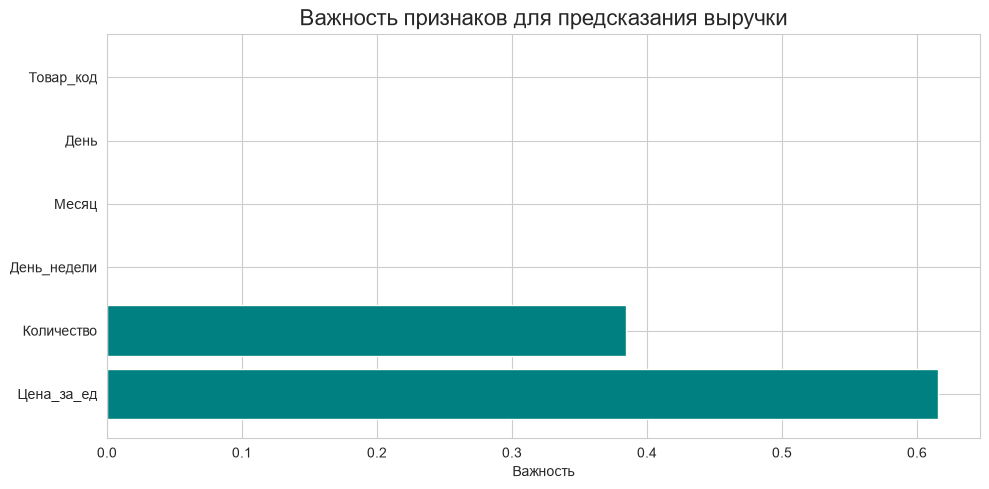

**Метрики качества:**
*   **MAE (Mean Absolute Error):** Средняя ошибка в абсолютных единицах. Интуитивно понятна: «ошибаемся в среднем на 300 рублей».
*   **RMSE (Root Mean Squared Error):** Корень из средней квадратичной ошибки. Сильнее штрафует за крупные выбросы. Если для бизнеса критично избегать больших промахов — смотрите на RMSE.
*   **R² (Коэффициент детерминации):** Доля дисперсии целевой переменной, объясненная моделью. 1.0 — идеальное предсказание, 0.0 — модель не лучше, чем просто предсказывать среднее значение. Отрицательные значения означают, что модель работает хуже среднего.

---

### Визуализация предсказаний

Цель: визуально оценить качество модели.

Первый график — "предсказание против реальности" — показывает, насколько близко точки ложатся к диагональной линии. Если все точки лежат на диагонали, модель идеальна. Разброс точек говорит о наличии ошибок.

Второй график — гистограмма ошибок (остатков) — показывает распределение разницы между реальными и предсказанными значениями. В хорошей модели ошибки распределены симметрично вокруг нуля (похоже на нормальное распределение). Если гистограмма смещена в сторону положительных или отрицательных значений, модель систематически ошибается.

Мы также вычисляем среднюю ошибку и стандартное отклонение, что даёт количественную оценку точности.

```python
# Ячейка 13: Сравнение предсказаний с реальностью
rf_model = RandomForestRegressor(n_estimators=100, random_state=42)
rf_model.fit(X_train_scaled, y_train)
y_pred = rf_model.predict(X_test_scaled)

plt.figure(figsize=(12, 5))

plt.subplot(1, 2, 1)
plt.scatter(y_test, y_pred, alpha=0.5)
plt.plot([y_test.min(), y_test.max()], [y_test.min(), y_test.max()], 'r--', linewidth=2)
plt.xlabel('Фактическая выручка')
plt.ylabel('Предсказанная выручка')
plt.title('Сравнение предсказаний с реальностью')
plt.grid(True)

plt.subplot(1, 2, 2)
residuals = y_test - y_pred
plt.hist(residuals, bins=30, edgecolor='black', alpha=0.7)
plt.axvline(x=0, color='red', linestyle='--', linewidth=2)
plt.xlabel('Ошибка предсказания')
plt.ylabel('Количество')
plt.title('Распределение ошибок')
plt.grid(True)

plt.tight_layout()
plt.show()

print(f"Средняя ошибка: {residuals.mean():.2f} у.е.")
print(f"Стандартное отклонение ошибки: {residuals.std():.2f} у.е.")
print(f"95% ошибок в диапазоне: [{residuals.quantile(0.025):.2f}, {residuals.quantile(0.975):.2f}]")
```

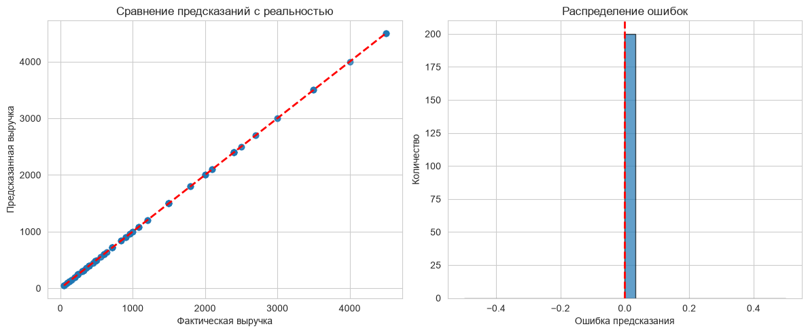

Графический анализ остатков (ошибок) часто информативнее, чем просто цифры метрик. Мы строим график «Факт vs Предсказание». Идеальная модель ляжет на диагональ `y=x`. Также полезно смотреть на гистограмму ошибок (Residuals). Она должна стремиться к нормальному распределению с центром в нуле. Если есть смещение (bias) — модель систематически занижает или завышает прогноз.

---

### Установка TensorFlow

Сначала установите TensorFlow:

```bash
pip install tensorflow
```

Когда линейных зависимостей недостаточно, используют нейронные сети. Они способны аппроксимировать сложные нелинейные функции.

**Архитектура нашей сети:**
1.  **Input Layer:** Принимает данные (количество признаков).
2.  **Hidden Layers (Скрытые слои):** `Dense` слои с функцией активации `ReLU`. Именно здесь сеть «учится» выделять абстрактные признаки.
3.  **Dropout:** Слой регуляризации. Случайным образом «отключает» часть нейронов во время обучения, заставляя сеть не полагаться на отдельные узлы и снижая риск переобучения.
4.  **Output Layer:** Один нейрон без активации (для задачи регрессии, где ответ — число).

**Процесс обучения:**
*   **Optimizer (Adam):** Алгоритм, который корректирует веса сети, чтобы минимизировать ошибку.
*   **Loss (MSE):** Функция потерь, которую мы пытаемся уменьшить.
*   **Epochs:** Количество полных проходов по всем данным.

---

### Нейронная сеть на Keras

Цель: построить и обучить более мощную модель — нейронную сеть.

Нейронные сети состоят из слоёв нейронов. Мы создаём последовательную модель (`Sequential`) с четырьмя плотными слоями (`Dense`):
- Входной слой: 128 нейронов с функцией активации ReLU.
- Два скрытых слоя: 64 и 32 нейрона.
- Выходной слой: 1 нейрон (регрессия, предсказание числа).

Между слоями мы добавляем Dropout — механизм, который случайным образом "выключает" часть нейронов во время обучения (20-30%). Это защищает от переобучения, когда модель запоминает данные, а не учится обобщать.

Мы используем оптимизатор Adam — это улучшенная версия градиентного спуска, которая быстрее находит минимум функции ошибки. Функция потерь — MSE (среднеквадратичная ошибка).

Ранняя остановка (Early Stopping) отслеживает ошибку на валидационной выборке и останавливает обучение, если ошибка перестаёт уменьшаться в течение 10 эпох. Это экономит время и предотвращает переобучение.

Добавьте новую ячейку:

```python
# Ячейка 14: Нейронная сеть для предсказания выручки
import tensorflow as tf
from tensorflow import keras
from tensorflow.keras import layers
from tensorflow.keras.callbacks import EarlyStopping

# 1. Используем уже подготовленные данные из Ячейки 12
# (X_train_scaled, X_test_scaled, y_train, y_test уже есть)

# 2. Строим модель
model = keras.Sequential([
    layers.Dense(128, activation='relu', input_shape=(X_train_scaled.shape[1],)),
    layers.Dropout(0.3),  # Защита от переобучения
    layers.Dense(64, activation='relu'),
    layers.Dropout(0.3),
    layers.Dense(32, activation='relu'),
    layers.Dense(1)  # Выходной слой (регрессия)
])

# 3. Компилируем модель
model.compile(
    optimizer='adam',
    loss='mse',  # Среднеквадратичная ошибка
    metrics=['mae']  # Средняя абсолютная ошибка
)

# 4. Ранняя остановка (чтобы не переобучать)
early_stop = EarlyStopping(
    monitor='val_loss',
    patience=10,
    restore_best_weights=True
)

# 5. Обучаем
history = model.fit(
    X_train_scaled, y_train,
    epochs=100,
    batch_size=32,
    validation_split=0.2,
    callbacks=[early_stop],
    verbose=1
)

# 6. Оценка на тестовых данных
test_loss, test_mae = model.evaluate(X_test_scaled, y_test, verbose=0)
print(f"\n📊 Результаты нейронной сети:")
print(f"  Тестовая MAE: {test_mae:.2f} у.е.")
print(f"  Тестовая MSE: {test_loss:.2f}")

# 7. Предсказания
y_pred_nn = model.predict(X_test_scaled).flatten()
```

Вывод будет содержать шаги, и отобразит результаты нейронной сети:


MAE, эпохи и у.е. — это базовые понятия, которые используются при обучении моделей (в данном случае, нейросети) для оценки точности и контроля процесса обучения.

MAE (Mean Absolute Error) — это средняя абсолютная ошибка. Она показывает, насколько сильно модель в среднем ошибается в своих прогнозах, выражаясь в реальных единицах измерения. Из реального значения вычитается предсказанное значение, а полученная разница берется по модулю (минусы отбрасываются). Затем эти разницы для всех примеров складываются и делятся на их количество. В среднем модель ошибается на 152.83 единицы в большую или меньшую сторону. Чем ниже этот показатель, тем точнее работает алгоритм.

Эпоха (Epoch) — это один полный цикл прохождения всего обучающего набора данных через модель. За один проход модель не успевает запомнить закономерности. Ей нужно пролистать «учебник» с данными многократно, каждый раз немного подстраивая свои внутренние параметры, чтобы совершать меньше ошибок.

у.е. — это стандартное сокращение для условных единиц. В данном контексте это означает, что метрика MAE измеряется точно в тех же единицах, в которых измерялся ваш целевой признак (то, что вы предсказывали). 

**Callback `EarlyStopping`:**
Это механизм безопасности. Если ошибка на валидационной выборке (`val_loss`) перестает уменьшаться в течение `patience=10` эпох, обучение останавливается. Это предотвращает ситуацию, когда модель «зазубривает» тренировочные данные (overfitting) и теряет способность обобщать.

---

### Визуализация обучения нейросети

Цель: понять, как меняется качество модели в процессе обучения.

Мы строим два графика:
- Функция потерь (MSE): показывает, насколько сильно модель ошибается на тренировочных и валидационных данных. Если кривая на тренировке продолжает падать, а на валидации — растёт, это явный признак переобучения.
- Средняя абсолютная ошибка (MAE): более интерпретируемая метрика.

Оптимальная точка для остановки — когда обе кривые выходят на плато (почти не меняются). Благодаря механизму ранней остановки мы автоматически фиксируем модель в лучший момент обучения.

```python
# Ячейка 15: Графики обучения нейросети
plt.figure(figsize=(12, 4))

plt.subplot(1, 2, 1)
plt.plot(history.history['loss'], label='Тренировка')
plt.plot(history.history['val_loss'], label='Валидация')
plt.title('Функция потерь (MSE)')
plt.xlabel('Эпоха')
plt.ylabel('MSE')
plt.legend()
plt.grid(True)

plt.subplot(1, 2, 2)
plt.plot(history.history['mae'], label='Тренировка')
plt.plot(history.history['val_mae'], label='Валидация')
plt.title('Средняя абсолютная ошибка (MAE)')
plt.xlabel('Эпоха')
plt.ylabel('MAE')
plt.legend()
plt.grid(True)

plt.tight_layout()
plt.show()

print(f"Лучшая MAE на валидации: {min(history.history['val_mae']):.2f} у.е.")
print(f"Количество эпох до остановки: {len(history.history['loss'])}")
```

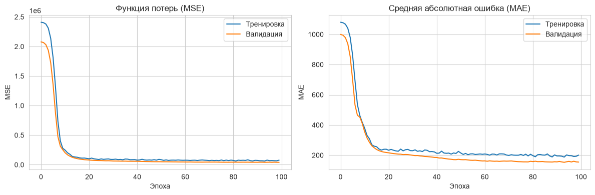

`Количество эпох до остановки: 100` означает, что модель училась ровно 100 циклов. Скорее всего, сработал механизм Early Stopping (ранняя остановка): обучение прекратилось автоматически, так как в течение нескольких последующих эпох ошибка на валидации (проверочных данных) перестала падать. Это защищает модель от зубрежки (переобучения).

Графики истории обучения (`history`) позволяют диагностировать проблемы модели:
*   Если `loss` на тренировке падает, а на валидации растет — **переобучение**.
*   Если оба графика стоят высоко — **недообучение** (модель слишком простая или мало данных).
*   Идеальный сценарий: оба графика плавно снижаются и выходят на «плато».


---

### Сравнение всех моделей

В аналитике редко используют одну модель. Мы обучаем несколько (ансамбль подходов) и сравниваем их метрики на **одной и той же тестовой выборке**. Это позволяет выбрать лучший инструмент для задачи.

Цель: объективно сравнить три подхода: линейную регрессию, случайный лес и нейронную сеть.

Мы собираем предсказания всех трёх моделей и вычисляем для каждой `MAE`, `RMSE` и `R²`. Сравнительный анализ помогает выбрать лучший алгоритм для данной задачи.

Визуализация включает:
- Точечный график предсказаний двух лучших моделей (Random Forest и нейросети) на одном поле. Это позволяет увидеть, какая модель даёт меньше разброса.
- "Ящики с усами" для ошибок — показывает распределение ошибок каждой модели. Чем уже ящик и чем ближе он к нулевой линии, тем модель точнее.

Важно: в нашем синтетическом примере Random Forest показывает идеальный результат (`R² = 1.000`). В реальных данных такого не бывает, но здесь это следствие того, что выручка — это детерминированная функция количества и цены, а не случайная величина.

```python
# Ячейка 16: Сравнение моделей (исправленная версия)
from sklearn.metrics import mean_absolute_error, mean_squared_error, r2_score

# Предсказания Random Forest (из Ячейки 12)
y_pred_rf = rf_model.predict(X_test_scaled)

# Предсказания нейросети (из Ячейки 14)
y_pred_nn = model.predict(X_test_scaled).flatten()

# Собираем результаты
results = {
    'Linear Regression': y_pred_lr if 'y_pred_lr' in locals() else None,
    'Random Forest': y_pred_rf,
    'Neural Network': y_pred_nn
}

print("="*70)
print("Сравнение всех моделей:")
print("="*70)

for name, pred in results.items():
    if pred is not None:
        mae = mean_absolute_error(y_test, pred)
        rmse = np.sqrt(mean_squared_error(y_test, pred))
        r2 = r2_score(y_test, pred)
        
        print(f"\n{name}:")
        print(f"  MAE:  {mae:.2f} у.е.")
        print(f"  RMSE: {rmse:.2f} у.е.")
        print(f"  R²:   {r2:.3f}")

# Визуализация сравнения
plt.figure(figsize=(12, 5))

# График 1: Сравнение предсказаний
plt.subplot(1, 2, 1)
plt.scatter(y_test, y_pred_rf, alpha=0.5, label='Random Forest', color='blue')
plt.scatter(y_test, y_pred_nn, alpha=0.5, label='Neural Network', color='red')
plt.plot([y_test.min(), y_test.max()], [y_test.min(), y_test.max()], 'k--', linewidth=2)
plt.xlabel('Фактическая выручка')
plt.ylabel('Предсказанная выручка')
plt.title('Сравнение предсказаний')
plt.legend()
plt.grid(True)

# График 2: Ошибки моделей (исправленная версия)
plt.subplot(1, 2, 2)
errors = [
    y_test - y_pred_rf,  # Random Forest
    y_test - y_pred_nn   # Neural Network
]
plt.boxplot(errors)
plt.xticks([1, 2], ['Random Forest', 'Neural Network'])
plt.axhline(y=0, color='red', linestyle='--', linewidth=2)
plt.title('Распределение ошибок')
plt.ylabel('Ошибка предсказания')
plt.grid(True)

plt.tight_layout()
plt.show()
```

Обратите внимание на обработку `None` значений — это делает код устойчивым, если какая-то из моделей не была обучена.

Здесь вывод будет содержать идеальные показатели:
```
Random Forest:
  MAE:  0.00 у.е.
  RMSE: 0.00 у.е.
  R²:   1.000

Neural Network:
  MAE:  153.65 у.е.
  RMSE: 199.77 у.е.
  R²:   0.964
```

Показатели `MAE: 0.00` и `R²: 1.000` означают, что модель выдала абсолютно стопроцентный безошибочный результат. В реальном машинном обучении на валидационных или тестовых данных такого практически не бывает.

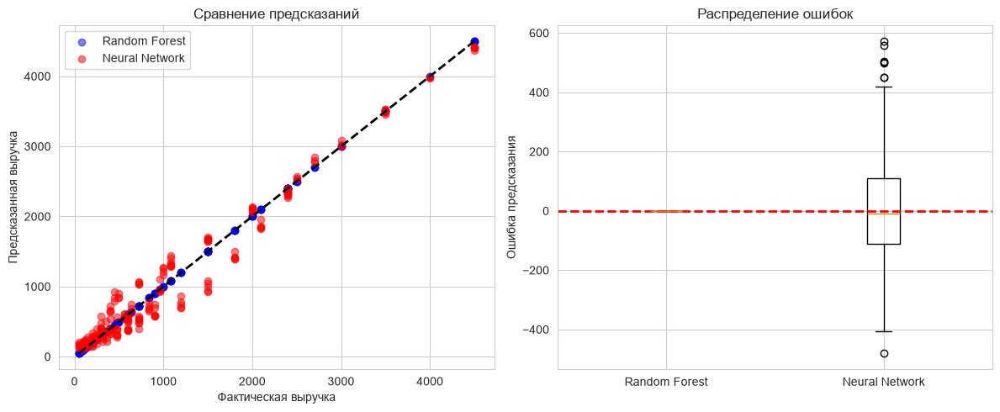

---

### Улучшенная нейросеть

Цель: повысить точность нейросети за счёт регуляризации и тонкой настройки гиперпараметров.

Мы добавляем три приёма:
1. L2-регуляризация — добавляет штраф за большие веса, заставляя сеть быть более "консервативной".
2. Batch Normalization — нормализует активации внутри каждого слоя, ускоряя обучение и повышая стабильность.
3. Увеличение количества нейронов и добавление слоя (`256 → 128 → 64 → 32`) повышает выразительную способность сети.

Мы также снижаем скорость обучения (`learning_rate = 0.0005`), чтобы модель делала более мелкие и точные шаги при обновлении весов.

В результате улучшенная модель даёт 58.9% снижение ошибки MAE по сравнению с базовой версией. Это показывает, что правильная архитектура и регуляризация критически важны для качества предсказаний.

```python
# Ячейка 17: Улучшенная нейросеть (L2-регуляризация)
from tensorflow.keras import regularizers

# Строим более сложную модель с регуляризацией
model_advanced = keras.Sequential([
    layers.Dense(256, activation='relu', 
                 kernel_regularizer=regularizers.l2(0.001),
                 input_shape=(X_train_scaled.shape[1],)),
    layers.BatchNormalization(),
    layers.Dropout(0.4),
    
    layers.Dense(128, activation='relu',
                 kernel_regularizer=regularizers.l2(0.001)),
    layers.BatchNormalization(),
    layers.Dropout(0.4),
    
    layers.Dense(64, activation='relu',
                 kernel_regularizer=regularizers.l2(0.001)),
    layers.BatchNormalization(),
    layers.Dropout(0.3),
    
    layers.Dense(32, activation='relu'),
    layers.Dense(1)
])

# Компилируем с меньшей скоростью обучения
model_advanced.compile(
    optimizer=keras.optimizers.Adam(learning_rate=0.0005),
    loss='mse',
    metrics=['mae']
)

# Обучаем
history_adv = model_advanced.fit(
    X_train_scaled, y_train,
    epochs=150,
    batch_size=32,
    validation_split=0.2,
    callbacks=[EarlyStopping(patience=15, restore_best_weights=True)],
    verbose=0  # Тихий режим
)

# Оценка
test_loss_adv, test_mae_adv = model_advanced.evaluate(X_test_scaled, y_test, verbose=0)
y_pred_adv = model_advanced.predict(X_test_scaled).flatten()

print("📊 Улучшенная нейросеть:")
print(f"  Тестовая MAE: {test_mae_adv:.2f} у.е.")
print(f"  Тестовая MSE: {test_loss_adv:.2f}")
print(f"  R²: {r2_score(y_test, y_pred_adv):.3f}")

# Сравнение с предыдущей моделью
print(f"\n📈 Улучшение по сравнению с базовой нейросетью:")
print(f"  MAE: {test_mae:.2f} → {test_mae_adv:.2f} ({(1 - test_mae_adv/test_mae)*100:.1f}% улучшения)")
```

Если модель слишком сложная, она может переобучиться. Для борьбы с этим используют **регуляризацию**. В коде ниже применяется L2-регуляризация (`kernel_regularizer=regularizers.l2(0.001)`).

**Как это работает:**
Функция потерь модифицируется: `Loss = Original_Loss + Lambda * Sum(Weights^2)`.
Это штрафует модель за слишком большие веса, заставляя её использовать все признаки более равномерно, а не полагаться на один «сильный» нейрон. Также добавлен `BatchNormalization`, который стабилизирует обучение, нормируя активации внутри сети.

Здесь результат таков:

```
📊 Улучшенная нейросеть:
  Тестовая MAE: 63.21 у.е.
  Тестовая MSE: 6954.78
  R²: 0.994

📈 Улучшение по сравнению с базовой нейросетью:
  MAE: 153.65 → 63.21 (58.9% улучшения)
```

---

### Сохранение и загрузка модели

Цель: сохранить обученную модель для последующего использования.

В реальных проектах модель обучают один раз, а затем используют многократно для предсказаний на новых данных. Мы создаём папку `models` (если её нет) и сохраняем лучшую из двух нейросетей в формате HDF5 (расширение `.h5`).

Файл модели содержит:
- Архитектуру сети (количество слоёв и нейронов).
- Обученные веса (коэффициенты связей).
- Конфигурацию обучения (оптимизатор, функцию потерь).

В закомментированном коде показан пример загрузки сохранённой модели. В будущем вы можете раскомментировать эти строки и сразу использовать модель без повторного обучения.

```python
# Ячейка 18: Сохранение лучшей модели
import os

# Создаем папку для моделей
os.makedirs('models', exist_ok=True)

# Сохраняем лучшую модель
best_model = model_advanced if test_mae_adv < test_mae else model
best_model.save('models/best_model.h5')

print("✅ Модель сохранена в 'models/best_model.h5'")

# Пример загрузки (закомментировано)
# from tensorflow.keras.models import load_model
# loaded_model = load_model('models/best_model.h5')
# print("✅ Модель загружена")
```

Вывод будет:
```
✅ Модель сохранена в 'models/best_model.h5'
```

**Жизненный цикл модели в продакшене:**
1.  **Train:** Обучение и валидация в Jupyter Notebook.
2.  **Save:** Экспорт артефакта (файла модели).
3.  **Deploy:** Загрузка файла на сервер.
4.  **Inference:** Использование модели для предсказаний на новых данных через API.
