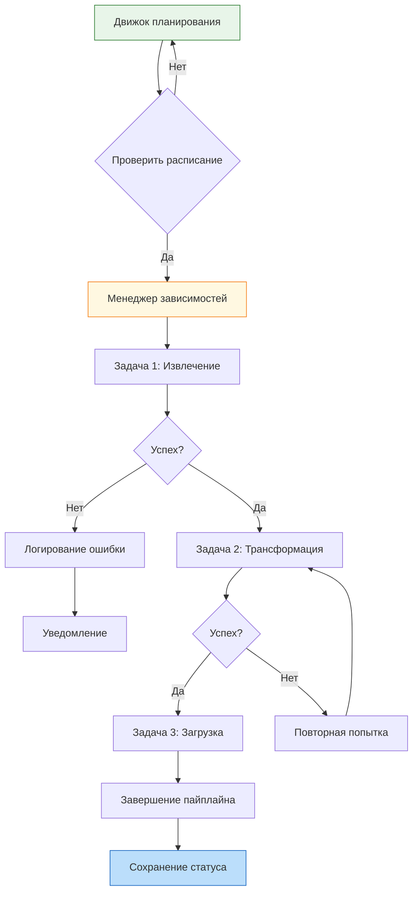

import ExternalCodeEmbed from '@site/src/components/ExternalCodeEmbed';
import ExternalPlayEmbed from '@site/src/components/ExternalPlayEmbed';

# ETL-ELT и оркестрация

  ОБЯЗАТЕЛЬНО
  ДЛЯ НОВИЧКОВ

Всем

---

## ETL-ELT и оркестрация

В современной архитектуре информационных систем хранение и обработка данных занимают центральное место. **Data Warehouse** накапливает уже подготовленные таблицы для BI и отчётности, **Data Lake** — сырые данные любых форматов с обработкой по запросу, а в крупных организациях домены публикуют **data products** в рамках **Data Mesh**. Общая картина трёх подходов — в [Big Data, раздел "Хранение"](/encyclopedia/3-data-markup/3-11-analiz-dannyh/11#data-warehouse-lake-mesh).

Источники по-прежнему разрознены — транзакционные базы, лог-файлы, API, потоки IoT. Чтобы превратить этот поток в структурированные знания, пригодные для аналитики и принятия решений, используют процессы перемещения и преобразования данных.

Эти процессы делятся на два основных подхода к интеграции: ETL и ELT. Общая теория пакетов, чанков, идемпотентности и перезапуска job — в [Пакетная работа с данными](/encyclopedia/3-data-markup/3-11-analiz-dannyh/433). Первый подход предполагает предварительную обработку данных перед их загрузкой во вторичное хранилище. Второй подход загружает данные сразу, оставляя трансформацию для этапа работы внутри целевой системы. Выбор между этими стратегиями зависит от архитектуры инфраструктуры, требований к скорости обработки и доступных вычислительных ресурсов.

Сами по себе шаги извлечения, загрузки и преобразования не выполняются хаотично. Они объединяются в сложные конвейеры (пайплайны), где результат одного этапа становится входом для следующего. Управление такими цепочками задач, контроль зависимостей, планирование времени выполнения и реагирование на сбои — это задача оркестрации данных. Оркестратор выступает в роли дирижёра, обеспечивающего слаженную работу всех инструментов и гарантирующего, что данные будут доступны в нужное время в нужном виде.

---

## Ключевые различия подходов ETL и ELT

### Подход ETL (Extract, Transform, Load)

Подход **ETL** (Извлечение, Преобразование, Загрузка) представляет собой классическую модель построения хранилищ данных. В этой схеме данные проходят через три последовательных этапа в отдельной промежуточной среде или на специализированном сервере интеграции.

Первый этап — **Извлечение (Extract)**. Система подключается к источникам данных, таким как реляционные базы данных, CRM-системы, файлы CSV или Excel, и считывает необходимые записи. На этом этапе происходит первоначальный сбор информации без её изменения.

Второй этап — **Преобразование (Transform)**. Это наиболее ресурсоемкая часть процесса. Данные очищаются от ошибок, приводятся к единому формату, фильтруются, агрегируются и обогащаются дополнительными полями. Здесь применяются бизнес-правила — например, конвертация валют, нормализация имен фамилий, удаление дубликатов или расчет производных показателей. Все эти операции выполняются на сервере ETL до того, как информация попадет в конечное хранилище.

Третий этап — **Загрузка (Load)**. После завершения всех трансформаций подготовленные данные записываются в целевое хранилище данных (DWH). Целевая система получает уже чистую, структурированную информацию, готовую к использованию аналитиками и отчетными системами.

Подход ETL идеально подходит для сценариев, где требуется строгая валидация данных перед их сохранением. Он часто используется в локальных инфраструктурах, где объем обрабатываемых данных ограничен, а требования к конфиденциальности и безопасности высоки. Предварительная фильтрация позволяет не хранить лишнюю информацию в хранилище, экономя дисковое пространство. Также этот метод предпочтителен, когда целевая система имеет ограниченные вычислительные мощности и не может самостоятельно выполнять сложные запросы на трансформацию больших объемов данных.

---

### Подход ELT (Extract, Load, Transform)

Подход **ELT** (Извлечение, Загрузка, Преобразование) возник как ответ на развитие облачных технологий и появление мощных распределенных хранилищ данных. В этой модели порядок действий меняется: данные сначала загружаются в целевую систему, а затем преобразуются внутри неё.

Первый этап — **Извлечение (Extract)** остается прежним. Система собирает данные из исходных источников.

Второй этап — **Загрузка (Load)**. Сырые данные, часто называемые "сырым слоем" (Raw Layer), массово переносятся в целевое хранилище. При этом структура данных может не изменяться, могут сохраняться все поля, включая служебные и временные метки. Современные облачные платформы, такие как Snowflake, Google BigQuery, Amazon Redshift или Azure Synapse, обладают огромной пропускной способностью и скоростью записи, что делает этот этап очень быстрым.

Третий этап — **Преобразование (Transform)**. Трансформация выполняется уже внутри целевого хранилища с использованием встроенного языка запросов (обычно SQL). Специализированные движки используют параллельные вычисления множества узлов кластера для обработки петабайтов данных. Это позволяет выполнять сложные операции над данными, которые были бы невозможны или слишком медленны при использовании внешнего сервера ETL.

Подход ELT является более масштабируемым решением для современных архитектур. Он устраняет необходимость в промежуточных серверах интеграции, снижая затраты на инфраструктуру. Гибкость этого метода позволяет хранить исходные данные длительно (без жёсткого срока удаления), что даёт возможность вернуться к ним и применить новые правила трансформации в будущем без повторного извлечения из источников. Этот подход критически важен для работы с большими данными (Big Data), где объемы информации превышают возможности традиционных ETL-инструментов.

---

### Сравнительный анализ стратегий

Выбор между ETL и ELT определяет архитектуру всей системы управления данными. Каждая стратегия имеет свои преимущества и ограничения, которые следует учитывать при проектировании.

| Характеристика | ETL (Extract, Transform, Load) | ELT (Extract, Load, Transform) |
| :--- | :--- | :--- |
| **Порядок операций** | Сначала трансформация, потом загрузка | Сначала загрузка, потом трансформация |
| **Место обработки** | Отдельный сервер или промежуточная среда | Внутри целевого хранилища данных |
| **Тип данных** | Очищенные, структурированные данные | Сырые данные (raw data) |
| **Масштабируемость** | Ограничена мощностью сервера ETL | Высокая, зависит от мощности облака |
| **Гибкость** | Низкая, изменение логики требует перенастройки | Высокая, можно менять SQL-запросы динамически |
| **Стоимость инфраструктуры** | Требует выделенных ресурсов для ETL | Экономит ресурсы, использует мощь хранилища |
| **Скорость загрузки** | Медленная из-за предварительной обработки | Быстрая, прямая запись в хранилище |
| **Идеальная сфера** | Локальные системы, строгая безопасность | Облачные хранилища, Big Data, аналитика |

<ExternalPlayEmbed example="data-markup/etl-elt-orchestration-play" title="ETL/ELT — оркестрация" minHeight={520} />

Подход ETL обеспечивает высокую степень контроля над качеством данных на ранних стадиях. Если данные содержат ошибки, они отсеиваются до попадания в хранилище. Это важно для систем, где допустимость неточностей крайне низка. Однако такая схема создает узкое место в виде сервера ETL, который может стать Bottleneck при росте объемов данных.

Подход ELT позволяет сохранять полную историю изменений и экспериментировать с данными. Аналитик может написать новый запрос для получения новых метрик, не требуя перезапуска всего пайплайна. Это ускоряет цикл разработки отчетов и снижает зависимость от команды разработчиков. Основной риск здесь — хранение большого объема сырых данных, что может увеличить расходы на облачное хранилище, если не настроены политики хранения и архивации.

---

## Архитектура оркестрации данных

Надёжный пайплайн проектируют с **идемпотентностью** (повторный запуск даёт тот же результат), **контрактами данных** между слоями (схема, SLA свежести, допустимые null) и разделением **raw → curated → semantic**, как в [Data Science](/encyclopedia/3-data-markup/3-11-analiz-dannyh/12). Сбой на шаге N не должен портить уже опубликованные витрины без явной версии отката.

Оркестрация данных представляет собой дисциплину управления сложными рабочими процессами, связывающими разрозненные задачи в единую систему. Если ETL и ELT отвечают за выполнение конкретных операций с информацией, то оркестратор отвечает за координацию этих операций во времени и пространстве. Без оркестрации создание надежных конвейеров данных практически невозможно, так как ручное управление сотнями зависимых задач приводит к ошибкам и простоям.

Конвейер данных (Data Pipeline) состоит из множества шагов — чтение из источника, очистка, трансформация, загрузка, валидация и уведомление. Каждый шаг может зависеть от результата предыдущего. Например, задача трансформации не должна начинаться, пока задача загрузки не завершится успешно. Если источник недоступен, весь конвейер должен быть остановлен или переведен в режим ожидания. Оркестратор отслеживает состояние каждого звена и принимает решения о переходе к следующему этапу.

Оркестрация также решает задачу управления расписанием. Многие процессы должны выполняться в определенное время — ежедневная сводка продаж формируется каждое утро в 06:00, ежемесячная отчетность запускается первого числа месяца, синхронизация с внешними API происходит каждые 15 минут. Оркестратор использует механизмы планирования (cron-like schedules) для автоматического запуска задач в нужные моменты, исключая необходимость участия человека.

Когда возникают сбои, оркестратор берет на себя функции мониторинга и восстановления. Он отслеживает логи выполнения, фиксирует коды ошибок и статусы процессов. При обнаружении проблемы система может автоматически предпринять действия по исправлению — перезапустить упавший шаг, отправить уведомление администратору, переключиться на резервный источник данных или приостановить выполнение всего пайплайна до устранения причины сбоя. Это обеспечивает устойчивость системы и гарантирует, что данные будут доставлены вовремя.

---

### Компоненты системы оркестрации

Современные инструменты оркестрации состоят из нескольких ключевых компонентов, каждый из которых выполняет свою функцию в общем процессе.

**Движок планирования (Scheduler Engine)** управляет временем выполнения задач. Он хранит определения расписаний, проверяет условия запуска и инициирует выполнение DAG (Directed Acyclic Graph — направленный ациклический граф). Движок поддерживает различные типы триггеров — по времени, по событию (например, поступление файла в папку) или по зависимости от другой задачи.

**Менеджер зависимостей (Dependency Manager)** анализирует структуру пайплайна и определяет порядок выполнения. Он строит граф задач, где узлы представляют собой отдельные операции, а ребра указывают направление потока данных. Менеджер гарантирует, что задача не запустится, пока все её предшественники не завершатся успешно. Это предотвращает ситуации, когда данные используются до того, как они были получены.

**Мониторинг и логирование (Monitoring & Logging)** предоставляют прозрачность процесса. Инструмент собирает логи выполнения каждой задачи, сохраняет метрики производительности (время старта, время окончания, потребление ресурсов) и отображает текущее состояние пайплайна на дашбордах. Администраторы видят историю выполнений, могут анализировать причины сбоев и оценивать эффективность работы системы.

**Управление ошибками (Error Handling)** включает механизмы повторных попыток (retry logic). Если задача падает из-за временной ошибки сети, оркостратор может выполнить её повторно через заданный интервал. Настройка количества попыток и интервалов между ними позволяет адаптировать поведение системы к различным условиям среды. Также реализуются стратегии оповещения: уведомления отправляются в мессенджеры или на почту при критических сбоях.

**Хранение состояния (State Management)** сохраняет информацию о выполнении пайплайнов. Это необходимо для восстановления после перезагрузки системы, анализа истории и обеспечения идемпотентности процессов. Знание того, какая задача была выполнена последней, позволяет продолжить работу с места остановки, а не начинать заново.

---

### Пример реализации пайплайна

Рассмотрим типичный сценарий использования оркестрации для ежедневной отчетности. Пайплайн начинается с проверки наличия новых файлов в системе хранения. Если файлы присутствуют, запускается задача извлечения данных. Затем данные передаются на этап очистки, где удаляются дубликаты и заполняются пропуски. Следующим шагом идет трансформация: данные группируются по регионам и суммируются по категориям товаров. После этого результаты загружаются в хранилище данных. В конце пайплайна генерируется отчет и отправляется заинтересованным сторонам.

Если на этапе извлечения файл не найден, оркестратор останавливает выполнение и отправляет предупреждение. Если на этапе трансформации возникает ошибка валидации, система может перезапустить эту задачу дважды. Если после двух попыток ошибка сохраняется, пайплайн прерывается, и администратор получает критическое уведомление. Такой подход минимизирует время простоя и обеспечивает своевременное реагирование на проблемы.

---

## Практическая реализация и инструменты

Реализация оркестрации данных требует выбора подходящего инструмента. Рынок предлагает множество решений, от простых скриптовых утилит до сложных корпоративных платформ. Выбор зависит от масштаба проекта, бюджета и технических требований.

**Apache Airflow** является одним из самых популярных открытых инструментов оркестрации. Он использует Python для определения рабочих процессов, что дает гибкость и возможность интегрировать любой код. Airflow строит DAG-графы, которые визуализируют зависимости между задачами. Он поддерживает масштабирование через Kubernetes, имеет богатую экосистему операторов для взаимодействия с различными системами и предоставляет веб-интерфейс для мониторинга.

**Prefect** — современная альтернатива Airflow, ориентированная на простоту использования и легкость разработки. Он также использует Python, но предлагает более интуитивный интерфейс и встроенные механизмы для управления состоянием. Prefect хорошо подходит для команд, которым нужна быстрая настройка и отсутствие сложной конфигурации.

**Dagster** фокусируется на управлении данными как активами. Он предоставляет детальную видимость данных на каждом этапе пайплайна, позволяя тестировать и отлаживать задачи изолированно. Dagster особенно полезен в средах, где важна прослеживаемость происхождения данных и их качество.

**dbt Cloud** специализируется на оркестрации процессов трансформации в хранилищах данных. Он тесно интегрирован с инструментами dbt (data build tool) и позволяет управлять моделями данных, версиями и тестами качества. dbt Cloud отлично подходит для команд, использующих ELT-подход и работающих преимущественно с SQL.

Для небольших проектов или прототипирования можно использовать простые планировщики задач, встроенные в операционную систему (cron в Linux, Task Scheduler в Windows). Однако такие решения не обеспечивают полноценного мониторинга, управления зависимостями и восстановления после сбоев, поэтому они подходят только для простых задач с низкой частотой выполнения.

---

### Пример конфигурации пайплайна

Ниже приведен пример описания простого пайплайна на языке YAML, который демонстрирует основные принципы настройки. Этот формат часто используется в современных инструментах оркестрации для определения структуры рабочего процесса.

<ExternalCodeEmbed example="yaml/da-425-001" title="Пример конфигурации пайплайна" minHeight={720} />

В этом примере видно, как задачи связаны друг с другом через параметры `input`. Задача `clean_data` ждет завершения `extract_data`, а `load_to_dwh` зависит от результатов очистки. Параметр `retry` указывает количество попыток при ошибке, а `timeout` задает максимальное время выполнения. Условие `only_on_success: true` гарантирует, что письмо будет отправлено только если все предыдущие шаги прошли успешно.

---

### Мониторинг и обеспечение надежности

Надежность системы оркестрации критически важна для бизнеса. Сбои в передаче данных могут привести к потере информации, некорректным отчетам и принятию неверных решений. Поэтому мониторинг и обработка ошибок требуют особого внимания.

Система должна предоставлять подробную информацию о каждом выполненном шаге. Логирование должно включать время начала и окончания, использованные ресурсы, размер обработанных данных и любые сообщения об ошибках. Эти данные помогают анализировать производительность и выявлять узкие места.

Оповещения должны быть настроены на разные уровни важности. Критические ошибки, такие как потеря данных или полный сбой пайплайна, требуют немедленного уведомления ответственных лиц. Предупреждения о замедлении работы или временных сбоях могут быть собраны в ежедневную сводку.

Важным аспектом является способность системы восстанавливаться после сбоев. Механизмы повторных попыток позволяют справиться с временными проблемами сети или перегрузкой сервера. Возможность перезапуска отдельных задач без пересчета всего пайплайна экономит время и ресурсы.

Также стоит учитывать вопросы безопасности. Доступ к системе оркестрации должен быть защищен, а учетные данные для подключения к источникам и назначениям должны храниться в безопасном хранилище, а не в открытом коде. Шифрование данных при передаче и хранении защищает информацию от несанкционированного доступа.

---
