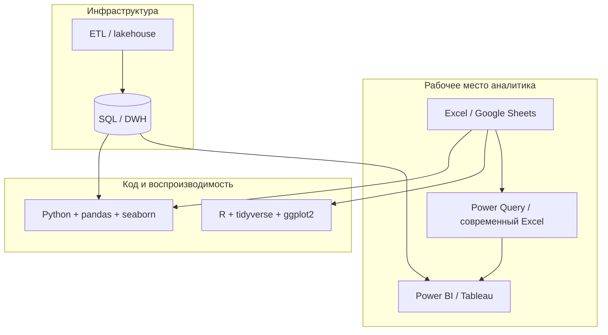

# Маршрут Excel → R → Python

  ОБЯЗАТЕЛЬНО
  ДЛЯ НОВИЧКОВ

Аналитику
Разработчику

---

## Для кого этот маршрут

Многие аналитики годами работают в Excel, затем слышат, что «настоящая» аналитика — только в коде. На практике разумный путь — **наращивать стек**, а не отбрасывать таблицы: EDA и прототипы остаются в Excel, воспроизводимые отчёты и модели переезжают в **R** или **Python**.

Статья собирает в один маршрут переход от таблиц к коду и ссылки на материалы энциклопедии. Логика та же, что в типовых курсах прикладной аналитики: сначала Excel и статистика, затем **параллельные** ветки R и Python с одинаковыми шагами (загрузка → EDA → тесты → регрессия).

---

## Стек анализа данных

| Слой | Роль | Когда достаточно |
|------|------|------------------|
| **Электронные таблицы** | EDA, разовые расчёты, презентация | До ~1 млн строк на машине, один аналитик |
| **Power Query / сводные** | Повторяемая загрузка и трансформация без VBA | Регулярные отчёты из нескольких файлов |
| **BI (Power BI и др.)** | Модель «звезда», дашборды, RLS | Self-service для бизнеса — [Power BI и self-service аналитика](/encyclopedia/3-data-markup/3-11-analiz-dannyh/43) |
| **SQL + DWH** | Единый источник правды, большие объёмы | [SQL](/encyclopedia/3-data-markup/3-07-sql/intro), [Big Data](/encyclopedia/3-data-markup/3-11-analiz-dannyh/11) |
| **R / Python** | Статистика, ML, автоматизация, git | Воспроизводимость, сложные модели, CI |

VBA в книге упоминается как мост к автоматизации внутри Excel; для новых проектов чаще выбирают Power Query или вынос логики в Python/R.

---

## Соответствие книги и энциклопедии

### Часть I — Excel (основы)

| Глава книги | Тема | Статья энциклопедии |
|-------------|------|---------------------|
| 0 | Формулы, ЕСЛИ, ВПР, учебные таблицы | [Работа с Microsoft Excel — Excel](/encyclopedia/1-basics/1-15-tekst/212), [Excel и Google Sheets — формулы — формулы в Lab](/lab/Примеры/1139) |
| 1 | EDA, переменные, графики | [Разведочный анализ данных в Excel — EDA в Excel](/encyclopedia/3-data-markup/3-11-analiz-dannyh/429) |
| 2 | Вероятность, распределения | [Основы статистики — Основы статистики](/encyclopedia/3-data-markup/3-11-analiz-dannyh/42) |
| 2 | Вероятность | [Вероятность для аналитика данных](/encyclopedia/3-data-markup/3-11-analiz-dannyh/431) |
| 3 | Инференциальная статистика | [Основы статистики](/encyclopedia/3-data-markup/3-11-analiz-dannyh/42), [Ошибки интерпретации и манипуляции статистикой — ошибки интерпретации](/encyclopedia/3-data-markup/3-11-analiz-dannyh/3) |
| 4 | Корреляция, регрессия | [Линейная регрессия — Excel, R и Python](/encyclopedia/3-data-markup/3-11-analiz-dannyh/432), [Причинно-следственный анализ — причинность](/encyclopedia/3-data-markup/3-11-analiz-dannyh/422) |
| 5 | Стек, BI, языки | [Data Science — Data Science](/encyclopedia/3-data-markup/3-11-analiz-dannyh/12), [Power BI и self-service аналитика — Power BI](/encyclopedia/3-data-markup/3-11-analiz-dannyh/43) |

### Часть II — R

| Глава | Тема | Статья |
|-------|------|--------|
| 6–7 | RStudio, `data.frame`, импорт | [5-23-r/7](/encyclopedia/5-languages/5-23-r/7), [5-23-r/4](/encyclopedia/5-languages/5-23-r/4) |
| 8 | dplyr, tidyr, ggplot2 | [5-23-r/103](/encyclopedia/5-languages/5-23-r/103), [5-23-r/2](/encyclopedia/5-languages/5-23-r/2) |
| 9 | EDA, t-тест, `lm()`, train/test | [5-23-r/103](/encyclopedia/5-languages/5-23-r/103), [Основы статистики](/encyclopedia/3-data-markup/3-11-analiz-dannyh/42) |

### Часть III — Python

| Глава | Тема | Статья |
|-------|------|--------|
| 10 | Jupyter, пакеты | [Python для анализа данных](/encyclopedia/3-data-markup/3-11-analiz-dannyh/424), [5-02-python](/encyclopedia/5-languages/5-02-python/intro) |
| 11–12 | NumPy, pandas, groupby, визуализация | [NumPy — массивы и матрицы — NumPy](/lab/Примеры/1129), [Pandas — типовые операции при анализе данных](/encyclopedia/3-data-markup/3-11-analiz-dannyh/428), [Pandas — типовые операции — примеры](/lab/Примеры/1113), [Очистка и подготовка данных в Pandas](/encyclopedia/3-data-markup/3-11-analiz-dannyh/427), [Табличные данные — Pandas, Polars, SQL и PySpark](/encyclopedia/3-data-markup/3-11-analiz-dannyh/426) |
| 13 | EDA, t-тест, регрессия, split | [Python для анализа данных](/encyclopedia/3-data-markup/3-11-analiz-dannyh/424), [6-ai / ML](/encyclopedia/6-ai/6-02-mashinnoe-obuchenie/intro) (введение) |

### Глава 14 — куда дальше

| Тема книги | Материал |
|------------|----------|
| План экспериментов, A/B | [Основы статистики — A/B](/encyclopedia/3-data-markup/3-11-analiz-dannyh/42), [Анализ данных — итоги — итоги](/encyclopedia/3-data-markup/3-11-analiz-dannyh/998) |
| Контроль версий | [Git](/encyclopedia/4-code-dev/4-03-kontrol-versiy/intro) |
| Этика данных | [Ошибки интерпретации и манипуляции статистикой — манипуляции](/encyclopedia/3-data-markup/3-11-analiz-dannyh/3), [Как использовать ИИ для анализа данных — ИИ в аналитике](/encyclopedia/3-data-markup/3-11-analiz-dannyh/421) |

---

## Один анализ — три среды (идея книги)

На примере чаевых в ресторане (`tips` в seaborn / учебных CSV):

| Шаг | Excel | R | Python |
|-----|-------|---|--------|
| Загрузка | Открыть `.xlsx` / CSV | `read.csv()`, `readxl` | `pd.read_csv()` |
| Осмотр | `ЧСТОТА`, сводная | `str()`, `summary()` | `df.info()`, `describe()` |
| Группировка | сводная по `day` | `group_by()` + `summarise()` | `groupby().agg()` |
| График | диаграмма по сводной | `ggplot(aes(...))` | `sns.boxplot()` / `plot()` |
| t-тест | надстройка / вручную | `t.test()` | `scipy.stats.ttest_ind()` |
| Регрессия | линия тренда, `ЛИНЕЙН()` | `lm()` | `statsmodels` / `sklearn` |

Сводка команд pandas — [Pandas — типовые операции при анализе данных](/encyclopedia/3-data-markup/3-11-analiz-dannyh/428); сравнение с SQL и Polars — [Табличные данные — Pandas, Polars, SQL и PySpark](/encyclopedia/3-data-markup/3-11-analiz-dannyh/426).

  
Учебный набор tips

  

  В Python: <code>import seaborn as sns; tips = sns.load_dataset("tips")</code>. Для R экспортируйте тот же CSV из Python или возьмите любой открытый датасет с похожей структурой (счёт, чаевые, категории).
  

---

## R или Python — что выбрать первым

| Критерий | R | Python |
|----------|---|--------|
| Уже знаете статистику в вузе на R | ✓ естественный переход | |
| Цель — ML, бэкенд, MLOps | | ✓ экосистема шире |
| Только отчёты и ggplot | ✓ tidyverse | seaborn/matplotlib |
| Команда пишет на Python | | ✓ |
| Академические пакеты (биостаты) | ✓ CRAN | частично |

Ветки R и Python **параллельны**: можно сначала довести до конца одну, затем повторить те же шаги во второй для сравнения синтаксиса. После [Разведочный анализ данных в Excel](/encyclopedia/3-data-markup/3-11-analiz-dannyh/429) разумно пройти [Основы статистики](/encyclopedia/3-data-markup/3-11-analiz-dannyh/42) и [Линейная регрессия — Excel, R и Python](/encyclopedia/3-data-markup/3-11-analiz-dannyh/432), затем выбрать R или Python.

---

## Рекомендуемый порядок в энциклопедии

1. [Работа с Microsoft Excel — Excel](/encyclopedia/1-basics/1-15-tekst/212) и [Excel и Google Sheets — формулы — формулы с разбором](/lab/Примеры/1139)
2. [Разведочный анализ данных в Excel — EDA в Excel](/encyclopedia/3-data-markup/3-11-analiz-dannyh/429)
3. [Вероятность для аналитика данных — вероятность](/encyclopedia/3-data-markup/3-11-analiz-dannyh/431), [Основы статистики — основы статистики](/encyclopedia/3-data-markup/3-11-analiz-dannyh/42)
4. [Причинно-следственный анализ](/encyclopedia/3-data-markup/3-11-analiz-dannyh/422), [Линейная регрессия — Excel, R и Python — регрессия](/encyclopedia/3-data-markup/3-11-analiz-dannyh/432), [Ошибки интерпретации и манипуляции статистикой — ошибки интерпретации](/encyclopedia/3-data-markup/3-11-analiz-dannyh/3)
5. **R** — [7 → 103](/encyclopedia/5-languages/5-23-r/7) **или** **Python** — [Python для анализа данных](/encyclopedia/3-data-markup/3-11-analiz-dannyh/424) → [NumPy — массивы и матрицы — NumPy](/lab/Примеры/1129) → [Pandas — типовые операции — Pandas](/lab/Примеры/1113) → [Pandas — типовые операции при анализе данных](/encyclopedia/3-data-markup/3-11-analiz-dannyh/428) → [Очистка и подготовка данных в Pandas](/encyclopedia/3-data-markup/3-11-analiz-dannyh/427)
6. [Power BI и self-service аналитика — Power BI](/encyclopedia/3-data-markup/3-11-analiz-dannyh/43), [Data Science — Data Science](/encyclopedia/3-data-markup/3-11-analiz-dannyh/12)
7. [Анализ данных — итоги — итоги](/encyclopedia/3-data-markup/3-11-analiz-dannyh/998), [Анализ данных — чек-лист — самопроверка](/encyclopedia/3-data-markup/3-11-analiz-dannyh/999)

---
