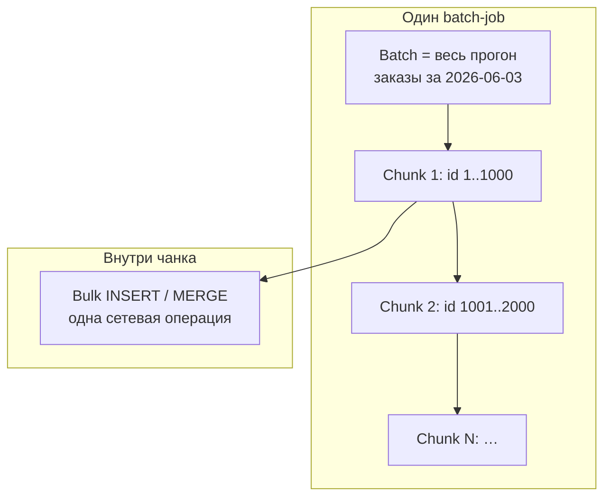
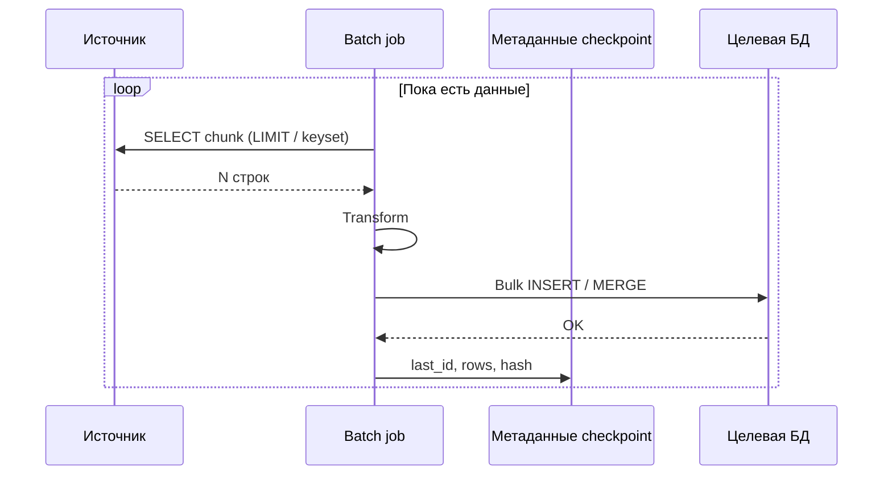
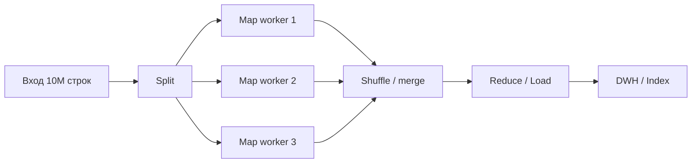
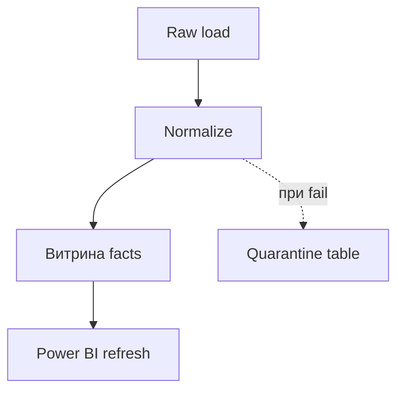

# Пакетная работа с данными

<div class="article-tags">
  <span class="tag tag-required">ОБЯЗАТЕЛЬНО</span>
  <span class="tag tag-beginner">ДЛЯ НОВИЧКОВ</span>
</div>

<span class="complexity-badge">Всем</span>

---

<span id="batch-data-hub"></span>

## Зачем нужна пакетная обработка

Большинство корпоративных систем **не обязаны** отвечать на каждую запись за миллисекунду. Зарплата считается раз в месяц, отчёт за вчера собирается ночью, каталог синхронизируется с ERP каждые 15 минут, поисковый индекс перестраивается пакетом. Во всех этих случаях выгоднее **собрать работу в группу** и выполнить её одним прогоном, чем имитировать миллион отдельных "микроопераций" в реальном времени.

В основе пакетной обработки лежит сознательный **отказ от real-time** в пользу:

- меньших **накладных расходов** (сеть, парсинг SQL, открытие транзакций);
- предсказуемой **нагрузки** на БД и диск (ночное окно, лимиты CPU);
- более простой **отладки** (лог по чанкам, checkpoint, повтор прогона).

Эта статья — **теоретический хаб** — термины, цикл ETL, разбиение тяжёлых задач, атомарность, поток vs пакет, очереди, распределённые фреймворки, **массовые CRUD в одном HTTP-запросе**. Практика интеграций и REST batch API — в [интеграционных потоках](/encyclopedia/2-system-network/2-09-osnovy-integratsionnogo-vzaimodeystviya/112#batch-etl-load) и [восьми принципах REST](/encyclopedia/2-system-network/2-09-osnovy-integratsionnogo-vzaimodeystviya/117#rest-api-design-principles); потоковая аналитика — в [Потоковая аналитика в реальном времени](/encyclopedia/3-data-markup/3-11-analiz-dannyh/423); оркестрация пайплайнов — в [ETL-ELT и оркестрация](/encyclopedia/3-data-markup/3-11-analiz-dannyh/425).

---

<span id="terminology"></span>

## Карта терминов — не путать batch, bulk и chunk
В разговорах и документации слова смешивают. Ниже — различия, которые архитекторы закладывают в контракты и код.

| Термин | Уровень | Смысл | Типичный пример |
|--------|---------|-------|-----------------|
| **Batching** (пакетирование) | *Метод* | Задачи **группируют** и выполняют **одним запуском** или одной фазой планировщика | Ночной job "все заказы за вчера"; Kafka producer копит записи 50 ms |
| **Batch** (пакет, батч) | *Логика обработки* | Данные **копят** по времени или объёму и обрабатываются **в фоне** без участия пользователя | Расчёт зарплаты; выгрузка DWH за сутки |
| **Bulk** (массовость) | *Оптимизация I/O* | **Много записей одной операцией** вместо тысяч одиночных round-trip | `COPY`, `bulk insert`, `POST /users/batch`, [массовый CRUD](#bulk-crud) |
| **Chunk** (чанк, слайс) | *Подраздел пакета* | **Неделимая порция** внутри большого batch; ограничивает RAM и время блокировки | 1 000 000 строк → 1000 чанков по 1000 |
| **Stream** (поток) | *Модель данных* | **Бесконечная** последовательность событий; обработка **по мере поступления** | Kafka topic, SSE, логи приложения |
| **Micro-batch** | *Гибрид* | Поток **режется на микропакеты** по времени (например, 1 с) | Spark Structured Streaming, Flink mini-batch |

**Batching** отвечает на вопрос *"когда и как группировать работу?"*. **Bulk** — *"как передать много строк за один вызов API/СУБД?"*. **Chunk** — *"как не убить память и не держать транзакцию час?"*. **Stream** — другая ось: *не ждём полного массива*, работаем с событием сразу (см. [потоковая аналитика](/encyclopedia/3-data-markup/3-11-analiz-dannyh/423)).



<div class="callout callout--tip">
  <div class="callout-title">Памятка</div>
  <div class="callout-body">
  "Сделали batch insert" обычно значит <strong>bulk на уровне БД</strong>. "Запустили batch job" — <strong>весь ночной прогон</strong>, внутри которого могут быть тысячи чанков с bulk-записями.
  </div>
</div>

---

<span id="batch-vs-stream"></span>

## Пакетная обработка, поток и real-time
| Критерий | Пакетная (batch) | Потоковая (stream) | Синхронный API (request/response) |
|----------|------------------|--------------------|-----------------------------------|
| **Задержка** | Минуты — часы | Мс — секунды | Мс — секунды (один запрос) |
| **Единица работы** | Файл, срез БД, массив в HTTP | Событие, запись в логе | Один ресурс / одна команда |
| **Хранение** | Диск, DWH, object storage | Буфер, Kafka, state в RAM | Часто без долгого хранения |
| **Ошибки** | Перезапуск job, checkpoint | Replay offset, watermark | Retry, idempotency key |
| **Стоимость** | Ниже на объём (амортизация overhead) | Выше (постоянная инфраструктура) | Высокая при миллионах мелких вызовов |
| **Примеры** | Отчёт, ML training, ночной ETL | Антифрод, алерты, дашборд live | `GET /user/42` |

**Lambda-архитектура** (упрощённо): один и тот же поток событий обрабатывают **два пути** — быстрый stream-слой для оперативных метрик и batch-слой для точных исторических витрин. Сходимость достигают периодической **пересборкой** batch поверх того же сырья (lake + stream), что снижает риск расхождения цифр.

Пакет не "лучше" потока — они закрывают разные SLA. Сравнение с примерами — в [423, таблица](/encyclopedia/3-data-markup/3-11-analiz-dannyh/423#сравнение-с-пакетной-обработкой) и [Big Data — batch vs stream](/encyclopedia/3-data-markup/3-11-analiz-dannyh/11).

---

<span id="etl-cycle"></span>

## Теоретический цикл — как работает batch-конвейер
Любой пакетный процесс (часто называемый **ETL** — Extract, Transform, Load, или **ELT** — с трансформацией уже в целевой СУБД) концептуально — **цикл по чанкам**, пока не исчерпан диапазон данных:

```text
[Источник] ──► ( Чтение: Chunk k ) ──► [ Фильтрация / Трансформация ] ──► ( Запись: Bulk ) ──► [ Цель ]
                      ▲                                                              │
                      └──────────────── watermark / checkpoint ──────────────────────┘
```

| Шаг | Действие | Что фиксируют в метаданных |
|-----|----------|----------------------------|
| **1. Инициализация** | Границы: "вчера UTC", `id BETWEEN …`, файл `export_20260603.csv` | `job_id`, версия схемы, параметры |
| **2. Extract (чтение)** | Один **chunk** фиксированного размера из источника | `offset`, `last_id`, номер файла |
| **3. Transform** | Валидация, маппинг, расчёты **в RAM** чанка | Счётчики ошибок, dead-letter строки |
| **4. Load (запись)** | **Bulk** в приёмник; освобождение памяти | Строки записаны, checksum чанка |
| **5. Commit прогресса** | Обновление **watermark** / checkpoint | `last_processed_id`, `completed_at` |

Схема оркестрации нескольких шагов (зависимости, retry) — в [ETL-ELT и оркестрация](/encyclopedia/3-data-markup/3-11-analiz-dannyh/425). Пакетная загрузка в интеграциях (batch-окно, расхождение с продом) — [112#batch-etl-load](/encyclopedia/2-system-network/2-09-osnovy-integratsionnogo-vzaimodeystviya/112#batch-etl-load).



---

<span id="overhead-math"></span>

## Почему пакет выгоден — накладные расходы (overhead)
Пакетная обработка бьёт по **overhead** — затратам, не связанным напрямую с полезной работой — handshake TCP, парсинг SQL, commit транзакции, fsync диска, сериализация JSON.

**Упрощённая модель.** Пусть на одну одиночную запись уходит фиксированная задержка \(L\) (latency) плюс время записи строки \(r\). Для \(N\) строк:

- **Поштучно:** T_row ≈ N × (L + r)
- **Пакетом (одна транзакция, один round-trip):** T_bulk ≈ L + N × r′, где r′ ≤ r за счёт буферизации СУБД и бинарных протоколов

При \(L \gg r\) (типично для удалённой БД или REST через интернет) выигрыш **десятки–сотни раз** на том же железе — амортизация \(L\).

| Сценарий | 10 000 строк | Где теряется время |
|----------|--------------|-------------------|
| 10 000 × `INSERT` по HTTP | 10 000 round-trip | TLS, JSON parse, connection pool |
| 1 × `COPY` / bulk API | 1 round-trip + поток байт | Подготовка буфера, lock таблицы |
| 10 чанков × 1000 bulk | 10 round-trip + контроль памяти | Компромисс batch vs chunk |

<div class="callout callout--warning">
  <div class="callout-title">Не только сеть</div>
  <div class="callout-body">
  Bulk увеличивает <strong>длительность блокировок</strong> и пиковое потребление RAM. Поэтому "один bulk на 10 млн строк" часто хуже, чем "1000 чанков по 10 000" — см. <a href="#chunk-tuning">размер чанка</a>.
  </div>
</div>

---

<span id="splitting-heavy"></span>

## Как разбивают тяжёлые операции
Если объём не помещается в одно окно памяти, одну транзакцию или один HTTP-ответ, задачу **декомпозируют**. Четыре базовых подхода (их комбинируют):

### 1. Постраничная выборка (pagination)

Данные читают **порциями** из источника:

- **OFFSET + LIMIT** — просто, но на больших смещениях PostgreSQL/MySQL деградируют (сканируют "пропущенные" строки).
- **Keyset (seek)** — `WHERE id > :last_id ORDER BY id LIMIT 1000` — стабильнее для больших таблиц; требует индекса по ключу итерации.
- **Курсор сервера** — `DECLARE CURSOR` в SQL; удерживает ресурсы на стороне БД.

Подходит, когда источник — одна таблица с монотонным ключом. Подробнее про API-пагинацию — [шесть схем](/encyclopedia/2-system-network/2-09-osnovy-integratsionnogo-vzaimodeystviya/131).

### 2. Разделение по диапазонам (range split)

Пакет делят по **времени** или **идентификаторам**:

- `processed_date = '2026-06-03'` — отдельный job на день;
- `user_id` от 1 до 10 000, 10 001 до 20 000 — параллельные воркеры без пересечения.

Плюс: естественные **границы транзакций** и простой restart "с упавшего диапазона". Минус: **перекос** (hot spot), если один диапазон аномально плотный — нужен динамический split (adaptive).

### 3. Очереди сообщений (fan-out)

Тяжёлая задача превращается в **миллион мелких сообщений** в брокере (Kafka, RabbitMQ, SQS). Воркеры забирают с **ограниченным prefetch** и обрабатывают независимо.

| Аспект | Batch-job на одном сервере | Очередь + воркеры |
|--------|---------------------------|------------------|
| Масштаб | Вертикальный + чанки | Горизонтальный (N consumers) |
| Сбой | Checkpoint в job | Offset в Kafka, ack в RabbitMQ |
| Порядок | Проще в одном процессе | Партиции Kafka, single consumer |

Семантика доставки и идемпотентность потребителя — [Идемпотентность и семантика доставки](/encyclopedia/2-system-network/2-09-osnovy-integratsionnogo-vzaimodeystviya/133). Батчинг продюсера Kafka — [Kafka](/encyclopedia/8-infra-security/8-05-mikroservisy-i-integratsiya/119).

### 4. Параллельная обработка (MapReduce / ForkJoin)

**Map:** разбить вход на независимые части и обработать параллельно. **Reduce:** объединить результаты (сумма, merge сортированных списков, построение индекса).

- **Hadoop MapReduce** — классика — map по блокам HDFS, shuffle, reduce.
- **Spark** — DAG стадий в памяти/на диске; `repartition`, `groupByKey`.
- **ForkJoin** в JVM — деление задачи в пуле потоков для CPU-bound работы на одной машине.

Ограничение: части должны быть **независимы** или нужна стадия shuffle с известной стоимостью.



### Адаптивные пакеты

Размер чанка **не фиксируют навсегда**: если чанк обработался быстрее порога — увеличивают batch size; при таймаутах или OOM — уменьшают. Это связывает pagination и [backpressure](#backpressure).

---

<span id="atomicity-transactions"></span>

## Атомарность и границы транзакций
**Атомарность** (ACID) в пакетном мире — **осознанный выбор границы**:

| Стратегия | Граница транзакции | При сбое на 9 999-й строке | Когда уместно |
|-----------|-------------------|----------------------------|---------------|
| **Весь batch** | Один COMMIT на весь прогон | Полный ROLLBACK | Малые объёмы, жёсткая согласованность |
| **Один chunk** | COMMIT после каждых N строк | Сохранены предыдущие чанки | Типичный ETL |
| **Строка / сообщение** | Автокоммит или ack одного сообщения | Потеря только текущей единицы | Очереди, идемпотентный upsert |
| **Saga** | Нет единой транзакции; компенсации | Откат через compensating events | Микросервисы |

**Изоляция:** длинный bulk-блокировка таблицы (`EXCLUSIVE`) мешает OLTP. Решения: загрузка в **staging**-таблицу без индексов → один `MERGE` в прод; `READ COMMITTED` + короткие транзакции; отдельный replica для отчётов.

**Согласованность между системами:** одна транзакция в PostgreSQL **не откатит** запись в Kafka. Паттерны — **outbox** (событие в той же БД, что бизнес-данные), **двухфазная фиксация метаданных** (сначала chunk в DWH, потом watermark), [саги](/encyclopedia/2-system-network/2-09-osnovy-integratsionnogo-vzaimodeystviya/112).

Пример границы "транзакция = chunk" (псевдо-SQL):

```sql
BEGIN;
  INSERT INTO staging_orders SELECT * FROM import_chunk WHERE batch_id = :bid;
  INSERT INTO orders SELECT * FROM staging_orders s
    ON CONFLICT (id) DO UPDATE SET status = EXCLUDED.status, updated_at = now();
  INSERT INTO etl_checkpoint (job, last_id, rows) VALUES (:job, :last_id, :cnt);
COMMIT;
```

---

<span id="idempotency"></span>

## Идемпотентность
**Идемпотентность** — повторный прогон даёт **тот же итог**, что и первый (без двойных скидок, дубликатов заказов, повторной отправки письма).

Почему в batch это критично: job падает на 4-м часе из 5; cron запускает снова; сеть доставила сообщение дважды.

| Механизм | Идея |
|----------|------|
| **Стабильный ключ** | `external_id`, `business_key`, hash тела сообщения |
| **UPSERT / MERGE** | `ON CONFLICT DO UPDATE`, не слепой `INSERT` |
| **Дедуп-таблица** | `processed_message_id` перед обработкой |
| **Idempotency-Key** (HTTP) | Клиент шлёт ключ; сервер кэширует ответ |
| **Версия строки** | Обновлять только если `source_version` новее |

Hub по доставке и exactly-once на практике — [Идемпотентность и семантика доставки](/encyclopedia/2-system-network/2-09-osnovy-integratsionnogo-vzaimodeystviya/133). Импорт с checkpoint в C# — [Веб-разработка и API на C#](/encyclopedia/5-languages/5-05-csharp/45).

---

<span id="chunk-tuning"></span>

## Размер чанка — "закон Златовласки"
Размер чанка **подбирают измерением**, а не "1000 потому что красиво":

| Слишком мало (5–50 строк) | Слишком много (500k+ строк) |
|---------------------------|-----------------------------|
| Доминирует \(L\) — сеть, COMMIT | OutOfMemory, GC pressure |
| CPU простаивает | Долгие блокировки, replication lag |
| Много записей в checkpoint | Трудно повторить один чанк при ошибке |

**Эвристики:**

1. Целевое время обработки чанка: **30 с – 5 мин** (зависит от SLA ночного окна).
2. RAM: размер чанка × средний размер строки × коэффициент копий < **50–70%** heap воркера.
3. СУБД — смотреть `pg_stat_statements`, slow log, `innodb_row_lock_time`.
4. A/B на staging с тем же объёмом, что прод.

В Pandas аналог — `chunksize` в `read_csv()` ([lab 120](/lab/questions/120)). В Hibernate — `hibernate.jdbc.batch_size` ([Java 22](/encyclopedia/5-languages/5-03-java/22)).

---

<span id="backpressure"></span>

## Backpressure (обратное давление)
**Backpressure** — потребитель **не успевает** за производителем — очередь растёт, память кончается, воркер падает.

Источники быстрее sink:

- Kafka topic без lag monitoring;
- API отдаёт страницы быстрее, чем ETL пишет в DWH;
- Spark читает быстрее, чем JDBC принимает.

**Приёмы дозирования:**

| Уровень | Механизм |
|---------|----------|
| Очередь | `prefetch=1`, лимит unacked, пауза consumer |
| Поток | Reactive Streams, `pause()`/`resume()` в Kafka consumer |
| Batch job | Ограничение параллелизма чанков, семафор |
| API | Rate limit, 429, размер batch cap |

Пакетная обработка **обязана** согласовать скорость Extract и Load; иначе "быстрый extract" только переносит проблему в OOM на Transform.

---

<span id="restart-checkpoints"></span>

## Перезапуск — Restart vs Resume (checkpoints)
Пятичасовой job упал на 4-м часе.

| Стратегия | Действие | Плюсы | Минусы |
|-----------|----------|-------|--------|
| **Restart** | С начала, часто с truncate staging | Простота | Дорого, риск дублей без идемпотентности |
| **Resume** | Продолжить с checkpoint / watermark | Экономия времени | Нужна таблица метаданных, согласованность границ |

**Checkpoint** — запись после **успешного** чанка — `last_processed_id`, `chunk_no`, hash, `committed_at`.

**Watermark** — "данные до момента T уже в витрине"; следующий прогон: `WHERE updated_at > :watermark`.

Типичная таблица:

```sql
CREATE TABLE etl_job_state (
  job_name       TEXT PRIMARY KEY,
  watermark_ts   TIMESTAMPTZ,
  last_id        BIGINT,
  last_chunk     INT,
  status         TEXT,  -- running | failed | success
  updated_at     TIMESTAMPTZ DEFAULT now()
);
```

При **скользящем batch-окне** (изменения во время загрузки) watermark обновляют **только после** commit всего чанка; границы окна в UTC — [FAQ интеграций](/encyclopedia/2-system-network/2-09-osnovy-integratsionnogo-vzaimodeystviya/998).

---

<span id="cascading"></span>

## Каскадность пайплайнов
**Каскад** — цепочка batch-задач, где выход шага *k* — вход шага *k+1*. Пример: сырой слой lake → нормализованные таблицы → витрина → экспорт в BI.

| Риск | Проявление | Митигация |
|------|------------|-----------|
| **Задержка волной** | Шаг 3 стартует до готовности шага 2 | Оркестратор с зависимостями (Airflow, Dagster) — [ETL-ELT и оркестрация](/encyclopedia/3-data-markup/3-11-analiz-dannyh/425) |
| **Частичный успех** | Витрина обновилась, raw — нет | Единый `batch_id`, статус слоёв |
| **Сбой посередине** | Зависшие downstream | Идемпотентные пересборки, "сухой" прогон |
| **Усиление ошибки** | 0.1% битых строк ломает весь JOIN | Quarantine / DLQ, quality gates |



Принцип **lineage**: каждая витрина знает `source_batch_id` — упрощает расследование расхождений с продом.

---

<span id="mapping-batch"></span>

## Маппинг в пакетных конвейерах
**Маппинг** — соответствие полей источника и приёмника плюс правила преобразования. В batch он выполняется **на каждом чанке** в памяти или в SQL (ELT).

| Подход | Где | Плюсы |
|--------|-----|-------|
| **Декларативный** | dbt, SQL `SELECT` с алиасами | Версионируется, тестируется |
| **Код** | Python, Java, C# mapper | Сложная логика, внешние API |
| **Конфиг** | JSON/YAML mapping tables | Без деплоя кода для простых полей |
| **CDC + schema registry** | Avro/Protobuf | Эволюция схемы без "тихих" поломок |

Правила:

- Один **канонический** тип на поле (`DECIMAL` для денег, `TIMESTAMPTZ` UTC).
- Явная политика **NULL / default / reject** — счётчики в логе чанка.
- Справочники (lookup) либо **предзагружаются** в hash-map на job, либо join в SQL — не N запросов на строку.

Сериализация объектов при bulk API — [маршалинг](/encyclopedia/3-data-markup/3-01-prodvinutye-operatsii-s-dannymi/111).

---

<span id="application-domains"></span>

## Сферы применения
<span id="http-batch"></span>

### HTTP и REST — пакетные запросы
Клиент шлёт **массив сущностей** в одном запросе вместо N вызовов:

```http
POST /v1/orders/batch
Content-Type: application/json
Idempotency-Key: 7f3c9a2e-4b1d-4e8a-9c0f-1a2b3c4d5e6f

{
  "items": [
    { "externalId": "A-1", "amount": 100 },
    { "externalId": "A-2", "amount": 200 }
  ]
}
```

Ответ с **поштучным статусом** (не "200 и молчим про ошибки внутри"):

```json
{
  "results": [
    { "externalId": "A-1", "status": "created", "id": "uuid-1" },
    { "externalId": "A-2", "status": "error", "code": "DUPLICATE" }
  ]
}
```

Контракт — лимит `max_items`, rate limit, long-running для гигантских файлов — [117, принцип 7](/encyclopedia/2-system-network/2-09-osnovy-integratsionnogo-vzaimodeystviya/117#rest-api-design-principles).

<span id="bulk-crud"></span>

#### Массовые CRUD-операции в одном запросе

Под **массовым CRUD** понимают не только пакетное **создание** (bulk create), а любую комбинацию **Create, Read (редко), Update, Delete** над множеством записей за **один round-trip** к API. Типичный мотив — UI или интеграция прислали 500 изменённых строк каталога, 200 удалений и 80 новых позиций: слать 780 отдельных `POST`/`PATCH`/`DELETE` дорого по сети, лимитам и observability; один batch-эндпоинт амортизирует handshake, аутентификацию и парсинг JSON.

Это **не** замена ночного ETL: объём до тысяч–десятков тысяч записей в синхронном запросе, ответ за секунды–минуты. Миллионы строк — [чанки](#chunk-tuning), staging и фоновый job ([ETL-ELT и оркестрация](/encyclopedia/3-data-markup/3-11-analiz-dannyh/425)).

| Операция | Одиночный REST (идеал) | Массовый вариант в одном запросе | Замечание |
|----------|------------------------|----------------------------------|-----------|
| **Create** | `POST /resources` | `POST /resources/batch`, `POST /bulk` с массивом тел | Частый кейс импорта |
| **Update** | `PUT /resources/{id}` / `PATCH /resources/{id}` | `PATCH /resources/bulk`, массив `` `{ id, patch }` `` | Нужен стабильный ключ строки |
| **Delete** | `DELETE /resources/{id}` | `POST /resources/bulk-delete` с массивом id (тело у `DELETE` в HTTP спорно) | Идемпотентность по id |
| **Upsert** | два вызова или `PUT` по ключу | `POST /resources/bulk-upsert` + уникальный бизнес-ключ | Стыкуется с [идемпотентностью](#idempotency) |
| **Смешанный CRUD** | — | один payload с полем `operations[]` | См. ниже |

**Смешанный пакет** — один HTTP-запрос с упорядоченным списком подопераций (порядок может быть важен для FK и валидации):

```json
{
  "clientRequestId": "import-2026-06-04T12:00:00Z",
  "operations": [
    { "op": "create", "resource": "products", "body": { "sku": "P-1", "price": 10 } },
    { "op": "update", "resource": "products", "id": "uuid-42", "body": { "price": 12 } },
    { "op": "delete", "resource": "products", "id": "uuid-7" }
  ]
}
```

Сервер обрабатывает список **последовательно** (одна транзакция или чанк внутри транзакции) либо **параллельно по независимым сущностям** — это должно быть явно в контракте. Аналоги в индустрии — OData `$batch`, GraphQL `[mutation1, mutation2]`, Salesforce Composite API, Google `{ "requests": [ ... ] }`.

**Идемпотентность на уровне строки.** Один `Idempotency-Key` на весь пакет защищает от повтора **всего** запроса; при partial success клиент не знает, что уже применилось. Практика:

- ключ пакета + **`clientMutationId` / `externalId` на каждой операции**;
- upsert по бизнес-ключу (`sku`, `orderNo`), а не только по UUID;
- сервер хранит результат обработки пакета по ключу и при повторе отдаёт тот же отчёт без повторного применения.

Связка с [идемпотентностью](#idempotency) и заголовком `Idempotency-Key` — [Методы и ключ идемпотентности](/encyclopedia/7-project/7-06-proektirovanie-i-arhitektura/design/213), [HTTP-интеграции](/encyclopedia/2-system-network/2-09-osnovy-integratsionnogo-vzaimodeystviya/118).

**Граница атомарности** — отдельное архитектурное решение (см. [атомарность и транзакции](#atomicity-transactions)):

| Режим | Поведение при ошибке на 50-й записи | Когда уместно |
|-------|--------------------------------------|---------------|
| **Всё или ничего** | HTTP 4xx/5xx, откат всего пакета | Малый пакет, жёсткая согласованность |
| **Partial success** | HTTP 200/207 + массив статусов по строкам | Импорт из Excel, интеграции |
| **Best effort + отчёт** | Применили валидные, остальные в `errors[]` | Оператор исправляет и досылает |

Для partial success коды ответа часто используют **207 Multi-Status** (WebDAV) или **200** с телом `` `{ "succeeded" — N, "failed": M, "results": [...] }` ``. Клиент **обязан** разбирать отчёт по элементам, а не только `status: ok`.

Пример ответа на смешанный bulk update/delete:

```json
{
  "summary": { "created": 80, "updated": 200, "deleted": 198, "failed": 2 },
  "results": [
    { "index": 0, "op": "update", "id": "uuid-42", "status": "ok" },
    { "index": 41, "op": "delete", "id": "uuid-7", "status": "error", "code": "FK_CONSTRAINT", "message": "Есть активные заказы" }
  ]
}
```

**Слой приложения vs СУБД.** Массовый CRUD в API не означает автоматически bulk на диске:

1. Наивно: цикл `repository.save()` / `SaveChanges` на каждую строку — тот же overhead, что N одиночных API, только внутри сервера ([ORM FAQ](/encyclopedia/4-code-dev/4-10-orm-i-rabota-s-dannymi/998)).
2. Правильно: один приём JSON → валидация пачки → **один чанк** → `bulk insert` / `COPY` / `MERGE` / `bulkWrite` ([sql-bulk](#sql-bulk), [nosql-batch](#nosql-batch)).


**Проектирование контракта** (чек-лист для API):

- `max_operations`, `max_payload_bytes`, таймаут; при превышении — **202 Accepted** + job id ([long-running](/encyclopedia/2-system-network/2-09-osnovy-integratsionnogo-vzaimodeystviya/117#rest-api-design-principles)).
- Семантика **upsert** vs **create-only** (дубликат — ошибка или merge).
- Версия схемы (`schemaVersion`) при эволюции полей.
- Единый формат ошибки с `index`, `op`, `field`, `code` — как в примере выше.
- Ограничение глубины вложенности (граф сущностей в одном пакете быстро раздувает транзакцию).

**Чего избегать:** гигантский пакет без лимита; "тихий" пропуск failed строк; один COMMIT на 100k строк без staging; смешение read-тяжёлых отчётов с write-пакетом в одном эндпоинте. Массовый **Read** в одном запросе — скорее `POST /search` или batch GET по id (`?ids=1,2,3` с лимитом), а не классический bulk CRUD.

Практика проектирования API — [117, bulk operations](/encyclopedia/7-project/7-06-proektirovanie-i-arhitektura/design/117#http-batch), [восемь принципов REST](/encyclopedia/2-system-network/2-09-osnovy-integratsionnogo-vzaimodeystviya/117#rest-api-design-principles).

<span id="sql-bulk"></span>

### SQL и реляционные СУБД — bulk
| Механизм | СУБД / стек | Назначение |
|----------|-------------|------------|
| **Multi-row INSERT** | Универсально | Умеренные объёмы |
| **COPY / BULK INSERT** | PostgreSQL, SQL Server | Максимальная скорость загрузки |
| **LOAD DATA INFILE** | MySQL | Файл → таблица |
| **MERGE / ON CONFLICT** | PG, SQL Server, Oracle | Идемпотентная загрузка |
| **JDBC batch** | Java, Hibernate | Пакетирование prepared statements |
| **bcp, pgloader** | Ops | Миграции, восстановление |

Пример PostgreSQL (чанк в staging):

```sql
COPY staging_orders (id, amount, status)
FROM STDIN WITH (FORMAT csv);
-- ... поток из приложения ...
```

Транзакции и индексы — [основы БД](/encyclopedia/3-data-markup/3-05-osnovy-baz-dannyh/intro), углубление SQL — [3.07](/encyclopedia/3-data-markup/3-07-sql/intro).

<span id="nosql-batch"></span>

### NoSQL
| Система | Пакетный приём |
|---------|----------------|
| **MongoDB** | `insertMany`, `bulkWrite` ordered/unordered |
| **Redis** | `PIPELINE`, `MSET` — амортизация RTT |
| **Elasticsearch** | `_bulk` API с NDJSON |
| **Cassandra** | `UNLOGGED BATCH` (осторожно с размером partition) |

Пакетная миграция — [NoSQL, блок 5](/encyclopedia/3-data-markup/3-06-nosql/5). Unordered bulk часто быстрее, но порядок ошибок не гарантирован — фиксируют в контракте.

<span id="queues-batch"></span>

### Очереди и брокеры
- **Producer batching** (Kafka): `batch.size`, `linger.ms` — компромисс latency / throughput.
- **Consumer micro-batch**: `poll(max)` → обработать пачку → `commitSync`.
- **RabbitMQ**: `prefetch` + ack после обработки пачки сообщений.

Теория очередей — at-least-once, DLQ, повтор — [Брокеры сообщений](/encyclopedia/2-system-network/2-09-osnovy-integratsionnogo-vzaimodeystviya/121), [RabbitMQ - работа с очередями сообщений](/encyclopedia/2-system-network/2-09-osnovy-integratsionnogo-vzaimodeystviya/122).

<span id="distributed-mapreduce"></span>

### Распределённые системы — MapReduce и наследники
| Технология | Модель | Типичный batch-сценарий |
|------------|--------|-------------------------|
| **Hadoop MapReduce** | Диск, map/shuffle/reduce | Исторические ETL на HDFS |
| **Apache Spark** | DAG, in-memory | ETL, ML feature prep, `read.jdbc` с partition column |
| **Apache Flink** | Stream-first + batch mode | Единый код batch и stream |
| **Apache Beam** | Portable model | GCP Dataflow, Flink runner |
| **dbt** | SQL-трансформации в DWH | ELT слои staging → marts |

Spark: чтение JDBC с **`numPartitions`** и диапазоном по numeric key — тот же **range split**, что выше. PySpark в аналитике — [Табличные данные — Pandas, Polars, SQL и PySpark](/encyclopedia/3-data-markup/3-11-analiz-dannyh/426).

---

<span id="frameworks-table"></span>

## Справочник инструментов (кратко)
| Категория | Инструменты | Роль |
|-----------|-------------|------|
| Оркестрация | Airflow, Prefect, Dagster, Luigi, cron/K8s CronJob | Расписание, зависимости, retry |
| ETL/ELT | Airbyte, Fivetran, Talend, Informatica, dbt | Extract/load, SQL-трансформации |
| Поток + batch | Kafka + Connect, Flink, Spark Streaming | Мост event → lake |
| Облако | AWS Glue, Azure Data Factory, BigQuery load jobs | Managed batch |
| Интеграция | NiFi, Camel, n8n | Визуальные/маршрутные потоки |
| Языки | Python (pandas chunks), Go, Java Spring Batch | Кастомные job |

Выбор инструмента вторичен относительно **границ транзакций, идемпотентности и наблюдаемости** — без них любой "крутой" оркестратор только быстрее создаст дубликаты.

---

<span id="observability"></span>

## Наблюдаемость batch-job
Минимальный набор метрик и логов:

| Метрика | Зачем |
|---------|-------|
| `rows_read`, `rows_written`, `rows_rejected` | Баланс чанка |
| `chunk_duration_ms` | Тюнинг размера |
| `lag` (для очередей) | Backpressure |
| `watermark_age` | Свежесть витрины |
| `checksum per chunk` | Сверка с источником |

Логи — **структурированные** (JSON) с `job_id`, `chunk_no`, `correlation_id` — [проектирование API, логирование](/encyclopedia/7-project/7-06-proektirovanie-i-arhitektura/design/117).

---

## Чек-лист проектирования

1. Зафиксировать **SLA**: допустимая задержка (ночь vs 15 мин vs real-time).
2. Выбрать **границу атомарности**: весь job / chunk / сообщение.
3. Спроектировать **ключ идемпотентности** и UPSERT, не "голый INSERT".
4. Разбить объём: **keyset или range**, не OFFSET на миллионах.
5. Подобрать **размер чанка** на staging с реальным объёмом.
6. Записать **checkpoint / watermark** в отдельную таблицу.
7. Ограничить **параллелизм** и настроить **backpressure**.
8. Описать **каскад** зависимостей и `batch_id` для lineage.
9. Сверить с **потоком**: что нельзя batch — вынести в [Потоковая аналитика в реальном времени](/encyclopedia/3-data-markup/3-11-analiz-dannyh/423).

---

## Связанные материалы

| Тема | Статья |
|------|--------|
| Поток vs пакет | [Потоковая аналитика в реальном времени — потоковая аналитика](/encyclopedia/3-data-markup/3-11-analiz-dannyh/423) |
| ETL, оркестрация | [ETL-ELT и оркестрация](/encyclopedia/3-data-markup/3-11-analiz-dannyh/425) |
| Big Data, DWH | [Big Data](/encyclopedia/3-data-markup/3-11-analiz-dannyh/11) |
| Интеграционные потоки, batch-окно | [112#batch-etl-load](/encyclopedia/2-system-network/2-09-osnovy-integratsionnogo-vzaimodeystviya/112#batch-etl-load) |
| REST batch API | [API - интерфейсы прикладного программирования](/encyclopedia/2-system-network/2-09-osnovy-integratsionnogo-vzaimodeystviya/117#rest-api-design-principles) |
| Массовый CRUD в API | [§ bulk-crud](#bulk-crud), [design/117](/encyclopedia/7-project/7-06-proektirovanie-i-arhitektura/design/117#http-batch) |
| Идемпотентность доставки | [Идемпотентность и семантика доставки](/encyclopedia/2-system-network/2-09-osnovy-integratsionnogo-vzaimodeystviya/133) |
| Проектирование БД, интеграции | [Проектирование баз данных — БД](/encyclopedia/7-project/7-06-proektirovanie-i-arhitektura/design/116), [Проектирование API и интеграций — API и интеграции](/encyclopedia/7-project/7-06-proektirovanie-i-arhitektura/design/117), [Методы и ключ идемпотентности — идемпотентность](/encyclopedia/7-project/7-06-proektirovanie-i-arhitektura/design/213) |
| Глоссарий | [Batch processing](/glossary/B#batch-processing), [Пакетная загрузка](/glossary/П#пакетная-загрузка) |

---

{/* http-basics-link  */}
<div class="callout callout--tip">
  <div class="callout-title">Следующий шаг</div>
  <div class="callout-body">
  После теории — соберите один сквозной кейс: keyset-выборка → transform в памяти → bulk в staging → MERGE → checkpoint. Параллельно прочитайте <a href="/encyclopedia/3-data-markup/3-11-analiz-dannyh/425">ETL-ELT и оркестрацию</a> и закрепите SQL в <a href="/lab/Примеры/1152">реальных кейсах</a>.
  </div>
</div>
