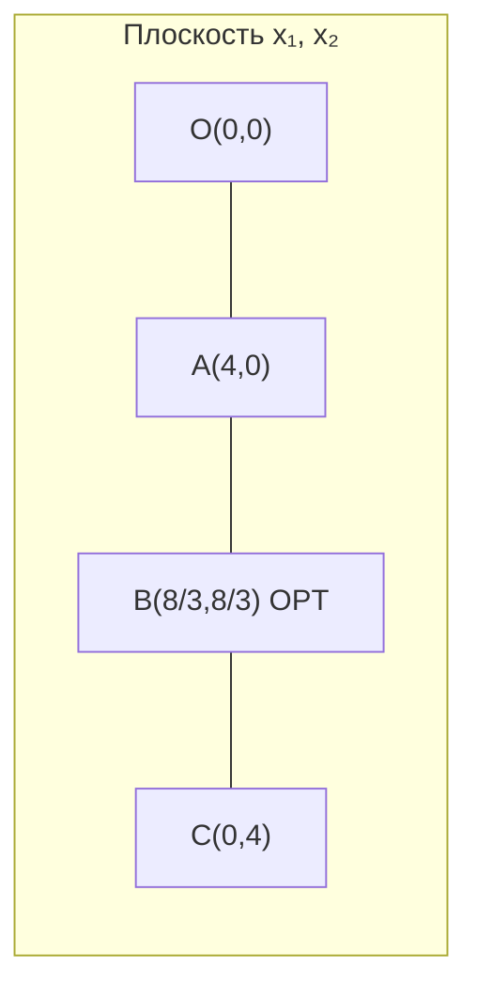

import ExternalPlayEmbed from '@site/src/components/ExternalPlayEmbed';


# Выпуклые множества, свойства ЗЛП и графический метод

<div class="article-tags">
  <span class="tag tag-required">ОБЯЗАТЕЛЬНО</span>
  <span class="tag tag-beginner">ДЛЯ НОВИЧКОВ</span>
  <span class="tag tag-inprogress">В РАЗРАБОТКЕ</span>
</div>

<span class="complexity-badge">Архитектору</span>
<span class="complexity-badge">Инженеру</span>

---

Симплекс — это фундаментальный геометрический объект, представляющий собой простейший выпуклый многогранник в пространстве заданной размерности, а именно отрезок в одномерном пространстве, треугольник в двумерном, тетраэдр в трёхмерном и их аналоги в высших размерностях, причём симплекс образуется как выпуклая оболочка конечного числа точек, не лежащих в одной гиперплоскости меньшей размерности; в контексте линейного программирования симплекс дал имя знаменитому симплекс-методу, который основан на итеративном переходе от одной вершины допустимого многогранника к соседней вдоль ребра, последовательно улучшая значение целевой функции, пока не будет достигнут глобальный оптимум.

До таблиц и формальных преобразований нужно однажды увидеть задачу "глазами геометрии". Эта статья даёт именно такое видение — где находится допустимая область, почему некоторые ограничения становятся активными и по какой причине оптимум в линейной задаче тяготеет к вершинам.

Без этой интуиции симплекс часто превращается в рутинное вычисление коэффициентов. С геометрической картиной каждая итерация таблицы читается осмысленно — алгоритм переходит от одной вершины к соседней по ребру допустимого многогранника.

Коэффициент — это числовой или буквенный множитель, стоящий перед переменной, степенью или целым выражением в алгебраическом термине, который показывает, сколько раз данная величина входит в сумму или произведение; однако в более широком и переносном смысле коэффициент означает любой относительный показатель, нормирующий множитель или масштабирующий параметр, например коэффициент полезного действия, корреляции, трения или эластичности, и он играет роль связующего звена между чистой математикой и конкретными дисциплинами, поскольку через коэффициенты выражаются пропорциональные зависимости, чувствительности и весовые значимости различных факторов в модели.

Рекомендуемый режим чтения — для каждого шага на графике проговаривайте, какой экономический или инженерный смысл стоит за линией, вершиной и направлением роста цели.

Перед симплекс-таблицами полезно **увидеть** задачу на плоскости — где допустимые точки, куда "сдвигается" линия уровня цели, почему оптимум часто попадает в **вершину** многоугольника. Эта статья даёт теорию и полный разбор [примера из введения](/encyclopedia/3-data-markup/3-12-matematicheskoe-programmirovanie/1).

---

## Геометрия на пальцах (две переменные)

Ось — это воображаемая или формально заданная прямая, относительно которой определяется положение точек, направление координат, симметрия или вращение, причём в системе координат оси служат базовыми реперными линиями, задающими направление отсчёта и масштаб для каждой координаты; в геометрическом смысле ось может быть как осью симметрии фигуры, так и осью вращения тела, а в аналитической геометрии оси координат делят пространство на квадранты или октанты и позволяют перейти от абстрактных отношений к числовым представлениям, что делает их незаменимым инструментом визуализации и вычислений.

Плоскость — это двумерное бесконечное геометрическое место точек, которое полностью определяется тремя неколлинеарными точками или одной точкой и нормальным вектором, и которое в трёхмерном пространстве выступает аналогом прямой на плоскости; в задачах оптимизации плоскость появляется как геометрическая интерпретация линейного уравнения, и её пересечение с другими плоскостями образует рёбра и вершины допустимого многогранника, причём в пространстве размерности выше трёх обобщением плоскости служит гиперплоскость, которая разделяет пространство на две полупространства и служит границей для линейных ограничений.

Сторона — в геометрическом смысле это отрезок прямой, ограничивающий часть многоугольника или многогранника и соединяющий две соседние вершины, причём сторона является ребром фигуры и одновременно границей между внутренней областью и внешним пространством; в более абстрактном контексте линейного программирования сторона допустимого многогранника соответствует активному ограничению, то есть такому неравенству, которое в данной точке выполняется как точное равенство, и именно вдоль сторон происходит движение при симплекс-методе, когда одна переменная покидает базис, а другая входит, изменяя текущую вершину.

Пересечение — это теоретико-множественная операция, результатом которой является множество элементов, принадлежащих одновременно каждому из исходных множеств, и она обозначается символом, напоминающим перевёрнутую букву U; в геометрической интерпретации пересечение двух фигур даёт их общую часть, которая может быть точкой, отрезком, областью или пустым множеством, и именно через пересечение полуплоскостей, заданных ограничениями, формируется допустимая область задачи линейного программирования, причём свойства пересечения, такие как выпуклость и замкнутость, наследуются от исходных множеств, что имеет решающее значение для существования оптимума.

Границы — это разделяющие линии или поверхности, отделяющие допустимую область от недопустимой, причём в задачах оптимизации границы задаются ограничениями-неравенствами, переходящими в равенства, и именно на границах часто достигается оптимальное решение, особенно в линейных задачах, где максимум или минимум функции находится в угловой точке; границы могут быть жёсткими, нарушение которых делает решение абсолютно недопустимым, или мягкими, допускающими незначительные отклонения за плату в виде штрафа, и их анализ требует внимательного изучения активных и неактивных ограничений, а также исследования чувствительности решения к сдвигам границ.

Представьте ось **x₁** (горизонталь) и ось **x₂** (вертикаль). Каждое ограничение `a₁x₁ + a₂x₂ ≤ b` отсекает на плоскости **половину** плоскости — **допустимую** сторону от прямой `a₁x₁ + a₂x₂ = b`. Пересечение всех таких "половинок" плюс условие `x₁, x₂ ≥ 0` (первый квадрант) даёт **многоугольник** — все планы, которые можно нарисовать точкой.

- **Вершина** — угол многоугольника; там "встречаются" два (или более) ограничения одновременно как равенства.
- **Линия уровня цели** `3x₁ + 2x₂ = const` — прямая; при увеличении `const` линия "уезжает" в сторону роста прибыли (для `max`).
- **Оптимум** в ЗЛП с конечным решением часто в **углу**, потому что линию уровня дальше сдвинуть уже некуда, не выйдя из допустимой области.

```text
АЛГОРИТМ ГрафическийМетод_2Переменные()
  нарисовать_оси(x1, x2)
  для каждого ограничения
    провести_границу(прямая a1·x1 + a2·x2 = b)
    закрасить_допустимую_полуплоскость(≤ b)
  конец
  область := пересечение_полуплоскостей и x1≥0, x2≥0

  линия_цели := 3·x1 + 2·x2 = Z
  пока линия_цели_пересекает_область
    сдвинуть_линию_цели_в_сторону_роста_Z
  конец
  оптимум := последняя_вершина_области_на_границе
  вернуть оптимум
КОНЕЦ
```

Вершина — это угловая точка многогранника или многоугольника, в которой сходятся несколько рёбер или граней, и которая не может быть выражена как выпуклая комбинация других точек данной фигуры, то есть она является экстремальной точкой допустимого множества; в линейном программировании фундаментальная теорема утверждает, что если оптимальное решение существует, то оно достигается как минимум в одной вершине допустимого многогранника, что сводит задачу поиска оптимума среди непрерывного континуума точек к конечному перебору вершин, и именно это свойство лежит в основе симплекс-метода, который целенаправленно переходит от одной вершины к соседней, улучшая значение целевой функции.

Линия уровня цели — это геометрическое место точек в пространстве переменных решения, для которых целевая функция принимает одно и то же постоянное значение, причём в случае линейной функции такие линии являются прямыми на плоскости или гиперплоскостями в пространствах большей размерности; перемещая эту линию параллельно самой себе в направлении роста или убывания функции, можно визуально определить точку, в которой она последний раз касается допустимой области, и эта точка касания и будет искомым оптимумом, причём линии уровня служат мощным графическим инструментом для понимания структуры задачи, позволяя оценить крутизну функции и направление наискорейшего изменения.

Оптимум — это точка или множество точек в допустимой области, в которых целевая функция достигает своего наилучшего значения, будь то максимум или минимум в зависимости от постановки задачи, причём оптимум может быть глобальным, то есть наилучшим среди всех допустимых вариантов, или локальным, то есть наилучшим лишь в некоторой окрестности; в линейных задачах благодаря выпуклости и линейности любой локальный оптимум автоматически является глобальным, и он всегда находится на границе допустимого многогранника, а не внутри, что кардинально отличает линейное программирование от нелинейных задач, где оптимум может лежать внутри области или на негладких поверхностях.

Угол — это геометрическая фигура, образованная двумя лучами, исходящими из одной точки, называемой вершиной угла, причём величина угла измеряется в градусах или радианах и характеризует степень расхождения направлений; в контексте оптимизации угол естественным образом возникает при пересечении двух прямых линий ограничений, и именно такие угловые точки, или вершины допустимого многоугольника, являются кандидатами на оптимальное решение, при этом внутренние углы допустимой области зависят от наклона ограничений и могут быть как острыми, так и тупыми, что влияет на численную устойчивость алгоритмов.

Области — это связные подмножества пространства переменных, которые могут быть открытыми, замкнутыми, ограниченными или неограниченными, и которые в задачах оптимизации служат геометрическим представлением допустимых значений; области могут быть заданы системами неравенств, и их свойства, такие как выпуклость, компактность и гладкость границы, напрямую определяют существование и единственность решения, причём в многомерных случаях область становится многогранным комплексом, анализ которого требует методов вычислительной геометрии, а пересечение областей даёт новые подмножества с комбинированными свойствами.

---

## Выпуклые множества

Множества — это фундаментальные математические конструкции, представляющие собой собрания любых объектов, объединённых общим признаком, и в оптимизации они выступают как формальные носители допустимых вариантов, целевых значений и параметров; множества могут быть конечными и бесконечными, счётными и несчётными, упорядоченными и неупорядоченными, причём операции над множествами, такие как объединение, пересечение, разность и дополнение, позволяют строить сложные структуры из простых, а теория множеств даёт строгий язык для доказательства существования решений, свойств сходимости и устойчивости оптимизационных алгоритмов.

**Множество** `S` называют **выпуклым**, если для любых двух точек `A, B ∈ S` весь отрезок `AB` тоже лежит в `S`. Интуиция — нет "вогнутостей" и дыр внутри — как резиновая оболочка, натянутая на гвозди.

**Выпуклая комбинация** точек `x⁽¹⁾, …, x⁽ᵏ⁾` — любая точка вида

```
λ₁x⁽¹⁾ + … + λₖx⁽ᵏ⁾,   где λᵢ ≥ 0,  Σλᵢ = 1
```

**Выпуклая оболочка** — множество всех таких комбинаций.

| Объект | Выпукл? |
| --- | --- |
| Полуплоскость `a₁x₁ + a₂x₂ ≤ b` | да |
| Пересечение выпуклых множеств | да |
| Многоугольник (конечное пересечение полуплоскостей) | да |
| Круг `x₁² + x₂² ≤ 1` | да |
| Два разобщённых круга | нет |
| "Звезда" с вогнутинами | нет |

**Почему это важно для ЗЛП** — каждое линейное ограничение `≤` или `=` (при линейной цели) задаёт **выпуклое** допустимое множество. Пересечение — снова выпуклое. Значит, геометрия задачи "хорошая" — локальный оптимум = глобальный.

**Бытовая аналогия выпуклости** — если два плана A и B допустимы, то и **любая смесь** "30% от A + 70% от B" (в тех же пропорциях по переменным) в линейной модели с линейными ограничениями тоже допустима — нельзя "провалиться" внутрь дыры между A и B. У "звезды" с вогнутинами так бывает — середина отрезка между двумя допустимыми точками может оказаться **вне** области.

---

## Свойства задач линейного программирования

Линейность — это фундаментальное свойство математического объекта, операции или системы, выражающееся в выполнении двух основных принципов: аддитивности, то есть результат воздействия на сумму равен сумме результатов воздействия на отдельные части, и однородности, то есть пропорционального изменения результата при масштабировании аргумента; линейность обеспечивает предсказуемость, суперпозицию и простоту анализа, позволяя разбивать сложные задачи на независимые компоненты и использовать мощные матричные методы, однако в реальных процессах линейность часто является лишь приближением, и её нарушение переводит задачу в область нелинейной динамики, где поведение становится качественно более богатым и менее тривиальным.

### 1. Допустимая область

При `x ≥ 0` и ограничениях `Ax ≤ b`, `b ≥ 0`, область — **выпуклый многоугольник** (в 2D), **многогранник** (в nD) или **пустое множество**, или **неограниченное** (уходит в бесконечность).

**Три исхода** — 

| Исход | Смысл |
| --- | --- |
| **Есть оптимум** | целевая "линия уровня" касается области в крайней точке |
| **Несовместна** | ограничения противоречат друг другу |
| **Неограничена** | можно улучшать `Z` бесконечно, оставаясь допустимым |

---

### 2. Теорема об оптимуме в вершине

Если задача максимизации ЗЛП имеет **конечный** оптимум, то он достигается хотя бы в одной **вершине** (крайней точке) допустимого многогранника.

**Идея доказательства (словами)** — линия уровня `c₁x₁ + c₂x₂ = const` двигается в направлении роста `Z`. Пока её можно сдвигать, оптимум не достигнут. Остановка — на границе; если точка не вершина, на отрезке границы цель ещё можно улучшить → противоречие.

Отсюда **симплекс** — он переходит от вершины к соседней, улучшая `Z`, за конечное число шагов (в отсутствие вырожденности).

---

### 3. Линейность и масштаб

Форма области — это совокупность геометрических характеристик допустимого множества, включающая его размерность, ограниченность, выпуклость, наличие выступов и впадин, а также количество граней, рёбер и вершин; форма области критически влияет на выбор метода оптимизации, поскольку для выпуклых многогранников линейные задачи решаются эффективно и гарантированно, тогда как невыпуклые или неограниченные области могут порождать множественные локальные оптимумы, бесконечные спуски или отсутствие решения, и анализ формы часто начинается с определения того, является ли область замкнутой, ограниченной и непустой, что проверяется с помощью теорем отделимости и критериев компактности.

- Удвоение всех `bᵢ` не меняет **форму** области, только масштаб.
- Если цель и ограничения однородны, оптимум на границе "конуса" или в нуле.

---

### 4. Связь с двойственностью (вперёд)

Двойственность — это фундаментальная концепция оптимизации, согласно которой каждой прямой задаче линейного программирования ставится в соответствие другая задача, называемая двойственной, построенная из коэффициентов исходной задачи по определённым правилам транспонирования, причём переменные двойственной задачи интерпретируются как теневые цены или оценки ресурсов; между прямой и двойственной задачами существует глубокая симметрия: если одна из них имеет решение, то и другая имеет решение, и их оптимальные значения совпадают, а условия дополняющей нежёсткости связывают активность ограничений в одной задаче с положительностью переменных в другой, что делает двойственность мощным инструментом для анализа чувствительности, экономической интерпретации и построения декомпозиционных алгоритмов.

Двойственная переменная — это переменная, которая вводится при построении двойственной задачи к исходной прямой задаче линейного программирования, причём каждая такая переменная соответствует одному ограничению исходной задачи и имеет размерность, обратную размерности соответствующего ресурса, что позволяет интерпретировать её как маргинальную ценность единицы ресурса или как штраф за его нарушение; в оптимальной точке двойственная переменная принимает положительное значение только для тех ограничений, которые являются активными, то есть выполняются как равенства, а для неактивных ограничений она равна нулю, и эта связь, известная как условия дополняющей нежёсткости, даёт ценную экономическую информацию о том, какие ресурсы являются дефицитными, а какие избыточными.

Каждому ресурсу в прямой задаче соответствует **двойственная переменная** — "цена" единицы ресурса в оптимуме. Разберём в [статье 6](/encyclopedia/3-data-markup/3-12-matematicheskoe-programmirovanie/6).

---

## Графический метод (две переменные)

Графический метод — это наглядный способ решения задач линейного программирования с двумя переменными, при котором допустимая область строится на плоскости как пересечение полуплоскостей, заданных ограничениями, а затем линии уровня целевой функции перемещаются до тех пор, пока не будет найдена угловая точка, в которой целевая функция принимает экстремальное значение; несмотря на свою ограниченность размерностью, графический метод остаётся незаменимым педагогическим инструментом, поскольку он визуализирует все ключевые понятия — допустимые области, вершины, активные ограничения, направление роста и чувствительность, — и позволяет мгновенно обнаружить случаи неограниченности решения или пустоты допустимого множества, что развивает интуицию для понимания многомерных алгоритмов.

Работает только когда переменных **две** — строим плоскость `(x₁, x₂)`.

**Алгоритм** — 

1. Нарисовать оси, отметить `x₁, x₂ ≥ 0` (первый квадрант).
2. Для каждого ограничения `a₁x₁ + a₂x₂ ≤ b` построить **граничную прямую** `a₁x₁ + a₂x₂ = b` и заштриховать **недопустимую** полуплоскость (где нарушается `≤`).
3. **Допустимая область** — пересечение полуплоскостей и квадранта.
4. Найти **вершины** многоугольника (пересечения границ).
5. Вычислить `Z` в каждой вершине; лучшая — ответ.

---

### Как построить прямую и выбрать допустимую полуплоскость

Построение — в контексте графического метода это последовательная процедура нанесения на координатную плоскость каждого ограничения в виде прямой линии, определения соответствующей полуплоскости с помощью тестовой точки, выделения общей допустимой области путём пересечения всех полуплоскостей, а затем наложения линий уровня целевой функции и их параллельного переноса до достижения крайней точки; построение требует аккуратности, правильного выбора масштаба и чёткого различения строгих и нестрогих неравенств, причём качество построения напрямую влияет на точность определения координат оптимальной вершины, которые затем могут быть уточнены аналитически решением системы соответствующих уравнений.

Полуплоскость — это множество точек плоскости, лежащих по одну сторону от некоторой прямой, включая саму эту прямую в случае нестрогого неравенства или исключая её при строгом неравенстве, причём прямая называется границей полуплоскости; каждая полуплоскость является выпуклым множеством, и именно пересечение конечного числа полуплоскостей образует допустимую область задачи линейного программирования, которая также оказывается выпуклой, возможно неограниченной, а ориентация полуплоскости определяется знаком коэффициентов в соответствующем линейном неравенстве, что делает полуплоскости основными строительными блоками геометрической интерпретации оптимизации.

Тестовая точка — это произвольная точка плоскости, не лежащая на граничной прямой, которая используется для определения того, какая из двух полуплоскостей, на которые прямая делит плоскость, соответствует данному неравенству; стандартным приёмом является подстановка координат простейшей точки, например начала координат, если оно не принадлежит границе, в левую часть неравенства, и если неравенство выполняется, то нужная полуплоскость содержит эту точку, в противном случае выбирается противоположная сторона; тестовая точка служит простым и надёжным инструментом для визуального построения допустимой области без необходимости сложных геометрических рассуждений, и её использование является обязательным элементом графического метода решения задач линейного программирования.

Для `2x₁ + x₂ ≤ 8` —

1. Решите уравнение границы для двух точек — при `x₁=0` → `x₂=8`; при `x₂=0` → `x₁=4`. Соедините `(0,8)` и `(4,0)`.
2. **Тестовая точка** — часто `(0,0)` — подставьте в **неравенство** (не в равенство) — `2·0+0=0 ≤ 8` — верно. Значит, сторона, где лежит `(0,0)`, **допустима**; заштрихуйте противоположную (ту, где `2x₁+x₂ > 8`).

Тот же приём для `x₁ + 2x₂ ≤ 8` — точки `(0,4)` и `(8,0)`; `(0,0)` снова допустима — штрихуем "внешнюю" сторону.

**Направление роста цели** — вектор `c = (c₁, c₂)`. Линии уровня перпендикулярны `c`. Двигаем линию уровня в сторону `c` до "последнего" касания с областью.

| Вектор `c` | Куда "тянется" прибыль при `max` |
| --- | --- |
| `(3, 2)` | вправо-вверх (больше и `x₁`, и `x₂` выгодно) |
| `(1, 0)` | только вправо (важен только первый продукт) |

---

## Полный пример — станки и сырьё

Задача из [введения](/encyclopedia/3-data-markup/3-12-matematicheskoe-programmirovanie/1) —

```
max Z = 3x₁ + 2x₂

2x₁ +  x₂ ≤ 8     (1)
 x₁ + 2x₂ ≤ 8     (2)
x₁, x₂ ≥ 0
```

---

### Шаг 1. Граничные прямые

| Ограничение | Прямая | Удобные точки на оси |
| --- | --- | --- |
| (1) | `2x₁ + x₂ = 8` | `(0,8)`, `(4,0)` |
| (2) | `x₁ + 2x₂ = 8` | `(0,4)`, `(8,0)` |

После штриховки допустимая область — **многоугольник** с углами на осях и в точке пересечения двух прямых (плюс начало координат, если оно внутри).

---

### Шаг 2. Вершины многоугольника

| Вершина | Как получена | `Z = 3x₁ + 2x₂` |
| --- | --- | --- |
| `O` `(0, 0)` | начало координат | 0 |
| `A` `(4, 0)` | (1) с осью `x₂=0` | 12 |
| `B` `(8/3, 8/3)` | пересечение (1) и (2) | `8/3·(3+2) = 40/3 ≈ 13,33` |
| `C` `(0, 4)` | (2) с осью `x₁=0` | 8 |

**Пересечение (1) и (2)** — 

```
2x₁ + x₂ = 8
 x₁ + 2x₂ = 8
```

Из первого — `x₂ = 8 − 2x₁`. Подставляем —

```
x₁ + 2(8 − 2x₁) = 8  →  x₁ + 16 − 4x₁ = 8  →  −3x₁ = −8  →  x₁ = 8/3
x₂ = 8 − 16/3 = 8/3
```

---

### Шаг 3. Ответ

**Оптимум** — `x₁* = 8/3`, `x₂* = 8/3`, **`Z* = 40/3`**.

**Проверка `Z` в вершине B** — `Z = 3·(8/3) + 2·(8/3) = 8 + 16/3 = 40/3`. Сравнение с `A`: `Z=12`; с `C`: `Z=8`; с `O`: `Z=0` — максимум действительно в `B`.

Производить поровну оба изделия в данной модели выгодно — в оптимуме **оба** ресурса исчерпаны (`2x₁+x₂=8` и `x₁+2x₂=8` одновременно) — узких мест два, и план их балансирует.

**Интерпретация дробей** — `8/3 ≈ 2,67` тысячи штук — в реальности округляют до целых (это уже [целочисленное](/encyclopedia/3-data-markup/3-12-matematicheskoe-programmirovanie/1) программирование); в учебной линейной модели дробный план показывает **направление** оптимума.

---

### Шаг 4. Проверка направлением цели

Вектор `c = (3, 2)`. Линия `3x₁ + 2x₂ = 40/3` касается многоугольника в вершине `B`. Сдвиг линии дальше по `c` выведет её из допустимой области — значит, `B` действительно максимум.



(На реальном чертеже область — четырёхугольник `O–A–B–C`; для точности лучше построить в тетради или GeoGebra.)

---

## Интерактив — подвигайте цель и ограничения

Измените коэффициенты цели и лимиты ресурсов, чтобы увидеть, как меняется оптимальная вершина и какие ограничения становятся активными.

Фокус эксперимента в этой главе —
- воспринимайте коэффициенты цели как "направление движения" линии уровня;
- воспринимайте лимиты как форму и размер допустимой области;
- после каждого изменения пробуйте угадать, где будет оптимум, и только потом смотрите результат.

<ExternalPlayEmbed example="data-markup/linear-programming-playground" title="Линейное программирование" minHeight={560} />

Что особенно важно заметить после интерактива —
1. Оптимум может сдвигаться скачком между вершинами.
2. "Активные" ограничения в оптимуме — это и есть геометрически те границы, которые удерживают линию уровня.
3. Если допустимых точек нет, на графике это означает пустое пересечение полуплоскостей.

С этой интуицией легче читать следующий блок про особые случаи — несовместность, неограниченность и альтернативный оптимум.

---

## Особые случаи на графике

### Несовместная система

Прямые "отсекают" квадрант так, что **пересечения нет**. Пример — `x₁ + x₂ ≤ 1` и `x₁ + x₂ ≥ 5` одновременно.

**Типовая задача 2.1.** `max Z = 2x₁ + 3x₂` при `x₁ + 2x₂ ≤ 4`, `2x₁ + x₂ ≤ 5`, `x₁, x₂ ≥ 0`. Область — треугольник в первом квадранте, оптимум в вершине — классический случай "всё хорошо". Такие задачи — эталон для отработки построения.

---

### Неограниченная цель

Область уходит в бесконечность, и вектор `c` можно двигать вдоль неограниченного луча, бесконечно улучшая `Z`. Пример: `max x₁ + x₂` при `x₁ − x₂ ≤ 1`, `x ≥ 0` — область не замкнута в направлении роста обеих координат.

В **симплекс-таблице** тот же случай — при выборе входящего столбца **все** коэффициенты в этом столбце в строках ограничений ≤ 0 → **нет положительного θ** → `Z` не ограничено сверху (для max).

**Типовая задача 2.4.** Постановка —

```
max  Z = 4x₁ + x₂

при  −x₁ + x₂ ≤ 2
     x₁ + x₂ ≥ 3
     x₁, x₂ ≥ 0
```

(Иногда добавляют ещё параллельные ограничения `−x₁ + x₂ ≤ 4, 5` — они не сужают область сильнее, чем `≤ 2`.)

**Геометрия.** Верхняя граница — прямая `x₂ = x₁ + 2`; нижняя — `x₂ ≥ 3 − x₁`. Пересечение в первом квадранте **непустое** (например, точка `(1, 2)`), но **не замкнуто сверху** — при росте `x₁` можно брать `x₂ = x₁ + 2`, сохраняя `x₁ + x₂ = 2x₁ + 2 → ∞`. Цель `4x₁ + x₂` растёт без предела вдоль этого луча → **целевая функция неограничена** (для `max`).

| Диагностика | Что видим |
| --- | --- |
| Область | непустая, но уходит вдоль луча |
| Линия уровня | сдвигается в сторону `c = (4, 1)` бесконечно |
| Симплекс | нет конечного оптимума |

<div class="callout callout--caution">
  <div class="callout-title">Не путать с "пустой областью"</div>

  <div class="callout-body">
  Если бы пересечение полуплоскостей было пустым, солвер вернул бы "infeasible". Здесь планы есть, но <strong>лучшего</strong> конечного плана нет.
</div>
  </div>


---

### Задача с несколькими ресурсами (2.5)

**Сюжет (фабрика, четыре ресурса).** Изделия **A** и **B** потребляют сталь, цветные металлы, часы токарных и фрезерных станков. Нужно **максимизировать прибыль**.

| Ресурс | Норма на A | Норма на B | Запас |
| --- | --- | --- | --- |
| Сталь, кг | 2 | 1 | 8 |
| Цветные металлы, кг | 1 | 3 | 70 |
| Токарные станки, ч | 4 | 2 | 50 |
| Фрезерные станки, ч | 2 | 5 | 400 |
| Прибыль, у.е. | 3 | 5 | — |

**Переменные** — `x₁`, `x₂` (штуки A и B).

```
max  Z = 3x₁ + 5x₂

при  2x₁ +  x₂ ≤ 8
     x₁ + 3x₂ ≤ 70
     4x₁ + 2x₂ ≤ 50
     2x₁ + 5x₂ ≤ 400
     x₁, x₂ ≥ 0
```

**Как решать графически** — построить четыре полуплоскости; в оптимуме обычно активны **два** ограничения (часто сталь и токарные станки). Подставьте пару равенств, найдите вершину, сравните `Z` с соседними углами. Полный разбор удобно сделать в GeoGebra или на [playground](/encyclopedia/3-data-markup/3-12-matematicheskoe-programmirovanie/intro) с двумя самыми жёсткими ограничениями.

**Инженерный смысл** — при четырёх ресурсах в 2D на графике видны только **проекции**; для `n > 2` переходят к [симплексу](/encyclopedia/3-data-markup/3-12-matematicheskoe-programmirovanie/4) или [солверу](/encyclopedia/3-data-markup/3-12-matematicheskoe-programmirovanie/9).

---

### Альтернативный оптимум

Если **линия уровня** совпадает с **ребром** многоугольника, любая точка этого ребра — оптимум. Тогда коэффициенты цели **пропорциональны** нормали к этому ребру (`c` параллелен нормали к одному из ограничений-active).

**Числовой признак** — для ребра, заданного `2x₁ + x₂ = 8`, нормаль `(2, 1)`. Если цель `Z = 3x₁ + 2x₂`, вектор `(3, 2)` **не** пропорционален `(2, 1)` — ребро не целиком оптимально, только вершина `B`. Если бы цель была `Z = 2x₁ + x₂` (кратно ограничению (1)), **все** точки отрезка от `A` до `B` на границе (1) давали бы одинаковый `Z`.

---

### Активные ограничения и размерность

В вершине в **2D** ровно **два** ограничения активны (выполнены как равенства), часто одно из них — `x₁=0` или `x₂=0`. В **3D** вершина — пересечение **трёх** плоскостей. Симплекс на каждом шаге меняет набор активных ограничений, "переезжая" по ребрам многогранника.

| Вершина (пример станков) | Активные ограничения |
| --- | --- |
| `O` | `x₁=0`, `x₂=0` |
| `A` | `x₂=0`, `2x₁+x₂=8` |
| `B` | `2x₁+x₂=8`, `x₁+2x₂=8` |
| `C` | `x₁=0`, `x₁+2x₂=8` |

---

## Ограничения в графическом методе

| Плюс | Минус |
| --- | --- |
| Наглядность, проверка постановки | Только 2 (иногда 3) переменные |
| Быстрая диагностика "пусто / ∞" | Не масштабируется на реальные модели |
| Хорош для интуиции и ручной проверки | Числа на чертеже легко перепутать |

Для `n > 2` переходят к **симплексу** ([Симплекс-метод и симплекс-таблицы](/encyclopedia/3-data-markup/3-12-matematicheskoe-programmirovanie/4)) или к [программным решателям](/encyclopedia/3-data-markup/3-12-matematicheskoe-programmirovanie/9).

---

## Методическая польза графического подхода

Даже если в проекте вы никогда не будете рисовать область вручную, графический метод остаётся важным учебным инструментом —
- показывает, как именно каждое ограничение "режет" пространство решений;
- помогает быстро обнаружить противоречия в постановке до запуска солвера;
- развивает интуицию по активным ограничениям и чувствительности к изменению коэффициентов;
- объясняет, почему симплекс движется по вершинам и рассматривает только соседние углы.

---

## Мини-эксперименты для закрепления

1. Измените коэффициент цели с `3x₁ + 2x₂` на `2x₁ + 3x₂` и посмотрите, как сдвигается оптимальная вершина.
2. Ослабьте ресурс во втором ограничении (`x₁ + 2x₂ ≤ 9`) и пересчитайте вершины.
3. Сделайте одно ограничение `≥` и проверьте, не исчезла ли допустимая область.

Такие микрошаги дают то же понимание, что и чтение формул, но значительно быстрее формируют инженерную интуицию.

---

## Связь с алгеброй

Вершина = решение системы **двух** активных ограничений (равенства вместо `≤`). Симплекс систематически переключает, какие ограничения "активны", не рисуя график.

Подготовка таблиц — [метод Жордана–Гаусса](/encyclopedia/3-data-markup/3-12-matematicheskoe-programmirovanie/3).

Дальше — [симплекс-метод](/encyclopedia/3-data-markup/3-12-matematicheskoe-programmirovanie/4).

---
