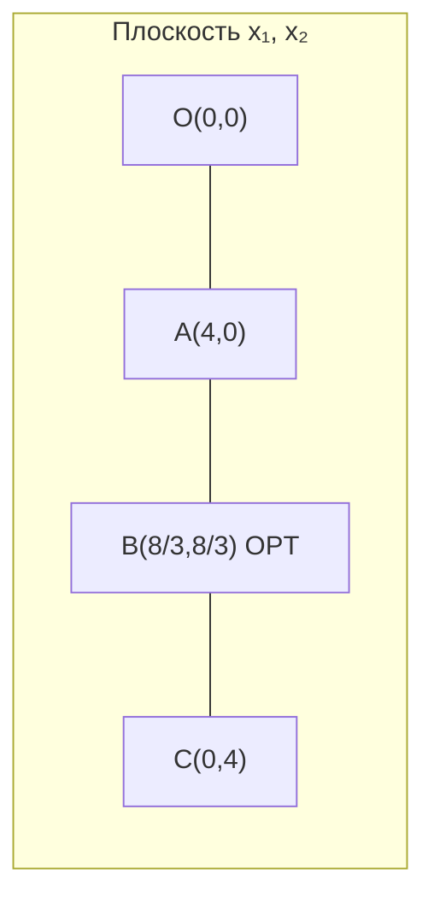

import LinearProgrammingPlayground from '@site/src/components/LinearProgrammingPlayground';

# Выпуклые множества, свойства ЗЛП и графический метод

<div class="article-tags">
  <span class="tag tag-required">ОБЯЗАТЕЛЬНО</span>
  <span class="tag tag-beginner">ДЛЯ НОВИЧКОВ</span>
  <span class="tag tag-inprogress">В РАЗРАБОТКЕ</span>
</div>

<span class="complexity-badge">Архитектору</span>
<span class="complexity-badge">Инженеру</span>

## Почему эта глава критична перед симплексом

До таблиц и формальных преобразований нужно однажды увидеть задачу "глазами геометрии". Эта статья даёт именно такое видение — где находится допустимая область, почему некоторые ограничения становятся активными и по какой причине оптимум в линейной задаче тяготеет к вершинам.

Без этой интуиции симплекс часто превращается в рутинное вычисление коэффициентов. С геометрической картиной каждая итерация таблицы читается осмысленно — алгоритм переходит от одной вершины к соседней по ребру допустимого многогранника.

Рекомендуемый режим чтения — для каждого шага на графике проговаривайте, какой экономический или инженерный смысл стоит за линией, вершиной и направлением роста цели.

Перед симплекс-таблицами полезно **увидеть** задачу на плоскости — где допустимые точки, куда «сдвигается» линия уровня цели, почему оптимум часто попадает в **вершину** многоугольника. Эта статья даёт теорию и полный разбор [примера из введения](/encyclopedia/3-data-markup/3-12-matematicheskoe-programmirovanie/1).

---

## Геометрия на пальцах (две переменные)

Представьте ось **x₁** (горизонталь) и ось **x₂** (вертикаль). Каждое ограничение `a₁x₁ + a₂x₂ ≤ b` отсекает на плоскости **половину** плоскости — **допустимую** сторону от прямой `a₁x₁ + a₂x₂ = b`. Пересечение всех таких «половинок» плюс условие `x₁, x₂ ≥ 0` (первый квадрант) даёт **многоугольник** — все планы, которые можно нарисовать точкой.

- **Вершина** — угол многоугольника; там «встречаются» два (или более) ограничения одновременно как равенства.
- **Линия уровня цели** `3x₁ + 2x₂ = const` — прямая; при увеличении `const` линия «уезжает» в сторону роста прибыли (для `max`).
- **Оптимум** в ЗЛП с конечным решением часто в **углу**, потому что линию уровня дальше сдвинуть уже некуда, не выйдя из допустимой области.

---

## Выпуклые множества

**Множество** `S` называют **выпуклым**, если для любых двух точек `A, B ∈ S` весь отрезок `AB` тоже лежит в `S`. Интуиция — нет «вогнутостей» и дыр внутри — как резиновая оболочка, натянутая на гвозди.

**Выпуклая комбинация** точек `x⁽¹⁾, …, x⁽ᵏ⁾` — любая точка вида

```
λ₁x⁽¹⁾ + … + λₖx⁽ᵏ⁾,   где λᵢ ≥ 0,  Σλᵢ = 1
```

**Выпуклая оболочка** — множество всех таких комбинаций.

| Объект | Выпукл? |
| --- | --- |
| Полуплоскость `a₁x₁ + a₂x₂ ≤ b` | да |
| Пересечение выпуклых множеств | да |
| Многоугольник (конечное пересечение полуплоскостей) | да |
| Круг `x₁² + x₂² ≤ 1` | да |
| Два разобщённых круга | нет |
| «Звезда» с вогнутинами | нет |

**Почему это важно для ЗЛП** — каждое линейное ограничение `≤` или `=` (при линейной цели) задаёт **выпуклое** допустимое множество. Пересечение — снова выпуклое. Значит, геометрия задачи «хорошая» — локальный оптимум = глобальный.

**Бытовая аналогия выпуклости** — если два плана A и B допустимы, то и **любая смесь** «30% от A + 70% от B» (в тех же пропорциях по переменным) в линейной модели с линейными ограничениями тоже допустима — нельзя «провалиться» внутрь дыры между A и B. У «звезды» с вогнутинами так бывает — середина отрезка между двумя допустимыми точками может оказаться **вне** области.

---

## Свойства задач линейного программирования

### 1. Допустимая область

При `x ≥ 0` и ограничениях `Ax ≤ b`, `b ≥ 0`, область — **выпуклый многоугольник** (в 2D), **многогранник** (в nD) или **пустое множество**, или **неограниченное** (уходит в бесконечность).

**Три исхода** — 

| Исход | Смысл |
| --- | --- |
| **Есть оптимум** | целевая «линия уровня» касается области в крайней точке |
| **Несовместна** | ограничения противоречат друг другу |
| **Неограничена** | можно улучшать `Z` бесконечно, оставаясь допустимым |

### 2. Теорема об оптимуме в вершине

Если задача максимизации ЗЛП имеет **конечный** оптимум, то он достигается хотя бы в одной **вершине** (крайней точке) допустимого многогранника.

**Идея доказательства (словами)** — линия уровня `c₁x₁ + c₂x₂ = const` двигается в направлении роста `Z`. Пока её можно сдвигать, оптимум не достигнут. Остановка — на границе; если точка не вершина, на отрезке границы цель ещё можно улучшить → противоречие.

Отсюда **симплекс** — он переходит от вершины к соседней, улучшая `Z`, за конечное число шагов (в отсутствие вырожденности).

### 3. Линейность и масштаб

- Удвоение всех `bᵢ` не меняет **форму** области, только масштаб.
- Если цель и ограничения однородны, оптимум на границе «конуса» или в нуле.

### 4. Связь с двойственностью (вперёд)

Каждому ресурсу в прямой задаче соответствует **двойственная переменная** — «цена» единицы ресурса в оптимуме. Разберём в [статье 6](/encyclopedia/3-data-markup/3-12-matematicheskoe-programmirovanie/6).

---

## Графический метод (две переменные)

Работает только когда переменных **две** — строим плоскость `(x₁, x₂)`.

**Алгоритм** — 

1. Нарисовать оси, отметить `x₁, x₂ ≥ 0` (первый квадрант).
2. Для каждого ограничения `a₁x₁ + a₂x₂ ≤ b` построить **граничную прямую** `a₁x₁ + a₂x₂ = b` и заштриховать **недопустимую** полуплоскость (где нарушается `≤`).
3. **Допустимая область** — пересечение полуплоскостей и квадранта.
4. Найти **вершины** многоугольника (пересечения границ).
5. Вычислить `Z` в каждой вершине; лучшая — ответ.

### Как построить прямую и выбрать допустимую полуплоскость

Для `2x₁ + x₂ ≤ 8` —

1. Решите уравнение границы для двух точек — при `x₁=0` → `x₂=8`; при `x₂=0` → `x₁=4`. Соедините `(0,8)` и `(4,0)`.
2. **Тестовая точка** — часто `(0,0)` — подставьте в **неравенство** (не в равенство) — `2·0+0=0 ≤ 8` — верно. Значит, сторона, где лежит `(0,0)`, **допустима**; заштрихуйте противоположную (ту, где `2x₁+x₂ > 8`).

Тот же приём для `x₁ + 2x₂ ≤ 8` — точки `(0,4)` и `(8,0)`; `(0,0)` снова допустима — штрихуем «внешнюю» сторону.

**Направление роста цели** — вектор `c = (c₁, c₂)`. Линии уровня перпендикулярны `c`. Двигаем линию уровня в сторону `c` до «последнего» касания с областью.

| Вектор `c` | Куда «тянется» прибыль при `max` |
| --- | --- |
| `(3, 2)` | вправо-вверх (больше и `x₁`, и `x₂` выгодно) |
| `(1, 0)` | только вправо (важен только первый продукт) |

---

## Полный пример — станки и сырьё

Задача из [введения](/encyclopedia/3-data-markup/3-12-matematicheskoe-programmirovanie/1) —

```
max Z = 3x₁ + 2x₂

2x₁ +  x₂ ≤ 8     (1)
 x₁ + 2x₂ ≤ 8     (2)
x₁, x₂ ≥ 0
```

### Шаг 1. Граничные прямые

| Ограничение | Прямая | Удобные точки на оси |
| --- | --- | --- |
| (1) | `2x₁ + x₂ = 8` | `(0,8)`, `(4,0)` |
| (2) | `x₁ + 2x₂ = 8` | `(0,4)`, `(8,0)` |

После штриховки допустимая область — **многоугольник** с углами на осях и в точке пересечения двух прямых (плюс начало координат, если оно внутри).

### Шаг 2. Вершины многоугольника

| Вершина | Как получена | `Z = 3x₁ + 2x₂` |
| --- | --- | --- |
| `O` `(0, 0)` | начало координат | 0 |
| `A` `(4, 0)` | (1) с осью `x₂=0` | 12 |
| `B` `(8/3, 8/3)` | пересечение (1) и (2) | `8/3·(3+2) = 40/3 ≈ 13,33` |
| `C` `(0, 4)` | (2) с осью `x₁=0` | 8 |

**Пересечение (1) и (2)** — 

```
2x₁ + x₂ = 8
 x₁ + 2x₂ = 8
```

Из первого — `x₂ = 8 − 2x₁`. Подставляем —

```
x₁ + 2(8 − 2x₁) = 8  →  x₁ + 16 − 4x₁ = 8  →  −3x₁ = −8  →  x₁ = 8/3
x₂ = 8 − 16/3 = 8/3
```

### Шаг 3. Ответ

**Оптимум** — `x₁* = 8/3`, `x₂* = 8/3`, **`Z* = 40/3`**.

**Проверка `Z` в вершине B** — `Z = 3·(8/3) + 2·(8/3) = 8 + 16/3 = 40/3`. Сравнение с `A`: `Z=12`; с `C`: `Z=8`; с `O`: `Z=0` — максимум действительно в `B`.

Производить поровну оба изделия в данной модели выгодно — в оптимуме **оба** ресурса исчерпаны (`2x₁+x₂=8` и `x₁+2x₂=8` одновременно) — узких мест два, и план их балансирует.

**Интерпретация дробей** — `8/3 ≈ 2,67` тысячи штук — в реальности округляют до целых (это уже [целочисленное](/encyclopedia/3-data-markup/3-12-matematicheskoe-programmirovanie/1) программирование); в учебной линейной модели дробный план показывает **направление** оптимума.

### Шаг 4. Проверка направлением цели

Вектор `c = (3, 2)`. Линия `3x₁ + 2x₂ = 40/3` касается многоугольника в вершине `B`. Сдвиг линии дальше по `c` выведет её из допустимой области — значит, `B` действительно максимум.



(На реальном чертеже область — четырёхугольник `O–A–B–C`; для точности лучше построить в тетради или GeoGebra.)

---

## Интерактив — подвигайте цель и ограничения

Измените коэффициенты цели и лимиты ресурсов, чтобы увидеть, как меняется оптимальная вершина и какие ограничения становятся активными.

Фокус эксперимента в этой главе —
- воспринимайте коэффициенты цели как "направление движения" линии уровня;
- воспринимайте лимиты как форму и размер допустимой области;
- после каждого изменения пробуйте угадать, где будет оптимум, и только потом смотрите результат.

<LinearProgrammingPlayground />

Что особенно важно заметить после интерактива —
1. Оптимум может сдвигаться скачком между вершинами.
2. "Активные" ограничения в оптимуме — это и есть геометрически те границы, которые удерживают линию уровня.
3. Если допустимых точек нет, на графике это означает пустое пересечение полуплоскостей.

С этой интуицией легче читать следующий блок про особые случаи — несовместность, неограниченность и альтернативный оптимум.

---

## Особые случаи на графике

### Несовместная система

Прямые «отсекают» квадрант так, что **пересечения нет**. Пример — `x₁ + x₂ ≤ 1` и `x₁ + x₂ ≥ 5` одновременно.

### Неограниченная цель

Область уходит в бесконечность, и вектор `c` можно двигать вдоль неограниченного луча, бесконечно улучшая `Z`. Пример: `max x₁ + x₂` при `x₁ − x₂ ≤ 1`, `x ≥ 0` — область не замкнута в направлении роста обеих координат.

В **симплекс-таблице** тот же случай — при выборе входящего столбца **все** коэффициенты в этом столбце в строках ограничений ≤ 0 → **нет положительного θ** → `Z` не ограничено сверху (для max).

### Альтернативный оптимум

Если **линия уровня** совпадает с **ребром** многоугольника, любая точка этого ребра — оптимум. Тогда коэффициенты цели **пропорциональны** нормали к этому ребру (`c` параллелен нормали к одному из ограничений-active).

**Числовой признак** — для ребра, заданного `2x₁ + x₂ = 8`, нормаль `(2, 1)`. Если цель `Z = 3x₁ + 2x₂`, вектор `(3, 2)` **не** пропорционален `(2, 1)` — ребро не целиком оптимально, только вершина `B`. Если бы цель была `Z = 2x₁ + x₂` (кратно ограничению (1)), **все** точки отрезка от `A` до `B` на границе (1) давали бы одинаковый `Z`.

### Активные ограничения и размерность

В вершине в **2D** ровно **два** ограничения активны (выполнены как равенства), часто одно из них — `x₁=0` или `x₂=0`. В **3D** вершина — пересечение **трёх** плоскостей. Симплекс на каждом шаге меняет набор активных ограничений, «переезжая» по ребрам многогранника.

| Вершина (пример станков) | Активные ограничения |
| --- | --- |
| `O` | `x₁=0`, `x₂=0` |
| `A` | `x₂=0`, `2x₁+x₂=8` |
| `B` | `2x₁+x₂=8`, `x₁+2x₂=8` |
| `C` | `x₁=0`, `x₁+2x₂=8` |

---

## Ограничения в графическом методе

| Плюс | Минус |
| --- | --- |
| Наглядность, проверка постановки | Только 2 (иногда 3) переменные |
| Быстрая диагностика «пусто / ∞» | Не масштабируется на реальные модели |
| Хорош для экзамена и интуиции | Числа на чертеже легко перепутать |

Для `n > 2` переходят к **симплексу** ([4](/encyclopedia/3-data-markup/3-12-matematicheskoe-programmirovanie/4)) или к [программным решателям](/encyclopedia/3-data-markup/3-12-matematicheskoe-programmirovanie/9).

---

## Методическая польза графического подхода

Даже если в проекте вы никогда не будете рисовать область вручную, графический метод остаётся важным учебным инструментом —
- показывает, как именно каждое ограничение "режет" пространство решений;
- помогает быстро обнаружить противоречия в постановке до запуска солвера;
- развивает интуицию по активным ограничениям и чувствительности к изменению коэффициентов;
- объясняет, почему симплекс движется по вершинам и рассматривает только соседние углы.

---

## Мини-эксперименты для закрепления

1. Измените коэффициент цели с `3x₁ + 2x₂` на `2x₁ + 3x₂` и посмотрите, как сдвигается оптимальная вершина.
2. Ослабьте ресурс во втором ограничении (`x₁ + 2x₂ ≤ 9`) и пересчитайте вершины.
3. Сделайте одно ограничение `≥` и проверьте, не исчезла ли допустимая область.

Такие микрошаги дают то же понимание, что и чтение формул, но значительно быстрее формируют инженерную интуицию.

---

## Связь с алгеброй

Вершина = решение системы **двух** активных ограничений (равенства вместо `≤`). Симплекс систематически переключает, какие ограничения «активны», не рисуя график.

Подготовка таблиц — [метод Жордана–Гаусса](/encyclopedia/3-data-markup/3-12-matematicheskoe-programmirovanie/3).

Дальше — [симплекс-метод](/encyclopedia/3-data-markup/3-12-matematicheskoe-programmirovanie/4).

---
