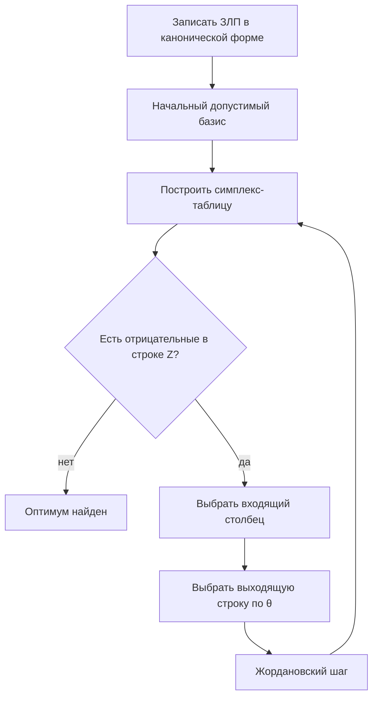

import ExternalPlayEmbed from '@site/src/components/ExternalPlayEmbed';


# Симплекс-метод и симплекс-таблицы

<div class="article-tags">
  <span class="tag tag-required">ОБЯЗАТЕЛЬНО</span>
  <span class="tag tag-beginner">ДЛЯ НОВИЧКОВ</span>
  <span class="tag tag-inprogress">В РАЗРАБОТКЕ</span>
</div>

<span class="complexity-badge">Архитектору</span>
<span class="complexity-badge">Инженеру</span>

---

Строки — это горизонтальные линейные последовательности элементов в матрице или симплекс-таблице, каждая из которых обычно соответствует одному уравнению ограничения либо целевой функции, причём в контексте линейного программирования строки несут информацию о коэффициентах при переменных, правой части и текущем значении соответствующей базисной переменной; операции над строками, такие как перестановка, умножение на скаляр и сложение с другой строкой, являются основными инструментами преобразования таблицы, и именно по строкам отслеживается выполнение ограничений, а также вычисляются отношения для определения выходящей переменной.

Столбцы — это вертикальные последовательности элементов матрицы, каждый из которых соответствует конкретной переменной задачи, будь то исходная переменная решения, дополнительная слак-переменная или искусственная переменная, причём столбец содержит коэффициенты этой переменной во всех ограничениях и в целевой функции; в симплекс-методе столбцы делятся на базисные, образующие единичную матрицу, и небазисные, которые анализируются на предмет улучшения целевой функции, и именно выбор ведущего столбца по наибольшей положительной оценке определяет, какая переменная войдёт в базис на следующей итерации.

Базисные столбцы — это те столбцы симплекс-таблицы, которые соответствуют текущим базисным переменным и образуют единичную матрицу, то есть в каждой строке ровно один такой столбец содержит единицу, а все остальные базисные столбцы в этой строке содержат ноль; благодаря этой структуре значения базисных переменных непосредственно считываются из столбца правых частей, и вся задача сводится к поддержанию этого единичного вида при каждом жордановском шаге, причём замена базисного столбца на новый означает замену одной базисной переменной на другую и переход к соседней вершине допустимого многогранника.

Матрицы и подматрицы — матрица представляет собой прямоугольную таблицу чисел, расположенных по строкам и столбцам, которая служит компактной формой записи системы линейных уравнений, коэффициентов ограничений и целевой функции, а подматрица образуется путём удаления некоторых строк или столбцов из исходной матрицы, сохраняя при этом прямоугольную структуру; в симплекс-методе подматрицы возникают естественным образом, когда выделяют базисную подматрицу, состоящую из базисных столбцов, и небазисную подматрицу, причём именно невырожденность базисной подматрицы гарантирует единственность текущего базисного решения и возможность обращения матрицы для пересчёта таблицы.

Пересчёт строк — это процедура обновления всех элементов симплекс-таблицы после выбора ведущего элемента, при которой ведущая строка делится на этот ведущий элемент, а затем каждая другая строка преобразуется путём вычитания из неё ведущей строки, умноженной на соответствующий коэффициент, чтобы обнулить все элементы ведущего столбца, кроме ведущего; этот пересчёт является сердцем каждой итерации симплекс-метода, и он требует высокой аккуратности, поскольку ошибка в одном элементе распространяется на всю таблицу, поэтому дисциплина вычислений предписывает использовать двойной контроль, работать с достаточной точностью и избегать округлений на промежуточных этапах.

Это центральная техническая статья раздела — здесь формируется навык системного чтения симплекс-таблицы вместе с механикой пересчёта строк. После неё вы видите в таблице текущий план, направление улучшения цели и причину остановки на оптимуме.

Отдельный акцент сделан на дисциплине вычислений — выбор входящего столбца, правило `theta`, контроль знаков в строке `Z`, интерпретация вырожденности и неограниченности. На практике именно в этих местах чаще всего появляются ошибки даже у тех, кто "вроде понял" общий алгоритм.

Дисциплина вычислений — это совокупность строгих правил, стандартов и процедур, которые обеспечивают корректность, надёжность и воспроизводимость численных расчётов при выполнении симплекс-метода или любого другого алгоритма линейной алгебры; она включает в себя выбор подходящей точности арифметики, использование устойчивых методов пивотирования, проверку допустимости и оптимальности на каждом шаге, контроль за вырожденностью и возможным зацикливанием, а также документирование всех промежуточных результатов, причём пренебрежение дисциплиной может привести к накоплению ошибок, неверному определению ведущего элемента и, как следствие, к ложному решению или бесконечному циклу.

Входящий столбец — это столбец симплекс-таблицы, который выбирается для ввода в базис на текущей итерации на основе критерия оптимальности, а именно по наибольшей положительной оценке в строке целевой функции при максимизации или по наименьшей отрицательной при минимизации; выбор входящего столбца определяет, какая переменная перейдёт из свободных в базисные, и её увеличение от нулевого значения должно улучшить целевую функцию, причём если такой столбец не найден, то текущее решение признаётся оптимальным, а если все элементы в нём неположительны, то задача объявляется неограниченной.

Тета — это отношение значения правой части соответствующей строки к положительному элементу в ведущем столбце, и оно вычисляется для каждой строки, где такой элемент больше нуля, причём минимальное из этих отношений определяет, какая строка станет ведущей, а следовательно, какая базисная переменная покинет базис; геометрически тета показывает, насколько можно увеличить входящую переменную, не нарушая допустимости, то есть не делая ни одну базисную переменную отрицательной, и именно это отношение связывает непрерывную природу переменных с дискретным переходом между вершинами допустимого многогранника.

Строка Z — это отдельная строка в симплекс-таблице, которая содержит коэффициенты целевой функции, преобразованные с учётом текущего базиса, причём обычно она помещается в нижней части таблицы и отделяется от строк ограничений горизонтальной чертой; элементы строки Z, называемые приведёнными стоимостями или оценками, показывают, на сколько изменится значение целевой функции при увеличении соответствующей небазисной переменной на единицу, и именно по знаку этих элементов принимается решение о том, достигнут ли оптимум или необходимо продолжать итерации, причём свободный член в этой строке равен текущему оптимальному значению целевой функции.

Интерпретация вырожденности и неограниченности — вырожденность в симплекс-таблице проявляется в том, что минимальное отношение тета достигается в нескольких строках одновременно, что приводит к обнулению одной из базисных переменных после шага и, следовательно, к отсутствию строгого улучшения целевой функции, что может вызвать зацикливание, тогда как неограниченность диагностируется, когда в выбранном входящем столбце нет ни одного положительного элемента, а значит, входящую переменную можно увеличивать бесконечно, не нарушая ограничений, и целевая функция при этом будет неограниченно расти или убывать; обе эти ситуации требуют специального анализа и, в случае вырожденности, применения антициклинных правил, а в случае неограниченности — признания задачи некорректной с практической точки зрения, поскольку реальные системы всегда имеют конечные ресурсы.

Подход к чтению — идите медленно, но проговаривайте каждый шаг словами "что меняется в плане и почему". Это намного ценнее, чем быстро пройти формулы.

Симплекс-метод (Данциг, Dantzig) — это классический итеративный алгоритм линейного программирования, разработанный Джорджем Данцигом в 1947 году, который систематически перебирает вершины допустимого многогранника, двигаясь вдоль рёбер в направлении улучшения целевой функции, пока не будет достигнут глобальный оптимум; метод основан на фундаментальной теореме о том, что оптимум линейной функции на выпуклом многограннике достигается в вершине, и он использует жордановы преобразования симплекс-таблицы для перехода от одного базисного допустимого решения к другому, причём на каждой итерации одна переменная входит в базис, а другая покидает его, и этот процесс конечен при отсутствии зацикливания, что делает симплекс-метод одним из самых влиятельных алгоритмов XX века как с теоретической, так и с практической точки зрения.

**Симплекс-метод** (Данциг) — стандартный способ решения ЗЛП — переход от **вершины к вершине** допустимого многогранника с улучшением целевой функции, пока улучшение возможно. На практике вычисления ведут в **симплекс-таблице** — компактной записи системы ограничений и цели после [приведения Жорданом](/encyclopedia/3-data-markup/3-12-matematicheskoe-programmirovanie/3).

Геометрическая картина — в [статье 2](/encyclopedia/3-data-markup/3-12-matematicheskoe-programmirovanie/2); здесь — **алгебра и дисциплина заполнения**.

---

## Интерактив — тренажёр одного шага симплекса

Выбор входящей и выходящей переменной — это центральное правило каждой итерации симплекс-метода, где входящая переменная выбирается из небазисных на основе оценки её влияния на целевую функцию, обычно как переменная с наибольшей положительной приведённой стоимостью для задачи максимизации, а выходящая переменная определяется среди текущих базисных путём вычисления минимального отношения правых частей к положительным элементам входящего столбца, что гарантирует сохранение допустимости; этот выбор является не просто формальностью, а осмысленным геометрическим решением, поскольку он определяет, по какому ребру многогранника мы движемся и какую вершину посетим следующей, причём неправильный выбор может привести к более длинному пути к оптимуму или даже к зацикливанию.

Правило наибольшей положительной оценки — это простейшая и наиболее распространённая эвристика для выбора входящего столбца в задаче максимизации, при которой среди всех небазисных переменных выбирается та, у которой коэффициент в строке Z является наибольшим положительным числом, поскольку именно она обещает наибольшее улучшение целевой функции на единицу своего увеличения; хотя это правило интуитивно привлекательно и часто работает хорошо на практике, оно не гарантирует минимального числа итераций и в некоторых случаях может быть медленнее других стратегий, но благодаря своей простоте и прозрачности оно остаётся стандартным в классическом изложении симплекс-метода.

Входящая переменная — это переменная, соответствующая выбранному входящему столбцу, которая на текущем шаге переводится из множества свободных переменных, где она имела нулевое значение, в множество базисных переменных, причём её значение после жорданова шага становится положительным и определяется правой частью ведущей строки после преобразования; в экономической интерпретации входящая переменная означает тот вид деятельности, объём которой мы начинаем увеличивать, чтобы улучшить общий результат, и её выбор критически важен для направления движения алгоритма, поскольку разные входящие переменные могут вести к разным последовательностям вершин.

Выходящая строка — это строка симплекс-таблицы, которая определяется минимальным отношением тета и соответствует той базисной переменной, которая покидает базис на текущей итерации, уступая место входящей переменной; после жорданова шага эта строка становится ведущей, и её правая часть после нормировки даёт новое положительное значение входящей переменной, а выходящая переменная переходит в свободные и принимает нулевое значение, причём выбор выходящей строки гарантирует, что все остальные базисные переменные останутся неотрицательными, то есть новое решение останется допустимым.

Потренируйте выбор входящей и выходящей переменной до ручного расчёта полной таблицы.

Как проходить тренажёр правильно —
1. Сначала выберите входящий столбец по правилу наибольшей положительной оценки (`delta`) для `max`.
2. Затем посчитайте `theta = RHS / a` только для строк, где `a > 0`.
3. Выберите строку с минимальным положительным `theta` как выходящую.
4. Сверьтесь с подсказкой только после собственной попытки.

<ExternalPlayEmbed example="data-markup/simplex-step-trainer" title="Симплекс — пошаговый тренажёр" minHeight={520} />

После тренажёра проверьте, что можете объяснить вслух —
- почему в `theta`-тест входят только строки с положительным коэффициентом входящего столбца;
- почему минимальный `theta` сохраняет допустимость плана;
- почему ошибка на шаге выбора столбца/строки ломает все следующие итерации.

Если здесь уверенно, переход к полной симплекс-таблице дальше по статье будет заметно проще.

---

Термины симплекс-таблицы — в [терминологии раздела](./998#терминология-раздела).

---

## Общая схема алгоритма



**Входящая переменная** — та, что **улучшит** `Z` (в строке цели отрицательный коэффициент при `max` в классической записи).

**Выходящая строка** — та, где **минимальное положительное** отношение `θ = RHS / положительный коэффициент входящего столбца`.

**Интуиция θ** — увеличиваем `x₁` с нуля. В строке `s₁: 2x₁ + … = 8` slack `s₁` уменьшается — при `x₁=4` станет `s₁=0` — ресурс исчерпан. В строке `s₂` предел `x₁=8`. Берём **меньший** положительный предел (4), иначе какая-то базисная переменная уйдёт в минус — план станет недопустимым.

Интуиция θ — это геометрическое и алгебраическое понимание того, что отношение правой части к положительному коэффициенту в ведущем столбце показывает, насколько мы можем сдвинуться вдоль ребра допустимого многогранника, прежде чем упрёмся в следующую вершину, ограниченную одним из активных ограничений; тета воплощает идею шага, который является максимально возможным без нарушения неотрицательности, и минимальная тета указывает на самое жёсткое ограничение, которое становится активным в новой вершине, причём если тета равна нулю, это сигнализирует о вырожденности и о том, что мы не покидаем текущую вершину, а лишь меняем базис внутри неё.

---

## Стандартная симплекс-таблица (полная форма)

Строки — ограничения + **строка цели** `Z`.

Столбцы — все переменные `x₁…xₙ, s₁…` + столбец **RHS** (правые части).

В **базисных** столбцах — единичная подматрица `m×m`.

**Строка Z** для задачи `max Z = cᵀx` часто записывают так, чтобы **оптимум** соответствовал **отсутствию отрицательных** коэффициентов в строке `Z` (зависит от учебника — иногда пишут `Z − cᵀx = 0`, тогда знаки в строке Z инвертируются — **зафиксируйте одну конвенцию** и не смешивайте).

Ниже используем форму — внизу строка **`−Z + 3x₁ + 2x₂ = 0`**, приведённая к выражению через **небазисные**; в оптимуме в строке Z все коэффициенты при небазисных **≥ 0** для `max`.

---

### Как получить строку Z (не пропускайте этот шаг)

Исходно — `Z = 3x₁ + 2x₂`, переносим влево — **`−Z + 3x₁ + 2x₂ = 0`**.

Базисные переменные (например `s₁`, `s₂`) выражаются из ограничений и **подставляются** в эту строку, чтобы в ней остались только **небазисные** `x₁, x₂` (и slack вне базиса). На старте `s₁`, `s₂` в базисе → в строке Z коэффициенты при `x₁, x₂` остаются **3** и **2** — именно они показывают выгоду от ввода продукции в план.

После каждой итерации строку Z **пересчитывают** жордановским исключением вместе с остальными строками — так коэффициенты становятся **приведёнными стоимостями** (насколько изменится `Z`, если небазисная переменная станет 1, а остальные базисные пересчитаются).

| Симптом в строке Z | Что обычно означает (max) |
| --- | --- |
| Положительный коэффициент при `xⱼ` | ввод `xⱼ` может **увеличить** `Z` |
| Все коэффициенты при небазисных `x` ≤ 0 | **оптимум** по продуктам |
| Отрицательный RHS в строке Z | текущее значение `Z` = минус RHS (см. таблицу 1: `−12` → `Z=12`) |

Приведённая стоимость — это показатель, стоящий в строке Z для каждой небазисной переменной, который отражает изменение целевой функции при увеличении данной переменной на одну единицу при условии, что текущие базисные переменные корректируются для сохранения выполнения всех ограничений; если приведённая стоимость положительна для задачи максимизации, то введение соответствующей переменной в базис улучшит целевую функцию, а если она отрицательна, то переменная уже находится на оптимальном уровне и вводить её невыгодно, причём в оптимальной точке все приведённые стоимости для небазисных переменных имеют знак, указывающий на невозможность дальнейшего улучшения.

---

## Числовой пример (полный цикл)

```
max Z = 3x₁ + 2x₂

2x₁ +  x₂ + s₁ = 8
 x₁ + 2x₂ + s₂ = 8
x₁, x₂, s₁, s₂ ≥ 0
```

Старт — базис `{s₁, s₂}`, план `x₁=x₂=0`, `s₁=8`, `s₂=8`, `Z=0`.

---

### Таблица 0

| Базис | x₁ | x₂ | s₁ | s₂ | RHS |
| --- | --- | --- | --- | --- | --- |
| s₁ | 2 | 1 | 1 | 0 | 8 |
| s₂ | 1 | 2 | 0 | 1 | 8 |
| **−Z** | **3** | **2** | 0 | 0 | 0 |

В строке `−Z` коэффициенты **3** и **2** положительны → при увеличении `x₁` или `x₂` можно **увеличить** `Z`.

**Входящий столбец** — `x₁` (больший коэффициент 3; при равенстве — по правилу учебника, часто "левее").

**θ-отношения** — 

| Строка | RHS / коэф. x₁ (если > 0) | Смысл |
| --- | --- | --- |
| s₁ | 8/2 = **4** | при `x₁>4` slack `s₁` станет отрицательным |
| s₂ | 8/1 = 8 | при `x₁>8` slack `s₂` станет отрицательным |

θ-отношения — это набор частных, вычисляемых путём деления каждого элемента столбца правых частей на соответствующий положительный элемент в выбранном входящем столбце для всех строк, где такой элемент больше нуля, причём минимальное из этих отношений определяет ведущую строку и выходящую переменную; вычисление θ-отношений является критическим этапом, поскольку оно гарантирует, что после преобразования все переменные останутся неотрицательными, и именно это свойство отличает симплекс-метод от простого решения систем уравнений, делая его методом оптимизации, а не просто линейным решателем.

**Выходящая** — `s₁` (минимум 4). **Входящая в базис** — `x₁`. После шага план — `x₁=4`, `x₂=0`, `s₁=0`, `s₂=4`, `Z=12` — совпадает с вершиной `A` на [графике](/encyclopedia/3-data-markup/3-12-matematicheskoe-programmirovanie/2).

---

### Таблица 1 (жордан по столбцу x₁)

Жорданов шаг — это полная процедура преобразования симплекс-таблицы на одной итерации, которая включает выбор ведущего элемента, деление ведущей строки на этот элемент и последующее обнуление всех других элементов ведущего столбца с помощью элементарных операций над строками, в результате чего таблица переходит к новому базисному допустимому решению; этот шаг является вычислительным ядром всего симплекс-метода, и каждый такой шаг соответствует переходу от одной вершины допустимого многогранника к соседней, причём его правильное выполнение требует строгой дисциплины, поскольку ошибка в вычислениях может привести к недопустимости или потере оптимальности.

**Жордановский шаг вручную (столбец `x₁`)** — 

1. **Ведущая строка** `s₁` — делим всю строку на `2` (ведущий элемент в столбце `x₁`).

   Было: `2x₁ + x₂ + s₁ = 8` → стало: `x₁ + ½x₂ + ½s₁ = 4`.

2. **Строка `s₂`** — было `x₁ + 2x₂ + s₂ = 8`. Вычитаем новую ведущую строку — `(x₁+2x₂+s₂) − (x₁+½x₂+½s₁) = 8−4` → `1½x₂ − ½s₁ + s₂ = 4`, то есть `3/2 x₂ − 1/2 s₁ + s₂ = 4` — как в таблице.

3. **Строка `−Z`** — было `−Z + 3x₁ + 2x₂ = 0`. Вычитаем `3×` (ведущая строка после шага 1) — коэффициент при `x₁` обнуляется, остаётся `½` при `x₂`, RHS `−12` → `Z=12`.

| Базис | x₁ | x₂ | s₁ | s₂ | RHS |
| --- | --- | --- | --- | --- | --- |
| x₁ | 1 | 1/2 | 1/2 | 0 | 4 |
| s₂ | 0 | 3/2 | −1/2 | 1 | 4 |
| **−Z** | 0 | **1/2** | −3/2 | 0 | −12 |

`Z = 12` при `x₁=4`, `x₂=0`.

В строке `−Z` ещё **положительный** коэффициент при `x₂` → входящий `x₂`.

**θ** — 

| x₂ | |
| --- | --- |
| x₁ | 4 / (1/2) = 8 |
| s₂ | 4 / (3/2) = **8/3** |

Выходящая `s₂`, входящая `x₂`.

---

### Таблица 2 (оптимальная)

| Базис | x₁ | x₂ | s₁ | s₂ | RHS |
| --- | --- | --- | --- | --- | --- |
| x₁ | 1 | 0 | 2/3 | −1/3 | 8/3 |
| x₂ | 0 | 1 | −1/3 | 2/3 | 8/3 |
| **−Z** | 0 | 0 | −4/3 | −1/3 | −40/3 |

В строке `−Z` нет положительных коэффициентов при `x₁, x₂` → **оптимум**.

**Ответ** — `x₁* = 8/3`, `x₂* = 8/3`, `Z* = 40/3` — совпадает с [графическим методом](/encyclopedia/3-data-markup/3-12-matematicheskoe-programmirovanie/2).

**Проверка slack** — подстановка `x₁* = x₂* = 8/3` в исходные равенства `2x₁+x₂+s₁=8` и `x₁+2x₂+s₂=8` даёт **`s₁* = s₂* = 0`**. Оба ограничения **активны** (ресурсы исчерпаны) — согласуется с положительными `y₁*`, `y₂*`.

---

### Чтение решения из таблицы

| Что ищем | Где в оптимальной таблице |
| --- | --- |
| Значения `xⱼ` | столбец **RHS** в строке, где `xⱼ` в базисе |
| Значения slack | RHS в строках `sᵢ` в базисе |
| `Z*` | минус коэффициент в RHS строки `−Z` (при нашей конвенции) |

---

### Двойственные переменные из последней таблицы

Двойственные переменные — это переменные, которые естественным образом возникают из строк симплекс-таблицы, а именно оценки ограничений, или теневые цены, которые показывают, как изменится оптимальное значение целевой функции при небольшом изменении правой части соответствующего ограничения; в симплекс-таблице двойственные переменные можно прочитать в строке Z под столбцами исходных слак-переменных, и они имеют фундаментальную экономическую интерпретацию как предельная ценность ресурса, причём в оптимальной точке двойственные переменные неотрицательны для ограничений типа «меньше или равно» и удовлетворяют условиям дополняющей нежёсткости, связывая прямую и двойственную задачи.

В оптимальной таблице 2 коэффициенты в строке `−Z` при **slack** `s₁`, `s₂` равны `−4/3` и `−1/3`. Для пары `max` / ограничения `≤` **оценки ресурсов** (двойственные переменные):

```
y₁* = 4/3,   y₂* = 1/3
```

Проверка [двойственной задачи](/encyclopedia/3-data-markup/3-12-matematicheskoe-programmirovanie/6) — `W* = 8·(4/3) + 8·(1/3) = 40/3 = Z*`. Экономический смысл — **маржинальная ценность** часа станка ≈ 1,33 у.е., склада сырья ≈ 0,33 у.е. в оптимальном плане.

---

## Правило выбора входящего столбца (max)

Правило выбора входящего столбца (max) — это стратегия, при которой среди всех небазисных переменных с положительной приведённой стоимостью выбирается та, у которой эта стоимость максимальна, то есть наибольшая по абсолютной величине положительная оценка, поскольку она сулит самое быстрое улучшение целевой функции за один шаг; это правило, хотя и является интуитивным и широко используемым, не всегда приводит к минимальному числу итераций, и существуют задачи, где более сложные стратегии, например, с учётом угла поворота или глубоких вставок, работают лучше, однако правило максимума остаётся стандартом в учебных курсах благодаря своей простоте и разумной эффективности на большинстве практических примеров.

| Правило | Описание |
| --- | --- |
| **Dantzig** | максимальный положительный коэффициент в строке Z |
| **Бленд** | при вырожденности — переменная с меньшим индексом (избегает зацикливания) |

Бленд — это антициклинное правило, предложенное Робертом Блендом, которое гарантирует конечную сходимость симплекс-метода даже в случае вырожденности, предписывая среди всех допустимых входящих переменных выбирать ту, которая имеет наименьший индекс, а среди всех допустимых выходящих — также с наименьшим индексом при равенстве θ-отношений; это правило является простым, легко реализуемым и математически строгим, поскольку оно исключает возможность зацикливания, хотя на практике может приводить к несколько большему числу итераций по сравнению с другими эвристиками, но его главная ценность в теоретической гарантии сходимости для любой задачи линейного программирования.

При ручном счёте обычно используют правило Dantzig; в ПО — устойчивые pivot-правила.

---

## Правило θ (выходящая строка)

Правило θ — это формальное предписание для выбора выходящей строки, согласно которому из всех строк с положительными элементами в ведущем столбце выбирается та, где отношение правой части к этому элементу минимально, а в случае одинаковых минимальных отношений используется дополнительное правило (например, правило Бленда или выбор наименьшего индекса) для разрешения неоднозначности; это правило обеспечивает, что новое базисное решение останется допустимым, и оно является обязательным для классической формулировки симплекс-метода, причём его геометрический смысл заключается в нахождении ближайшей соседней вершины вдоль ребра, определяемого входящей переменной.

```
θᵢ = bᵢ / aᵢⱼ   только если aᵢⱼ > 0
```

Выбирают строку с **минимальным** положительным `θ`. Если все `aᵢⱼ ≤ 0` — **Z не ограничена сверху** (для max).

---

## Сокращённые симплекс-таблицы — два смысла

Сокращённые симплекс-таблицы — это компактная форма представления симплекс-таблицы, в которой опускаются столбцы, соответствующие исходным единичным базисным столбцам, либо не выписываются целиком все элементы, а хранятся только текущие значения базисных переменных, приведённые стоимости и матрица коэффициентов при небазисных переменных; такая форма уменьшает объём вычислений и памяти для задач с большим числом ограничений, но сохраняет всю необходимую информацию для проведения жордановых шагов, и она часто используется в ручных расчётах, чтобы не загромождать таблицу избыточными единичными столбцами, которые и так известны по своему положению.

Жорданова сокращённая — это форма симплекс-таблицы, полученная после приведения всех базисных столбцов к единичному виду, но без явного выписывания этих столбцов, то есть в таблице остаются только столбцы свободных переменных, строка оценок и столбец правых частей, причём текущий базис подразумевается известным; такая запись особенно полезна при ручном счёте, поскольку сокращает размерность таблицы и ускоряет пересчёт, однако она требует от вычислителя постоянного отслеживания того, какая переменная является базисной в каждой строке, чтобы правильно интерпретировать результаты и выбирать ведущий элемент.

Ревизионная (матричная) — это модификация симплекс-метода, в которой вместо полной симплекс-таблицы хранятся и обновляются только обратная матрица текущего базиса и основные векторы, что позволяет существенно сократить объём вычислений и памяти для задач с большим числом переменных по сравнению с ограничениями; ревизионный метод пересчитывает только необходимые компоненты, такие как приведённые стоимости и правые части, используя матричное умножение, и он является предпочтительным в промышленных реализациях, поскольку значительно уменьшает накопление ошибок округления и ускоряет работу на разреженных матрицах, хотя его теоретическая основа полностью эквивалентна классическому табличному симплекс-методу.

В учебниках встречаются **две** разные "сокращённые" формы. Их не смешивают.

| Вид | Где учат | Что хранится | Зачем |
| --- | --- | --- | --- |
| **Жорданова сокращённая** | ручной счёт на бумаге | жорданова таблица с переносом "нулей" вверх; два прохода — старт и оптимизация | меньше столбцов на бумаге при 3–6 переменных |
| **Ревизионная** (матричная) | солверы | только `B⁻¹N`, небазисные столбцы, RHS | тысячи переменных |

Ниже — учебная жорданова форма; затем — связь с ревизионным симплексом в коде.

---

### Жордановая сокращённая таблица (учебный приём)

Идея из классического курса — записать задачу сразу в **жордановой** форме ([статья 3](/encyclopedia/3-data-markup/3-12-matematicheskoe-programmirovanie/3)) и на этапах симплекса **не дублировать** столбцы базисных переменных (они уже "единичные" в голове).

**Подготовка**

1. Привести ограничения и цель к виду, где в первом столбце — свободные члены, а в базисных столбцах — единицы (как в типовой жордановой таблице симплекса).
2. Строку `Z` заполнить по правилу из раздела "Как получить строку Z" выше.

**Фаза A — начальный опорный план**

- "Перебросить" в базис slack-переменные (или искусственные — см. [статью 5](/encyclopedia/3-data-markup/3-12-matematicheskoe-programmirovanie/5)) жордановыми шагами.
- Контроль — в столбце `RHS` все значения **≥ 0**, число базисных переменных = числу строк.

**Фаза B — поиск оптимума**

Повторять, пока в `Z`-строке есть улучшение (для `max` — положительные коэффициенты при небазисных в вашей конвенции) —

1. Входящий столбец — по правилу симплекса.
2. Выходящая строка — минимальное `θ`.
3. Жордановский шаг; **нули** в базисных столбцах не переписывают заново — только строки с ненулевым pivot.

<div class="callout callout--caution">
  <div class="callout-title">0-строка</div>

  <div class="callout-body">
  Если при исключении появилась строка из нулей с **ненулевым** свободным членом — система **несовместна**.

  Если свободный член тоже ноль — **вырождение**, возможен нулевой шаг `θ = 0` (см. ниже).
</div>
  </div>


---

## Ревизионная (матричная) форма

В **полной** таблице хранят все столбцы. В **ревизионной** форме —

- явно записывают только **небазисные** столбцы и RHS;
- базисные столбцы "подразумеваются" как единичные;
- экономия памяти — основа промышленных реализаций.

---

### Матричная запись (связь с [линейной алгеброй](/encyclopedia/3-data-markup/3-03-myslitelnaya-baza/34))

Ограничения в базисном виде — `Bx_B + Nx_N = b`, где `B` — матрица **базисных** столбцов, `N` — остальные. Тогда

```
x_B = B⁻¹b − B⁻¹N x_N
```

Подстановка в `Z = c_B x_B + c_N x_N` даёт строку Z только через **небазисные** `x_N` с коэффициентами **приведённой стоимости** `c̄_N = c_N − c_B B⁻¹N`.

**Ревизионный** симплекс не пересчитывает всю таблицу — хранит `B⁻¹` (или факторизацию) и обновляет его при смене базиса — одна **столбцовая** замена вместо полного Жордана по всей матрице.

| Форма | Когда удобна |
| --- | --- |
| Полная таблица | учёба, 2–4 переменные, контроль знаков |
| Ревизионная | десятки–тысячи переменных в солвере |
| Матрица `B⁻¹N` | понимание, откуда берутся коэффициенты в строке Z |

Для ручного счёта на 2–3 переменных полная таблица нагляднее; для 1000 переменных — только сокращённая/матричная форма в [коде](/encyclopedia/3-data-markup/3-12-matematicheskoe-programmirovanie/9).

---

## Контроль за правильностью заполнения

| № | Проверка |
| --- | --- |
| 1 | Число базисных переменных = числу строк ограничений |
| 2 | В каждом базисном столбце ровно одна **1**, остальные **0** |
| 3 | Все **RHS ≥ 0** (классический старт; иначе — [фаза 1 / M](/encyclopedia/3-data-markup/3-12-matematicheskoe-programmirovanie/5)) |
| 4 | Знак строки Z согласован с `max`/`min` |
| 5 | После итерации **Z не уменьшается** (для max) |
| 6 | Подстановка найденного `x` в **исходные** ограничения |
| 7 | В **базисных** столбцах строка `Z` содержит **0** (базисная переменная не должна "тянуть" цель в своём столбце) |
| 8 | Коэффициенты в `Z` при **небазисных** совпадают с **приведёнными стоимостями** после подстановки базиса |

**Быстрая проверка строки `Z` после pivot** — возьмите небазисный `xⱼ`, мысленно увеличьте его на 1 при нулевых остальных небазисных: насколько изменится `Z`? Это и есть коэффициент в `Z`-строке при `xⱼ`. Если знак не совпадает с правилом входа — таблица пересчитана с ошибкой.

**Частые ошибки** — 

- выбрали θ по отрицательному или нулевому знаменателю;
- обнулили столбец не полностью (неполный Жордан);
- перепутали `max` и `min` в строке Z;
- забыли slack при переходе от `≤` к равенству;
- переписали строку `Z` вручную "на глаз" вместо жордановского исключения вместе с ограничениями.

---

## Вырожденность

Если какой-то **RHS = 0** в опорном плане, возможен **нулевой шаг** `θ = 0` — базис меняется, `Z` не улучшается. Теоретически возможно **зацикливание**; на практике — правило Бленда, perturbation.

**Микропример** — `max x₁ + x₂` при `x₁ ≤ 0`, `x₂ ≤ 1`, `x ≥ 0`. Вершина `(0,0)` с `x₁` в базисе с нулевым RHS — вырожденный старт; без правила Бленда таблица может «ходить по кругу». При `θ=0` явно указывайте выходящую переменную по **индексу** (меньший номер).

---

## Когда симплекс "заканчивает"

- **Оптимальная таблица** — нет улучшения по правилу входящего столбца.
- **Неограниченность** — нет положительных знаменателей для θ.
- **Пустая область** — обнаруживается на фазе 1 или при построении начального плана.

---

## Интерпретация результата для реальной задачи

После получения оптимальной таблицы важно не остановиться на числах —

1. **План** — какие переменные положительны, а какие нулевые.
2. **Узкие места** — какие ограничения активны (slack = 0).
3. **Запасы** — где остался резерв ресурса (slack > 0).
4. **Цена ресурса** — каков экономический смысл двойственных оценок.
5. **Проверка устойчивости** — изменится ли базис при небольшом изменении коэффициентов.

Так симплекс становится инструментом принятия решений, а не только механикой таблицы.

---

## Связь с двойственностью

Последняя строка/столбец оптимальной таблицы даёт **двойственные оценки** ресурсов (shadow prices). Подробно — [статья 6](/encyclopedia/3-data-markup/3-12-matematicheskoe-programmirovanie/6).

---

## Что дальше

- Нет начального допустимого плана с единичным slack → [искусственный базис и M-метод](/encyclopedia/3-data-markup/3-12-matematicheskoe-programmirovanie/5).
- Особая структура "поставщики–потребители" → [транспортная задача](/encyclopedia/3-data-markup/3-12-matematicheskoe-programmirovanie/7).
- Решение без ручных таблиц → [статья 9](/encyclopedia/3-data-markup/3-12-matematicheskoe-programmirovanie/9).

---
