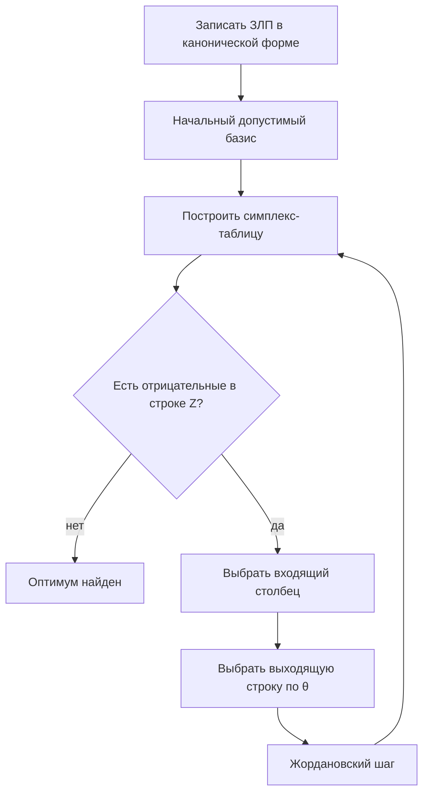

import SimplexStepTrainer from '@site/src/components/SimplexStepTrainer';

# Симплекс-метод и симплекс-таблицы

<div class="article-tags">
  <span class="tag tag-required">ОБЯЗАТЕЛЬНО</span>
  <span class="tag tag-beginner">ДЛЯ НОВИЧКОВ</span>
  <span class="tag tag-inprogress">В РАЗРАБОТКЕ</span>
</div>

<span class="complexity-badge">Архитектору</span>
<span class="complexity-badge">Инженеру</span>

## Что именно вы освоите в этой главе

Это центральная техническая статья раздела — здесь формируется навык системного чтения симплекс-таблицы вместе с механикой пересчёта строк. После неё вы видите в таблице текущий план, направление улучшения цели и причину остановки на оптимуме.

Отдельный акцент сделан на дисциплине вычислений — выбор входящего столбца, правило `theta`, контроль знаков в строке `Z`, интерпретация вырожденности и неограниченности. На практике именно в этих местах чаще всего появляются ошибки даже у тех, кто "вроде понял" общий алгоритм.

Подход к чтению — идите медленно, но проговаривайте каждый шаг словами "что меняется в плане и почему". Это намного ценнее, чем быстро пройти формулы.

**Симплекс-метод** (Данциг) — стандартный способ решения ЗЛП — переход от **вершины к вершине** допустимого многогранника с улучшением целевой функции, пока улучшение возможно. На практике вычисления ведут в **симплекс-таблице** — компактной записи системы ограничений и цели после [приведения Жорданом](/encyclopedia/3-data-markup/3-12-matematicheskoe-programmirovanie/3).

Геометрическая картина — в [статье 2](/encyclopedia/3-data-markup/3-12-matematicheskoe-programmirovanie/2); здесь — **алгебра и дисциплина заполнения**.

---

## Интерактив — тренажёр одного шага симплекса

Потренируйте выбор входящей и выходящей переменной до ручного расчёта полной таблицы.

Как проходить тренажёр правильно —
1. Сначала выберите входящий столбец по правилу наибольшей положительной оценки (`delta`) для `max`.
2. Затем посчитайте `theta = RHS / a` только для строк, где `a > 0`.
3. Выберите строку с минимальным положительным `theta` как выходящую.
4. Сверьтесь с подсказкой только после собственной попытки.

<SimplexStepTrainer />

После тренажёра проверьте, что можете объяснить вслух —
- почему в `theta`-тест входят только строки с положительным коэффициентом входящего столбца;
- почему минимальный `theta` сохраняет допустимость плана;
- почему ошибка на шаге выбора столбца/строки ломает все следующие итерации.

Если здесь уверенно, переход к полной симплекс-таблице дальше по статье будет заметно проще.

---

## Словарь симплекс-таблицы простыми словами

| Термин | Объяснение |
| --- | --- |
| **Базис** | `m` переменных (по числу ограничений), которые сейчас "выражены" через остальные; в столбцах базиса — единичная матрица |
| **Небазисные** | переменные, которые временно считают **нулевыми** в текущем плане (пока не войдут в базис) |
| **Опорный план** | значения базисных переменных из RHS при нулевых небазисных |
| **Входящая** | небазисная переменная, которую **увеличивают**, чтобы улучшить `Z` |
| **Выходящая** | базисная, которую **выводят**, чтобы не нарушить `≥ 0` (правило `θ`) |
| **Приведённая стоимость** | коэффициент в строке `Z` при небазисной переменной — "выгода" от ввода 1 единицы |

**Старт "нулевого плана"** — если все ограничения `≤` с slack, положите `x₁=x₂=…=0`, а slack равны `b` — это допустимая вершина в начале координат по продуктам.

---

## Общая схема алгоритма



**Входящая переменная** — та, что **улучшит** `Z` (в строке цели отрицательный коэффициент при `max` в классической записи).

**Выходящая строка** — та, где **минимальное положительное** отношение `θ = RHS / положительный коэффициент входящего столбца`.

**Интуиция θ** — увеличиваем `x₁` с нуля. В строке `s₁: 2x₁ + … = 8` slack `s₁` уменьшается — при `x₁=4` станет `s₁=0` — ресурс исчерпан. В строке `s₂` предел `x₁=8`. Берём **меньший** положительный предел (4), иначе какая-то базисная переменная уйдёт в минус — план станет недопустимым.

---

## Стандартная симплекс-таблица (полная форма)

Строки — ограничения + **строка цели** `Z`.

Столбцы — все переменные `x₁…xₙ, s₁…` + столбец **RHS** (правые части).

В **базисных** столбцах — единичная подматрица `m×m`.

**Строка Z** для задачи `max Z = cᵀx` часто записывают так, чтобы **оптимум** соответствовал **отсутствию отрицательных** коэффициентов в строке `Z` (зависит от учебника — иногда пишут `Z − cᵀx = 0`, тогда знаки в строке Z инвертируются — **зафиксируйте одну конвенцию** и не смешивайте).

Ниже используем форму — внизу строка **`−Z + 3x₁ + 2x₂ = 0`**, приведённая к выражению через **небазисные**; в оптимуме в строке Z все коэффициенты при небазисных **≥ 0** для `max`.

---

### Как получить строку Z (не пропускайте этот шаг)

Исходно — `Z = 3x₁ + 2x₂`, переносим влево — **`−Z + 3x₁ + 2x₂ = 0`**.

Базисные переменные (например `s₁`, `s₂`) выражаются из ограничений и **подставляются** в эту строку, чтобы в ней остались только **небазисные** `x₁, x₂` (и slack вне базиса). На старте `s₁`, `s₂` в базисе → в строке Z коэффициенты при `x₁, x₂` остаются **3** и **2** — именно они показывают выгоду от ввода продукции в план.

После каждой итерации строку Z **пересчитывают** жордановским исключением вместе с остальными строками — так коэффициенты становятся **приведёнными стоимостями** (насколько изменится `Z`, если небазисная переменная станет 1, а остальные базисные пересчитаются).

| Симптом в строке Z | Что обычно означает (max) |
| --- | --- |
| Положительный коэффициент при `xⱼ` | ввод `xⱼ` может **увеличить** `Z` |
| Все коэффициенты при небазисных `x` ≤ 0 | **оптимум** по продуктам |
| Отрицательный RHS в строке Z | текущее значение `Z` = минус RHS (см. таблицу 1: `−12` → `Z=12`) |

---

## Числовой пример (полный цикл)

```
max Z = 3x₁ + 2x₂

2x₁ +  x₂ + s₁ = 8
 x₁ + 2x₂ + s₂ = 8
x₁, x₂, s₁, s₂ ≥ 0
```

Старт — базис `{s₁, s₂}`, план `x₁=x₂=0`, `s₁=8`, `s₂=8`, `Z=0`.

### Таблица 0

| Базис | x₁ | x₂ | s₁ | s₂ | RHS |
| --- | --- | --- | --- | --- | --- |
| s₁ | 2 | 1 | 1 | 0 | 8 |
| s₂ | 1 | 2 | 0 | 1 | 8 |
| **−Z** | **3** | **2** | 0 | 0 | 0 |

В строке `−Z` коэффициенты **3** и **2** положительны → при увеличении `x₁` или `x₂` можно **увеличить** `Z`.

**Входящий столбец** — `x₁` (больший коэффициент 3; при равенстве — по правилу учебника, часто "левее").

**θ-отношения** — 

| Строка | RHS / коэф. x₁ (если > 0) | Смысл |
| --- | --- | --- |
| s₁ | 8/2 = **4** | при `x₁>4` slack `s₁` станет отрицательным |
| s₂ | 8/1 = 8 | при `x₁>8` slack `s₂` станет отрицательным |

**Выходящая** — `s₁` (минимум 4). **Входящая в базис** — `x₁`. После шага план: `x₁=4`, `x₂=0`, `s₁=0`, `s₂=4`, `Z=12` — совпадает с вершиной `A` на [графике](/encyclopedia/3-data-markup/3-12-matematicheskoe-programmirovanie/2).

### Таблица 1 (жордан по столбцу x₁)

**Жордановский шаг вручную (столбец `x₁`)** — 

1. **Ведущая строка** `s₁` — делим всю строку на `2` (ведущий элемент в столбце `x₁`).

   Было: `2x₁ + x₂ + s₁ = 8` → стало: `x₁ + ½x₂ + ½s₁ = 4`.

2. **Строка `s₂`** — было `x₁ + 2x₂ + s₂ = 8`. Вычитаем новую ведущую строку — `(x₁+2x₂+s₂) − (x₁+½x₂+½s₁) = 8−4` → `1½x₂ − ½s₁ + s₂ = 4`, то есть `3/2 x₂ − 1/2 s₁ + s₂ = 4` — как в таблице.

3. **Строка `−Z`** — было `−Z + 3x₁ + 2x₂ = 0`. Вычитаем `3×` (ведущая строка после шага 1) — коэффициент при `x₁` обнуляется, остаётся `½` при `x₂`, RHS `−12` → `Z=12`.

| Базис | x₁ | x₂ | s₁ | s₂ | RHS |
| --- | --- | --- | --- | --- | --- |
| x₁ | 1 | 1/2 | 1/2 | 0 | 4 |
| s₂ | 0 | 3/2 | −1/2 | 1 | 4 |
| **−Z** | 0 | **1/2** | −3/2 | 0 | −12 |

`Z = 12` при `x₁=4`, `x₂=0`.

В строке `−Z` ещё **положительный** коэффициент при `x₂` → входящий `x₂`.

**θ** — 

| x₂ | |
| --- | --- |
| x₁ | 4 / (1/2) = 8 |
| s₂ | 4 / (3/2) = **8/3** |

Выходящая `s₂`, входящая `x₂`.

### Таблица 2 (оптимальная)

| Базис | x₁ | x₂ | s₁ | s₂ | RHS |
| --- | --- | --- | --- | --- | --- |
| x₁ | 1 | 0 | 2/3 | −1/3 | 8/3 |
| x₂ | 0 | 1 | −1/3 | 2/3 | 8/3 |
| **−Z** | 0 | 0 | −4/3 | −1/3 | −40/3 |

В строке `−Z` нет положительных коэффициентов при `x₁, x₂` → **оптимум**.

**Ответ** — `x₁* = 8/3`, `x₂* = 8/3`, `Z* = 40/3` — совпадает с [графическим методом](/encyclopedia/3-data-markup/3-12-matematicheskoe-programmirovanie/2).

**Проверка slack** — подстановка `x₁* = x₂* = 8/3` в исходные равенства `2x₁+x₂+s₁=8` и `x₁+2x₂+s₂=8` даёт **`s₁* = s₂* = 0`**. Оба ограничения **активны** (ресурсы исчерпаны) — согласуется с положительными `y₁*`, `y₂*`.

### Чтение решения из таблицы

| Что ищем | Где в оптимальной таблице |
| --- | --- |
| Значения `xⱼ` | столбец **RHS** в строке, где `xⱼ` в базисе |
| Значения slack | RHS в строках `sᵢ` в базисе |
| `Z*` | минус коэффициент в RHS строки `−Z` (при нашей конвенции) |

### Двойственные переменные из последней таблицы

В оптимальной таблице 2 коэффициенты в строке `−Z` при **slack** `s₁`, `s₂` равны `−4/3` и `−1/3`. Для пары `max` / ограничения `≤` **оценки ресурсов** (двойственные переменные):

```
y₁* = 4/3,   y₂* = 1/3
```

Проверка [двойственной задачи](/encyclopedia/3-data-markup/3-12-matematicheskoe-programmirovanie/6) — `W* = 8·(4/3) + 8·(1/3) = 40/3 = Z*`. Экономический смысл — **маржинальная ценность** часа станка ≈ 1,33 у.е., склада сырья ≈ 0,33 у.е. в оптимальном плане.

---

## Правило выбора входящего столбца (max)

| Правило | Описание |
| --- | --- |
| **Dantzig** | максимальный положительный коэффициент в строке Z |
| **Бленд** | при вырожденности — переменная с меньшим индексом (избегает зацикливания) |

На экзамене обычно Dantzig; в ПО — устойчивые pivot-правила.

---

## Правило θ (выходящая строка)

```
θᵢ = bᵢ / aᵢⱼ   только если aᵢⱼ > 0
```

Выбирают строку с **минимальным** положительным `θ`. Если все `aᵢⱼ ≤ 0` — **Z не ограничена сверху** (для max).

---

## Сокращённая (ревизионная) симплекс-таблица

В **полной** таблице хранят все столбцы. В **сокращённой** форме —

- явно записывают только **небазисные** столбцы и RHS;
- базисные столбцы "подразумеваются" как единичные;
- экономия памяти — основа промышленных реализаций.

### Матричная запись (связь с [линейной алгеброй](/encyclopedia/3-data-markup/3-03-myslitelnaya-baza/34))

Ограничения в базисном виде — `Bx_B + Nx_N = b`, где `B` — матрица **базисных** столбцов, `N` — остальные. Тогда

```
x_B = B⁻¹b − B⁻¹N x_N
```

Подстановка в `Z = c_B x_B + c_N x_N` даёт строку Z только через **небазисные** `x_N` с коэффициентами **приведённой стоимости** `c̄_N = c_N − c_B B⁻¹N`.

**Ревизионный** симплекс не пересчитывает всю таблицу — хранит `B⁻¹` (или факторизацию) и обновляет его при смене базиса — одна **столбцовая** замена вместо полного Жордана по всей матрице.

| Форма | Когда удобна |
| --- | --- |
| Полная таблица | учёба, 2–4 переменные, контроль знаков |
| Ревизионная | десятки–тысячи переменных в солвере |
| Матрица `B⁻¹N` | понимание, откуда берутся коэффициенты в строке Z |

Для ручного счёта на 2–3 переменных полная таблица нагляднее; для 1000 переменных — только сокращённая/матричная форма в [коде](/encyclopedia/3-data-markup/3-12-matematicheskoe-programmirovanie/9).

---

## Контроль за правильностью заполнения

| № | Проверка |
| --- | --- |
| 1 | Число базисных переменных = числу строк ограничений |
| 2 | В каждом базисном столбце ровно одна **1**, остальные **0** |
| 3 | Все **RHS ≥ 0** (классический старт; иначе — [фаза 1 / M](/encyclopedia/3-data-markup/3-12-matematicheskoe-programmirovanie/5)) |
| 4 | Знак строки Z согласован с `max`/`min` |
| 5 | После итерации **Z не уменьшается** (для max) |
| 6 | Подстановка найденного `x` в **исходные** ограничения |

**Частые ошибки** — 

- выбрали θ по отрицательному или нулевому знаменателю;
- обнулили столбец не полностью (неполный Жордан);
- перепутали `max` и `min` в строке Z;
- забыли slack при переходе от `≤` к равенству.

---

## Вырожденность

Если какой-то **RHS = 0** в опорном плане, возможен **нулевой шаг** `θ = 0` — базис меняется, `Z` не улучшается. Теоретически возможно **зацикливание**; на практике — правило Бленда, perturbation.

**Микропример** — `max x₁ + x₂` при `x₁ ≤ 0`, `x₂ ≤ 1`, `x ≥ 0`. Вершина `(0,0)` с `x₁` в базисе с нулевым RHS — вырожденный старт; без правила Бленда таблица может "ходить по кругу". На экзамене при `θ=0` явно указывайте выходящую переменную по **индексу** (меньший номер).

---

## Когда симплекс "заканчивает"

- **Оптимальная таблица** — нет улучшения по правилу входящего столбца.
- **Неограниченность** — нет положительных знаменателей для θ.
- **Пустая область** — обнаруживается на фазе 1 или при построении начального плана.

---

## Интерпретация результата для реальной задачи

После получения оптимальной таблицы важно не остановиться на числах —

1. **План** — какие переменные положительны, а какие нулевые.
2. **Узкие места** — какие ограничения активны (slack = 0).
3. **Запасы** — где остался резерв ресурса (slack > 0).
4. **Цена ресурса** — каков экономический смысл двойственных оценок.
5. **Проверка устойчивости** — изменится ли базис при небольшом изменении коэффициентов.

Так симплекс превращается из "алгоритма для экзамена" в инструмент принятия решений.

---

## Мини-кейс для самостоятельной тренировки

Возьмите задачу станков и добавьте третье ограничение, например лимит по упаковке —

`x₁ + x₂ ≤ 5`

Проверьте, как меняются —
- оптимальная точка,
- активные ограничения,
- двойственные оценки ресурсов.

Этот эксперимент хорошо показывает, как один новый лимит может полностью сменить структуру оптимального плана.

---

## Связь с двойственностью

Последняя строка/столбец оптимальной таблицы даёт **двойственные оценки** ресурсов (shadow prices). Подробно — [статья 6](/encyclopedia/3-data-markup/3-12-matematicheskoe-programmirovanie/6).

---

## Что дальше

- Нет начального допустимого плана с единичным slack → [искусственный базис и M-метод](/encyclopedia/3-data-markup/3-12-matematicheskoe-programmirovanie/5).
- Особая структура "поставщики–потребители" → [транспортная задача](/encyclopedia/3-data-markup/3-12-matematicheskoe-programmirovanie/7).
- Решение без ручных таблиц → [статья 9](/encyclopedia/3-data-markup/3-12-matematicheskoe-programmirovanie/9).

---
