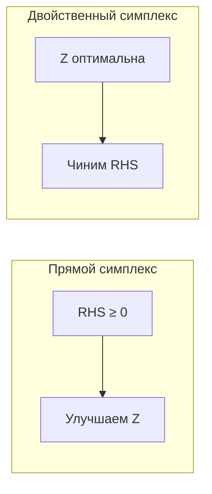

# Двойственность в линейном программировании

<div class="article-tags">
  <span class="tag tag-required">ОБЯЗАТЕЛЬНО</span>
  <span class="tag tag-inprogress">В РАЗРАБОТКЕ</span>
</div>

<span class="complexity-badge">Архитектору</span>
<span class="complexity-badge">Инженеру</span>

---

## Зачем инженеру двойственность вместе с прямой задачей

Двойственность в работе отвечает на управленческие вопросы — какие ресурсы дефицитны, где выгоднее расширять мощности и как оценивать чувствительность плана без полного пересчёта с нуля.

Эта глава переводит фокус с механики "получить оптимум" на аналитику "объяснить оптимум". Здесь появляется язык теневых цен и экономической интерпретации ограничений для отчётов, планирования и защиты решений перед бизнесом.

Если после чтения вы выписываете двойственную задачу и поясняете смысл `y*` в терминах ресурсов, цель главы выполнена.

У каждой задачи линейного программирования есть **парная двойственная** задача. Связь между ними объясняет "цены" ресурсов в оптимуме, условия оптимальности без перебора вершин и то, почему в последней **симплекс-таблице** ([статья 4](/encyclopedia/3-data-markup/3-12-matematicheskoe-programmirovanie/4)) появляются оценки ограничений.

---

## Двойственная задача - экономический смысл для новичка

| Вопрос | Ответ через двойственность |
| --- | --- |
| Сколько "стоит" ещё один час станка? | `y₁*` — маржинальная ценность 1-го ресурса в оптимуме |
| Можно ли улучшить план без пересчёта всей таблицы? | если приведённая стоимость продукта > 0 — ввод продукта ещё выгоден |
| Почему `Z*` из прямой = `W*` из двойственной? | **сильная двойственность** — два взгляда на одну и ту же оптимальную точку |

**Прямая** отвечает — "сколько произвести". **Двойственная** — "как оценить дефицит ресурсов", чтобы ни один продукт не был "занижен" относительно его коэффициента в цели.

---

## Прямая и двойственная задачи (схема)

Для **прямой** в форме максимизации —

```
max  Z = cᵀx
при  Ax ≤ b
     x ≥ 0
```

**Двойственная** (стандартная парная постановка) —

```
min  W = bᵀy
при  Aᵀy ≥ c
     y ≥ 0
```

`y` — вектор **двойственных переменных**, по одной на каждое ограничение прямой задачи.

| Прямая | Двойственная |
| --- | --- |
| переменные `xⱼ` (объёмы) | ограничения с `cⱼ` |
| ограничения `Ax ≤ b` (ресурсы) | переменные `yᵢ` (оценки ресурсов) |
| `max` | `min` |
| RHS `bᵢ` — запасы | коэффициенты цели `bᵢ` |

**Правило памяти** — "столбец прямой → строка двойственной", знаки неравенств **меняются** при переходе max↔min.

---

### Как получить двойственную из прямой (пошагово)

Для `max Z = cᵀx`, `Ax ≤ b`, `x ≥ 0` —

1. Введите по одной переменной `yᵢ ≥ 0` на каждое ограничение `i` (тип `≤` при max).
2. Цель двойственной — `min W = b₁y₁ + b₂y₂ + …` — коэффициенты `bᵢ` из **правых частей** прямой.
3. Для каждого `xⱼ` (столбец `A`) запишите неравенство — `a₁ⱼy₁ + a₂ⱼy₂ + … ≥ cⱼ` (знак `≥` при max в прямой).
4. Направление оптимизации — **min** у `W`, если прямая была **max**.

**Разбор первого двойственного ограничения** для продукта `x₁` (коэффициент в цели `c₁=3`) —

```
2y₁ + y₂ ≥ 3
```

Читается — "взвешенная цена ресурсов (2 единицы ресурса 1 + 1 единица ресурса 2) должна быть **не ниже** выгоды от единицы продукта A". В оптимуме часто выполняется **равенство** — продукт "на грани выгодности".

---

### Пример на задаче станков

Прямая ([введение](/encyclopedia/3-data-markup/3-12-matematicheskoe-programmirovanie/1)) —

```
max Z = 3x₁ + 2x₂
2x₁ +  x₂ ≤ 8
 x₁ + 2x₂ ≤ 8
x ≥ 0
```

Двойственная —

```
min W = 8y₁ + 8y₂
2y₁ +  y₂ ≥ 3
 y₁ + 2y₂ ≥ 2
y₁, y₂ ≥ 0
```

**Смысл `yᵢ`** — "сколько стоит" единица i-го ресурса в **оптимальном** плане (тень цены, shadow price). Если ресурс 1 полностью использован (`2x₁+x₂=8`), в оптимуме обычно `y₁ > 0`; если есть запас — часто `y₁ = 0`.

---

### Численное решение двойственной (из симплекса)

Оптимум прямой ([симплекс](/encyclopedia/3-data-markup/3-12-matematicheskoe-programmirovanie/4)) — `Z* = 40/3`, `x₁* = x₂* = 8/3`, **`s₁* = s₂* = 0`** (оба ресурса на пределе).

**Двойственные оценки** (из строки `−Z` оптимальной таблицы при slack в небазисе) —

```
y₁* = 4/3,   y₂* = 1/3
```

Проверка **сильной двойственности** — `W* = 8y₁* + 8y₂* = 64/3 + 8/3 = 40/3 = Z*`.

Проверка **двойственных неравенств** (должны выполняться с равенством в оптимуме) —

```
2y₁* + y₂* = 8/3 + 1/3 = 3  = c₁   ✓
 y₁* + 2y₂* = 4/3 + 2/3 = 2  = c₂   ✓
```

---

### Дополняющая нежёсткость на этом примере

| Переменная / ограничение | Значение в оптимуме | Следствие |
| --- | --- | --- |
| `s₁ = 0`, `s₂ = 0` | оба ресурса **исчерпаны** | оба ограничения активны → **`y₁* > 0`, `y₂* > 0`** |
| `x₁, x₂ > 0` | оба продукта в плане | оба двойственных ограничения по продуктам — **равенства** (`2y₁+y₂=3`, `y₁+2y₂=2`) |
| Если бы `s₁ > 0` | остаток по 1-му ресурсу | по дополняющей нежёсткости ожидали бы **`y₁* = 0`** |

Практический вывод для IT — если увеличить лимит **второго** ресурса на 1 единицу, в линейной модели прибыль вырастет примерно на `y₂* ≈ 0,33`; лимит **первого** — на `≈ 1,33` (пока базис не сменился).

---

## Принципы двойственности

### 1. Слабая двойственность

Если `x` допустима для прямой, `y` — для двойственной, то

```
cᵀx ≤ bᵀy   (для пары max/min)
```

**Прямое значение** не превосходит **двойственное** (для стандартной пары).

---

### 2. Сильная двойственность

Если **одна** из задач имеет **конечный** оптимум, то и вторая тоже, и

```
Z* = W*
```

Оптимальные значения **совпадают** — главный практический факт.

---

### 3. Дополняющая нежёсткость (идея)

В оптимуме —

- если `xⱼ > 0`, соответствующее двойственное ограничение — **равенство**;
- если ограничение прямой **неравно** как равенство (запас ресурса), соответствующая `yᵢ = 0`.

Это аналог "либо нагрузка, либо цена нуля" в экономике и "либо переменная, либо оценка" в алгоритме.

---

### 4. Несовместность и неограниченность

| Прямая | Двойственная |
| --- | --- |
| неограничена (max → ∞) | несовместна |
| несовместна | неограничена или несовместна (в зависимости от формы) |

---

## Экономическая интерпретация

**Прямая** — "сколько произвести продуктов, чтобы максимизировать выручку при лимитах ресурсов".

**Двойственная** — "какие **внутренние цены** ресурсов минимизируют **оценку** плана, не занижая "ценность" каждого продукта".

В IT-аналогии — `yᵢ` — **маржинальная ценность** ещё одной единицы CPU-часа или ГБ RAM в узком месте кластера.

---

## Двойственность и симплекс-таблица

В **оптимальной** симплекс-таблице прямой задачи (max, форма `≤`, строка `−Z + cᵀx = 0`) —

| Где смотреть | Что получаем |
| --- | --- |
| Коэффициент в строке `−Z` при **slack** `sᵢ` (не в базисе) | `yᵢ* = −(коэффициент)` при нашей конвенции (в примере: `−(−4/3) = 4/3`) |
| Коэффициент при **небазисном** `xⱼ` | приведённая стоимость — если **> 0**, ввод `xⱼ` ещё улучшит `Z` |
| **RHS** строки `−Z` | `−Z*` (оптимальное значение с обратным знаком) |

Поэтому после ручного симплекса можно **прочитать двойственное решение** из последней таблицы — без отдельного решения двойственной задачи.

---

## Двойственный симплекс-метод

**Прямой** симплекс на каждом шаге держит **допустимый** план (`RHS ≥ 0`) и улучшает цель. **Двойственный** симплекс стартует с таблицы, где **строка цели уже «оптимальна»** (для `max` — нет улучшения по небазисным в вашей конвенции), но **правая часть** одной или нескольких строк **отрицательна** — план недопустим.

Типичные ситуации —

- после **изменения запасов** `bᵢ` в уже решённой задаче;
- завершение **двухфазного** метода, когда фаза 1 вывела искусственные переменные, а RHS ещё нужно поправить;
- чувствительный анализ — «что если лимит ресурса ужесточили на Δ единиц».

<div class="callout callout--info">
  <div class="callout-title">Связь с двойственностью</div>

  <div class="callout-body">
  Двойственная допустимость (правильные знаки в строке <code>Z</code>) сохраняется на каждом шаге; восстанавливается <strong>прямая</strong> допустимость (неотрицательный <code>RHS</code>). Отсюда название метода.
</div>
  </div>


### Когда применять и когда нет

| Ситуация | Двойственный симплекс | Прямой симплекс / фаза 1 |
| --- | --- | --- |
| Оптимальная `Z`-строка, есть `RHS < 0` | **да** | прямой не стартует |
| `RHS ≥ 0`, в `Z` есть улучшение | нет | **да** |
| Нет ни допустимого, ни «оптимального» `Z` | сначала довести `Z` (этап 1 в учебниках) или [фаза 1](/encyclopedia/3-data-markup/3-12-matematicheskoe-programmirovanie/5) | |
| Задача несовместна | алгоритм сигнализирует (нет положительного pivot) | то же на фазе 1 |

---

### Два этапа

Алгоритм разбит на **два этапа** — сначала приводят строку `Z` к виду «как в оптимуме», затем выправляют столбец свободных членов.

**Этап 1 — двойственная допустимость (строка `Z`)**

Для задачи **минимизации** (как в классических симплекс-таблицах) —

1. Если все коэффициенты в `Z`-строке **неотрицательны** → переход к этапу 2.
2. Иначе выбирают столбец с **отрицательным** коэффициентом в `Z`.
3. В этом столбце ищут **отрицательный** элемент ограничения → **разрешающая строка**. Если отрицательных нет → **решений нет**.
4. Считают **двойственные отношения** — отношения элементов `Z`-строки к элементам разрешающей строки (только там, где знаменатель подходит по принятой конвенции); **минимум** задаёт входящий столбец.
5. Один шаг [Жордана](/encyclopedia/3-data-markup/3-12-matematicheskoe-programmirovanie/3) → повтор с п. 1.

Для **максимизации** в нашей конвенции (`−Z + cᵀx = 0`) этап 1 часто **уже выполнен** в оптимальной таблице прямой задачи — тогда сразу работают этапом 2.

**Этап 2 — прямая допустимость (столбец `RHS`)**

1. Если все `RHS ≥ 0` → **оптимум** (при уже «хорошей» `Z`-строке).
2. Иначе выбирают строку с **наименьшим** (самым отрицательным) `RHS` — **разрешающая строка**.
3. В этой строке ищут **разрешающий столбец** по **наименьшему двойственному отношению** (отношения элементов `Z`-строки к **положительным** элементам разрешающей строки). Если положительных нет → задача **неограничена** / несовместна в постановке `min`.
4. Жордановский шаг → снова п. 1 этапа 2.

<div class="callout callout--tip">
  <div class="callout-title">Замена max ↔ min</div>

  <div class="callout-body">
  Чтобы искать <strong>максимум</strong> двойственным симплексом в стандартной таблице, переходят к <code>min (−Z)</code> и берут ответ с обратным знаком из свободного члена <code>F</code>-строки — так же, как при сведении <code>min</code> к <code>max</code> в <a href="/encyclopedia/3-data-markup/3-12-matematicheskoe-programmirovanie/1">постановке</a>.
</div>
  </div>


---

### Мини-пример (логика этапа 2)

Задача уже решена [симплексом](/encyclopedia/3-data-markup/3-12-matematicheskoe-programmirovanie/4): `Z* = 40/3`, оба ресурса на пределе. Руководство **уменьшает** второй лимит с 8 до 5 — в таблице появляется строка с `RHS = −1` (план формально недопустим), а коэффициенты в `Z`-строке остаются как в оптимуме.

**Действия** —

1. Выходящая строка — с отрицательным `RHS`.
2. Входящий столбец — по минимальному двойственному отношению среди положительных коэффициентов в этой строке (часто «возвращается» slack или продукт, который ослабит нарушение).
3. После одного–двух жордановых шагов `RHS` снова неотрицателен → новый `Z*` без полного пересчёта с нуля.

Численные таблицы для тренировки — в типовых задачах на двойственный симплекс; здесь важна **схема**: сохраняем «оптимальность» строки цели, чиним запасы.

---

### Сравнение с прямым симплексом



| | Прямой | Двойственный |
| --- | --- | --- |
| Что сохраняем | допустимость `x` | «оптимальность» `Z`-строки |
| Что чиним | значение цели | отрицательные `RHS` |
| Типичный старт | slack-базис | оптимальная таблица после Δ`b` |

---

## Постановка двойственной "по строкам" (шпаргалка)

Для каждого ограничения прямой —

| Прямое (max) | Двойственное (min) |
| --- | --- |
| `≤ bᵢ` | переменная `yᵢ ≥ 0` |
| `= bᵢ` | `yᵢ` **свободная** (любой знак) |
| `≥ bᵢ` | `yᵢ ≤ 0` |

Для каждой переменной прямой —

| Прямая | Двойственное |
| --- | --- |
| `xⱼ ≥ 0` | j-е ограничение: `≥ cⱼ` |
| `xⱼ` свободная | j-е ограничение: `= cⱼ` |
| `xⱼ ≤ 0` | j-е ограничение: `≤ cⱼ` |

На экзамене выписывают двойственную **механически**, затем проверяют размерность — число `y` = число ограничений прямой.

---

## Двойственность в ЛП - связь прямой и двойственной задачи

| Применение | Пояснение |
| --- | --- |
| **Чувствительность** | как меняется `Z*`, если ослабить одно ограничение (Δb) |
| **Верификация** | нижняя/верхняя оценка оптимума из допустимых `x` и `y` |
| **Алгоритмы** | двойственный симплекс (старт с "почти оптимальной" таблицы) |
| **Транспортная** | [метод потенциалов](/encyclopedia/3-data-markup/3-12-matematicheskoe-programmirovanie/7) — двойственные `uᵢ`, `vⱼ` |

---

## Чувствительность — как читать изменения ресурсов

Если базис не меняется, двойственная оценка `yᵢ*` даёт линейное приближение —

`ΔZ ≈ yᵢ* · Δbᵢ`

Это очень полезно в планировании —
- оценить, стоит ли "покупать" дополнительный ресурс;
- понять, какой лимит является настоящим bottleneck;
- быстро приоритизировать инвестиции без полного пересчёта десятков сценариев.

<div class="callout callout--tip">
  <div class="callout-title">Важно</div>

  <div class="callout-body">
  При больших изменениях `b` базис может смениться, и линейная оценка перестанет быть точной. Тогда модель нужно решать заново.
</div>
  </div>


---

## Быстрый алгоритм проверки пары (x, y)

1. Проверить допустимость `x` в прямой.
2. Проверить допустимость `y` в двойственной.
3. Сравнить `cᵀx` и `bᵀy` (слабая двойственность).
4. Если значения равны, а обе точки допустимы - это оптимум.

---

## Связь с транспортной задачей

Транспортная ЗЛП — **разреженная** структура `A`. Двойственные переменные разбивают на **потенциалы поставщиков** `uᵢ` и **потребителей** `vⱼ`; условие оптимальности `uᵢ + vⱼ ≤ cᵢⱼ` — прямое следствие двойственности.

Дальше — [транспортная задача](/encyclopedia/3-data-markup/3-12-matematicheskoe-programmirovanie/7).

---
