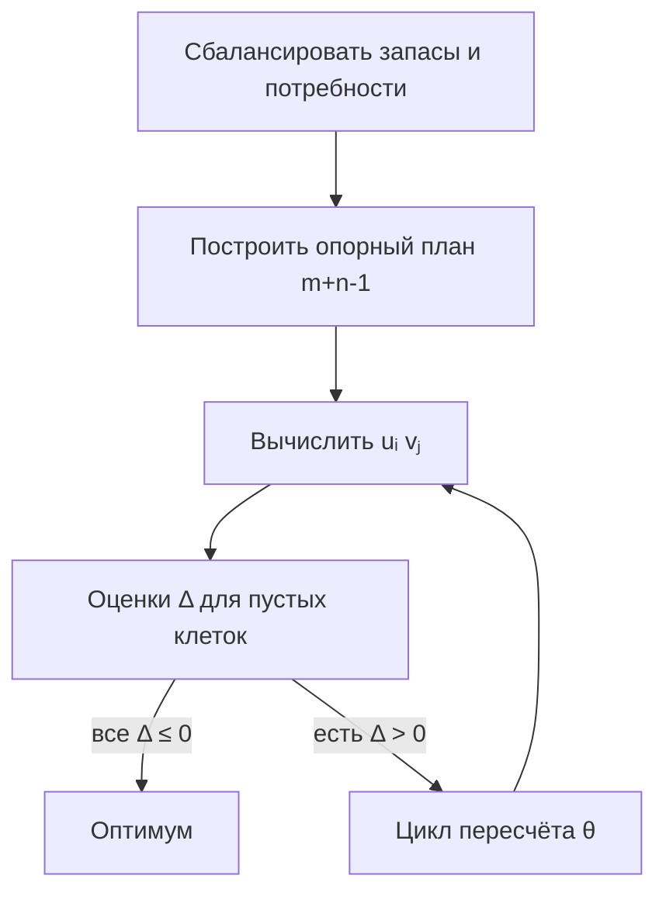

# Транспортная задача

<div class="article-tags">
  <span class="tag tag-required">ОБЯЗАТЕЛЬНО</span>
  <span class="tag tag-inprogress">В РАЗРАБОТКЕ</span>
</div>

<span class="complexity-badge">Архитектору</span>
<span class="complexity-badge">Инженеру</span>

---

Транспортная задача — это классическая задача линейного программирования, в которой требуется определить оптимальный план перевозок однородного груза от нескольких поставщиков с известными запасами к нескольким потребителям с известными потребностями таким образом, чтобы минимизировать суммарные транспортные расходы при условии, что все запасы вывозятся, все потребности удовлетворяются, а стоимость перевозки единицы груза между каждой парой поставщик-потребитель задана заранее; эта задача выделяется своей специфической структурой, позволяющей решать её не общим симплекс-методом, а более эффективными специализированными алгоритмами, и она является краеугольным камнем транспортной логистики и планирования цепочек поставок.

Транспортная модель — это математическая абстракция, описывающая систему перемещения материальных потоков между узлами сети, где запасы, потребности и транспортные тарифы выступают в качестве параметров, а объёмы перевозок — в качестве переменных решения; модель может быть сбалансированной, когда суммарные запасы равны суммарным потребностям, или несбалансированной, что требует введения фиктивных поставщиков или потребителей для приведения к закрытому виду, и она допускает разнообразные обобщения, включая учёт транзитных пунктов, ограничений на пропускную способность маршрутов и временных окон, что делает её гибким инструментом для широкого круга распределительных задач.

Поставщик — это один из узлов транспортной сети, который располагает определённым количеством однородного груза, подлежащего отправке потребителям, причём каждый поставщик характеризуется своим объёмом запаса и множеством транспортных тарифов до каждого из потребителей; в математической модели поставщики соответствуют строкам транспортной таблицы, и их запасы фигурируют в правых частях ограничений, гарантирующих, что сумма отправленных от данного поставщика единиц груза не превысит его имеющихся ресурсов, а в сбалансированной задаче эти ресурсы должны быть полностью распределены.

Потребитель — это узел транспортной сети, который имеет заданную потребность в грузе, поступающем от поставщиков, причём каждый потребитель характеризуется своей величиной спроса, которая должна быть полностью удовлетворена в результате распределения; потребители соответствуют столбцам транспортной таблицы, и их потребности фигурируют в ограничениях, требующих, чтобы сумма полученных данным потребителем единиц груза в точности равнялась его запросу, причём если задача несбалансирована и потребности превышают запасы, то требуется либо вводить фиктивного поставщика, либо переформулировать модель с учётом дефицита.

Логистика — это междисциплинарная область управления, охватывающая планирование, организацию, контроль и оптимизацию физического перемещения материальных, информационных и финансовых потоков от точек происхождения до точек потребления с целью удовлетворения требований клиентов при минимальных совокупных затратах; в контексте транспортной задачи логистика фокусируется на выборе наиболее эффективных маршрутов, распределении объёмов между поставщиками и потребителями, управлении складскими запасами и синхронизации поставок, причём математические модели, подобные транспортной, служат количественным фундаментом для принятия логистических решений в условиях ограниченных ресурсов и изменчивого спроса.

Транспортная модель — один из лучших примеров того, как теория ЗЛП превращается в прикладной инструмент. Она одновременно достаточно простая для ручного счёта и достаточно "жизненная", чтобы напрямую ложиться на логистику, распределение нагрузки, маршрутизацию и планирование каналов поставки.

Распределение нагрузки — это процесс назначения конкретных объёмов перевозок каждой паре поставщик-потребитель в соответствии с некоторым планом, который должен удовлетворять всем балансовым ограничениям по запасам и потребностям; в оптимальном решении распределение нагрузки должно минимизировать общие транспортные издержки, и оно визуализируется в виде матрицы перевозок, где каждая клетка содержит объём груза, направляемый по соответствующему маршруту, причём процесс распределения итеративно корректируется с помощью методов потенциалов и пересчёта по циклам до тех пор, пока не будет достигнут критерий оптимальности.

Маршрутизация — это более широкая задача, чем транспортная, поскольку она включает не только выбор объёмов перевозок между парами пунктов, но и определение последовательности посещения узлов транспортной сети, особенно когда речь идёт о развозке грузов одним транспортным средством по нескольким пунктам, что характерно для задач коммивояжёра и задач маршрутизации транспорта; в транспортной задаче маршрутизация упрощается до прямых поставок от поставщика к потребителю без промежуточных транзитов, но в реальных логистических системах эти задачи часто объединяются, создавая более сложные иерархические модели, где сначала решается транспортная задача для макроуровня, а затем маршрутизация для микроуровня доставки.

Планирование каналов поставки — это стратегическая задача определения долгосрочной структуры и потоков в цепочке поставок, включая выбор поставщиков, распределение мощностей, организацию складской сети и назначение постоянных маршрутов, причём транспортная модель является одним из ключевых инструментов на тактическом уровне такого планирования; оно требует учёта не только стоимостных, но и временных, качественных и рисковых факторов, а также гибкости для адаптации к изменениям спроса и сбоям, и поэтому часто строится как серия транспортных задач на различных временных горизонтах, которые затем интегрируются в общий корпоративный план логистики.

В этой главе вы осваиваете полный цикл — стартовый опорный план, диагностика вырожденности, потенциалы, оценки улучшений, пересчёт по циклу. Это уровень инженерной работы с моделью.

Диагностика вырожденности — это процедура выявления ситуации, когда в транспортной задаче число базисных клеток в допустимом плане оказывается меньше, чем m + n − 1, что происходит из-за того, что некоторые перевозки в базисных клетках принимают нулевые значения, и это создаёт потенциальные проблемы при вычислении потенциалов и построении циклов пересчёта; вырожденность требует искусственного введения нулевых базисных клеток с очень малыми фиктивными объёмами, чтобы сохранить возможность применения распределительного метода, и её диагностика важна для корректной работы алгоритмов, поскольку в противном случае можно столкнуться с невозможностью построить цикл или с зацикливанием в процессе оптимизации.

Потенциалы — это система вспомогательных чисел, сопоставляемых каждому поставщику и каждому потребителю в транспортной задаче, которые служат инструментом проверки оптимальности текущего плана перевозок, причём потенциалы определяются из условия, что для всех базисных клеток сумма потенциала поставщика и потенциала потребителя должна равняться транспортному тарифу в этой клетке; для свободных клеток вычисляются оценки улучшений как разность между фактическим тарифом и суммой соответствующих потенциалов, и если все такие оценки неотрицательны, то текущий план оптимален, а если находится отрицательная оценка, то это указывает на возможность улучшения через ввод соответствующей клетки в базис.

Оценки улучшений — это числовые показатели, вычисляемые для каждой свободной клетки транспортной таблицы на основе потенциалов, которые показывают, на сколько изменится суммарная стоимость перевозок, если ввести единицу груза в данную свободную клетку, соответствующим образом перераспределив объёмы по циклу; отрицательная оценка означает, что включение этой клетки в план приведёт к снижению общих затрат, и именно клетка с наименьшей отрицательной оценкой обычно выбирается для пересчёта, причём нулевые оценки указывают на наличие альтернативных оптимальных планов, а положительные оценки подтверждают, что данная клетка не должна использоваться в оптимальном решении.

Пересчёт по циклу — это итеративная процедура улучшения текущего допустимого плана в транспортной задаче, которая начинается с выбора свободной клетки с отрицательной оценкой, затем строится замкнутый цикл, состоящий из горизонтальных и вертикальных отрезков, проходящих через базисные клетки, и по этому циклу перераспределяются объёмы: в выбранную свободную клетку добавляется некоторое количество груза, а в угловых базисных клетках цикла это количество попеременно прибавляется и вычитается с сохранением всех балансов; величина добавки определяется минимальным объёмом в тех клетках цикла, где происходит вычитание, и после пересчёта одна из базисных клеток становится свободной, а новый план улучшает целевую функцию.

Читайте с карандашом — таблица здесь — рабочее поле вычислений.

**Транспортная задача** — частный, но очень важный случай ЗЛП — перевезти груз от **m поставщиков** к **n потребителям** с минимальными затратами `cᵢⱼ` за единицу. Таблица перевозок нагляднее симплекс-таблицы на десятки столбцов; для неё придуманы **опорный план**, **распределительный (пересчёт потенциалов)** и **метод потенциалов**.

Связь с [двойственностью](/encyclopedia/3-data-markup/3-12-matematicheskoe-programmirovanie/6) — потенциалы `uᵢ`, `vⱼ` — двойственные оценки.

---

## Жизненная постановка

Склад **A₁** хранит 20 т, склад **A₂** — 30 т. Магазины **B₁** и **B₂** заказали 30 и 20 т. В клетке `(i,j)` записана **стоимость перевозки 1 тонны** с поставщика `i` к потребителю `j`. Переменная `xᵢⱼ` — **сколько тонн** по этому маршруту. Нужно заполнить таблицу так, чтобы:

- со складов **уехало ровно** их запасы;
- магазины **получили ровно** заказы;
- сумма `cᵢⱼ xᵢⱼ` была **минимальной**.

Это та же логика, что "разложить задачи по серверам" или "назначить трафик по каналам" с линейными тарифами.

---

## Постановка

```
min  Z = Σᵢ Σⱼ cᵢⱼ xᵢⱼ

Σⱼ xᵢⱼ = aᵢ    (запас поставщика i)
Σᵢ xᵢⱼ = bⱼ    (потребность потребителя j)
xᵢⱼ ≥ 0
```

`aᵢ` — сколько **отправить** с i-го склада, `bⱼ` — сколько **получить** j-му клиенту.

---

### Баланс и разрешимость

**Теорема (необходимое условие).** Транспортная задача с равенствами "запас = отгрузка" и "потребность = получение" имеет допустимый план **только если**

```
Σᵢ aᵢ = Σⱼ bⱼ .
```

Если суммы не совпали, задача **несбалансированная** (открытая модель) — её приводят к сбалансированной **до** построения опорного плана.

**Проверка баланса** — в примере 2×2 сумма запасов `20+30=50`, сумма потребностей `30+20=50` — баланс есть.

**Разбор одной строки ограничения** — `Σⱼ xᵢⱼ = aᵢ` для поставщика 1 означает — `x₁₁ + x₁₂ = 20` — всё, что отправили с A₁ в B₁ и B₂, в сумме равно запасу A₁.

---

### Несбалансированная задача — пошагово

**Случай 1 — запас больше спроса** (`Σaᵢ > Σbⱼ`)

1. Вычислить разницу `D = Σaᵢ − Σbⱼ`.
2. Добавить **фиктивного потребителя** `Bф` с потребностью `bф = D`.
3. Тарифы `cᵢ,ф = 0` для всех поставщиков — груз в эту "клетку" означает **остаток на складе**.
4. Решить сбалансированную задачу обычными методами.
5. В ответе: реальные потребители получают свои заказы; у поставщика `i` остаток = `xᵢ,ф`.

**Случай 2 — спрос больше запаса** (`Σbⱼ > Σaᵢ`)

1. `D = Σbⱼ − Σaᵢ`.
2. Добавить **фиктивного поставщика** `Aф` с запасом `aф = D`.
3. Тарифы `cф,ⱼ = 0` — недопоставка в клетку `(ф, j)` означает **невыполненный** заказ `j` (в логистике иногда вместо 0 ставят штраф `M`).

**Числовой скетч (случай 1).** Два склада: `a₁=30`, `a₂=25` (всего 55). Два магазина: `b₁=20`, `b₂=30` (всего 50). Добавляем `B₃` (фиктивный) с `b₃=5`, стоимости в столбец 3 равны 0. После оптимизации сумма `x₁₃+x₂₃` — это **5 единиц**, которые никуда не уехали (остались у поставщиков).

<div class="callout callout--tip">
  <div class="callout-title">IT-аналог</div>

  <div class="callout-body">
  Фиктивный потребитель с нулевым тарифом — "неиспользованный резерв" мощности CDN

  фиктивный поставщик — неудовлетворённый спрос региона, если суммарная ёмкость кластера меньше заявок.
</div>
  </div>


---

### Приоритеты при дефиците (идея 10.10)

Если спрос **превышает** запас и потребители **не равнозначны**, нулевой тариф фиктивного поставщика для всех столбцов даёт "обрезание" заказов без различий. На практике —

- вводят **штрафы** `cф,ⱼ` — чем важнее клиент, тем **больше** штраф за недопоставку (меньше хотят оставлять клетку `(ф, j)` в плане);
- или решают **последовательно** — сначала закрывают заявки приоритетного потребителя в урезанной таблице, затем остальных.

В учебных задачах штрафы часто задают явно: "фиктивная перевозка к `B₂` стоит 100, к `B₁` — 0" → в оптимуме недобор сначала у менее приоритетного.

---

## Таблица перевозок

Строки — поставщики, столбцы — потребители, в клетке `(i,j)` пишут **стоимость** `cᵢⱼ` и **план** `xᵢⱼ`.

**Опорный план** — допустимое решение с **ровно `m + n − 1`** положительными (или базисными) клетками (при невырожденности). Меньше — **вырожденный** план (нужна ε-клетка); больше — циклы пересчёта неоднозначны.

---

## Начальный опорный план

### Метод северо-западного угла

Метод северо-западного угла — это простейший эвристический алгоритм построения начального допустимого плана в транспортной задаче, при котором заполнение таблицы начинается с левой верхней клетки, и последовательно распределяются запасы поставщиков и потребности потребителей, двигаясь вправо и вниз, пока все запасы и потребности не будут исчерпаны; этот метод крайне прост в реализации и не требует никаких расчётов тарифов, но он полностью игнорирует информацию о стоимости перевозок, поэтому получаемый план обычно далёк от оптимального и требует значительного числа последующих итераций пересчёта, что делает его пригодным лишь для грубой начальной оценки или для задач с равномерными тарифами.

**Идея** — начать с клетки `(1,1)`, отгрузить `min(a₁, b₁)`, вычеркнуть исчерпанную строку или столбец, двигаться вправо или вниз.

**Плюс** — быстро, всегда даёт допустимый план. **Минус** — часто далёк от оптимума — много итераций потенциалов.

---

### Метод минимальной стоимости (жадный)

Метод минимальной стоимости (жадный) — это более содержательный алгоритм построения начального плана, который руководствуется принципом выбора на каждом шаге той клетки, где транспортный тариф является минимальным среди всех ещё не заполненных клеток, и назначения туда максимально возможного объёма перевозки, ограниченного остатками запаса и потребности; этот метод уже учитывает стоимостную информацию и, как правило, даёт план, близкий к оптимальному, существенно сокращая число итераций оптимизации, однако он не гарантирует глобальной оптимальности, поскольку жадная стратегия может блокировать более выгодные комбинации на поздних шагах, особенно в сложных таблицах с неравномерным распределением тарифов.

В каждом шаге выбирают клетку с **наименьшим** `cᵢⱼ` среди **оставшихся** (ещё не вычеркнутых) строк и столбцов, отгружают `min(остаток строки, остаток столбца)`, вычеркивают исчерпанную строку или столбец.

**Алгоритм словами** — 

1. Найти `min cᵢⱼ` по всем незачёркнутым клеткам.
2. Положить в эту клетку `min(aᵢ, bⱼ)`.
3. Уменьшить запас строки и потребность столбца; вычеркнуть нулевую строку/столбец.
4. Повторять, пока не отгружено всё.

| Метод | Качество старта | Сложность |
| --- | --- | --- |
| Северо-западный угол | часто далёк от оптимума | очень простой |
| Минимальная стоимость | обычно **ближе** к оптимуму, меньше итераций MODI | чуть дороже по поиску min |
| Vogel (штрафы) | часто даёт лучший старт | по двум минимумам в строке/столбце |

После **любого** опорного плана дальше одинаково — потенциалы → Δ → циклы.

---

### Метод Фогеля (аппроксимация Vogel)

Метод Фогеля (аппроксимация Vogel) — это наиболее мощный эвристический метод построения начального плана в транспортной задаче, который для каждой строки и каждого столбца вычисляет штраф как разность между двумя наименьшими тарифами в этой строке или столбце, после чего выбирается строка или столбец с максимальным штрафом, и в клетку с минимальным тарифом в этой строке или столбце помещается максимально возможная перевозка; этот метод учитывает не только абсолютные значения тарифов, но и их относительные различия, что позволяет избежать ситуаций, когда жадный выбор в дешёвой клетке вынуждает использовать очень дорогие альтернативы в будущем, и на практике метод Фогеля часто даёт план, очень близкий к оптимальному или даже совпадающий с ним, что делает его предпочтительным для ручных расчётов и для подготовки качественного старта в вычислительных алгоритмах.

**Штраф строки/столбца** — разность **двух наименьших** тарифов `cᵢⱼ` в этой строке (или столбце) среди ещё не вычёркнутых клеток.

**Алгоритм**

1. Для каждой активной строки и столбца посчитать штраф.
2. Выбрать строку или столбец с **максимальным** штрафом (при равенстве — где минимальный тариф меньше, или где отгрузка больше — по правилу методички).
3. В этой строке/столбце отгрузить клетку с **минимальным** `cᵢⱼ` на `min(остаток строки, остаток столбца)`.
4. Вычеркнуть исчерпанную строку или столбец.
5. Повторять, пока не заполнено `m+n−1` базисных клеток.

**Мини-пример 2×2** (те же `a`, `b`, что ниже). Штрафы строк —

- A₁: `min(2,1) → 2−1 = **1**`;
- A₂: `3−4` по двум клеткам → разность двух минимумов `3` и `4` даёт **1**.

Штрафы столбцов — B₁: `2−3=1`, B₂: `1−4` → сравнивают `2` и `1` → **1**. Максимальный штраф 1 — выбирают клетку с меньшим тарифом **(1,2)** (`c=1`), отгружают `min(20,20)=20`. Дальше закрывают строку A₁ и продолжают — стартовый план обычно **ближе к оптимуму**, чем северо-западный угол.

```text
АЛГОРИТМ МетодФогеля()
  пока есть незакрытые строки и столбцы
    для каждой строки i: штраф_i := (2-й мин c_ij) − (1-й мин c_ij)
    для каждого столбца j: штраф_j := аналогично
    выбрать (i*, j*) с max штрафом и min c_ij в этой линии
    x[i*,j*] := min(остаток строки, остаток столбца)
    вычеркнуть исчерпанную строку или столбец
  конец
КОНЕЦ
```

---

<span id="polnyj-razbor-2x2"></span>

### Полный разбор 2×2 — от опорного плана до оптимума

**data.** `a₁=20`, `a₂=30`; `b₁=30`, `b₂=20` (баланс 50). **Стоимости** `cᵢⱼ` —

| | B₁ | B₂ |
| --- | --- | --- |
| A₁ | 2 | **1** |
| A₂ | 3 | 4 |

**Цель** — `min Z = Σ cᵢⱼ xᵢⱼ`.

---

#### 1. Северо-западный угол

| | B₁ (30) | B₂ (20) | запас |
| --- | --- | --- | --- |
| **A₁ (20)** | 2, **20** | 1 | 0 |
| **A₂ (30)** | 3, **10** | 4, **20** | 0 |
| потребность | 0 | 0 | |

Проверка — строки 20 и 30; столбцы 30 и 20. Занятых клеток **3** = `2+2−1`.

Стоимость плана — `20·2 + 10·3 + 20·4 = 40 + 30 + 80 = **150**`.

---

#### 2. Потенциалы (u₁ = 0)

Для **занятых** клеток — `uᵢ + vⱼ = cᵢⱼ`.

| Клетка | Уравнение | Результат |
| --- | --- | --- |
| (1,1) | `u₁ + v₁ = 2` | `v₁ = 2` |
| (2,1) | `u₂ + v₁ = 3` | `u₂ = 1` |
| (2,2) | `u₂ + v₂ = 4` | `v₂ = 3` |

---

#### 3. Оценки свободных клеток

Только **(1,2)** пуста —

```
Δ₁₂ = c₁₂ − (u₁ + v₂) = 1 − (0 + 3) = −2
```

Для **минимизации** план оптимален, когда **все** `Δᵢⱼ ≥ 0` для пустых клеток. Здесь `Δ₁₂ = −2 < 0` → план **улучшаем**.

<div class="callout callout--info">
  <div class="callout-title">Знак оценки</div>

  <div class="callout-body">
  В разных учебниках пишут `Sᵢⱼ` или `Δᵢⱼ` с противоположным знаком. Зафиксируйте принятую конвенцию — в этом разделе <strong>отрицательная</strong> оценка у пустой клетки при <code>min</code> означает "вводим перевозку в эту клетку".
</div>
  </div>


---

#### 4. Цикл пересчёта и θ

**Входящая** клетка — (1,2). **Цикл** (знак "+" / "−" по углам) —

```
(1,2)  +   ← вводим
(1,1)  −   ← вычитаем
(2,1)  +   ← прибавляем
(2,2)  −   ← вычитаем
```

**θ** = минимум в "минус"-клетках — `min(x₁₁, x₂₂) = min(20, 20) = **20**`.

| Клетка | Было | ±θ | Стало |
| --- | --- | --- | --- |
| (1,1) | 20 | −20 | **0** (выходит из базиса) |
| (1,2) | 0 | +20 | **20** |
| (2,1) | 10 | +20 | **30** |
| (2,2) | 20 | −20 | **0** |

**Блокирование** — клетки (1,1) и (2,2) нулевые; в базисе оставляют **одну** ε-клетку (часто ту, что только что обнулилась при выходе, — по правилу методички), чтобы сохранить `m+n−1` занятых позиций для следующего расчёта потенциалов.

Новый план — **x₁₂=20, x₂₁=30** (и ε в одной из нулевых клеток при вырождении, если того требует соглашение).

Стоимость — `20·1 + 30·3 = **110** < 150`.

---

#### 5. Повторная проверка (оптимум)

Базис `{ (1,2), (2,1) }` (+ ε при необходимости). Снова `u₁=0` → `v₂=1`, `u₂=2`, `v₁=1`. Пустая (1,1) — `Δ = 2−1 = 1 ≥ 0`; пустая (2,2): `4−5 = −1` — если (2,2) вне базиса. Все оценки для **вводимых** пустых клеток неотрицательны → **оптимум** — везозить с A₁ только в B₂, с A₂ — в B₁.

<div class="callout callout--tip">
  <div class="callout-title">Практика</div>

  <div class="callout-body">
  Пройдите тот же алгоритм на сбалансированной таблице 3×3 — северо-западный угол → потенциалы → хотя бы одна итерация цикла. Ошибка в балансе строки/столбца на шаге 1 делает бессмысленными все Δ.
</div>
  </div>


---

## Метод потенциалов (MODI)

Используют для **проверки оптимальности** и улучшения плана без полного симплекса.

---

### Шаг 1. Потенциалы `uᵢ`, `vⱼ`

Для **занятых** клеток `(i,j)` (в опорном плане) —

```
uᵢ + vⱼ = cᵢⱼ
```

Система из `m+n−1` уравнений; одну переменную фиксируют, например `u₁ = 0`, остальные находят по цепочке.

**Интуиция потенциалов** — `uᵢ` — "скрытая надбавка" поставщика, `vⱼ` — потребителя; в занятой клетке их сумма должна совпасть с тарифом `cᵢⱼ`. Для **пустой** клетки считают `Δ = cᵢⱼ − (uᵢ + vⱼ)` — если при **минимизации** затрат `Δ < 0`, перевозка по этому маршруту **дешевле**, чем "оценивают" потенциалы — план можно улучшить.

---

### Шаг 2. Оценки свободных клеток

Для **пустой** клетки `(p,q)` —

```
Δₚᵧ = cₚᵧ − (uₚ + vᵧ)
```

| Знак Δ | Смысл |
| --- | --- |
| **Δ > 0** | ввод перевозки **увеличит** затраты → план не оптимален (для min) |
| **Δ ≥ 0** для всех пустых | план **оптимален** |

(Для задачи **минимизации**; знаки согласуйте с вашей конвенцией цели.)

---

### Шаг 3. Улучшение (одна итерация)

1. Выбрать клетку с **наибольшим** `Δ > 0` (наихудшая).
2. Построить **цикл** пересчёта по занятым клеткам (замкнутый контур ± в углах таблицы).
3. Найти **θ** = минимум в "минус"-клетках цикла.
4. Прибавить/вычесть `θ` по циклу; одна клетка станет нулевой → **блокирование**.

---

## Преобразование опорного плана

Оптимальный план получают **цепочкой** опорных планов — каждый следующий не дороже предыдущего (для `min Z`).

**Цикл пересчёта** — замкнутый контур по клеткам таблицы —

- одна вершина в **свободной** клетке (туда вводим груз);
- остальные вершины в **занятых** клетках;
- звенья идут только по строкам и столбцам, без "диагональных скачков".

**Теорема 10.3.** Для каждой свободной клетки в невырожденном опорном плане существует **единственный** такой цикл.

**Сдвиг `λ` по циклу** —

1. Нумеруют клетки цикла, начиная со свободной (`+`).
2. В **чётных** клетках берут `λ = min` текущих поставок.
3. В свободную клетку **прибавляют** `λ`, по знакам `±` перераспределяют по циклу.
4. Делают шаг только если оценка `Δᵢⱼ < 0` (для `min`) — иначе затраты не уменьшатся.

Если при сдвиге обнуляются **несколько** клеток (вырождение), в базисе оставляют **одну** нулевую занятую клетку (часто с **большим** тарифом), остальные нули помечают как ε-поставки — иначе потеряется связность `m+n−1` клеток.

```text
АЛГОРИТМ УлучшитьОпорныйПлан()
  вычислить потенциалы и Δ для пустых клеток
  если все Δ ≥ 0 → оптимум
  выбрать пустую клетку с min Δ (наихудшая)
  построить единственный цикл через эту клетку
  λ := min поставок в "минус"-клетках цикла
  перераспределить ±λ по циклу
  при необходимости заблокировать выбывшую нулевую клетку
  повторить
КОНЕЦ
```

Это та же логика, что в [полном разборе 2×2](#polnyj-razbor-2x2) выше, в общем виде.

---

## Усложнённые постановки

На практике к классической транспортной модели добавляют ограничения. Частые приёмы —

| Ситуация | Модельный приём | IT-аналог |
| --- | --- | --- |
| **Запрещённый маршрут** `(i,j)` | тариф `cᵢⱼ := M` (очень большой) | канал недоступен, SLA запрещает пару регионов |
| **Пропускная способность** маршрута `≤ d` | разбить потребителя `j` на `j'` и `j''` — спрос `bⱼ−d` и `d`; в "лишней" клетке тариф `M` | лимит Mbps на линк |
| **Обязательная** поставка `xᵢⱼ ≥ p` | уменьшить `aᵢ`, `bⱼ`, зафиксировать `p` в клетке, досчитать остаток | контрактный минимум на маршруте |
| **Производство + доставка** | в `cᵢⱼ` включить себестоимость на складе `i` + перевозку | выбор дата-центра с учётом электричества и трафика |

**Запрет перевозки** — в методе потенциалов клетка с `cᵢⱼ = M` никогда не войдёт в улучшающий план, если есть альтернатива с нормальным тарифом.

**Ограничение "не больше d"** — логически "потребитель `j` принимает не более `d` с поставщика `i`", остальной спрос закрывают другие поставщики. После разбиения столбца задача снова **сбалансированная** транспортная ЗЛП.

<div class="callout callout--tip">
  <div class="callout-title">Солвер vs таблица</div>

  <div class="callout-body">
  В [коде](/encyclopedia/3-data-markup/3-12-matematicheskoe-programmirovanie/9) запреты задают ограничением `x_ij = 0` или верхней границей `x_ij ≤ d` — без искусственного тарифа `M`.

  Табличный `M` — учебный приём для ручного MODI.
</div>
  </div>


---

## Распределительный метод (пересчёт по циклу)

Старое название того же семейства алгоритмов — **перераспределить** `θ` единиц груза по циклу, пока оценки не станут неотрицательными.

**Блокирование поставок** — клетка, которая вышла из плана (`xᵢⱼ = 0`), помечается как **запрещённая** для ввода в этом шаге, если без неё возникает **вырождение** (меньше `m+n−1` занятых клеток). В методичках вводят **очень малое ε** в нулевую базисную клетку, чтобы сохранить связность опорного дерева.

| Ситуация | Действие |
| --- | --- |
| Две нулевые клетки в одной строке после пересчёта | оставить одну "базисной" с ε |
| Нельзя построить единственный цикл | проверить число занятых клеток |
| Δ = 0 в пустой клетке | **альтернативный** оптимум |

---

## Алгоритм "от опорного плана до оптимума"



---

## Связь с IT и логистикой

| Контекст | Модель |
| --- | --- |
| CDN / репликация | поставщики — источники, потребители — регионы |
| Назначение задач на воркеры | стоимость — время/деньги |
| Потоки в сети | обобщение транспортной (минимальная стоимость потока) |

Промышленные объёмы решают **сетевым симплексом** или LP-солверами ([статья 9](/encyclopedia/3-data-markup/3-12-matematicheskoe-programmirovanie/9)); ручной метод потенциалов нужен для **понимания** алгоритма.

---

## Типичные ошибки

- несбалансированная сумма `aᵢ` и `bⱼ`;
- забыли `u₁ = 0` (или другую фиксацию) — потенциалы "плывут";
- цикл пересчёта не замкнут через **только занятые** клетки;
- перепутали **min** и знак Δ.

---

## Практические нюансы для задач 3x3 и больше

В реальных таблицах чаще всего спотыкаются о дисциплину вычислений —

1. После каждого перераспределения сразу проверяйте балансы строк/столбцов.
2. Ведите отдельный список базисных клеток, чтобы не потерять `m+n−1`.
3. При нескольких одинаковых минимальных/максимальных оценках фиксируйте правило выбора (например, верхняя левая по индексу), иначе трудно воспроизвести решение.
4. Держите все промежуточные стоимости `Z` после каждой итерации - это быстрый контроль, что вы действительно улучшаете план.

---

## Мини-кейс для самостоятельной работы

Постройте задачу 3x3 с балансом, получите —
- начальный план методом северо-западного угла;
- улучшенный план методом минимальной стоимости;
- финальный план по потенциалам.

Сравните число итераций и итоговую стоимость для двух стартов. Это наглядно показывает, зачем выбирать более качественный начальный опорный план.

Дальше — [динамическое программирование](/encyclopedia/3-data-markup/3-12-matematicheskoe-programmirovanie/8).

---
