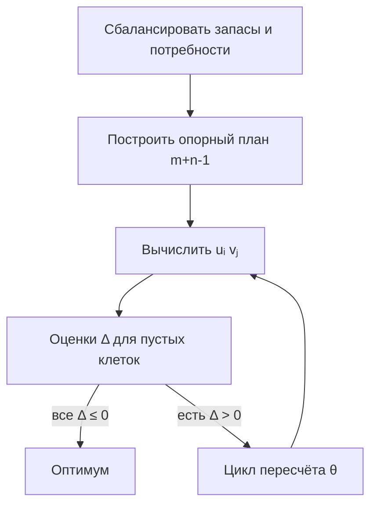

# Транспортная задача

<div class="article-tags">
  <span class="tag tag-required">ОБЯЗАТЕЛЬНО</span>
</div>

<span class="complexity-badge">Архитектору</span>
<span class="complexity-badge">Инженеру</span>

**Транспортная задача** — частный, но очень важный случай ЗЛП: перевезти груз от **m поставщиков** к **n потребителям** с минимальными затратами `cᵢⱼ` за единицу. Таблица перевозок нагляднее симплекс-таблицы на десятки столбцов; для неё придуманы **опорный план**, **распределительный (пересчёт потенциалов)** и **метод потенциалов**.

Связь с [двойственностью](/encyclopedia/3-data-markup/3-12-matematicheskoe-programmirovanie/6): потенциалы `uᵢ`, `vⱼ` — двойственные оценки.

## Жизненная постановка

Склад **A₁** хранит 20 т, склад **A₂** — 30 т. Магазины **B₁** и **B₂** заказали 30 и 20 т. В клетке `(i,j)` записана **стоимость перевозки 1 тонны** с поставщика `i` к потребителю `j`. Переменная `xᵢⱼ` — **сколько тонн** по этому маршруту. Нужно заполнить таблицу так, чтобы:

- со складов **уехало ровно** их запасы;
- магазины **получили ровно** заказы;
- сумма `cᵢⱼ xᵢⱼ` была **минимальной**.

Это та же логика, что «разложить задачи по серверам» или «назначить трафик по каналам» с линейными тарифами.

## Постановка

```
min  Z = Σᵢ Σⱼ cᵢⱼ xᵢⱼ

Σⱼ xᵢⱼ = aᵢ    (запас поставщика i)
Σᵢ xᵢⱼ = bⱼ    (потребность потребителя j)
xᵢⱼ ≥ 0
```

`aᵢ` — сколько **отправить** с i-го склада, `bⱼ` — сколько **получить** j-му клиенту.

### Баланс

Если `Σaᵢ ≠ Σbⱼ`, вводят **фиктивного** поставщика или потребителя с нулевыми `cᵢⱼ`, чтобы выровнять сумму. Иначе опорный план с `m+n−1` положительными клетками построить нельзя.

**Проверка баланса:** в примере 2×2 сумма запасов `20+30=50`, сумма потребностей `30+20=50` — баланс есть. Если бы запас был 55, а спрос 50 — добавили бы **фиктивного потребителя** с потребностью 5 и нулевой стоимостью (груз «остаётся» на складе).

**Разбор одной строки ограничения:** `Σⱼ xᵢⱼ = aᵢ` для поставщика 1 означает: `x₁₁ + x₁₂ = 20` — всё, что отправили с A₁ в B₁ и B₂, в сумме равно запасу A₁.

## Таблица перевозок

Строки — поставщики, столбцы — потребители, в клетке `(i,j)` пишут **стоимость** `cᵢⱼ` и **план** `xᵢⱼ`.

**Опорный план** — допустимое решение с **ровно `m + n − 1`** положительными (или базисными) клетками (при невырожденности). Меньше — **вырожденный** план (нужна ε-клетка); больше — циклы пересчёта неоднозначны.

## Начальный опорный план

### Метод северо-западного угла

**Идея:** начать с клетки `(1,1)`, отгрузить `min(a₁, b₁)`, вычеркнуть исчерпанную строку или столбец, двигаться вправо или вниз.

**Плюс:** быстро, всегда даёт допустимый план. **Минус:** часто далёк от оптимума — много итераций потенциалов.

### Метод минимальной стоимости (жадный)

В каждом шаге выбирают клетку с **наименьшим** `cᵢⱼ` среди **оставшихся** (ещё не вычеркнутых) строк и столбцов, отгружают `min(остаток строки, остаток столбца)`, вычеркивают исчерпанную строку или столбец.

**Алгоритм словами:**

1. Найти `min cᵢⱼ` по всем незачёркнутым клеткам.
2. Положить в эту клетку `min(aᵢ, bⱼ)`.
3. Уменьшить запас строки и потребность столбца; вычеркнуть нулевую строку/столбец.
4. Повторять, пока не отгружено всё.

| Метод | Качество старта | Сложность |
| --- | --- | --- |
| Северо-западный угол | часто далёк от оптимума | очень простой |
| Минимальная стоимость | обычно **ближе** к оптимуму, меньше итераций MODI | чуть дороже по поиску min |
| Vogel (штрафы) | ещё лучше на экзаменах | по двум минимумам в строке/столбце |

После **любого** опорного плана дальше одинаково: потенциалы → Δ → циклы.

### Полный разбор 2×2: от опорного плана до оптимума

**Данные.** `a₁=20`, `a₂=30`; `b₁=30`, `b₂=20` (баланс 50). **Стоимости** `cᵢⱼ`:

| | B₁ | B₂ |
| --- | --- | --- |
| A₁ | 2 | **1** |
| A₂ | 3 | 4 |

**Цель:** `min Z = Σ cᵢⱼ xᵢⱼ`.

#### 1. Северо-западный угол

| | B₁ (30) | B₂ (20) | запас |
| --- | --- | --- | --- |
| **A₁ (20)** | 2, **20** | 1 | 0 |
| **A₂ (30)** | 3, **10** | 4, **20** | 0 |
| потребность | 0 | 0 | |

Проверка: строки 20 и 30; столбцы 30 и 20. Занятых клеток **3** = `2+2−1`.

Стоимость плана: `20·2 + 10·3 + 20·4 = 40 + 30 + 80 = **150**`.

#### 2. Потенциалы (u₁ = 0)

Для **занятых** клеток: `uᵢ + vⱼ = cᵢⱼ`.

| Клетка | Уравнение | Результат |
| --- | --- | --- |
| (1,1) | `u₁ + v₁ = 2` | `v₁ = 2` |
| (2,1) | `u₂ + v₁ = 3` | `u₂ = 1` |
| (2,2) | `u₂ + v₂ = 4` | `v₂ = 3` |

#### 3. Оценки свободных клеток

Только **(1,2)** пуста:

```
Δ₁₂ = c₁₂ − (u₁ + v₂) = 1 − (0 + 3) = −2
```

Для **минимизации** план оптимален, когда **все** `Δᵢⱼ ≥ 0` для пустых клеток. Здесь `Δ₁₂ = −2 < 0` → план **улучшаем**.

<div class="callout callout--info">
  <div class="callout-title">Знак оценки</div>
  В разных учебниках пишут `Sᵢⱼ` или `Δᵢⱼ` с противоположным знаком. Зафиксируйте правило курса: у нас <strong>отрицательная</strong> оценка у пустой клетки при <code>min</code> означает «вводим перевозку в эту клетку».
</div>

#### 4. Цикл пересчёта и θ

**Входящая** клетка: (1,2). **Цикл** (знак «+» / «−» по углам):

```
(1,2)  +   ← вводим
(1,1)  −   ← вычитаем
(2,1)  +   ← прибавляем
(2,2)  −   ← вычитаем
```

**θ** = минимум в «минус»-клетках: `min(x₁₁, x₂₂) = min(20, 20) = **20**`.

| Клетка | Было | ±θ | Стало |
| --- | --- | --- | --- |
| (1,1) | 20 | −20 | **0** (выходит из базиса) |
| (1,2) | 0 | +20 | **20** |
| (2,1) | 10 | +20 | **30** |
| (2,2) | 20 | −20 | **0** |

**Блокирование:** клетки (1,1) и (2,2) нулевые; в базисе оставляют **одну** ε-клетку (часто ту, что только что обнулилась при выходе, — по правилу методички), чтобы сохранить `m+n−1` занятых позиций для следующего расчёта потенциалов.

Новый план: **x₁₂=20, x₂₁=30** (и ε в одной из нулевых, если требует преподаватель).

Стоимость: `20·1 + 30·3 = **110** < 150`.

#### 5. Повторная проверка (оптимум)

Базис `{ (1,2), (2,1) }` (+ ε при необходимости). Снова `u₁=0` → `v₂=1`, `u₂=2`, `v₁=1`. Пустая (1,1): `Δ = 2−1 = 1 ≥ 0`; пустая (2,2): `4−5 = −1` — если (2,2) вне базиса. Все оценки для **вводимых** пустых клеток неотрицательны → **оптимум**: везозить с A₁ только в B₂, с A₂ — в B₁.

<div class="callout callout--tip">
  <div class="callout-title">Практика</div>
  Пройдите тот же алгоритм на таблице 3×3 из учебника: северо-западный угол → потенциалы → хотя бы одна итерация цикла. Ошибка в балансе строки/столбца на шаге 1 делает бессмысленными все Δ.
</div>

## Метод потенциалов (MODI)

Используют для **проверки оптимальности** и улучшения плана без полного симплекса.

### Шаг 1. Потенциалы `uᵢ`, `vⱼ`

Для **занятых** клеток `(i,j)` (в опорном плане):

```
uᵢ + vⱼ = cᵢⱼ
```

Система из `m+n−1` уравнений; одну переменную фиксируют, например `u₁ = 0`, остальные находят по цепочке.

**Интуиция потенциалов:** `uᵢ` — «скрытая надбавка» поставщика, `vⱼ` — потребителя; в занятой клетке их сумма должна совпасть с тарифом `cᵢⱼ`. Для **пустой** клетки считают `Δ = cᵢⱼ − (uᵢ + vⱼ)`: если при **минимизации** затрат `Δ < 0`, перевозка по этому маршруту **дешевле**, чем «оценивают» потенциалы — план можно улучшить.

### Шаг 2. Оценки свободных клеток

Для **пустой** клетки `(p,q)`:

```
Δₚᵧ = cₚᵧ − (uₚ + vᵧ)
```

| Знак Δ | Смысл |
| --- | --- |
| **Δ > 0** | ввод перевозки **увеличит** затраты → план не оптимален (для min) |
| **Δ ≥ 0** для всех пустых | план **оптимален** |

(Для задачи **минимизации**; знаки согласуйте с вашей конвенцией цели.)

### Шаг 3. Улучшение (одна итерация)

1. Выбрать клетку с **наибольшим** `Δ > 0` (наихудшая).
2. Построить **цикл** пересчёта по занятым клеткам (замкнутый контур ± в углах таблицы).
3. Найти **θ** = минимум в «минус»-клетках цикла.
4. Прибавить/вычесть `θ` по циклу; одна клетка станет нулевой → **блокирование**.

## Распределительный метод (пересчёт по циклу)

Старое название того же семейства алгоритмов: **перераспределить** `θ` единиц груза по циклу, пока оценки не станут неотрицательными.

**Блокирование поставок:** клетка, которая вышла из плана (`xᵢⱼ = 0`), помечается как **запрещённая** для ввода в этом шаге, если без неё возникает **вырождение** (меньше `m+n−1` занятых клеток). В методичках вводят **очень малое ε** в нулевую базисную клетку, чтобы сохранить связность опорного дерева.

| Ситуация | Действие |
| --- | --- |
| Две нулевые клетки в одной строке после пересчёта | оставить одну «базисной» с ε |
| Нельзя построить единственный цикл | проверить число занятых клеток |
| Δ = 0 в пустой клетке | **альтернативный** оптимум |

## Алгоритм «от опорного плана до оптимума»



## Связь с IT и логистикой

| Контекст | Модель |
| --- | --- |
| CDN / репликация | поставщики — источники, потребители — регионы |
| Назначение задач на воркеры | стоимость — время/деньги |
| Потоки в сети | обобщение транспортной (минимальная стоимость потока) |

Промышленные объёмы решают **сетевым симплексом** или LP-солверами ([статья 9](/encyclopedia/3-data-markup/3-12-matematicheskoe-programmirovanie/9)); ручной метод потенциалов нужен для **понимания** и экзамена.

## Типичные ошибки

- несбалансированная сумма `aᵢ` и `bⱼ`;
- забыли `u₁ = 0` (или другую фиксацию) — потенциалы «плывут»;
- цикл пересчёта не замкнут через **только занятые** клетки;
- перепутали **min** и знак Δ.

Дальше: [динамическое программирование](/encyclopedia/3-data-markup/3-12-matematicheskoe-programmirovanie/8).

---
