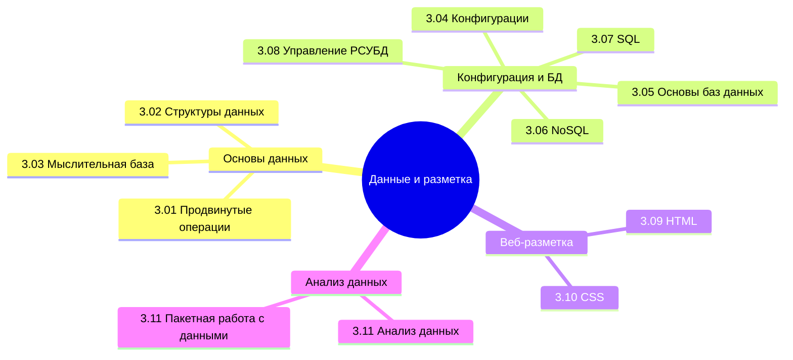

  ОБЯЗАТЕЛЬНО
  ДЛЯ НОВИЧКОВ
  В РАЗРАБОТКЕ

import DocCardList from '@theme/DocCardList';

---

## О разделе

<DocCardList />

Вы ещё не забыли, что такое информация и данные? А типы данных? Если забыли, непременно вернитесь и повторите. Сейчас нам придётся заняться ими вплотную.

---
