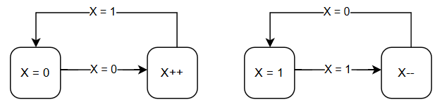
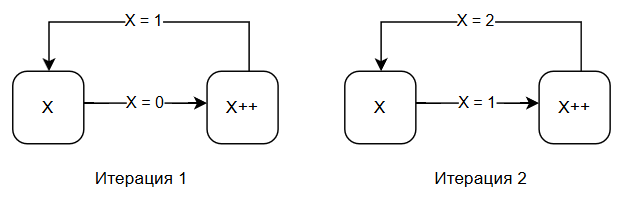
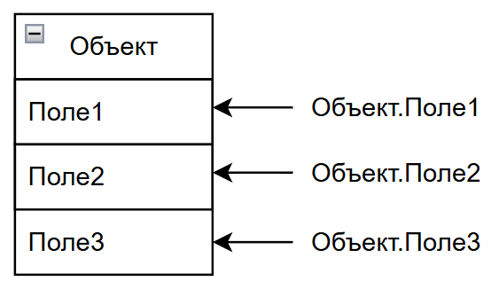

---
title: Продвинутые операции с данными
tags: [beginner, advanced, required, engineer, developer, architector]
---

# Продвинутые операции с данными

<div class="article-tags">
  <span class="tag tag-required">ОБЯЗАТЕЛЬНО</span>
  <span class="tag tag-beginner">ДЛЯ НОВИЧКОВ</span>
  <span class="tag tag-advanced">НЕ ДЛЯ НОВИЧКОВ</span>
  <span class="tag tag-inprogress">В РАЗРАБОТКЕ</span>
</div>
<span class="complexity-badge">Разработчику</span>
<span class="complexity-badge">Архитектору</span>
<span class="complexity-badge">Инженеру</span>

Мы уже рассматривали базовые операции с данными - ввод/вывод, чтение и запись, кэширование, копирование, перемещение, вырезание, вставка, удаление, очистка, создание, изменение.Базовые операции работают комплексно, независимо от типа данных. 
Также мы изучили типы данных, к примеру, булево значение, числа, строки, идентификаторы. Но что же можно делать с ними?

---

## Операции с данными

Операции с данными - это действия, которые можно выполнять над информацией, и они могут быть атомарными (простыми) или составными (сложными). Собственно, как и сами данные - это может быть запись в поле как набор данных одного типа, так и целая структура в виде таблицы. Но давайте потихоньку - сначала с операциями.

---

### Категории операций с данными

Основные категории:
	- CRUD-операции - создание (CREATE), чтение (READ), изменение (UPDATE), удаление (DELETE);
	- Ввод/вывод (I/O) - чтение из файла, сети, датчика, запись на диск, в базу и т.д.;
	- Копирование/перемещение - дублирование или транспортировка данных;
	- Поиск и фильтрация - поиск по значению, условию, шаблону;
	- Сортировка - упорядочивание данных;
	- Агрегация - суммирование, подсчёт, усреднение и т.п.;
	- Валидация - проверка корректности данных;
	- Шифрование/дешифрование - защита данных;
	- Сериализация/десериализация - преобразование объектов в поток байтов и обратно;
	- Кэширование - временное хранение для ускорения доступа;
	- Репликация/синхронизация - копирование между системами.

В обыкновенной речи люди используют лишь термины «запись/чтение», «передача» и «обработка». То есть, заказчику, к примеру, не так важно, что будет с данными, он ставит задачу в стиле «система должна получить и обработать данные», подразумевая, что будет целый комплекс мероприятий по проверке, сериализации/десериализации, валидации, парсингу, преобразованиям, с дальнейшим распределением, конвертированием, записью и прочим хозяйством. 

Давайте погрузимся - а что же можно делать с данными? Что за обработка?

---

## Преобразование

### Явное и неявное преобразование

Преобразование типов данных (Type Casting / Type Conversion) - это процесс смены типа данных одного значения на другой. К примеру, превращение строки «123» в число 123. Да, для системы это разные значения, и только динамически типизированные языки могут автоматически приводить один тип к другому.

Явное преобразование (explicit) подразумевает, что программист сам указывает преобразование:
```
int x = (int)3.14;
```
Неявное (implicit) подразумевает, что система делает это автоматически:
```
double d = 5; // int → double
```
К примеру, есть int (целое число) и float (с запятой, дробное), и можно их преобразовать, допустим 3 превратить в 3.0 и наоборот.
Другой пример - string (строка, текст) и int (целое число), как мы выше упоминали - «123» в 123, но в таком случае если строка будет «abc», то система не найдёт эквивалент в виде целого числа и выдаст ошибку. Думаю, это очевидно.

Boolean (булево, логическое true/false) в некоторых языках можно превратить в int (целое число), к примеру true = 1, а false = 0.
Важно понимать, что преобразования могут нести за собой риски и опасности, к примеру потеря точности при преобразовании float (дробного 3.9) в int (целое, 3), или переполнение (int превращается в byte, и если int будет больше 255, выйдет ошибка).

---

### Парсинг

На практике это очень часто, к примеру, когда у нас, как у программистов, будут исходные данные в виде сплошного текста, и задача будет подготовить обработку этих данных, чтобы система распределяла их по структурам. 

К примеру, из текста «Иван, 22 года, место рождения Москва», можно извлечь ценные данные - имя «Иван», возраст «22» и место рождения «Москва», и в коде придётся выполнять определенное чтение, преобразование и обработку.

Такая операция называется парсинг (parse, parsing) - процесс автоматизированного извлечения и структурирования данных. Парсить можно любые данные, разделяя и преобразуя в нужные для нас. Можно парсить веб-сайты, документы, базы данных и другие источники. Основная цель при этом - извлечь нужную информацию, отфильтровать её от лишней (в нашем случае убрать «, », « года, место рождения »), и преобразовать в удобный формат, и лишь после этого предоставить пользователю.

---

## Операции с числами

### Виды операций с числами

Числа, как мы понимаем, бывают целые (int, long), вещественные (float, double), комплексные (в математике), и большие числа (BigInteger, ОЧЕНЬ большие числа).

Соответственно, и операции с ними в первую очередь математические.

Виды операций с числами:
	- Арифметические: `+`, `-`, `*`, `/`, `%` (остаток), `**` (степень);
	- Сравнение: `==`, `!=`, `<`, `>`, `<=`, `>=`;
	- Инкремент/декремент: ++, --;
	- Побитовые (для целых): `&`, `|`, `^`, `~`, `<<`, `>>`;
	- Математические функции: `sqrt()`, `abs()`, `round()`, `floor()`, `ceil()`, `sin()`, `log()`;
	- Генерация случайных чисел.

Если вы знаете математику хотя бы на базовом уровне, то это должно легко пониматься. Если же нет, то кое-что мы попробуем подтянуть в главе с мыслительной базой, так что всё ещё впереди.
	- `+`, сложение - бинарная операция, сопоставляющая двум числам a и b их сумму `a+b`.
	- `-`, вычитание - операция, обратная сложению: `a-b=a+(-b)`.
	- `*`, умножение - бинарная операция, сопоставляющая числам a и b их произведение `a×b`.
	- `/`, деление - операция, обратная умножению.
	- `%`, остаток от деления, модуль - операция, возвращающая остаток при делении a на b.
	- `**`, возведение в степень, где a - основание, b - показатель.

Операции сравнения являются логическими, возвращающими всегда булево значение true либо false (истина либо ложь).
	- `==` (равно) это эквивалентность, `a==b` истинно, если они имеют одинаковое значение.
	- `!=` (не равно), это отрицание равенства;
	- `<` (меньше), строгое упорядочивание, левый оператор лежит левее на числовой прямой;
	- `>` (больше), обратное строгое упорядочивание;
	- `<=` (меньше или равно), нестрогое упорядочение;
	- `>=` (больше или равно), аналогичное, но обратное.

Инкремент и декремент изменяют значение переменной на 1.
	- `++` (инкремент) всегда увеличивает значение переменной на 1;
	- `--` (декремент) всегда уменьшает значение на 1.

Это нужно, к примеру, для счётчика, когда какую-то операцию мы провели, и нужно записать итерацию, что это первый раз (1), затем в следующий раз, что это второй (`1+1=2`, т.е. `1++`), потом третий (`2+1=3`, т.е. `2++`). Так и работают абсолютно все простейшие счетчики, используйте инкременты вместо `+1/-1`.



Итерацией называют каждый «проход» цикла. Если бы мы принудительно не меняли бы значение X на картинке выше, то получили бы бесконечный прирост или бесконечное уменьшение.



В данном случае в начале цикла у нас X. Допустим, мы передали его в цикл как «0», и цикл в первой своей итерации прибавит `+1`, и значение X станет 1. Поскольку операция будет повторяться, то во второй итерации значение X станет 2.

Побитовые операции (для целых чисел) рнаботают на уровне двоичного представления чисел (битов).
	- `&` (побитовое И, AND) - для каждого бита, если оба бита равны 1, иначе 0. То есть, когда нужно добавить еще одно условие или действие.
	- `|` (побитовое ИЛИ, OR), если хотя бы один из битов равен 1.
	- `^` (побитовое исключающее ИЛИ, XOR), 1 если биты различаются.
	- `~` (побитовое НЕ, NOT), инвертирует каждый бит.
	- `<<` (сдвиг влево), сдвиг всех битов числа a на n позиций влево.
	- `>>` (сдвиг вправо), сдвиг вправо на n битов.

Эти операции используются в низкоуровневом программировании, криптографии, оптимизации.

---

### Математика и генерация

Математические функции же определены на вещественных числах. Это квадратный корень, абсолютное значение, округление до ближайшего целого, округление вниз/вверх, синус, логарифм - это всё зависит от задач, и они, что логично, являются математическими вычислениями. Не всегда придётся писать простые приложения, порой нужна сложная математика, чтобы определять координаты местоположений, к примеру. Чтобы не вызвать инфаркт у гуманитариев (я таковым, кстати, являюсь), давайте остановимся с математикой.

Генерация случайных чисел - это процесс получения псевдослучайных или истинно случайных чисел. Псевдослучайные числа генерируются детерменированным алгоритмом, при правильном выборе параметров последовательность выглядит случайной. Это применяется для рандомизации, моделирования, криптографии, алгоритмов различного характера и конечно в играх. К примеру, в ролевых играх вроде Diablo формируется таблица с шансами и учитывается целая система, основанная на рандомизации.

По поводу генерации следует сказать забавную штуку. Система генерирует не полноценные случайности - программно всё-равно это статистически-математические функции, которые не являются чистыми случайностями философского уровня, поэтому математические случайности можно вычислить или расшифровать, и для реального шифрования иногда используют естественную «рандомизацию». Например, Cloudflare использует лава-лампы, маятники и распад урана для шифрования трафика, что дарует особый, уникальный алгоритм шифрования.

---

## Операции с текстом (строками)

### Основные операции с текстом 

Текст - это последовательность символов, но в IT принято использовать термин «строка» (string). Здесь основные операции:
	- Конкатенация: `«Hello» + «World»` образует `«HelloWorld»` (объединение строк);
	- Обрезка (срез);
	- Поиск подстроки;
	- Замена;
	- Разделение;
	- Склейка;
	- Преобразование регистра;
	- Обрезка пробелов;
	- Проверки;
	- Форматирование.

---

### Подстрока, подмножество и подпоследовательность

Подстрока — это последовательность символов, которая содержится внутри другой строки (называемой исходной строкой или суперстрокой) и состоит из одного или нескольких подряд идущих символов этой строки. 

Для «Привет» подстроками будут:
	- "п", "р", "и", "в", "е", "т" — подстроки длины 1
	- "при", "рив", "иве", "вет" — подстроки длины 3
	- "привет" — вся строка тоже является подстрокой
	- "" — пустая строка (в некоторых определениях тоже считается подстрокой)

Подстрока сохраняет порядок символов и непрерывна.

Подпоследовательность — это последовательность символов, которые встречаются в строке в том же порядке, но не обязательно подряд.

В подпоследовательности порядок символов сохраняется, но символы могут быть пропущены между ними, и не обязательна непрерывность, в отличие от подстроки. К примеру, в строке «программирование», примерами последовательности будут:

"пгм" — символы 'п', 'г', 'м' идут в строке в таком порядке, хоть и не подряд;
"рар" — 'р' → потом 'а' → потом снова 'р';
"пир" — 'п' → потом 'и' → потом 'р'.

А вот «омар» не будет последовательностью, потому что нужные символы идут в разном порядке - «программирование», после «о» идёт или «а» или «р», так что нет.

Подмножество символов — это просто набор символов, которые есть в строке, без учёта порядка и количества. Порядок не важен, повторы не учитываются, и не обязательны все вхождения символов.

---

### Конкатенация

Конкатенация, или объединение строк, это бинарная операция, при которой две строки объединяются в одну строку, где символы первого операнда следуют непосредственно перед символами второго. 

Обозначается как `строка+строка` в программировании. 

Как в примере описано - «Hello» + «World» образует «HelloWorld», и как можно заметить, пробела между строками не будет. Поэтому, если хотите красивое «Привет, Тимур», можно выполнять операцию вроде `«Привет» + «, » + «Тимур»` - и обратите внимание на «, » - пробел тоже символ, который важно указывать.

```python
x = "Привет"
y = "Тимур"
z = x + ", " + y
# Результат - Привет, Тимур
```

---

### Обрезка, склейка и регистр

Обрезка (срез, извлечение подстроки) - это операция извлечения подстроки из строки, заданной начальным индексом и длиной/конечным индексом. К примеру, `slice("Programming", 3, 8) = "gramm"`. Это проще, чем кажется, и индексация может как с нуля начинаться, так и с единицы (зависит от языка).

Поиск подстроки же - это операция нахождения позиции первого вхождения подстроки в строке. Проще показать примером - `find("banana", "ana") = 1`. Это используется в поиске, парсинге, анализе текста.

Замена подстроки выполняет (очевидно!) замену одного или нескольких вхождений подстроки в строке. Может быть единичная замена (только первое вхождение) или глобальная замена - все вхождения. Пример - replace("hello world", "world", "everyone") = "hello everyone". То есть (строка, старое, новое).

Разделение строки (split) - это операция разбиения строки на список подстрок по заданному разделителю (символу или строке). Пример - `split("apple,banana,grape", ",") = ["apple", "banana", "grape"]`. Пустые строки могут сохраняться или удаляться, а разделитель может быть регулярным выражением. Это широко используется при парсинге. Самый простой пример - путь и ссылки - `<папка>/<подпапка>/<файл>` - вот тут и обрезается тот самый символ `«/»`.

Склейка (join) - это обратная операция к split, когда объединяется список строк в одну строку с вставкой заданного соединителя между элементами. Пример - `join(["a","b","c"], "-") = "a-b-c"`.

Преобразование регистра - это операции преобразования символов строки в верхний (ЗАГЛАВНЫЕ) или нижний (строчные) регистр. К примеру, `toUpper("Hello")` превратит всё в верхний регистр и результат будет `"HELLO"`. Это зависит от языка, и не все символы имеют регистр (цифрам, знакам препинания плевать на регистр). Это может использоваться для нормализации строк перед сравнением.

Обрезка пробелов (trim) удаляет пробельные символы с начала и/или конца строки. Пробельными символами являются пробелы, табуляции, переводы строк. `trim()` с обеих сторон, `ltrim()/rtrim()` - слева/справа соответственно. К примеру, `trim(" Hello") = "Hello"`. Это критически важно при обработке пользовательского ввода.

Проверки (предикаты над строками) - это логические функции, возвращающие true или false.
	- `startWith(prefix)` - проверяет, начинается ли строка с указанноо префикса;
	- `endsWith(suffix)` - проверяет, заканчивается ли строка суффиксом;
	- `contains(substring)` - проверяет, содержит ли строка подстроку;
	- `isEmpty()` - проверяет, является ли строка пустой (длина 0);
	- `isNumeric()`, `isAlpha()`, `isWhitespace()` - проверка типа символов.
	
Эти операции - предикаты в теории языков, используются в валидации, парсинге, анализе. Например, isEmpty может использоваться для проверки на случай, если строка окажется пустой.

---

### Форматирование

Форматирование строк - это процесс вставки значений переменных, чисел, дат и прочих значений в шаблон строки с контролем их внешнего вида. 

Это может быть подстановка значений по позиции или имени (допустим, мы будем подставлять `"Hello, {name}!"`, и в `{name}` подставляется значение этой переменной, которым может быть «Тимур», «Иван» или любое другое текстовое значение - в итоге текст будет как `"Hello, Тимур!"`. 

Форматирование бывает трёх типов:
	- Позиционное: `printf("Name: %s, Age: %d", name, age)`;
	- Именованное: `"Hello, {name}".format(name="Bob")`;
	- Интерполяция: `f"Result: {result}"`.

---

## Операции с потоками данных

### Потоки

О потоках мы уже говорили, даже если покажется незнакомым - это последовательности байтов, которые могут быть прочитаны или записаны по частям, к примеру, байты, аудио, видео, бинарные данные. Давайте даже конкретно их рассмотрим:
	- Байты (bytes) - сырые данные;
	- Аудио (WAV, MP3, FLAC) - звуковые данные;
	- Видео (MP4, AVI, MOV) - видеопотоки;
	- Изображения (JPEG, PNG, GIF) - бинарные данные с пикселями;
	- Документы (PDF, DOCX) - структурированные бинарные/текстовые данные.

Какие же операции могут быть с ними?
	- Чтение/запись потока - побайтово или блоками;
	- Буферизация - временная буферизация для эффективности;
	- Кодирование/декодирование - например, base64, UTF-8;
	- Стриминг - передача данных «на лету»;
	- Конвертация форматов - MP3 в WAV, PNG в JPEG;
	- Обработка медиа - наложение эффектов, обрезка, компрессия;
	- Хеширование - SHA-256, MD5 от бинарных данных;
	- Сериализация - преобразование объекта в байты, и десериализация - наоборот.

---

### Чтение и запись потока

Чтение/запись потока - побайтово или блоками. Это операции последовательного доступа к данным в виде потока байтов (byte stream). 

Поток является абстракцией последовательности данных, доступных по одному байту или блоку. Побайтовое чтение/запись это последовательное извлечение или запись одного байта за другим, а блочное чтение/запись работает с фиксированным или переменным количеством байт - это количество называется буфером. Определяется некий размер буфера - и читается поблочно.

Поток - это отображение данных, где каждый элемент - байт, а чтение - итерация по этому отображению. Файлы, сокеты - это всё потоки. Блочная передача, конечно, эффективнее.

---

### Буферизация и кодирование

Буферизация - это временное хранение данных в буфере (памяти) для уменьшения количества обращений к медленным устройствам (диск и сеть). Это снижает количество вызовов, к примеру вместо 1000 вызовов write(1 byte) будет один вызов write(1000 bytes). Буферизация может быть полной (данные пишутся при заполнении буфера), построчной (после символа \n, для текстовых потоков). Без буферизации данные передаются немедленно.

Кодирование/декодирование - это преобразование данных из одного представления в другое для совместимости, передачи или интерпретации. Кодирование текста (UTF-8, UTF-16 и прочие) это использование переменных кодировок, где каждый символ определяется количеством байт. ASCII-символы (0-127) кодируются одним байтом, и текст переводится из одной кодировки в другую.

Кодирование бинарных данных (Base64) преобразует бинарные данные в строку из 64 ASCII-символов `(A-Z, a-z, 0-9, +, /)`, используется когда бинарные данные нельзя передать как есть. В итоге, алгоритм группирует по 3 байтам (24 бита), затем разбивает на 4 группып по 6 бит, и индексирует в алфавите Base64.

Стриминг же является процессом постепенной передачи и обработки данных по мере их поступления, без необходимой загрузки всего объёма в память. Как итог - обработка происходит в режиме реального времени, и так работает, например, прослушивание музыки до её полной загрузки.
Конвертация форматов - это преобразование данных из одного формата представления в другой с сохранением (или изменением) содержания. Думаю, каждый сталкивался с конвертацией, к примеру, когда нужно было перевести MP3 в WAV или PNG в JPEG. Процесс сначала декодирует исходный формат, затем обрабатывает и кодирует в целевой формат, что позволяет превратить один файл в совершенно другой.

Обработка медиа - это преобразование мультимедийных данных (аудио, видео, изображений) с изменений их содержания или качества. Обрезка удаляет части данных, наложение эффектов добавляет фильтры (размытие, контраст), наложение звука, субтитров, а компрессия уменьшает объём за счёт удаления избыточной или малозаметной информации. Компрессия, кстати бывает с потерями (MP3, JPEG), когда теряется информация, и без потерь (FLAC, PNG), когда имеется возможность полного восстановления. Словом, JPEG в BMP не будет соответствовать первоначальному BMP, который превращали в JPEG.

Хеширование - это функция, преобразующая последовательность байт произвольной длины в фиксированную по длине «отпечаток» (хеш). Применяется это для проверки целостности файлов, хранения паролей, блокчейна, цифровых подписей.

Сериализация преобразует объект в поток байтов для хранения и передачи, а десериализация является обратным процессом: из байтов восстанавливается объект К примеру, JSON/XML/YAML являются человекочитаемыми, и их можно сериализовать в бинарные - Protocol Buffers, MessagePack, Pickle, компактные и быстрые.

---

## Операции с объектами

### Объект

Объекты - это структуры, содержащие данные и поведение, или просто структурированные данные.
	- Объекты в объектно-ориентированном программировании - это классы, экземпляры, методы, о них мы поговорим позже;
	- Структуры / записи - именованные поля;
	- Словари / хэш-таблицы - ключ-значение;
	- Массивы/списки/коллекции - упорядоченные данные;
	- JSON, XML, YAML - текстовые представления объектов.
	
Объект - это сушность, содержащая состояние (данные, поля, атрибуты), поведение (методы, функции), идентичность (уникальность). Это структурированный контейнер данных, организованный по принципу «имя - значение». В каждое поле/атрибут можно записывать данные, и манипулировать ими.



---

### Операции с объектами

С объектами могут быть следующие операции:
	- Создание (new User);
	- Доступ к полям (объект.поле);
	- Изменение полей (объект.поле = 25);
	- Добавление/удаление полей;
	- Итерация;
	- Клонирование/копирование (кстати, может быть поверхностное и глубокое);
	- Сравнение - по значению или ссылке;
	- Сериализация/Десериализация;
	- Валидация схемы объекта.

Создание объекта - это процесс выделения памяти и инициализации объекта с заданным типом или структурой. В ООП это более сложный процесс, который мы изучим отдельно.

Доступ к полям подразумевает получение значения по имени поля (атрибута) объекта через точку - «объект.поле». Но, кстати, через точку - это называется «точечная нотация», когда используется специальный оператор «.», а есть ещё скобочная `user["name"]`, позволяющая использовать динамические ключи.

Изменение полей (объект.поле = 25) подразумевает мутацию состояния объекта путём присвоения нового значения существующему полю. Это изменяет состояние объекта - в функциональных языках такие операции запрещены (например, Haskell), так как объекты там неизменны, что противоречит чистоте функций.

Добавление/удаление полей подразумевает динамическое расширение или сужение объекта. Это свойство динамических объектов, поддерживается не везде. К примеру, в Java или C++ поля класса зафиксированы и их нельзя менять, а в JavaScript и Python можно менять.

Итерация по объекту - это последовательный обход всех полей или элементов объекта. Итерация бывает нескольких типов:
	- по ключам - `for (key in obj)`;
	- по значениям - `for (value of Object.values(obj))`;
	- по парам - `for ([k, v] of Object.entries(obj))`;
	
Формально, итерация актуальнее для массивов (по индексам) и для словарей (по ключам). Если есть у нас массив [1, 2, 3], то цикл for будет обходить каждый элемент массива по очереди - сначала 1, потом 2, потом 3.

Клонирование/копирование имеют общую цель - создать объект с теми же данными, но новый объект должен быть независимым от оригинала.

Копирование может быть:
	- Поверхностным - копируются только непосредственные поля (если поле - ссылка на объект, копируется сама ссылка, а не объект);
	- Глубоким - рекурсивно копируются все вложенные объекты.

Сравнение объектов может быть двумя подходами:
	- по ссылке (identity) - два объекта равны, если это один и тот же экземпляр в памяти, по умолчанию в Java, Python (is), JavaScript (`===` для объектов);
	- по значению (equality) - два объекта равны, если их поля равны (рекурсивно), что требует определения метода equals() или `__eq__`. В функциональных языках (например, в Elm) объекты сравниваются по значению по умолчанию.
	
Сериализация преобразует объект в последовательность байт или текст (JSON, XML), а десериализация восстанавливает объект из этой последовательности.

Валидация схемы объекта - это проверка, соответствует ли объект заданной структуре и ограничениям (схеме). Проверяется наличие обязательных полей, типы значений, диапазоны чисел, формат строк, вложенность.

---

## Операции с датами и временем

### Дата и время

Операции с датами и временем. Нет, конечно подразумевается не перемотка или путешествие во времени, но всё же дата и время являются особым типом данных, который учитывает часовые пояса, форматы, високосные годы и прочее.

Основные операции:
	- Получение текущей даты/времени;
	- Создание даты;
	- Форматирование (к примеру, в dd.MM.yyyy);
	- Парсинг строки в дату;
	- Вычисление разницы между датами;
	- Добавление/вычитание;
	- Сравнение;
	- Работа с часовыми поясами (UTC, GMT+5, автоматический перевод);
	- Определение дня недели, месяца, года.

Даты и время - особый тип данных, который сочетает математическую, астрономическую и социальную природу. Работа с ними требует особого подхода из-за календарных аномалий - високосные годы, переходы на летнее время, разные часовые пояса, исторические изменения календарей и прочее.

Дата и время - это момент на временной оси, отнесённый к определённой системе отсчёта (календарю, часовому поясу), и представленный в виде структуры:
```
DateTime=(Y,M,D,h,m,s,ms) + tz (часовой пояс)
```

Абсолютное время - это момент в UTC, а относительное время - это момент, привязанный к локальному часовому поясу. В информатике используется модель временной оси - непрерывная шкала, отсчитываемая от фиксированной точки (эпохи).

Работа с часовыми поясами в основном требует понимания основ.

Часовой пояс (time zone) — это политическая и географическая зона, в которой используется единое время.

UTC (Universal Time Coordinated) — основа всемирного времени, не имеет летнего времени.

GMT (Greenwich Mean Time) — исторически, близко к UTC, но не совсем то же.

TZ-база данных (Olson database) — стандартная база временных зон (например, Europe/Moscow, America/New_York).

---

### Операции с датами и временем

Получение текущей даты/времени это получение текущего момента времени в системе, используя системные часы. На основе Unix timestamp это количество секунд или миллисекунд с 00:00:00 UTC 1 января 1970 года. Пример - new Date() в JS. Возвращаемое значение может быть в локальном часовом поясе или UTC, в зависимости от метода, и точность зависит от системы, так что будьте внимательны.

Создание даты подразумевает построение объекта даты/времени по заданным компонентам - год, месяц, день, час и т.д. При этом используется учёт часового пояса (если не указан - то применяется локальный или UTC), и проверка корректности (например, 33 февраля автоматически корректируется).

Форматирование даты (в dd.MM.yyyy и др) это преобразование объекта даты/времени в строку в заданном человекочитаемом формате. Примеры:
	- `dd.MM.yyyy` → `"05.04.2025"`
	- `yyyy-MM-dd HH:mm:ss` → `"2025-04-05 14:30:00"`
	- `ISO 8601: 2025-04-05T14:30:00Z`

Символы формата:
	- d — день (1–31), dd — с ведущим нулём
	- M — месяц (1–12), MM — с нулём
	- yyyy — 4-значный год
	- HH, mm, ss — часы, минуты, секунды

Форматирование зависит от локали - например, en-US vs ru-RU.

Собственно, поэтому язык, регион, дата и время идут вместе - потому что определяется регион, который и определяет основные правила форматирования.

Парсинг строки в дату является обратной операцией к форматированию - это преобразование строки в объект даты/времени. Но здесь важно учитывать, что может быть неоднозначность (`"01.02.03"` — это 1 февраля 2003 или 2 января 2003?), могут быть некорректные данные (`"32.13.9999"` → ошибка или попытка исправить?), и автопарсинг без формата опасен `(new Date("xyz")` → Invalid Date). Рекомендуется всегда указывать формат явно.

Вычисление разницы между датами - это определение интервала времени между двумя моментами. Единицами измерения здесь бывают секунды/миллисекунды (для точных вычислений), а также дни, месяцы, годы. Сложности здесь могут быть разве что с месяцами разной длины (28-31 день), годами (365 или 366 дней), и переходами на летнее время (могут убрать или добавить час). Разница в миллисекундах — самая точная. Разница в месяцах/годах — условна и требует специальных библиотек.

Добавление или вычитание (смещение даты) это изменение даты на заданную продолжительность. `+5` дней, `-2` часа. Прибавление дней учитывает високосные годы, прибавление месяцев имеет свои ньюансы (31 января `+` 1 месяц это не 31 февраля), как и прибавление часов (может пересекать переход на летнее время, в итоге получим пропуск или двойной час).

Сравнение дат это логическая операция, определяющая порядок двух моментов времени. Операции здесь обычные  `==`, `!=`, `<`, `>`, `<=`, `>=`. Сравнение возможно только в одной временной шкале (лучше в UTC), а если сравнивать локальные даты с разными часовыми поясами, можно получить ошибку. Даты упорядочены линейно, как вещественные числа.

Конвертация переводит время из одного часового пояса в другой, автоматический переводс учётом летнего времени (DST) переходит на +1 час весной, `-1` осенью. Хранение определяет - всегда хранить в UTC, отображает в локальном времени. Если не учитывать часовые пояса и всемирное время, то получим двойные или пропущенные часы.

Определение дня недели, месяца, года являются извлечением календарных компонентов из объекта даты. Weekday - понедельник-воскресенье, month - один из 12 месяцев, year - четырехзначное целое число, а `dayOfYear` - от 1 до 366. Часто можно встретить работу с григорианским календарём. Можно разве что учесть, что высокосный год делится на 4, но не на 100, или делится на 400. Словом, это тоже задачи специфические, к примеру, установить, является ли сегодняшняя дата процесса рабочим днём.

---


