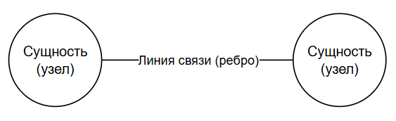
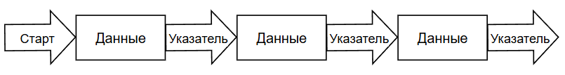
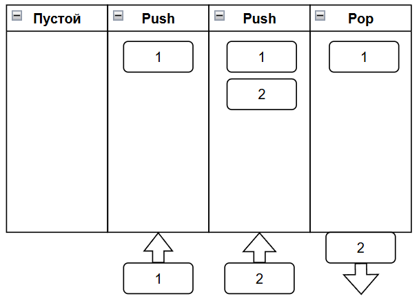
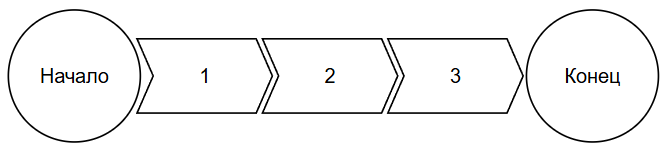

---
title: 3.02. Структуры данных
---

# 3.02. Структуры данных

<div class="article-tags">
  <span class="tag tag-inprogress">В РАЗРАБОТКЕ</span>
  <span class="tag tag-advanced">НЕ ДЛЯ НОВИЧКОВ</span>
  <span class="tag tag-notrequired">НЕ ОБЯЗАТЕЛЬНО</span>
</div>
<span class="complexity-badge">Разработчику</span>
<span class="complexity-badge">Архитектору</span>
<span class="complexity-badge">Инженеру</span>

<div class="callout callout--tip">
  <div class="callout-title">Внимание</div>
Приготовьтесь!
Страшные слова	
Структуры, типы данных – это очень важно.
Это фундаментальные знания, которые помогут вам изучать всё в дальнейшем быстрее и эффективнее. Некоторые вещи будут пока не понятны, главное пробегитесь, и возвращайтесь к разделу в дальнейшем, если понадобится.
</div>

## Структуры данных

Данные хранятся в памяти в определённой структуре, они не лежат «кучей».

Структуры бывают в виде таблиц, иерархических структур (деревьев), двоичных, графовых, линейных структур и «ключ-значение».

### Таблица

Таблица представляет собой структурированный набор, где данные в виде строк и столбцов (реляционные БД, Excel, CSV):
	- Вертикально - столбец;
	- Горизонтально - строка.
	- Пересечение столбца и сроки - ячейка.

| № п/п | Имя | Возраст |
| :--- | :---: | ---: |
| 1 | Владимир | 44|
| 2 | Владислав | 35|
| 3 | Жанна | 18|

Здесь «№ п/п», «Имя» и «Возраст» - столбцы, «1», «2», «3» - строки (по столбцу «№ п/п»), «Владимир» - значение ячейки (столбец «Имя», строка «1»).

### Иерархические структуры

Иерархические структуры, где данные в виде «дерева» (родители и дети), например XML, JSON. Один узел является корневым, а остальные организованы в поддеревья.

```xml
<parent name="Спарда">
  <child name="Данте" />
  <child name="Вергилий" />
</parent>

```

```json
{
    "family": {
      "parent": { "name": "Спарда", 
        "children": { "name": "Данте" } }
        "children": { "name": "Вергилий" } }
    }
}

```

### Двоичные структуры

Двоичные структуры, где данные в виде «нулей и единиц», которые поймёт только процессор - исполняемые файлы (.exe, .dll), изображения (.jpg, .png), видео (.mp4), аудио (.mp3).

### Графовые структуры

Графовые структуры, где узлы (объекты) и связи между ними, это просто группа сущностей и их взаимосвязей, используются в рекомендациях, алгоритмах поиска, соцсетях. Здесь суть в сущностях, которые связаны друг с другом – это может быть связь двух таблиц, объектов любой другой структуры - но важно именно наличие связи между такими «сущностями»;

Граф — это структура данных, представляющая собой набор вершин (узлов), соединённых рёбрами. Рёбра могут быть направленными (ориентированный граф) или нет.

В графовой структуре «Сущность-линия связи-Сущность», «сущность» соответствует вершине (узлу), а «линия связи» соответствует ребру графа. Каждая сущность связана с другими сущностями через линии связи (рёбра).




Когда объекты устанавливают связи между собой, они ссылаются друг на друга.
Интересный пример можно увидеть в программе Obsidian - статьи (файлы) могут ссылаться друг на друга, и эта связь отображается визуально в виде графов, где видны связи объектов между собой.

### Линейные структуры

Линейные структуры, где данные идут «один за другим», в последовательности – это массивы (список – `[1, 2, 3]`).

Массив – структура данных, представляющая собой упорядоченные коллекции элементов одного типа. Порой новичков может напугать это слово, потому что в обычной жизни не так уж часто применяется. Это может быть, к примеру, массив строк или чисел:
```JavaScript
["Один", "Два", "Три"]	Массив строк
[1, 2, 3]	Массив чисел
```

Каждый элемент массива («Один» или 2) имеет свой индекс, причём первый элемент будет не 1, а 0 – индексация идёт с 0. Допустим, если взять вышеприведенный массив чисел и указать как `МассивЧисел[0]` то результат будет 1, а для строк – «Один». Через индекс можно получить значение массива. Смысл их применения в упрощении кода – допустим, если мы будем перечислять все объекты построчно, с этим будет работать тяжело, а тут, к примеру, можно сделать массив с именами и перечислить их в форме массива строк:

```JavaScript
names = ["Роуч", "Соуп", "Гоуст", "Прайс"]
```

Массивы используются, к примеру, для обработки данных в научных вычислениях или хранения списков каких-то позиций, допустим, товаров.

Связный список (Linked List) — это линейная структура данных, где каждый элемент (узел) содержит данные и ссылку на следующий узел.




### Ключ-значение

Ключ-значение, где есть слово (ключ) и его определение (значение), как в словаре – используется в NoSQL-базах данных, допустим для кэширования;

```JavaScript
user = { "имя": "Скарлетт" }
```

### Сетевые структуры

Сетевые структуры – данные связаны сложной «паутиной» (потом сеть и называется Web), допустим микросервисы, или HTML-страница со стилями, текстом, скриптами и картинками. Эту структуру можно, конечно и не выделять, так как по своей сути это графовая структура - допустим, связанные друг с другом сервисы могут представляться как узлы сети.

### Хеш-таблицы

Хеш-таблицы, которые позволяют хранить пары ключ-значение и обеспечивает быстрый доступ к данным с помощью хеш-функции. От обычного «ключ-значения», как правило, хеш-таблицы отделяют из-за специфичности хранения.

★ Хеш-таблица, или словарь (dictionary) – структура, где данные хранятся в формате «ключ: значение». Пример:

```JavaScript
friend = {"name": "Иван", "age": 30, "city": "Москва"}
```

Каждый ключ «name» преобразуется в числовой хеш (1423 допустим), а значение «Иван» сохраняется в ячейке с этим хешем. И система может искать значение по ключу, когда нужен быстрый доступ к данным, используя хеш-функцию для элементов.

То есть, хеш-таблица принципиально отличается от обычной таблицы, однако, если её представить в вертикальном порядке, это становится уже более понятным для человеческого представления:

| Ключ (Key) | Значение (Value) |
| :--- | :---: |
|name	|Иван
|age	|30
|city	|Москва

Так, система получает команду взять Value для Key="age" и результат будет 30.

Хеш-таблицы используются в базах данных (индексация записей), для кэширования (NoSQL). В отличие от массивов, где доступ идёт по индексу, в хеш-таблице доступ только по ключу. Можно представить, что массив – это своего рода хеш-таблица, где первая строка (ключ) это индекс массива:

| Индекс | Элемент |
| :--- | :---: |
|0	|Один
|1	|Два
|2	|Три
|3	|Четыре
|4	|Пять

Кроме этого, можно отметить также такие виды структуры данных, которые могут быть реализованы на массивах или связных списках, но часто выделяются как отдельные — это стек и очередь.

### Стек

Стек — это структура данных, работающая по принципу LIFO (Last-In, First-Out): последний добавленный элемент будет первым удалённым. Стек начинается пустым, при push добавляется элемент, при pop удаляется последний добавленный элемент.




### Очередь

Очередь — это структура данных, работающая по принципу FIFO (First-In, First-Out): первый добавленный элемент будет первым удалённым. Это именно та очередь, которая знакома нам в жизни, но только здесь нет наглецов, которым «просто спросить».



