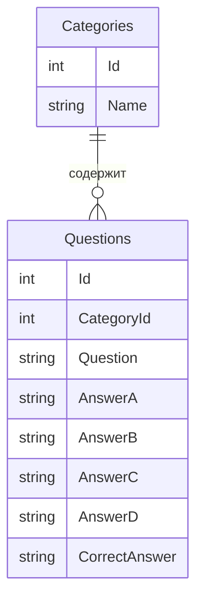
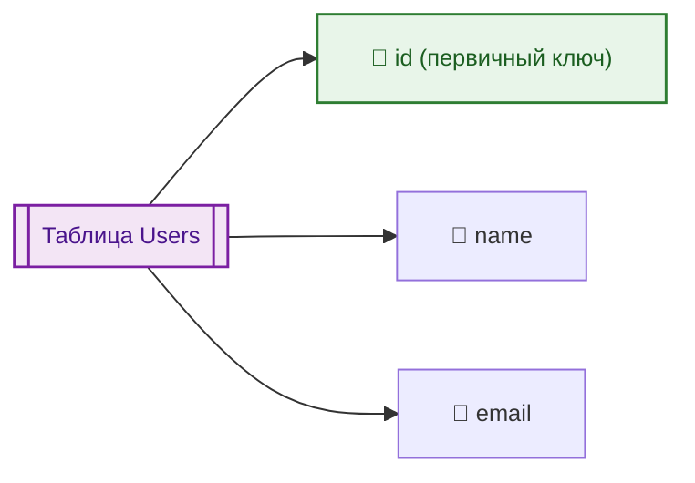
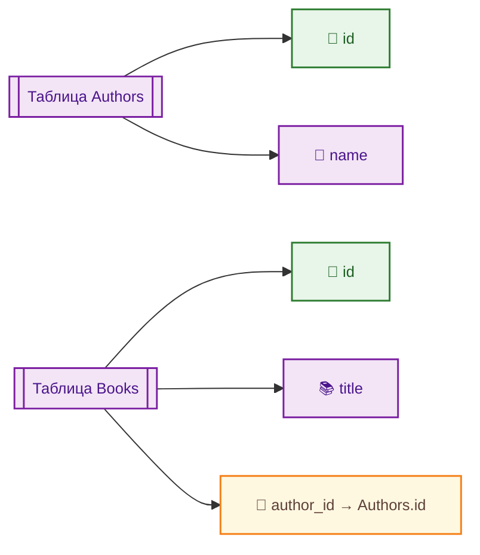

---
title: SQL - язык структурированных запросов
---

import SqlTrainer from '@site/src/components/SqlTrainer.js';

# SQL - язык структурированных запросов

<div class="article-tags">
  <span class="tag tag-required">ОБЯЗАТЕЛЬНО</span>
  <span class="tag tag-beginner">ДЛЯ НОВИЧКОВ</span>
  <span class="tag tag-advanced">НЕ ДЛЯ НОВИЧКОВ</span>
  <span class="tag tag-inprogress">В РАЗРАБОТКЕ</span>
</div>
<span class="complexity-badge">Разработчику</span>
<span class="complexity-badge">Аналитику</span>
<span class="complexity-badge">Тестировщику</span>  
<span class="complexity-badge">Архитектору</span>
<span class="complexity-badge">Инженеру</span>

## Основы SQL

### Что такое SQL?

★ **SQL (Structured Query Language)** – язык структурированных запросов для работы с реляционными (табличными) базами данных. Это не язык программирования, это декларативный язык – мы говорим «что нужно сделать», а СУБД сама решает, «как это сделать».

---

### Возможности SQL

Какие возможности предоставляет SQL?
	- *создавать, изменять и удалять таблицы, поля, ограничения;*
	- *организовать данные в понятную, согласованную и контролируемую структуру;*
	- *хранение информации с гарантией целостности: каждое значение соответствует своей структуре, типу и ограничениям;*
	- *добавлять, изменять, удалять и извлекать данные по заданным условиям;*
	- *выбирать данные на основе условий, связей между таблицами, агрегатных функций;*
	- *обеспечение связи «один-к-одному», «один-ко-многим», «многие-ко-многим»;*
	- *выполнение операций в рамках транзакций: всё либо выполняется целиком, либо откатывается;*
	- *определять, кто может читать, писать, изменять или управлять данными;*
	- *вычисление сумм, средних, максимумов, группировок, подсчёт уникальных значений и другие статистические операции;*
	- *создавать виртуальные таблицы, которые представляют собой результат сложного запроса;*
	- *выполнять промежуточные вычисления внутри одного запроса или сессии.*

<SqlTrainer />

<div class="callout callout--tip">
  <div class="callout-title">Интересный факт</div>
Изначально, для того чтобы люди могли запрашивать данные из баз на английском языке, вместо написания сложных программ, Дональд Чэмберлин и Рэймонд Бойс в 1970 году разработали SEQUEL (Structured English Query Language), но оказалось – SEQUEL уже был зарегистрирован торговой маркой авиакомпании, поэтому название сократили до SQL.
</div>

---

### Как работает SQL?

Пример запроса:

```sql
SELECT name FROM users WHERE age > 25;
```

В SQL данные хранятся в таблицах, словно в Excel, и эти таблицы связаны между собой. То есть, база – это совокупность таблиц. В одной базе может быть много таблиц, где одна может хранить в себе сведения о пользователях, другая о городах, третья о продуктах, четвертая о заказах, и так далее. Каждая таблица хранит информацию об одном типе сущности. И они могут быть между собой связаны:


На примере выше есть две таблицы – *Questions* и *Categories*. В *Questions* есть *CategoryId*, которая связана с *Id* в таблице *Categories*. Так данные могут разделяться, организовывая структуру и связывая таблицы между собой.

Диаграмма таких связей называется **Entity Relationship Diagram** - ERD.



**Таблица Categories**

| Id | Name |
| :--- | :---: |
|1	|Science
|2	|Literature


**Таблица Questions**

| Id | CategoryId | Question |
| :--- | :---: | ---: |
|1	|1	|Что такое гравитация?
|2	|2	|Кто написал «Гамлета»?

Вот SQL как раз обеспечивает такую связь и это главное отличие реляционных БД - **реляции (relations)**, что означает «связи».

---

### Таблицы в SQL

Таблицы состоят из:
1. ★ **Строк** (records, не путать со строковым типом данных) – отдельные записи (к примеру, один пользователь = 1 строка).
2. ★ **Столбцов** (fields) – поля, это свойства записей (имя, возраст, email). 
3. ★ **Ключей** – уникальных полей, которые связывают таблицы между собой (на примере выше это *CategoryId* и *Id*):
	- *id* для *Questions*, и *id* для *Categories* будут **первичными ключами** (Primary Key, PK), определяющий её связь с другими;
	- *CategoryId* для *Questions* будет **внешним ключом** (Foreign Key, FK), определяющий связь с определённой таблицей.

Таким образом, можно определить что есть какие-то виды ключей, так?

---

### Ключи

**Первичный ключ** - это уникальный идентификатор для каждой строки (записи) в таблице. Он должен быть уникальным (никакие две строки не могут иметь одинаковое значение первичного ключа), не может быть пустым (NULL) и обязательно должен иметь значение.

В таблице может быть только один первичный ключ.



**Внешний ключ** - это поле (или набор полей) в одной таблице, которое ссылается на первичный ключ другой таблицы. Используется для установления связей между таблицами. Что-то вроде указателя, но в качестве «стрелки» использует идентификатор. Он может содержать повторяющиеся значения (к примеру, автор может иметь несколько книг, а значит, в таблице с книгами внешний ключ, указывающий на id автора будет совпадать). Он может быть NULL, если это разрешено, и обеспечивает целостность ссылок.



**Суперключ** - это любой набор атрибутов (столбцов), который однозначно идентифицирует каждую строку в таблице. Суперключ может содержать лишние атрибуты (то есть не все его части необходимы для уникальности). 

Первичный ключ — это **минимальный суперключ** (то есть суперключ без лишних атрибутов). К примеру, id уникален, а значит однозначно идентифицирует строку, и является суперключом.

Имя, например, может быть не уникальным, поэтому не является суперключом. А вот `{id, Имя}` будет уже уникальной комбинацией, а значит - суперключ. Но уникальность обеспечивается именно id, а «Имя» теперь избыточно. Это называется **суперключ с избыточностью**.

Поэтому можно сказать, что суперключом является любое описание, по которому мы точно найдём нужную запись.

---

### Поле

**Поле** — это один столбец в таблице, представляющий определённый атрибут (характеристику) сущности. Каждое поле имеет имя, тип данных и ограничения. Поле иногда называют атрибутом. Важно не путать со строкой (записью), которая представляет собой одну сущность.

Если приводить в пример Excel-таблицы, то:
	- Таблица - отдельный лист;
	- Поле - заголовое столбца;
	- Запись - одна строка в таблице.

---