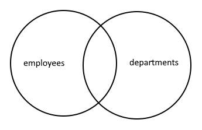
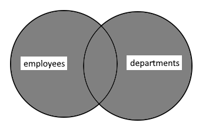

---
title: 3.07. Алиасы и объединения
---

# 3.07. Алиасы и объединения

## Алиасы и объединения

### Алиасы

★ **Алиасы (AS)** используются для временного переименования таблиц или столбцов в запросе SQL. Они делают запросы более читаемыми и позволяют избежать конфликтов имён. 

Пример для столбцов (AS employee_name):
```sql
SELECT 
    name AS employee_name,
    salary * 12 AS annual_salary
FROM employees;
```
Немного английского - employee это работник, employer работодатель.

Пример для таблиц:
```sql
SELECT 
    e.name,
    d.name AS department_name
FROM employees AS e
JOIN departments AS d ON e.department_id = d.id;
```
Здесь мы видим, что таблица employees получила алиас (псевдоним) e, а departments получила алиас d. Это позволяет обращаться к ним не традиционно 
```
<имя таблицы>.<имя столбца>
```
а так:
```
<алиас>.<имя столбца>. 
```

Если имя столбца длинное и страшное, к примеру, `UltraHardMegaBigNameOfThisHugeDepartment`, можно уменьшить, используя алиас «u» - и запрос станет более читабельным.

Помните, в начале главы я говорил о том, что запрос работает по порядку сначала FROM, а потом SELECT, хотя код пишется так, что первым пишут SELECT? Вот как раз с алиасами это становится понятно, потому что сначала идёт `FROM Table AS t`, а лишь затем `SELECT t.name, t.id`.

Ключевые моменты:
	- алиасы существуют только в момент выполнения запроса;
	- SQL-процессор сначала читает FROM, и только потом SELECT, поэтому можно изначально в SELECT уже указывать по формату `«алиас_таблицы.столбец»` еще до `FROM таблица AS алиас_таблицы`;
	- ключевое слово `AS` можно опустить:
```sql
SELECT e.name FROM employees e
```

### Объединения (JOIN)

★ **Объединения (JOIN)** используются для объединения данных из двух и более таблиц на основе связанных столбцов.

Хорошая шпаргалка по объединениями есть здесь:

https://learnsql.com/blog/sql-join-cheat-sheet/

Представим, что нам надо объединить таблицы employees и departments:



У нас есть несколько вариантов объединения. Практически это нужно, к примеру, когда у вас данные раскиданы по нескольким таблицам, а вы хотите получить какой-то общий результат с данными из этих разных таблиц.

Основные типы JOIN: **INNER, OUTER (LEFT, RIGHT, FULL), CROSS**.

#### INNER JOIN

★ INNER JOIN (внутреннее соединение) – возвращает только строки, где есть соответствие в обеих таблицах:
```sql
SELECT 
    e.name AS employee_name,
    d.name AS department_name
FROM employees e
INNER JOIN departments d ON e.department_id = d.id;
```
Пример:


Есть также внешние соединения (OUTER JOIN). Выделяют LEFT OUTER JOIN, RIGHT OUTER JOIN и FULL OUTER JOIN.

#### LEFT JOIN

★ **LEFT JOIN или LEFT OUTER JOIN (Левое соединение)** возвращает все строки из левой таблицы и соответствующие из правой. 

Если соответствия нет – NULL:
```sql
SELECT 
    e.name AS employee_name,
    d.name AS department_name
FROM employees e
LEFT JOIN departments d ON e.department_id = d.id;
```
Пример:


#### RIGHT JOIN 

★ **RIGHT JOIN или RIGHT OUTER JOIN (Правое соединение)** возвращает все строки из правой таблицы и соответствующие из левой. Если соответствия нет – NULL.
```sql
SELECT 
    e.name AS employee_name,
    d.name AS department_name
FROM employees e
RIGHT JOIN departments d ON e.department_id = d.id;
```

Пример:


#### FULL JOIN

★ **FULL JOIN или FULL OUTER JOIN (Полное соединение)** возвращает все строки из обеих таблиц. Если соответствия нет – NULL:
```sql
SELECT 
    e.name AS employee_name,
    d.name AS department_name
FROM employees e
FULL JOIN departments d ON e.department_id = d.id;
```

Пример:



#### CROSS JOIN

★ **CROSS JOIN (Декартово произведение)** возвращает все возможные комбинации строк из обеих таблиц:
```sql
SELECT 
    e.name AS employee_name,
    d.name AS department_name
FROM employees e
CROSS JOIN departments d;
```

#### Прочее о джойнах

**Эквисоединение (Equal Join)** - соединение, в котором условие ON основано на равенстве значений в столбцах двух таблиц. INNER JOIN, LEFT JOIN и т.д. с условием ON t1.col = t2.col — это и есть эквисоединения. Подавляющее большинство JOIN в реальных запросах — эквисоединения.

**Естественное соединение (NATURAL JOIN)** - автоматически объединяет таблицы по всем одноимённым столбцам. Не требует явного указания условия ON. Если в обеих таблицах есть столбцы с одинаковыми именами (например, id, department_id), то NATURAL JOIN использует их для соединения по равенству. Столбец, по которому происходит соединение, отображается только один раз в результате.

На практике NATURAL JOIN редко используется, потому что легко ошибиться, запрос становится хрупким (изменение имени столбца может непреднамеренно повлиять на JOIN) и не видно сразу, по каким полям происходит соединение.

### UNION

Ключевое слово **UNION** позволяет выполнить один или несколько дополнительных запросов SELECT и добавить их результаты к исходному запросу. То есть, это SQL-оператор, который позволяет объединять результаты двух или более запросов SELECT в один результирующий набор. Это очень удобно, когда нужно собрать данные из разных таблиц или условий, но с одинаковой структурой.


UNION ALL — повторяющиеся строки включаются (объединяет результаты, сохраняя все строки, включая дубли (работает быстрее)).
```sql
UNION ALL
```

UNION — повторяющиеся строки исключаются (объединяет результаты, удаляя дубликаты (работает медленнее)).
```sql
UNION
```

Основное правило UNION - все объединяемые запросы должны возвращать одинаковое количество столбцов, и типы данных в соответствующих столбцах должны быть совместимыми.

Операция UNION отличается от операции JOIN. В результате операции UNION сцепляются результирующие наборы двух запросов. При этом операция UNION не создает отдельные строки для столбцов, полученных из двух таблиц. Операция JOIN сравнивает столбцы из двух таблиц и создает результирующие строки, которые состоят из столбцов из двух таблиц.

На что обращать внимание при использовании UNION?

1. Совпадение количества и порядка столбцов. При использовании UNION, если в одном запросе 3 столбца, а в другом — 2, будет ошибка.
2. Совместимость типов данных. Например, нельзя сложить число и строку: `SELECT id FROM table1 UNION SELECT name FROM table2` — ошибка.
3. Использование ORDER BY. Чтобы отсортировать итоговый результат, ORDER BY указывается в самом конце, после всех UNION.
4. Производительность. UNION требует дополнительной работы — удаления дубликатов. Поэтому, если дубли не важны, лучше использовать UNION ALL.

Поэтому команду UNION нужно использовать тогда, когда нужно объединить данные из разных таблиц/запросов с одинаковой структурой, к примеру, при построении отчётов, где требуется выборка из нескольких источников или для создания сводных списков, например, «все клиенты», независимо от типа.
