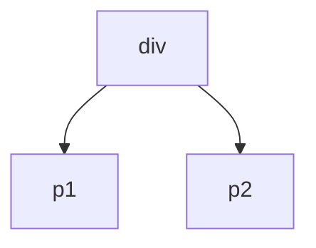
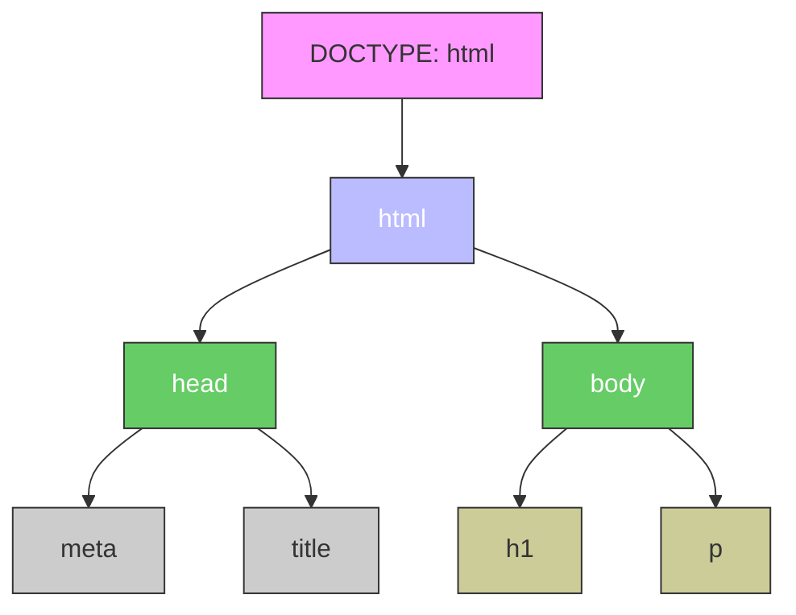
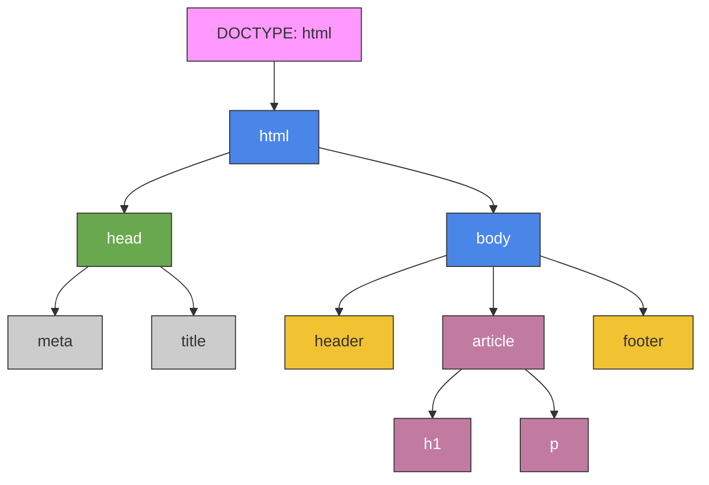

---
title: 3.09. HTML
---

# 3.09. HTML

<div class="article-tags">
  <span class="tag tag-required">ОБЯЗАТЕЛЬНО</span>
  <span class="tag tag-beginner">ДЛЯ НОВИЧКОВ</span>
  <span class="tag tag-advanced">НЕ ДЛЯ НОВИЧКОВ</span>
  <span class="tag tag-inprogress">В РАЗРАБОТКЕ</span>
</div>
<span class="complexity-badge">Разработчику</span>
<span class="complexity-badge">Аналитику</span>
<span class="complexity-badge">Тестировщику</span>  
<span class="complexity-badge">Архитектору</span>
<span class="complexity-badge">Инженеру</span>

## HTML – что это?

★ **HTML (HyperText Markup Language)** – язык разметки, который сообщает браузеру, отображать содержимое: где текст, где заголовки, где ссылки, где изображения. 

HTML предоставляет следующие возможности:
	- организовать данные в логические блоки: заголовки, абзацы, списки, таблицы, формы и другие элементы;
	- создать иерархическую структуру документа, где каждый фрагмент имеет своё место и назначение;
	- возможность описать значение содержимого, а не только его внешний вид;
	- позволяет браузерам, поисковым системам и другим инструментам лучше понимать, что находится на странице;
	- гипертекстовое соединение — возможность ссылаться на другие документы, изображения, медиа и сервисы;
	- поддерживает элементы, которые становятся точками взаимодействия с пользователем: кнопки, поля ввода, меню;
	- выступает платформой, на которой работают CSS (для стилей) и JavaScript (для поведения);
	- предоставляет структуру, которую можно адаптировать под экраны разных размеров и типов устройств.

Для ясности, можно представить себе простую картину – вы хотите вывести текст с заголовком, ссылкой и изображением. Тогда в голове мы бы сразу структурировали информацию:

---

# Заголовок

Некое содержание

[Ссылка](https://example.com)

---

И как раз, чтобы браузер выполнял распределение всех элементов, компоновал, отрисовывал и отображал в нужном порядке, информацию структурируют разметкой.


★ **Разметка** – это способ структурирования информации с помощью специальных меток (тегов). 
★ **Теги** – это строительные блоки HTML, команды в угловых скобках «`<`» и «`>`». Они бывают:
	- парные: `<тег>…</тег>` (например, `<p>Текст</p>`);
	- одиночные: `<тег>` (например, `` для изображений).

---

Браузер видит тег – ключевое слово, размеченное угловыми скобками, и понимает, что в этом месте нужен специфический объект, тип которого определён ключевым словом. Теги позволяют структурировать информацию, вкладывая их друг в друга, словно матрёшку, благодаря чему выстраивается иерархическая структура-дерево DOM.

```html
<div>
  <p>Текст внутри блока</p>
  <p>Текст внутри блока</p>
</div>
```




<div class="callout callout--tip">
  <div class="callout-title">Интересный факт</div>
HTML родился из-за документов по физике. Физик Тим Бернерс-Ли работал в Европейском центре ядерных исследований, и столкнулся с проблемой – ученые писали документы на разных форматах, и было сложно делиться информацией, тогда он и собрал ENQUIRE – прототип будущего веба – HTML, HTTP, URL. Поэтому HTML был нужен не для создания сайтов, а чтобы физики могли обмениваться научными статьями. Так, ученые в очередной раз сделали нашу жизнь интереснее.
</div>

★ **DOM-дерево (Document Object Model, коротко DOM)**, где каждый HTML-тег является объектом. То есть, в работе не стоит пугаться этого слова – DOM – это просто «дерево тегов», где каждый – элемент, то есть объект. Вложенные теги будут являться «детьми» родительского элемента. И всё это DOM-дерево именуется «document» в JavaScript. Но к JS мы придём гораздо позже.

Первый тег в парном теге является открывающим, второй – закрывающий. То есть:
	- `<div>` будет открывающим тегом;
	- `</div>` закрывающим.
	
В одиночном теге он единственный, так что он и открывающий, и закрывающий.

★ **Атрибуты** – настройки тегов, которые добавляют к тегам дополнительную информацию (значение атрибута), и указываются внутри открывающего тега:

```html

```

	- тег - ``;
	- src – атрибут, указывающий путь к изображению;
	- ”test.jpg” – значение, которому равен src;
	- alt – атрибут, указывающий альтернативный текст;
	- ”Тест” – значение, сам альтернативный текст.
	
На первый взгляд, язык разметки HTML схож с XML. Однако, у них есть существенные отличия.

| HTML | XML |
| :--- | :---: |
|Фиксированный набор тегов;	|Теги придумывает сам разработчик;
|Теги предназначены для отображения контента в браузере;	|Теги предназначены для хранения и передачи данных;
|Можно пропускать некоторые закрывающие теги.	|Строгий синтаксис – все теги должны быть закрыты.


---

Давайте попробуем сразу на практике – создайте первую страницу, открыв Блокнот (Windows) или иной текстовый редактор (VS Code, Notepad++) и добавив в него следующее:

```HTML
<!DOCTYPE html>
<html lang=”ru”>
  <head>
    <meta charset=”UTF-8”>
    <title>Моя страница</title>
  </head>
  <body>
    <h1>Привет, мир!</h1>
    <p>Это моя первая HTML-страница.</p>
  </body>
</html>

```

После этого попробуйте сохранить с расширением файла .html и открыть файл при помощи любого браузера.

---

#### Из чего состоит веб-страница на HTML

1. Пролог (DOCTYPE и корневой тег), включающий:

	- `<!DOCTYPE>` - тег, объявляющий тип документа (HTML).
	- `<html>` - корневой тег всей страницы, словно самый главный родитель всего дерева.

Корневой тег html имеет атрибут lang, который указывает язык (в нашем случае, это ru – русский).

---

2. Обязательные и базовые теги

Всегда есть ряд обязательных тегов:
	- `<head>` - голова документа, которая хранит служебную информацию:
		- `<meta charset=”UTF-8”>` - кодировка текста;
		- `<title>` - заголовок вкладки браузера;
		- опционально - `<style>` и `<script>`, но мы пока не будем их затрагивать.
		- `<body>` - тело документа, то, что отобразится на странице – текст, изображения, ссылки.
		
---

`<title>` будет отображаться только на вкладке (заголовке окна):

---


---

а `<body>` покажет внутренности:

---


---

DOM-дерево будет выглядеть так:



Этих тегов уже достаточно для работы HTML. Попробуйте поэкспериментировать с текстом, если вам интересно. Замените текст заголовка, содержимое, можете добавить и ещё собственный фрагмент текста с заголовком (жирным шрифтом), закрытым в `<h1>`, и основным текстом (более мелкий шрифт), закрытым в `<p>`.

Необязательные теги же используются для улучшения структуры:
	- `<header>` - шапка сайта, верхняя часть сайта;
	- `<footer>` - подвал, нижняя часть сайта;
	- `<nav>` - навигационное меню;
	- `<article>`, `<section>` - смысловые блоки.

Давайте попробуем расширить нашу часть с новыми тегами – замените ваш тег `<body>` на новый со следующим содержимым:

```HTML
<body>
  <header>Логотип и меню</header>
  <article>
    <h1>Статья</h1>
    <p>Текст...</p>
  </article>
  <footer>Контакты</footer>
</body>

```

Это и есть самый базовый шаблон структуры сайта – уже обладая этими знаниями, можно собрать свою структуру.

---

DOM-дерево будет следующим:



Помимо обязательных тегов, можно выделить универсальные атрибуты – это такие атрибуты, которые характерны не для определённого тега, а работают почти с любыми тегами:
	- id – уникальный идентификатор, который делает элемент «единственным» на странице;
	- class – определяет класс для группировки элементов, к примеру, если нужно сделать фрагмент «вкладкой» или «контентом вкладки»;
	- style – определяет стиль (CSS-стиль, но об этом позже);
	- title – всплывающая подсказка при наведении.

---

## Кавычки и запятые

Два важных вопроса, которые мучают начинающих программистов:
1. Когда использовать кавычки двойные (`"`), одинарные (`'`), а когда апострофы (`’`)?
2. Когда использовать точки (`.`), запятые (`,`) и точку с запятой (`;`)?

В HTML, двойные кавычки — стандартное и рекомендуемое использование для значений атрибутов:
```html
<div class="main-content"></div>
```
Одинарные кавычки допускаются, но лучше использовать их только если внутри значения есть двойная кавычка:
```
<p title='He said "Hello"'>Some text</p>
```
Апострофы (`’`) — не используются в HTML как часть синтаксиса, но могут быть частью текста (например, в `&rsquo;`, `&#8217`; или Unicode).

Если вы используете фреймворки (React, Vue и т. д.), то часто предпочитают двойные кавычки для соответствия JSX/TSX.

Точка (`.`) : не используется в синтаксисе HTML.

Запятая (`,`) : может использоваться внутри атрибутов, если это часть значения:
```html
<div data-coords="100,200"></div>
```
Точка с запятой (`;`) : не используется в HTML, но встречается в URL (например, в параметрах):
```html
<a href="page.php?id=1;mode=dark">Link</a>
```
В чистом HTML эти символы не имеют специального значения для языка разметки, но могут быть частью значений.
