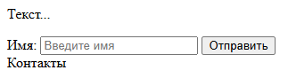

---
title: 3.09. Основные теги
---

# 3.09. Основные теги

<div class="article-tags">
  <span class="tag tag-required">ОБЯЗАТЕЛЬНО</span>
  <span class="tag tag-beginner">ДЛЯ НОВИЧКОВ</span>
  <span class="tag tag-advanced">НЕ ДЛЯ НОВИЧКОВ</span>
  <span class="tag tag-inprogress">В РАЗРАБОТКЕ</span>
</div>
<span class="complexity-badge">Разработчику</span>
<span class="complexity-badge">Аналитику</span>
<span class="complexity-badge">Тестировщику</span>  
<span class="complexity-badge">Архитектору</span>
<span class="complexity-badge">Инженеру</span>


---

## Форматирование текста

HTML позволяет своими встроенными инструментами менять вид текста:

| Тег | Описание |
|-----|---------|
| `<b>` | Жирный шрифт |
| `<i>` | Курсив |
| `<u>` | Подчёркивание |
| `<br>` | Перенос строки |
| `<hr>` | Горизонтальная линия |
| `<p>` | Абзац HTML (в отличие от переноса, выделяет набор данных отдельно) |
| `<h1>`, `<h2>`, …, `<h6>` | Заголовки. Отличаются встроенным форматированием, которое делает шрифт больше, жирнее и более выдающимся. В отличие от простого размера и формата, присваивает тексту «статус» заголовка, что позволяет работать с объектом |
| `<ul>` | Неупорядоченный (маркированный) список:`• раз`; `• два` |
| `<ol>` | Упорядоченный список: `1. раз`; `2. два` |
| `<li>` | Элемент списка:`<li>раз</li>` `<li>два</li>` |

<div class="callout callout--tip">
  <div class="callout-title">Интересный факт</div>
HTML не требует точек с запятой, фигурных скобок и вообще почти ничего. Сделайте пустую страницу, наберите любой текст – всё отобразится, а некоторые части исправит сам браузер – в этом и проявляется гибкость языка.
</div>


---

## Ссылки и изображения

`<a>` - Гипертекстовая ссылка (гиперссылка) – текст, который позволяет при клике перейти по ссылке, указанной в атрибуте. Она будет выведена по умолчанию как подчёркнутый текст. 

Сама ссылка будет скрыта, но отображаться будет в виде текста, который называется анкор (anchor) – потому этот тег и называется «а». Пример ссылки:
```html
<a href="ссылка">анкор</a>
```

У тега `<a>` есть атрибуты:
	- charset – кодировка символов документа, на который ведёт ссылка;
	- coords – координаты ссылки в карте изображений;
	- download – документ по ссылке будет загружаться;
	- href – ссылка (URL страницы);
	- hreflang – язык документа по ссылке;
	- media – устройство вывода документа по ссылке;
	- name – имя анкора;
	- rel/rev – отношение с документом;
	- shape – форма ссылки в карте изображений;
	- target – где открывать документ по ссылке;
	- type – медиа тип документа по ссылке.

На практике, конечно, для `<a>`, используют в основном только href атрибут, так что на текущий момент достаточно запомнить лишь его – он обязательный.

Другой тег, похожий на `<a>` - ``.

`` - изображение, которое нужно отобразить на странице, и имеет атрибуты:
	- align – горизонтальное выравнивание содержимого;
	- alt – альтернативный текст (отображается, если элемент недоступен);
	- border – толщина границы (рамки) элемента;
	- height – высота изображения;
	- hspace – величина отступов слева и справа;
	- longdesc – гиперссылка на подробное описание изображения;
	- src – URL изображения;
	- vspace – величина отступов сверху и снизу от изображения;
	- width – ширина изображения.
	
Как и href у тега `<a>`, для `` атрибут src – путь к картинке, обязательный атрибут.


---


## Формы и айфреймы

Формы - `<form>` нужны для создания фрагмента страницы, в которой будет выполняться ввод данных – логины, поиск, опросы.
Попробуйте добавить в нашу страницу перед `<footer>` следующий фрагмент:
```html
<form action="/submit" method="POST">
  <label>Имя:</label>
  <input type="text" name="username" placeholder="Введите имя">
  <input type="submit" value="Отправить">
</form>
```
После обновления мы увидим:



Здесь: 
	- `<form>` - сама форма;
		- action - действие, к примеру, куда отправлять данные (`/submit` в нашем случае, разумеется никуда не отправится – обязательный атрибут;
		- method – метод HTTP-запроса (GET или POST, допустим);
	- `<input>` - поле для ввода;
		- type – тип, к примеру, text, password, email;
		- placeholder – подсказка в поле.
		
Также, элемент формы может содержать теги `<textarea>`, `<button>`, `<select>`, `<option>`, `<optgroup>`, `<fieldset>`, `<label>`.

`<input>` бывает нескольких типов, (type):
	- text – стандартное текстовое поле, можно добавить атрибут value, который будет содержать текст по умолчанию;
	- password – текстовое поле, но вводимые символы будут скрыты;
	- checkbox – поле флажков (чекбоксов), или «галочек», которые можно включить или выключить – добавляется атрибут checked, который задаёт начальное состояние – включен или выключен (checked/unchecked);
	- radio – переключатели (radiobuttons), которые работают по принципу checked/unchecked, но имеет два объекта, где выбирается или первый, или второй;
	- file – поле загрузки файла;
	- submit – кнопка отправки данных;
	- image – изображение вместо кнопки отправки, потребуется дополнительный атрибут src;
	- button – кнопка;
	- reset – кнопка сброса значений по умолчанию;
	- hidden – скрытое поле (скрытое от пользователя).
	
Кроме форм, можно встроить также «айфрейм» при помощи тега `<iframe>`, который позволяет встроить на другую страницу видео или карту. К примеру, на сервисе ВК Видео (Вконтакте) можно скопировать код для вставки, и напрямую вставить в код своей страницы. 

`<iframe>` использует атрибуты:
	- src – ссылку на ресурс;
	- width / height – размеры областы (ширина и высота);
	- title – заголовок.

Так, к примеру, я могу добавить на свою страницу видео с котом:


Купились? Но так можно. Поверьте на слово :)

Айфрейм позволяет встроить виджеты на свою страницу, но при этом виджет становится зависимым от доступности ресурса по ссылке в src – если сервис, к примеру, будет заблокирован в стране просмотра, или недоступен – то он не будет отображаться на странице.


---


## Таблицы

Таблицы `<table>` используются для сетки данных, когда нужно разделить всё на строки, таблицы и ячейки:
```html
<table border="1">
  <tr>
    <th>Имя</th>
    <th>Возраст</th>
  </tr>
  <tr>
    <td>Анна</td>
    <td>25</td>
  </tr>
</table>
```

Мы увидим простую таблицу:

| Имя | Возраст |
|-----|---------|
| Анна | 25 |

Здесь:
	- `<table>` - таблица, border – атрибут для границ;
	- `<tr>` - строка таблицы;
	- `<th>` - заголовок колонки (столбца), по умолчанию жирный;
	- `<td>` - ячейка с данными.
	
---

## Работа с тегами и события

Сейчас мы рассмотрим некоторые новые теги, а также изучим особенности работы с ними.

В HTML, как и в других языках, есть комментарии – текст внутри кода, который игнорируется браузером и нужен для разработчиков, «читающих код». Если вы работали хоть раз с кодом с ИИ, то замечали, как он комментирует чуть ли не каждый шаг. Синтаксис представляет собой открывающий тег `<!-- и закрывающий -->`. Всё, что указано между открывающим и закрывающим, не будет отображено на странице. Комментарии нужны для пояснений к коду, временного отключения сомнительного кода и разметки секций. Их нельзя вкладывать друг в друга, они не работают внутри тегов и содержимое комментариев видно в исходном коде страницы на стороне клиента, так что – лучше не баловаться.

```html
<!-– это комментарий -->
```

	- `<span>` - тег для группировки строчных элементов и задания им определенных атрибутов, к примеру, если посреди текста нужно `<span style="color:blue;font-weight:bold">синий</span>` текст.
	- `<div>` - тег для выделения раздела или блока кода. Он нужен особенно в случаях, когда для определённой части кода используется особый CSS-стиль, к примеру, нужно определить, что есть вкладка, а что – контент вкладки.
	- `<meta>` - метаданные о HTML-документе, которые находятся внутри тега `<head>` - они используются для указания информационного набора общих сведений о странице.
	
То есть, `<div>` и `<span>` это «коробки» для структуры и текста, а `<meta>` - служебная информация о странице.

Для того, чтобы вместо простого текста была именно кнопка (специальный тип элемента), используется тег `<button>` - просто кликабельный и активный элемент, который позволяет обрабатывать события. К примеру, кнопка «Войти» на форме авторизации, или «Перейти» для перехода по ссылке (по аналогии с гиперссылкой). Кнопка может работать как тег `<a>`, а может обрабатывать событие.

В HTML есть такое понятие, как события – когда что-то происходит на странице с элементом:
	- onblur – когда элемент формы теряет фокус;
	- onchange – при изменениях в элементе;
	- onclick – клик мышью (левой кнопкой мыши);
	- ondblclick – двойной клик мышью;
	- onfocus – когда элемент получает фокус;
	- onkeydown – при нажатии клавиши;
	- onkeypress – при нажатии и отпускании клавиши;
	- onkeyup – при отпускании клавиши;
	- onload – когда загружены элементы (допустим в теге body);
	- onmousedown – при нажатии на кнопку мыши;
	- onmousemove – при движении указателя мыши;
	- onmouseout – при покидания указателя мыши района элемента;
	- onmouseover – при попадании указателя мыши в район элемента;
	- onmouseup – при отпускании кнопки мыши;
	- onreset – при сбросе элементов;
	- onsubmit – при отправке данных;
	- onunload – при закрытии страницы (в теге body).

При наступлении событий можно указать в значении такого атрибута ссылку на файл скрипта или название функции скрипта, которая будет выполняться. Эти функции пишутся на языке JavaScript и могут как быть включены в документ, так и выведены в отдельный файл.

Пример:

```html
<button onclick="/* скрипт или ссылка на него */">Текст кнопки</button>
```

Скрипт, встроенный в страницу, содержится как вложенный контент в элементе `<script>`. У тега `<script>` тоже есть атрибуты:
	- async – асинхронный режим работы скрипта;
	- charset – кодировка символов скрипта;
	- defer – отложенный режим запуска, до окончания загрузки страницы;
	- src – URL файла скрипта (для внешнего);
	- type – медиа-тип скрипта.
	
Но, для случаев, когда в браузере отключено отображение скриптов, или работает старый браузер, можно добавить резервный тег `<noscript>`, который выведет текст на случай, если скрипты отключены. Но JavaScript мы изучим чуть позже, ведь там уже идёт работа на языке программирования, а не разметки.

Если возникло желание погрузиться в HTML, то рекомендую ознакомиться с MDN - https://developer.mozilla.org/ru/docs/Web/HTML

Чит-лист - https://cheatsheets.zip/html
