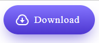

---
title: 3.10. CSS
---

# 3.10. CSS

<div class="article-tags">
  <span class="tag tag-required">ОБЯЗАТЕЛЬНО</span>
  <span class="tag tag-beginner">ДЛЯ НОВИЧКОВ</span>
  <span class="tag tag-advanced">НЕ ДЛЯ НОВИЧКОВ</span>
  <span class="tag tag-inprogress">В РАЗРАБОТКЕ</span>
</div>
<span class="complexity-badge">Разработчику</span>
<span class="complexity-badge">Аналитику</span>
<span class="complexity-badge">Тестировщику</span>  
<span class="complexity-badge">Архитектору</span>
<span class="complexity-badge">Инженеру</span>

## Общее о стилях

### Что такое CSS?

★ **CSS (Cascading Style Sheets)** – язык стилей, который определяет внешний вид HTML-документа, отвечающий за цвета, шрифты, расположение элементов, визуальные эффекты на веб-странице.

Какие возможности предоставляет CSS?
	- *задавать внешний вид элементов: цвета, шрифты, размеры, формы, тени, прозрачность*;
	- *превращает «голый» текст в графически оформленный документ*;
	- *управляет тем, где и как элементы будут отображаться относительно друг друга*;
	- *поддерживает гибкие и адаптивные макеты, которые меняются под разные устройства и ориентации экрана*;
	- *возможность создавать плавные переходы между состояниями элементов*;
	- *добавлять движения, трансформации, эффекты при взаимодействии пользователя*;
	- *реакции на действия пользователя (наведение, клик, фокус) и изменение внешнего вида в ответ*;
	- *управление начертанием текста: размер, межстрочный интервал, гарнитура, вес, стиль*;
	- *возможность рисовать фигуры, градиенты, тени, рамки, маски и другие визуальные элементы без изображений*;
	- *скрывать элементы или убирать их из потока документа, не удаляя из разметки*.

При работе с CSS можно встретить и LESS – препроцессор CSS, который расширяет возможности CSS, добавляя переменные, вложенные правила, функции и миксины, что упрощает написание и поддержку стилей. LESS-код компилируется в обычный CSS перед использованием в браузере.

К примеру, можно детально настроить оформление и сделать кнопку красивой, добавив цветов, теней и других особенностей:


CSS состоит из:
	- стилей – наборов свойств (например, `color: red;` )
	- селекторов – указателей, какие элементы стилизовать (`h1`, `.class`, `#id`);
	- правил – комбинаций селекторов и стилей.

CSS называется каскадным, потому что стили применяются по определённому порядку:
1. Приоритет источника (стиль браузера – авторские стили - `!important`);
2. Специфичность селектора (например, `#id` важнее `.class`);
3. Порядок объявления (поздние стили переопределяют ранние).

Представим, что HTML — это каркас дома, а CSS — всё то, что делает этот дом красивым, удобным и живым: краска, мебель, свет, оформление.

Давайте разберёмся, как с помощью CSS «добраться» до нужных частей этого дома, чтобы их изменить.

Когда вы пишете HTML, вы используете теги, например:
```HTML
<h1>Заголовок</h1>
<p>Абзац текста</p>
<a href="#">Ссылка</a>
```
Каждый тег — это элемент: `<h1>`, `<p>`, `<a>` и т.д.

Элемент — это основной строительный блок страницы. В CSS вы можете выбирать элементы по их имени и задавать им стиль.

Пример:
```CSS
p {
    color: blue;
}
```

— это значит: «все абзацы (`<p>`) сделай синими».

Иногда нужно стилизовать не все одинаковые элементы, а только некоторые. Например, не все ссылки должны быть красными, а только особые.

Для этого в HTML есть атрибут class:
```CSS
<a href="#" class="button">Нажми меня</a>
<a href="#">Обычная ссылка</a>
```

Теперь в CSS можно выбрать только те элементы, у которых есть класс button:
```css
.button {
    background-color: red;
    padding: 10px;
    text-decoration: none;
}
```


★ **Класс (например, .button)** – именованный стиль, который можно применять к разным элементам.  Это как ярлык или бирка, которую вы прикрепляете к элементу, чтобы потом легко найти его и применить нужный стиль. Один и тот же класс может быть у нескольких элементов. Класс начинается с точки: .button. 

★ **Стиль** – конкретное свойство (например, `font-size: 16px`).

CSS применяется к элементам HTML через селекторы. 

Селекторы (англ. select – выбор), «выборщики», определяют к каким элементам DOM применять стили. 

Примеры:
	- по тегу – `p {…}`;
	- по классу - `.header {…}`;
	- по идентификатору - `#main {…}`;
	- по атрибуту – `[type= "text"] {…}`;
	- комбинированные – 
		- `div.button.active {…}`, 
		- `div > p` (дочерний), 
		- `h1 + p` (соседний).
То есть, исходные данные для селекторов – это:
	- теги (`<p>`, `<div>`, `<h1>`) – `p { color: red; }`;
	- классы (атрибут `class="button"`) - `.button { … }`’
	- идентификаторы (атрибут `id="header"`) - `#header { … }`;
	- атрибуты (значения атрибутов).

Соответственно, выбираются данные так - `#id`, `.class`, тег.
Пример: у нас есть HTML для стилизации:
```html
<div class="box" id="main-box">Привет, мир!</div>
```
Подключаем CSS к этому элементу:
```html
/* По тегу, напрямую */  
div { font-size: 16px; }  
```
```css
/* По классу, через точку*/  
.box { background: yellow; }  

/* По ID, через # */  
#main-box { border: 1px solid black; }  
```
Логика написания самого селектора и свойств такова:
1) выбираем элемент (селектор);
2) пишем свойства (параметры стиля).
```css
  селектор {
    свойство: значение;
    свойство: значение;
}
```

---

### Как работает CSS?

#### Порядок работы

★ Как работает CSS?
	- Браузер загружает HTML и строит DOM (объектную модель документа);
	- Браузер загружает CSS и формирует CSSOM (объектную модель CSS);
	- DOM и CSSOM объединяются в Render Tree – дерево отрисовки, где каждому элементу присваиваются стили;
	- Браузер отображает страницу на основе дерева отрисовки.


CSS предоставляет мощные инструменты для управления внешним видом и поведением элементов:
	- Трансформации и анимации — добавляют движение.
	- Блочная модель — основа компоновки.
	- Позиционирование — контроль над расположением.
	- Фон и текст — визуальная выразительность.
	- Эффекты — завершающие штрихи.

#### Добавление

★ **Как добавить CSS в HTML?**

1. Встроенные стили (в теге через `style=`);
2. Внутри HTML (добавив тег `<style></style>`);
3. Внешний файл:
```html
<link rel="stylesheet" href="style.css">
```

<div class="callout callout--tip">
  <div class="callout-title">Интересный факт</div>
До появления HTML5 и CSS3 анимации и интерактивность реализовывались через Flash. Сегодня всё это можно сделать даже в CSS, что делало его даже не просто языком стилей, а движком интерфейсов.
</div>


