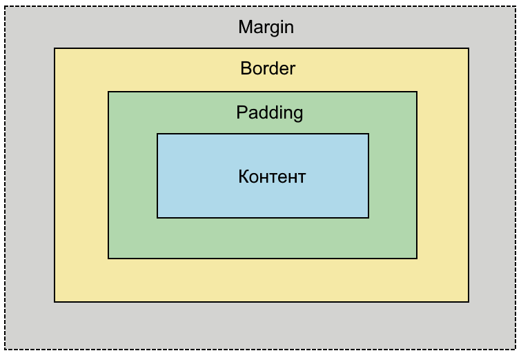

---
title: Блочная модель и механизм каскадирования
tags: [beginner, advanced, required, all, analytic, engineer, developer, architector, tester]
---

# Блочная модель и механизм каскадирования

<div class="article-tags">
  <span class="tag tag-required">ОБЯЗАТЕЛЬНО</span>
  <span class="tag tag-beginner">ДЛЯ НОВИЧКОВ</span>
  <span class="tag tag-advanced">НЕ ДЛЯ НОВИЧКОВ</span>
  <span class="tag tag-inprogress">В РАЗРАБОТКЕ</span>
</div>
<span class="complexity-badge">Разработчику</span>
<span class="complexity-badge">Аналитику</span>
<span class="complexity-badge">Тестировщику</span>  
<span class="complexity-badge">Архитектору</span>
<span class="complexity-badge">Инженеру</span>

## Блочная модель

### Что такое блок?

Блок — базовая единица компоновки в CSS, представляющая любой элемент как прямоугольную область, ограниченную четырьмя сторонами: верх, низ, лево, право.
  
Каждый элемент веб-страницы воспринимается браузером как прямоугольник, состоящий из четырёх областей:

1. **Контент** — текст, изображения, другие вложенные элементы.
2. **Padding (внутренний отступ)** — пространство между контентом и границей.
3. **Border (граница)** — линия вокруг padding.
4. **Margin (внешний отступ)** — пространство вне границы, отделяющее элемент от соседей.



Ширина и высота элемента по умолчанию описывают только контентовую область.

Это означает, что итоговая ширина элемента равна:
```
ширина = width + левый padding + правый padding + левая граница + правая граница
```

Свойство `box-sizing: border-box` изменяет это поведение: `width` и `height` начинают включать padding и border. Это упрощает расчёт размеров и широко используется в современной вёрстке.


#### Контентовая модель

**Контентовая модель** — это поведение по умолчанию для всех HTML-элементов. В этой модели свойства `width` и `height` определяют только размеры **контентной области**, то есть внутренней части элемента, где размещаются текст, изображения или другие вложенные блоки.

Полная ширина элемента на странице складывается из нескольких частей:

- левый `margin`
- левый `border`
- левый `padding`
- `width` (ширина контента)
- правый `padding`
- правый `border`
- правый `margin`

Аналогично рассчитывается итоговая высота.

Пример:
```html
<div style="width: 200px; padding: 20px; border: 5px solid black;"></div>
```

Фактическая ширина этого блока составит:
```
200px (контент) + 2×20px (padding) + 2×5px (border) = 250px
```

Это поведение часто приводит к неожиданностям при верстке, особенно когда необходимо точно контролировать размеры элементов в адаптивных макетах.

#### box-sizing: border-box

Свойство `box-sizing: border-box` изменяет принцип расчёта размеров. В этом режиме значения `width` и `height` включают в себя **и контент, и padding, и border**. Margin при этом остаётся за пределами заданной ширины.

Тот же пример с `box-sizing: border-box`:
```html
<div style="width: 200px; padding: 20px; border: 5px solid black; box-sizing: border-box;"></div>
```

Теперь фактическая ширина блока будет ровно **200px**, а контентная область автоматически уменьшится до:
```
200px − 2×20px − 2×5px = 150px
```

Это поведение гораздо ближе к интуитивному ожиданию: если я задал элементу ширину 200 пикселей, он должен занимать ровно 200 пикселей на странице.

В адаптивных макетах часто используются процентные или гибкие единицы (`%`, `fr`, `vw`, `vh`). При использовании контентовой модели любое добавление `padding` или `border` приводит к увеличению итогового размера элемента, что может нарушить сетку или вызвать горизонтальный скролл.

С `box-sizing: border-box` можно свободно применять внутренние отступы и границы, не опасаясь «вылезти» за заданные рамки. Это особенно важно при работе с:

- колоночными сетками;
- карточками товаров или новостей;
- формами и полями ввода;
- компонентами с фиксированной шириной внутри гибких контейнеров.

Многие разработчики применяют `box-sizing: border-box` ко всем элементам на странице через универсальный селектор:

```css
*, *::before, *::after {
  box-sizing: border-box;
}
```

Такой подход обеспечивает единообразное поведение всех блоков и значительно упрощает создание предсказуемых макетов. 

#### Виды блоков
  
Блоки бывают блочными (`display: block`), строчными (`display: inline`) и гибридными (`display: inline-block`, `flex`, `grid`).

Каждый HTML-элемент отображается на странице в соответствии со своим значением свойства `display`. Это значение определяет, как элемент взаимодействует с окружающим потоком документа, какие размеры он может принимать и как располагается относительно соседей. Основные категории — **блочные**, **строчные** и **гибридные** элементы.

#### Блочные элементы

**Блочные элементы** формируют прямоугольный блок, который по умолчанию:

- начинается с новой строки;
- занимает всю доступную ширину родительского контейнера (если не задана конкретная ширина);
- позволяет задавать явные значения `width`, `height`, `margin`, `padding` и `border` во всех направлениях;
- вертикально стекаются друг под другом при последовательном размещении.

Примеры стандартных блочных элементов: `<div>`, `<p>`, `<h1>`–`<h6>`, `<section>`, `<article>`, `<form>`, `<ul>`, `<li>`.

Поведение:
```html
<div style="background: lightblue; width: 200px;">Блок 1</div>
<div style="background: lightgreen; width: 300px;">Блок 2</div>
```
Эти два блока будут расположены один под другим, даже если их суммарная ширина меньше ширины экрана.

#### Строчные элементы

**Строчные элементы** встраиваются в текстовый поток и ведут себя как часть строки:

- не начинаются с новой строки;
- занимают только столько места, сколько необходимо для содержимого;
- **не подчиняются** явным значениям `width` и `height`;
- вертикальные `margin` и `padding` не влияют на расположение соседних строк (хотя визуально могут отображаться);
- горизонтальные `margin` и `padding` работают корректно;
- переносятся на следующую строку целиком при нехватке места.

Примеры стандартных строчных элементов: `<span>`, `<a>`, `<strong>`, `<em>`, `` (по умолчанию), `<input>` (в некоторых браузерах).

Поведение:
```html
<span style="background: yellow; padding: 20px; width: 300px;">Текст</span>
```
Здесь `width: 300px` будет проигнорировано — элемент займёт ровно столько места, сколько нужно для слова «Текст».

#### Гибридные типы

**Гибридные типы** отображения сочетают черты блочных и строчных элементов или вводят новые модели компоновки.

#### `inline-block`

Элемент с `display: inline-block`:

- встраивается в текстовый поток, как строчный (не начинается с новой строки);
- **поддерживает** явные `width`, `height`, `margin`, `padding` и `border` во всех направлениях;
- не вызывает переноса строки сам по себе;
- выстраивается в строку с другими `inline` или `inline-block` элементами.

Часто используется для создания горизонтальных панелей, кнопок в ряд или карточек без применения флексов.

Пример:
```html
<div style="display: inline-block; width: 100px; height: 50px; background: coral;">Кнопка</div>
<div style="display: inline-block; width: 100px; height: 50px; background: orchid;">Кнопка</div>
```
Оба блока будут находиться на одной строке и сохранят заданные размеры.

#### `flex` (`display: flex`)

Элемент с `display: flex` становится **флекс-контейнером**. Его непосредственные дочерние элементы превращаются в **флекс-элементы** и подчиняются правилам Flexbox:

- автоматически выстраиваются в строку или колонку (в зависимости от `flex-direction`);
- могут растягиваться, сжиматься и перераспределять свободное пространство;
- поддерживают выравнивание по главной и поперечной осям через `justify-content`, `align-items` и другие свойства;
- позволяют создавать адаптивные, гибкие макеты без использования `float` или таблиц.

Флекс-контейнер сам является блочным элементом (занимает всю ширину, начинается с новой строки), но управляет внутренним расположением детей особым образом.

#### `grid` (`display: grid`)

Элемент с `display: grid` становится **сеточным контейнером**. Его дети размещаются в двумерной сетке, определяемой строками и колонками:

- макет строится на основе явно заданных треков (`grid-template-columns`, `grid-template-rows`);
- элементы могут занимать несколько ячеек, пересекать линии сетки, накладываться друг на друга;
- обеспечивает точный контроль над позиционированием в двух измерениях;
- идеален для сложных компоновок: дашбордов, галерей, форм с выравниванием меток и полей.

Как и флекс-контейнер, сеточный контейнер ведёт себя как блочный элемент на уровне внешнего потока документа.

#### box-sizing: border-box

Свойство `box-sizing` определяет, как браузер рассчитывает ширину и высоту HTML-элемента. По умолчанию используется значение `content-box`, при котором свойства `width` и `height` задают размеры только контентной области. Это поведение соответствует традиционной **W3C-модели блока**.

При использовании `box-sizing: border-box` модель расчёта меняется: значения `width` и `height` теперь включают в себя не только контент, но также внутренние отступы (`padding`) и границы (`border`). Внешние отступы (`margin`) остаются за пределами заданной ширины и высоты.

Рассмотрим пример:

```html
<div style="width: 200px; padding: 20px; border: 5px solid black;"></div>
```

**При `box-sizing: content-box` (по умолчанию):**

- Ширина контента = 200px  
- Итоговая ширина элемента = 200 + 2×20 + 2×5 = **250px**

**При `box-sizing: border-box`:**

- Итоговая ширина элемента = **200px**  
- Ширина контента = 200 − 2×20 − 2×5 = **150px**

Таким образом, `border-box` гарантирует, что элемент займёт ровно столько места на странице, сколько указано в свойствах `width`/`height`.

При верстке макетов дизайнер обычно указывает конечные размеры компонентов — с учётом отступов и границ. Если использовать `content-box`, разработчику приходится вручную вычислять ширину контента, вычитая из общего размера `padding` и `border`. Это приводит к ошибкам и усложняет поддержку кода.

С `border-box` можно задавать размеры так, как они указаны в макете, без дополнительных расчётов.

В адаптивных интерфейсах часто используются процентные или гибкие единицы (`%`, `vw`, `fr`). При добавлении `padding` или `border` к элементу с `width: 100%` в модели `content-box` он «вылезет» за границы родителя, вызывая горизонтальный скролл.

С `border-box` элемент всегда остаётся внутри своего контейнера, даже если у него есть внутренние отступы и рамки.

Пример:
```css
.container {
  width: 100%;
}
.item {
  width: 100%;
  padding: 1rem;
  border: 1px solid #ccc;
  box-sizing: border-box; /* элемент не выйдет за пределы .container */
}
```

Разные элементы могут иметь разные значения `padding` и `border`. Без `border-box` их фактические размеры будут отличаться даже при одинаковых значениях `width`. Это затрудняет создание ровных сеток и колонок.

Многие современные проекты применяют `border-box` ко всем элементам через универсальный селектор:

```css
*, *::before, *::after {
  box-sizing: border-box;
}
```

---

### display

Свойство `display` определяет, как элемент отображается в потоке документа. Основные значения:

- `block` — элемент занимает всю ширину строки, начинается с новой строки.
- `inline` — элемент занимает только необходимое пространство, не переносится на новую строку.
- `inline-block` — сочетает черты inline и block: не переносится, но допускает установку ширины, высоты, отступов.
- `flex` — создаёт flex-контейнер для гибкого позиционирования дочерних элементов.
- `grid` — создаёт grid-контейнер для двумерной компоновки.
- `none` — полностью убирает элемент из потока и делает его невидимым.


---

## Принцип каскада

### Что означает каскадность?

CSS называется **каскадным**, потому что стили применяются по определённому порядку:
1. *Приоритет источника* (стиль браузера – авторские стили - `!important`);
2. *Специфичность селектора* (например, `#id` важнее `.class`);
3. *Порядок объявления* (поздние стили переопределяют ранние).

**Каскадность** — механизм, по которому браузер определяет итоговые стили элемента, учитывая несколько источников правил: стили браузера по умолчанию, стили разработчика, стили пользователя, и директиву `!important`.  

Каскадность включает:  
- приоритет источника объявления (например, стили с `!important` получают максимальный вес);  
- специфичность селектора (больше деталей в селекторе — выше вес: `#id` `>` `.class` `>` `tag`);  
- порядок следования правил в коде (позднее объявление переопределяет более раннее при равной специфичности). 
 
Такой подход позволяет переиспользовать и постепенно уточнять стили, не дублируя код.

---

### Пример каскадности

```html
<!DOCTYPE html>
<html>
<head>
<style>
  /* Правило 1 */
  .box {
    color: red;
    font-size: 16px;
  }

  /* Правило 2 */
  .box {
    color: green;
  }

  /* Правило 3 */
  .box {
    color: blue;
  }
</style>
</head>
<body>

<div class="box">Текст внутри блока</div>

</body>
</html>
```

Все три правила имеют одинаковую специфичность селектора. 

Браузер обрабатывает объявления свойств **в порядке их следования в документе**. 

**Приоритет получает свойство, расположенное ниже** в исходном коде. 

В результате рендеринга текст отображается синим цветом, так как это значение указано в последнем правиле. Остальные объявления свойства `color` перезаписываются последующими параметрами.

---

### Как принимается решение?

Решение принимается на основе трёх факторов:

1. **Источник объявления** — порядок приоритета:
   - стили с `!important` в авторских таблицах;
   - обычные авторские стили;
   - стили пользователя (если заданы);
   - стили браузера по умолчанию.

2. **Специфичность селектора** — чем точнее селектор, тем выше его вес. Расчёт ведётся по системе:
   - инлайн-стили (`style=""`) — 1000;
   - идентификаторы (`#id`) — 100;
   - классы, атрибуты, псевдоклассы — 10;
   - теги и псевдоэлементы — 1.

3. **Порядок следования** — при равной специфичности побеждает правило, объявленное позже.

Получается, что можно писать код в каком угодно порядке, добавлять элементы как в начале, так и в конце, поэтому на практике встречается такой код, когда каждое обновление добавлялось в конце файла.

---
