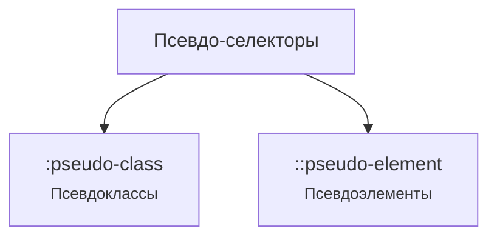

---
title: 3.10. Псевдо-селекторы
---

# 3.10. Псевдо-селекторы

<div class="article-tags">
  <span class="tag tag-required">ОБЯЗАТЕЛЬНО</span>
  <span class="tag tag-beginner">ДЛЯ НОВИЧКОВ</span>
  <span class="tag tag-advanced">НЕ ДЛЯ НОВИЧКОВ</span>
  <span class="tag tag-inprogress">В РАЗРАБОТКЕ</span>
</div>
<span class="complexity-badge">Разработчику</span>
<span class="complexity-badge">Аналитику</span>
<span class="complexity-badge">Тестировщику</span>  
<span class="complexity-badge">Архитектору</span>
<span class="complexity-badge">Инженеру</span>

## Псевдо-селекторы

### Почему псевдо?

Псевдо-селекторы (псевдоклассы и псевдоэлементы) позволяют стилизовать элементы в особых состояниях или определённых частях документа без добавления лишних классов или HTML-разметки, чтобы точечно управлять стилями.



Псевдоклассы ( `:pseudo-class`) в определённом состоянии. Псевдоклассы пишутся с одним двоеточием.

Помните, что такое классы? Теперь представьте, что вы хотите изменить элемент не всегда, а только в определённой ситуации.

Например:
	- Когда пользователь наводит мышку на кнопку.
	- Когда ссылка уже была посещена.
	- Когда это первый элемент в списке.
Для этого используются псевдоклассы.

Они записываются через двоеточие после селектора:
```CSS
a:hover {
    color: orange;
}
```
— это значит: «когда на ссылку наводят мышкой — сделай её оранжевой».

Ещё примеры:
```CSS
p:first-child {
    font-weight: bold;
}
```
— «если абзац — первый среди своих "братьев и сестёр" (соседей), сделай его жирным».

```css
input:focus {
    border: 2px solid green;
}
```
— «когда поле ввода активно (на нём курсор), обведи его зелёной рамкой».

Это способ сказать: «примени стиль, если элемент находится в каком-то особом состоянии или занимает особое положение».

--- 

### Динамические


★ **Динамические (взаимодействие с пользователем)**

| Псевдокласс | Описание | Пример |
| :--- | :---: | ---: |
|`:hover`	|При наведении курсора	|`a:hover { color: red; }`
|`:active`	|В момент клика	|`button:active { opacity: 0.8; }`
|`:focus`	|При фокусе (например, input)	|`input:focus { border-color: blue; }`
|`:visited`	|Посещённая ссылка	|`a:visited { color: purple; }`

---

### Структурные

★ **Структурные (положение в DOM)**

| Псевдокласс | Описание | Пример |
| :--- | :---: | ---: |
|`:first-child`	|Первый дочерний элемент	|`li:first-child { font-weight: bold; }`
|`:last-child`	|Последний дочерний элемент	|`div:last-child { margin-bottom: 0; }`
|`:nth-child(n)`	|Элемент под номером n	|`tr:nth-child(2n) { background: #f5f5f5; }`
|`:not(selector)`	|Все элементы, кроме указанных	|`p:not(.warning) { color: black; }`

---

### Состояния

★ **Состояния элементов**

| Псевдокласс | Описание | Пример |
| :--- | :---: | ---: |
|`:checked`	|Выбранный чекбокс / радио-кнопка	|`input:checked + label { color: green; }`
|`:disabled`	|Отключённый элемент формы	|`button:disabled { opacity: 0.5; }`
|`:empty`	|Пустой элемент (без детей)	|`div:empty { display: none; }`

---

### Псевдоэлементы

Псевдоэлементы `(::pseudo-element)` стилизуют части элемента (например, первую букву или строку). Псевдоэлементы пишутся с двумя двоеточиями.

А теперь представьте, что вы хотите добавить что-то новое, чего нет в HTML. 

Например:
	- Маленькую иконку после каждой ссылки.
	- Кавычки в начале цитаты.
	- Стилизовать только первую букву абзаца.

Вы не хотите ради этого писать лишние теги. Вот тут и помогают псевдоэлементы. Они создают виртуальные части элемента — как будто они есть, но в коде их нет. Записываются через два двоеточия:
```CSS
.quote::before {
    content: "“";
    font-size: 1.5em;
}

.quote::after {
    content: "”";
    font-size: 1.5em;
}
```
— это добавит кавычки в начало и конец любого элемента с классом .quote.

Ещё пример:
```CSS
p::first-letter {
    font-size: 2em;
    float: left;
    margin-right: 5px;
}
```
— «сделай первую букву абзаца большой и обтекаемой».

```CSS
li::marker {
    color: red;
}
```
— «сделай маркер списка (точку или цифру) красным».

Это способ добавить или изменить часть элемента, не меняя HTML. Это как волшебная кисточка, которая рисует что-то сверху, снизу, внутри — там, где физически нет отдельного тега.

Эти инструменты вместе дают полный контроль над тем, как выглядит ваш сайт — от общих форм до мельчайших деталей.

★ Основные псевдоэлементы

| Псевдокласс | Описание | Пример |
| :--- | :---: | ---: |
|`::before`	|Вставляет контент перед элементом	|`.quote::before { content: ""; }`
|`::after`	|Вставляет контент после элемента	|`.link::after { content: ""; }`
|`::first-letter`	|Первая буква элемента	|`p::first-letter { font-size: 2em; }`
|`::first-line`	|Первая строка элемента	|`article::first-line { font-weight: bold; }`
|`::selection`	|Стиль выделенного текста	|`::selection { background: yellow; }`

