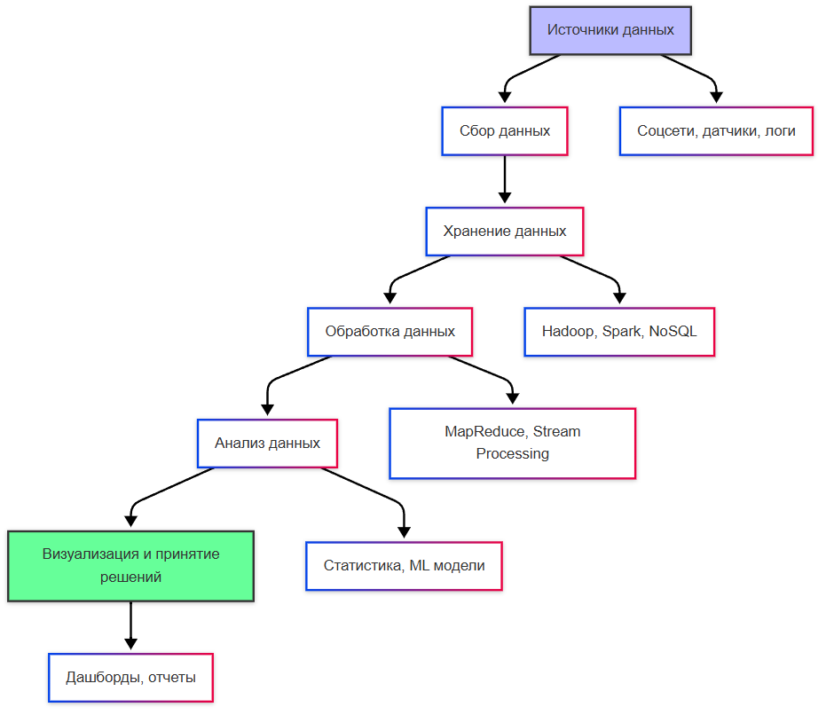
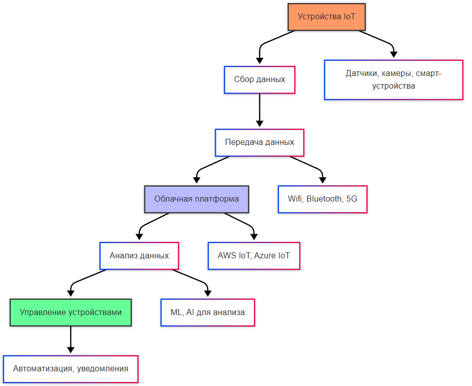

---
title: 3.11. Анализ данных
---

# 3.11. Анализ данных

# Раздел в разработке

Анализ данных — это систематическая процедура преобразования, интерпретации и обобщения информации с целью выявления закономерностей, поддержки принятия решений и формирования стратегических выводов. В отличие от простого хранения или обработки данных, анализ предполагает целенаправленное извлечение знаний из совокупности фактов, измерений или наблюдений.  

Ключевая особенность анализа данных заключается в его направленности на ответ на вопрос: *«Что произошло, почему это произошло, и что может произойти дальше?»* Для этого используются как описательные (descriptive), так и диагностические (diagnostic), прогностические (predictive) и предписывающие (prescriptive) методы анализа. В рамках настоящей главы рассматриваются преимущественно описательные и диагностические подходы — то есть те, которые формируют основу традиционной бизнес-аналитики и поддерживают работу с историческими и агрегированными данными.

### Данные в аналитике: структура, свойства, контекст

В аналитике данные рассматриваются не как отдельные фрагменты, а как элементы контекстуализированных моделей. Такие данные, как правило, уже прошли этап извлечения, трансформации и загрузки (ETL/ELT) и организованы в структуры, оптимизированные для выполнения сложных запросов и многомерного анализа.

Важно различать **операционные данные** и **аналитические данные**:

- **Операционные данные** — это записи, возникающие в ходе повседневной деятельности систем (например, создание заказа, обновление баланса счета, регистрация события на сайте). Они характеризуются высокой частотой изменения, нормализованной структурой и ориентацией на целостность транзакций.
- **Аналитические данные** — это агрегированные, денормализованные или семантически обогащённые представления операционных данных, часто организованные в схемы «звезда» или «снежинка». Они предназначены не для частого обновления, а для масштабируемого и многомерного запроса.

Таким образом, в аналитике данные — это не просто «информация», а *семантически организованная, исторически консистентная, измеримая и интерпретируемая совокупность событий или состояний*, отражающая поведение объектов в бизнес- или технической системе.

---

### Диаграммы и сводка: визуализация как средство анализа

Визуализация данных — неотъемлемая часть аналитического процесса. Диаграммы, графики, карты и сводные таблицы позволяют человеку быстро воспринимать структуру данных, выявлять аномалии, тренды и корреляции. Однако важно понимать, что визуализация — это не самоцель, а инструмент интерпретации.

**Сводка** (в контексте анализа) — это агрегированное представление данных по заданным измерениям. Например, сумма продаж по регионам за квартал является сводкой. Такие сводки формируются на основе агрегатных функций (SUM, AVG, COUNT и т.д.) и группируются по иерархиям измерений (время, география, категория продукта и др.).

Современные инструменты аналитики предоставляют интерактивные сводные отчёты, где пользователь может динамически менять уровни детализации (например, перейти от годового отчёта к месячному), фильтровать по различным измерениям и сравнивать показатели. Эта гибкость реализуется за счёт заранее определённых **семантических моделей**, которые мы рассмотрим далее.

---

### OLTP: основа операционной деятельности

**OLTP** (On-Line Transaction Processing) — это класс информационных систем, предназначенных для обработки транзакций в реальном времени. Основные характеристики OLTP-систем:

- Высокая частота операций чтения и записи.
- Короткие, атомарные транзакции.
- Высокие требования к целостности (ACID-свойства).
- Нормализованная структура данных (обычно 3НФ и выше).
- Оптимизация под скоростной доступ к отдельным записям (по ключу).

Примерами OLTP-систем являются ERP-системы, банковские транзакционные ядра, CRM-платформы и онлайн-магазины. Эти системы обеспечивают стабильную и надёжную фиксацию операционной активности, но не приспособлены для выполнения аналитических запросов — такие запросы могут нарушить производительность OLTP и требуют избыточно сложных SQL-выражений для получения сводной информации.

Именно поэтому в архитектуре информационных систем выделяют отдельный слой — **OLAP**, где данные, извлечённые из OLTP, преобразуются и хранятся для анализа.

---

### OLAP: аналитическая обработка в многомерном пространстве

**OLAP** (On-Line Analytical Processing) — это подход к организации и обработке данных, ориентированный на поддержку сложных аналитических запросов. В отличие от OLTP, OLAP-системы:

- Оптимизированы под чтение, а не под запись.
- Хранят агрегированные и денормализованные данные.
- Используют многомерную модель представления (измерения и меры).
- Поддерживают быстрые переходы между уровнями агрегации (drill-down, roll-up, slice-and-dice).

Основной концептуальной моделью OLAP является **многомерный куб** — гиперпространство, в котором каждая ячейка определяется комбинацией значений измерений и содержит агрегированное значение меры. Например, куб «Продажи» может иметь измерения «Время», «Регион», «Категория товара» и меру «Сумма продаж».

Существуют три основных реализации OLAP:

1. **MOLAP** (Multidimensional OLAP) — данные физически хранятся в многомерных кубах, что обеспечивает максимальную скорость анализа за счёт предварительной агрегации.
2. **ROLAP** (Relational OLAP) — данные остаются в реляционной СУБД, а многомерная логика эмулируется через SQL-запросы.
3. **HOLAP** (Hybrid OLAP) — комбинирует подходы MOLAP и ROLAP для баланса между скоростью и гибкостью.

---

### Семантические модели: абстракция для аналитиков

Семантическая модель — это слой абстрагирования над физическими структурами данных, предназначенный для упрощения доступа к информации для конечного пользователя-аналитика. Такая модель определяет:

- **Таблицы и связи** между ними (логическая структура).
- **Измерения и меры** — семантические категории данных.
- **Иерархии** и **роли** (например, временные иерархии: год → квартал → месяц).
- **Формулы и вычисляемые столбцы**.

Семантическая модель позволяет аналитику формулировать запросы на предметном языке, не зная ни структуры базы данных, ни SQL. Она также обеспечивает единообразие метрик — например, показатель «Чистая прибыль» будет одинаково определён для всех отчётов.

В современных платформах (например, Power BI, Tableau, Looker) семантические модели реализуются как **табличные модели** или **многомерные кубы**.

---

### Многомерные кубы (MOLAP)

Многомерный куб в MOLAP — это специализированная структура данных, в которой каждая комбинация измерений (например, 2024 год, Европа, Электроника) связана с агрегированным значением меры (например, $5 200 000). Преимущества MOLAP:

- Очень высокая производительность аналитических запросов.
- Поддержка сложных агрегаций и расчётов на этапе обработки.
- Встроенная поддержка временных иерархий, валют, альтернативных сценариев.

Недостатки:

- Долгое время обработки при изменении данных (необходима перестройка куба).
- Ограниченная гибкость при работе с детализированными данными (обычно хранится только агрегированная форма).
- Требования к аппаратным ресурсам (в памяти или на диске хранится предварительно вычисленный куб).

MOLAP широко использовался в классических BI-системах (Microsoft Analysis Services в многомерном режиме, Oracle Essbase, IBM Cognos TM1).

---

### Табличные модели (Tabular)

Табличная модель — это современный подход к построению семантических слоёв, основанный на реляционной логике, но расширенной аналитическими возможностями. В отличие от многомерного куба, табличная модель:

- Хранит данные в плоских таблицах, связанных по ключам.
- Использует механизмы инкрементальной обработки и сжатия (например, VertiPaq в Power BI).
- Поддерживает гибкие вычисления через язык DAX.
- Легко масштабируется и интегрируется с современными облачными хранилищами.

Табличные модели стали доминирующим форматом в современных BI-платформах благодаря простоте разработки, гибкости и эффективности. Они особенно хорошо подходят для сценариев self-service analytics, где бизнес-пользователи самостоятельно создают отчёты на основе заранее подготовленной модели.

---

### Язык DAX (Data Analysis Expressions)

**DAX** — это функциональный язык выражений, разработанный Microsoft для аналитических вычислений в контексте табличных моделей. Он используется в Power BI, Analysis Services (Tabular mode) и Excel Power Pivot.

DAX позволяет:

- Определять **вычисляемые столбцы** (рассчитываются при загрузке данных).
- Создавать **меры** — динамические агрегаты, вычисляемые в контексте отчёта.
- Работать с **контекстом фильтрации** и **контекстом строки**.
- Осуществлять временные интеллект-функции (например, сравнение с прошлым периодом — SAMEPERIODLASTYEAR).

Синтаксис DAX близок к Excel, но логически он основан на концепциях реляционной алгебры и многомерного анализа. Например, мера:

```dax
Sales YTD = TOTALYTD(SUM(Sales[Amount]), 'Date'[Date])
```

вычисляет накопленную сумму продаж с начала года на основе даты в таблице 'Date'.  

Ключевая особенность DAX — **контекстно-зависимая семантика**. Результат выражения зависит не только от формулы, но и от фильтров, применённых в визуализации (например, выбранного региона или периода). Это делает DAX мощным, но требует глубокого понимания его механизмов.

---

### Power BI: платформа для современной аналитики

**Power BI** — это платформа бизнес-аналитики от Microsoft, объединяющая инструменты для:

- Подключения к разнообразным источникам данных (SQL Server, Azure, Excel, REST API и др.).
- Моделирования данных с помощью табличных моделей.
- Создания интерактивных отчётов и дашбордов.
- Публикации и совместного использования аналитики через Power BI Service.

Архитектурно Power BI состоит из трёх компонентов:

1. **Power BI Desktop** — среда разработки моделей и отчётов.
2. **Power BI Service** — облачная платформа для публикации, планирования обновлений, управления доступом и создания дашбордов.
3. **Power BI Mobile** — клиенты для iOS, Android и Windows.

Power BI использует движок **VertiPaq** — колоночную СУБД в памяти, обеспечивающую высокую производительность даже при работе с миллиардами строк. Для сложных сценариев поддерживается DirectQuery (прямой запрос к источнику) и Composite Models (гибридный режим).

Важнейшим преимуществом Power BI является тесная интеграция с экосистемой Microsoft: Azure, SQL Server, Excel, Teams, SharePoint. Это делает его особенно привлекательным в корпоративной среде.

### Сравнение OLTP и OLAP: архитектурные и функциональные различия

Хотя OLTP и OLAP служат разным целям, их часто противопоставляют для выявления ключевых архитектурных различий. Такое сопоставление помогает понять, почему в enterprise-архитектурах требуется разделение операционной и аналитической нагрузки.

| Критерий                     | OLTP                              | OLAP                              |
|-----------------------------|-----------------------------------|-----------------------------------|
| **Основная цель**           | Обеспечение целостности транзакций и оперативной обработки событий | Поддержка аналитических запросов и принятия решений |
| **Структура данных**        | Нормализованная (3НФ и выше)      | Денормализованная (звезда, снежинка) |
| **Тип операций**            | Много коротких INSERT/UPDATE/DELETE | Мало, но сложные SELECT с агрегацией |
| **Объём данных в запросе**  | Отдельные строки или небольшие наборы | Миллионы строк, полные таблицы |
| **Частота обновлений**      | Высокая                           | Низкая (часто — пакетная загрузка) |
| **Требования к задержке**   | Миллисекунды (реальное время)     | Секунды–минуты (интерактивный анализ) |
| **Пользователи**            | Операторы, клиенты, системы       | Аналитики, менеджеры, стратеги   |
| **Конкурентность**          | Высокая, с блокировками           | Низкая, параллельное чтение      |

В реальных enterprise-системах данные мигрируют из OLTP в OLAP через промежуточные слои: **операционные хранилища данных (ODS)**, **хранилища данных (Data Warehouse)** и **витрины данных (Data Marts)**. Такая архитектура позволяет:

- Сохранять производительность OLTP-систем.
- Обеспечивать историческую консистентность аналитических данных.
- Централизовать метрики и измерения.
- Поддерживать аудит и репродуцируемость отчётов.

---

### Жизненный цикл аналитического проекта

Анализ данных — это не разовый акт, а процесс, включающий несколько фаз. Типичный жизненный цикл аналитического проекта включает:

1. **Определение бизнес-требований**  
   На этом этапе формулируются цели анализа: какие вопросы нужно ответить, какие метрики важны, кто является конечным потребителем отчёта. Без чёткого понимания бизнес-контекста даже технически безупречная модель окажется бесполезной.

2. **Оценка источников данных**  
   Анализ доступных источников: OLTP-системы, логи, внешние API, файлы. Определяется качество данных, полнота, частота обновления и возможность интеграции.

3. **Проектирование модели данных**  
   Создание логической и физической структуры хранилища или семантической модели. Выбор между MOLAP, табличной моделью, прямым запросом (DirectQuery) и гибридными подходами зависит от требований к производительности, гибкости и поддержке.

4. **Реализация ETL/ELT-процессов**  
   Данные извлекаются, очищаются, трансформируются и загружаются в аналитическую среду. Современные подходы всё чаще используют ELT (загрузка «сырых» данных в облачное хранилище с последующей трансформацией в движке запросов).

5. **Разработка семантической модели и метрик**  
   Определение измерений, мер, иерархий, вычисляемых столбцов и мер на языке DAX или MDX. Особое внимание уделяется семантической однозначности: например, «активный пользователь» должен быть строго определён и единообразно применён.

6. **Создание визуализаций и отчётов**  
   Построение интерактивных дашбордов, сводных таблиц, карт и графиков. Важно соблюдать принципы визуальной грамотности: избегать перегрузки, использовать согласованные цветовые схемы, подписывать оси и единицы измерения.

7. **Тестирование и верификация**  
   Проверка корректности расчётов, согласованности с источниками, воспроизводимости результатов. Часто используется перекрёстная проверка с другими отчётами или ручными расчётами.

8. **Публикация и сопровождение**  
   Развертывание отчётов в production-среде, настройка расписания обновлений, управление доступом, мониторинг производительности. Аналитические модели требуют постоянной поддержки: изменение бизнес-логики, добавление новых источников, оптимизация запросов.

---

### Метрики, KPI и роль данных в стратегическом управлении

Анализ данных становится стратегическим инструментом тогда, когда он связан с **ключевыми показателями эффективности (KPI)**. KPI — это количественные метрики, отражающие достижение стратегических целей организации. Примеры:

- **Выручка** — финансовый KPI.
- **NPS (Net Promoter Score)** — KPI клиентской лояльности.
- **Удержание (Retention Rate)** — KPI в SaaS-бизнесе.
- **Среднее время обработки заявки** — операционный KPI.

Каждый KPI должен удовлетворять критериям **SMART** (Specific, Measurable, Achievable, Relevant, Time-bound) и быть привязан к источнику данных и методике расчёта. Например, «удержание» может определяться как доля пользователей, совершивших повторную покупку в течение 90 дней после первой.

Семантическая модель играет здесь ключевую роль: она обеспечивает **единый источник истины** (single source of truth), исключая расхождения между департаментами. Без такой модели маркетинг может считать активного пользователя по одному правилу, а финансы — по другому, что приводит к противоречивым выводам.

Более того, современные подходы к управлению (например, OKR — Objectives and Key Results) требуют не только измерения KPI, но и их декомпозиции на промежуточные метрики, связанные причинно-следственными связями. Анализ данных позволяет выявлять такие связи — например, как улучшение скорости загрузки сайта влияет на конверсию.


## Big Data

Big Data



### Введение: от данных к Big Data

Понятие *Big Data* возникло не как техническая спецификация, а как концептуальный ответ на качественный и количественный сдвиг в природе цифровой информации. До конца XX века данные в информационных системах имели ограниченный объём, предсказуемую структуру и централизованное происхождение. Они генерировались преимущественно в рамках транзакционных систем, таких как бухгалтерские регистры, банковские операции или инвентарные базы. В этих условиях классические реляционные СУБД и методы аналитической обработки (OLAP) оказывались достаточными для хранения, обработки и извлечения значимой информации.

С развитием интернета, мобильных устройств, сенсорных сетей, социальных платформ и цифровых сервисов характер данных изменился кардинально. Появились потоки информации, которые отличались не только масштабом, но и скоростью поступления, разнородностью форматов и неопределённостью качества. Именно в этом контексте и возникло понятие **Big Data** — не просто «большие объёмы данных», а совокупность условий, при которых традиционные методы управления данными становятся неэффективными или неприменимыми.

Big Data — это не технология и не продукт, а **парадигма**, в рамках которой переосмысливаются принципы сбора, хранения, обработки, анализа и интерпретации данных. Эта парадигма базируется на нескольких фундаментальных характеристиках, исторически получивших обозначение **V-модель** (от англ. *V-attributes*), и на новых архитектурных подходах к построению вычислительных систем.

---

### Характеристики Big Data: V-модель

#### 1. **Volume** — объём

Объём является наиболее очевидной, но не единственной характеристикой Big Data. Если в 1990-е годы терабайт данных считался экстремальным объёмом, то сегодня организация может генерировать и обрабатывать экзабайты информации ежедневно. Например, социальные сети ежесекундно обрабатывают миллионы постов, изображений, видео и метаданных о поведении пользователей. Спутниковые системы дистанционного зондирования Земли производят петабайты данных в день.

Однако важно понимать, что Big Data — это не абсолютный порог объёма, а **относительное состояние**, при котором объём данных превышает возможности традиционных систем хранения и обработки с точки зрения производительности, стоимости или масштабируемости.

#### 2. **Velocity** — скорость

Скорость поступления и обработки данных — ключевой аспект Big Data. В отличие от пакетной обработки (batch processing), где данные собираются, а затем анализируются с задержкой, в условиях Big Data часто требуется **обработка в реальном времени** (stream processing). Примеры: фрод-детекция в банковских транзакциях, мониторинг сетевого трафика, управление автономными транспортными средствами.

Velocity определяет не только частоту поступления событий, но и требования к времени реакции системы: от микросекунд в высокочастотном трейдинге до минут в системах мониторинга инфраструктуры.

#### 3. **Variety** — разнородность

Традиционные СУБД работают с **структурированными данными**: таблицами с предопределённой схемой. Big Data, напротив, включает **полуструктурированные** (JSON, XML, логи) и **неструктурированные** (аудио, видео, текстовые документы, изображения) форматы. Системы Big Data должны обеспечивать гибкость в обработке этих форматов без предварительной нормализации или строгой типизации.

Эта характеристика породила развитие технологий NoSQL, таких как документные базы (MongoDB), колоночные хранилища (Cassandra, HBase), графовые базы (Neo4j) и ключ-значение хранилища (Redis, DynamoDB).

#### 4. **Veracity** — достоверность

Veracity отражает **степень доверия к данным**. В условиях Big Data данные могут быть шумными, неполными, противоречивыми или содержать ошибки. Пример: показания датчиков IoT могут быть искажены внешними помехами; пользовательские отзывы в соцсетях могут быть сгенерированы ботами; данные из открытых источников могут быть устаревшими.

Учёт veracity требует внедрения методов **очистки данных** (data cleansing), **валидации**, **фузии источников** и **оценки неопределённости**. Без учёта этого атрибута выводы, сделанные на основе Big Data, могут оказаться ошибочными, несмотря на высокую статистическую значимость.

#### 5. **Value** — ценность

Big Data сам по себе не создаёт ценности. Ценность возникает **только в результате осмысленной интерпретации и практического применения**. Например, данные о геолокации мобильных устройств могут быть использованы для оптимизации городского транспорта, но без правильной модели анализа они останутся лишь массивом координат и временных меток.

Value подчёркивает необходимость тесной интеграции технологий Big Data с предметной областью: бизнес-аналитикой, медициной, логистикой, наукой. Это также акцентирует роль **научной строгости** в построении моделей машинного обучения и статистического вывода.

> **Примечание**: В литературе иногда упоминаются дополнительные V-характеристики — например, **Variability** (вариативность — изменение форматов и семантики во времени), **Visualization** (визуализация как средство интерпретации), **Volatility** (временная устойчивость данных). Однако ядром остаются первые пять, так как они охватывают основные вызовы, с которыми сталкиваются системы Big Data.

---

### Архитектурные основы: от монолита к распределённым системам

Классическое клиент-серверное взаимодействие и централизованные СУБД не масштабируются линейно. Проблема заключается не только в ёмкости дисковой памяти, но и в вычислительной сложности операций, задержках ввода-вывода и сетевых узких местах. Решение заключается в переходе к **горизонтальному масштабированию** (scale-out) — добавлению узлов в кластер вместо увеличения мощности отдельного сервера.

Ключевой концепцией, позволившей реализовать масштабируемость Big Data, стал **MapReduce** — программная модель, предложенная Google в 2004 году. Она разделяет задачу обработки на две фазы:

- **Map**: параллельная трансформация входных данных в пары «ключ-значение».
- **Reduce**: агрегация значений по ключам.

Эта модель лежит в основе **Apache Hadoop** — экосистемы, включающей распределённую файловую систему (HDFS) и движок выполнения заданий (YARN). Hadoop позволил обрабатывать петабайты данных на недорогом commodity-оборудовании, что стало прорывом в демократизации аналитики.

Однако MapReduce оказался неэффективен для итеративных алгоритмов (например, машинного обучения) и интерактивных запросов. Это привело к появлению **Apache Spark** — фреймворка, в котором данные могут храниться в памяти между операциями, что даёт ускорение до 100 раз по сравнению с дисковыми операциями Hadoop.

Современная архитектура Big Data — это **многоуровневый конвейер** (data pipeline), включающий:

1. **Источники данных** (sensors, logs, APIs, databases, streams).
2. **Системы инжеста** (Apache Kafka, Apache NiFi, AWS Kinesis) — для буферизации и маршрутизации потоков.
3. **Хранилища**:
   - «Озеро данных» (data lake) — необработанные, неструктурированные данные.
   - «Хранилище данных» (data warehouse) — очищенные, структурированные данные для анализа.
4. **Средства обработки** (Spark, Flink, Beam) — как пакетные, так и потоковые.
5. **Слой аналитики и визуализации** (BI-инструменты, ML-модели, дашборды).

Такой подход позволяет гибко адаптироваться под требования различных сценариев: предиктивная аналитика, реальное время, историческое моделирование.


### Интернет вещей

Интернет вещей (IoT)



### Интернет вещей как генератор Big Data

Интернет вещей (Internet of Things, IoT) представляет собой одну из наиболее значимых категорий источников Big Data. Под IoT понимается сеть физических объектов — от промышленных датчиков до бытовых устройств, — оснащённых вычислительными модулями, возможностью передачи данных и, зачастую, автономным питанием. Каждый такой объект генерирует непрерывный поток временных рядов: температура, давление, геолокация, состояние оборудования, энергопотребление и т.п.

Характеристики данных от IoT-устройств соответствуют всем пяти V-атрибутам Big Data в крайней степени:

- **Volume**: миллионы устройств, каждое из которых может отправлять данные каждые несколько миллисекунд.
- **Velocity**: требуется обработка в реальном времени для детекции аномалий или управления процессами.
- **Variety**: данные могут поступать в бинарных протоколах (MQTT, CoAP), сериализованных форматах (Protobuf, Avro) или через REST-интерфейсы.
- **Veracity**: датчики подвержены шуму, сбоям, дрейфу калибровки.
- **Value**: ценность заключается в извлечении паттернов поведения, предиктивном обслуживании (predictive maintenance), оптимизации ресурсов.

Важно отметить, что архитектура IoT-систем предполагает **иерархию обработки**: от edge-вычислений (фильтрация и агрегация на устройстве или шлюзе) до cloud-аналитики (глобальное моделирование). Такой подход снижает нагрузку на сеть и обеспечивает устойчивость при временной потере соединения.

---

### Цикл работы с большими данными: от сбора до сводки

Обработка Big Data не сводится к запуску аналитических скриптов. Это строго регламентированный **жизненный цикл данных**, включающий следующие этапы:

#### 1. Сбор (Data Ingestion)

Сбор данных — это не просто копирование файлов. Это управляемый процесс **инжеста**, в котором решаются вопросы:

- **Синхронизации источников**: как обеспечить целостность при частичном сбое?
- **Сериализации**: выбор формата (JSON, Parquet, ORC), баланс между читаемостью и компактностью.
- **Буферизации**: использование очередей сообщений (Kafka, RabbitMQ) для декуплирования производителей и потребителей данных.

Особое внимание уделяется **idempotency** — свойству операции, при котором повторный вызов не изменяет результат. Это критично в распределённых системах с возможными повторными отправками сообщений.

#### 2. Хранение

Существует принципиальное различие между **data lake** и **data warehouse**:

- **Data lake** — централизованное хранилище «сырых» данных в их исходной форме. Поддерживает любые форматы. Основная цель — сохранение информации без предварительного отбора.
- **Data warehouse** — структурированное, оптимизированное под аналитические запросы (OLAP) хранилище. Данные проходят ETL (Extract, Transform, Load) или ELT (Extract, Load, Transform).

Современные платформы, такие как **Delta Lake** или **Apache Iceberg**, стремятся устранить этот разрыв, обеспечивая ACID-свойства, версионирование и поддержку потоковой инжестии поверх файловых систем (например, Amazon S3 или HDFS).

#### 3. Обработка

Обработка делится на две парадигмы:

- **Batch processing** — обработка больших объёмов данных с задержкой. Подходит для исторического анализа, генерации отчётов, обучения моделей. Реализуется через Hadoop MapReduce, Apache Spark, Apache Flink (в batch-режиме).
- **Stream processing** — обработка непрерывных потоков с минимальной задержкой. Используется в системах мониторинга, фрод-детекции, телеметрии. Реализуется через Apache Kafka Streams, Apache Flink, Spark Streaming, Google Cloud Dataflow.

Выбор парадигмы определяется бизнес-требованиями к **latency** (времени от события до реакции) и **throughput** (количеству событий в секунду).

#### 4. Анализ и сводка

На этом этапе данные превращаются в знания. Анализ может быть:

- **Описательным** (что произошло? — дашборды, отчёты),
- **Диагностическим** (почему произошло? — корреляционный анализ),
- **Предиктивным** (что произойдёт? — машинное обучение),
- **Прескриптивным** (что делать? — оптимизация решений).

Сводка (aggregation) — ключевой метод уменьшения объёма: суммирование, усреднение, группировка по измерениям. Однако при работе с Big Data важно учитывать **статистическую репрезентативность**: агрегированные метрики могут скрывать важные выбросы или субпопуляции.

---

### Распределённые системы обработки данных: Hadoop и Spark

#### Apache Hadoop

Hadoop — это не единый продукт, а экосистема, включающая:

- **HDFS (Hadoop Distributed File System)** — отказоустойчивая файловая система, разделяющая файлы на блоки (по умолчанию 128 МБ), реплицируемые по узлам кластера.
- **MapReduce** — модель программирования, реализующая принцип «вычисления перемещаются к данным», что минимизирует сетевой трафик.
- **YARN (Yet Another Resource Negotiator)** — менеджер ресурсов, позволяющий запускать не только MapReduce, но и другие фреймворки (Spark, Flink) на одном кластере.

Hadoop оказался революционным, но его недостатки — высокая задержка, зависимость от дисковой I/O, сложность написания логики — ограничили применение в интерактивных сценариях.

#### Apache Spark

Spark устраняет ключевые ограничения Hadoop за счёт:

- **In-memory вычислений**: промежуточные данные хранятся в оперативной памяти, что ускоряет итеративные алгоритмы (например, k-means, градиентный спуск).
- **Единой модели выполнения**: один движок поддерживает batch, streaming, SQL, machine learning (MLlib) и графовые вычисления (GraphX).
- **Высокоуровневых API** на Scala, Java, Python и R, что снижает порог входа.

Spark не заменяет Hadoop, а дополняет его: он может использовать HDFS как хранилище, но не требует MapReduce. Современные архитектуры часто комбинируют обе технологии в зависимости от задачи.

---

### Роль SQL и NoSQL в экосистеме Big Data

#### SQL в Big Data

Несмотря на доминирование NoSQL в ранних решениях Big Data, **SQL сохраняет своё значение** как стандарт декларативного запроса. Современные движки предоставляют SQL-интерфейсы поверх распределённых данных:

- **Apache Hive** — позволяет выполнять SQL-подобные запросы (HiveQL) над HDFS через MapReduce или Tez.
- **Apache Spark SQL** — интегрирован в Spark, поддерживает оптимизацию запросов через Catalyst и генерацию кода.
- **Presto/Trino**, **Apache Druid**, **ClickHouse** — аналитические СУБД, оптимизированные для быстрых агрегаций по большим объёмам.

SQL здесь выступает не как язык для транзакций, а как **инструмент бизнес-аналитики**, позволяющий аналитикам работать с Big Data без глубокого знания распределённых вычислений.

#### NoSQL в Big Data

NoSQL-системы возникли как реакция на ограничения реляционной модели в условиях масштабируемости и гибкости схемы. В Big Data они выполняют следующие роли:

- **Хранение неструктурированных данных**: документные базы (MongoDB) — для JSON-объектов.
- **Высокая пропускная способность записи**: колоночные базы (Cassandra, ScyllaDB) — для временных рядов, логов.
- **Сложные связи**: графовые базы (Neo4j, Amazon Neptune) — для анализа социальных сетей, рекомендаций.
- **Кэширование и быстрый доступ**: ключ-значение хранилища (Redis, DynamoDB).

Важно понимать: NoSQL — это не «анти-SQL», а **альтернативная модель данных**, оптимизированная под конкретные паттерны доступа. Выбор между SQL и NoSQL определяется семантикой задачи, а не модой.

---

### Машинное обучение и искусственный интеллект в контексте Big Data

Big Data и машинное обучение (ML) находятся в симбиотическом отношении: большие объёмы данных питают сложные модели, а модели извлекают из данных скрытые закономерности.

#### Обучение на распределённых данных

Классические ML-библиотеки (scikit-learn) работают в памяти одного узла. В Big Data требуется **распределённое обучение**:

- **Apache Spark MLlib** — реализует алгоритмы (линейная регрессия, случайный лес, k-means) с распределённой обработкой данных.
- **Horovod**, **TensorFlow Distributed**, **PyTorch DDP** — фреймворки для параллельного обучения нейросетей на GPU-кластерах.
- **Federated Learning** — парадигма, при которой модель обучается локально на устройствах (например, смартфонах), а обмениваются только градиенты, что защищает приватность.

#### Проблемы качества и интерпретируемости

Работа с Big Data усиливает риски:

- **Переобучение**: при большом числе признаков модель может «запомнить» шум.
- **Смещение данных (bias)**: если данные собраны из несбалансированных источников (например, только из одного региона), модель будет ошибаться на других популяциях.
- **Отсутствие интерпретируемости**: глубокие нейросети часто работают как «чёрный ящик», что недопустимо в медицине, финансах, праве.

Поэтому в промышленных системах Big Data всё чаще применяются методы **объяснимого ИИ (XAI)**: SHAP, LIME, feature importance, а также **мониторинг дрейфа данных** (data drift) в production.


## Data Science

### **1. Data Science как научно-прикладная дисциплина**

Data Science (наука о данных) представляет собой междисциплинарную область, объединяющую методы статистики, информатики, математического моделирования и предметной экспертизы для извлечения знаний и измеримых представлений из структурированных и неструктурированных данных. В отличие от классической статистики, ориентированной преимущественно на проверку гипотез и интерпретацию, Data Science акцентирует внимание на предсказательной способности моделей, масштабируемости вычислений и автоматизации анализа в условиях больших объёмов данных.

Основной объект изучения Data Science — данные в их разнообразных формах: числовые, категориальные, временные ряды, тексты, изображения, графы. Цель — не просто описать данные, а построить модели, способные обобщать закономерности и применять их к новым, ранее не наблюдавшимся наблюдениям.

Ключевые компоненты Data Science как дисциплины:
- **Сбор и подготовка данных** (data wrangling, curation, engineering),
- **Исследовательский анализ данных** (Exploratory Data Analysis, EDA),
- **Построение и валидация моделей** (машинное обучение, статистическое моделирование),
- **Визуализация и интерпретация результатов**,
- **Интеграция выводов в бизнес-процессы или автоматизированные системы**.

Data Science не сводится к применению готовых алгоритмов. Это системная инженерно-аналитическая деятельность, требующая понимания как математических основ, так и инфраструктурных ограничений реальных систем обработки данных.

---

### **2. Роли в экосистеме данных: кто делает что**

В современной практике Data Science редко реализуется одним специалистом. Вместо этого формируется распределённая команда, в которой каждая роль отвечает за определённый этап жизненного цикла данных.

#### **2.1. Настоящий Data Scientist**

Data Scientist — специалист, который формулирует исследовательские и прикладные задачи, разрабатывает модели машинного обучения, проводит статистический анализ и интерпретирует результаты в контексте предметной области. Его работа включает:
- постановку гипотез на основе бизнес-требований,
- выбор и адаптацию методов моделирования,
- оценку качества моделей с использованием метрик и статистических тестов,
- документирование и представление выводов заинтересованным сторонам.

Ключевая компетенция — способность «читать» данные не как набор чисел, а как отражение реальных процессов, сопровождаемых шумом, смещениями и ограничениями. Настоящий Data Scientist понимает границы применимости моделей и не подменяет корреляцию причинностью без дополнительных обоснований.

#### **2.2. Data Engineer**

Data Engineer (инженер данных) отвечает за построение и поддержку инфраструктуры, обеспечивающей надёжный, масштабируемый и своевременный доступ к данным. Его задачи включают:
- проектирование и управление конвейерами данных (data pipelines),
- интеграцию источников данных (лог-файлы, базы данных, API, IoT-устройства),
- обеспечение качества и целостности данных на этапе загрузки и трансформации (ETL/ELT),
- оптимизацию запросов и хранения для аналитических нагрузок.

Без работы инженеров данных аналитики и учёные работают с неполными, устаревшими или некорректно агрегированными данными, что делает любые выводы недостоверными. Data Engineer — архитектор «магистралей данных», по которым информация поступает к конечным потребителям.

#### **2.3. Data Architect**

Data Architect (архитектор данных) отвечает за стратегическое проектирование структуры данных на уровне всей организации или проекта. В отличие от инженера, который реализует конкретные пайплайны, архитектор определяет:
- общую модель данных (conceptual, logical, physical),
- принципы нормализации и денормализации,
- подходы к управлению метаданными, версионированию и каталогизации,
- соответствие требованиям регуляторных стандартов (GDPR, HIPAA и др.).

В Big Data-проектах, где задействованы распределённые хранилища (data lakes, data warehouses, lakehouses), архитектор определяет, как данные будут организованы, как будет обеспечена их согласованность между слоями (raw, curated, semantic), и как будут обеспечиваться производительность и безопасность. Роль критически важна при переходе от пилотных моделей к производственным системам.

#### **2.4. Data Analyst**

Data Analyst (аналитик данных) фокусируется на описательной статистике и отчётности. Его задача — превратить сырые данные в понятные метрики, выявить тренды, аномалии и зависимости с помощью визуализаций и интерактивных дашбордов. Часто использует BI-инструменты (Tableau, Power BI, Looker).  
Хотя аналитик может применять базовые статистические методы, он редко строит предсказательные модели. Его работа важна для оперативного принятия решений и мониторинга ключевых показателей эффективности (KPI).

#### **2.5. ML-инженер (Machine Learning Engineer)**

ML-инженер занимается промышленным развёртыванием моделей машинного обучения. Он обеспечивает:
- интеграцию моделей в production-среду,
- масштабирование и мониторинг их работы,
- управление версиями моделей и данных (MLOps),
- обеспечение воспроизводимости и тестируемости.

Если Data Scientist отвечает за «научную новизну», то ML-инженер — за «инженерную надёжность». Часто именно он реализует конвейеры обучения, автоматизацию переобучения и обработку входных данных в реальном времени.

#### **2.6. BI-специалист и архитектор аналитики**

BI-специалист (Business Intelligence) строит семантические слои над хранилищами данных, разрабатывает кубы, измерения и метрики, которые аналитики используют без знания SQL. В крупных организациях BI-архитектор определяет, как бизнес-логика будет отражена в структуре данных, чтобы пользователи разных отделов могли получать согласованные отчёты.


### **3. Математические и программные основы анализа данных**

Для эффективной работы с данными необходима строгая формальная база, позволяющая оперировать наблюдениями как математическими объектами. Современные инструменты Data Science реализуют эту базу в виде высокоуровневых библиотек, скрывающих сложность низкоуровневых операций, но сохраняющих их логическую структуру.

#### **3.1. NumPy: основа численных вычислений в Python**

Библиотека **NumPy** (Numerical Python) является фундаментом экосистемы научных вычислений в Python. Она вводит тип данных **ndarray** — многомерный массив однородных элементов, размещаемый в непрерывном блоке памяти и оптимизированный для векторизованных операций. В отличие от встроенных списков Python, ndarray обеспечивает:
- фиксированный тип элементов (например, `float64`, `int32`),
- отсутствие накладных расходов на динамическую типизацию,
- параллельное выполнение арифметических операций без явных циклов.

Эффективность NumPy достигается за счёт реализации критических операций на языках C и Fortran, а также интеграции с BLAS/LAPACK — стандартными библиотеками линейной алгебры.

#### **3.2. Векторы и матрицы как представление данных**

В Data Science данные почти всегда организуются в виде **матриц наблюдений**. Каждая строка матрицы соответствует отдельному объекту (наблюдению, экземпляру), а каждый столбец — признаку (переменной, feature). Например, в задаче предсказания цен на недвижимость строка может представлять дом, а столбцы — его площадь, количество комнат, год постройки и т.д.

Формально:
- **Вектор** — одномерный массив, используемый для представления одного признака (например, вектор цен) или одного наблюдения в признаковом пространстве.
- **Матрица** — двумерный массив, объединяющий множество наблюдений по множеству признаков.

Такое представление позволяет применять мощные методы линейной алгебры: умножение матриц для трансформаций признаков, разложение по сингулярным числам (SVD) для снижения размерности, решение систем линейных уравнений в методе наименьших квадратов.

#### **3.3. Broadcasting: обобщение операций над массивами разной формы**

Одной из ключевых особенностей NumPy является механизм **broadcasting** — автоматического приведения массивов разной формы к совместимому виду для выполнения поэлементных операций. Например, при сложении матрицы размера `(m, n)` и вектора длины `n`, вектор «распространяется» по строкам матрицы без фактического копирования памяти.

Правила broadcasting:
1. Выравнивание размерностей справа налево.
2. Совместимость по размеру в каждом измерении: либо размеры равны, либо один из них равен 1.
3. Результирующая форма — максимум по каждому измерению.

Этот механизм позволяет писать компактный и читаемый код, избегая явных циклов, и при этом сохранять высокую производительность.

---

### **4. pandas: структурированная работа с табличными данными**

Если NumPy предоставляет низкоуровневую числовую основу, то библиотека **pandas** добавляет высокоуровневую семантику, ориентированную на **табличные данные**. Её центральные структуры:
- **Series** — одномерный индексированный массив с метками (аналог вектора с именованными элементами),
- **DataFrame** — двумерная таблица с именованными столбцами и индексом строк (аналог электронной таблицы или SQL-таблицы).

pandas обеспечивает:
- гибкую индексацию и срезы (`.loc`, `.iloc`),
- обработку пропущенных значений (`NaN`),
- агрегацию и группировку (`groupby`),
- объединение таблиц (`merge`, `join`),
- работу с временными рядами (периоды, частоты, сдвиги).

Важно подчеркнуть: хотя pandas удобен для EDA и прототипирования, он не оптимизирован для работы с данными, не помещающимися в оперативную память. Для таких случаев используются распределённые альтернативы.

---

### **5. Датасет: структура, контекст и этика**

**Датасет** (dataset) — это не просто файл в формате CSV или Parquet. Это **семантически насыщенный объект**, включающий:
- сами данные (наблюдения и признаки),
- метаданные (описание признаков, единицы измерения, источники),
- контекст сбора (время, условия, инструменты),
- ограничения на использование (лицензии, конфиденциальность).

Качество анализа напрямую зависит от качества датасета. Наличие смещений (bias) в данных — например, недостаточное представительство определённых групп — приводит к несправедливым или опасным выводам. Поэтому современный Data Scientist обязан не только анализировать данные, но и критически оценивать их происхождение, полноту и релевантность.

---

### **6. PySpark и распределённые вычисления**

Когда объём данных превышает возможности одной машины, применяются **распределённые вычислительные фреймворки**. **Apache Spark** — один из наиболее распространённых инструментов для обработки больших данных. Его Python-интерфейс — **PySpark** — предоставляет API, во многом похожий на pandas, но работающий на кластере.

Ключевые концепции Spark:
- **Resilient Distributed Dataset (RDD)** — неизменяемая коллекция объектов, распределённая по узлам кластера. RDD лениво вычисляется и автоматически восстанавливается при сбоях.
- **DataFrame API** — более высокоуровневый и оптимизированный интерфейс поверх Catalyst optimizer, позволяющий писать декларативные запросы.
- **Lazy evaluation** — операции не выполняются немедленно, а строят план выполнения (DAG), который оптимизируется и запускается только при вызове действия (action), например `.count()` или `.write()`.

#### **6.1. Spark SQL**

Spark SQL позволяет выполнять SQL-запросы над распределёнными данными, включая данные в форматах Parquet, JSON, Avro. Это особенно полезно при интеграции с существующими хранилищами и при работе с аналитиками, привыкшими к SQL. Spark SQL транслирует запросы в те же оптимизированные физические планы, что и DataFrame API.

Преимущество распределённых вычислений — не только в масштабируемости, но и в возможности обработки потоковых данных (Spark Streaming), выполнения графовых алгоритмов (GraphX) и машинного обучения (MLlib).

### **7. Типология переменных: семантика, структура и логические взаимосвязи**

Понимание природы переменных — фундамент корректного анализа. Ошибка в интерпретации роли переменной ведёт к неверным выводам, неустойчивым моделям и, в крайних случаях, к принятию деструктивных решений. Ниже рассматриваются ключевые категории переменных, используемых в Data Science, с акцентом на их формальные свойства и практические последствия.

#### **7.1. Независимые и зависимые переменные**

В контексте статистического моделирования и машинного обучения различают:
- **Зависимую переменную** (dependent variable, target, response) — величину, которую модель пытается предсказать или объяснить. Обозначается как `y`.
- **Независимые переменные** (independent variables, features, predictors, explanatory variables) — признаки, используемые для построения предсказания.

Важно: термины «независимая» и «зависимая» не подразумевают причинно-следственной связи сами по себе. Они отражают лишь роль переменных в рамках конкретной модели. Установление причинности требует дополнительных предпосылок: рандомизации, контроля конфаундеров, теоретической обоснованности.

#### **7.2. Спутывающие (конфаундерные) и коррелированные переменные**

**Корреляция** — статистическая мера линейной зависимости между двумя переменными. Высокая корреляция не означает, что одна переменная «влияет» на другую. Например, продажи мороженого и число укусов акул положительно коррелированы, но обе зависят от третьей переменной — времени года (лето).

**Спутывающая переменная** (confounding variable, confounder) — это переменная, которая одновременно влияет и на независимую, и на зависимую переменную, создавая ложную ассоциацию между ними. Если такой фактор не контролируется, наблюдаемая связь может быть полностью или частично артефактом.

Пример: в исследовании связи между кофепитием и сердечными заболеваниями может возникнуть ложная корреляция, если не учитывать стресс — фактор, который повышает и потребление кофе, и риск заболеваний.

#### **7.3. Контрольные переменные**

**Контрольная переменная** — признак, включаемый в модель не как основной предиктор, а для устранения влияния потенциальных конфаундеров. Например, при анализе эффективности препарата в регрессионной модели могут быть включены возраст, пол и сопутствующие заболевания как контрольные переменные.

Использование контрольных переменных позволяет «изолировать» эффект интересующего фактора от внешних влияний, приближая анализ к условию эксперимента.

#### **7.4. Латентные (скрытые) переменные**

**Латентная переменная** — величина, которая не наблюдается напрямую, но предполагается как причина наблюдаемых данных. Примеры:
- «интеллект» в психометрии (измеряется через тесты),
- «потребительский интерес» в рекомендательных системах (выводится из кликов и покупок),
- «тематика документа» в анализе текстов (определяется через частоты слов).

Модели, работающие с латентными переменными (например, факторный анализ, тематическое моделирование LDA, вариационные автоэнкодеры), позволяют извлекать скрытые структуры из данных, но требуют осторожной интерпретации: латентные факторы — это математические конструкции, а не обязательно реальные сущности.

#### **7.5. Переменные взаимодействия**

**Переменная взаимодействия** (interaction term) — производный признак, представляющий собой произведение (или другую комбинацию) двух или более исходных переменных. Она моделирует ситуацию, когда эффект одной переменной зависит от значения другой.

Например, эффект рекламы на продажи может быть сильнее для новых клиентов, чем для постоянных. Тогда в модель вводится терм `{реклама}x{новый_клиент}`. Без учёта взаимодействий модель будет давать усреднённые, неточные предсказания.

#### **7.6. Стационарные и нестационарные переменные**

Понятие стационарности особенно важно при работе с **временными рядами**.

- **Стационарная переменная** — процесс, статистические свойства которого (среднее, дисперсия, автокорреляция) не изменяются во времени. Многие методы прогнозирования (ARIMA, линейные модели) предполагают стационарность или требуют её достижения (например, через дифференцирование).
- **Нестационарная переменная** — процесс с трендом, сезонностью или изменяющейся дисперсией. Прямое применение классических моделей к нестационарным данным приводит к переобучению и неустойчивым прогнозам.

Проверка стационарности осуществляется с помощью тестов (например, Дики–Фуллера), а преобразование — через сглаживание, логарифмирование, разностное преобразование.

#### **7.7. Отставшие (лаговые) переменные**

**Отставшая переменная** (lagged variable) — значение признака в предыдущий момент времени.

Лаги используются:
- для моделирования инерции процессов (вчера было жарко → сегодня кондиционеры включены),
- в авторегрессионных моделях (AR, VAR),
- для создания признаков в задачах прогнозирования.

Наличие лагов позволяет моделям учитывать исторический контекст, но требует осторожности: чрезмерное количество лагов может привести к мультиколлинеарности и переобучению.

#### **7.8. Утечка переменных (data leakage)**

**Утечка данных** — одна из самых опасных и трудноуловимых ошибок в Data Science. Она возникает, когда в обучающий набор попадает информация, которая на практике будет недоступна на момент предсказания.

Примеры:
- использование среднего значения по всему датасету для нормализации до разделения на train/test,
- включение в признаки данных о будущем (например, итоговый счёт матча при предсказании исхода в его середине),
- использование идентификаторов клиентов, которые коррелируют с целевой переменной.

Утечка создаёт иллюзию высокой точности модели, но такая модель бесполезна в production. Профилактика — строгое разделение данных на этапе проектирования пайплайна и аудит признаков на предмет «временной корректности».

---

### **8. Типы данных в Data Science**

Переменные в Data Science классифицируются не только по роли, но и по **шкале измерения** и **структуре значений**:

1. **Числовые (количественные)**:
   - *Непрерывные*: вещественные числа (температура, цена).
   - *Дискретные*: целые числа (количество заказов, число детей).

2. **Категориальные (качественные)**:
   - *Номинальные*: категории без порядка (цвет, страна).
   - *Порядковые (ординальные)*: категории с естественным порядком (оценка от 1 до 5, уровень образования).

3. **Бинарные**: частный случай категориальных с двумя значениями (да/нет, 0/1).

4. **Текстовые**: последовательности символов, требующие специальной обработки (токенизация, векторизация).

5. **Временные**: дата, время, временные метки. Часто преобразуются в числовые признаки (день недели, час суток, количество дней с события).

6. **Геопространственные**: координаты, регионы, карты. Могут кодироваться как числовые пары (широта/долгота) или через эмбеддинги.

Выбор методов обработки, кодирования и моделирования напрямую зависит от типа данных. Например, категориальные признаки требуют one-hot или target-encoding, а временные — создания циклических признаков (через синус и косинус).
