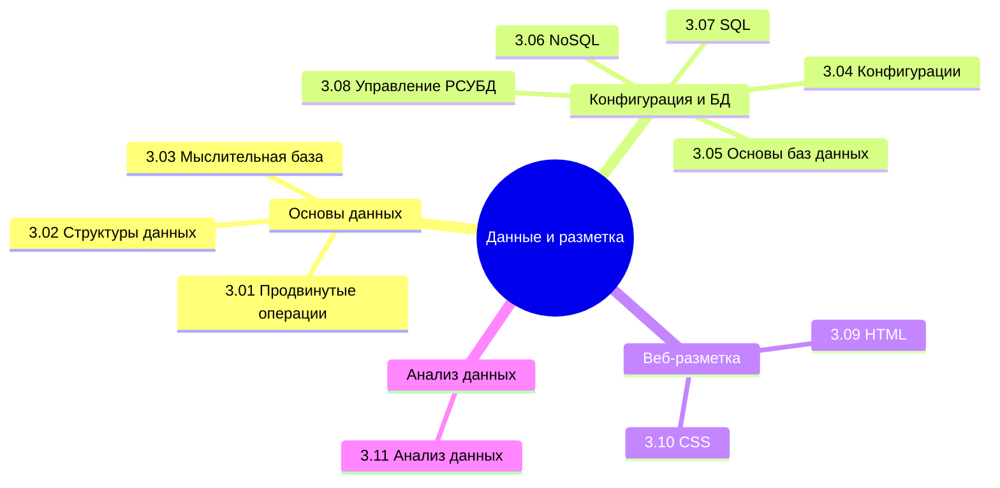

## Оглавление

Вы ещё не забыли, что такое информация и данные? А типы данных? Если забыли, непременно вернитесь и повторите. Сейчас нам придётся заняться ими вплотную.

Вообще, лучше воспользуйтесь содержанием или перейдите к Базе знаний. Но для удобства, я размещу здесь ссылки на основные главы раздела:

<ul>
  <li><a href="/encyclopedia/Данные%20и%20разметка/3.01.%20Продвинутые%20операции%20с%20данными/1">3.01. Продвинутые операции с данными</a></li>
  Операции, выходящие за рамки базовой обработки.
  
  <li><a href="/encyclopedia/Данные%20и%20разметка/3.02.%20Структуры%20данных/1">3.02. Структуры данных</a></li>
  Классификация и свойства основных структур: массивы, списки, стеки, очереди, хэш-таблицы, деревья, графы. Оценка эффективности использования в зависимости от задачи.
  
  <li><a href="/encyclopedia/Данные%20и%20разметка/3.03.%20Мыслительная%20база/1">3.03. Мыслительная база</a></li>
  Формирование алгоритмического мышления: декомпозиция задач, моделирование данных, проектирование логики, выбор оптимальных подходов к обработке информации.
  
  <li><a href="/encyclopedia/Данные%20и%20разметка/3.04.%20Конфигурации%20и%20данные/1">3.04. Конфигурации и данные</a></li>
  Разделение кода и конфигурационных параметров. Форматы хранения конфигураций (JSON, YAML, XML, .env), управление окружениями, безопасность чувствительных данных.
  
  <li><a href="/encyclopedia/Данные%20и%20разметка/3.05.%20Основы%20баз%20данных/1">3.05. Основы баз данных</a></li>
  Понятие базы данных, её роль в информационных системах. Типы СУБД, модели данных, транзакции, целостность, репликация, отказоустойчивость на концептуальном уровне.
  
  <li><a href="/encyclopedia/Данные%20и%20разметка/3.06.%20NoSQL/1">3.06. NoSQL</a></li>
  Архитектурные принципы нереляционных баз данных: документоориентированные, ключ-значение, колоночные, графовые. Преимущества при масштабировании и работе с неструктурированными данными.
  
  <li><a href="/encyclopedia/Данные%20и%20разметка/3.07.%20SQL/1">3.07. SQL</a></li>
  Язык структурированных запросов: синтаксис, DML и DDL-операции, соединения таблиц, подзапросы, агрегатные функции. Роль SQL в управлении реляционными данными.
  
  <li><a href="/encyclopedia/Данные%20и%20разметка/3.08.%20Управление%20РСУБД/1">3.08. Управление РСУБД</a></li>
  Практические аспекты администрирования реляционных систем: создание и настройка экземпляров, пользователи и права доступа, резервное копирование, мониторинг производительности.
  
  <li><a href="/encyclopedia/Данные%20и%20разметка/3.09.%20HTML/1">3.09. HTML</a></li>
  Структурный язык разметки веб-документов. Элементы, теги, атрибуты, иерархия DOM. Семантическая верстка и доступность контента.
  
  <li><a href="/encyclopedia/Данные%20и%20разметка/3.10.%20CSS/1">3.10. CSS</a></li>
  Язык описания внешнего вида документов. Каскадные правила, селекторы, блочная модель, адаптивный дизайн, методологии организации стилей.
  
  <li><a href="/encyclopedia/Данные%20и%20разметка/3.11.%20Анализ%20данных/1">3.11. Анализ данных</a></li>
  Методы извлечения знаний из данных: очистка, визуализация, статистический анализ, выявление закономерностей. Инструменты и библиотеки для работы с наборами данных.
</ul>

Представьте, что человек лишается абсолютно всех своих знаний, информации и данных (воспоминаний, мыслей и прочих признаков мышления), но сохраняет возможность функционировать - он может двигаться, дышать, прыгать. Чем он будет являться без этого? Пустой машиной. Компьютер тоже генерирует сигналы, которые можно направлять для любых мыслимых действий - от обычного включения компьютера до запуска ядерных боеголовок. И чтобы он был не пустым инструментом, он должен генерировать сигналы и манипулировать информацией. И словно человеку для отличия от машины нужны мысли, знания, воспоминания, машине нужны данные.

Этими данными является абсолютно всё, что вы видите вокруг в цифровом мире - тексты, картинки, кнопки, формы, таблицы, настройки, логи, запросы. Данные хранятся, передаются, обрабатываются, структурируются. И вроде бы логично, что кто-то пишет книгу, кто-то её читает, и так же с данными - кто-то их создаёт, кто-то использует.

Воспринимайте всё вокруг как источники данных. Оглянитесь - сколько устройств у вас в доме? Может быть, у вас есть не только смартфон и компьютер, но и смарт-телевизор, умные колонки или смарт-часы? Представьте, что все они собирают данные. Фитнес-браслеты обладают полноценной операционной системой, системой хранения и обработки данных, и собирают на основе непростой логики фиксации сигналов данные о том, сколько человек сделал шагов за день. А потом они подключаются по каналу Bluetooth со смартфоном, передавая ему эти данные, которые уже в дальнейшем переходят в сеть, а компании, обладающие серверами, куда всё отправляется, получают возможность манипулировать этими данными. Миллиарды людей шлют свою информацию на центральные точки аккумуляции данных, где открывается новая возможность - анализ данных.

Если взять те же данные о шагах (всего лишь!), в комбинации с информацией, предоставленной смартфоном (страна проживания, даты, возможно даже пол и прочие личные данные), корпорация получает возможность проанализировать и выяснить, в каких странах чаще ходят, какой пол чаще двигается, и так далее. На основе этой информации более активным людям можно продвигать по районам проживания определенные товары, которые характерны для такой категории. Но это лишь один пример с шагами. А если собирать больше данных?

Теперь задумайтесь - корпорации знают, где и как мы живём, наш режим, вкусы, предпочтения, привычки, наше семейное положение, проблемы, и все данные мы добровольно им дарим своими телефонными разговорами, местоположением, чатам, и прочей, казалось бы, конфиденциальной информацией. И нет, корпорациям плевать на ваши политические взгляды или тайные секреты. Им важнее другое.

Куда вы ходите каждый день? Маршрут дом-работа. А по выходным, допустим, выходите в бар. По пути с работы заглядываете в определенный магазин. Покупаете определенные товары. О вас знают всё. Но этих данных недостаточно, и представим, что таких как вы, тысячи. И все заходят в определённый магазин, который тоже оснащён системой с каталогом товаров, где всё-всё записано в электронных «журналах». Итого, корпорация, владеющая сетью этих магазинов, знает, что в таком-то районе города люди чаще покупают яйца и творог, а в другом районе больше предпочитают алкоголь. И корпорация может манипулировать объёмами поставки на основе автоматического сбора статистики, и больше нужно спрашивать кассиров «ну чё как идут продажи?».

И это лишь минимальный и случайный пример. Если работать с более профессиональным уровнем, касаясь машинного прогнозирования, продвинутого анализа больших данных и т.д., то там и вовсе всё куда круче.

Такова работа с данными. А строится она на единой структуре, принятой во всём мире - типизации и структуризации данных.

Одним из видов данных является код веб-страниц. Это веб-сайты, которые мы ежедневно открываем. Они построены на основе специальной разметки, которая превращает данные в структурированный текст, который понимает браузер, выстраивая красивую страничку.

И здесь мы должны изучить всё, что касается страниц и данных. Нужно понять, как работает SQL, что такое NoSQL, как с ними работать, а также разобраться в основе фронта - HTML и CSS. И лишь после них погрузимся в анализ данных, Big Data, интернет вещей и Data Science.

Для аналитиков. Очень важно хорошо разобраться в данных и научиться извлекать данные при работе с первичным набором информации. В качестве источника может быть много чего - статистика, датасеты, документация, письма от инициаторов, либо вовсе результаты опросов, встреч, интервью. Всё это необходимо уметь собрать, структурировать, разбить по категориям, выстроить связи и логические цепочки, и всё это будет представлять собой анализ. Как в фильмах про детективов, где сначала собирается набор улик и доказательств, которые крепятся на доску, и потом выстраивается связь между ними, после чего, в совокупности, открывается идеальная картина преступления. Это и есть аналитика, которая требует «разобраться», поставить правильные вопросы и получить правильные ответы. Поэтому тема данных очень важна.

