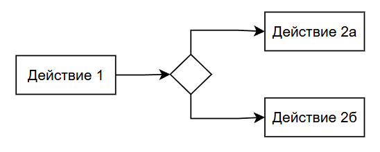

# Алгоритмы

<div class="article-tags">
  <span class="tag tag-required">ОБЯЗАТЕЛЬНО</span>
  <span class="tag tag-beginner">ДЛЯ НОВИЧКОВ</span>
</div>

<span class="complexity-badge">Разработчику</span>
<span class="complexity-badge">Аналитику</span>
<span class="complexity-badge">Тестировщику</span>  
<span class="complexity-badge">Архитектору</span>
<span class="complexity-badge">Инженеру</span>

## Алгоритмы

### Что такое алгоритм?

Вся жизнь построена на структуре алгоритмов. 

Алгоритм – последовательность действий, набор инструкций для конкретной задачи. 

Мы помним это ещё с математики. Но не будем углубляться и пугать вас сложной схемой.

На первый взгляд, слово «алгоритм» может вызывать ассоциации с формальными схемами, блок-схемами и сложными математическими конструкциями. Однако суть его предельно проста: алгоритм — это точная инструкция, однозначно определяющая последовательность действий для решения задачи.

Мы каждый день реализуем алгоритмы, часто не осознавая этого. Когда вы завариваете кофе, когда собираете ребёнка в школу, когда выбираете маршрут в приложении — вы следуете заранее усвоенным или спонтанно сгенерированным алгоритмам. Разница между повседневным и программистским подходом заключается не в самой идее, а в степени формализации: машина не способна интерпретировать неопределённости, полагаться на интуицию или «догадываться», что имелось в виду. Для неё инструкция должна быть дискретной (разбитой на законченные шаги), определённой (не допускающей двусмысленности) и конечной (гарантированно завершающейся за конечное число шагов). Эти три свойства — базисные требования, без которых невозможно построить корректный, воспроизводимый и надёжный алгоритм.

---

### Алгоритм в программировании

В программировании алгоритм выступает в роли своего рода «логического скелета»: код — это его плоть и кожа, а структура управления — нервная система. Без алгоритма программа — лишь хаотичный набор операций, не способный решать поставленную задачу. С другой стороны, один и тот же алгоритм можно реализовать на десятках языков, с разной производительностью, удобочитаемостью и надёжностью — но его *логическое ядро* остаётся неизменным. Именно поэтому при обучении программированию стартуют не с синтаксиса, а с алгоритмического мышления: умения декомпозировать задачу, выделять условия, прогнозировать последствия и строить причинно-следственные цепочки.

---

Простой алгоритм:
```
Действие1 → Действие2 → Действие3 
```

---

Пример:
```
Взять чайник → Налить воду → Включить плиту → Дождаться кипения.
```
---

### Свойства алгоритма


Алгоритмы – это фундамент программирования. Чтобы алгоритм был корректным и полезным, он должен обладать трёмя ключевыми свойствами: 
- дискретностью, 
- определённостью,
- конечностью.

**Дискретность** – алгоритм разбит на отдельные, завершённые этапы, не содержит расплывчатых или абстрактных инструкций, а каждый шаг имеет понятное начало и конец. Это важно, чтобы понимать, где начало, где конец действия.

**Определённость** – однозначность инструкций, когда каждый шаг трактуется единственным образом, нет двусмысленностей, а все возможные варианты предусмотрены. На практике подразумевает отработанность всех случаев.

**Конечность** – завершение за разумное время, означающее, что алгоритм всегда завершается, не зацикливается бесконечно, и даёт результат за приемлемое время. Бесконечный алгоритм зависнет и не приведёт к результату – это критично.

---

### Линейный и нелинейный алгоритмы

Конечно, мы тоже живём по алгоритмам, ведь каждый наш день — это цикл из просыпания, принятия решений, выполнения задач и отдыха. Некоторые из нас следуют строгому порядку, другие ищут гибкость, но даже хаос представляет собой алгоритм, просто он непредсказуемый. И программируя машину, мы проецируем алгоритм - поэтому сначала пишется псевдокод или рисуется блок-схема на алгоритмическом языке.

Поэтому, проектируя алгоритм, всегда нужно:
	- разбивать задачу на атомарные шаги;
	- избегать двусмысленностей;
	- гарантировать завершение.

Алгоритм может быть линейным и нелинейным. Линейный алгоритм подразумевает выполнение одного действия за другим, а нелинейный содержит разветвление, что образует некое дерево решений:



---

<div class="callout callout--tip">
  <div class="callout-title">Практическое задание</div>
Придумайте любую задачу, допустим сходить в кафе или ресторан.
Разбейте эту задачу на более мелкие задачи.
Составьте алгоритм.
</div>

---

### Причинно-следственная связь

В философии есть такое понятие, причинность. Всё (состояние одного объекта) пришло к своему текущему состоянию именно из-за соответствующего изменения другого объекта. А под объектом мы можем подразумевать абсолютно что угодно. То есть, схема проста:

---

```
Причина → Следствие
```
---


Пример: в уголовном праве, в случае совершения лицом преступления, наступают общественно опасные последствия, наличие которых является обязательным условием для привлечения лица к уголовной ответственности:

---

```
Цепочка событий, спровоцировавших кражу (событие) → 
Появление мотива и цели (последствие) Кража (событие) → 
Нарушение права собственника владеть, пользоваться, распоряжаться имуществом и дальнейшее наказание (последствие).

```

---

Это абсолютная и простая логика работы любого алгоритма в нашей жизни. Попробуйте для себя привести пару примеров, взяв любой факт, и найти ответ на вопрос «Почему это произошло?» и «Что служило предпосылкой для этого?».

Подход к рассмотрению окружающего мира через призму расследования причинно-следственной связи помогает видеть скрытый смысл, и лучше понимать цепочку событий. Этому учат в юриспруденции, и именно поэтому у многих людей есть тяга к детективам.

Логика – «мозг» программы, правила, по которым принимаются решения. Простейший пример – если правильно, то так, иначе делать по-другому.

---

## События, условия и действия

Структура в информационных технологиях базируется на алгоритме:
```
Событие + Условие → Действие
```

### Событие

★ **Событие (Trigger)** – факт изменения состояния объекта, допустим, системы. Пример – нажатие кнопки на сайте. Могут быть следующими:
	- пользовательские (клик, скролл, ввод текста);
	- системные (загрузка процессора выше установленного значения);
	- временные (таймер на установленное время или наступление момента).
	
Событие занимает отдельную часть в программировании, которая выступает как инициатор запуска. В самой комбинации «ЕСЛИ-ТО-ИНАЧЕ» событие не равняется «ЕСЛИ». «ЕСЛИ» — это условие. Событие подразумевает запуск, инициацию.

К примеру, у нас есть кнопка, и она является элементом веб-страницы, пусть будет «КУПИТЬ». Эта кнопка сама по себе - болванка, которая ничего не делает. Но если оживить её, сказав, что при нажатии на неё, она должна запускать процесс «ПОКУПКА», то как раз запущенная «ПОКУПКА» будет содержать условия и действия:
```
КУПИТЬ => 
ПОКУПКА = 
ЕСЛИ(ДЕНЬГИ ЕСТЬ) ТО ПРОДАТЬ; 
ИНАЧЕ ОТКЛОНИТЬ.
```

Здесь событием является факт нажатия покупателем на кнопку «КУПИТЬ», ПОКУПКА будет некой задачей на стороне продавца, включающей в себя условие «ЕСЛИ(ДЕНЬГИ ЕСТЬ)» и действия «ПРОДАТЬ», «ОТКЛОНИТЬ»

---

### Условие

★ **Условие (Condition)** – набор требований, которым должно соответствовать событие. Это правило, которое определяет, выполнится ли действие, записывается, как «если (условие) – то (действие). Условия должны быть полными, не противоречить друг другу и быть относительно быстрыми для выполнения. Пример – «x» равен чему-то. Проверка может быть:
	- простая – если (x `>` 0);
	- составная – если (возраст `>` 18 и страна=”Россия”);
	- регулярные выражения («умные» шаблоны для поиска и проверки текста, вроде «найди мне все слова, где есть буква «а» а потом цифра «3»).

В программировании проверки, как правило. используются через условные операторы. Примерами таких операторов являются IF / ELSE (ЕСЛИ-ИНАЧЕ).
Есть даже такая шутка, когда жена отправляет мужа-программиста и говорит «Сходи в магазин, возьми шоколадку. Если будут бананы, возьми четыре». Муж приносит четыре шоколадки, так как бананы были.

Здесь и сработала логика:
```
ЕСЛИ (БАНАНЫ) {
    ВЕРНУТЬ 4;
} ИНАЧЕ {
    ВЕРНУТЬ 1;
}

```
Выполнилась проверка на условие БАНАНЫ - ИСТИНА (true) или ЛОЖЬ (false). Это булево значение - такой тип переменной БАНАНЫ, который может быть или true, или false, и ничем иначе. Поэтому простейшее условие - проверить факт.

Как можно обратить внимание, в условии всё написано как-то просто. Буквально логика была такова:

```
ЕСЛИ (БАНАНЫ = ИСТИНА) {
    ВЕРНУТЬ 4;
} ИНАЧЕ {
    ВЕРНУТЬ 1;
}

```

Но в программировании в большинстве современных языков можно явно не указывать проверку равенства булева значения, можно просто указать «БАНАНЫ» для истины, и «!БАНАНЫ» (поставить восклицательный знак для отрицания) для лжи. И не обязательно дважды писать проверку - ИНАЧЕ работает как раз для всех прочих случаев, не указанных в ЕСЛИ.

Но если же у нас тип данных не булево значение, а, к примеру, число, то уже можно применять сравнивающие, арифметические и прочие операторы:

```
ЕСЛИ (ШОКОЛАДКИ > 1) {
    ОТРУГАТЬ МУЖА();
} ИНАЧЕ {
    ПОХВАЛИТЬ МУЖА();
}

```

Здесь количество шоколадок скрывается в значении переменной «ШОКОЛАДКИ», а оператор проверки сравнивает результат. Причем, неважно, чему равняется значение переменной, важно именно то, что выйдет в итоге всей операции - когда «ШОКОЛАДКИ» пройдут операцию сравнения, мы получим либо «ИСТИНА» либо «ЛОЖЬ». И как раз, когда муж приносит 4 шоколадки, операция «`ШОКОЛАДКИ > 1`» приведёт к «ИСТИНЕ», из-за чего сработает условие оператора ЕСЛИ, потому что формула всегда одна:
```
IF (TRUE) либо IF(!TRUE)
```
…а что внутри этого TRUE - просто «ШОКОЛАДКИ» или «`ШОКОЛАДКИ > 1`», не так важно, ведь всё что внутри этого TRUE — это условие целиком.
Соответствие условию влечёт за собой выполнение основного действия, а несоответствие условию - вторичного. Вторичное условие не обязательно, поэтому для блока IF не всегда может быть ELSE.

---

### Действие

★ **Действие** (Action) – совершение чего-то, определённое поведение объекта. Пример – отправка данных адресату. Это конкретная операция, которая изменяет состояние системы. Виды:
	- изменение данных (к примеру, удаление элемента);
	- внешний вызов (отправка сообщения, API-запрос);
	- визуальный эффект (анимация, переход).
	
В стандартном блоке «ЕСЛИ-ТО-ИНАЧЕ», или «IF-THEN-ELSE», действие и есть тот самый оператор THEN — это некий блок кода, который подлежит выполнению. В вышеприведённом примере действиями будут «ВЕРНУТЬ 4», «ВЕРНУТЬ 1», «ОТРУГАТЬ МУЖА» и «ПОХВАЛИТЬ МУЖА». Это может быть что угодно - от пустоты (да, можно сделать заглушку, подразумевающую, что в случае соответствия/несоответствия условию нам ну нужно ничего делать), до сложнейших вычислений и совокупности алгоритмов.

Такую триаду событий, условий и действий мы можем увидеть почти везде – от простейших скриптов до сложных нейросетей.

<div class="callout callout--tip">
  <div class="callout-title">Внимание</div>
Приготовьтесь!
Страшные слова	
Регулярные выражения – штука более узкопрофильная и нужна для конкретных задач. Можете не вдаваться в подробности, и вернуться к ним в случае необходимости позднее.
</div>

---