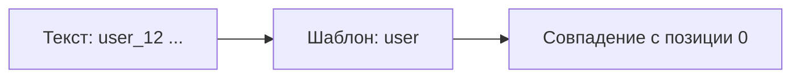

# Регулярные выражения — синтаксис с нуля

<div class="article-tags">
  <span class="tag tag-required">ОБЯЗАТЕЛЬНО</span>
  <span class="tag tag-beginner">ДЛЯ НОВИЧКОВ</span>
</div>

<span class="complexity-badge">Разработчику</span>
<span class="complexity-badge">Аналитику</span>
<span class="complexity-badge">Тестировщику</span>

Предыдущий шаг: [введение и лаборатория](./111).  
Следующий: [группы и замена](./1112).  
Готовые шаблоны для работы — в [рецептах и командной строке](./1115) и [лаборатории с разбором по блокам](/lab/Примеры/615).

---

## Зачем отдельная статья про синтаксис

Регулярное выражение — это **мини-язык** внутри строки. Один пропущенный `\` или якорь `$` меняет смысл с "проверить email" на "найти `@` где угодно". Здесь разбирается **алфавит** этого языка: из чего собирают шаблон, как его читать слева направо и как по шагам проверять себя на реальных строках.

После этой статьи вы сможете:

- читать чужой шаблон по блокам, а не "узнавать целиком";
- отличать поиск подстроки от проверки всей строки;
- собирать маски для логина, даты, времени, пути к файлу;
- понимать, когда пора перейти к [группам](./1112) и [флагам](./1114).

<div class="callout callout--tip">
  <div class="callout-title">Как учиться</div>

  <div class="callout-body">
  На каждый новый символ (<code>&#92;d</code>, <code>^</code>, <code>&#123;2,5&#125;</code>) сразу вбивайте мини-шаблон в <a href="./111">лаборатории</a> или на <a href="https://regex101.com/">regex101.com</a>. Теория без пяти строк текста в поле "Тест" почти не запоминается.
</div>
  </div>


---

## Как движок "читает" текст

Представьте **указатель** на символе строки и **указатель** на символе шаблона. Оба двигаются **слева направо**. Шаблон либо совпадает с текущим фрагментом текста, либо движок **откатывается** и пробует начать совпадение с **следующей** позиции в строке.

Строка для примеров:

```text
user_12 вошёл в систему
```

| Шаблон | Что происходит | Результат |
| --- | --- | --- |
| `user` | буквы `u`→`s`→`e`→`r` подряд | совпадение `user` |
| `User` | регистр другой | нет (без флага `i`) |
| `user` | поиск с позиции после `user_12` | нет на этом месте; движок мог найти раньше |

Шаблон `user` в тексте `xuser_y` тоже найдёт подстроку `user` **внутри** слова. Чтобы искать отдельное слово, позже понадобятся [границы `\b`](#границы-слова-b) или якоря.



**Первое совпадение** — не всегда "самое логичное" для человека: движок берёт **самое левое** успешное. Для всех вхождений нужен флаг `g` или цикл в коде — [флаги и жадность](./1114).

---

## Пошаговая сборка шаблона

Удобный порядок работы (тот же применяют в [1115](./1115)):

1. **Словами** — что считается успехом? "Строка целиком — дата" или "в логе есть ERROR".
2. **Якоря** — нужны ли `^` и `$` (форма) или поиск подстроки (лог).
3. **Литералы** — фиксированный текст: `[`, `@`, `://`.
4. **Классы** — "цифра", "буква", "не пробел".
5. **Квантификаторы** — сколько раз повторять.
6. **Проверка** — 5–10 реальных строк + 2 "злых" (пустая, с пробелом, кириллица).

| Задача | Якоря | Типичный каркас |
| --- | --- | --- |
| Поле формы | `^` … `$` | `^[...]&#123;мин,макс&#125;$` |
| Поиск в файле | нет | литералы + классы |
| Одна строка лога целиком | `^` … `$` | дата + время + уровень + сообщение |

---

## Литералы — "ищи как написано"

**Литерал** — символ, который в данном месте шаблона означает "найди такой же символ в тексте". Обычно это буквы, цифры и часть знаков препинания.

| Шаблон | Текст | Результат |
| --- | --- | --- |
| `12` | `user_12` | `12` внутри слова |
| `_` | `user_12` | подчёркивание |
| `вошёл` | `user_12 вошёл в систему` | кириллица как литералы |

---

### Какие символы экранировать

В шаблоне **спецсимволы** имеют отдельный смысл (см. [экранирование](#экранирование-)). В **литеральном** фрагменте их пишут с `\` или помещают в класс `[...]`.

| Символ | Зачем экранировать |
| --- | --- |
| `. * + ? ^ $ [ ] ( ) { } \| \` | управляющий смысл в regex |
| `-` | внутри `[ ]` может означать диапазон |
| `#` | в некоторых оболочках — комментарий (зависит от движка) |

В **коде** обратный слэш сам по себе спецсимвол: строка `"\d"` в Python — это не "цифра", а символ `d` с предупреждением. Используйте сырые строки `r"\d"` / `@"\d"` — подробнее в конце статьи.

---

## Точка `.` — "любой один символ"

`.` = ровно **один** символ, кроме перевода строки `\n` (если не включён флаг `s` — [1114](./1114)).

| Шаблон | Текст | Что найдёт |
| --- | --- | --- |
| `u.er` | `user` | `user` (`s` — "любой один") |
| `u.er` | `u_er` | `u_er` |
| `u.er` | `uer` | нет (нужен ровно один символ между `u` и `er`) |

Точка **не** означает "сколько угодно символов". Для нуля и более повторений — `*`, для одного и более — `+`.

Чтобы найти **настоящую точку** (IP, расширение файла), пишут `\.`.

| Ошибка | Шаблон | Текст `3.14` |
| --- | --- | --- |
| Точка как "любой" | `\d.\d+` | подойдёт и `3x14` |
| Точка как литерал | `\d\.\d+` | только с точкой |

---

## Класс символов `[ ... ]`

В квадратных скобках задают **один** допустимый символ на текущей позиции.

| Шаблон | Смысл |
| --- | --- |
| `[abc]` | `a`, `b` или `c` |
| `[a-z]` | строчная латинская буква |
| `[A-Za-z0-9]` | буква или цифра |
| `[._-]` | точка, подчёркивание или дефис |
| `[0-9]` | то же, что `\d` в ASCII-цифрах |

Пример: `[Tt]he` — `The` или `the`.

**Внутри `[ ]` точка — обычная точка.** Шаблон `ar[.]` ищет `a`, `r` и `.`.

---

### Дефис в классе

`-` между двумя символами задаёт **диапазон**:

| Запись | Смысл |
| --- | --- |
| `[a-z]` | от `a` до `z` |
| `[A-Z]` | заглавные латинские |
| `[0-9]` | цифры |

Чтобы искать **буквальный дефис**, поставьте его в начало или конец класса: `[-az]` или `[az-]`.

---

### Отрицание — `[^ ... ]`

`^` **сразу после** `[` — "любой один символ, кроме перечисленных":

| Шаблон | Смысл |
| --- | --- |
| `[^0-9]` | всё, кроме цифры |
| `[^@\s]+` | подряд символы без `@` и без пробела |
| `[^\n]+` | строка до перевода строки (упрощённо "всё до \n") |

<div class="callout callout--tip">
  <div class="callout-title">Путаница с кареткой</div>

  <div class="callout-body">
  <code>^</code> в начале <strong>всего</strong> шаблона — "начало строки". <code>^</code> сразу после <code>[</code> — "не этот набор". Это разные роли одного знака.
</div>
  </div>


---

### Когда класс лучше точки

| Задача | Слабо | Надёжнее |
| --- | --- | --- |
| Содержимое HTML-тега | `<.*>` | `<[^>]+>` |
| До пробела | `.*` | `[^\s]+` |
| Только буквы | `.*` | `[A-Za-z]+` |

---

## Сокращения `\d`, `\w`, `\s` и "отрицания"

| Код | Обычно значит | Пример |
| --- | --- | --- |
| `\d` | цифра `0–9` | `\d{4}` → год |
| `\w` | буква, цифра, `_` (часто только ASCII) | `\w+` → `user_12` |
| `\s` | пробел, таб, перевод строки | `\s+` → пробелы |
| `\D` | не цифра | |
| `\W` | не "слово" | |
| `\S` | не пробел | `\S+` → "слово" без пробелов |

**Кириллица:** `\w` в JavaScript **не** совпадает с `п` или `ё`. Для русского текста:

```regex
[а-яА-ЯёЁ0-9_]+
```

В JavaScript с флагом `u` — Unicode-классы `\p&#123;L&#125;` (буква), `\p&#123;N&#125;` (число). Проверяйте в [лаборатории](./111) на своих строках.

| Текст | `\w+` | `[а-яА-ЯёЁ]+` |
| --- | --- | --- |
| `привет` | часто нет | да |
| `user_12` | да | только `user` без `_12` при чисто кириллическом классе |

Для смешанного логина используйте явный объединённый класс: `[A-Za-zа-яА-ЯёЁ0-9_]+`.

---

## Квантификаторы — "сколько раз повторять"

Квантификатор относится к **предыдущему** атому — одному символу, классу или (позже) [группе](./1112).

| Символ | Сколько раз | Пример | Подходит к |
| --- | --- | --- | --- |
| `*` | 0 и больше | `ab*c` | `ac`, `abc`, `abbc` |
| `+` | 1 и больше | `ab+c` | `abc`, не `ac` |
| `?` | 0 или 1 | `colou?r` | `color`, `colour` |
| `{3}` | ровно 3 | `\d{3}` | `123` |
| `{2,4}` | от 2 до 4 | `\d{2,4}` | `12`, `1234` |
| `{2,}` | 2 и больше | `\d{2,}` | `99`, `12345` |
| `{,6}` | до 6 | `.{,6}` | не более 6 любых символов |

Пример: `[a-z]*` — ноль или больше строчных латинских букв.

`.*` — ноль или больше любых символов; по умолчанию **жадно** (тянет максимум). Подробно — [1114](./1114).

---

### Жадность на пальцах

Текст: `aaa`, шаблон `a+` — совпадение `aaa` (все три). Шаблон `a+?` — ленивый, минимум; для одной буквы `a` результат тот же, разница видна на `.*` между маркерами.

---

### Пустые совпадения

`a*` на тексте `bbb` даёт **нулевое** совпадение в начале (ноль букв `a`). В коде при подсчёте всех match это иногда удивляет — смотрите документацию движка.

---

## Якоря `^` и `$`

| Символ | Смысл |
| --- | --- |
| `^` | начало строки (с флагом `m` — начало **каждой** строки в тексте) |
| `$` | конец строки |

Без якорей шаблон ищет **подстроку**. С якорями на всём шаблоне — **всю строку целиком** (валидация поля).

| Шаблон | Строка | Результат |
| --- | --- | --- |
| `ok` | `not ok` | есть (`ok` внутри) |
| `^ok$` | `not ok` | нет |
| `^ok$` | `ok` | да |
| `^[0-9]+$` | ` 42 ` | нет (пробелы) |
| `^[0-9]+$` | `42` | да |

Для "строка без пробелов по краям" иногда пишут `^\S+$` или обрезают пробелы в коде до regex.

В .NET также встречаются `\A` (начало всего текста) и `\Z` (конец) — полезно при многострочных строках без флага `m`.

---

## Экранирование `\`

| Нужен символ | В шаблоне |
| --- | --- |
| точка | `\.` |
| плюс | `\+` |
| звёздочка | `\*` |
| вопрос | `\?` |
| скобки | `$` `$` `\[` `\]` |
| слэш | `\\` |

---

### В коде Python

```python

import re

# Плохо: "\d" — не цифра
re.search("\d+", "42")
# Хорошо:
re.search(r"\d+", "42")
```

---

### В коде C#

```csharp
Regex.IsMatch("42", @"\d+");
```

---

### В редакторе (VS Code / Cursor)

В поле поиска с включённым regex один `\` обычно достаточен: `\d+`.

---

## Сквозной разбор — логин пользователя

**Правила (упрощённо):**

- от 3 до 16 символов;
- только латиница, цифры, `_` и `-`;
- первый символ — буква.

**Шаблон:**

```regex
^[a-z][a-z0-9_-]{2,15}$
```

| Часть | Значение |
| --- | --- |
| `^` | начало строки |
| `[a-z]` | первая буква — строчная латинская |
| `[a-z0-9_-]` | дальше буква, цифра, `_` или `-` |
| `{2,15}` | ещё от 2 до 15 символов (итого 3…16) |
| `$` | конец |

| Строка | Подходит? | Почему |
| --- | --- | --- |
| `jo-hn_doe` | да | |
| `john12` | да | |
| `Jo` | нет | заглавная в начале |
| `ab` | нет | 2 символа |
| `jo hn` | нет | пробел |
| `admin` | да | зарезервированные имена отсекают в бизнес-логике, не в regex |

**Вариант с флагом `i`** (первая буква любого регистра, остальное по правилам) — отдельный шаблон или нормализация в нижний регистр до проверки.

---

## Сквозной разбор — пароль (только длина и символы)

Сложные правила ("цифра + спецсимвол") удобнее через [проверки вокруг](./1113). Здесь — только **длина** и **набор символов**:

```regex
^[A-Za-z\d@$!%*?&]{8,32}$
```

| Часть | Значение |
| --- | --- |
| `{8,32}` | от 8 до 32 символов |
| класс | разрешённые символы |

Цифру и спецсимвол добавят отдельными `(?=.*\d)` в статье [1113](./1113).

---

## Сквозной разбор — email (форма, упрощённо)

```regex
^[a-zA-Z0-9._%+-]+@[a-zA-Z0-9.-]+\.[a-zA-Z]{2,}$
```

| Блок | Смысл |
| --- | --- |
| `^...$` | вся строка — один адрес |
| `[a-zA-Z0-9._%+-]+` | локальная часть до `@` |
| `@` | разделитель |
| `[a-zA-Z0-9.-]+` | домен |
| `\.[a-zA-Z]{2,}` | точка и зона |

| Строка | Результат |
| --- | --- |
| `user@example.com` | да |
| `user@example` | нет (нет зоны) |
| `bad @mail.com` | нет (пробел) |
| `x@y.co` | да |

Полные RFC-правила в regex не помещаются разумно — для UI достаточно упрощения; для почтового сервера — проверка доставкой.

---

## Сквозной разбор — дата ДД-ММ-ГГГГ

```regex
^\d{2}-\d{2}-\d{4}$
```

| Часть | Значение |
| --- | --- |
| `\d&#123;2&#125;-\d&#123;2&#125;-\d&#123;4&#125;` | день, месяц, год с дефисами |
| `^` `$` | вся строка |

| Строка | Подходит? |
| --- | --- |
| `22-01-2026` | да |
| `2-1-2026` | нет |
| `32-01-2026` | да по regex, нет по календарю |

Календарь (31.02) — в коде. Regex проверяет **форму**.

**Год в двух цифрах** (устаревший формат): `^\d&#123;2&#125;-\d&#123;2&#125;-\d&#123;2&#125;$` — осторожно с веком; лучше четыре цифры года.

---

## Сквозной разбор — время ЧЧ:ММ:СС

```regex
^\d{2}:\d{2}:\d{2}$
```

| Строка | По regex | По смыслу |
| --- | --- | --- |
| `14:30:05` | да | да |
| `25:00:00` | да | нет (часы) |
| `9:05:01` | нет | нужны ведущие нули `09:05:01` |

Строгая проверка часов `00-23` — отдельные классы или код:

```regex
^([01]\d|2[0-3]):[0-5]\d:[0-5]\d$
```

(упрощённо, без учёта leap second).

---

## Сквозной разбор — имя файла бэкапа

```regex
^data_\d{4}\.csv$
```

Подходит: `data_2026.csv`. Для поиска в списке файлов без привязки ко всей строке — уберите `^` `$`: `data_\d{4}\.csv`.

---

## Сквозной разбор — путь

**Unix-подобный файл:**

```regex
^[A-Za-z0-9_./-]+$
```

**Windows (без диска):**

```regex
^[A-Za-z0-9_\\.\\-]+$
```

В реальных путях лучше `pathlib` / `Path`, а regex — для фильтра в логе ("похоже на `.exe`"):

```regex
\.exe$
```

---

## Сквозной разбор — уровень в логе

```text
2026-01-22 14:30:05 [ERROR] Connection timeout
```

Только слово `ERROR` в скобках:

```regex
\[ERROR\]
```

| Часть | Значение |
| --- | --- |
| `\[` `\]` | буквальные скобки |

Любой уровень — в [1112](./1112): `\[(INFO|WARN|ERROR)\]`. Полная строка лога — в [1115](./1115).

---

## Сквозной разбор — номер заказа

Формат: `ORD-` + год + `-` + 4 цифры.

```regex
^ORD-\d{4}-\d{4}$
```

| Строка | Результат |
| --- | --- |
| `ORD-2026-0042` | да |
| `ORD-26-42` | нет |

---

## Границы слова `\b`

**Граница слова** — переход между `\w` и "не `\w`" (пробел, знак препинания, начало/конец).

| Шаблон | Текст | Результат |
| --- | --- | --- |
| `cat` | `category` | совпадение внутри |
| `\bcat\b` | `category` | нет |
| `\bcat\b` | `a cat.` | да |

Для кириллицы `\b` ненадёжен — явные классы или lookaround из [1113](./1113).

---

## Альтернатива `|` — "или" (введение)

```regex
\b(ERROR|WARN|INFO)\b
```

| Шаблон | Смысл |
| --- | --- |
| `cat|dog` | `cat` или `dog` |
| `(T|t)he` | `The` или `the` |
| `https?` | `http` или `https` (`?` у `s`, не `\|`) |

Скобки задают границы: `one|two|three` против `one|(two|three)`.

---

## Приоритет элементов

| Шаблон | Читается как |
| --- | --- |
| `ab+` | `a` + один и более `b` |
| `(ab)+` | повторы пары `ab` |
| `[a-z]+` | одна и более букв из класса |
| `a{2,4}` | от 2 до 4 букв `a` |

Квантификатор "липнет" к **ближайшему** слева элементу. Сомневаетесь — добавьте `(...)`.

---

## Unicode и национальные символы

```regex
[а-яА-ЯёЁ0-9_]+
```

JavaScript (флаг `u`):

```javascript
/\p{L}+/u  // буквы Unicode
```

Перед продакшеном — тест на реальных ФИО, адресах, логах.

---

## Типичные ошибки на уровне синтаксиса

| Симптом | Причина | Исправление |
| --- | --- | --- |
| Всё совпадает | `.` вместо `\.` | экранировать точку |
| "Пустой" match везде | `*` допускает 0 раз | `+` или `{1,}` |
| Форма пропускает мусор | нет `$` | `^...$` |
| Находит внутри слова | нет `\b` | границы или якоря |
| Кириллица не ищется | `\w` только ASCII | явный класс |
| В коде "не работает" | забыли `r"..."` | сырая строка |

---

## Упражнения (проверьте в лаборатории)

| № | Задача | Подсказка |
| --- | --- | --- |
| 1 | Только цифры, 1–5 знаков | `^\d{1,5}$` |
| 2 | Слово `error` целиком | `\berror\b` + флаг `i` |
| 3 | Дата `ГГГГ-ММ-ДД` | поменять порядок блоков |
| 4 | Файл `.log` в конце строки | `\.log$` |
| 5 | Текст до первого пробела | `[^\s]+` |

---

## Шпаргалка шага 1

| Задача | Идея шаблона |
| --- | --- |
| Точное слово | литералы: `error` |
| "Что-то между" | `[^>]+` точнее, чем `.*` |
| Только цифры | `^\d+$` |
| Дата ДД-ММ-ГГГГ | `^\d&#123;2&#125;-\d&#123;2&#125;-\d&#123;4&#125;$` |
| Кусок до пробела | `[^\s]+` |
| Время | `^\d&#123;2&#125;:\d&#123;2&#125;:\d&#123;2&#125;$` |

Потренируйтесь в [лаборатории](./111) (пресеты Email и Дата). Готовые команды для терминала — [1115](./1115).

---

**Дальше:** [Группы и замена →](./1112)
