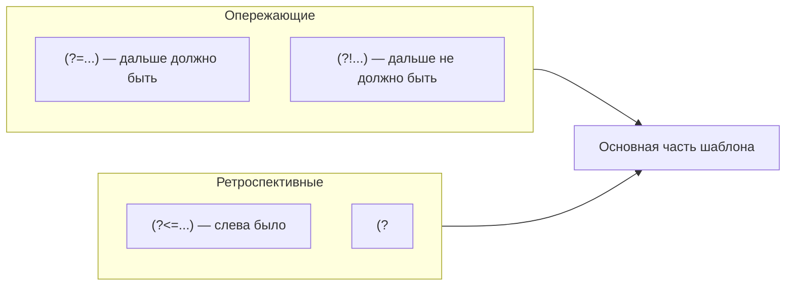

# Регулярные выражения — проверки вокруг совпадения

<div class="article-tags">
  <span class="tag tag-required">ОБЯЗАТЕЛЬНО</span>
  <span class="tag tag-beginner">ДЛЯ НОВИЧКОВ</span>
</div>

<span class="complexity-badge">Разработчику</span>
<span class="complexity-badge">Аналитику</span>

Предыдущий: [группы и замена](./1112).  
Следующий: [флаги и жадность](./1114).

---

## Идея простыми словами

Иногда нужно найти текст **только при условии**, что рядом что-то есть (или наоборот — чего-то нет). При этом соседний кусок **не всегда** нужно включать в результат и **не всегда** нужно запоминать в группе.

Примеры из практики:

- цена **после** знака `$`, сам `$` в ответ не нужен;
- пароль: минимум 8 символов, **и** есть цифра, **и** есть заглавная буква;
- слово `cat`, за которым **не** идёт `s` (чтобы отсечь `cats`);
- номер заказа, перед которым стоит префикс `ORD-`, но в отчёт нужен только номер.

Для этого служат **проверки вокруг совпадения** (lookaround): движок "подглядывает" вперёд или назад, **не сдвигая** основной указатель и **не добавляя** проверенный фрагмент в итоговое совпадение (в отличие от обычных захватывающих `()`).



---

## Четыре вида

| Запись | Название | Смысл |
| --- | --- | --- |
| `(?=...)` | опережающая, положительная | дальше по тексту **должно** совпасть `...` |
| `(?!...)` | опережающая, отрицательная | дальше **не должно** совпасть `...` |
| `(?<=...)` | ретроспективная, положительная | **перед** текущей позицией было `...` |
| `(?<!...)` | ретроспективная, отрицательная | **перед** текущей позицией не было `...` |

Скобки `(?:...)` из [прошлой статьи](./1112) — обычная группа без захвата: она **входит** в совпадение и участвует в жадном сопоставлении. Lookaround только **проверяет** контекст и не расширяет текст совпадения.

| Механизм | Попадает в результат? | Захват в группу? |
| --- | --- | --- |
| `(...)` | да | да |
| `(?:...)` | да | нет |
| `(?=...)`, `(?!...)`, `(?<=...)`, `(?<!...)` | нет | нет |

---

## Опережающая положительная `(?=...)`

**Смысл:** "с текущей позиции дальше по строке должно начаться совпадение с `...`", при этом символы из `...` **не входят** в итоговый match.

### Пароль с несколькими условиями

Требования (упрощённо):

- длина от 8;
- хотя бы одна заглавная латинская;
- хотя бы одна цифра;
- хотя бы один спецсимвол `@$!%*?&`;
- только разрешённые символы.

```regex
^(?=.*[A-Z])(?=.*\d)(?=.*[@$!%*?&])[A-Za-z\d@$!%*?&]{8,}$
```

Читаем по блокам:

| Блок | Что проверяет |
| --- | --- |
| `^` | начало строки |
| `(?=.*[A-Z])` | где-то дальше есть заглавная |
| `(?=.*\d)` | где-то дальше есть цифра |
| `(?=.*[@$!%*?&])` | где-то дальше есть спецсимвол |
| `[A-Za-z\d@$!%*?&]{8,}` | основная часть — 8 и более разрешённых символов |
| `$` | конец строки |

Каждый `(?=...)` **не потребляет** символы — только проверяет. Поэтому три условия можно поставить подряд в начале шаблона.

| Пароль | Результат |
| --- | --- |
| `Abcdef1!` | подходит |
| `abcdef1!` | нет заглавной |
| `Abcdefgh` | нет цифры и спецсимвола |
| `Ab1!` | слишком короткий |

<div class="callout callout--tip">
  <div class="callout-title">Пароль в продакшене</div>
  Для реальной формы часто проще и понятнее проверить длину, цифру и спецсимвол <strong>тремя отдельными условиями в коде</strong>, а regex оставить для "только разрешённые символы". Так проще показывать пользователю, чего именно не хватает.
</div>

### "Должно быть дальше" без захвата префикса

Текст:

```text
id=42; name=admin; role=user
```

Нужно найти **значение** после `id=`, без самого `id=` в совпадении:

```regex
(?<=id=)\d+
```

Если lookbehind с переменной шириной недоступен, используют опережающую проверку и захват:

```regex
id=(\d+)
```

Тогда в группе 1 будет `42`, а полное совпадение — `id=42`.

---

## Опережающая отрицательная `(?!...)`

**Смысл:** "с текущей позиции дальше **не должно** начинаться совпадение с `...`".

### Слово без продолжения

Пример: найти `The`, после которого **не** идёт пробел и `fat`:

```regex
\b[Tt]he\b(?!\sfat)
```

В строке `The fat cat` первое `The` **отсечётся** (после него как раз ` fat`). Другие вхождения `the` без ` fat` останутся.

### Запретить расширение файла

Найти имена файлов **без** `.tmp`:

```regex
\b[\w.-]+(?!\.\w+\.tmp)\.\w+\b
```

Учебный приём: отрицательная опережающая проверка `(?!\.\w+\.tmp)` перед финальным расширением отсекает двойные "временные" суффиксы. На реальных путях надёжнее разбирать путь в коде.

### Начало строки, которая не комментарий

```regex
^(?!\s*#).+
```

С флагом `m` — "непустая строка, которая не начинается с `#` после пробелов" (удобно для фильтрации строк конфига).

---

## Ретроспективная положительная `(?<=...)`

**Смысл:** "непосредственно **слева** от текущей позиции должно стоять `...`", при этом `...` **не входит** в совпадение.

### Цена после доллара

Текст:

```text
Цена $42.50 и скидка $9
```

Нужны **числа после `$`**, без самого `$` в результате:

```regex
(?<=\$)\d+(?:\.\d{2})?
```

| Часть | Значение |
| --- | --- |
| `(?<=\$)` | прямо слева должен быть `$` |
| `\d+` | одна и более цифр |
| `(?:\.\d{2})?` | необязательные копейки `.50` |

Совпадения: `42.50` и `9`.

**Запасной вариант** (если lookbehind недоступен): `\$(\d+(?:\.\d{2})?)` — тогда `$` попадёт в полное совпадение, а цифры — в группу 1.

### Слова после артикля

Текст:

```text
The fat cat sat on the mat.
```

Найти `fat` или `mat`, **если перед ними** было `The ` или `the `:

```regex
(?<=[Tt]he\s)(?:fat|mat)
```

| Часть | Значение |
| --- | --- |
| `(?<=[Tt]he\s)` | слева `The ` или `the ` |
| `(?:fat|mat)` | само совпадение |

---

## Ретроспективная отрицательная `(?<!...)`

**Смысл:** "слева **не должно** стоять `...`".

Найти `cat`, перед которым **нет** `The ` / `the `:

```regex
(?<![Tt]he\s)cat
```

В `The cat sat on cat` подойдёт второе `cat`, первое — нет.

### Рубль, а не доллар

```regex
(?<!\$)\d+(?:\.\d{2})?\s*₽
```

Число с `₽`, перед которым **нет** `$` (грубая эвристика для смешанных прайс-листов).

---

## Lookaround и обычный захват — когда что выбирать

| Ситуация | Приём |
| --- | --- |
| Несколько независимых условий к одной строке | несколько `(?=...)` в начале |
| "Только если после идёт X" | `(?=X)` или `\X(?=Y)` с захватом только Y |
| "Только если перед был X" | `(?<=X)` |
| Нужен X в результате замены | захват `(...)` или lookbehind + основная часть |
| Не засорять список групп | `(?:...)` + lookaround |

---

## Ограничения движков

- В **старых** движках `(?<=...)` и `(?<!...)` требуют **фиксированной ширины** слева: `(?<=ab)` — да, `(?<=a+)` — нет. В современном JavaScript, .NET и PCRE переменная ширина lookbehind поддерживается.
- Сложные цепочки `(?=...)(?=...)(?=...)` трудно читать и сопровождать — для команды важнее ясный код, чем "всё в одном regex".
- Lookaround **не делает** шаблон "умнее" в смысле вложенных структур: JSON, HTML и сбалансированные скобки по-прежнему требуют [парсера](/encyclopedia/3-data-markup/3-03-myslitelnaya-baza/43).

---

## Мини-практика

| Задача | Подсказка |
| --- | --- |
| UUID после `id=` | `(?<=id=)[0-9a-f-]{36}` |
| Слово не в начале строки | `(?<!^)\bword\b` с флагом `m` |
| Пароль без пробелов | `^(?=\S{8,}$)\S+$` плюс отдельные проверки на классы символов |

Проверьте шаблоны в [лаборатории](./111) на 5–10 своих строках.

---

**Дальше:** [Флаги и жадность →](./1114)
