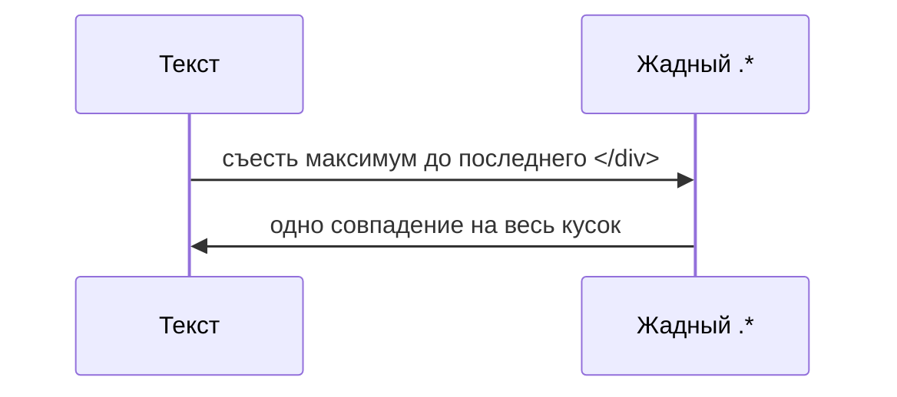

# Регулярные выражения — флаги и жадность

<div class="article-tags">
  <span class="tag tag-required">ОБЯЗАТЕЛЬНО</span>
  <span class="tag tag-beginner">ДЛЯ НОВИЧКОВ</span>
</div>

<span class="complexity-badge">Разработчику</span>

Предыдущий: [проверки вокруг совпадения](./1113).  
Следующий: [рецепты и командная строка](./1115).

---

## Флаги — как меняется поведение

**Флаг** (модификатор) подключается к шаблону и меняет правила сопоставления: учитывать ли регистр, искать ли все вхождения, как трактовать `^` и `$` в многострочном тексте.

В **JavaScript** флаги пишут после закрывающего `/`:

```javascript
/pattern/gim
```

В **C#** — через `RegexOptions`:

```csharp
Regex.IsMatch(text, pattern, RegexOptions.IgnoreCase | RegexOptions.Multiline);
```

В **Python** — второй аргумент `re.match` / `re.search`:

```python
re.findall(r'error', text, re.IGNORECASE | re.MULTILINE)
```

| Флаг | JS | Python (`re`) | Смысл для новичка |
| --- | --- | --- | --- |
| без учёта регистра | `i` | `I` / `IGNORECASE` | `The` = `the` = `THE` |
| все совпадения | `g` | `findall` / цикл | не останавливаться на первом |
| многострочность | `m` | `M` / `MULTILINE` | `^` и `$` на **каждой** строке |
| точка включает `\n` | `s` | `S` / `DOTALL` | `.` совпадает и с переводом строки |
| Unicode | `u` | в Py3 по умолчанию | корректные классы вроде `\p{L}` |
| только с позиции | `y` | — | "липкое" сопоставление (редко) |

В **C#** отдельного флага `g` нет: `Match` — первое совпадение, `Matches` — все.

---

## Флаг `i` — регистр

Текст:

```text
Error в логе и ERROR на сервере
```

| Шаблон | Найдёт |
| --- | --- |
| `Error` | только `Error` |
| `Error` + флаг `i` | `Error` и `ERROR` |

Для кириллицы поведение зависит от движка и локали. Надёжнее явный класс `[Ее]rror` или нормализация текста (приведение к одному регистру) до поиска.

---

## Флаг `g` — все вхождения

Текст:

```text
cat sat on the mat
```

| Шаблон | Поведение |
| --- | --- |
| `/at/` | первое `at` в `cat` |
| `/at/g` | `at` в `cat` и `at` в `mat` |

В редакторе режим "заменить все" обычно включает аналог глобального поиска.

В коде на JavaScript без `g` метод `replace` меняет только **первое** вхождение; с `g` — все.

---

## Флаг `m` — несколько строк в одном тексте

Текст:

```text
строка one
строка two
```

Шаблон `^строка` **без** `m` срабатывает, только если **весь** текст начинается со слова `строка`.

**С флагом `m`** `^` и `$` привязаны к **началу и концу каждой строки** (между символами перевода строки).

Пример — строки, **заканчивающиеся** на `one` или `two`:

```regex
^(строка one|строка two)$
```

С флагом `m` обе строки файла проверяются отдельно.

---

## Флаг `s` (dotAll) — точка и перевод строки

По умолчанию `.` **не** совпадает с `\n`. В многострочном JSON, логе или HTML-блоке шаблон `.*?` "ломается" на границе строки.

С флагом `s` точка включает перевод строки. Удобно для коротких фрагментов, но опасно в сочетании с жадным `.*` на больших текстах.

---

## Жадность — главная ловушка новичка

По умолчанию квантификаторы **жадные** (greedy): движок берёт **максимум** символов, при котором **ещё можно** дотянуть остаток шаблона.

---

### Пример с HTML-подобными тегами

Текст:

```html
<div>A</div> и <div>B</div>
```

Шаблон:

```regex
<div>.*</div>
```

| Этап | Что происходит |
| --- | --- |
| `<div>` | совпало с первым тегом |
| `.*` | жадно тянет всё до последнего возможного |
| `</div>` | подстраивается под **последний** `</div>` |

**Одно** огромное совпадение: от первого `<div>` до последнего `</div>` — внутри и `A`, и `B`.



---

## Ленивый квантификатор `?` после `*`, `+`, `{}`

Добавьте `?` после квантификатора — повторение станет **ленивым** (minimal, non-greedy): движок берёт **минимум**, достаточный для остатка шаблона.

| Жадный | Ленивый |
| --- | --- |
| `.*` | `.*?` |
| `.+` | `.+?` |
| `\d{2,5}` | `\d{2,5}?` |

Тот же текст, шаблон:

```regex
<div>.*?</div>
```

Результат: **два** совпадения — `<div>A</div>` и `<div>B</div>`.

Потренируйтесь в [лаборатории](./111) — пресет **Жадный и ленивый**.

---

## Жадные квантификаторы `*+`, `++`, `?+`

В движках PCRE и .NET есть **притяжательные** (possessive) квантификаторы: они жадные, но **не отдают** уже съеденные символы при backtracking.

Пример: `(a+)+` на длинной строке из `a` без завершения может вызвать катастрофический backtracking ([ReDoS](/encyclopedia/3-data-markup/3-03-myslitelnaya-baza/44)). Вариант `(a++)+` ведёт себя иначе — полезно в узких оптимизациях, для новичка достаточно знать, что "двойной плюс" существует в продвинутых движках.

---

## Три способа сузить "любые символы"

| Подход | Шаблон | Когда уместен |
| --- | --- | --- |
| Ленивый повтор | `<div>.*?</div>` | несколько однотипных блоков подряд |
| Отрицание класса | `<div>[^<]*</div>` | внутри тега нет вложенного `<` |
| Конкретная структура | парсер DOM / JSON | вложенность и теги с атрибутами |

Для разметки с вложенностью regex — вспомогательный инструмент, не замена [парсера](/encyclopedia/3-data-markup/3-03-myslitelnaya-baza/43).

---

## Backtracking простыми словами

Движок пробует совместить шаблон слева направо. Если ветка не сошлась, он **откатывается** и пробует отдать символы жадному квантификатору.

Жадный `.*` на длинном тексте с "почти подходящим" хвостом создаёт много откатов. Отсюда тормоза и ReDoS на шаблонах вроде `(a+)+$` в пользовательском вводе.

**Практика:**

- упростить шаблон;
- заменить `.*` на `[^>\n]*` или ленивый `.*?`;
- ограничить длину входной строки;
- для проверки формата в API — таймаут или отдельная библиотека с лимитом шагов (.NET `MatchTimeout`).

---

## Когда что использовать

| Задача | Подсказка |
| --- | --- |
| Нашёл только первое | флаг `g` или цикл `Matches` / `findall` |
| `The` не находит `THE` | флаг `i` или явный класс |
| `^` не работает во 2-й строке файла | флаг `m` |
| `.` не переходит на следующую строку | флаг `s` |
| `.*` съело полстраницы | `.*?` или уточнить класс символов |
| JSON/HTML целиком | парсер, не regex |

---

## Сводка

| Проблема | Решение |
| --- | --- |
| Нашёл только первое | `g` / `Matches` / `findall` |
| Регистр мешает | `i` / `IGNORECASE` |
| Якоря только для первой строки | `m` / `MULTILINE` |
| Точка "обрывается" на `\n` | `s` / `DOTALL` |
| Один гигантский match | ленивый `*?` или `[^...]*` |
| Зависание на длинном вводе | упростить шаблон, таймаут, см. [автоматы](/encyclopedia/3-data-markup/3-03-myslitelnaya-baza/44) |

---

**Дальше:** [Рецепты и командная строка →](./1115)
