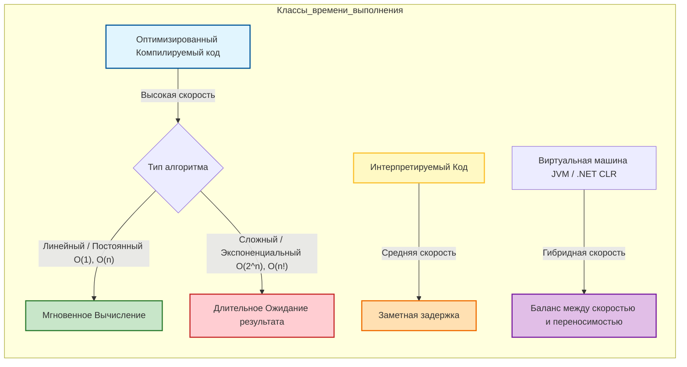
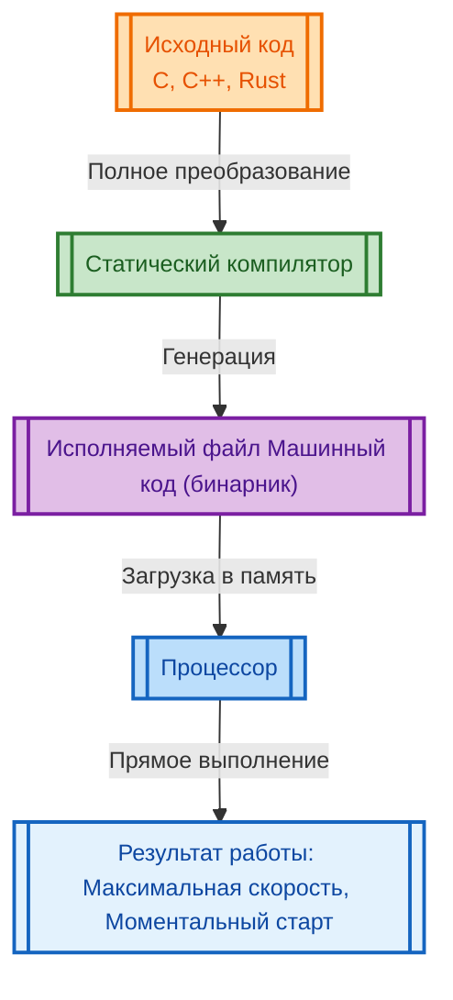
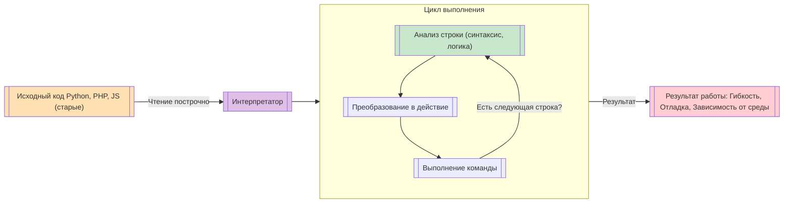
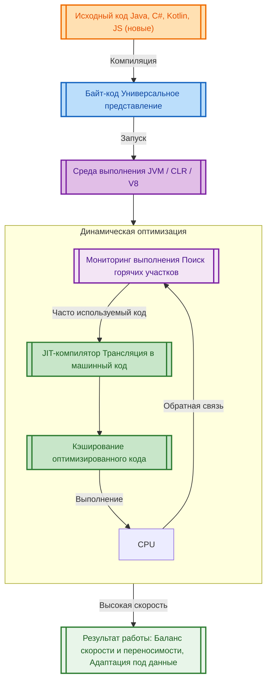

# Классы временной сложности алгоритмов

  ОБЯЗАТЕЛЬНО
  ДЛЯ НОВИЧКОВ

Разработчику
Аналитику
Тестировщику  
Архитектору
Инженеру

---

## Классы времени выполнения и скорость работы программ

### Время выполнения программы

Наверняка вы замечали, что какие-то программы могут выполняться медленнее, а какие-то быстрее. Почему так происходит?

Время выполнения программы — это период, в течение которого компьютер обрабатывает инструкции этой программы и превращает их в действия. Это не просто момент запуска или завершения, а весь цикл активной жизни программы: от загрузки в память до завершения всех вычислений и освобождения ресурсов. Скорость работы программы определяется тем, насколько быстро она проходит этот цикл при решении конкретной задачи.

Разные программы выполняются с разной скоростью даже на одинаковом оборудовании. Причина кроется не только в сложности самой задачи, но и в том, **как именно программа была написана**, **на каком языке**, **с использованием каких инструментов**, и **в каком окружении она запускается**. Эти факторы определяют класс времени выполнения — категорию, к которой относится программа по способу своей интерпретации или компиляции, а также по уровню взаимодействия с операционной системой и аппаратным обеспечением.

Компилируемый код - самый быстрый вариант, когда код переводится в машинные инструкции заранее, и работает напрямую с процессором. Интерпретируемый выполняет строчку за строчкой, и добавляет накладные расходы, делая выполнение медленнее.

Виртуальная машина представляет уже золотую середину, где код компилируется в промежуточный вариант, а затем исполняется ВМ, что даёт баланс между скоростью и возможностью работать на разных устройствах.

Типы алгоритмов даже внутри быстрого кода зависят от математической сложности задач (количества шагов). Линейные/Постоянные выполняются почти мгновенно, а экспотенциальные могут занимать часы или дни при росте входных данных, даже на быстром компьютере.

Понимание этих классов помогает разработчикам принимать осознанные решения: когда важна максимальная скорость, когда допустимы небольшие задержки ради удобства разработки, и когда стоит пожертвовать производительностью ради переносимости или безопасности.

---

### Исполняемый код

Программа начинает свой путь как текст на одном из языков программирования. Этот текст человекочитаем, но процессор его не понимает. Чтобы программа заработала, её нужно преобразовать в последовательность машинных инструкций — команд, которые процессор может выполнять напрямую. Существует несколько стратегий такого преобразования, и каждая из них порождает свой класс времени выполнения.

Первый подход — **статическая компиляция**. Программа полностью переводится в машинный код ещё до запуска. Полученный исполняемый файл содержит только те инструкции, которые нужны для выполнения задачи, без лишних прослоек. Такие программы стартуют мгновенно и работают с максимальной скоростью, потому что каждая операция выполняется напрямую процессором. Языки, такие как C, C++ или Rust, часто используют этот подход. Они дают разработчику полный контроль над ресурсами и позволяют писать высокопроизводительные приложения: игры, драйверы, системы реального времени.

Разработчик пишет текст программы на высокоуровневом языке. Статический компилятор обрабатывает весь этот текст целиком и создает готовый двоичный файл. При запуске операционная система загружает этот файл в память, а процессор выполняет инструкции напрямую, без промежуточных вычислений. Это обеспечивает максимальную производительность и независимость от среды разработки.

Второй подход — **интерпретация**. Здесь программа не компилируется заранее. Вместо этого специальная программа — интерпретатор — читает исходный код построчно во время выполнения, анализирует каждую строку и тут же выполняет соответствующие действия. Этот метод гибкий и удобный для отладки, но медленный. Каждая операция требует дополнительных проверок и преобразований. Языки вроде Python, JavaScript (в ранних версиях) или PHP исторически использовали интерпретацию. Такие программы подходят для задач, где скорость не критична: веб-скрипты, автоматизация, прототипирование.

Программа запускается через интерпретатор. Процесс начинается с чтения первой строки кода. Интерпретатор разбирает структуру этой строки, определяет, какое действие нужно совершить, и выполняет его сразу же. Затем он переходит к следующей строке. Этот цикл повторяется до конца файла. Поскольку каждая строка обрабатывается индивидуально во время работы, это позволяет легко находить ошибки, но замедляет общий процесс выполнения из-за постоянных проверок.

Третий подход — **компиляция "на лету"** (JIT — Just-In-Time). Он сочетает преимущества предыдущих методов. Исходный код сначала преобразуется в промежуточное представление — байт-код, который не зависит от конкретного процессора. Во время выполнения специальный компилятор внутри среды выполнения (например, JVM для Java или V8 для JavaScript) анализирует, какие участки кода используются чаще всего, и компилирует их в машинный код прямо в памяти. Этот подход позволяет достичь высокой производительности без потери переносимости. Программы на Java, C#, JavaScript (в современных движках) и Kotlin часто работают именно так.

Исходный код компилируется в промежуточный байт-код, который может работать на любой платформе. При запуске среда выполнения загружает этот байт-код. Модуль мониторинга следит за тем, какие части программы выполняются чаще всего. Когда обнаруживается активный участок кода, JIT-компилятор мгновенно переводит именно его в нативный машинный код и сохраняет в памяти. В дальнейшем программа использует эту оптимизированную версию, что дает скорость, близкую к статической компиляции, сохраняя при этом возможность запуска на разных устройствах.

Эти три подхода — статическая компиляция, интерпретация и JIT-компиляция — лежат в основе всех классов времени выполнения.

---

### Классы времени выполнения

На основе способа преобразования кода и уровня абстракции от аппаратного обеспечения можно выделить три основных класса времени выполнения:

---

#### 1. Нативный класс (класс A)

Программы этого класса компилируются напрямую в машинный код целевой платформы. Они взаимодействуют с операционной системой через системные вызовы, управляют памятью вручную или с минимальной помощью стандартной библиотеки, и не зависят от внешних сред выполнения. Такие программы обладают максимальной скоростью и минимальными накладными расходами.

Особенности:
- Запуск происходит мгновенно, без этапа анализа или компиляции.
- Потребление памяти минимально, так как нет дополнительных структур для управления выполнением.
- Производительность предсказуема и стабильна.
- Требуется отдельная сборка под каждую архитектуру (x86, ARM и т.д.).
- Ошибки в управлении памятью могут привести к аварийным завершениям или уязвимостям.

Примеры: приложения на C/C++ (например, браузер Firefox, игра Doom), системные утилиты Linux, драйверы устройств.

---

#### 2. Управляемый класс (класс B)

Программы этого класса компилируются в промежуточный байт-код, который выполняется внутри специальной среды — виртуальной машины или runtime-окружения. Эта среда берёт на себя управление памятью, безопасность, многопоточность и другие низкоуровневые задачи. Благодаря JIT-компиляции такие программы могут достигать скорости, близкой к нативным, особенно после "прогрева" — периода, когда часто используемые участки кода уже скомпилированы.

Особенности:
- Переносимость: один и тот же байт-код работает на любой платформе с подходящей средой выполнения.
- Автоматическое управление памятью (сборка мусора) снижает риск утечек и ошибок.
- Начальный запуск может быть медленнее из-за этапа JIT-компиляции.
- Потребление памяти выше из-за служебных структур среды выполнения.
- Безопасность повышена за счёт изоляции и проверок на уровне среды.

Примеры: приложения на Java (Android-приложения, серверные сервисы), C# (.NET-приложения, игры на Unity), JavaScript в браузере (благодаря движку V8).

---

#### 3. Интерпретируемый класс (класс C)

Программы этого класса выполняются строка за строкой интерпретатором без предварительной компиляции. Каждая операция проходит через слой анализа и преобразования, что создаёт значительные накладные расходы. Однако такой подход обеспечивает максимальную гибкость: код можно изменять во время выполнения, динамически подгружать модули, легко отлаживать.

Особенности:
- Высокая гибкость и простота разработки.
- Медленная скорость выполнения, особенно для вычислительно сложных задач.
- Минимальные требования к подготовке: достаточно установить интерпретатор.
- Часто используется для скриптов, автоматизации, обучения.
- Современные интерпретаторы всё чаще включают элементы JIT-компиляции, стирая границу с классом B.

Примеры: скрипты на Python (автоматизация, анализ данных), старые версии PHP (до PHP 7 и OPcache), Bash-скрипты, простые Lua-скрипты в играх.

---

### Факторы, влияющие на скорость работы программ

Скорость выполнения программы зависит не только от её класса времени выполнения, но и от множества других факторов:

- **Алгоритмическая сложность**: даже самая быстрая программа будет работать медленно, если использует неэффективный алгоритм.
- **Работа с памятью**: частые выделения и освобождения памяти, фрагментация, кэш-промахи замедляют выполнение.
- **Взаимодействие с диском и сетью**: операции ввода-вывода обычно гораздо медленнее вычислений в памяти.
- **Многопоточность и параллелизм**: правильное использование нескольких ядер процессора может значительно ускорить программу.
- **Оптимизации компилятора**: современные компиляторы умеют перестраивать код, удалять мёртвые участки, разворачивать циклы и применять другие техники для повышения производительности.
- **Состояние системы**: фоновые процессы, нехватка памяти, высокая загрузка CPU влияют на время выполнения.

Эти факторы действуют во всех классах, но их влияние проявляется по-разному. Например, в нативном классе разработчик может вручную оптимизировать доступ к памяти, тогда как в управляемом классе такие оптимизации делает среда выполнения, иногда лучше, иногда хуже человека.

---

### Когда какой класс уместен

Выбор класса времени выполнения — это не просто техническое решение, а стратегический выбор, определяющий возможности, ограничения и долгосрочную поддержку программы.

**Нативный класс (A)** применяется там, где важна каждая микросекунда. Системы реального времени — например, управление станками, автопилоты, медицинское оборудование — требуют предсказуемого поведения и минимальной задержки. Игровые движки, такие как Unreal Engine или собственные движки AAA-студий, также используют нативный код для максимальной производительности графики и физики. Операционные системы, драйверы, встроенные устройства — всё это домен нативного выполнения. Здесь разработчик получает полный контроль, но платит за это сложностью отладки, необходимостью ручного управления памятью и зависимостью от аппаратной платформы.

**Управляемый класс (B)** стал стандартом для корпоративного и серверного программного обеспечения. Приложения на Java или C# работают в изолированной среде, что снижает риск сбоев всей системы из-за ошибки в одной программе. Сборка мусора автоматически освобождает память, предотвращая утечки. JIT-компиляция позволяет адаптировать код под конкретное оборудование во время выполнения, что даёт гибкость без потери скорости. Мобильные приложения на Android (Java/Kotlin) и iOS (Swift, хотя Swift ближе к нативному классу) часто используют управляемые среды. Этот класс идеален, когда важны надёжность, безопасность и переносимость, а небольшие задержки при запуске допустимы.

**Интерпретируемый класс (C)** остаётся основой для быстрой разработки, обучения и автоматизации. Скрипты на Python управляют серверами, анализируют данные, тестируют веб-сайты. JavaScript в браузере позволяет создавать интерактивные интерфейсы без установки дополнительного ПО. Хотя чисто интерпретируемые программы медленнее, их преимущество — в простоте и скорости написания. Разработчик может изменить строку кода и сразу увидеть результат, без этапа компиляции. Это особенно ценно в исследовательских задачах, где алгоритм ещё не устоялся, или в образовательных целях, где важно понять логику, а не оптимизировать производительность.

---

### Как границы стираются

Исторически классы были чётко разделены. В 1970–1980-х годах почти все программы были нативными. В 1990-х появилась Java с её "write once, run anywhere" — и управляемый класс стал массовым. В 2000-х Python и PHP сделали интерпретацию популярной в вебе. Но с 2010-х годов началось сближение.

Современные интерпретаторы почти всегда включают JIT-компиляцию. Например, движок V8, используемый в Chrome и Node.js, сначала интерпретирует JavaScript, но затем компилирует "горячие" функции в машинный код. Это превращает JavaScript из медленного скриптового языка в один из самых быстрых для веб-приложений. Аналогично, Python получил проекты вроде PyPy, которые добавляют JIT и ускоряют выполнение в десятки раз.

С другой стороны, нативные языки начали заимствовать удобства управляемых сред. Rust, оставаясь нативным, вводит систему владения (ownership), которая на этапе компиляции гарантирует безопасность памяти без сборщика мусора. Go компилируется в нативный код, но включает встроенную сборку мусора и легковесные горутины для параллелизма — черты, характерные для управляемого класса.

Даже мобильные платформы смешивают подходы. Swift компилируется в нативный код, но использует автоматическое подсчёт ссылок (ARC) для управления памятью — компромисс между ручным контролем и сборкой мусора. Kotlin/Native позволяет компилировать Kotlin в нативный код для устройств без JVM.

Таким образом, современные языки и среды стремятся к **гибридной модели**: максимальная скорость там, где она нужна, и максимальная безопасность и удобство — там, где это возможно.

---

### Производительность в контексте задач

Скорость программы нельзя оценивать в отрыве от её назначения.

Веб-сервер, обрабатывающий тысячи запросов в секунду, выигрывает от управляемого класса: сборка мусора предотвращает утечки при длительной работе, а JIT-компиляция оптимизирует часто вызываемые обработчики. Для него важна не скорость одного запроса, а стабильность под нагрузкой.

Видеоигра требует нативного кода, потому что каждая миллисекунда задержки заметна игроку. Здесь важна предсказуемость: нельзя допустить, чтобы сборщик мусора внезапно остановил игру на 200 мс для очистки памяти.

Скрипт для переименования файлов может быть написан на любом языке — даже самом медленном. Если он работает 0.5 секунды вместо 0.05, это не критично. Здесь важна скорость написания, а не выполнения.

Анализ больших данных на Python возможен благодаря библиотекам вроде NumPy и Pandas, которые написаны на C и выполняются нативно. Сам Python выступает как "клей", соединяющий высокопроизводительные блоки. Это пример **многоуровневой архитектуры**, где разные части программы принадлежат разным классам времени выполнения.

---

