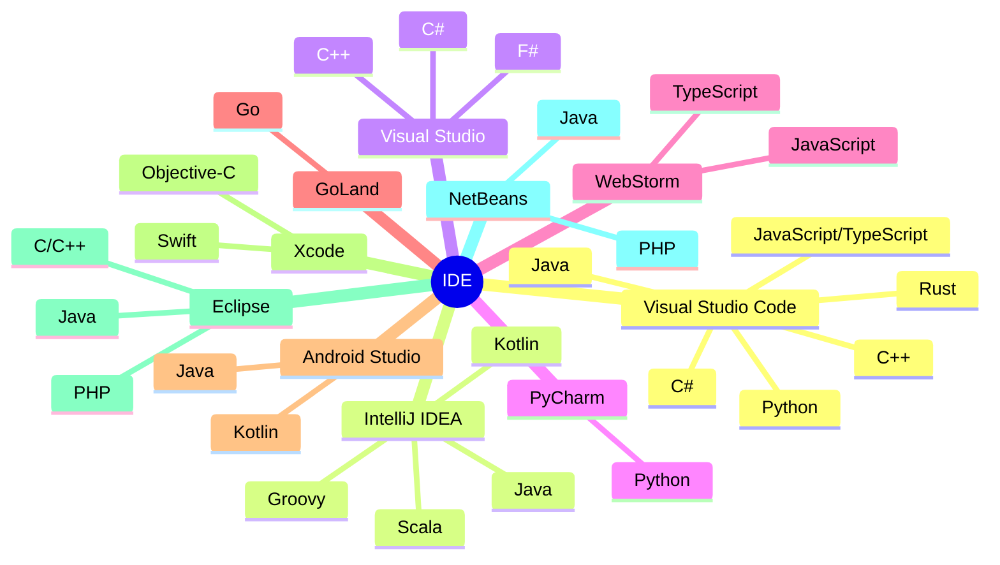
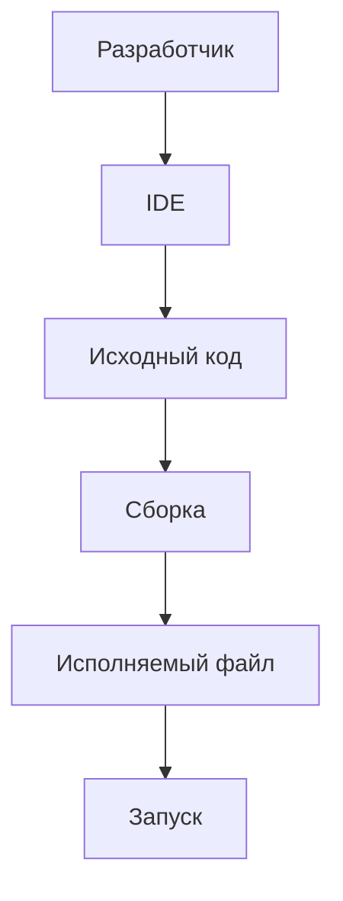

import ExternalPlayEmbed from '@site/src/components/ExternalPlayEmbed';

# Интегрированные среды разработки (IDE)

  ОБЯЗАТЕЛЬНО
  ДЛЯ НОВИЧКОВ

Разработчику
Аналитику
Тестировщику  
Архитектору
Инженеру

---

## Интегрированные среды разработки (IDE)

### Интегрированная среда разработки

★ **Интегрированная среда разработки** (ИСР, **IDE** — *integrated development environment*) — комплекс программных средств, в котором программист пишет, собирает, запускает и отлаживает программы. В одном приложении объединены **редактор исходного кода**, **транслятор** (компилятор и/или интерпретатор), средства **автоматизации сборки**; часто — отладчик, интеграция с **системой управления версиями**, визуальные конструкторы интерфейса, браузер классов и диаграммы иерархии (для ООП).

Цель интеграции — сократить переключения между отдельными утилитами (редактор, компилятор, отладчик в терминале) и дать **мгновенную обратную связь** — подсветка синтаксиса, сообщения об ошибках до запуска, подсказки по API. Сложная ИСР окупается после обучения; у JetBrains, Microsoft и других производителей интерфейсы родственных продуктов сознательно сближают, чтобы переход между IDE был проще.

| Компонент типичной IDE | Задача |
|------------------------|--------|
| Редактор исходного кода | Ввод и правка текста программы |
| Транслятор / сборка | Превращение исходников в исполняемый файл или байт-код |
| Отладчик | Пошаговое выполнение, точки останова, просмотр переменных |
| SCM (Git и др.) | История изменений, diff, ветки |
| Плагины / расширения | Языки, линтеры, фреймворки, темы |

**ИСР для одного языка** (Delphi, старый Visual Basic) встречаются реже, чем **мультиязычные** (IntelliJ IDEA, Eclipse, Visual Studio, VS Code с расширениями). **Среды визуальной разработки** — частный случай IDE с перетаскиванием элементов формы (WinForms, WPF Designer, Android Layout Editor). Для WinForms/WPF без Designer — готовые окна с разбором в [Lab — 1138](/lab/Примеры/1138).

  
Откуда взялась IDE

  

  Первый язык с интегрированной средой — **Dartmouth BASIC** (1964): в одной консоли правили исходник, компилировали и запускали.

  В 1975 году **Maestro I** (Softlab, Германия) считается одной из первых коммерческих IDE; к 1980-м её использовали десятки тысяч разработчиков.

  Текстовые IDE до массового GUI — **Turbo Pascal** (Borland): меню и горячие клавиши вместо окон.

  Сегодня почти все IDE графические; ранний пример подсветки синтаксиса — редактор **LEXX** (1985), созданный при оцифровке Оксфордского словаря.

### Редактор исходного кода и обычный текстовый редактор

★ **Редактор исходного кода** — текстовый редактор, заточенный под программы — подсветка синтаксиса, автодополнение, отступы, проверка парных скобок, контекстная справка, запуск компилятора или интерпретатора из меню. Может быть **отдельным приложением** (Notepad++, Vim) или **ядром IDE** (Monaco в VS Code, редактор в Visual Studio).

Обычный **текстовый редактор** (Блокнот Windows) тоже открывает `.py` и `.java`, но без лексического анализа и подсказок это просто файл символов. Граница — в **автоматизации ввода и анализа структуры кода**, а не в расширении файла.

**Visual Studio Code** формально позиционируется Microsoft как "лёгкий" редактор, но по возможностям (отладка, Git, IntelliSense, рефакторинг через расширения) часто приравнивают к IDE; ядро — веб-редактор **Monaco** на платформе **Electron** (анонс на Build 2015, релиз под MIT в ноябре 2015). **Notepad++** (2003, Don Ho, движок **Scintilla**, GPL) — классический лёгкий редактор под Windows — подсветка, сворачивание блоков, макросы, плагины; на Linux аналоги — Kate, Notepadqq. **Vim** (*Vi IMproved*, с 1991) — терминальный редактор с режимами "команды" и "вставки"; в опросах Stack Overflow долго входил в топ редакторов; расширения и **LSP** (например через coc.nvim) дают автодополнение уровня IDE.

Любому новичку следует начать с VS Code – самая простая IDE, с первого взгляда неотличима по сложности от блокнота, да и к тому же автоматически определит язык, и не возьмёт ни копейки. При запуске можно сразу установить себе расширения для нужных языков – к примеру, HTML, CSS, JavaScript, Python, C#, Java.

---

### Обучение работе с IDE

<ExternalPlayEmbed example="tools-development/ide-workspace-demo" title="IDE Workspace Demo" minHeight={400} />

  
Практическое задание

  

Выполните нижеследующее задание.

  

---

★ Давайте научимся основам.

Пример работы:

---

#### Шаг 1

Запускаем VS Code и создаём новый файл (Файл – Создать файл, или Создать текстовый файл):

---

#### Шаг 2

Пишем `print("Привет!")` и видим, что это просто текст:

---

#### Шаг 3

Если установить расширение, которое подсвечивает и распознаёт синтаксис Python, к примеру одноимённое (к слову, устанавливаются они через Marketplace путём простого поиска в самом VS Code):

---

#### Шаг 4

То мы увидим, как синтаксис подсветился, обозначив ключевые слова особым цветом:

---

#### Шаг 5

А если сохранить файл, к примеру в нашем случае как "Hello.py"

---

И нажать на "Запуск и отладка" - то мы увидим в нижней части окна, что программа запустилась и вывела "Привет!" - мы выполнили команду "print", которая вывела текст в кавычках.

---

К слову, можете себе сохранить чит-лист VS Code:
https://cheatsheets.zip/vscode

Так и работает IDE. Человек пишет код и может сразу проверить, работает ли он. Этот принцип работает на всех языках и во всех IDE. Можно писать где-нибудь ещё, в блокноте, на каких-то веб-страницах или Notepad++, а потом вставить код в IDE и сразу увидеть подсветку ошибок.

Говоря об ошибках, если мы вдруг начали писать с ошибками синтаксиса, допустим написав "непонятные" программе слова, то сразу увидим список проблем в нижней части консоли – IDE заботливо подскажет, на какой строчке есть ошибка, и что именно ей "не нравится". Пока ошибки не будут устранены, код не запустится.

---

### Возможности IDE

#### Подсветка синтаксиса

★ **Подсветка синтаксиса** — выделение конструкций языка **цветом, шрифтом и начертанием**, чтобы код читался быстрее и ошибки бросались в глаза. Типичные категории раскраски:

- конструкции языка (ключевые слова, операторы);
- комментарии;
- числовые и строковые литералы;
- в продвинутых редакторах — имена переменных, вызовы стандартных функций, **парные скобки** под курсором.

Внутри редактора обычно идут **лексический анализ** (разбиение на токены) и **парсинг** (проверка структуры — закрыты ли блоки, кавычки, скобки). Некорректный фрагмент могут подсвечивать отдельно ещё до компиляции. Тема оформления (светлая / тёмная) задаёт палитру; для публикации кода в интернете используют библиотеки вроде **Pygments**, **highlight.js**, **Scintilla** (основа Notepad++ и части других редакторов).

#### Автодополнение и IntelliSense

★ **Автодополнение** (*autocomplete*) — подсказка **завершающей части** вводимого текста: в оболочках Unix по Tab дополняют имена файлов; в IDE — имена методов, полей, параметров. Редактор смотрит контекст (класс `User`, импорты, локальные переменные), **ранжирует** варианты и фильтрует по уже набранным буквам.

★ **IntelliSense** — торговая марка Microsoft для "умного" автодополнения — списки членов после точки, описание функции, выбор перегрузки по списку аргументов, опора на **метаданные** и рефлексию (.NET). Появился в Visual Basic 5.0 CCE (1996), затем в Visual Studio 97; с **.NET** и XML-документацией подсказки стали богаче. С Visual Studio 2005 варианты часто показывают **сразу при наборе**, без обязательной точки. Аналоги — **Language Server Protocol** в VS Code, анализаторы JetBrains, **rust-analyzer** и др. Подробнее про пошаговую отладку — [Отладка](/encyclopedia/4-code-dev/4-14-razrabotka-i-otladka/111).

#### Отступы и скобки в коде

★ **Стиль отступов** (*indentation*) — соглашение, **сколько пробелов или табов** сдвигают вложенные блоки (`if`, циклы, функции). В C-подобных языках спорят о положении `{` и `}` — **K&R** (скобка на той же строке, что и `if`), **Allman** (скобка с новой строки — стиль по умолчанию в Visual Studio), **Whitesmiths**, **GNU** (отступ 2 пробела в проектах GNU). В **Python** отступ **обязателен** для структуры блока. IDE помогают — автоотступ при Enter, **Format Document**, подсветка несогласованных табов и пробелов.

В программировании главные **парные скобки** — круглые `()` (вызов, приоритет), квадратные `[]` (массивы, индексы), фигурные `{}` (блоки в C/Java/JS), угловые `<>` в C++/C# для **шаблонов и дженериков** и в `#include <stdio.h>`. Редактор подсвечивает пару под курсором и предупреждает о незакрытой скобке — это снижает долю синтаксических ошибок при ручном наборе.

#### Отладчик

★ **Отладчик** — программа для **автоматизации поиска ошибок** в другом коде — трассировка, точки останова, просмотр и изменение переменных. **Символьные** отладчики работают с исходным текстом в IDE; **машинные** — с процессорными инструкциями и дизассемблером (GDB, WinDbg). Встроенный отладчик IDE — главный инструмент локализации дефектов до выкладки в прод.

---

### Отладка

#### Шаг 1

Точки останова (не остановки, а именно точка останова – breakpoint) – вы отмечаете нужную строку в крайней точке слева:

---

#### Шаг 2

После выбора строки, точка будет отмечена, и выполнение остановится перед указанной строкой. К примеру, у вас в коде 100 строк, и вы знаете, что первые 30 работают как нужно, и ставите точку на 31-й строке, и таким образом, отслеживаете путь выполнение от 31-й до конца.

---

#### Шаг 3

Отладка происходит путём выполнения программы "шаг за шагом" (Step By Step):
	- Step Over – переход к следующей строке;
	- Step Into – заход в функцию (внутрь);
	- Step Out – выход из функции (наружу).

---

#### Шаг 4

Инспекция переменных – если вы объявляли переменные и как-то в логике задавали им значение, то программа это выведет в консоли отладки, показав текущие значения переменных, допустим, что x=5.

---

В IDE встроена интеграция с **Git** — отслеживание новых и изменённых файлов, diff, команды из интерфейса. Подробный маршрут — [Основы работы с Git](/encyclopedia/4-code-dev/4-13-osnovy-raboty-s-git/intro). Многие IDE подсвечивают в комментариях пометки **TODO**, **FIXME**, **HACK** — напоминания о незавершённой работе, которые удобно искать по проекту.

Таким образом,
	- вы пишете код → подсветка помогает видеть структуру;
	- набираете user. → автодополнение предлагает user.name;
	- запускаете отладку → отладчик ловит ошибку в user.name;
	- фиксируете исправление в Git.

---

## Виды и особенности IDE

**Visual Studio Code (VS Code)** — кроссплатформенный редактор от Microsoft (Windows, Linux, macOS) — отладчик, Git, подсветка, IntelliSense через расширения, палитра команд, тысячи плагинов в Marketplace (языки, Docker, темы, линтеры). Исходники на GitHub под MIT; готовые установщики — с проприетарной лицензией. Телеметрию можно отключить в настройках.

- Сайт — https://code.visualstudio.com/
- Чит-лист — https://cheatsheets.zip/vscode

**IntelliJ IDEA (JetBrains)** — IDE с января 2001 года; одна из первых для Java с **интегрированным рефакторингом**. Ориентирована на продуктивность — анализ кода, Spring, микросервисы. **Community Edition** (Apache 2.0) — Java SE, Kotlin, Groovy, Scala; **Ultimate** — Jakarta EE, UML, покрытие кода, дополнительные VCS. Написана на Java (Swing), работает на JVM. Подробный обзор — [IntelliJ IDEA — IDE для разработки на Java](/encyclopedia/5-languages/5-03-java/103).

- Сайт — https://www.jetbrains.com/idea/
- Чит-лист — https://cheatsheets.zip/idea

**Microsoft Visual Studio** — линейка IDE с 1997 года (раньше Visual Basic, Visual C++ и др. шли отдельными коробками). **Visual Studio 97** впервые собрала инструменты в одну линейку. Сегодня — C#, C++, F#, Python, TypeScript, визуальные дизайнеры форм и БД, **IntelliSense**, отладчик уровня исходника и машинного кода, расширения (анализ кода, Team Foundation Server). Для .NET и Windows-десктопа — эталонная среда; **не путать** с VS Code. Подробный обзор — [Visual Studio — IDE для разработки на C#](/encyclopedia/5-languages/5-05-csharp/103).

- Сайт — https://visualstudio.microsoft.com/ru/

**Apache NetBeans** — Java-IDE с 1996 (проект **Xelfi** в Карловом университете, Прага). Sun открыла исходники в 2000; с 2016 года — проект **Apache**. Рефакторинг, профилирование, визуальный GUI Builder (бывший Matisse), плагины (iReport и др.). "Из коробки" — Java (SE/EE/ME), C/C++, PHP, HTML/JS; исторически — Ruby on Rails (позже вынесен в плагин сообщества). Платформа **NetBeans Platform** — основа для модульных Swing-приложений.

- Сайт — https://netbeans.apache.org/

**PyCharm** – Python. Многие научные инструменты в платной версии, но есть автодополнение, подсказки, интеграция с Docker, неплохой визуальный отладчик.

Официальный сайт - https://www.jetbrains.com/pycharm/

**Eclipse** – Java, C/C++, PHP, и даже Fortran (!). Полная кастомизация, поддержка легаси-проектов, плагины для моделирования, но старый интерфейс.

Официальный сайт - https://eclipseide.org/

**Xcode** – IDE для macOS, для Swift, Objective-C, C++. Визуальный конструктор, профилировщик памяти, инструменты для дополненной реальности. Подробный обзор — [Xcode — IDE для экосистемы Apple](/encyclopedia/5-languages/5-14-swift/26).

Официальный сайт - https://developer.apple.com/xcode/

**Android Studio** – эмулятор устройств с настройкой любых разрешений, поддержка Kotlin, Java, C++, но довольно ресурсопотребляющий.

Официальный сайт - https://developer.android.com/studio

Чит-лист - https://cheatsheets.zip/android-studio

**GoLand** – для Go. Автоимпорт пакетов при наборе кода, хороший отладчик, и нет бесплатной версии. Подробный обзор — [GoLand — IDE для разработки на Go](/encyclopedia/5-languages/5-10-go/102).

Официальный сайт - https://www.jetbrains.com/go/

**WebStorm** – JavaScript, TypeScript, CSS. Дорогая подписка, но интеллектуальное автодополнение для React/Vue, встроенный REST-клиент для тестирования API, анализ зависимостей.

Официальный сайт - https://www.jetbrains.com/webstorm/

Чит-лист - https://cheatsheets.zip/webstorm

Существует и много других IDE, и вышеуказанный список не является "топом" - дело привычки, вкуса – кому-то удобно работать в NetBeans, а кому-то в [IntelliJ IDEA](/encyclopedia/5-languages/5-03-java/103). Для начинающих лучше пробовать скрипты в VS Code, а потом пощупать NetBeans и [Visual Studio](/encyclopedia/5-languages/5-05-csharp/103), PyCharm, WebStorm или [GoLand](/encyclopedia/5-languages/5-10-go/102), зависит от языка, на котором фокусируется разработчик, по мере специализации. Для macOS и Swift — [Xcode](/encyclopedia/5-languages/5-14-swift/26).

Важно. Для комфортной разработки лучше запастись оперативной памятью и значительным местом на диске. Желательно использовать SSD и 32 ГБ ОЗУ. В противном случае, при мощных экспериментах можно сталкиваться с вылетами или зависаниями. А вылететь, не сохранив работу – всегда больно.

  
Практическое задание

  

Если вы планируете учиться всем языкам по этой книге, можете заранее установить все эти IDE
 (ну, кроме Xcode, если у вас нет под рукой macOS).

  

### Справочные статьи (Википедия)

Термины и история в этом материале опираются на русскоязычную Википедию — удобно для углубления:

- [Интегрированная среда разработки](https://ru.wikipedia.org/wiki/%D0%98%D0%BD%D1%82%D0%B5%D0%B3%D1%80%D0%B8%D1%80%D0%BE%D0%B2%D0%B0%D0%BD%D0%BD%D0%B0%D1%8F_%D1%81%D1%80%D0%B5%D0%B4%D0%B0_%D1%80%D0%B0%D0%B7%D1%80%D0%B0%D0%B1%D0%BE%D1%82%D0%BA%D0%B8), [редактор исходного кода](https://ru.wikipedia.org/wiki/%D0%A0%D0%B5%D0%B4%D0%B0%D0%BA%D1%82%D0%BE%D1%80_%D0%B8%D1%81%D1%85%D0%BE%D0%B4%D0%BD%D0%BE%D0%B3%D0%BE_%D0%BA%D0%BE%D0%B4%D0%B0), [отладчик](https://ru.wikipedia.org/wiki/%D0%9E%D1%82%D0%BB%D0%B0%D0%B4%D1%87%D0%B8%D0%BA)
- [Подсветка синтаксиса](https://ru.wikipedia.org/wiki/%D0%9F%D0%BE%D0%B4%D1%81%D0%B2%D0%B5%D1%82%D0%BA%D0%B0_%D1%81%D0%B8%D0%BD%D1%82%D0%B0%D0%BA%D1%81%D0%B8%D1%81%D0%B0), [автодополнение](https://ru.wikipedia.org/wiki/%D0%90%D0%B2%D1%82%D0%BE%D0%B4%D0%BE%D0%BF%D0%BE%D0%BB%D0%BD%D0%B5%D0%BD%D0%B8%D0%B5), [IntelliSense](https://ru.wikipedia.org/wiki/IntelliSense), [отступ](https://ru.wikipedia.org/wiki/%D0%9E%D1%82%D1%81%D1%82%D1%83%D0%BF_(%D0%BF%D1%80%D0%BE%D0%B3%D1%80%D0%B0%D0%BC%D0%BC%D0%B8%D1%80%D0%BE%D0%B2%D0%B0%D0%BD%D0%B8%D0%B5)), [скобки](https://ru.wikipedia.org/wiki/%D0%A1%D0%BA%D0%BE%D0%B1%D0%BA%D0%B8)
- [IntelliJ IDEA](https://ru.wikipedia.org/wiki/IntelliJ_IDEA), [NetBeans](https://ru.wikipedia.org/wiki/NetBeans), [Microsoft Visual Studio](https://ru.wikipedia.org/wiki/Microsoft_Visual_Studio), [Visual Studio Code](https://ru.wikipedia.org/wiki/Visual_Studio_Code), [Notepad++](https://ru.wikipedia.org/wiki/Notepad++), [Vim](https://ru.wikipedia.org/wiki/Vim)

---
