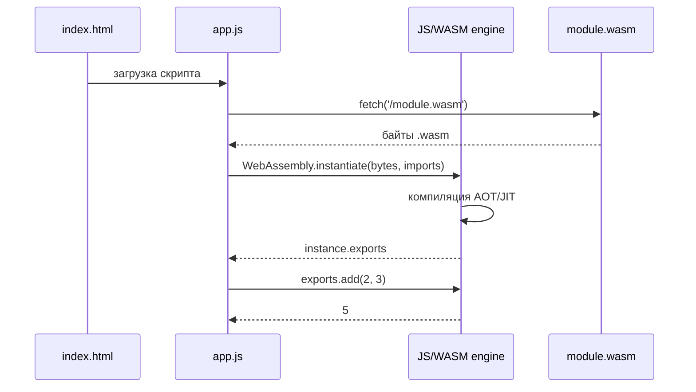
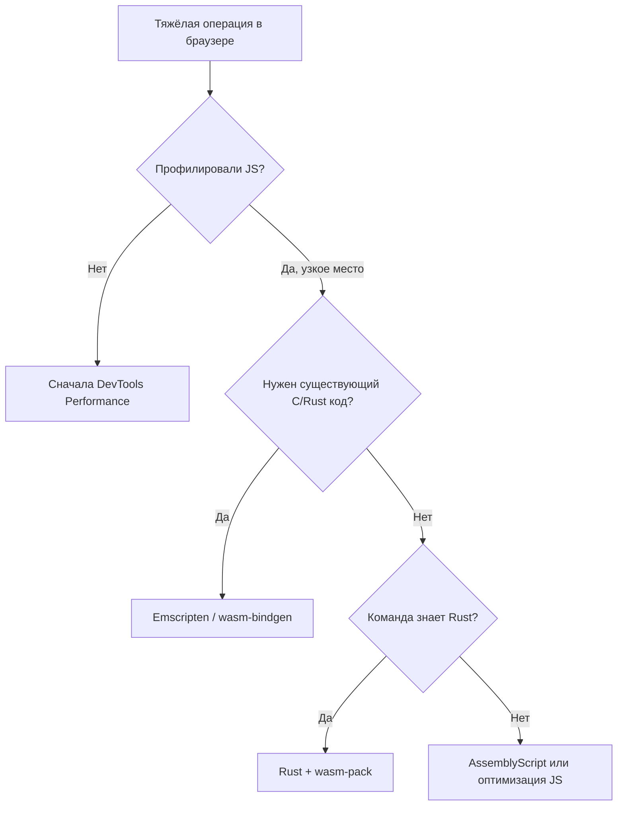

# WebAssembly (WASM) — что это и когда использовать

<div class="article-tags">
  <span class="tag tag-required">ОБЯЗАТЕЛЬНО</span>
  <span class="tag tag-beginner">ДЛЯ НОВИЧКОВ</span>
</div>

<span class="complexity-badge">Разработчику</span>
<span class="complexity-badge">Архитектору</span>

---

## WebAssembly (WASM)

**WebAssembly (WASM)** — бинарный формат и виртуальная машина для **быстрого** и **предсказуемого** кода рядом с [JavaScript](/encyclopedia/5-languages/5-01-javascript/intro) в браузере и за его пределами:

- [Node.js](/encyclopedia/5-languages/5-01-javascript/3-ecosystem/1-runtime-node/262);
- edge-вычисления (Cloudflare Workers, Fastly Compute);
- плагины в sandbox (Wasmer, Wasmtime).

WASM **дополняет** JS: UI, сеть и DOM — на JS/TS, тяжёлые вычисления — на WASM.

Общая база про [компиляцию и байт-код](./1.md) помогает понять, почему WASM ближе к машинному коду, чем к исходнику Python.

| Шаг | Тема | Результат |
|-----|------|-----------|
| 1 | Термины и формат `.wasm` | Понимание, что внутри модуля |
| 2 | Загрузка в браузере | Минимальный JS + WASM |
| 3 | Rust + wasm-bindgen | Реальный проект |
| 4 | Сравнение с JS | Когда ускорение оправдано |
| 5 | WASM вне браузера | Node, Wasmer, edge |

<div class="callout callout--tip">
  <div class="callout-title">С чего начать новичку</div>
  <div class="callout-body">
  Если вы ещё не прошли <a href="/encyclopedia/5-languages/5-01-javascript/3-ecosystem/1-runtime-node/262">первую программу на Node.js</a> и базовый <a href="/encyclopedia/5-languages/5-01-javascript/intro">JavaScript</a>, начните с них. WASM всегда работает <strong>в паре</strong> с JS или другим хостом — без понимания JS загрузка модуля будет непонятной.
  </div>
</div>

---

## Глоссарий терминов

| Термин | Простое объяснение |
|--------|-------------------|
| **WASM / WebAssembly** | Открытый стандарт бинарного формата и виртуальной машины для быстрого кода |
| **Модуль `.wasm`** | Скомпилированный файл с функциями, памятью и таблицами |
| **Linear memory** | Один непрерывный массив байт, общий между WASM и хостом |
| **Export / Import** | Функции и память, которые модуль отдаёт наружу или получает от хоста |
| **Instantiate** | Создание работающего экземпляра модуля в runtime |
| **JIT / AOT** | Just-in-time — компиляция при запуске; ahead-of-time — заранее |
| **wasm-bindgen** | Инструмент Rust для генерации JS-обёрток |
| **Emscripten** | Компилятор C/C++ в WASM |
| **Source map** | Карта соответствия скомпилированного кода исходникам для отладки |
| **Sandbox** | Изолированная среда без прямого доступа к файлам и сети |
| **Host** | Программа, которая загружает WASM (браузер, Node.js, Wasmtime) |

---

## Что такое WASM

| Свойство | Описание |
|----------|----------|
| Формат | Компактный `.wasm` — секции типов, функций, памяти, экспортов |
| Выполнение | JIT/AOT в браузере (V8, SpiderMonkey, JavaScriptCore) или wasmtime/wasmer |
| Языки | Rust, C/C++, Go, C# (Blazor), AssemblyScript, Zig и др. |
| Память | Линейная память (`WebAssembly.Memory`); обмен с JS через API |
| Безопасность | Sandbox как у JS — без прямого доступа к DOM и файловой системе |

WASM **не** имеет DOM API. Модуль экспортирует функции; JS вызывает их и копирует данные через `WebAssembly.Memory`.

### Структура модуля `.wasm`

Бинарный файл состоит из **секций** (упрощённо):

- **Type** — сигнатуры функций (какие аргументы и возвращаемые значения);
- **Function** — индексы функций;
- **Memory** — описание линейной памяти;
- **Export** — что доступно снаружи (`add`, `memory`, …);
- **Code** — тело функций в байт-коде WASM.

Текстовое представление — **WAT** (WebAssembly Text Format). Его можно читать и писать вручную для обучения, но в production обычно генерируют компилятором.

Пример WAT (сложение двух чисел):

```wat
(module
  (func (export "add") (param i32 i32) (result i32)
    local.get 0
    local.get 1
    i32.add)
)
```

Компиляция в `.wasm`:

```bash
wat2wasm add.wat -o add.wasm
```

Инструмент `wat2wasm` входит в пакет [WABT](https://github.com/WebAssembly/wabt).

---

## Как браузер выполняет WASM



Этапы подробнее:

1. **Fetch** — браузер скачивает `.wasm` по HTTP(S). Нужен корректный MIME-тип `application/wasm`.
2. **Compile** — движок парсит секции и компилирует в машинный код (часто параллельно с загрузкой).
3. **Instantiate** — создаётся `instance` с `exports` и подключаются `imports` из JS.
4. **Call** — JS вызывает экспортированные функции; данные передаются как числа или через память.

<div class="callout callout--info">
  <div class="callout-title">instantiateStreaming</div>
  <div class="callout-body">
  <code>WebAssembly.instantiateStreaming(fetch(url), imports)</code> начинает компиляцию до полной загрузки файла — быстрее, чем <code>fetch</code> + <code>instantiate</code> по отдельности. Требует корректного Content-Type на сервере.
  </div>
</div>

---

## Связь с JavaScript

Типичный поток в браузере:

```text
index.html
  └── app.js (загрузка, UI, fetch)
        └── instantiateStreaming(fetch('module.wasm'))
              └── wasm exports: add, process_buffer, ...
```

### Минимальный HTML + JS

`index.html`:

```html
<!DOCTYPE html>
<html lang="ru">
<head>
  <meta charset="utf-8">
  <title>WASM demo</title>
</head>
<body>
  <p>Результат: <span id="out">…</span></p>
  <script type="module" src="app.js"></script>
</body>
</html>
```

`app.js`:

```javascript
async function main() {
  const response = await fetch('/add.wasm');
  if (!response.ok) throw new Error(`HTTP ${response.status}`);

  const { instance } = await WebAssembly.instantiateStreaming(response, {});
  const sum = instance.exports.add(2, 3);
  document.getElementById('out').textContent = String(sum);
}

main().catch(console.error);
```

Разбор:

- `fetch` возвращает `Response` с телом `.wasm`;
- `instantiateStreaming` компилирует и создаёт `instance`;
- `instance.exports.add` — функция из WAT/WASM модуля;
- DOM обновляет только JS — WASM не трогает HTML напрямую.

### Передача строк и объектов

JS передаёт в WASM в основном **числа** (i32, i64, f32, f64). Для строк и структур:

- копируют байты в **linear memory** и передают **смещение** и **длину**;
- используют библиотеки glue-кода (**wasm-bindgen**, **Emscripten**, **wit-bindgen**).

Без glue вручную нужно согласовать layout байт (кодировка UTF-8, выравнивание).

---

## Практикум 1 — WAT вручную

### Шаг 1. Установка WABT

**Linux (Debian/Ubuntu):**

```bash
sudo apt install wabt
```

**macOS:**

```bash
brew install wabt
```

**Windows:** скачайте бинарники с [релизов WABT](https://github.com/WebAssembly/wabt/releases) или используйте WSL.

Проверка:

```bash
wat2wasm --version
```

### Шаг 2. Файл add.wat

Создайте `add.wat` (см. пример выше в разделе "Структура модуля").

### Шаг 3. Сборка

```bash
wat2wasm add.wat -o add.wasm
```

### Шаг 4. Локальный сервер

Браузер не откроет `fetch` с `file://` — нужен HTTP. Из папки проекта:

```bash
npx serve .
```

или Python:

```bash
python -m http.server 8080
```

Откройте `http://localhost:8080` — в `#out` должно быть `5`.

### Шаг 5. Отладка в DevTools

Chrome → **Sources** → **WebAssembly** → откройте `add.wasm`, поставьте breakpoint на `add`. Перезагрузите страницу — выполнение остановится внутри WASM.

---

## Rust → WASM (полный практикум)

Популярный production-путь — **wasm-pack** + **wasm-bindgen**.

### Подготовка

```bash
curl --proto '=https' --tlsv1.2 -sSf https://sh.rustup.rs | sh
rustup target add wasm32-unknown-unknown
cargo install wasm-pack
```

Проверка:

```bash
rustc --version
wasm-pack --version
```

### Шаг 1. Создание библиотеки

```bash
cargo new --lib wasm-demo
cd wasm-demo
```

### Шаг 2. Cargo.toml

```toml
[package]
name = "wasm-demo"
version = "0.1.0"
edition = "2021"

[lib]
crate-type = ["cdylib"]

[dependencies]
wasm-bindgen = "0.2"
```

`cdylib` — динамическая библиотека для WASM, без Rust runtime в финальном модуле.

### Шаг 3. src/lib.rs

```rust
use wasm_bindgen::prelude::*;

#[wasm_bindgen]
pub fn add(a: i32, b: i32) -> i32 {
    a + b
}

#[wasm_bindgen]
pub fn fib(n: u32) -> u32 {
    match n {
        0 => 0,
        1 => 1,
        _ => fib(n - 1) + fib(n - 2),
    }
}
```

`#[wasm_bindgen]` генерирует JS-обёртки при сборке.

### Шаг 4. Сборка для web

```bash
wasm-pack build --target web
```

Артефакты в `pkg/`:

- `wasm_demo_bg.wasm` — модуль;
- `wasm_demo.js` — glue-код;
- `wasm_demo.d.ts` — типы для TypeScript.

### Шаг 5. Подключение в Vite

Создайте проект [Vite](/encyclopedia/5-languages/5-01-javascript/3-ecosystem/2-frontend-frameworks/288):

```bash
npm create vite@latest wasm-vite -- --template vanilla-ts
cd wasm-vite
```

Скопируйте `pkg/` в `src/wasm-demo/`. В `main.ts`:

```typescript
import init, { add, fib } from './wasm-demo/wasm_demo.js';

async function run() {
  await init();
  console.log('add(2, 3) =', add(2, 3));
  console.time('fib-wasm');
  console.log('fib(35) =', fib(35));
  console.timeEnd('fib-wasm');
}

run();
```

`init()` загружает и инициализирует `.wasm`.

### Шаг 6. Сравнение с JavaScript

В том же `main.ts`:

```typescript
function fibJs(n: number): number {
  if (n <= 1) return n;
  return fibJs(n - 1) + fibJs(n - 2);
}

console.time('fib-js');
console.log('fibJs(35) =', fibJs(35));
console.timeEnd('fib-js');
```

На типичном ноутбуке WASM быстрее в 2–5 раз для `fib(35)`. Для `fib(40)` разрыв ещё заметнее. Откройте **Performance** в DevTools и сравните flame chart.

Подходит для:

- криптографии;
- парсеров (JSON, protobuf, custom binary);
- игровой физики;
- обработки изображений и видео в браузере.

Плюсы Rust в WASM:

- без GC в WASM-модуле;
- контроль памяти;
- предсказуемая производительность.

Минусы:

- размер бандла (десятки–сотни KB даже для маленькой функции);
- learning curve [Rust](/encyclopedia/5-languages/5-13-rust/intro);
- отладка сложнее, чем чистый TS.

---

## C и C++ через Emscripten

Legacy-код и библиотеки на C/C++ часто портируют через **Emscripten** — LLVM-бэкенд в WASM + JS glue.

Установка (кратко): следуйте [официальному гайду Emscripten](https://emscripten.org/docs/getting_started/downloads.html).

Пример `hello.c`:

```c
#include <stdio.h>

int main() {
  printf("Hello from Emscripten\n");
  return 0;
}
```

Сборка:

```bash
emcc hello.c -o hello.html
```

Emscripten генерирует HTML + JS + WASM — можно открыть в браузере. Для интеграции с React/Vite обычно собирают только `.wasm` + минимальный glue.

Когда выбирают Emscripten:

- портирование **ffmpeg**, **SQLite**, игровых движков;
- reuse существующего C/C++ кода;
- команда знает C++, но не Rust.

---

## AssemblyScript

**AssemblyScript** — TypeScript-подобный синтаксис, компилируемый в WASM. Удобен, если вы знаете TS, но не хотите учить Rust.

```bash
npm install -g assemblyscript
npm init
npx asinit
```

`assembly/index.ts`:

```typescript
export function add(a: i32, b: i32): i32 {
  return a + b;
}
```

Сборка:

```bash
npm run asbuild
```

Ограничения: не весь TS — только подмножество, близкое к WASM-типам (`i32`, `f64`, …).

---

## C# → WASM (Blazor)

**.NET** компилируется в WASM для **Blazor WebAssembly** — SPA на C# в браузере. Runtime .NET загружается один раз; приложение выполняется локально в браузере.

**Blazor Server** выполняет C# на сервере и стримит UI по SignalR — WASM не используется на клиенте.

| Критерий | Blazor WASM | Blazor Server |
|----------|-------------|---------------|
| Где выполняется C# | браузер | сервер |
| Первый загруз | тяжёлый (скачивается .NET runtime) | лёгкий |
| Офлайн | возможен | нет |
| Масштабирование | нагрузка на клиент | нагрузка на сервер |

Создание проекта:

```bash
dotnet new blazorwasm -o BlazorApp
cd BlazorApp
dotnet run
```

Для greenfield веб-UI чаще React/Vue/Svelte; Blazor — когда команда уже на [.NET](/encyclopedia/5-languages/5-04-platforma-dotnet/intro) и хочет единый язык на клиенте и сервере.

---

## Go → WASM

Go поддерживает `GOOS=js GOARCH=wasm`, но размер модулей historically был большим (мегабytes из-за runtime). Для tiny WASM модулей Go используют реже, чем Rust. Проверяйте актуальные размеры для вашей версии Go перед выбором.

```bash
GOOS=js GOARCH=wasm go build -o main.wasm main.go
```

---

## Когда использовать WASM

| Сценарий | WASM | Достаточно JS |
|----------|------|---------------|
| Видео/аудио кодеки, ffmpeg в браузере | ✓ | слабо |
| Редакторы (Figma-подобная графика) | ✓ | |
| Криптография, hashing больших данных | ✓ | Web Crypto API для простого |
| Игры 2D/3D (Unity, Godot export) | ✓ | Canvas для простого |
| Парсинг больших файлов на клиенте | ✓ | |
| Обычная форма и CRUD | | ✓ |
| SSR и SEO-страницы | | ✓ HTML/JS |
| REST API на сервере | | ✓ Node/Python/Go |

**Правило:** профилируйте сначала. Преждевременный WASM усложняет сборку, CI и отладку. Если `ArrayBuffer` и Web Workers решают задачу — начните с них.



---

## WASM вне браузера

### Node.js

В [Node.js](/encyclopedia/5-languages/5-01-javascript/3-ecosystem/1-runtime-node/26) глобальный объект `WebAssembly` доступен с версии 8+. Тот же API, что в браузере:

```javascript
import { readFile } from 'node:fs/promises';

const bytes = await readFile('./add.wasm');
const { instance } = await WebAssembly.instantiate(bytes);
console.log(instance.exports.add(10, 20));
```

Use case: тяжёлые вычисления в worker threads, единый WASM-модуль для браузера и сервера.

### Wasmer и Wasmtime

**Wasmer** и **Wasmtime** — standalone runtime для WASM:

- sandbox-плагины (редакторы, CI);
- serverless functions;
- изоляция непроверенного кода.

Концепция близка к JVM/.NET CLR, но формат открыт и ориентирован на web-first.

### Edge (Cloudflare Workers)

Cloudflare Workers поддерживают WASM-модули как расширения к JS. Проверяйте лимиты размера и API для вашего тарифа.

---

## Безопасность и sandbox

WASM-модуль в браузере:

- **не** читает файлы диска;
- **не** открывает сокеты напрямую;
- **не** трогает DOM;
- получает только то, что передал **host** через imports.

Это та же модель доверия, что у JS — код из интернета выполняется в песочнице. Уязвимости в runtime (баги движка) возможны, как и для JS JIT.

Для секретов (API keys) — **никогда** не вшивайте в WASM; бинарник можно декомпилировать. Секреты — только на сервере.

---

## Ограничения и эволюция стандарта

- Нет прямого доступа к DOM — только через JS.
- Отладка сложнее, чем в чистом TS (source maps и DWARF в WASM улучшают ситуацию).
- Размер: Rust/.NET runtime + модуль могут быть мегабайты — нужен code splitting и lazy load.
- **Threads** (SharedArrayMemory) — требуют заголовков COOP/COEP на сервере.
- **GC proposal** — объектная модель в WASM; поддержка браузеров растёт — проверяйте [caniuse.com/wasm](https://caniuse.com/wasm).

---

## Оптимизация размера бандла

| Приём | Эффект |
|-------|--------|
| `wasm-opt` (Binaryen) | Уменьшает `.wasm` на 10–30% |
| LTO в Rust (`RUSTFLAGS="-C link-arg=--gc-sections"`) | Убирает мёртвый код |
| Lazy load WASM | Не грузить модуль до первого использования |
| `wee_alloc` в Rust | Меньший аллокатор для tiny modules |
| Динамический import в Vite | Отдельный chunk для WASM |

```bash
# после wasm-pack build
wasm-opt -Oz pkg/wasm_demo_bg.wasm -o pkg/wasm_demo_bg.opt.wasm
```

---

## Интеграция с TypeScript и Vite

В [TypeScript](/encyclopedia/5-languages/5-10-typescript/intro) проектах:

- импортируйте glue из `pkg/*.js`;
- типы из `*.d.ts`;
- в `vite.config.ts` для некоторых пакетов нужен плагин `vite-plugin-wasm` — проверяйте документацию wasm-pack для вашей версии.

Типичная структура:

```text
src/
  wasm/
    pkg/          # артеfact wasm-pack
  main.ts
  components/
```

CI: добавьте шаг `wasm-pack build` перед `npm run build`.

---

## WASM Component Model (обзор)

**Component Model** — следующий уровень абстракции: композиция нескольких WASM-модулей с типизированными интерфейсами (WIT — WebAssembly Interface Types). Полезно для:

- плагинных систем;
- polyglot микросервисов в одном процессе;
- стандартизации ABI между языками.

На 2025–2026 поддержка ещё набирает обороты — для учебных проектов достаточно классических модулей + wasm-bindgen.

---

## Частые ошибки

| Симптом | Причина | Решение |
|---------|---------|---------|
| `CompileError` при instantiate | Битый `.wasm` или неверная версия | Пересоберите; проверьте `file`/`wasm-validate` |
| `fetch` failed / CORS | Нет сервера или CORS | Локальный `serve`; заголовки на CDN |
| `instantiateStreaming` failed | MIME не `application/wasm` | Настройте nginx/Apache |
| `memory access out of bounds` | Неверное смещение в linear memory | Проверьте glue и размер буфера |
| Огромный бандл | Debug build, без opt | `--release`, `wasm-opt -Oz` |
| Rust panic в WASM | `unwrap` на ошибке | `console_error_panic_hook` crate |
| Строки кракозябрами | Не UTF-8 в memory | Кодировка и length в байтах |

---

## FAQ

**WASM заменяет JavaScript?**
Нет. WASM решает задачи производительности; UI, fetch, DOM — на JS/TS.

**Нужно ли учить Rust для WASM?**
Нет. AssemblyScript, C++ (Emscripten), Go — альтернативы. Rust — популярный выбор для новых модулей.

**Можно ли отлаживать WASM как JS?**
Частично. Chrome DevTools поддерживает breakpoints в WASM; source maps связывают с исходниками Rust/C++.

**WASM работает в Safari и Firefox?**
Да, во всех современных браузерах. Проверяйте edge features (threads, SIMD) отдельно.

**Как передать JSON в WASM?**
Сериализуйте в UTF-8 байты в linear memory или парсите JSON на JS и передавайте поля как числа.

**Node и браузер — один `.wasm`?**
Часто да, если не используете browser-only imports. Glue может отличаться: `--target web` для браузера и `--target nodejs` в wasm-pack для Node.

**Blazor WASM или React?**
React/ecosystem шире для веб-UI; Blazor — если команда на .NET и нужен единый стек.

**Безопасно ли запускать чужой WASM?**
Только из доверенных источников. Sandbox ограничивает систему, но не логические атаки (бесконечные циклы, memory exhaustion).

**Что такое WASI?**
WebAssembly System Interface — API для файлов, часов, сокетов **вне** браузера (CLI, сервер).

**Когда НЕ нужен WASM?**
CRUD, лендинги, простые калькуляторы — чистый JS быстрее разработать и поддерживать.

---

## Web Workers и WASM

Вычисления на **main thread** блокируют отрисовку страницы. **Web Worker** — отдельный поток JavaScript без доступа к DOM; WASM загружают внутри worker.

### worker.js

```javascript
let wasmExports = null;

async function loadWasm() {
  const res = await fetch('./add.wasm');
  const { instance } = await WebAssembly.instantiateStreaming(res, {});
  return instance.exports;
}

self.onmessage = async (e) => {
  if (!wasmExports) wasmExports = await loadWasm();
  const result = wasmExports.add(e.data.a, e.data.b);
  self.postMessage({ result });
};
```

### main.js

```javascript
const w = new Worker('./worker.js', { type: 'module' });
w.onmessage = (e) => console.log('sum =', e.data.result);
w.postMessage({ a: 100, b: 23 });
```

Разбор:

- Worker не видит `document`; доступны `fetch`, `WebAssembly`, `postMessage`.
- Инициализация WASM один раз при первом сообщении.
- Для SharedArrayBuffer и threads нужны заголовки COOP/COEP на сервере.

---

## Пошаговый Emscripten (multiply)

```bash
git clone https://github.com/emscripten-core/emsdk.git ~/emsdk
cd ~/emsdk && ./emsdk install latest && ./emsdk activate latest
source ./emsdk_env.sh
```

`multiply.c`:

```c
#include <emscripten.h>

EMSCRIPTEN_KEEPALIVE
int multiply(int a, int b) { return a * b; }
```

```bash
emcc multiply.c -o multiply.html \
  -s EXPORTED_FUNCTIONS='["_multiply"]' \
  -s EXPORTED_RUNTIME_METHODS='["cwrap"]'
```

Откройте через `npx serve .` — проверьте вызов из сгенерированного JS.

---

## Отладка в Chrome DevTools

1. Сборка с debug: `wasm-pack build --dev`.
2. DevTools → Sources → WebAssembly → breakpoint.
3. Performance → запись вызова `fib(35)` — сравните с JS flame chart.
4. Memory — следите за ростом linear memory при утечках alloc.

<div class="callout callout--warning">
  <div class="callout-title">Source maps в production</div>
  <div class="callout-body">
  Не публикуйте maps на CDN без необходимости — они раскрывают структуру Rust-кода. Загружайте maps только в Sentry или staging.
  </div>
</div>

---

## ADR — шаблон решения "Вводим WASM"

```markdown
## Контекст
Hot path X — 800ms в JS (DevTools, дата профиля).

## Решение
Модуль rust-x, граница wasm-bindgen, lazy import в Vite.

## Последствия
+ ожидаемый выигрыш на CPU-bound участке
- +45KB gzip к initial bundle
- rustup + wasm-pack в CI (620, 621)
```

---

## Дополнительные упражнения

6. Перенесите `fib(40)` в Dedicated Worker с WASM.
7. Напишите WAT-функцию `max(a,b)` и экспортируйте рядом с `add`.
8. Соберите Blazor WASM hello-world и замерьте cold start.
9. Запустите тот же `.wasm` в Node через `readFile` + `instantiate`.
10. Добавьте `console_error_panic_hook` в Rust и вызовите panic — проверьте вывод в консоли.

---

## SIMD и bulk memory (обзор)

**SIMD** (Single Instruction Multiple Data) — параллельная обработка чисел в WASM. Проверяйте поддержку в [caniuse.com](https://caniuse.com/wasm). В Rust: `std::arch` + nightly или crates с fallback.

**Bulk memory operations** — быстрое копирование/заполнение linear memory. Ускоряет glue между JS и WASM.

Для большинства учебных проектов достаточно baseline WASM 1.0.

---

## Интеграция с Express и WASM

```javascript
import express from 'express';
import { readFile } from 'node:fs/promises';

const app = express();
let wasmAdd = null;

async function initWasm() {
  const bytes = await readFile('./add.wasm');
  const { instance } = await WebAssembly.instantiate(bytes);
  wasmAdd = instance.exports.add;
}

app.get('/add', (req, res) => {
  const a = Number(req.query.a);
  const b = Number(req.query.b);
  res.json({ result: wasmAdd(a, b) });
});

await initWasm();
app.listen(3000);
```

Паттерн: один раз загрузить WASM при старте сервера; запросы вызывают exports. Пакеты — [621](./621.md), Node — [262](/encyclopedia/5-languages/5-01-javascript/3-ecosystem/1-runtime-node/262).

---

## Cloudflare Workers — WASM (концепт)

Workers принимают WASM как companion к JS. Ограничения:

- лимит размера скрипта;
- нет произвольной файловой системы;
- API через bindings.

Следуйте актуальной документации Cloudflare перед production.

---

## Сравнение glue-стеков

| Стек | Язык | Glue | Типичный размер |
|------|------|------|-----------------|
| wasm-bindgen | Rust | auto JS/TS | средний |
| Emscripten | C/C++ | embind/emscripten | большой |
| AssemblyScript | AS | generated | малый |
| Blazor | C# | .NET runtime | очень большой |
| TinyGo | Go | minimal | малый–средний |

---

## Дополнительный FAQ

**Можно ли вызывать WASM из [TypeScript](/encyclopedia/5-languages/5-10-typescript/intro) strict mode?**
Да. Импортируйте `.d.ts` из wasm-pack; типы exports генерируются автоматически.

**Нужен ли HTTPS для WASM?**
Нет для локальной разработки. Production — HTTPS стандарт; `instantiateStreaming` работает и на HTTP localhost.

**Как тестировать WASM в Jest/Vitest?**
Загружайте `.wasm` через `readFile` в Node test environment; или mock exports для unit-тестов JS glue.

---

## Упражнения

1. Соберите `add.wat` вручную и вызовите из JS (практикум 1).
2. Реализуйте `multiply` в WAT и добавьте второй export.
3. Соберите Rust `fib` и сравните время с JS для n = 30, 35, 40.
4. Подключите WASM-модуль в [Vite](/encyclopedia/5-languages/5-01-javascript/3-ecosystem/2-frontend-frameworks/288) с lazy `import()`.
5. Прогоните `wasm-opt` и сравните размер файла до и после.

---

## Production и команда

| Практика | Зачем |
|----------|-------|
| Версионировать `.wasm` в артефактах CI | Воспроизводимые сборки |
| Source maps в staging | Отладка production-багов |
| Отдельный job `wasm-pack build` | Не ломать frontend CI |
| Документировать ABI (offsets, encoding) | Контракт между JS и WASM |
| Лимит размера в bundle analyzer | Регрессии размера |

Связанные инструменты экосистемы:

- [Менеджеры версий языков](./620.md) — rustup для Rust;
- [Пакетные менеджеры](./621.md) — npm для Vite/glue;
- [WebAssembly на MDN](https://developer.mozilla.org/en-US/docs/WebAssembly).

---

## Чек-лист перед production WASM

- [ ] `--release` + `wasm-opt` применены
- [ ] Lazy load или code splitting настроен
- [ ] Fallback для браузеров без `instantiateStreaming`
- [ ] Error boundary в JS вокруг `init()`
- [ ] Метрики времени `init()` и первого call (RUM)
- [ ] Source maps только на staging
- [ ] CI job `wasm-pack build` зелёный
- [ ] Документирован ABI между JS и WASM
- [ ] Размер gzip в budget (< 100KB для mobile, пример)
- [ ] Security review сторонних `.wasm` бинарников

---

## Связанные материалы

| Тема | Материал |
|------|----------|
| Компиляция | [Что такое код — компиляция](./1.md) |
| Rust | [Rust — о разделе](/encyclopedia/5-languages/5-13-rust/intro) |
| JS runtime | [Node.js — серверный JavaScript](/encyclopedia/5-languages/5-01-javascript/3-ecosystem/1-runtime-node/26) |
| C# | [C# — о разделе](/encyclopedia/5-languages/5-05-csharp/intro) |
| Vite | [Vite — сборка и dev-server](/encyclopedia/5-languages/5-01-javascript/3-ecosystem/2-frontend-frameworks/288) |
| TypeScript | [TypeScript — о разделе](/encyclopedia/5-languages/5-10-typescript/intro) |
| Менеджеры версий | [nvm, pyenv, rustup](./620.md) |
| npm и lock | [Пакетные менеджеры](./621.md) |

## Component Model и WASI — обзор

**WebAssembly Component Model** — следующий слой поверх базовых модулей: композиция модулей, типизированные интерфейсы между языками (WIT — WebAssembly Interface Types). В 2025–2026 активно развивается; в production чаще всё ещё классические `.wasm` + JS glue.

| Концепция | Базовый WASM | Component Model |
|-----------|--------------|-----------------|
| Единица | Один модуль | Компонент из модулей |
| Интерфейсы | import/export функций | WIT worlds |
| Языки | Rust + JS вручную | Генерация bindings |
| Статус | Повсеместно | Early adopters |

**WASI** (WebAssembly System Interface) — системные вызовы вне браузера: файлы, сockets (preview), clocks. Позволяет запускать WASM как `wasmtime run app.wasm` без Node.

```bash
# Пример с wasmtime (если установлен)
wasmtime run hello.wasm
```

Для браузера WASI не нужен — там хост предоставляет API через import.

---

## Безопасность WASM — чек-лист

| Риск | Митигация |
|------|-----------|
| Утечка памяти linear memory | Лимиты alloc, профилирование |
| Большой размер bundle | lazy import, wasm-opt, code splitting |
| Panic в Rust → abort | console_error_panic_hook в dev |
| Неверный ABI JS↔WASM | Документировать offsets, typed arrays |
| Source maps в prod | Только staging/Sentry |
| Непроверенный WASM из CDN | Subresource Integrity, свой CI build |

Sandbox WASM **не** защищает от логических уязвимостей (переполнение в вашем коде) — только от доступа к DOM/FS напрямую.

---

## Бенчмarks — методология

Некорректные бенчмарки — главный источник мифов "WASM всегда быстрее JS".

**Правила замера:**

1. Одна и та же машина, закрытые лишние вкладки.
2. Chrome DevTools Performance — минимум 5 прогонов, медиана.
3. Разделяйте **cold start** (download + compile) и **steady state**.
4. Для I/O-bound задач WASM не поможет.
5. Сравнивайте `-O3` / `--release` с `node --jitless` off (default JIT).

| Задача | JS (типично) | WASM (типично) | Вывод |
|--------|--------------|----------------|-------|
| fib(40) recursive | медленно | быстрее | CPU-bound OK |
| JSON.parse большой | быстро (native) | медленнее | Не дублировать |
| DOM updates | native | нет доступа | Оставить JS |
| Image convolution | медленно | быстрее | Кандидат |
| Crypto small payload | native Web Crypto | сравнимо | Зависит от API |

---

## Интервью — типичные вопросы про WASM

| Вопрос | Краткий ответ |
|--------|--------------|
| WASM — язык? | Нет, байт-код VM |
| Кто создаёт DOM? | JavaScript, не WASM |
| Как передать строку? | Linear memory + length, или wasm-bindgen |
| Rust обязателен? | Нет; C++, Go, AssemblyScript |
| WASM в Node? | `WebAssembly.instantiate` + Buffer |
| Когда не использовать? | I/O, DOM, малый выигрыш vs размер bundle |
| SIMD в WASM? | Да, для vector ops — проверять поддержку браузера |

---

## Blazor и C# в WASM

**Blazor WebAssembly** — UI на C#, компиляция в WASM, runtime .NET в браузере.

| Аспект | Деталь |
|--------|--------|
| Плюсы | Один язык для fullstack .NET команд |
| Минусы | Большой initial download, cold start |
| Альтернатива | Blazor Server — UI на сервере, SignalR |

См. [C# intro](/encyclopedia/5-languages/5-05-csharp/intro), [5.04 .NET](/encyclopedia/5-languages/5-04-platforma-dotnet/intro).

```bash
dotnet new blazorwasm -o BlazorApp
cd BlazorApp
dotnet run
```

---

## Edge и serverless WASM

| Платформа | Модель |
|-----------|--------|
| Cloudflare Workers | V8 isolates, WASM modules |
| Fastly Compute | WASM-first |
| Fermyon Spin | WASM microservices |
| Docker + wasmtime | Контейнеры с WASM OCI |

Паттерн: компилируете Rust/Go → WASM → деплой на edge без полного Node runtime.

---

## Roadmap изучения WASM (4 недели)

| Неделя | Цель | Материал |
|--------|------|----------|
| 1 | WAT, load в браузере | Практикум 1 этой статьи |
| 2 | Rust + wasm-bindgen | [Rust intro](/encyclopedia/5-languages/5-13-rust/intro) |
| 3 | Vite integration, lazy load | [288 Vite](/encyclopedia/5-languages/5-01-javascript/3-ecosystem/2-frontend-frameworks/288) |
| 4 | wasm-opt, CI, ADR | [620](/encyclopedia/4-code-dev/4-02-chto-takoe-kod-i-kak-on-rabotaet/620), [621](/encyclopedia/4-code-dev/4-02-chto-takoe-kod-i-kak-on-rabotaet/621) |

---

## Дополнительные FAQ

### Можно ли дебажить WASM как JavaScript?

Частично. Chrome DevTools поддерживает breakpoints в WASM при debug-сборке и source maps. Стек Rust читаемее с `--dev` и debug symbols.

### Threading в WASM?

**SharedArrayBuffer** + atomics — требует COOP/COEP headers на странице. Без них — single-thread. Проверяйте политику безопасности сайта.

### wasm-pack или cargo напрямую?

**wasm-pack** — обёртка для npm-публикации и шаблонов. Under the hood — `wasm32-unknown-unknown` target через [rustup](./620.md).

---


---
