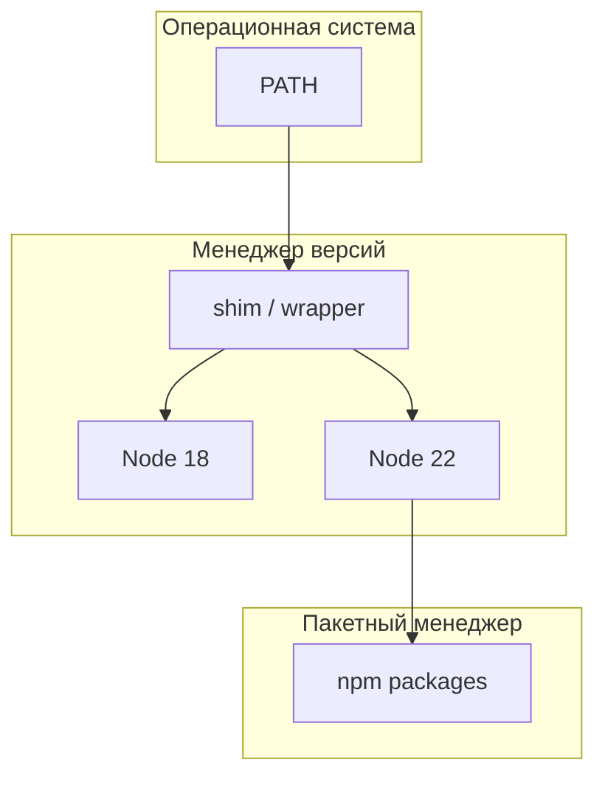
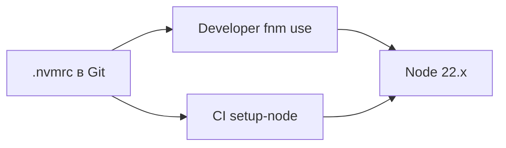

# Менеджеры версий языков — nvm, pyenv, rustup и другие

<div class="article-tags">
  <span class="tag tag-required">ОБЯЗАТЕЛЬНО</span>
  <span class="tag tag-beginner">ДЛЯ НОВИЧКОВ</span>
</div>

<span class="complexity-badge">Разработчику</span>
<span class="complexity-badge">Инженеру</span>

---

## Задача менеджера версий

На одном компьютере часто нужны **разные версии** одного **языка программирования** (runtime или компилятора):

- legacy-проект на Node 18, новый — на Node 22;
- Python 3.10 в production, 3.12 для экспериментов;
- стабильный и nightly [Rust](/encyclopedia/5-languages/5-13-rust/intro);
- Java 17 для одного сервиса, Java 21 — для другого.

**Менеджер версий** переключает **бинарники** (исполняемые файлы) и переменную окружения **PATH** без переустановки всей операционной системы. Он управляет **самим компилятором или runtime**. [Пакетный менеджер](./621.md) (`npm install lodash`, `pip install requests`) ставит **библиотеки** — это другой уровень абстракции.

| Шаг | Тема | Зачем |
|-----|------|-------|
| 1 | Глоссарий и принципы | Термины PATH, shim, default |
| 2 | Node.js — fnm и nvm | Самый частый кейс |
| 3 | Python — pyenv | Несколько интерпретаторов |
| 4 | Rust — rustup | Каналы stable/beta/nightly |
| 5 | Java — sdkman, jabba | JVM-дистрибутивы |
| 6 | asdf — универсальный | Один workflow для всех |
| 7 | Windows и корпоративные PC | Особенности платформы |
| 8 | CI и команда | Те же файлы, что локально |
| 9 | Troubleshooting и FAQ | Типичные сбои |

| Материал | Зачем |
|----------|-------|
| [Пакетные менеджеры](./621.md) | npm, pip, cargo — следующий слой |
| [Первая программа на Node.js](/encyclopedia/5-languages/5-01-javascript/3-ecosystem/1-runtime-node/262) | Проверка `node -v` после fnm |
| [Первая программа на Python](/encyclopedia/5-languages/5-02-python/16) | venv после pyenv |
| [WebAssembly (WASM)](./619.md) | rustup + wasm32 target |
| [Терминал — о разделе](/encyclopedia/2-system-network/2-05-terminal/intro) | Shell, PATH, профили |
| [ОС — о разделе](/encyclopedia/2-system-network/2-01-operatsionnaya-sistema/intro) | Переменные окружения |

<div class="callout callout--tip">
  <div class="callout-title">Один источник истины</div>

  <div class="callout-body">
  Не смешивайте системный <code>apt install nodejs</code> и fnm на одной машине — в PATH окажутся два <code>node</code>, и половина команд "не видит" нужную версию. Выберите менеджер версий и удалите/conflict package из системного менеджера пакетов ОС.
</div>
</div>



---

## Глоссарий

| Термин | Расшифровка |
|--------|-------------|
| **PATH** | Список каталогов, где shell ищет исполняемые файлы по имени (`node`, `python`) |
| **Runtime** | Среда выполнения — программа, которая запускает ваш код (Node, Python interpreter) |
| **Toolchain** | Компилятор + стандартная библиотека + утилиты (Rust: rustc + cargo) |
| **Shim** | Тонкая обёртка в PATH, которая перенаправляет на нужную версию |
| **Global default** | Версия по умолчанию для новых терминалов |
| **Local override** | Версия для конкретной папки проекта (файл `.nvmrc`, `.python-version`) |
| **LTS** | Long Term Support — ветка с длительной поддержкой (Node 20, 22) |
| **Channel** | Канал обновлений Rust — stable, beta, nightly |

---

## Сводная таблица инструментов

| Язык / стек | Инструмент | Установка (типично) | Файл в репозитории |
|-------------|------------|---------------------|-------------------|
| Node.js | **fnm** / **nvm** | winget / curl script | `.node-version`, `.nvmrc` |
| Python | **pyenv** | pyenv.run / pyenv-win | `.python-version` |
| Rust | **rustup** | rustup.rs | `rust-toolchain.toml` |
| Java / Kotlin / Scala | **sdkman** | get.sdkman.io | `.sdkmanrc` |
| Java (JVM) | **jabba** | GitHub releases | `.jabbarc` |
| Ruby | **rbenv** / **rvm** | git clone / installer | `.ruby-version` |
| Go | **go install** + asdf | asdf plugin | `.tool-versions` |
| Универсальный | **asdf** | git clone asdf-vm | `.tool-versions` |

---

## Node.js — fnm (рекомендация)

**fnm** (Fast Node Manager) — быстрый, кроссплатформенный менеджер версий Node.js. Написан на Rust; стартует быстрее классического nvm.

### Шаг 1 — установка на Windows (PowerShell)

```powershell
winget install Schniz.fnm
```

Закройте и откройте терминал. Проверка:

```powershell
fnm --version
```

Если команда не найдена — добавьте fnm в PATH вручную или перезапустите VS Code целиком (IDE кэширует окружение при старте).

### Шаг 2 — инициализация shell (Windows)

В PowerShell профиль (`$PROFILE`):

```powershell
fnm env --use-on-cd | Out-String | Invoke-Expression
```

Флаг `--use-on-cd` автоматически переключает версию при входе в каталог с `.node-version`.

### Шаг 3 — установка версий Node

```powershell
fnm install 22
fnm install 20
fnm install --lts
fnm list
```

Разбор команд:

- `install 22` — скачивает последний патч Node 22.x;
- `install --lts` — текущая LTS-ветка;
- `list` — установленные версии и активная (отмечена).

### Шаг 4 — переключение

```powershell
fnm use 22
node -v
npm -v
```

`node -v` должен показать v22.x.x. **npm** идёт в комплекте с Node — отдельно ставить не нужно. Пакеты проекта — через [npm](./621.md).

### Шаг 5 — default для новых терминалов

```powershell
fnm default 22
```

### Шаг 6 — файл проекта

В корне репозитория создайте `.node-version`:

```text
20
```

или `.nvmrc` (fnm понимает оба):

```text
20.18.0
```

```powershell
cd my-project
fnm use
node -v
```

<div class="callout callout--info">
  <div class="callout-title">Точная и major-версия</div>

  <div class="callout-body">
  Строка <code>20</code> — последний патч ветки 20.x. Строка <code>20.18.0</code> — pin на конкретный релиз. Для CI и команды предпочтительнее pin полной версии после проверки совместимости.
</div>
</div>

### fnm на Linux и macOS

```bash
curl -fsSL https://fnm.vercel.app/install | bash
```

Добавьте в `~/.bashrc` или `~/.zshrc` (скрипт установки выведет строки):

```bash
eval "$(fnm env --use-on-cd)"
```

```bash
fnm install --lts
fnm use lts-latest
node -v
```

Подробнее о первом проекте Node — [статья 262](/encyclopedia/5-languages/5-01-javascript/3-ecosystem/1-runtime-node/262).

---

## Node.js — nvm (классика)

**nvm** (Node Version Manager) — исторический стандарт на Linux и macOS. На Windows используйте **nvm-windows** — это **отдельный форк**, не bash-скрипт nvm.

### Linux / macOS — установка

```bash
curl -o- https://raw.githubusercontent.com/nvm-sh/nvm/v0.40.1/install.sh | bash
source ~/.bashrc   # или ~/.zshrc
nvm --version
```

### Базовые команды nvm

```bash
nvm install 22
nvm install 20
nvm use 22
nvm alias default 22
nvm current
nvm ls
```

Разбор:

- `install` — скачивает и собирает/распаковывает бинарник Node;
- `use` — меняет PATH **только в текущей shell-сессии**;
- `alias default` — версия для новых терминалов;
- `current` — что активно сейчас;
- `ls` — список установленных.

### Автопереключение по `.nvmrc`

```bash
cd my-project   # в корне лежит .nvmrc с "20"
nvm use
```

Для автоматического `nvm use` при `cd` добавьте hook в zsh/bash (см. wiki nvm-sh).

### nvm-windows

Скачайте installer с [github.com/coreybutler/nvm-windows/releases](https://github.com/coreybutler/nvm-windows/releases).

```powershell
nvm install 22.11.0
nvm use 22.11.0
node -v
```

Пути установки на Windows отличаются от Unix-nvm; не копируйте инструкции с macOS без адаптации.

---

## Python — pyenv

**pyenv** управляет несколькими **интерпретаторами Python** (разные минорные версии 3.x). Виртуальные окружения проекта — отдельно через `venv` или poetry; см. [пакетные менеджеры](./621.md).

### Шаг 1 — зависимости сборки (Ubuntu/Debian)

Python из pyenv часто **собирается из исходников**:

```bash
sudo apt update
sudo apt install -y build-essential libssl-dev zlib1g-dev \
  libbz2-dev libreadline-dev libsqlite3-dev curl \
  libncursesw5-dev xz-utils tk-dev libxml2-dev \
  libxmlsec1-dev libffi-dev liblzma-dev
```

Без dev-пакетов `pyenv install` падает на этапе `_ssl` или `sqlite`.

### Шаг 2 — установка pyenv

```bash
curl https://pyenv.run | bash
```

Добавьте в `~/.bashrc`:

```bash
export PYENV_ROOT="$HOME/.pyenv"
[[ -d $PYENV_ROOT/bin ]] && export PATH="$PYENV_ROOT/bin:$PATH"
eval "$(pyenv init - bash)"
```

Перезапустите shell:

```bash
exec "$SHELL"
pyenv --version
```

### Шаг 3 — установка версий Python

```bash
pyenv install --list | grep " 3.12"
pyenv install 3.12.4
pyenv install 3.10.14
pyenv versions
```

Первая установка может занять несколько минут — идёт компиляция.

### Шаг 4 — global и local

```bash
pyenv global 3.12.4
python --version
which python
```

Локально для проекта:

```bash
cd ~/projects/legacy-app
pyenv local 3.10.14
python --version
cat .python-version
```

Файл `.python-version` **коммитят** в Git — команда получает ту же версию.

### Шаг 5 — venv после pyenv

```bash
cd ~/projects/myapp
pyenv local 3.12.4
python -m venv .venv
source .venv/bin/activate
pip install -r requirements.txt
```

Windows: **pyenv-win** — [github.com/pyenv-win/pyenv-win](https://github.com/pyenv-win/pyenv-win). Альтернатива — официальный installer с python.org + venv без pyenv.

Старт с Python — [Первая программа на Python](/encyclopedia/5-languages/5-02-python/16).

<div class="callout callout--warning">
  <div class="callout-title">pyenv и system python</div>

  <div class="callout-body">
  На Linux не удаляйте системный <code>/usr/bin/python3</code> — им пользуются скрипты ОС. pyenv добавляет shims **раньше** в PATH; ваш <code>python</code> — из pyenv, системный остаётся для apt.
</div>
</div>

---

## Rust — rustup

**rustup** — официальный установщик **Rust toolchain**: `rustc` (компилятор), `cargo` ([пакетный менеджер](./621.md)), `rustfmt`, `clippy`.

### Шаг 1 — установка

```bash
curl --proto '=https' --tlsv1.2 -sSf https://sh.rustup.rs | sh
```

На Windows — скачайте `rustup-init.exe` с [rustup.rs](https://rustup.rs/).

Выберите **default stable** (вариант 1).

### Шаг 2 — активация PATH

```bash
source "$HOME/.cargo/env"
rustc --version
cargo --version
```

Добавьте `source "$HOME/.cargo/env"` в `~/.bashrc`, иначе после нового терминала `cargo` "пропадёт".

### Шаг 3 — каналы и переключение

```bash
rustup default stable
rustup install beta
rustup install nightly
rustup run nightly rustc --version
rustup update
```

| Канал | Назначение |
|-------|------------|
| stable | Production, обучение |
| beta | Предстоящий stable |
| nightly | Экспериментальные фичи |

### Шаг 4 — targets (кросс-компиляция)

```bash
rustup target add wasm32-unknown-unknown
rustup target list --installed
```

Нужно для [WebAssembly](./619.md).

### Шаг 5 — `rust-toolchain.toml` в проекте

```toml
[toolchain]
channel = "1.82.0"
components = ["rustfmt", "clippy"]
targets = ["wasm32-unknown-unknown"]
```

Файл **коммитят** — CI и коллеги получают ту же версию через `rustup` автоматически при `cargo build`.

### Шаг 6 — override на каталог

```bash
cd my-rust-app
rustup override set 1.81.0
```

Раздел [Rust](/encyclopedia/5-languages/5-13-rust/intro).

---

## Java — sdkman и jabba

### sdkman (Linux, macOS, WSL)

**SDKMAN** ставит JDK, Kotlin, Gradle, Maven и другие SDK.

```bash
curl -s "https://get.sdkman.io" | bash
source "$HOME/.sdkman/bin/sdkman-init.sh"
sdk version
```

Установка Java:

```bash
sdk list java
sdk install java 21.0.3-tem
sdk install java 17.0.11-tem
sdk default java 21.0.3-tem
java -version
```

Kotlin и инструменты:

```bash
sdk install kotlin
sdk install gradle
sdk use java 17.0.11-tem
```

Файл `.sdkmanrc` в корне проекта:

```text
java=21.0.3-tem
kotlin=2.0.0
```

```bash
sdk env install
sdk env
```

См. [Java — о разделе](/encyclopedia/5-languages/5-03-java/intro).

### jabba — кроссплатформенный JVM switcher

```bash
# установка — см. github.com/shyiko/jabba
jabba install temurin@21
jabba install graalvm@21
jabba use temurin@21
java -version
```

Удобно при нескольких **дистрибутивах** JVM (Eclipse Temurin, GraalVM, Amazon Corretto).

---

## Ruby — rbenv и rvm

### rbenv (минималистичный)

```bash
git clone https://github.com/rbenv/rbenv.git ~/.rbenv
echo 'export PATH="$HOME/.rbenv/bin:$PATH"' >> ~/.bashrc
echo 'eval "$(rbenv init - bash)"' >> ~/.bashrc
exec "$SHELL"
rbenv install 3.3.5
rbenv global 3.3.5
ruby -v
```

`.ruby-version` в проекте:

```text
3.3.5
```

[Ruby — о разделе](/encyclopedia/5-languages/5-11-ruby/intro).

---

## asdf — один менеджер для многих языков

**asdf** — plugin-based менеджер: Node, Python, Ruby, Erlang, Terraform и десятки других через единый CLI.

### Шаг 1 — установка

```bash
git clone https://github.com/asdf-vm/asdf.git ~/.asdf --branch v0.14.1
```

Добавьте в `~/.bashrc`:

```bash
. "$HOME/.asdf/asdf.sh"
. "$HOME/.asdf/completions/asdf.bash"
```

### Шаг 2 — plugins

```bash
asdf plugin add nodejs
asdf plugin add python
asdf plugin add rust
asdf plugin list
```

Для nodejs-plugin нужен `~/.asdf/plugins/nodejs/bin/import-release-team-keyring` (см. доку plugin).

### Шаг 3 — install и local

```bash
asdf install nodejs 22.11.0
asdf install python 3.12.4
asdf local nodejs 22.11.0
asdf local python 3.12.4
```

### Файл `.tool-versions`

```text
nodejs 22.11.0
python 3.12.4
rust 1.82.0
```

**Плюсы asdf**

- один workflow для всей команды;
- один файл `.tool-versions` в монорепо.

**Минусы**

- plugins обновляются независимо;
- nodejs plugin медленнее fnm на больших CI.

---

## Сравнение fnm и nvm

| Критерий | fnm | nvm |
|----------|-----|-----|
| Скорость | очень быстрый | медленнее |
| Windows native | ✓ | nvm-windows (форк) |
| macOS / Linux | ✓ | ✓ классика |
| `.nvmrc` | ✓ | ✓ |
| Авто `cd` | `--use-on-cd` | hook вручную |

Рекомендация для новых проектов — **fnm**; nvm оставьте, если команда уже стандартизировалась на нём.

---

## Windows — особенности

| Инструмент | Windows native | Примечание |
|------------|----------------|------------|
| fnm | ✓ | winget, PowerShell |
| nvm-windows | ✓ | не путать с Unix nvm |
| pyenv-win | ✓ | GitHub releases |
| rustup | ✓ | rustup-init.exe |
| sdkman | WSL / Git Bash | не PowerShell native |
| asdf | WSL рекомендуется | возможен через Git Bash |

### PowerShell execution policy

Если скрипты установки блокируются:

```powershell
Set-ExecutionPolicy -Scope CurrentUser RemoteSigned
```

### Корпоративные PC без admin

- portable **fnm** в `%USERPROFILE%\bin`;
- **rustup** per-user;
- **asdf** полностью в home directory;
- избегайте установщиков, требующих UAC.

<div class="callout callout--tip">
  <div class="callout-title">WSL2 для Linux-toolchain</div>

  <div class="callout-body">
  На Windows 11 многие команды держат pyenv/sdkman в <strong>WSL2</strong>, а VS Code подключается через Remote-WSL. Версии в Windows и WSL — <strong>разные</strong> PATH; не смешивайте терминалы без понимания, где выполняется <code>node</code>.
</div>
</div>

---

## IDE и редактор

| Проблема | Решение |
|----------|---------|
| VS Code показывает другую версию Node | Перезапустить VS Code после `fnm use`; проверить integrated terminal |
| Pyright/pylance не видит pyenv python | `python.pythonPath` или select interpreter → путь из `pyenv which python` |
| Rust Analyzer | должен подхватить `rust-toolchain.toml` автоматически |
| JetBrains IDEs | Settings → SDK → path from `which java` |

IDE **наследует окружение при старте**. После смены default версии — полный перезапуск IDE, не только терминала.

---

## CI — те же файлы, что локально

### GitHub Actions — Node

```yaml
- uses: actions/setup-node@v4
  with:
    node-version-file: '.nvmrc'
    cache: 'npm'
```

### GitHub Actions — Python

```yaml
- uses: actions/setup-python@v5
  with:
    python-version-file: '.python-version'
```

### GitHub Actions — Rust

```yaml
- uses: dtolnay/rust-toolchain@stable
  with:
    toolchain: 1.82.0
    components: rustfmt, clippy
```

Или положите `rust-toolchain.toml` в репо — action подхватит channel.

### GitLab CI — пример Node

```yaml
image: node:22-alpine
before_script:
  - node -v
  - npm ci
```

Pin образа Docker должен совпадать с `.nvmrc`, иначе "works in CI, fails locally".



---

## Практические правила команды

1. **Фиксируйте версию в репозитории** — `.nvmrc`, `.python-version`, `rust-toolchain.toml`, `.tool-versions`.
2. **Один источник** — либо менеджер версий, либо системный пакет ОС; не оба для одного языка.
3. **CI читает те же файлы** — `node-version-file`, `python-version-file`, Docker `FROM node:22`.
4. **Версия языка ≠ версии пакетов** — Node 22 + старый `lodash` — см. [621](./621.md).
5. **Документируйте onboarding** — README блок "Prerequisites" с командами `fnm install`, `pyenv install`.
6. **Renovate/Dependabot** — обновляет npm/pip; версию runtime обновляют осознанно через PR с тестами.

---

## Пошаговый onboarding нового разработчика

### День 1 — базовая машина

```bash
# 1. fnm + Node LTS
fnm install --lts && fnm default lts-latest

# 2. pyenv + Python проекта
pyenv install $(cat .python-version)
pyenv local $(cat .python-version)

# 3. rustup если Rust-репо
curl --proto '=https' --tlsv1.2 -sSf https://sh.rustup.rs | sh
rustup show

# 4. Клон репо и проверка
git clone ...
cd project
fnm use && node -v
python -v
cargo -v   # если нужно
```

### День 2 — пакеты

```bash
npm ci
python -m venv .venv && source .venv/bin/activate && pip install -r requirements.txt
cargo fetch
```

Подробно — [пакетные менеджеры](./621.md).

---

## Troubleshooting

| Симптом | Вероятная причина | Решение |
|---------|-------------------|---------|
| `node` старая после `nvm use` / `fnm use` | PATH не обновился; другой node раньше в PATH | `which node`; удалить brew/apt node; перезапустить shell |
| `command not found: fnm` | Не добавлен eval в профиль | `fnm env \| bash`; прописать в `.bashrc` |
| pyenv: `BUILD FAILED` | Нет libssl/zlib dev | Установить build-essential пакеты (см. выше) |
| pyenv: version not installed | Забыли `pyenv install` | `pyenv install $(cat .python-version)` |
| rustup не в PATH | Не sourced `.cargo/env` | `source $HOME/.cargo/env` |
| `cargo` wrong version | override / toolchain file | `rustup show`; проверить `rust-toolchain.toml` |
| Разные версии в IDE и терминале | IDE стартовал до fnm | Полный restart VS Code |
| nvm-windows: access denied | Нужны права admin для symlink | Запуск installer от admin или portable fnm |
| asdf: plugin not found | Опечатка или устаревший plugin | `asdf plugin update --all` |
| WSL vs Windows node mixed | Два PATH | Явно выбрать терминал WSL или PowerShell |
| `python` opens Microsoft Store | Windows alias | Settings → App execution aliases → off для python |

---

## FAQ

### Чем менеджер версий отличается от Docker?

Docker изолирует **всю ОС-образ** (OS + runtime + deps). Менеджер версий переключает **бинарник на хосте**. Docker — для deploy parity; fnm/pyenv — для ежедневной разработки на ноутбуке. Часто используют **оба**.

### Нужен ли asdf, если уже есть fnm и pyenv?

Не обязательно. asdf удобен при 4+ языках в одном монорепо. Иначе специализированные инструменты проще.

### Можно ли ставить Node через apt?

Можно, но версия отстаёт от LTS на nodejs.org и конфликтует с fnm. Для разработки — fnm; для сервера — Docker или официальный tarball.

### Как обновить все установленные версии Rust?

```bash
rustup update
```

### Где хранятся скачанные версии?

| Tool | Каталог (типично) |
|------|-------------------|
| fnm | `~/.local/share/fnm` |
| nvm | `~/.nvm` |
| pyenv | `~/.pyenv/versions` |
| rustup | `~/.rustup`, binaries в `~/.cargo/bin` |

Очистка старых версий — команды `fnm uninstall`, `nvm uninstall`, `pyenv uninstall`, `rustup toolchain uninstall`.

### Связь с [WebAssembly](./619.md)?

Для WASM нужны `rustup`, target `wasm32-unknown-unknown`, часто Node для фронта — всё через менеджеры версий этой статьи.

---

## Go — версии toolchain

**Go** поставляется одним архивом с [go.dev/dl](https://go.dev/dl/). Несколько версий — через asdf или ручные каталоги.

### asdf plugin для Go

```bash
asdf plugin add golang
asdf list all golang | head
asdf install golang 1.23.2
asdf global golang 1.23.2
go version
```

### Ручная установка двух версий (Linux)

```bash
curl -LO https://go.dev/dl/go1.22.8.linux-amd64.tar.gz
sudo tar -C /usr/local -xzf go1.22.8.linux-amd64.tar.gz
sudo mv /usr/local/go /usr/local/go1.22
# Аналогично go1.23 в /usr/local/go1.23
```

Переключение alias в `~/.bashrc`:

```bash
alias go122='GOROOT=/usr/local/go1.22 PATH=/usr/local/go1.22/bin:$PATH go'
alias go123='GOROOT=/usr/local/go1.23 PATH=/usr/local/go1.23/bin:$PATH go'
```

Пакеты проекта — [go mod](./621.md). См. [Go — о разделе](/encyclopedia/5-languages/5-10-go/intro).

---

## Elixir и Erlang — asdf

```bash
asdf plugin add erlang
asdf plugin add elixir
asdf install erlang 27.1.2
asdf install elixir 1.17.3-otp-27
asdf local erlang 27.1.2
asdf local elixir 1.17.3-otp-27
elixir -v
```

Сборка Erlang долгая — на CI кэшируйте `~/.asdf/downloads/erlang`.

[Elixir — о разделе](/encyclopedia/5-languages/5-19-elixir/intro).

---

## Scala и Kotlin через SDKMAN

```bash
sdk install scala 3.5.2
sdk install sbt 1.10.2
sdk install kotlin 2.0.21
sdk use kotlin 2.0.21
kotlinc -version
```

[Sscala — о разделе](/encyclopedia/5-languages/5-18-scala/intro), [Kotlin](/encyclopedia/5-languages/5-09-kotlin/intro).

---

## Политика версий для команды (шаблон README)

Вставьте в корень monorepo:

```markdown
## Toolchain

| Tool | Version file | Install |
|------|--------------|---------|
| Node | .nvmrc | fnm install && fnm use |
| Python | .python-version | pyenv install -s |
| Rust | rust-toolchain.toml | rustup show |

После clone:
  fnm use && npm ci
  pyenv install -s && python -m venv .venv
  cargo fetch
```

Ссылка на [621](./621.md) для `npm ci`.

---

## GitHub Actions — matrix нескольких версий

```yaml
jobs:
  test:
    strategy:
      matrix:
        node: [20, 22]
    runs-on: ubuntu-latest
    steps:
      - uses: actions/checkout@v4
      - uses: actions/setup-node@v4
        with:
          node-version: ${{ matrix.node }}
      - run: npm ci && npm test
```

Ловит несовместимость с Node 20 до merge в main.

---

## Docker и менеджеры версий

В Docker **не нужен** fnm внутри образа — pin образа:

```dockerfile
FROM node:22.11-alpine
```

Локально разработчик использует fnm; CI/CD — фиксированный tag. Расхождение minor допустимо; major — нет.

---

## mise (альтернатива asdf)

**mise** (бывший rtx) — Rust-rewrite идей asdf:

```bash
curl https://mise.run | sh
mise use node@22
mise use python@3.12
```

Синтаксис `.mise.toml`:

```toml
[tools]
node = "22"
python = "3.12"
```

---

## Подробный сценарий — Windows + VS Code

1. `winget install Schniz.fnm`
2. PowerShell: `fnm env --use-on-cd | Out-String | Invoke-Expression` в `$PROFILE`
3. `fnm install 22 && fnm default 22`
4. Перезапуск VS Code (не только терминала)
5. Terminal → `node -v`
6. Command Palette → "Node: Select" если расширение предлагает другой path

Для Python на Windows без WSL:

```powershell
git clone https://github.com/pyenv-win/pyenv-win.git $HOME\.pyenv
# Добавить PYENV, PYENV_ROOT, PATH по README pyenv-win
pyenv install 3.12.4
pyenv global 3.12.4
```

---

## Очистка диска

| Tool | Команда |
|------|---------|
| fnm | `fnm uninstall 18` |
| nvm | `nvm uninstall 16` |
| pyenv | `pyenv uninstall 3.9.18` |
| rustup | `rustup toolchain uninstall nightly-2024-01-01` |
| asdf | удалить каталоги в `~/.asdf/installs/` |

Старые версии копят гигабайты — раз в квартал audit.

---

## Дополнительный Troubleshooting

| Симптом | Вероятная причина | Решение |
|---------|-------------------|---------|
| `fnm`: version not installed | Нет `fnm install` | `fnm install $(cat .nvmrc)` |
| pyenv: version `3.12.4' not installed | Точная версия не скачана | `pyenv install 3.12.4` |
| M1 Mac: build failed | Rosetta / openssl path | `PYTHON_CONFIGURE_OPTS` env vars из wiki |
| Corporate proxy | curl install blocked | Offline tarball, internal mirror |
| Git Bash vs PowerShell PATH | Разные профили | Один shell для команды |
| `rustup self update` failed | Permissions | Run without sudo in home |
| asdf nodejs: gpg failed | Keys not imported | Run import-release-team-keyring script |

---

## FAQ — дополнительно

### Как проверить, откуда вызывается `node`?

```bash
which node      # Unix
where.exe node  # Windows
type -a node    # все копии в PATH
```

### Нужен ли Homebrew node на macOS?

Для разработки — **нет**, если есть fnm. Homebrew node часто конфликтует.

### Как зафиксировать npm вместе с Node?

npm bundled с Node. Для override — `npm install -g npm@10` внутри нужной версии fnm.

### Связь с Docker Compose?

Compose не заменяет fnm; сервисы в compose pin образы, хост — fnm для локальной разработки.

---

## pyenv-virtualenv — автомат venv

Плагин **pyenv-virtualenv** создаёт venv, привязанный к версии Python:

```bash
git clone https://github.com/pyenv/pyenv-virtualenv.git $(pyenv root)/plugins/pyenv-virtualenv
pyenv virtualenv 3.12.4 myapp-venv
pyenv local myapp-venv
python -m pip install -r requirements.txt
```

Каталог `.python-version` будет содержать имя venv. Удобно, когда несколько проектов на одной минорной версии Python.

---

## Haskell — ghcup

```bash
curl --proto '=https' --tlsv1.2 -sSf https://get-ghcup.haskell.org | sh
ghcup install ghc 9.8.2
ghcup install cabal 3.10.3.0
ghcup set ghc 9.8.2
ghc --version
```

[Haskell — о разделе](/encyclopedia/5-languages/5-17-haskell/intro). Пакеты — cabal/stack ([621](./621.md)).

---

## .NET — global.json

Для фиксации SDK без sdkman:

```json
{
  "sdk": {
    "version": "8.0.403",
    "rollForward": "latestFeature"
  }
}
```

```bash
dotnet --version
```

Коммитят `global.json` рядом с solution.

---

## Переменные окружения — шпаргалка

| Переменная | Инструмент | Смысл |
|------------|------------|-------|
| `PYENV_ROOT` | pyenv | Корень установки |
| `NVM_DIR` | nvm | Каталог nvm |
| `RUSTUP_HOME` | rustup | Toolchains |
| `CARGO_HOME` | cargo | Бинарники и registry |
| `GOPATH` | Go | Workspace (legacy layout) |
| `GOROOT` | Go | Текущий SDK |

Проверка: `env | grep -E 'PYENV|NVM|RUST|CARGO'`.

---

## Сценарий — legacy Node 16 и modern Node 22

```bash
cd ~/legacy-crm
cat .nvmrc    # 16
fnm install 16
fnm use

cd ~/new-portal
cat .nvmrc    # 22
fnm use
```

С `--use-on-cd` переключение автоматическое. **Не** ставьте `fnm default 16` если основная работа на 22 — default только для "без .nvmrc".

---

## Сценарий — Python data science

```bash
pyenv install 3.11.9
pyenv virtualenv 3.11.9 ds-311
pyenv local ds-311
pip install jupyter pandas scikit-learn
jupyter lab
```

Тяжёлые wheels (numpy) привязаны к версии Python — не смешивайте 3.10 и 3.11 venv.

---

## Сценарий — Rust stable + nightly в одном репо

`rust-toolchain.toml`:

```toml
[toolchain]
channel = "1.82.0"
```

Для эксперимента:

```bash
rustup run nightly cargo build -Z build-std
```

Не коммитьте override nightly в toolchain без team agreement.

---

## GitLab CI — полный пример

```yaml
image: node:22-bookworm
stages: [test]
variables:
  NPM_CONFIG_CACHE: "$CI_PROJECT_DIR/.npm"

before_script:
  - node -v
  - npm ci

test:
  script:
    - npm test
  cache:
    key: ${CI_COMMIT_REF_SLUG}
    paths:
      - .npm/
```

Python job параллельно:

```yaml
python-test:
  image: python:3.12-slim
  before_script:
    - python -m pip install uv
    - uv sync --frozen
  script:
    - uv run pytest
```

---

## Корпоративный прокси

```bash
export HTTP_PROXY=http://proxy.corp:8080
export HTTPS_PROXY=http://proxy.corp:8080
curl -fsSL https://fnm.vercel.app/install | bash
```

Rust:

```bash
export RUSTUP_DIST_SERVER=https://internal-mirror/rust
export RUSTUP_UPDATE_ROOT=https://internal-mirror/rustup
```

Документируйте mirror в internal wiki.

---

## Безопасность установочных скриптов

Скрипты `curl | bash` — стандарт индустрии, но риск supply chain:

- читайте скрипт перед pipe (`curl -fsSL URL -o install.sh`);
- pin версию asdf tag, не `master`;
- проверяйте checksum release binary.

<div class="callout callout--warning">
  <div class="callout-title">Не запускайте curl | bash от неизвестных URL</div>
  <div class="callout-body">
  Официальные источники: fnm.vercel.app, rustup.rs, pyenv.run, get.sdkman.io, asdf-vm.com.
  </div>
</div>

---

## Интеграция с direnv

**direnv** автоматически экспортирует env при `cd`:

```bash
# .envrc
use fnm
layout python python3
```

```bash
direnv allow
```

Комбинация fnm + pyenv + direnv — автоматический onboarding без ручного `fnm use`.

---

## Troubleshooting — расширенные кейсы

| Симптом | Причина | Решение |
|---------|---------|---------|
| `pyenv: no such command 'virtualenv'` | Нет plugin | Установить pyenv-virtualenv |
| fnm on cd не срабатывает | Нет `--use-on-cd` | Обновить eval строку |
| Mise и asdf conflict | Оба в PATH | Выбрать один |
| Windows long path | MAX_PATH | Enable long paths in OS |
| Antivirus блокирует rustup | Heuristic | Exception для ~/.rustup |
| sudo rustup | Wrong install | Reinstall without sudo |
| nvm: version not installed | Empty .nvmrc | `nvm install` |
| jabba: java not found | Wrong shell init | `jabba init` in rc |

---

## Чек-лист code review — toolchain

- [ ] `.nvmrc` / `.python-version` / `rust-toolchain.toml` в PR
- [ ] README обновлён при bump версии
- [ ] CI matrix покрывает минимальную supported версию
- [ ] Breaking change runtime — changelog + migration guide
- [ ] Docker image tag синхронизирован с `.nvmrc`

---

## Дополнительные упражнения

7. Настройте direnv + fnm для двух проектов с разным Node.
8. Установите ghcup и соберите Hello World на Haskell.
9. Создайте `.sdkmanrc` и `sdk env` для Java 17 и 21.
10. Напишите GitLab CI с pyenv в custom Docker image.
11. Замерьте время `fnm install` и `nvm install` для одной версии.
12. Документируйте onboarding в README по шаблону из этой статьи.

---

### Docker Compose и fnm

Compose pin образы (`node:22-alpine`); fnm — для локальной разработки на хосте. Не ожидайте, что `docker compose exec` увидит fnm shims — внутри контейнера свой PATH.

---

## Упражнения для практики

1. Установите fnm, поставьте Node 20 и 22, переключитесь между ними, создайте `.nvmrc`.
2. Установите pyenv, поставьте 3.10 и 3.12, сделайте `pyenv local` в двух разных папках.
3. Установите rustup, создайте `rust-toolchain.toml` с nightly, выполните `cargo build`.
4. Настройте GitHub Actions с `node-version-file` для своего репо.
5. Намеренно сломайте PATH (два node), найдите через `which -a node`, почините.
6. Подключите WSL pyenv и откройте проект в VS Code Remote-WSL.

---

## Onboarding README — полный шаблон

```markdown
# Project X — Developer Setup

## Prerequisites
- fnm (Node): see encyclopedia/620
- pyenv (Python 3.12.4): `.python-version`
- rustup (optional): `rust-toolchain.toml`

## First run
git clone ...
cd project
fnm use && npm ci
pyenv install -s && python -m venv .venv
source .venv/bin/activate && pip install -r requirements.txt
cargo fetch   # if rust/

## Verify
node -v    # matches .nvmrc
python -V  # matches .python-version
npm test
```

Ссылка на [621](./621.md) для `npm ci` и lock-файлов.

---

## Сравнение менеджеров — итоговая таблица

| Если нужно | Выберите |
|------------|----------|
| Только Node, скорость | fnm |
| Node на macOS legacy | nvm |
| Только Python | pyenv |
| Rust | rustup (обязательно) |
| Java/Kotlin/Scala SDK | sdkman |
| JVM cross-platform | jabba |
| 5+ языков в monorepo | asdf или mise |
| Windows native без WSL | fnm + pyenv-win + rustup |

---

## Связанные материалы

| Тема | Материал |
|------|----------|
| npm, pip, cargo | [Пакетные менеджеры](./621.md) |
| WASM toolchain | [WebAssembly (WASM)](./619.md) |
| Node старт | [Первая программа на Node.js](/encyclopedia/5-languages/5-01-javascript/3-ecosystem/1-runtime-node/262) |
| Python старт | [Первая программа на Python](/encyclopedia/5-languages/5-02-python/16) |
| ОС | [Операционная система — о разделе](/encyclopedia/2-system-network/2-01-operatsionnaya-sistema/intro) |
| Терминал | [Терминал — о разделе](/encyclopedia/2-system-network/2-05-terminal/intro) |
| Git | [Основы работы с Git](/encyclopedia/4-code-dev/4-13-osnovy-raboty-s-git/intro) |
| Java | [Java — о разделе](/encyclopedia/5-languages/5-03-java/intro) |
| Ruby | [Ruby — о разделе](/encyclopedia/5-languages/5-11-ruby/intro) |

### Внешние ресурсы

- [fnm — GitHub](https://github.com/Schniz/fnm)
- [nvm-sh](https://github.com/nvm-sh/nvm)
- [pyenv](https://github.com/pyenv/pyenv)
- [rustup book](https://rust-lang.github.io/rustup/)
- [asdf-vm](https://asdf-vm.com/)
- [SDKMAN](https://sdkman.io/)

## Ruby — rbenv и chruby

**rbenv** — менеджер версий Ruby (альтернатива RVM).

```bash
# macOS / Linux
git clone https://github.com/rbenv/rbenv.git ~/.rbenv
echo 'export PATH="$HOME/.rbenv/bin:$PATH"' >> ~/.bashrc
echo 'eval "$(rbenv init -)"' >> ~/.bashrc
rbenv install 3.3.4
rbenv global 3.3.4
ruby -v
```

`.ruby-version` в корне проекта:

```text
3.3.4
```

**chruby** — лёгкое переключение без shims; часто в паре с ruby-install.

| Tool | Shims | Windows |
|------|-------|---------|
| rbenv | Да | WSL |
| chruby | Нет | WSL |
| RVM | Да | WSL |

После rbenv — **bundler** для gems ([621](./621.md)). [Ruby intro](/encyclopedia/5-languages/5-11-ruby/intro).

---

## PHP — phpenv и asdf

**phpenv** — аналог pyenv для PHP.

```bash
git clone https://github.com/phpenv/phpenv.git ~/.phpenv
phpenv install 8.3.9
phpenv local 8.3.9
php -v
```

На Windows проще **asdf** plugin или Docker. Затем [composer](./621.md). [PHP intro](/encyclopedia/5-languages/5-07-php/intro).

---

## mise (бывший rtx) — универсальный runner

**mise** — современная альтернатива asdf с быстрым Rust-core.

```bash
curl https://mise.run | sh
mise use node@22
mise use python@3.12
mise install
```

`.mise.toml`:

```toml
[tools]
node = "22"
python = "3.12"
rust = "stable"
```

| asdf | mise |
|------|------|
| Плагины community | Встроенные core tools |
| Медленнее на больших списках | Быстрее |
| .tool-versions | .mise.toml |

---

## Elixir — kiex и asdf

**kiex** — переключение Erlang/Elixir (legacy). Рекомендуется **asdf** с плагинами erlang + elixir:

```bash
asdf plugin add erlang
asdf plugin add elixir
asdf install erlang 27.0
asdf install elixir 1.17.0-otp-27
asdf local erlang 27.0
asdf local elixir 1.17.0-otp-27
```

`.tool-versions`:

```text
erlang 27.0
elixir 1.17.0-otp-27
```

Elixir **привязан к версии OTP**. [Elixir intro](/encyclopedia/5-languages/5-19-elixir/intro).

---

## Scala — coursier и sbt java

Scala использует JVM — сначала [sdkman](#java--sdkman-jabba) Java 17+, затем **coursier** (cs):

```bash
cs install scala:3.4.1 scalac:3.4.1
cs setup
```

Или sbt через sdkman. `build.sbt` не pin Java — используйте `.jvmopts` или `javac -version` в CI.

---

## Deno и Bun — отдельно от nvm

**Deno** и **Bun** — не Node; собственные бинарники.

| Runtime | Менеджер | Файл |
|---------|----------|------|
| Node | fnm/nvm | .nvmrc |
| Deno | deno upgrade | deno.json |
| Bun | bun upgrade | package.json |

Не ставьте Deno через fnm. Для polyglot monorepo — asdf/mise с отдельными plugins.

---

## Корпоративный onboarding — playbook

### День 1 — новый разработчик

1. README с версиями: Node, Python, Java из [620] и [621].
2. Скрипт `scripts/setup.sh`:

```bash
#!/usr/bin/env bash
set -euo pipefail
fnm install
fnm use
node -v
npm ci
```

3. VS Code `.vscode/extensions.json` — ESLint, Python, rust-analyzer.

### Неделя 1 — команда

| Артеfact | Содержание |
|----------|------------|
| `.nvmrc` | Node LTS |
| `.python-version` | pyenv pin |
| `rust-toolchain.toml` | channel + targets wasm32 |
| `.tool-versions` | asdf unified |
| `mise.toml` | альтернатива asdf |
| CI matrix | те же версии |

### Квартал — audit

- Удалить EOL Node/Python из `~/.fnm`, `~/.pyenv`.
- Документировать migration guide при bump major.

---

## WSL2 — гибрид Windows + Linux

Типичная схема:

- **Windows:** PowerShell, VS Code, fnm для frontend.
- **WSL Ubuntu:** pyenv, rustup, Docker backend.

```powershell
wsl --install -d Ubuntu
```

В WSL `~/.bashrc`:

```bash
eval "$(fnm env --use-on-cd)"
export PATH="$HOME/.pyenv/bin:$PATH"
eval "$(pyenv init -)"
```

Открывайте репозиторий через `\\wsl$\Ubuntu\home\user\proj` или clone внутри WSL для performance.

---

## Nix и devcontainers — альтернативы

**Nix flakes** — декларативные dev shells:

```nix
# flake.nix (упрощённо)
devShells.default = mkShell {
  buildInputs = [ nodejs_22 python312 ];
};
```

**devcontainer.json** — Docker-образ с pin версий для VS Code Remote.

| Подход | Плюсы | Минусы |
|--------|-------|--------|
| fnm/pyenv | Быстрый старт | Каждый ставит сам |
| asdf/mise | Один tool | Learning curve |
| Nix | Reproducible | Сложность |
| devcontainer | Одинаково у всех | Docker required |

---

## Расширенный FAQ

### Можно ли pin Node в package.json?

```json
"engines": { "node": ">=22 <23" }
```

`.nvmrc` точнее для fnm. `engines` — предупреждение, не автомат switch.

### volta vs fnm?

**Volta** pin в package.json, fast on Windows. **fnm** — широкое community, `.nvmrc`. Оба лучше системного node.

### pyenv virtualenv?

Plugin `pyenv-virtualenv` создаёт venv привязанный к папке. Альтернатива — стандартный `python -m venv` после pyenv.

### rustup override directory?

```bash
rustup override set stable
rustup override set nightly
```

Приоритет выше `rust-toolchain.toml` в некоторых случаях — предпочитайте файл в repo.

### Несколько Java одновременно?

```bash
sdk use java 17.0.11-tem
sdk use java 21.0.3-tem
```

Разные терминалы — разные версии. `JAVA_HOME` export в скрипт запуска.

---

## Сценарии по языкам — deep dive

### Node.js frontend team

```text
fnm + .nvmrc 22
corepack enable
pnpm install
```

Corepack pin pnpm без global install.

### Python data team

```text
pyenv 3.12
uv venv
uv sync
```

Pin в `.python-version` + `uv.lock` в [621](./621.md).

### Rust systems team

```text
rustup default stable
rustup target add wasm32-unknown-unknown
rust-toolchain.toml in repo
```

### Java enterprise

```text
sdk install java 17.0.11-tem
sdk install java 21.0.3-tem
./gradlew -version
```

Gradle wrapper pin distribution — не sdkman Gradle binary.

### Mobile Android

```text
sdk install java 17.0.11-tem
# Android Studio embeds JDK — align versions
```

Kotlin Gradle использует JDK из `JAVA_HOME` или embedded.

---

## Мониторинг версий в production

| Слой | Где pin |
|------|---------|
| Docker base | FROM node:22-alpine |
| K8s | образ с digest |
| Lambda | runtime parameter nodejs22.x |
| CI | actions/setup-node node-version-file |

Локальный fnm **не** влияет на production — только на dev parity.

---

## Упражнения — продвинутый уровень

7. Настройте mise с node + python + rust в monorepo.
8. Nix flake или devcontainer — выберите один, поднимите среду с нуля.
9. WSL + Windows fnm — один repo, две ОС, один `.nvmrc`.
10. sdkman + Gradle 8 — два Java проекта, разные `JAVA_HOME` в scripts.
11. asdf elixir + erlang — Phoenix hello, `.tool-versions` в git.
12. Audit: `du -sh ~/.fnm ~/.pyenv ~/.rustup` — удалите EOL.

---


---
