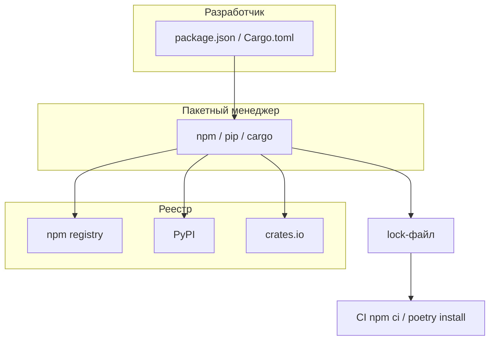
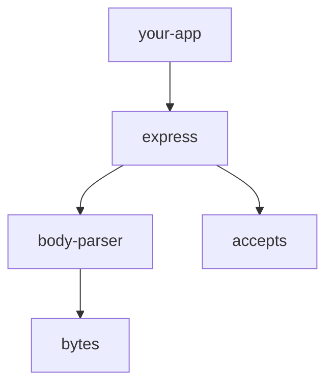

# Пакетные менеджеры — npm, pip, cargo, go mod и другие

<div class="article-tags">
  <span class="tag tag-required">ОБЯЗАТЕЛЬНО</span>
  <span class="tag tag-beginner">ДЛЯ НОВИЧКОВ</span>
</div>

<span class="complexity-badge">Разработчику</span>
<span class="complexity-badge">Архитектору</span>

---

## Роль пакетного менеджера

**Пакетный менеджер** (package manager) — программа, которая:

- скачивает **библиотеки** (зависимости, dependencies) из **реестра** (registry);
- записывает версии в **манифест** (manifest) проекта;
- фиксирует точное дерево версий в **lock-файле** (lock file);
- запускает **скрипты** сборки, тестов и публикации.

[Менеджер версий языка](./620.md) ставит **Node.js 22** или **Python 3.12** — сам runtime. Пакетный менеджер ставит **`lodash`** или **`requests`** — код, который ваш проект импортирует.

Без lock-файла `npm install` сегодня и через месяц может подтянуть разные минорные версии — CI и production расходятся ("works on my machine").

| Шаг | Тема | Зачем |
|-----|------|-------|
| 1 | Глоссарий | Манифест, lock, semver |
| 2 | npm / yarn / pnpm | JavaScript экосистема |
| 3 | pip / poetry / uv | Python |
| 4 | cargo | Rust |
| 5 | go mod | Go |
| 6 | PHP, .NET, Java | composer, NuGet, Maven, Gradle |
| 7 | CI, audit, monorepo | Production практики |
| 8 | Troubleshooting и FAQ | Типичные сбои |

| Материал | Зачем |
|----------|-------|
| [Менеджеры версий](./620.md) | Node/Python перед npm/pip |
| [npm — углублённо](/encyclopedia/5-languages/5-01-javascript/3-ecosystem/1-runtime-node/265) | lock, audit, scripts |
| [Структура Node-проекта](/encyclopedia/5-languages/5-01-javascript/3-ecosystem/1-runtime-node/266) | `node_modules`, env |
| [Первая программа Node](/encyclopedia/5-languages/5-01-javascript/3-ecosystem/1-runtime-node/262) | `npm init`, `npm run` |
| [WebAssembly](./619.md) | cargo + wasm-pack |
| [Git](/encyclopedia/4-code-dev/4-13-osnovy-raboty-s-git/intro) | Коммит lock-файлов |

<div class="callout callout--tip">
  <div class="callout-title">Версия runtime и версия пакета</div>

  <div class="callout-body">
  Node 22 + Express 4 — независимые числа. Runtime фиксируют в <code>.nvmrc</code> (<a href="./620.md">620</a>), пакеты — в <code>package-lock.json</code> этой статьи.
</div>
</div>



---

## Глоссарий

| Термин | Расшифровка |
|--------|-------------|
| **Пакет (package)** | Архив с кодом библиотеки и метаданными |
| **Манифест** | Файл с перечнем зависимостей и диапазонами версий |
| **Lock-файл** | Точные версии всего дерева зависимостей |
| **SemVer** | Semantic Versioning — `MAJOR.MINOR.PATCH` (1.4.2) |
| **Dependency** | Зависимость для runtime (нужна в production) |
| **DevDependency** | Зависимость только для разработки (тесты, линтеры) |
| **Transitive dependency** | Зависимость вашей зависимости (дерево) |
| **Registry** | Сервер каталога пакетов (npmjs.org, PyPI) |
| **Peer dependency** | Пакет ожидает, что вы сами установите другую lib (React для UI-kit) |
| **Hoisting** | Подъём общих deps на верх `node_modules` |

---

## Сравнительная таблица

| Экосистема | Менеджер | Манифест | Lock-файл | Реестр |
|------------|----------|----------|-----------|--------|
| JavaScript | **npm** / yarn / pnpm | `package.json` | `package-lock.json` | registry.npmjs.org |
| JavaScript | **yarn** | `package.json` | `yarn.lock` | registry.npmjs.org |
| JavaScript | **pnpm** | `package.json` | `pnpm-lock.yaml` | registry.npmjs.org |
| Python | **pip** | `requirements.txt` | (нет*) | pypi.org |
| Python | **poetry** | `pyproject.toml` | `poetry.lock` | pypi.org |
| Python | **uv** | `pyproject.toml` | `uv.lock` | pypi.org |
| Rust | **cargo** | `Cargo.toml` | `Cargo.lock` | crates.io |
| Go | **go mod** | `go.mod` | `go.sum` | proxy.golang.org |
| PHP | **composer** | `composer.json` | `composer.lock` | packagist.org |
| .NET | **NuGet** | `.csproj` | `packages.lock.json` | nuget.org |
| Java | **Maven** | `pom.xml` | (нет единого*) | Maven Central |
| Java/Kotlin | **Gradle** | `build.gradle.kts` | `gradle.lockfile` | Maven Central |

\* pip без poetry/uv — lock вручную или `pip freeze`; Maven — через BOM или Gradle lock.

---

## npm (Node.js)

**npm** (Node Package Manager) — стандартный менеджер для [JavaScript](/encyclopedia/5-languages/5-01-javascript/intro) и [Node.js](/encyclopedia/5-languages/5-01-javascript/3-ecosystem/1-runtime-node/262). Поставляется вместе с Node; версию Node — через [fnm/nvm](./620.md).

### Шаг 1 — инициализация проекта

```bash
mkdir my-api && cd my-api
npm init -y
```

Флаг `-y` — значения по умолчанию в `package.json`.

### Шаг 2 — установка зависимостей

```bash
npm install express
npm install -D typescript @types/node
npm install -D eslint
```

Разбор:

- `npm install express` — **dependency** (нужен в runtime);
- `-D` (или `--save-dev`) — **devDependency** (только разработка);
- создаётся/обновляется `package-lock.json`.

### Шаг 3 — скрипты

В `package.json`:

```json
{
  "name": "my-api",
  "type": "module",
  "scripts": {
    "dev": "node --watch server.js",
    "start": "node server.js",
    "lint": "eslint ."
  },
  "dependencies": {
    "express": "^4.21.0"
  },
  "devDependencies": {
    "typescript": "^5.6.0"
  }
}
```

```bash
npm run dev
npm start
```

`npm start` — сокращение без `run`.

### Шаг 4 — CI установка

```bash
npm ci
```

`npm ci` (clean install):

- требует существующий `package-lock.json`;
- удаляет `node_modules` и ставит **точно** по lock;
- быстрее и строже, чем `npm install` в CI.

### Шаг 5 — audit и outdated

```bash
npm audit
npm audit fix
npm outdated
```

| Команда | Действие |
|---------|----------|
| `npm install pkg` | Добавить dependency |
| `npm install -D pkg` | Добавить devDependency |
| `npm uninstall pkg` | Удалить пакет |
| `npm ci` | Установка строго по lock (CI) |
| `npm update` | Обновить в рамках semver диапазона |
| `npm ls` | Дерево установленных пакетов |

Подробнее — [npm — команды и lock-файлы](/encyclopedia/5-languages/5-01-javascript/3-ecosystem/1-runtime-node/265).

### yarn и pnpm (кратко)

**yarn**:

```bash
corepack enable
yarn init -y
yarn add express
yarn install --frozen-lockfile
```

**pnpm** — экономит диск за счёт content-addressable store:

```bash
corepack enable
pnpm init
pnpm add express
pnpm install --frozen-lockfile
```

В monorepo часто **pnpm workspaces** или **yarn workspaces**.

<div class="callout callout--info">
  <div class="callout-title">Один lock на репозиторий</div>

  <div class="callout-body">
  Не смешивайте npm и yarn в одном проекте — будет два lock-файла и хаос в CI. Команда выбирает один менеджер и фиксирует в README и CI.
</div>
</div>

---

## Python — pip, poetry, uv

### pip + venv (минимализм)

**pip** — установщик пакетов из **PyPI** (Python Package Index).

```bash
python -m venv .venv
source .venv/bin/activate          # Windows: .venv\Scripts\activate
python -m pip install --upgrade pip
pip install requests
pip freeze > requirements.txt
pip install -r requirements.txt
```

Разбор:

- **venv** — изолированное окружение; не пишет в system Python;
- `pip freeze` — snapshot версий (грубый lock);
- `requirements.txt` — манифест без семантики dev/prod.

<div class="callout callout--warning">
  <div class="callout-title">Никогда pip в system Python</div>

  <div class="callout-body">
  <code>sudo pip install</code> ломает системный Python на Linux. Всегда <code>python -m venv</code> или pyenv + venv. Версию Python — <a href="./620.md">pyenv</a>.
</div>
</div>

### poetry

**poetry** — манифест, lock, publish в одном CLI.

```bash
pip install poetry
poetry new myapp
cd myapp
poetry add fastapi
poetry add --group dev pytest
poetry install
poetry run python main.py
poetry shell
```

`pyproject.toml` — единый конфиг; `poetry.lock` — **коммитят** для приложений.

```bash
poetry lock --no-update
poetry export -f requirements.txt --output requirements.txt
```

### uv (Astral)

**uv** — быстрый менеджер (Rust), совместим с `pyproject.toml`.

```bash
curl -LsSf https://astral.sh/uv/install.sh | sh
uv init myapp
cd myapp
uv add flask
uv add --dev ruff
uv sync
uv run python app.py
```

| | pip + venv | poetry | uv |
|---|------------|--------|-----|
| Простота | ✓ | средняя | ✓ |
| Lock | вручную | ✓ | ✓ |
| Скорость | норма | норма | очень быстро |
| Monorepo | слабо | ✓ | ✓ |

Новичку: **venv + pip** или сразу **uv**; для библиотек с publish — **poetry**.

Старт — [Первая программа на Python](/encyclopedia/5-languages/5-02-python/16).

---

## Rust — cargo

**cargo** — менеджер пакетов и сборщик [Rust](/encyclopedia/5-languages/5-13-rust/intro). Реестр — **crates.io**. Toolchain — [rustup](./620.md).

### Шаг 1 — новый проект

```bash
cargo new hello --bin
cd hello
cargo run
```

### Шаг 2 — зависимости

```bash
cargo add serde --features derive
cargo add tokio --features full
cargo add --dev criterion
```

Или вручную в `Cargo.toml`:

```toml
[package]
name = "hello"
version = "0.1.0"
edition = "2021"

[dependencies]
serde = { version = "1.0", features = ["derive"] }

[dev-dependencies]
criterion = "0.5"
```

### Шаг 3 — сборка и тесты

```bash
cargo build
cargo build --release
cargo test
cargo clippy
cargo fmt
```

### Шаг 4 — lock и публикация

```bash
cargo fetch
cargo publish   # после аккаунта на crates.io
```

| Тип проекта | Коммитить Cargo.lock? |
|-------------|----------------------|
| Приложение (binary) | **Да** |
| Библиотека (library) | Обычно **нет** |

Для [WebAssembly](./619.md):

```bash
cargo install wasm-pack
wasm-pack build --target web
```

---

## Go — go mod

**go mod** — встроенный менед модулей [Go](/encyclopedia/5-languages/5-10-go/intro).

```bash
mkdir myapp && cd myapp
go mod init example.com/myapp
go get github.com/gin-gonic/gin@v1.10.0
go build
go test ./...
go mod tidy
go mod verify
```

Разбор:

- `go mod init` — создаёт `go.mod` с module path;
- `go get` — добавляет/обновляет dependency;
- `go mod tidy` — удаляет неиспользуемые, добавляет недостающие;
- `go.sum` — checksums (lock); **коммитят**.

Переменная **GOPROXY**:

```bash
go env -w GOPROXY=https://proxy.golang.org,direct
```

Корпоративный proxy — Artifactory, Nexus.

---

## PHP — composer

**composer** — менеджер для [PHP](/encyclopedia/5-languages/5-07-php/intro).

```bash
composer init
composer require monolog/monolog
composer install
composer update
composer dump-autoload
```

`composer.json` + **PSR-4 autoload**:

```json
{
  "autoload": {
    "psr-4": {
      "App\\": "src/"
    }
  }
}
```

Подключение в коде:

```php
require __DIR__ . '/vendor/autoload.php';
```

`composer.lock` — коммитят для deploy parity.

---

## .NET — NuGet

**NuGet** — менеджер пакетов [.NET](/encyclopedia/5-languages/5-04-platforma-dotnet/intro).

```bash
dotnet new console -n MyApp
cd MyApp
dotnet add package Newtonsoft.Json
dotnet restore
dotnet build
dotnet run
```

Central Package Management (CPM) — один `Directory.Packages.props` для monorepo:

```xml
<Project>
  <ItemGroup>
    <PackageVersion Include="Newtonsoft.Json" Version="13.0.3" />
  </ItemGroup>
</Project>
```

Lock:

```bash
dotnet restore --use-lock-file
```

См. [C# — о разделе](/encyclopedia/5-languages/5-05-csharp/intro).

---

## Java — Maven и Gradle

### Maven

**Maven** — XML-манифест `pom.xml`, репозиторий **Maven Central**.

```bash
mvn archetype:generate -DgroupId=com.example -DartifactId=demo -DarchetypeArtifactId=maven-archetype-quickstart -DinteractiveMode=false
cd demo
mvn compile
mvn test
mvn package
```

Dependency в `pom.xml`:

```xml
<dependency>
  <groupId>com.google.guava</groupId>
  <artifactId>guava</artifactId>
  <version>33.0.0-jre</version>
</dependency>
```

### Gradle (Kotlin DSL)

```bash
gradle init --type kotlin-application
./gradlew build
./gradlew test
```

`build.gradle.kts`:

```kotlin
dependencies {
    implementation("org.springframework.boot:spring-boot-starter-web:3.3.0")
    testImplementation("org.junit.jupiter:junit-jupiter:5.10.0")
}
```

Включение lock:

```kotlin
dependencyLocking {
    lockAllConfigurations()
}
```

Gradle чаще в Android/Kotlin; Maven — enterprise legacy. [Java — о разделе](/encyclopedia/5-languages/5-03-java/intro).

---

## SemVer на практике

Версия `^1.4.2` в npm означает `>=1.4.2 <2.0.0`.

| Символ | npm | cargo | go |
|--------|-----|-------|-----|
| Exact | `1.4.2` | `=1.4.2` | `@v1.4.2` |
| Compatible | `^1.4.2` | `1.4` | — |
| Minimum | `>=1.4.2` | `1.4.2` | — |

**MAJOR** — breaking changes; **MINOR** — новые фичи совместимо; **PATCH** — багфиксы.

---

## Общие практики production

| Практика | Цель |
|----------|------|
| Коммитить lock-файл | Воспроизводимые сборки |
| `npm ci` / `poetry install` / `cargo fetch` в CI | Без интерактива |
| Разделение dev/prod deps | Меньший Docker-образ |
| `npm audit` / `cargo audit` / Dependabot | Безопасность |
| Приватный registry | Корпоративные пакеты |
| Pin runtime в Docker | `FROM node:22.11-alpine` + lock |

### Docker слои

```dockerfile
FROM node:22-alpine
WORKDIR /app
COPY package.json package-lock.json ./
RUN npm ci --omit=dev
COPY . .
RUN npm run build
CMD ["node", "dist/server.js"]
```

Сначала копируют только манифест + lock — слой кэшируется при изменении только кода.

### Dependabot / Renovate

Автоматические PR на обновление deps. Правила:

- patch/minor — auto-merge после CI;
- major — ручной review;
- игнорировать major для критичных lib до миграции.

---

## Monorepo

| Стек | Инструмент |
|------|------------|
| JavaScript | npm/yarn/pnpm **workspaces** |
| Python | uv workspace, poetry (ограниченно) |
| Rust | Cargo **workspace** |
| Go | multi-module или monolith |
| .NET | **solution** + CPM |

Пример pnpm:

```yaml
# pnpm-workspace.yaml
packages:
  - 'apps/*'
  - 'packages/*'
```

Корневой `package.json`:

```json
{
  "private": true,
  "scripts": {
    "build": "pnpm -r run build"
  }
}
```

---

## Приватные реестры

| Экосистема | Решение |
|------------|---------|
| npm | Verdaccio, Artifactory, GitHub Packages |
| PyPI | devpi, Artifactory |
| cargo | cargo vendor, private registry |
| NuGet | Azure Artifacts, GitHub Packages |

`.npmrc`:

```ini
@myorg:registry=https://npm.mycompany.com/
//npm.mycompany.com/:_authToken=${NPM_TOKEN}
```

---

## CI шаблоны

### Node

```yaml
- uses: actions/setup-node@v4
  with:
    node-version-file: '.nvmrc'
    cache: 'npm'
- run: npm ci
- run: npm test
```

### Python (uv)

```yaml
- uses: astral-sh/setup-uv@v4
- run: uv sync --frozen
- run: uv run pytest
```

### Rust

```yaml
- uses: dtolnay/rust-toolchain@stable
- run: cargo test --locked
```

Флаг `--locked` — fail, если `Cargo.lock` не синхронизирован с `Cargo.toml`.

---

## Troubleshooting

| Симптом | Вероятная причина | Решение |
|---------|-------------------|---------|
| "Works on my machine" | Нет lock в Git | Закоммитьте lock; CI `npm ci` |
| `ERESOLVE` peer dependency (npm) | Конфlict версий React и lib | Выровнять версии; временно `--legacy-peer-deps` |
| pip ставит в system | Забыли venv | `python -m venv .venv` |
| `ModuleNotFoundError` | venv не активирован | `source .venv/bin/activate` |
| go: module not found | Нет tidy / wrong GOPROXY | `go mod tidy`; проверить proxy |
| cargo build: lock mismatch | Toml изменён без update | `cargo update` или `--locked` в CI |
| `node_modules` huge | Дубликаты версий | `npm dedupe`; рассмотреть pnpm |
| Permission denied global npm | `-g` без прав | nvm/fnm; не global; `npx` |
| poetry: solver error | Несовместимые pins | Ослабить версии; `poetry update` |
| Slow CI install | Нет cache | actions/setup-node cache; uv cache |

---

## FAQ

### npm install или npm ci?

Разработка — `npm install` (может обновить lock). CI и Docker — **`npm ci`**.

### Коммитить ли `node_modules`?

**Нет.** Только lock + манифест. Исключение — некоторые legacy; норма — `.gitignore` на `node_modules`.

### pip freeze и poetry.lock — в чём разница?

`pip freeze` не различает dev/prod и не resolver-aware. poetry/uv **решают** конфликты версий.

### cargo publish — как?

Аккаунт на crates.io, API token, `cargo publish`. Имя crate глобально уникально.

### Один репозиторий — npm и cargo?

Да (WASM: JS frontend + Rust core). Два lock-файла — норма; CI job на каждый стек.

### Связь с [620](./620.md)?

Сначала правильный `node`/`python`/`rustc`, потом `npm install`/`pip`/`cargo build`.

---

## Полный практикум — REST API на npm

Пошаговый мини-проект после установки Node через [fnm](./620.md).

### Шаг 1 — каталог и версия

```bash
mkdir notes-api && cd notes-api
echo "22" > .nvmrc
fnm use
node -v
```

### Шаг 2 — манифест

```bash
npm init -y
npm pkg set type=module
npm install express
npm install -D nodemon eslint
```

### Шаг 3 — scripts

```bash
npm pkg set scripts.dev="nodemon server.js"
npm pkg set scripts.start="node server.js"
```

### Шаг 4 — server.js

```javascript
import express from 'express';

const app = express();
app.use(express.json());

const notes = [];

app.get('/health', (_, res) => res.json({ ok: true }));
app.get('/notes', (_, res) => res.json(notes));
app.post('/notes', (req, res) => {
  const note = { id: Date.now(), text: req.body.text ?? '' };
  notes.push(note);
  res.status(201).json(note);
});

app.listen(3000, () => console.log('http://127.0.0.1:3000'));
```

### Шаг 5 — проверка

```bash
npm run dev
curl http://127.0.0.1:3000/health
curl -X POST http://127.0.0.1:3000/notes -H "Content-Type: application/json" -d "{\"text\":\"test\"}"
```

### Шаг 6 — lock в Git

```bash
git add package.json package-lock.json .nvmrc server.js
git commit -m "chore: init notes-api with lock"
```

Подробнее — [262](/encyclopedia/5-languages/5-01-javascript/3-ecosystem/1-runtime-node/262), [265](/encyclopedia/5-languages/5-01-javascript/3-ecosystem/1-runtime-node/265).

---

## Ruby — Bundler

**Bundler** — менеджер для [Ruby](/encyclopedia/5-languages/5-11-ruby/intro) gems.

```bash
gem install bundler
bundle init
bundle add sinatra
bundle install
bundle exec ruby app.rb
```

`Gemfile` + `Gemfile.lock` — lock **коммитят**. Версию Ruby — [rbenv в 620](./620.md).

---

## Elixir — Mix

**Mix** — встроенный tool [Elixir](/encyclopedia/5-languages/5-19-elixir/intro):

```bash
mix new myapp
cd myapp
mix deps.get
mix compile
mix test
mix hex.publish   # после аккаунта
```

Зависимости в `mix.exs`; lock — `mix.lock`.

---

## Swift — Swift Package Manager

```bash
swift package init --type executable
swift build
swift run
```

`Package.swift` — манифest; `Package.resolved` — lock.

---

## Дерево зависимостей — как читать

```bash
npm ls express
npm ls --all --depth=1
cargo tree
go mod graph | head
poetry show --tree
```

**Transitive** dependency — пакет, который потянул ваш пакет. Уязвимость в transitive — патчите через override/resolution или обновление родителя.



---

## npm overrides (форс версии)

В `package.json` корня monorepo:

```json
{
  "overrides": {
    "lodash": "4.17.21"
  }
}
```

Форсирует версию во всём дереве — осторожно, может сломать peer deps.

---

## Poetry — полный цикл библиотеки

```bash
poetry new mylib
cd mylib
poetry add requests
poetry add --group dev pytest
poetry build
poetry publish
```

Структура:

```text
mylib/
  pyproject.toml
  poetry.lock
  mylib/
    __init__.py
  tests/
```

`pyproject.toml` секции:

- `[tool.poetry.dependencies]` — runtime;
- `[tool.poetry.group.dev.dependencies]` — dev;
- `[build-system]` — backend сборки.

---

## uv — monorepo workspace

```bash
uv init --package app-a
uv init --package app-b
```

`pyproject.toml` корня:

```toml
[tool.uv.workspace]
members = ["app-a", "app-b"]
```

```bash
uv sync
uv run --package app-a python -m app_a
```

---

## cargo — features и workspaces

`Cargo.toml` workspace:

```toml
[workspace]
members = ["crates/core", "crates/cli"]

[workspace.dependencies]
serde = "1.0"
```

В member:

```toml
[dependencies]
serde = { workspace = true }
core = { path = "../core" }
```

Features:

```bash
cargo build --features "wasm-api"
cargo test --all-features
```

Для [WASM](./619.md): `wasm-pack build -p core`.

---

## Безопасность — audit по экосистемам

| Экосистема | Команда |
|------------|---------|
| npm | `npm audit`, `npm audit fix` |
| Rust | `cargo install cargo-audit && cargo audit` |
| Python | `pip-audit`, `poetry audit` (если доступно) |
| Go | `govulncheck ./...` |
| .NET | `dotnet list package --vulnerable` |

Dependabot в GitHub — автоматические PR на обновления. Политика:

- patch — merge после CI;
- minor — review;
- major — отдельный спринт.

---

## SBOM (Software Bill of Materials)

Для compliance (ISO, FedRAMP) генерируют SBOM:

```bash
npm sbom --sbom-format cyclonedx
```

или сторонние tools (Syft, Trivy). Lock-файл — минимальный SBOM для разработки.

---

## Кэширование в CI

### GitHub Actions — npm

```yaml
- uses: actions/setup-node@v4
  with:
    node-version-file: '.nvmrc'
    cache: 'npm'
```

### GitHub Actions — cargo

```yaml
- uses: actions/cache@v4
  with:
    path: |
      ~/.cargo/registry
      ~/.cargo/git
      target
    key: ${{ runner.os }}-cargo-${{ hashFiles('**/Cargo.lock') }}
```

### GitHub Actions — uv

```yaml
- uses: astral-sh/setup-uv@v4
  with:
    enable-cache: true
```

---

## Пошаговый Python-проект на uv

```bash
curl -LsSf https://astral.sh/uv/install.sh | sh
uv init fastapi-demo
cd fastapi-demo
uv add fastapi uvicorn
uv add --dev httpx pytest
```

`main.py`:

```python
from fastapi import FastAPI

app = FastAPI()

@app.get("/health")
def health():
    return {"ok": True}
```

```bash
uv run uvicorn main:app --reload
curl http://127.0.0.1:8000/health
```

```bash
uv lock
git add pyproject.toml uv.lock
```

Версию Python задайте через [pyenv](./620.md) или `uv python pin 3.12`.

---

## Сравнение yarn, pnpm, npm (детально)

| Критерий | npm | yarn | pnpm |
|----------|-----|------|------|
| Lock file | package-lock.json | yarn.lock | pnpm-lock.yaml |
| Диск | дубликаты | дубликаты | content-address store |
| Strict node_modules | flat hoisting | flat | symlinks, строже |
| Monorepo | workspaces | workspaces | workspaces |
| CI frozen | npm ci | yarn install --immutable | pnpm i --frozen-lockfile |

Выбор — политика команды; смешивать lock-файлы в одном репо нельзя.

---

## Разрешение конфликтов версий

### npm ERESOLVE

```text
npm ERR! ERESOLVE could not resolve
```

Шаги:

1. `npm ls react` — кто требует какую версию;
2. Обновить родительский пакет;
3. Временно `npm install --legacy-peer-deps` (не для production lock);
4. `overrides` в package.json.

### cargo

```text
error: failed to select a version for `serde`
```

```bash
cargo update -p serde
cargo tree -d   # duplicates
```

### poetry

```bash
poetry update package-name
poetry lock
```

---

## Дополнительный Troubleshooting

| Симптом | Причина | Решение |
|---------|---------|---------|
| `npm ERR! code EACCES` | Global install без прав | fnm; локальный prefix |
| `cargo build` очень долго | Cold cache | CI cache; `sccache` |
| Duplicate packages npm | Hoisting | `npm dedupe`; pnpm |
| `ResolutionImpossible` poetry | Конфликт pins | Ослабить версии |
| `uv sync` mismatch | Lock устарел | `uv lock` |
| NuGet 401 | Нет token private feed | `nuget.config` credentials |
| Gradle dependency failed | VPN/proxy | `gradle.properties` proxy |

---

## FAQ — дополнительно

### Чем `npm update` отличается от `npm install pkg@latest`?

`update` — в рамках semver диапазона в package.json. `@latest` — явный bump, может crossing major.

### Нужен ли `package-lock` для библиотеки?

Для **публикуемой** npm-библиотеки lock обычно **не** коммитят — потребители резолвят сами. Для **приложения** — всегда коммитят.

### Как offline install?

```bash
npm ci --offline          # если cache warm
cargo vendor              # vendoring для Rust
pip download -r req.txt   # wheelhouse
```

### Как связаны 620 и 621 в onboarding?

```bash
fnm use && node -v        # 620
npm ci                    # 621
```

---

## Дополнительные упражнения

7. Monorepo: pnpm workspaces с двумя пакетами и shared dependency.
8. `cargo audit` — исправьте одну advisory через `cargo update`.
9. Poetry: publish на TestPyPI.
10. Gradle: включите `dependencyLocking` и закоммитьте lockfile.
11. Сгенерируйте SBOM для Node-проекта.
12. Настройте Dependabot для `package.json`.

---

## Kotlin — Gradle и JDK

Kotlin/Android проекты используют **Gradle** (см. раздел Maven и Gradle выше) и pin JDK через sdkman или `JAVA_HOME`:

```bash
sdk install java 17.0.11-tem
export JAVA_HOME=$HOME/.sdkman/candidates/java/current
./gradlew build
```

[Kotlin — о разделе](/encyclopedia/5-languages/5-09-kotlin/intro).

---

## Публикация пакетов — краткий гид

| Экосистема | Команда | Реестр |
|------------|---------|--------|
| npm | `npm publish` | registry.npmjs.org |
| PyPI | `poetry publish` / `uv publish` | pypi.org |
| Rust | `cargo publish` | crates.io |
| Go | `git tag v1.0.0` | proxy.golang.org |
| NuGet | `dotnet nuget push` | nuget.org |

Перед publish:

- semver bump в манифесте;
- changelog;
- `npm pack` / `cargo package` — dry-run tarball.

---

## Renovate config — пример

`renovate.json`:

```json
{
  "extends": ["config:recommended"],
  "packageRules": [
    {
      "matchManagers": ["npm"],
      "rangeStrategy": "pin"
    }
  ]
}
```

Pin strategy — PR с exact version в lock-friendly workflow.

---

## Упражнения для практики

1. Создайте Node-проект, добавьте express, закоммитьте `package-lock.json`, сломайте CI удалив lock — почините.
2. Python: venv + `requirements.txt` и uv + `uv.lock` — сравните время `install`.
3. Rust: `cargo new`, `cargo add`, `cargo test --locked` в CI.
4. Go: `go mod init`, `go get` pinned version, `go mod tidy` после удаления import.
5. Запустите `npm audit` и исправьте одну уязвимость через `npm audit fix`.
6. Соберите Docker-образ с `npm ci --omit=dev` и замерьте размер.

---

## Makefile — единая точка входа

```makefile
.PHONY: install test

install:
	fnm use
	npm ci
	python -m venv .venv
	. .venv/bin/activate && pip install -r requirements.txt

test:
	npm test
	. .venv/bin/activate && pytest
```

Команда `make install` скрывает детали [620](./620.md) и [621](./621.md) от новичка.

---

## Чек-лист production dependencies

- [ ] Lock-файл в Git
- [ ] CI использует frozen install (`npm ci`, `uv sync --frozen`, `cargo test --locked`)
- [ ] `npm audit` / `cargo audit` в pipeline
- [ ] Dependabot/Renovate включён
- [ ] Dev deps не попадают в production Docker (`--omit=dev`)
- [ ] Private registry credentials в CI secrets, не в repo
- [ ] SBOM генерируется для release
- [ ] Pin runtime в Docker совпадает с `.nvmrc`

---

## Связанные материалы

| Тема | Материал |
|------|----------|
| Версии Node/Python | [Менеджеры версий](./620.md) |
| WASM + cargo | [WebAssembly (WASM)](./619.md) |
| npm углублённо | [npm — lock и audit](/encyclopedia/5-languages/5-01-javascript/3-ecosystem/1-runtime-node/265) |
| Структура проекта | [Структура Node-проекта](/encyclopedia/5-languages/5-01-javascript/3-ecosystem/1-runtime-node/266) |
| Git | [Основы работы с Git](/encyclopedia/4-code-dev/4-13-osnovy-raboty-s-git/intro) |
| Языки | [Язык программирования](./101.md) |
| PHP | [PHP — о разделе](/encyclopedia/5-languages/5-07-php/intro) |
| Go | [Go — о разделе](/encyclopedia/5-languages/5-10-go/intro) |

### Внешние ресурсы

- [docs.npmjs.com](https://docs.npmjs.com/)
- [pip documentation](https://pip.pypa.io/)
- [poetry docs](https://python-poetry.org/docs/)
- [uv docs](https://docs.astral.sh/uv/)
- [doc.rust-lang.org/cargo](https://doc.rust-lang.org/cargo/)
- [go.dev/doc/modules](https://go.dev/doc/modules)
- [getcomposer.org](https://getcomposer.org/)
- [learn.microsoft.com/nuget](https://learn.microsoft.com/en-us/nuget/)

## Ruby — Bundler deep dive

**Bundler** — lock для Ruby gems.

```bash
gem install bundler
bundle init
bundle add sinatra
bundle install
bundle exec ruby app.rb
```

`Gemfile`:

```ruby
source 'https://rubygems.org'
ruby '3.3.4'
gem 'sinatra', '~> 4.0'
```

`Gemfile.lock` — **коммитят**. CI:

```bash
bundle install --deployment
```

| Команда | Действие |
|---------|----------|
| bundle update | Обновить gems в рамках Gemfile |
| bundle outdated | Список устаревших |
| bundle audit | CVE check |

Pin Ruby через [rbenv](./620.md). [Ruby intro](/encyclopedia/5-languages/5-11-ruby/intro).

---

## Elixir — Mix и Hex

**Mix** — build tool; **Hex** — реестр.

```bash
mix new my_app
cd my_app
mix deps.get
mix test
mix phx.new my_web --no-html --no-assets
```

`mix.exs`:

```elixir
defp deps do
  [
    {:phoenix, "~> 1.7"},
    {:jason, "~> 1.4"}
  ]
end
```

`mix.lock` — коммитят. Override:

```elixir
{:plug, "~> 1.15", override: true}
```

OTP version pin — [620 asdf elixir](./620.md). [Elixir intro](/encyclopedia/5-languages/5-19-elixir/intro).

---

## Scala — sbt и Coursier

**sbt** — стандарт сборки.

```scala
// build.sbt
scalaVersion := "3.4.1"
libraryDependencies += "org.typelevel" %% "cats-core" % "2.10.0"
```

```bash
sbt compile
sbt test
sbt assembly
```

Coursier для CLI:

```bash
cs install ammonite
amm
```

Lock в sbt — `libraryDependencies` pin + optional `dependencyLockIncludeTransitiveDependencies`. Spark projects — [5.18 Scala](/encyclopedia/5-languages/5-18-scala/intro).

---

## Kotlin — Gradle version catalogs

`gradle/libs.versions.toml`:

```toml
[versions]
kotlin = "2.0.0"
coroutines = "1.8.1"

[libraries]
coroutines-core = { module = "org.jetbrains.kotlinx:kotlinx-coroutines-core", version.ref = "coroutines" }
```

```kotlin
// build.gradle.kts
plugins {
    kotlin("jvm") version "2.0.0"
}
dependencies {
    implementation(libs.coroutines.core)
}
```

`gradle.lockfile` — `./gradlew dependencies --write-locks`. Android — тот же Gradle; [Kotlin intro](/encyclopedia/5-languages/5-09-kotlin/intro).

---

## Swift — Swift Package Manager

**SPM** встроен в Xcode и CLI.

```bash
swift package init --type executable
swift build
swift test
swift run
```

`Package.swift`:

```swift
// swift-tools-version: 5.10
import PackageDescription

let package = Package(
    name: "MyLib",
    dependencies: [
        .package(url: "https://github.com/apple/swift-argument-parser", from: "1.3.0")
    ],
    targets: [
        .executableTarget(name: "MyLib", dependencies: [
            .product(name: "ArgumentParser", package: "swift-argument-parser")
        ])
    ]
)
```

`Package.resolved` — lock; коммитят для apps. [Swift intro](/encyclopedia/5-languages/5-14-swift/intro).

---

## Dart — pub

```bash
dart create my_app
cd my_app
dart pub add http
dart pub get
dart run
```

`pubspec.yaml`:

```yaml
dependencies:
  flutter:
    sdk: flutter
  http: ^1.2.0
```

`pubspec.lock` — коммитят для приложений. Flutter — [5.22 Dart](/encyclopedia/5-languages/5-22-dart/intro).

---

## Haskell — Stack и Cabal

**Stack** — pin GHC + snapshots.

```yaml
# stack.yaml
resolver: lts-22.28
packages:
  - .
```

```bash
stack build
stack test
stack exec my-exe
```

**Cabal** + `cabal.project.freeze` — альтернатива lock. [Haskell intro](/encyclopedia/5-languages/5-17-haskell/intro).

---

## Clojure — deps.edn и Leiningen

**tools.deps** (современный):

```clojure
;; deps.edn
{:deps {org.clojure/clojure {:mvn/version "1.12.0"}
        ring/ring-core {:mvn/version "1.11.0"}}}
```

```bash
clj -M:dev
clj -X:run
```

**Leiningen** — `project.clj` + `lein deps`. Lock через `tools.deps` `basis` или maven lock. [Clojure intro](/encyclopedia/5-languages/5-28-clojure/intro).

---

## Perl — cpanminus

```bash
cpanm Dancer2
cpanm --installdeps .
```

`cpanfile` для Carton:

```perl
requires 'Dancer2', '0.86';
```

`cpanfile.snapshot` — lock. [Perl intro](/encyclopedia/5-languages/5-29-perl/intro).

---

## Сводная таблица экосистем — lock-файлы

| Язык | Менеджер | Манифест | Lock |
|------|----------|----------|------|
| Ruby | bundler | Gemfile | Gemfile.lock |
| Elixir | mix | mix.exs | mix.lock |
| Scala | sbt | build.sbt | lockfile (optional) |
| Kotlin/JVM | Gradle | build.gradle.kts | gradle.lockfile |
| Swift | SPM | Package.swift | Package.resolved |
| Dart | pub | pubspec.yaml | pubspec.lock |
| Haskell | stack | stack.yaml | snapshot implicit |
| Clojure | tools.deps | deps.edn | basis / maven |
| Perl | carton | cpanfile | cpanfile.snapshot |

---

## Private registry — общий паттерн

```bash
# npm
npm config set @myorg:registry https://npm.mycompany.com

# pip
pip config set global.index-url https://pypi.mycompany.com/simple

# cargo
# .cargo/config.toml [registries]

# NuGet
dotnet nuget add source https://nuget.mycompany.com/v3/index.json -n internal
```

CI secrets — `NPM_TOKEN`, `POETRY_HTTP_BASIC`, `CARGO_REGISTRIES_*`.

---

## SBOM и compliance

**SBOM** (Software Bill of Materials) — список всех deps для audit.

| Tool | Stack |
|------|-------|
| syft | Universal |
| cyclonedx-npm | Node |
| cargo-cyclonedx | Rust |
| pip-audit | Python |

Храните SBOM как артеfact CI для enterprise-клиентов.

---

## Дополнительные FAQ по экосистемам

### Зачем bundle exec?

Запуск с gems **exactly** из Gemfile.lock, не global.

### mix deps.clean --unlock?

Сброс lock — только осознанно, затем `mix deps.get`.

### sbt vs Maven для Scala?

sbt — idiomatic Scala; Maven — реже для greenfield Scala.

### Flutter pub get vs pub upgrade?

`get` — по lock; `upgrade` — bump constraints.

### Stack vs Cabal для Haskell новичку?

Stack проще pin GHC; Cabal — гибче для library authors.

---

## Упражнения по экосистемам

13. Ruby: Sinatra API + Gemfile.lock + bundle audit.
14. Elixir: mix phx.new + mix test в CI.
15. Scala: sbt project + scalafmt check.
16. Kotlin: Gradle catalog + lockfile commit.
17. Swift: SPM dependency + Package.resolved.
18. Clojure: deps.edn project + clj -M:test.

---


---
