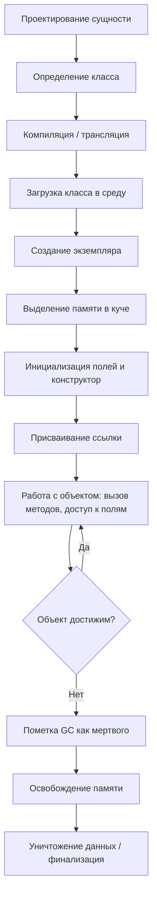

import ExternalCodeEmbed from '@site/src/components/ExternalCodeEmbed';
import ExternalPlayEmbed from '@site/src/components/ExternalPlayEmbed';

# Выполнение программного кода

<div class="article-tags">
  <span class="tag tag-required">ОБЯЗАТЕЛЬНО</span>
  <span class="tag tag-beginner">ДЛЯ НОВИЧКОВ</span>
</div>

<span class="complexity-badge">Разработчику</span>
<span class="complexity-badge">Архитектору</span>
<span class="complexity-badge">Инженеру</span>

---

## Выполнение программного кода

### Что такое выполнение кода?

> **Выполнение кода** (или исполнение кода) — это процесс, при котором компьютер или другое устройство пошагово считывает и запускает набранные программистом инструкции, переводя их в конкретные действия системы.

Когда вы запускаете любую программу, то компьютер выполняет определённые процессы на низком уровне, о которых вы можете не знать, даже несмотря на то, что это вы и написали код.

Компьютерные процессоры не понимают человеческий язык и сложные слова. Они работают только с бинарным кодом (единицами и нулями).

Тот код, который написал программист, называется исходным кодом. Он компилируется или интерпретируется, проходя несколько этапов:
- чтение и разбор (парсинг);
- загрузка в память;
- перевод (трансляция) в понятные для процессора машинные инструкции (или промежуточный байт-код)
- обработка команд, со сменой состояния транзисторов и выполнения арифметических или логических операций.

Бывает несколько видов выполнения кода:
- штатное выполнение кода, когда программы выполняет свой обычный алгоритм при запуске;
- пошаговое выполнение, когда код выполняется программистом строка за строкой (например, в отладчике);
- произвольное выполнение кода (ACE) - когда хакер может заставить запустить любые нужные ему команды;
- удалённое выполнение кода (RCE) - когда взломщик запускает код, не имея физического доступа к устройству;
- выполнение в песочнице - запуск кода в изолированной, безопасной виртуальной среде, где он не сможет навредить основной операционной системе или украсть личные файлы.

---

### Работа на низком уровне

А сейчас мы погрузимся в низкоуровневое исследование того, что происходит при выполнении кода.

К слову, я с этим и столкнулся поначалу - когда познал основы на разных языках, взяв за основу лишь всё то, что было в учебниках, курсах, лекциях и на моей практике, но столкнувшись со сложностями понимания тонкостей - если в самом начале пути ещё можно разбираться в том, что такое функции, переменные, классы, методы и прочее, то в технической плоскости можно утонуть.

Давайте же изучим сложный путь данных в программировании.

Так, представим, что у нас есть некая сущность — те самые данные. Они поначалу проектируются, в ходе чего определяется тип, смысл и логика, затем записываются, читаются и обрабатываются.

```text
АЛГОРИТМ ЖИЗНЕННЫЙ_ЦИКЛ_ДАННЫХ (упрощённо)
  СПРОЕКТИРОВАТЬ_СУЩНОСТЬ()
  ЗАПИСАТЬ()
  СОХРАНИТЬ()
  ПРОЧИТАТЬ()
  ОБРАБОТАТЬ()
  ОЧИСТИТЬ()
КОНЕЦ
```

Та же идея для объектно-ориентированной программы — в таблице ниже (32 шага). Высокоуровнево вы обычно делаете только **проектирование** и **класс в коде**; остальное выполняет среда, компилятор и процессор.

<ExternalPlayEmbed example="code-dev/object-lifecycle-simulator" title="Жизненный цикл объекта" minHeight={480} />

---

### Схема выполнения

Но если погрузиться на уровень ближе к железу, как профессионалы, то увидим более сложную схему.

| № | Название этапа | Описание |
|---|----------------|--------|
| 1 | Проектирование сущности | Чтобы что-то создать, нужно сначала понять, что это такое. На этапе проектирования определяется концепция сущности: её назначение, поведение, атрибуты, связи с другими объектами. Создают [диаграмму классов UML](/encyclopedia/7-project/7-04-analitika/124#uml-class-diagram) с полями, методами, наследованием и композицией. Это абстрактная модель, ещё не привязанная к коду. Определить нужно: свойства и их типы данных (строки, числа, и иные); поведение (методы); цель и задачи; связи с другими сущностями. |
| 2 | Определение шаблона (класса) | Класс как шаблон (чертёж) сущности реализуется в коде. Включает объявление имени, полей (атрибутов), методов, конструкторов, деструкторов, модификаторов доступа. Грубо говоря, мы воплощаем проект в код, превращая диаграмму сущностей в текстовую информацию — занимаемся написанием кода. Итоговый код оформляется как класс — шаблон построения сущности. Класс не занимает память — он лишь описывает структуру будущих экземпляров. |
| 3 | Компиляция / трансляция класса | При компиляции написанный класс преобразуется в байт-код (в языках с виртуальной машиной) или машинный код (в компилируемых языках). Исходный код на языке программирования преобразуется в машиночитаемый формат. Информация о структуре класса, сигнатурах методов, типах полей сохраняется в метаданных (например, таблица виртуальных методов, VTable). |
| 4 | Загрузка класса в среду выполнения | При запуске программы класс загружается в память среды выполнения (например, JVM, CLR). Происходит разрешение зависимостей, проверка доступности родительских классов и интерфейсов. Класс инициализируется: выполняются статические блоки, инициализируются статические поля. |
| 5 | Объявление переменной-ссылки | Объявляется переменная, которая будет указывать на экземпляр сущности. На основе типа данных определяется объём требуемой памяти. На этом этапе выделяется память под ссылку (указатель), но она ещё не указывает на объект. Например: `MyClass obj;` — ссылка `obj` создана, но объект не создан. |
| 6 | Выделение памяти под объект (куча) | При создании экземпляра (`new MyClass()`) среда выполнения запрашивает память в куче (heap). Выделяется блок памяти, достаточный для хранения всех полей объекта и служебной информации (указатель на VTable, lock-объект, хэш-код). |
| 7 | Инициализация объекта | Поля объекта инициализируются значениями по умолчанию (0, null, false), затем выполняется конструктор. Конструктор может вызывать цепочку инициализации родительских классов (через `super()` или `base()`), устанавливать начальные значения полей, выполнять проверки. |
| 8 | Присваивание ссылки | Ссылка (объявленная ранее переменная) получает адрес созданного объекта в куче. Теперь переменная указывает на конкретный экземпляр. Ссылка хранится в стеке (если локальная) или в куче (если поле другого объекта). |
| 9 | Запись ссылки в стек вызовов | Если объект создаётся внутри метода, ссылка помещается в стек вызовов (stack frame) текущего потока. Это позволяет быстро обращаться к объекту в рамках текущего контекста. Стек управляется процессором через указатель стека (ESP/RSP). |
| 10 | Обращение к полям и методам | При доступе к полям (`obj.field`) или вызове методов (`obj.method()`) процессор или виртуальная машина вычисляет смещение от базового адреса объекта в куче. Для методов происходит разрешение через таблицу виртуальных методов (VTable) при динамическом полиморфизме. |
| 11 | Чтение данных из памяти | Процессор по физическому адресу (полученному из виртуального через MMU) читает данные из ОЗУ. Данные могут быть сначала загружены в кэш L1/L2/L3 для ускорения доступа. Читаемые байты интерпретируются согласно типу (int, float, ссылка и т.д.). |
| 12 | Работа с данными на уровне битов | Все данные хранятся в виде битов (0 и 1). [Побитовые операции](/encyclopedia/4-code-dev/4-02-chto-takoe-kod-i-kak-on-rabotaet/33#pobitovye-operatory) (`&`, `|`, &lt;&lt;, &gt;&gt;) манипулируют регистрами поразрядно; битовые маски задают флаги. |
| 13 | Модификация данных (запись) | При изменении поля объекта (`obj.value = 42`) новое значение записывается по смещённому адресу в куче. Процессор использует шину данных для записи байтов в ОЗУ. Кэш-память может быть обновлена (write-back или write-through). |
| 14 | Кэширование данных | Часто используемые данные объекта могут кэшироваться на уровне CPU. Это ускоряет доступ, но требует синхронизации при многопоточности (например, через `volatile` или блокировки). Когерентность кэша поддерживается протоколами (MESI). |
| 15 | Фрагментация кучи | При частом выделении и освобождении объектов память в куче может фрагментироваться: остаются мелкие "дыры" между выделенными блоками. Наличие таких дыр снижает эффективность выделения памяти. Сборщик мусора может выполнять дефрагментацию (compact). |
| 16 | Вызов методов и переходы по адресам | При вызове метода адрес возврата, параметры и локальные переменные помещаются в новый фрейм стека. Процессор выполняет команду перехода (jump) на адрес метода. В случае виртуальных методов адрес определяется динамически через VTable. |
| 17 | Обработка данных (логика) | Внутри методов выполняется бизнес-логика: вычисления, ветвления, циклы. Процессор выполняет инструкции из машинного кода: загружает операнды, выполняет ALU-операции, записывает результаты. |
| 18 | Построение модели на основе данных | Объект может агрегировать или ссылаться на другие объекты, формируя сложную структуру данных (например, дерево, граф). Эти связи определялись на этапе проектирования. Ссылки между объектами создают граф достижимости, критичный для сборки мусора. |
| 19 | Использование объекта (взаимодействие) | Объект участвует в работе программы: передаётся как параметр, возвращается из метода, используется в коллекциях, сериализуется, участвует в событиях. Его состояние может изменяться многократно. |
| 20 | Поиск объекта (по ссылке или значению) | При поиске (например, в коллекции) выполняется обход ссылок или сравнение значений. Хэширование (`hashCode`) ускоряет поиск. При сравнении (`equals`) могут сравниваться поля объекта побитово или по ссылке. |
| 21 | Сериализация / передача данных | Объект может быть сериализован в поток байтов (например, JSON, бинарный формат). Поля преобразуются в последовательность битов, сохраняются порядок байтов (endianness), типы, структура. Это необходимо для хранения или передачи по сети. |
| 22 | Десериализация / восстановление | Из потока байтов воссоздаётся объект. Выделяется память, поля инициализируются из данных, восстанавливаются ссылки (при поддержке графов). Может вызываться специальный конструктор или метод восстановления. |
| 23 | Проверка достижимости (reachability) | Сборщик мусора (GC) определяет, доступен ли объект из корней (статические поля, локальные переменные в стеке, регистры). Объект считается живым, если существует путь по ссылкам от корня. |
| 24 | Пометка (mark phase) | На этапе сборки мусора GC проходит по всем достижимым объектам, помечая их как "живые". Это делается обходом графа ссылок (обычно в глубину или ширину). Пометка хранится в служебных битах объекта или отдельной структуре. |
| 25 | Сборка (sweep / compact) | Недостижимые объекты (не помеченные) освобождаются. При sweep — память помечается как свободная. При compact — живые объекты сдвигаются в одну область, устраняя фрагментацию. Указатели (ссылки) обновляются (ремаппинг). |
| 26 | Очистка ресурсов (деструктор / финализатор) | Перед уничтожением объекта может быть вызван финализатор (если определён). Он позволяет освободить неуправляемые ресурсы (файлы, сокеты, память вне кучи). Однако финализаторы ненадёжны и медленны — предпочтительнее использовать RAII или using/dispose. |
| 27 | Освобождение памяти в куче | Память, занимаемая объектом, возвращается в пул свободной памяти. Менеджер памяти обновляет метаданные (списки свободных блоков, битовые карты). |
| 28 | Освобождение ссылки в стеке | При выходе из метода фрейм стека удаляется. Ссылки, хранящиеся в нём, уничтожаются. Это может сделать объект недостижимым, если других ссылок на него нет. |
| 29 | Уничтожение данных (обнуление) | Освобождённая память может быть явно обнулена (в безопасных средах) или оставлена "как есть" (для производительности). Данные физически остаются до перезаписи, что может быть угрозой безопасности. |
| 30 | Анализ использования (профилирование) | Инструменты профилирования отслеживают создание, время жизни, размер, частоту сборки мусора для объектов. Это помогает находить утечки памяти, оптимизировать аллокации, выбирать оптимальные структуры данных. |
| 31 | Оптимизация компилятором / JIT | Современные среды (например, JVM, .NET) применяют JIT-компиляцию: часто вызываемые методы компилируются в нативный код. Применяются оптимизации: inlining, escape analysis (чтобы выделить объект на стеке вместо кучи), устранение синхронизации. |
| 32 | Управление жизненным циклом (ручное / автоматическое) | В некоторых языках (C++, Rust) управление памятью ручное или определяется владением. В других (Java, C#, Python) — автоматическое через GC. Выбор влияет на производительность, предсказуемость и сложность. |

Важно понимать, что вышеприведенный алгоритм выполнения кода является скорее инженерной памяткой, применимой для объектно-ориентированного программирования. И как раз проектирование сущности и определение класса являются высокоуровневой работой, а всё остальное - низкоуровневой.

Представляете теперь, какова работа на современных языках (первые два пункта) и какова была работа на первых устройствах? Технически, мы уже выполняем не все 32 пункта, а лишь 2, причем серьезность никуда не ушла - мы должны проектировать и писать эти 2 пункта так, чтобы учитывать все последующие 30. Какие-то ньюансы за нас заботливо рассчитывает компьютер, а что-то продумывать придётся нам.

---

## Разбор этапов выполнения

Ниже — подробный проход по каждому из 32 этапов из таблицы выше. Это не линейный сценарий «один раз сверху вниз»: часть шагов происходит при сборке, часть — при каждом запуске программы, часть — при каждом обращении к объекту, а этапы с 23 по 29 — когда объект больше не нужен. Но если понять каждый этап отдельно, целая цепочка складывается в связную картину: от идеи на доске до битов в оперативной памяти и обратно в свободный пул.

---

### 1. Проектирование сущности

Всё начинается не с кода, а с вопроса: **что именно мы моделируем и зачем?** Сущность — это не просто «ещё один класс в проекте», а осмысленная единица предметной области: пользователь, заказ, платёж, сенсор, документ. На этапе проектирования вы решаете, какие данные у неё есть, что она умеет делать и как связана с другими частями системы.

Практически это выглядит так: вы описываете поля (имя, email, баланс), методы (зарегистрироваться, списать средства), ограничения (баланс не может быть отрицательным) и связи (заказ содержит список позиций). Часто для наглядности рисуют [диаграмму классов UML](/encyclopedia/7-project/7-04-analitika/124#uml-class-diagram): прямоугольник с тремя секциями — имя, атрибуты, операции.

Важно: на этом этапе **ещё нет памяти, процессора и файлов с кодом**. Есть только модель в голове и на схеме. Ошибка здесь дорого обходится позже: если забыли поле «дата создания» или не продумали, кто владеет коллекцией дочерних объектов, придётся переделывать и класс, и базу данных, и API. Хорошее проектирование сущности экономит десятки низкоуровневых проблем — от лишних аллокаций в куче до утечек памяти из-за висящих ссылок.

---

### 2. Определение шаблона (класса)

Когда модель понятна, её **воплощают в коде** — объявляют класс (или struct, record — зависит от языка). Класс — это чертёж: по нему можно построить сколько угодно экземпляров, но сам чертёж в памяти не «живёт» как объект с вашими данными.

В коде вы фиксируете:

- **имя** типа (`class Order`, `struct Point`);
- **поля** — переменные, которые будет хранить каждый экземпляр;
- **методы** — функции, работающие с этими полями;
- **конструкторы** — как создавать объект в корректном начальном состоянии;
- **модификаторы доступа** — что видно снаружи (`public`), что скрыто (`private`).


<ExternalCodeEmbed example="java/code-403-1-001" title="2. Определение шаблона (класса)" minHeight={300} />


Класс загружается один раз (метаданные о нём), а каждый `new Order(...)` — отдельный экземпляр со своими значениями полей. Различие «шаблон vs экземпляр» — фундамент ООП: путаешь их — получаешь статические поля там, где нужны экземплярные, или наоборот.

---

### 3. Компиляция / трансляция класса

Исходный код — текст для человека. Процессор его не читает. **Компилятор или транслятор** превращает класс в формат, который понимает среда выполнения или железо напрямую.

Варианты:

- **AOT-компиляция** (C, C++, Rust, Go): исходник → машинный код (.exe, .so). Класс «растворяется» в бинарнике: структуры полей, смещения, адреса функций.
- **Компиляция в байт-код** (Java, C#, Kotlin): исходник → `.class`, `.dll` с IL — промежуточное представление для JVM/CLR.
- **Интерпретация** (часть Python, JavaScript): класс может компилироваться в байт-код на лету или храниться как структура в памяти интерпретатора.

При трансляции сохраняется **метаинформация**: имена методов, типы параметров, таблица виртуальных методов (VTable) для полиморфизма, атрибуты для рефлексии. Без неё среда выполнения не смогла бы вызвать `obj.save()` — ей нужно знать, где лежит код метода и сколько аргументов передать.

Ошибки на этом этапе — синтаксические и часть семантических: неверный тип, несуществующий метод, нарушение видимости. Программа до запуска даже не дойдёт до выделения памяти под объект.

---

### 4. Загрузка класса в среду выполнения

Программа стартовала — пора **подтянуть классы в память**. Загрузчик классов (ClassLoader в Java, loader в .NET) находит скомпилированный артефакт, проверяет его и регистрирует в runtime.

Что происходит:

1. **Поиск** — по classpath, GAC, modules path.
2. **Проверка** — bytecode verification (Java), проверка ссылок на родителей и интерфейсы.
3. **Подготовка** — статические поля получают область памяти; для них может быть зарезервирован блок в metaspace/heap.
4. **Инициализация класса** — выполняются статические блоки `static { ... }` и присваивания статическим полям **один раз на весь процесс**.

Класс `Order` загружается, когда впервые упоминается в коде (ссылка на тип, `new Order`, вызов статического метода). До этого JVM о нём «не знает». Загрузка — дорогая операция; поэтому классы кэшируют, а в hot-reload (dev-серверы) перезагружают только изменённые.

Если родительский класс не найден или версия библиотеки несовместима — получите `ClassNotFoundException`, `NoClassDefFoundError` ещё до создания первого объекта.

---

### 5. Объявление переменной-ссылки

В методе вы пишете что-то вроде `Order order;` или `Order order = null;`. **Ссылка создана, объекта ещё нет.**

Переменная ссылочного типа — это маленький «контейнер» фиксированного размера (обычно 4 или 8 байт на 64-bit системе), в котором лежит адрес объекта в куче — или ноль/null, если объект не создан. Сама переменная для локальной ссылки живёт в **стеке** текущего фрейма вызова.

Тип `Order` говорит компилятору: «сюда можно положить только ссылку на Order или его наследника». Компилятор проверяет, что вы не присвоите туда `String`. В runtime же проверяется только, что по адресу действительно лежит объект совместимого типа (или null).

Типичная ошибка новичка — думать, что `Order order;` уже создал заказ. Нет: есть только имя, указывающее в никуда. Обращение `order.addItem(...)` до `new` — `NullPointerException`.

---

### 6. Выделение памяти под объект (куча)

Строка `order = new Order("A-1");` запускает **аллокацию в куче (heap)**. Менеджер памяти ищет свободный непрерывный блок достаточного размера.

Размер блока складывается из:

- всех полей экземпляра (с учётом выравнивания — padding);
- **заголовка объекта** (object header): маркер для GC, lock-запись, иногда hashCode;
- указателя на **класс / VTable** — чтобы runtime знал, какие методы вызывать.

Куча — общая область для всех потоков (с синхронизацией аллокатора). Стек — быстрый и автоматический, но туда не кладут большие долгоживущие объекты. Имен поэтому «new» почти всегда означает heap.

Если памяти не хватает — сначала может сработать сборщик мусора; если и после этого места нет — `OutOfMemoryError`. Частые мелкие аллокации в цикле — классический путь к давлению на GC и фрагментации (см. этап 15).

---

### 7. Инициализация объекта

Память выделена, но содержимое — **мусор или нули**. Среда выполнения приводит объект в предсказуемое состояние:

1. **Обнуление полей** — числа → 0, ссылки → null, boolean → false.
2. **Вызов конструкторов** — цепочка от базового класса к производному (`super()` / `base()`).
3. **Ваш код в конструкторе** — проверки, присваивания, открытие ресурсов.

```text
new Order("A-1")  →  [выделить] → [Object.<init>] → [Order.<init>] → объект готов
```

Конструктор — не «просто функция»: без успешного завершения ссылка не присваивается (в Java/C# объект не «торчит» наполовину инициализированным наружу). В C++ частично сконструированный объект — отдельная и опасная история с исключениями.

Поля `final` / `readonly` должны получить значение до выхода из конструктора — иначе объект считается некорректным. Именно на этом этапе закладываются инварианты: «id не null», «total ≥ 0».

---

### 8. Присваивание ссылки

После успешной инициализации **адрес объекта в куче записывается в переменную** `order`. Теперь `order` и объект связаны: через эту ссылку программа будет читать поля и вызывать методы.

Один объект — много ссылок: `Order a = order; Order b = order;` — три переменные, один экземпляр в куче. Изменение через `a.setTotal(...)` видно через `b`. Сравнение ссылок (`==`) проверяет «один и тот же объект?»; `equals()` — «одинаковое содержимое?» (если переопределён).

Присваивание ссылки — дешевая операция (копируется только адрес). Копирование большого объекта «по значению» в Java/C# не происходит автоматически — только ссылка. В C++ и Rust семантика копирования задаётся явно.

---

### 9. Запись ссылки в стек вызовов

Локальная переменная `order` хранится в **фрейме стека** текущего метода. Каждый вызов функции добавляет новый фрейм: параметры, локальные переменные, адрес возврата.

```
Стек (упрощённо):
┌─────────────────────┐
│ main()              │
│   order → 0x7f3a... │  ← ссылка на объект в куче
├─────────────────────┤
│ processOrder()      │
│   item → 0x7f3b...  │
└─────────────────────┘
```

Указатель стека (RSP/ESP на x86) двигается при входе и выходе из функций — это аппаратная операция, очень быстрая. Когда метод завершится, его фрейм **исчезает**: слот с `order` больше не существует. Если это была единственная ссылка на объект — объект становится кандидатом на сборку мусора (этапы 23–25).

Стек ограничен по размеру; бесконечная рекурсия → `StackOverflowError`. Куча обычно больше, но её нужно явно или автоматически освобождать.

---

### 10. Обращение к полям и методам

Вы пишете `order.getTotal()` или `order.total` (если доступ есть). Runtime **вычисляет адрес поля**: базовый адрес объекта + смещение (offset), известное из layout класса.

Для **статических** полей и методов объект не нужен — данные лежат в области класса. Для **экземплярных** — нужна живая ссылка.

Вызов **виртуального** метода (переопределённого в наследнике):

1. из заголовка объекта берётся указатель на таблицу методов;
2. по индексу метода находится реальный адрес кода;
3. выполняется переход (call/jump).

Полиморфизм: переменная типа `Animal`, объект — `Dog`, вызов `speak()` попадёт в реализацию `Dog`. Это разрешение на этапе выполнения (dynamic dispatch), в отличие от статически привязанных методов и полей.

Обращение к null-ссылке на любом из этих шагов — падение программы или исключение.

---

### 11. Чтение данных из памяти

Когда смещение известно, процессор **читает байты из RAM**. Логический адрес из программы сначала переводит **MMU** (Memory Management Unit) в физический адрес страницы памяти.

Цепочка доступа:

1. CPU запрашивает слово по адресу;
2. если данные есть в **кэше L1/L2/L3** — берутся оттуда (наносекунды);
3. иначе — обращение к ОЗУ (десятки–сотни наносекунд);
4. байты интерпретируются по типу: 4 байта как `int`, 8 как `double` или указатель.

Порядок байтов (endianness) важен при сериализации и при работе с сетью. На одной машине runtime обычно скрывает это от вас.

Чтение «мимо объекта» — выход за границы массива, use-after-free в C++ — undefined behavior или уязвимость. Управляемые языки проверяют границы (с ценой производительности) или используют безопасные обёртки.

---

### 12. Работа с данными на уровне битов

В памяти **нет типов «int» и «string»** — только последовательности битов. Тип — договорённость программы и процессора о том, как их трактовать.

[Побитовые операции](/encyclopedia/4-code-dev/4-02-chto-takoe-kod-i-kak-on-rabotaet/33#pobitovye-operatory) (`&`, `|`, `^`, `<<`, `>>`) работают с регистрами CPU напрямую: включают/выключают флаги, маскируют разряды, упаковывают несколько мелких значений в одно слово.

Примеры из практики:

- флаг «активен / заблокирован» в одном бите целого числа;
- цвет RGBA в одном 32-bit слове;
- контрольные биты протокола.

Даже высокоуровневый `if (user.isActive())` внизу превращается в загрузку байта, маскирование бита и условный переход (jump if zero). Понимание битового уровня помогает при оптимизации, сериализации бинарных форматов и отладке «странных» багов с переполнением и знаковостью.

---

### 13. Модификация данных (запись)

Присваивание `order.total = newTotal` — **запись** в память по вычисленному адресу. Процессор помещает новые байты в кэш и/или в RAM через шину данных.

Особенности:

- запись может идти **write-back** (сначала в кэш, в RAM позже) или **write-through**;
- другие ядра CPU должны видеть согласованные данные — протоколы когерентности (MESI);
- в многопоточности две нити, пишущие в одно поле без синхронизации, дают **data race** — неопределённый результат.

Иммутабельность (`final` поля, immutable объекты) упрощает рассуждения: после конструктора поле не меняется — меньше гонок и проще кэширование. Явные блокировки, `volatile`, атомарные типы — способы сделать запись предсказуемой между потоками.

---

### 14. Кэширование данных

Процессор **не ходит в RAM на каждую инструкцию** — он держит недавние данные в иерархии кэшей. Если вы в цикле обходите массив объектов и часто читаете одно поле — оно с высокой вероятностью окажется в L1.

Плюсы: скорость. Минусы для программиста:

- **ложное разделение** (false sharing) — два потока пишут в разные поля, но они попадают в одну cache line → лишние invalidation;
- **устаревшее чтение** без `volatile`/барьеров — поток не видит запись другого потока сразу.

`volatile` в Java не делает операцию атомарной для `i++`, но гарантирует видимость. Для счётчиков нужны `AtomicInteger` и аналоги. На уровне железа всё сводится к тому, когда кэш-линия считается актуальной — а на уровне кода вы выбираете примитивы синхронизации.

---

### 15. Фрагментация кучи

Куча — как парковка: машины (объекты) приезжают и уезжают. Между «машинами» остаются **дыры** — свободные куски слишком малы для нового крупного объекта, хотя суммарно памяти хватает.

Причины:

- объекты разного размера живут разное время;
- освобождение не уплотняет память автоматически (зависит от аллокатора и GC).

Последствия: аллокация замедляется, растёт потребление RSS, GC тратит больше времени на обход «рваной» кучи. Решения — **compact** (сдвинуть живые объекты вместе), пулы объектов, arena-аллокаторы, переиспользование буферов.

В C++ долгоживущий процесс с частым `new`/`delete` без пула — классический источник фрагментации. В Java compact делает GC (не все коллекторы — G1 и ZGC по-разному).

---

### 16. Вызов методов и переходы по адресам

`order.calculateDiscount()` — это не «магия», а **последовательность машинных действий**:

1. аргументы (и неявный `this`) кладутся в регистры или стек;
2. в стек записывается **адрес возврата** — куда прыгнуть после метода;
3. CPU выполняет **jump/call** на entry point метода;
4. создаётся новый stack frame для локальных переменных метода;
5. по `return` восстанавливается предыдущий frame и выполнение продолжается.

Для **виртуального** вызова адрес берётся из VTable во время выполнения. Для **final/static/private** — часто devirtualization: JIT подставляет прямой вызов или inline.

Глубокая цепочка вызовов — глубокий стек. Рекурсия без базового случая — overflow. Tail-call optimization (в некоторых языках) переиспользует frame — но на JVM это не гарантировано.

---

### 17. Обработка данных (логика)

Внутри метода — **ваша бизнес-логика**: условия, циклы, арифметика. Компилятор уже перевёл это в машинные инструкции; CPU выполняет их в конвейере.

Типичный цикл:

```text
загрузить order.total в регистр
загрузить константу 100
сравнить; если меньше — перейти на метку
умножить на 0.9
сохранить обратно в order.total
```

**ALU** (Arithmetic Logic Unit) выполняет сложение, сравнение, битовые операции. **Branch predictor** угадывает, куда пойдёт `if`, чтобы не простаивать конвейер. Плохо предсказуемые ветвления — просадка производительности.

На этом этапе вы как разработчик мыслите алгоритмами; процессор — микрооперациями. Отладчик показывает ваш уровень; профайлер — сколько времени ушло в конкретный метод и сколько инструкций ветки не попали в prediction.

---

### 18. Построение модели на основе данных

Один объект редко живёт изолированно. **Order** ссылается на `List<OrderLine>`, каждая строка — на `Product`, пользователь — на `Address`. Так строится **граф объектов в памяти** — то, что вы проектировали связями на UML.

Направление связи важно:

- **композиция** — дочерние объекты не имеют смысла без родителя; обычно уничтожаются вместе с ним;
- **агрегация** — дочерние могут жить дольше;
- **ассоциация** — слабая связь, двусторонние ссылки осторожно (утечки через циклы).

Граф достижимости от корней (статика, стек, регистры) — основа для GC: если на объект нельзя дойти по ссылкам — он мёртв, даже если «где-то» на него ещё числится забытый указатель в C++. В управляемых языках циклические ссылки (`A→B→A`) GC всё равно соберёт, если нет внешних корней.

---

### 19. Использование объекта (взаимодействие)

Объект **участвует в работе программы**: его передают в методы, кладут в коллекции, возвращают из API, подписывают на события, сериализуют в JSON для клиента.

```java
orders.add(order);
notificationService.send(order);
return order;
```

Состояние меняется многократно: создан → позиции добавлены → оплачен → отправлен. Каждое изменение — записи в поля (этап 13), возможно — новые ссылки на другие объекты (этап 18).

Здесь проявляются паттерны: DTO для передачи, Entity для персистентности, Value Object для неизменяемых значений. Один и тот же «заказ» в памяти может быть разным представлением в разных слоях — но физически это либо один объект, либо копии/маппинги, что вы явно выбрали.

---

### 20. Поиск объекта (по ссылке или значению)

Коллекции и базы данных постоянно **ищут**: «есть ли заказ с id = A-1?», «найти пользователя по email».

Механизмы:

- **по ссылке / идентичности** — `==`, сравнение указателей (тот же экземпляр?);
- **по значению** — `equals()`, сравнение полей;
- **через хеш** — `hashCode()` / `GetHashCode()` для быстрого попадания в bucket в `HashMap`/`Dictionary`.

Плохой `equals`/`hashCode` (нарушение контракта: равные объекты с разным hash) ломает хеш-таблицы — элементы «теряются». Сравнение больших структур побайтово дорого — поэтому индексы, B-tree, хеши.

Поиск в памяти — обход ссылок и сравнение в CPU; в БД — тот же принцип, но данные на диске с индексами и буферным пулом.

---

### 21. Сериализация / передача данных

Чтобы сохранить объект на диск или отправить по сети, его **превращают в поток байтов**: JSON, XML, Protocol Buffers, собственный бинарный формат.

Что фиксируется:

- порядок полей или схема (schema);
- типы и размеры;
- **endianness** для чисел;
- кодировка строк (UTF-8);
- ссылки — как id или вложенные объекты.

`{"id":"A-1","total":150.00}` — человекочитаемая сериализация. Бинарник компактнее и быстрее, но требует версионирования схемы: добавили поле — старые клиенты должны не сломаться.

Сериализация — не «фотография памяти»: указатели нельзя просто записать в файл. Нужна логическая модель. Ошибки на этом этапе — одни из самых болезненных в распределённых системах.

---

### 22. Десериализация / восстановление

Обратный процесс: из байтов **снова объект в памяти**.

1. парсинг формата;
2. **новая аллокация** в куче (этап 6);
3. заполнение полей;
4. восстановление графа ссылок (если несколько связанных объектов — иногда `$ref` / id mapping);
5. опционально — вызов конструктора или фабрики (`JsonConstructor`, custom deserializer).

Десериализация **не продолжает** жизнь старого объекта — это обычно новый экземпляр с теми же данными. Два объекта с одинаковым id — разные ссылки в памяти, если вы не используете identity map / кэш.

Небезопасная десериализация недоверенных данных — вектор атак (выполнение произвольного кода через gadget chains). Поэтому в API валидируют вход и ограничивают типы.

---

### 23. Проверка достижимости (reachability)

Когда на объект **больше нет нужды**, память нужно вернуть. В языках с GC вы не вызываете `free` — **сборщик** сам решает, жив объект или нет.

**Корни (GC roots):**

- локальные переменные и параметры в стеках всех потоков;
- статические поля;
- JNI/global handles;
- иногда — синтетические корни runtime.

Обход: от каждого корня по всем ссылкам. Если до объекта **можно дойти** — он жив. Если нет — мёртв, даже если на него формально указывает «висячая» ссылка внутри другого мёртвого объекта.

```text
main.order → Order → List → OrderLine
         ↘ (после order = null путь обрывается, если других ссылок нет)
```

В C++/Rust ответственность на вас: `unique_ptr`, RAII, явный `delete`, borrow checker. Нет reachability-алгоритма — есть правила владения.

---

### 24. Пометка (mark phase)

Алгоритмы mark-and-sweep начинаются с **фазы пометки**. GC обходит граф от корней и помечает каждый достижимый объект (бит в header, отдельная bitmap, tri-color marking).

Варианты:

- **stop-the-world** — все потоки паузятся, mark быстрый и простой;
- **concurrent mark** — пометка параллельно с программой, сложнее, но меньше паузы (G1, ZGC, Shenandoah).

Tri-color: белый (не видели), серый (видели, дети не проверены), чёрный (обработан). Инвариант не даёт «потерять» живой объект при concurrent mutation.

Пометка — O(размер живого графа). Чем больше живых объектов и связей — тем дольше GC. Много мелких долгоживущих объектов — больше работы на каждом цикле.

---

### 25. Сборка (sweep / compact)

После mark **всё непомеченное — мусор**.

- **Sweep** — пройти по куче, свободные блоки в free-list. Быстро, но фрагментация остаётся.
- **Compact** — сдвинуть живые объекты в начало, обновить **все ссылки** (relocation). Дороже, но куча плотная.

Некоторые GC копируют живые объекты в другую половину (**copying collector** — Cheney algorithm в nursery). Generational GC: молодые объекты умирают часто — отдельная маленькая область, редкие full GC.

Пауза на sweep/compact — то, что видно в метриках «GC pause time». Для latency-sensitive сервисов выбирают коллектор и размер кучи осознанно.

---

### 26. Очистка ресурсов (деструктор / финализатор)

Память в куче — не единственный ресурс. Есть **файлы, сокеты, нативные handle, блокировки**. Их GC не освобождает автоматически.

Механизмы:

- **деструктор** (`~T()` в C++) — детерминированно при уничтожении;
- **финализатор** (`finalize()` в Java — deprecated) — вызов «когда-нибудь» GC, ненадёжно;
- **try-with-resources / using / defer** — явное закрытие в блоке;
- **IDisposable** в C# — паттерн `Dispose()`.

Правило: **не полагайтесь на финализатор** для файлов и соединений. Закрывайте явно. В Java `Cleaner` / phantom references — компромисс для нативных peer-объектов.

Порядок: сначала логика «закрыть ресурс», потом память возвращается аллокатору (этап 27).

---

### 27. Освобождение памяти в куче

Блок, занятый объектом, **возвращается менеджеру памяти**. Метаданные free-list, segregated fits, bitmap свободных страниц — обновляются.

В **GC-средах** sweep уже сделал блок «логически свободным»; повторная аллокация может переиспользовать тот же адрес для нового объекта — старые данные ещё физически там, пока не перезапишут (см. этап 29).

В **ручном управлении** (`delete`, `free`) ошибка double-free или use-after-free — краш или дыра в безопасности. Smart pointers и ownership в Rust снижают класс ошибок на этапе компиляции.

Размер освобождённого блока может не совпадать с запросом следующего `new` — отсюда фрагментация и стратегии аллокаторов.

---

### 28. Освобождение ссылки в стеке

Метод завершился — его **stack frame снимается**. Локальные переменные, включая ссылки на объекты, перестают существовать как имена.

```java
void process() {
    Order order = loadOrder();
    // ... работа ...
} // order исчезает из стека
```

Если `order` была единственной живой ссылкой с корня — объект становится недостижимым. Если объект ещё в глобальной `Map` — он жив.

Параметры методов — тоже ссылки в frame; return не «уничтожает» объект, если вы вернули ссылку вызывающему. Стек — про **область видимости** имён, а не про время жизни объектов в куче.

---

### 29. Уничтожение данных (обнуление)

После освобождения **байты в RAM физически остаются**, пока их не затрут новой аллокацией или явной очисткой.

Последствия:

- **утечка данных** — пароль или ключ в освобождённом блоке может быть прочитан другим процессом или через дамп памяти;
- **security-sensitive** код обнуляет буферы (`Arrays.fill`, `SecureZeroMemory`);
- некоторые аллокаторы для скорости **не затирают** память сразу.

«Обнуление» в безопасных средах — политика, не закон физики. Для отладки иногда видят «мусор» в только что созданном объекте в C, если не обнулили — в Java поля по умолчанию обнуляются runtime.

---

### 30. Анализ использования (профилирование)

Инженерная обратная связь: **как объекты живут в реальной программе**.

Инструменты (VisualVM, dotMemory, perf, Valgrind, browser DevTools):

- сколько объектов типа X создано;
- среднее время жизни;
- retained size — сколько памяти освободится, если убрать один объект;
- частота и длительность GC;
- allocation hotspots — какая строка кода создаёт больше всего мусора.

Типичные находки: строки в цикле через `+`, лишние autoboxing, кэш без eviction, забытые static collections, держащие весь мир. Профилирование связывает абстрактные этапы 6–15 с конкретной строкой в вашем репозитории.

Без профилирования оптимизация — угадывание. С профилированием — целенаправленное изменение модели или аллокаторной стратегии.

---

### 31. Оптимизация компилятором / JIT

Первый запуск метода часто идёт через **интерпретатор или baseline JIT**. Если метод «горячий» — его **перекомпилируют** в оптимизированный машинный код.

Типичные оптимизации:

- **inlining** — тело маленького метода вставляется в вызывающий, без call overhead;
- **escape analysis** — если объект не «убегает» из метода, аллокация на **стеке** вместо кучи;
- **dead code elimination**, constant folding, loop unrolling;
- **devirtualization** — если тип известен, прямой вызов вместо VTable;
- **lock elision** — убрать лишнюю синхронизацию, если анализ показал безопасность.

C# RyuJIT, JVM C2, V8 TurboFan — всё это про этап «после написания кода». Вы пишете понятно; runtime делает быстро. Иногда оптимизация ломает отладку (стек исчезает после inline) или меняет семантику гонок — редко, но возможно при агрессивных настройках.

AOT (GraalVM Native Image, IL2CPP) переносит часть работы JIT на этап сборки — быстрый старт, меньше гибкости.

---

### 32. Управление жизненным циклом (ручное / автоматическое)

Итоговый выбор **кто отвечает за память и ресурсы** — архитектурное решение языка и вашего кода.

| Подход | Примеры | Плюсы | Минусы |
|--------|---------|-------|--------|
| **GC** | Java, C#, Go, Python | Меньше ошибок утечек указателей, проще API | Паузы, непредсказуемый момент освобождения |
| **Ручное + RAII** | C++ | Полный контроль, детерминизм | double-free, leaks, сложность |
| **Ownership** | Rust | Без GC и без классических утечек (на этапе компиляции) | Кривая обучения, borrow checker |
| **Reference counting + GC** | Swift, Python (частично) | Предсказуемое освобождение при cnt=0 | Циклы нужно ломать weak refs / GC |

На практике вы комбинируете: GC для объектов, `using` для файлов, пулы для переиспользования, weak references для кэшей и listeners (чтобы не удерживать UI от GC).

Понимание всех 32 этапов нужно не для ручного управления каждым, а чтобы **первые два этапа — проектирование и класс — не создавали лишней работы остальным тридцати**. Хорошая модель, immutability где можно, явное закрытие ресурсов, разумные коллекции и профилирование под нагрузкой — это и есть профессиональная работа с жизненным циклом данных.

---

### Визуально

Схематично:


---
