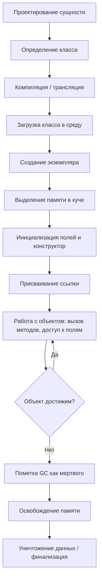

import ObjectLifecycleSimulator from '@site/src/components/ObjectLifecycleSimulator.jsx';

# Выполнение программного кода

<div class="article-tags">
  <span class="tag tag-required">ОБЯЗАТЕЛЬНО</span>
  <span class="tag tag-beginner">ДЛЯ НОВИЧКОВ</span>
</div>

<span class="complexity-badge">Разработчику</span>
<span class="complexity-badge">Архитектору</span>
<span class="complexity-badge">Инженеру</span>

---

## Выполнение программного кода

### Работа на низком уровне

А сейчас мы погрузимся в низкоуровневое исследование того, что происходит при выполнении кода.

К слову, я с этим и столкнулся поначалу - когда познал основы на разных языках, взяв за основу лишь всё то, что было в учебниках, курсах, лекциях и на моей практике, но столкнувшись со сложностями понимания тонкостей - если в самом начале пути ещё можно разбираться в том, что такое функции, переменные, классы, методы и прочее, то в технической плоскости можно утонуть.

Давайте же изучим сложный путь данных в программировании.

Так, представим, что у нас есть некая сущность — те самые данные. Они поначалу проектируются, в ходе чего определяется тип, смысл и логика, затем записываются, читаются и обрабатываются.

```text
АЛГОРИТМ ЖИЗНЕННЫЙ_ЦИКЛ_ДАННЫХ (упрощённо)
  СПРОЕКТИРОВАТЬ_СУЩНОСТЬ()
  ЗАПИСАТЬ()
  СОХРАНИТЬ()
  ПРОЧИТАТЬ()
  ОБРАБОТАТЬ()
  ОЧИСТИТЬ()
КОНЕЦ
```

Та же идея для объектно-ориентированной программы — в таблице ниже (32 шага). Высокоуровнево вы обычно делаете только **проектирование** и **класс в коде**; остальное выполняет среда, компилятор и процессор.

<ObjectLifecycleSimulator />

---

### Схема выполнения

Но если погрузиться на уровень ближе к железу, как профессионалы, то увидим более сложную схему.

| № | Название этапа | Описание |
|---|----------------|--------|
| 1 | Проектирование сущности | Чтобы что-то создать, нужно сначала понять, что это такое. На этапе проектирования определяется концепция сущности: её назначение, поведение, атрибуты, связи с другими объектами. Создают [диаграмму классов UML](/encyclopedia/7-project/7-04-analitika/124#uml-class-diagram) с полями, методами, наследованием и композицией. Это абстрактная модель, ещё не привязанная к коду. Определить нужно: свойства и их типы данных (строки, числа, и иные); поведение (методы); цель и задачи; связи с другими сущностями. |
| 2 | Определение шаблона (класса) | Класс как шаблон (чертёж) сущности реализуется в коде. Включает объявление имени, полей (атрибутов), методов, конструкторов, деструкторов, модификаторов доступа. Грубо говоря, мы воплощаем проект в код, превращая диаграмму сущностей в текстовую информацию — занимаемся написанием кода. Итоговый код оформляется как класс — шаблон построения сущности. Класс не занимает память — он лишь описывает структуру будущих экземпляров. |
| 3 | Компиляция / трансляция класса | При компиляции написанный класс преобразуется в байт-код (в языках с виртуальной машиной) или машинный код (в компилируемых языках). Исходный код на языке программирования преобразуется в машиночитаемый формат. Информация о структуре класса, сигнатурах методов, типах полей сохраняется в метаданных (например, таблица виртуальных методов, VTable). |
| 4 | Загрузка класса в среду выполнения | При запуске программы класс загружается в память среды выполнения (например, JVM, CLR). Происходит разрешение зависимостей, проверка доступности родительских классов и интерфейсов. Класс инициализируется: выполняются статические блоки, инициализируются статические поля. |
| 5 | Объявление переменной-ссылки | Объявляется переменная, которая будет указывать на экземпляр сущности. На основе типа данных определяется объём требуемой памяти. На этом этапе выделяется память под ссылку (указатель), но она ещё не указывает на объект. Например: `MyClass obj;` — ссылка `obj` создана, но объект не создан. |
| 6 | Выделение памяти под объект (куча) | При создании экземпляра (`new MyClass()`) среда выполнения запрашивает память в куче (heap). Выделяется блок памяти, достаточный для хранения всех полей объекта и служебной информации (указатель на VTable, lock-объект, хэш-код). |
| 7 | Инициализация объекта | Поля объекта инициализируются значениями по умолчанию (0, null, false), затем выполняется конструктор. Конструктор может вызывать цепочку инициализации родительских классов (через `super()` или `base()`), устанавливать начальные значения полей, выполнять проверки. |
| 8 | Присваивание ссылки | Ссылка (объявленная ранее переменная) получает адрес созданного объекта в куче. Теперь переменная указывает на конкретный экземпляр. Ссылка хранится в стеке (если локальная) или в куче (если поле другого объекта). |
| 9 | Запись ссылки в стек вызовов | Если объект создаётся внутри метода, ссылка помещается в стек вызовов (stack frame) текущего потока. Это позволяет быстро обращаться к объекту в рамках текущего контекста. Стек управляется процессором через указатель стека (ESP/RSP). |
| 10 | Обращение к полям и методам | При доступе к полям (`obj.field`) или вызове методов (`obj.method()`) процессор или виртуальная машина вычисляет смещение от базового адреса объекта в куче. Для методов происходит разрешение через таблицу виртуальных методов (VTable) при динамическом полиморфизме. |
| 11 | Чтение данных из памяти | Процессор по физическому адресу (полученному из виртуального через MMU) читает данные из ОЗУ. Данные могут быть сначала загружены в кэш L1/L2/L3 для ускорения доступа. Читаемые байты интерпретируются согласно типу (int, float, ссылка и т.д.). |
| 12 | Работа с данными на уровне битов | Все данные хранятся в виде битов (0 и 1). [Побитовые операции](/encyclopedia/4-code-dev/4-02-chto-takoe-kod-i-kak-on-rabotaet/33#pobitovye-operatory) (`&`, `|`, &lt;&lt;, &gt;&gt;) манипулируют регистрами поразрядно; битовые маски задают флаги. |
| 13 | Модификация данных (запись) | При изменении поля объекта (`obj.value = 42`) новое значение записывается по смещённому адресу в куче. Процессор использует шину данных для записи байтов в ОЗУ. Кэш-память может быть обновлена (write-back или write-through). |
| 14 | Кэширование данных | Часто используемые данные объекта могут кэшироваться на уровне CPU. Это ускоряет доступ, но требует синхронизации при многопоточности (например, через `volatile` или блокировки). Когерентность кэша поддерживается протоколами (MESI). |
| 15 | Фрагментация кучи | При частом выделении и освобождении объектов память в куче может фрагментироваться: остаются мелкие "дыры" между выделенными блоками. Наличие таких дыр снижает эффективность выделения памяти. Сборщик мусора может выполнять дефрагментацию (compact). |
| 16 | Вызов методов и переходы по адресам | При вызове метода адрес возврата, параметры и локальные переменные помещаются в новый фрейм стека. Процессор выполняет команду перехода (jump) на адрес метода. В случае виртуальных методов адрес определяется динамически через VTable. |
| 17 | Обработка данных (логика) | Внутри методов выполняется бизнес-логика: вычисления, ветвления, циклы. Процессор выполняет инструкции из машинного кода: загружает операнды, выполняет ALU-операции, записывает результаты. |
| 18 | Построение модели на основе данных | Объект может агрегировать или ссылаться на другие объекты, формируя сложную структуру данных (например, дерево, граф). Эти связи определялись на этапе проектирования. Ссылки между объектами создают граф достижимости, критичный для сборки мусора. |
| 19 | Использование объекта (взаимодействие) | Объект участвует в работе программы: передаётся как параметр, возвращается из метода, используется в коллекциях, сериализуется, участвует в событиях. Его состояние может изменяться многократно. |
| 20 | Поиск объекта (по ссылке или значению) | При поиске (например, в коллекции) выполняется обход ссылок или сравнение значений. Хэширование (`hashCode`) ускоряет поиск. При сравнении (`equals`) могут сравниваться поля объекта побитово или по ссылке. |
| 21 | Сериализация / передача данных | Объект может быть сериализован в поток байтов (например, JSON, бинарный формат). Поля преобразуются в последовательность битов, сохраняются порядок байтов (endianness), типы, структура. Это необходимо для хранения или передачи по сети. |
| 22 | Десериализация / восстановление | Из потока байтов воссоздаётся объект. Выделяется память, поля инициализируются из данных, восстанавливаются ссылки (при поддержке графов). Может вызываться специальный конструктор или метод восстановления. |
| 23 | Проверка достижимости (reachability) | Сборщик мусора (GC) определяет, доступен ли объект из корней (статические поля, локальные переменные в стеке, регистры). Объект считается живым, если существует путь по ссылкам от корня. |
| 24 | Пометка (mark phase) | На этапе сборки мусора GC проходит по всем достижимым объектам, помечая их как "живые". Это делается обходом графа ссылок (обычно в глубину или ширину). Пометка хранится в служебных битах объекта или отдельной структуре. |
| 25 | Сборка (sweep / compact) | Недостижимые объекты (не помеченные) освобождаются. При sweep — память помечается как свободная. При compact — живые объекты сдвигаются в одну область, устраняя фрагментацию. Указатели (ссылки) обновляются (ремаппинг). |
| 26 | Очистка ресурсов (деструктор / финализатор) | Перед уничтожением объекта может быть вызван финализатор (если определён). Он позволяет освободить неуправляемые ресурсы (файлы, сокеты, память вне кучи). Однако финализаторы ненадёжны и медленны — предпочтительнее использовать RAII или using/dispose. |
| 27 | Освобождение памяти в куче | Память, занимаемая объектом, возвращается в пул свободной памяти. Менеджер памяти обновляет метаданные (списки свободных блоков, битовые карты). |
| 28 | Освобождение ссылки в стеке | При выходе из метода фрейм стека удаляется. Ссылки, хранящиеся в нём, уничтожаются. Это может сделать объект недостижимым, если других ссылок на него нет. |
| 29 | Уничтожение данных (обнуление) | Освобождённая память может быть явно обнулена (в безопасных средах) или оставлена "как есть" (для производительности). Данные физически остаются до перезаписи, что может быть угрозой безопасности. |
| 30 | Анализ использования (профилирование) | Инструменты профилирования отслеживают создание, время жизни, размер, частоту сборки мусора для объектов. Это помогает находить утечки памяти, оптимизировать аллокации, выбирать оптимальные структуры данных. |
| 31 | Оптимизация компилятором / JIT | Современные среды (например, JVM, .NET) применяют JIT-компиляцию: часто вызываемые методы компилируются в нативный код. Применяются оптимизации: inlining, escape analysis (чтобы выделить объект на стеке вместо кучи), устранение синхронизации. |
| 32 | Управление жизненным циклом (ручное / автоматическое) | В некоторых языках (C++, Rust) управление памятью ручное или определяется владением. В других (Java, C#, Python) — автоматическое через GC. Выбор влияет на производительность, предсказуемость и сложность. |

Важно понимать, что вышеприведенный алгоритм выполнения кода является скорее инженерной памяткой, применимой для объектно-ориентированного программирования. И как раз проектирование сущности и определение класса являются высокоуровневой работой, а всё остальное - низкоуровневой.

Представляете теперь, какова работа на современных языках (первые два пункта) и какова была работа на первых устройствах? Технически, мы уже выполняем не все 32 пункта, а лишь 2, причем серьезность никуда не ушла - мы должны проектировать и писать эти 2 пункта так, чтобы учитывать все последующие 30. Какие-то ньюансы за нас заботливо рассчитывает компьютер, а что-то продумывать придётся нам.

---

### Визуально

Схематично:


---
