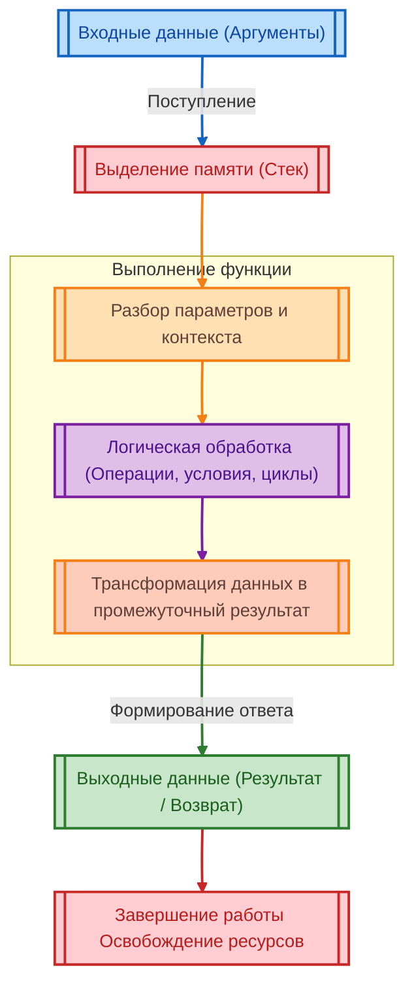

import ExternalPlayEmbed from '@site/src/components/ExternalPlayEmbed';


# Внутреннее устройство функций

<div class="article-tags">
  <span class="tag tag-required">ОБЯЗАТЕЛЬНО</span>
  <span class="tag tag-beginner">ДЛЯ НОВИЧКОВ</span>
</div>

<span class="complexity-badge">Разработчику</span>
<span class="complexity-badge">Архитектору</span>
<span class="complexity-badge">Инженеру</span>

---

## Как работают функции

Функция — это один из фундаментальных строительных блоков программирования. Она представляет собой именованный фрагмент кода, предназначенный для выполнения конкретной задачи. Функция принимает входные данные, обрабатывает их по заданному алгоритму и возвращает результат. Эта модель повторяется во всех языках программирования, независимо от их синтаксиса или уровня абстракции. Понимание того, как функции работают внутри, позволяет писать читаемый, предсказуемый и легко поддерживаемый код.

> **См. также в разделе [«Код»](/encyclopedia/4-code-dev/4-02-chto-takoe-kod-i-kak-on-rabotaet/intro):** синтаксис, виды функций и таблица по языкам — [Функции](/encyclopedia/4-code-dev/4-02-chto-takoe-kod-i-kak-on-rabotaet/4); ключевые слова `def`, `return`, `function` — [Ключевые слова § Функции и методы](/encyclopedia/4-code-dev/4-02-chto-takoe-kod-i-kak-on-rabotaet/3#функции-и-методы); имена, аргументы и [область видимости](/encyclopedia/4-code-dev/4-02-chto-takoe-kod-i-kak-on-rabotaet/1#область-видимости) в обзоре кода — [Что такое код](/encyclopedia/4-code-dev/4-02-chto-takoe-kod-i-kak-on-rabotaet/1). Здесь — **что происходит при вызове**: стек, `return`, фреймы.

<ExternalPlayEmbed example="code-dev/function-simulator" title="Симулятор функций" minHeight={420} />

---

### Функция как механизм

Представьте себе автомат по продаже напитков. Вы вставляете монету, нажимаете кнопку, и через несколько секунд получаете бутылку воды. Автомат не знает, кто вы, откуда пришли или зачем вам вода. Он просто выполняет одну задачу: принимает оплату, проверяет её корректность, активирует механизм выдачи и отдаёт товар. Всё происходит по заранее заданному правилу.

Функция в программировании устроена аналогично. Она не помнит, кто её вызвал, и не хранит информацию о прошлых вызовах (если специально не запрограммировано иное). При каждом новом обращении она начинает работу с чистого листа, используя только те данные, которые ей передали в этот момент. Это делает функцию надёжной, предсказуемой и легко тестируемой.

У каждой функции есть три важнейших этапа:
- вход;
- обработка;
- выход.




---

### Вход — аргументы

Аргументы — это данные, которые передаются в функцию при её вызове. Они играют роль "входных параметров" и определяют, с чем именно функция будет работать. Аргументы могут быть любого типа: числа, строки, списки, объекты, другие функции — всё зависит от возможностей языка и задачи.

Каждая функция имеет **сигнатуру** — описание того, сколько аргументов она принимает и какого они типа (подробнее о параметрах и перегрузках — в [Функции](/encyclopedia/4-code-dev/4-02-chto-takoe-kod-i-kak-on-rabotaet/4)). Например, функция `addThree` ожидает один числовой аргумент. Если передать ей строку `"пять"`, поведение может оказаться непредсказуемым или привести к ошибке — это зависит от языка и его системы типов.

Важно понимать, что аргументы — это не глобальные переменные, доступные отовсюду. Это локальные копии данных, существующие только внутри функции и уничтожаемые после её завершения. Такой подход обеспечивает **изоляцию**: функция не влияет на внешний мир, кроме как через возвращаемое значение или явные побочные эффекты (например, запись в файл или изменение глобального состояния).

---

### Обработка — тело функции

Тело функции — это последовательность инструкций, которые выполняются при её вызове. Эти инструкции могут включать арифметические операции, логические проверки, циклы, вызовы других функций и многое другое. Всё, что делает программа, в конечном счёте сводится к комбинации таких шагов.

Например, в функции `addThree` тело состоит из одной инструкции: взять значение аргумента `number`, прибавить к нему 3 и подготовить результат к возврату. Даже простейшая операция требует точного описания: компьютер не умеет "догадываться", что вы имели в виду. Каждое действие должно быть явно указано.

В более сложных функциях тело может содержать десятки или сотни строк кода. Однако принцип остаётся тем же: функция получает данные, последовательно применяет к ним преобразования и готовит результат. Хорошая практика — разбивать большие функции на меньшие, каждая из которых решает одну подзадачу. Это улучшает читаемость, упрощает отладку и позволяет повторно использовать части логики.

---

### Выход — возвращаемое значение

Результат работы функции передаётся обратно в вызывающий код через **возвращаемое значение**. Это может быть число, строка, объект или даже другая функция. Некоторые функции ничего не возвращают — в таких случаях говорят, что они возвращают специальное значение, обозначающее "отсутствие результата" (например, `undefined` в JavaScript или `None` в Python).

Оператор `return` указывает, какой именно результат должен быть передан наружу. Как только он выполнен, функция немедленно завершает свою работу, даже если в теле остались невыполненные инструкции. Это позволяет управлять потоком выполнения: например, вернуть ошибку при некорректных входных данных, не продолжая обработку.

Возвращаемое значение становится частью выражения, в котором была вызвана функция. Например, в строке `let result = addThree(5);` вызов `addThree(5)` заменяется на число `8`, которое затем присваивается переменной `result`. Таким образом, функция ведёт себя как "чёрный ящик": вы не обязаны знать, как она устроена внутри, чтобы использовать её результат.

---

### Переиспользуемость

Одна из главных целей функций — избежать дублирования кода. Если одна и та же операция требуется в нескольких местах программы, её выносят в отдельную функцию. Это уменьшает объём кода, снижает вероятность ошибок и упрощает внесение изменений: достаточно поправить логику в одном месте, а не в десяти.

Переиспользуемость особенно ценна при работе в команде или при долгосрочной поддержке проекта. Чётко названная функция, например `calculateTax(income)`, сразу даёт понять, что она делает, без необходимости заглядывать внутрь. Это ускоряет чтение кода и снижает когнитивную нагрузку на разработчика.

---

### Изоляция и область видимости

Функция создаёт собственную **область видимости** — пространство, в котором живут её переменные. Переменные, объявленные внутри функции, недоступны снаружи. Это предотвращает случайное изменение данных из других частей программы и делает поведение функции более предсказуемым.

Например, если внутри функции объявлена переменная `temp`, она существует только до завершения функции. После этого память, выделенная под неё, освобождается. Даже если в другой функции есть переменная с тем же именем, они не пересекаются — каждая живёт в своём контексте.

Такая изоляция лежит в основе **чистых функций** — функций, которые зависят только от своих аргументов и не производят побочных эффектов. Чистые функции всегда возвращают один и тот же результат при одинаковых входных данных, что делает их идеальными для тестирования и параллельного выполнения.

---

### Зависимость от входных данных

Функция — это не статический блок, а динамический механизм. Её результат напрямую зависит от того, какие данные были переданы при вызове. Одна и та же функция может выдавать совершенно разные результаты, если аргументы различаются.

Это свойство делает функции гибкими. Например, функция `formatDate(date)` может принимать любую дату и возвращать её в удобочитаемом виде. Не нужно писать отдельную функцию для каждого дня года — достаточно одной, которая умеет работать с любым значением типа "дата".

Зависимость от входных данных также позволяет строить сложные цепочки вызовов. Результат одной функции может стать аргументом для другой: `sendEmail(formatMessage(getUserData(userId)))`. Такой стиль программирования называется **композицией** (см. [Функции](/encyclopedia/4-code-dev/4-02-chto-takoe-kod-i-kak-on-rabotaet/4)), и он лежит в основе многих современных подходов к разработке.

---

### Вызов функции — управление потоком

```text
АЛГОРИТМ ВЫЗОВ_ФУНКЦИИ(имя, аргументы)
  место_возврата := текущая_строка_после_вызова
  положить_в_стек_вызовов(имя, место_возврата, аргументы)
  выполнить_тело(имя)
  результат := вернуть_значение()
  снять_с_стека_вызовов()
  подставить результат вместо вызова
КОНЕЦ
```

Когда программа встречает вызов функции, она временно приостанавливает текущее выполнение, переходит в тело функции, выполняет все инструкции и возвращается обратно, подставив результат на место вызова. Этот процесс управляется **стеком вызовов** — структурой данных, которая отслеживает, откуда был сделан каждый вызов.

Если функция вызывает другую функцию, которая, в свою очередь, вызывает третью, стек растёт. После завершения каждой функции её запись удаляется из стека, и управление возвращается предыдущему уровню. Это позволяет программе точно знать, куда вернуться после завершения вложенной операции.

Стек вызовов также помогает отслеживать ошибки. Если в функции возникает исключение, система может показать полный путь — цепочку вызовов, приведшую к проблеме. Это упрощает диагностику и исправление ошибок.

---

### Именование и смысл

Хорошее имя функции — это краткое описание её действия. Оно должно быть глаголом или глагольной конструкцией: `calculateTotal`, `validateEmail`, `renderPage`. Такое имя сразу сообщает читателю, что делает функция, без необходимости изучать её код.

Имя также отражает уровень абстракции. Функция высокого уровня может называться `processOrder`, хотя внутри она вызывает десятки других функций: `checkInventory`, `chargePayment`, `sendConfirmation`. Это позволяет мыслить на уровне бизнес-логики, не погружаясь в технические детали.

---

### Функции как строительные блоки

В конечном счёте, вся программа — это сеть взаимодействующих функций. Каждая решает свою маленькую задачу, но вместе они создают сложное поведение. Отображение веб-страницы, обработка платежа, расчёт маршрута — всё это реализуется через цепочки вызовов, где каждая функция вносит свой вклад.

Понимание того, как функции работают на низком уровне — как они принимают данные, как обрабатывают их, как возвращают результат и как управляют потоком выполнения — даёт прочную основу для дальнейшего изучения программирования. Это знание применимо в любом языке, от JavaScript до Rust, и остаётся актуальным независимо от модных технологий или фреймворков.

Функция — это не просто синтаксическая конструкция. Это способ организовать мышление, выразить правило, выделить ответственность и построить систему, которую можно понять, изменить и расширить.

---
