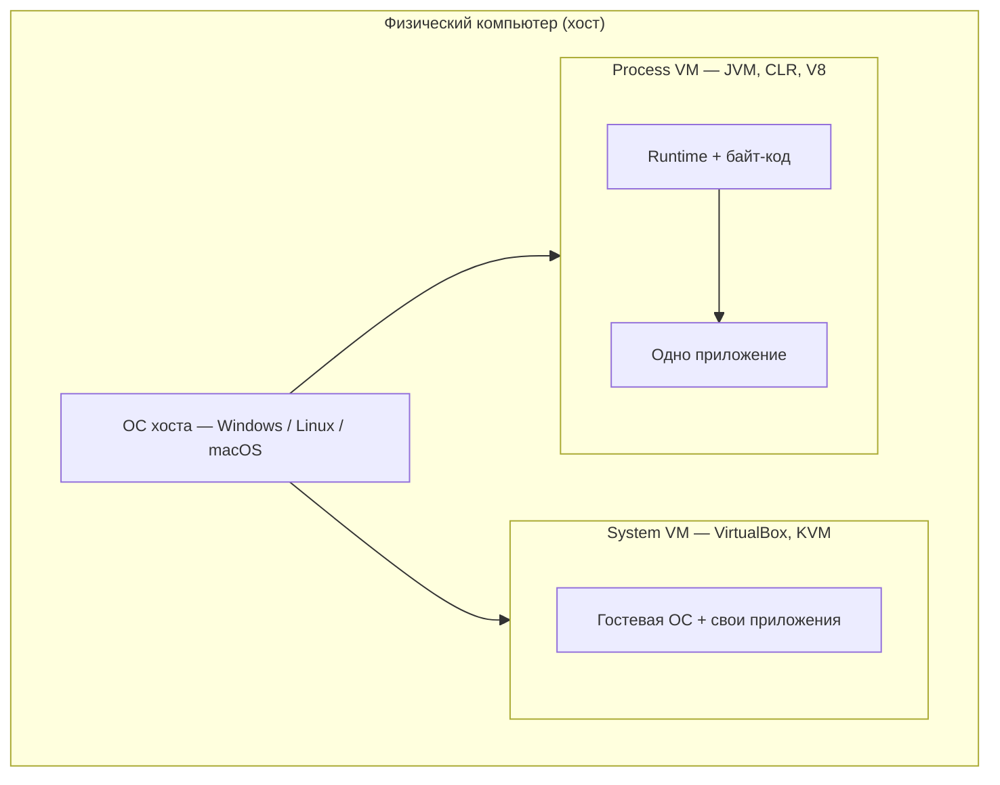

# Виртуальные машины для выполнения кода

<div class="article-tags">
  <span class="tag tag-required">ОБЯЗАТЕЛЬНО</span>
  <span class="tag tag-beginner">ДЛЯ НОВИЧКОВ</span>
</div>

<span class="complexity-badge">Разработчику</span>
<span class="complexity-badge">Архитектору</span>
<span class="complexity-badge">Инженеру</span>

---

## Зачем нужна виртуальная машина при выполнении кода

Слово **"виртуальная машина"** в IT встречается в двух разных смыслах. В [системном администрировании](/encyclopedia/2-system-network/2-02-platformy/2) это гостевая Windows или Linux внутри VirtualBox. В **разработке** — среда, которая исполняет байт-код Java, C# или Python поверх вашей обычной ОС.

Здесь разбирается второй смысл — **Process VM** (виртуальная машина процесса языка). Вы узнаете, что такое **среда выполнения**, как устроены JVM, CLR, PVM и V8, чем они отличаются от гипервизора и куда смотреть за деталями JIT и верификации — в [Исполнении байт-кода](./314.md).

Смысл в том, что программа запускается не напрямую:
- сначала запускается виртуальная машина Process VM;
- эта Process VM выполняет ряд процессов перед запуском;
- ищет файлы с байт-кодом;
- проверяет их на безопасность;
- загружает их в память;
- и выполняет код в своей изолированной "песочнице";
- как только переменная или объект больше не нужны, сборщик мусора удаляет их.

Конечно, для этого требуется немного больше ресурсов, но безопасность является более ценным фактором. Например, в C++ малейшая ошибка приведёт к утечкам памяти или вылетам.


> **См. также:** [жизненный цикл программы](/encyclopedia/4-code-dev/4-03-vypolnenie-koda/1), [компиляторы и интерпретаторы](/encyclopedia/1-basics/1-19-programma/2), [теория кода и байт-код](/encyclopedia/4-code-dev/4-02-chto-takoe-kod-i-kak-on-rabotaet/2).

---

## Два типа виртуальных машин

| | **Process VM** | **System VM** |
|---|----------------|---------------|
| **Задача** | Исполнить программу на языке с байт-кодом | Запустить целую гостевую ОС |
| **Примеры** | JVM, CLR, CPython PVM, V8 | VirtualBox, KVM, Hyper-V |
| **Жизненный цикл** | Рождается с процессом `java` / `dotnet` / `python` | Пока администратор не выключил ВМ |
| **Что внутри** | Один процесс приложения + runtime | Полное ядро гостя, драйверы, свой диск |
| **Материалы** | эта статья, [Исполнение байт-кода виртуальными машинами](./314.md) | [Виртуализация](/encyclopedia/2-system-network/2-02-platformy/2), [Wine и эмуляция](/encyclopedia/2-system-network/2-01-operatsionnaya-sistema/414), [модели развёртывания](/encyclopedia/2-system-network/2-02-platformy/21) |

Process VM **изолирует** прикладной код от железа и деталей ОС: программа работает в "песочнице" runtime, а доступ к файлам и сети идёт через контролируемые API. System VM изолирует **целую операционную систему** — удобно для тестов Windows на Linux, но тяжелее по RAM и времени старта.



Аппаратные расширения VT-x и AMD-V, на которых держится System VM, описаны в [главе про ЭВМ](/encyclopedia/1-basics/1-08-kak-rabotaet-kompyuter/8#apparatnaya-virtualizatsiya).

---

## Среда выполнения

**Среда выполнения** (*runtime environment*) — всё, что нужно программе **после** того, как исходник уже переведён в исполняемую форму.

| Слой | Что делает | Примеры |
|------|------------|---------|
| **Компилятор / front-end** | Исходник → байт-код, IL, `.pyc` | `javac`, Roslyn, компилятор CPython |
| **Process VM** | Загрузка модулей, исполнение opcode, JIT | JVM, CLR, PVM, V8 |
| **Библиотеки runtime** | Строки, I/O, коллекции, HTTP-клиент | `java.base`, BCL, `stdlib` Python |
| **Процесс ОС** | Память, потоки, дескрипторы файлов | То, что видит [память процесса](./313.md) |

★ В узком смысле **runtime** — движок исполнения; в широком — движок **плюс** стандартные библиотеки (JRE, .NET Runtime, Node.js). Определения "программа / библиотека / подпрограмма" — в [Что такое программа?](/encyclopedia/1-basics/1-19-programma/1#среда-выполнения-библиотеки-и-подпрограммы).

Runtime связывает абстракцию языка с реальным миром: выделяет [стек и кучу](./115.md), создаёт [потоки](/encyclopedia/4-code-dev/4-05-asinhronnost/1), переводит "открыть файл" в системный вызов `open()` или `CreateFile()` хостовой ОС.

---

## Как Process VM даёт кроссплатформенность

Исторически под каждую связку **процессор + ОС** собирали отдельный `.exe` или бинарник. Process VM переносит сложность на **платформу языка** — разработчик поставляет один артефакт байт-кода, а вендор runtime выпускает сборки VM под Windows, Linux, macOS, Android.


**Цепочка из четырёх шагов:**

1. Пишете код на Java, C#, Python, JavaScript.
2. Компилятор или интерпретатор создаёт **промежуточный** формат — язык, который понимает только ваша VM.
3. На целевой машине установлен **runtime** нужной версии.
4. Тот же файл `.jar`, `.dll` или кэш `__pycache__` запускается без пересборки под ARM или x86 — пересобирают **runtime**, а не ваш проект.

VM превращает универсальные инструкции в действия CPU **интерпретацией** или **JIT** ([интерпретация, JIT и AOT](./314.md)). На старте часто работает медленный путь; "горячие" методы позже компилируются в нативный код.

<div class="callout callout--info">
  <div class="callout-title">Управляемый и нативный код</div>

  <div class="callout-body">
  **Нативный** (C, Rust, Go с AOT) — машинные инструкции процесса напрямую; памятью чаще управляет программист или runtime без байт-кода.

  **Управляемый** (Java, C#, Python, JS на VM) — исполнение через Process VM, GC, проверки типов. Удобнее и безопаснее, выше базовый расход RAM и время холодного старта.

  Сравнение моделей памяти — [жизненный цикл переменных](./115.md).
</div>
</div>

---

## Популярные Process VM

Ниже — обзор "для карты местности". Пошаговый конвейер JVM, стековая модель opcode и сравнение Lua/Wasm — в [Исполнение байт-кода виртуальными машинами](./314.md).

### JVM (Java Virtual Machine)

Самая зрелая VM в корпоративной разработке. Исполняет байт-код **Java**, **Kotlin**, **Scala**, **Groovy** — все компилируются в `.class` и упаковываются в JAR.

**Сильная сторона** — многоуровневый **JIT** (в HotSpot — компиляторы C1 и C2). JVM считает вызовы методов, помечает "горячие" участки и компилирует их в код вашего процессора. Долгоживущие сервисы по скорости близки к C++; цена — RAM и прогрев при старте.

**Типичный запуск:**

```bash
javac Hello.java          # исходник → Hello.class
java Hello                # JVM загружает класс, верифицирует, исполняет main
```

Один JAR без пересборки работает на Windows, Linux и серверах; на Android роль играет **ART** (свой runtime, совместимый с идеей байт-кода Dalvik/ART). Путь от `.java` до процесса — [Основы Java](/encyclopedia/5-languages/5-03-java/1#put-isxodnika-do-zapuska).

### CLR (Common Language Runtime)

Сердце **.NET**. Компиляторы **C#**, **F#**, **VB.NET** пишут **CIL** (Common Intermediate Language) в сборки `.dll` / `.exe`; CLR выполняет IL с JIT и сборкой мусора.

**Сильная сторона** — **языковая интеграция** — класс на C#, наследник на F#, общие типы и одна куча в процессе. Для enterprise это единая экосистема библиотек NuGet и одна версия runtime на сервере.

**Типичный запуск:**

```bash
dotnet build              # Roslyn → IL в bin/
dotnet run                # CLR + JIT + BCL
```

Есть **Native AOT** и self-contained публикация — машинный код или bundle без отдельной установки SDK на клиенте ([AOT в 314](./314.md)). Обзор платформы — [.NET](/encyclopedia/5-languages/5-04-platforma-dotnet/1).

### PVM (Python Virtual Machine)

Движок **CPython** — референсная реализация Python. Файл `.py` при первом импорте компилируется в байт-код; кэш лежит в `__pycache__/*.pyc`. PVM исполняет opcode **пошагово**, без тяжёлого JIT как у JVM (ускорение даёт **PyPy** с другим runtime).

**Сильная сторона** — простота и скорость разработки. Интерпретация предсказуема, отладка (`dis`, `pdb`) прозрачна. Для CPU-bound задач часто выносят ядро на C/Rust или используют NumPy с нативными ядрами.

**Типичный запуск:**

```bash
python script.py          # compile → PVM → opcode loop
# рядом появится __pycache__/script.cpython-312.pyc
```

Подробнее — [Python — о разделе](/encyclopedia/5-languages/5-02-python/intro), байт-код — [Исполнение байт-кода виртуальными машинами](./314.md).

### V8 (JavaScript и WebAssembly)

Движок Google для **JavaScript** и **Wasm**. Стоит в Chromium (Chrome, Edge), в **Node.js** на серверах, во встраиваемых хостах (Electron и др.).

**Сильная сторона** — ускорение **динамического** языка. Pipeline **Ignition** (быстрый байт-код) + **TurboFan** (агрессивный JIT) превращает JS в код, сопоставимый с компилируемыми языками на горячих путях. Wasm в браузере часто компилируется почти напрямую в машинный код.

**Типичный запуск:**

```bash
node server.js            # V8 в процессе node
# в браузере — тот же V8 (или родственный движок) исполняет <script> и Wasm
```

Связь с веб-платформой — [как работают сайты](/encyclopedia/2-system-network/2-04-kak-rabotayut-sayty-i-veb-sayty/intro); Wasm — [сеть и браузер](/encyclopedia/2-system-network/2-03-set-i-internet/617).

### Сводная таблица

| VM | Языки | Артефакт | JIT | Типичный сценарий |
|----|--------|----------|-----|-------------------|
| JVM | Java, Kotlin, Scala | `.class`, JAR | Да, зрелый | Серверы, Android, big data |
| CLR | C#, F#, VB.NET | CIL в `.dll` | Да (+ AOT опционально) | Enterprise, desktop, cloud .NET |
| PVM | Python (CPython) | `.pyc` | Нет (CPython) | Скрипты, ML-прототипы, автоматизация |
| V8 | JS, Wasm | Внутренний BC + кэш машинного кода | Да, многоуровневый | Браузер, Node.js, edge |

---

## Из чего состоит любая зрелая Process VM

Три подсистемы повторяются почти везде — отличия в деталях реализации.

### Загрузчик модулей (Class Loader)

Находит `.class`, сборки, `.pyc`, проверяет целостность и **верифицирует** байт-код (JVM — строгий верификатор стека; CLR — метаданные и PE). Загружает типы в память, строит иерархию наследования, не даёт подменить системные классы из ненадёжного источника.

### Сборщик мусора (Garbage Collector)

Отслеживает **кучу**: объекты без достижимых ссылок удаляются автоматически. Программист реже пишет `free`, зато возможны паузы **stop-the-world** и рост RAM при удержании ссылок. Алгоритмы и сравнение языков — [сборка мусора](/encyclopedia/4-code-dev/4-15-sborka-musora/intro).

### Исполнительный движок (Execution Engine)

**Интерпретатор** opcode и **JIT** для горячего кода. Именно здесь байт-код становится инструкциями x86/ARM. В JVM на стеке операндов выполняется, например, сложение:

```text
iconst_1
iconst_2
iadd          ; снять два int со стека, положить сумму
```

Полный разбор стековой модели и профилировщика — [314 § Архитектура виртуальной машины](./314.md).

```text
АЛГОРИТМ ЗАПУСК_ПРИЛОЖЕНИЯ_НА_PROCESS_VM
  загрузить_точку_входа(main)     // Class Loader
  верифицировать_байт_код()
  выделить_кучу_и_стеки_потоков()
  пока процесс_жив
    opcode := следующая_инструкция()
    если метод_горячий то выполнить_jit_версию иначе интерпретировать
    при сигнале_gc → сборка_мусора()
  конец пока
КОНЕЦ
```

---

## Песочница и безопасность

Process VM ограничивает, **что** байт-код может сделать на хосте: прямой доступ к произвольным адресам памяти или произвольным файлам ОС обычно запрещён. Вместо этого — API runtime (`java.io`, BCL, `os` в Python с оговорками).

| Механизм | Зачем |
|----------|--------|
| Верификация байт-кода | Нет "ломания" стека и подмены типов до исполнения |
| Security Manager / permissions (Java) | Политика доступа к сети и диску |
| AppDomain, sandbox (исторически .NET) | Изоляция сборок в одном процессе |
| Ограничения браузера для JS | Same-origin, CSP, изоляция вкладок |

Полная изоляция как у отдельной гостевой ОС — у **System VM**. Process VM защищает в первую очередь **от ошибок и вредоносного байт-кода приложения**, а не от компрометации всего сервера (для этого — контейнеры, ВМ, [основы ИБ](/encyclopedia/2-system-network/2-08-osnovy-informatsionnoy-bezopasnosti/intro)).

---

## Плюсы, минусы и когда что выбирать

| Плюс Process VM | Минус Process VM |
|-----------------|------------------|
| Один артефакт на многих ОС | Нужен установленный или встроенный runtime |
| Автоматическая память (GC) | Больше RAM, чем у лёгкого C/C++ |
| Проверки типов и верификация | Холодный старт и прогрев JIT |
| Богатые стандартные библиотеки | Зависимость от версии runtime (Java 8 vs 21, .NET 6 vs 8) |

**Process VM уместна**, когда важны переносимость, скорость разработки, единая платформа в команде (Spring, ASP.NET, Node-сервисы) и допустим overhead runtime.

**Нативная компиляция уместна**, когда критичны минимальный бинарник, предсказуемые паузы, встраивание в прошивку или драйвер — C, Rust, Go без VM ([системное программирование на C++](/encyclopedia/5-languages/5-06-cpp/21)).

Гибриды существуют: **GraalVM Native Image**, **.NET Native AOT**, **PyInstaller** — компромисс между "один байт-код везде" и "один exe без JRE".

---

## Маршрут чтения

<div class="callout callout--tip">
  <div class="callout-title">Порядок материалов</div>

  <div class="callout-body">
  **1.** Эта глава — зачем JVM/CLR/V8, чем Process VM отличается от VirtualBox.

  **2.** [Исполнение байт-кода](./314.md) — интерпретация, JIT, AOT, стек opcode, JVM HotSpot.

  **3.** [Память процесса](./313.md) и [переменные](./115.md) — стек, куча, GC на уровне ОС.

  **4.** Аппаратная виртуализация — [Платформы § Виртуализация](/encyclopedia/2-system-network/2-02-platformy/2), [четыре модели развёртывания](/encyclopedia/2-system-network/2-02-platformy/21).
</div>
</div>
