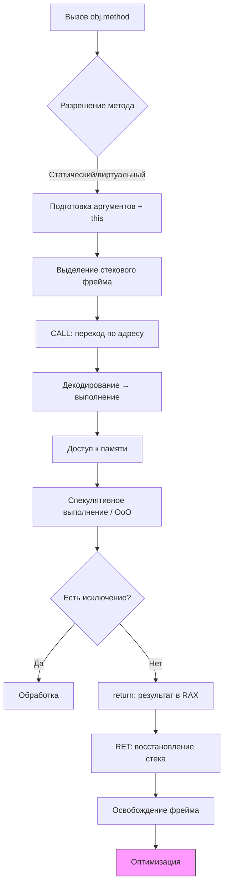

import ExternalPlayEmbed from '@site/src/components/ExternalPlayEmbed';

# Процесс выполнения исходного кода

<div class="article-tags">
  <span class="tag tag-required">ОБЯЗАТЕЛЬНО</span>
  <span class="tag tag-beginner">ДЛЯ НОВИЧКОВ</span>
</div>

<span class="complexity-badge">Разработчику</span>
<span class="complexity-badge">Архитектору</span>
<span class="complexity-badge">Инженеру</span>

---

## Процесс выполнения исходного кода

### Как выполняется код?

Что забавно, это лишь верхушка айсберга. И в этом списке был у нас такой шаг, когда выполняется вызов или обращение к другим элементам. Поэтому, можно погрузиться ещё глубже в то, как работает именно механика выполнения кода.

---

Представим, что мы вызываем метод (пункт 10 в прошлой таблице), обращаемся к объекту. Что происходит?

```text
АЛГОРИТМ ВЫЗОВ_МЕТОДА(объект, имя_метода, аргументы)
  проверить_сигнатуру(имя_метода, аргументы)
  адрес := найти_реализацию(объект, имя_метода)   // VTable при полиморфизме
  создать_фрейм_стека(аргументы, адрес_возврата)
  перейти_к_выполнению(адрес)
  // внутри метода — инструкции процессора / байт-код
  результат := значение_в_регистре_возврата
  уничтожить_фрейм_стека()
  вернуть результат вызывающему коду
КОНЕЦ
```

| Шаг псевдокода | Смысл |
|----------------|--------|
| `создать_фрейм_стека` | Параметры, локальные переменные, куда вернуться после `return` |
| `перейти_к_выполнению` | Аналог машинной команды CALL |
| `уничтожить_фрейм_стека` | Аналог RET; локальные переменные метода "исчезают" |

<ExternalPlayEmbed example="code-dev/method-call-simulator" title="Симулятор вызова методов" minHeight={420} />

| № | Этап | Описание |
|---|------|--------|
| 1 | Вызов метода (синтаксис) | Программист пишет `obj.method(arg)`. На уровне языка это вызов метода на экземпляре. Компилятор или интерпретатор проверяет сигнатуру, типы аргументов, доступность метода (public/private). |
| 2 | Разрешение имени метода | На этапе компиляции или выполнения определяется, какой именно метод вызывается: статический, виртуальный, переопределённый. Для виртуальных методов используется таблица виртуальных функций (VTable) — массив указателей на реализации методов. |
| 3 | Подготовка аргументов | Аргументы (включая `this` — ссылку на объект) помещаются в стек или регистры в соответствии с соглашением о вызове (calling convention), например cdecl, fastcall, thiscall. Объекты передаются по ссылке, примитивы — по значению. |
| 4 | Выделение фрейма стека | Под вызов метода выделяется стековый фрейм (stack frame). В нём хранятся: параметры, локальные переменные, адрес возврата, сохранённые регистры. Указатель стека (RSP на x86-64) сдвигается вниз. |
| 5 | Сохранение контекста | Перед переходом сохраняются регистры, если они используются в вызывающем коде. Это обеспечивает корректность при возврате. В некоторых архитектурах используется регистровое окно (SPARC), в других — только стек. |
| 6 | Переход по адресу (jump/call) | Процессор выполняет команду CALL, которая: помещает адрес возврата в стек, загружает в счётчик команд (RIP) адрес начала метода. Управление передаётся новому участку кода. |
| 7 | Декодирование инструкций | CPU декодирует байт-код (в JVM) или машинный код (в нативных системах) в микрооперации (μops). Современные процессоры используют конвейер (pipeline): fetch → decode → execute → memory → writeback. |
| 8 | Выполнение операций (ALU / FPU) | Арифметико-логическое устройство (ALU) выполняет операции: сложение, сдвиг, сравнение. FPU — операции с плавающей точкой. Результаты временно хранятся в регистрах. |
| 9 | Работа с памятью (load/store) | При доступе к полям объекта процессор: вычисляет физический адрес как base + offset, читает/пишет данные через шину памяти, использует кэш (L1/L2/L3) для ускорения. Промах кэша (cache miss) может стоить сотен тактов. |
| 10 | Контроль зависимостей (Данные hazards) | Процессор анализирует зависимости между инструкциями. Если одна инструкция зависит от результата другой, может быть вставлена задержка (stall) или использовано переименование регистров и исполнение вне порядка (out-of-order execution). |
| 11 | Спекулятивное выполнение | Современные CPU предсказывают ветвления (например, `if (x > 0)`). Если предсказание верно — выигрыш времени. Если нет — результаты отбрасываются (pipeline flush), что связано с потерей производительности. |
| 12 | Обработка исключений | При ошибках (деление на ноль, NullPointerException) генерируется исключение. Управление передаётся обработчику (`try/catch`). На низком уровне — это прерывание (interrupt) или trap, переход к обработчику в ядре или среде выполнения. |
| 13 | Возврат из метода (return) | При `return value`: результат помещается в регистр (например, RAX), фрейм стека освобождается (указатель стека возвращается), выполняется RET — извлекается адрес возврата, и RIP на него указывает. |
| 14 | Восстановление контекста | Восстанавливаются регистры, если они были сохранены. Управление возвращается в вызывающий код. Локальные переменные фрейма становятся недоступными (но память пока не очищена). |
| 15 | Оптимизация выполнения (JIT / AOT) | В средах с JIT (Java, .NET): часто вызываемые методы компилируются в нативный код, применяется профиль-управляемая оптимизация (например, inlining виртуальных вызовов, если тип известен). |
| 16 | Escape Analysis | JIT-компилятор анализирует, "уходит ли" объект за пределы метода. Если нет — объект может быть выделен на стеке, а не в куче, что ускоряет работу и снижает нагрузку на GC. |
| 17 | Thread-local execution | Каждый поток имеет свой стек. Выполнение метода происходит в контексте потока. При многопоточности возможны гонки, требующие синхронизации (блокировки, атомарные операции). |
| 18 | Memory Barriers / Fences | При работе с общими данными между потоками используются барьеры памяти, чтобы гарантировать порядок чтения/записи и видимость изменений (иначе кэши CPU могут держать устаревшие значения). |
| 19 | Сигналы и прерывания | Выполнение может быть прервано внешними событиями: таймер, ввод-вывод, сигнал от ОС. Процессор приостанавливает выполнение, сохраняет состояние, переходит к обработчику прерывания. |
| 20 | Power Management & Throttling | Современные CPU динамически изменяют частоту (Turbo Boost, throttling). Это влияет на время выполнения кода — один и тот же метод может выполняться с разной скоростью в разные моменты. |

Ниже — таблица "сверху вниз", как будто один вызов метода проходит все этапы подряд. На практике шаги 15–16 и 20 работают параллельно с обычным исполнением, а 17–18 актуальны только в многопоточном коде. Но каждый пункт разобран отдельно, чтобы механика вызова не оставалась чёрным ящиком.

---

## Разбор этапов выполнения

Здесь мы "раскручиваем" один вызов `obj.method(arg)` — от строки в редакторе до тактов процессора и обратно. Эта статья продолжает [предыдущую](/encyclopedia/4-code-dev/4-03-vypolnenie-koda/1): там — жизненный цикл объекта, здесь — что происходит **внутри одного вызова метода**. Этапы 1–6 и 13–14 — то, что делает компилятор и CPU при каждом call; 7–12 — как процессор исполняет тело метода; 15–20 — оптимизации, потоки и "окружение" железа.

---

### 1. Вызов метода (синтаксис)

Вы пишете в коде что-то вроде `order.calculateTotal(taxRate)` или `Math.max(a, b)`. На уровне языка это **выражение вызова**: у объекта (или типа) запрашивается операция с конкретным именем и списком аргументов.

Компилятор на этом этапе проверяет:

- **существует ли** метод с таким именем у данного типа;
- **совпадают ли типы** аргументов с параметрами (или можно ли их неявно привести);
- **доступен ли** метод — не вызываете ли вы `private` метод из другого класса;
- **статический или экземплярный** вызов — нужен ли объект слева от точки.

```java
order.calculateTotal(0.2);   // экземплярный вызов
Order.validateId("A-1");     // статический — объект не нужен
```

Ошибки здесь ловятся **до запуска** (в IDE и при компиляции): "cannot find symbol", "method not applicable". Runtime ещё не выделял стек и не прыгал по адресам — это чисто языковой и статический контракт между вашим кодом и определением метода.

Для новичка важно: `obj.method()` — **строго типизированная процедура** с правилами, которые проверяет компилятор.

---

### 2. Разрешение имени метода

Имя `calculateTotal` может соответствовать **нескольким реализациям** — перегрузка (overload) по числу и типам аргументов, переопределение (override) в наследнике, скрытие статического метода в подклассе.

**На этапе компиляции** выбирается перегрузка по статическим типам аргументов:

```java
void print(int x) { }
void print(String s) { }
print(42);      // → print(int)
print("hi");    // → print(String)
```

**На этапе выполнения** для **виртуальных** методов выбор идёт по **фактическому типу объекта**:

```java
Animal a = new Dog();
a.speak();  // вызовется Dog.speak(), хотя переменная Animal
```

Механизм — **таблица виртуальных методов (VTable)**: у каждого класса массив указателей на код методов; у экземпляра в заголовке объекта лежит ссылка на таблицу своего класса. Индекс метода известен на этапе компиляции, **адрес кода** — только при вызове.

Статические и `final`/`private` методы (в Java) привязываются **статически** — без VTable. Interface default methods, `virtual` в C++, делегаты в C# — свои правила, но идея та же: компилятор знает сигнатуру, runtime — куда прыгнуть.

Неверное разрешение (вызов не того override) — логическая ошибка; компилятор её не поймает, если типы формально сходятся.

---

### 3. Подготовка аргументов

Перед прыжком в код метода **аргументы должны оказаться там, где их ждёт callee** — в регистрах или в стеке. Это задаёт **calling convention** (соглашение о вызове) — cdecl, stdcall, fastcall, Microsoft x64, System V AMD64 ABI и др.

Типично для x86-64 (System V):

- первые несколько целых аргументов — в регистрах `RDI`, `RSI`, `RDX`, `RCX`, `R8`, `R9`;
- первые вещественные — в `XMM0`–`XMM7`;
- остальное — в стек вызывающего;
- для **метода экземпляра** неявный первый параметр **`this`** — ссылка на объект (обычно `RCX` в Microsoft thiscall / первый регистр в других ABI).

**Примитивы** (`int`, `double`) копируются по значению — в регистр или стек кладётся само число. **Объекты** в Java/C# передаются **по ссылке** — копируется только указатель (8 байт), не весь объект. Изменение полей через параметр видно снаружи; переназначение параметра `order = other` снаружи не меняет исходную переменную.

Компилятор вставляет **приведения типов**, autoboxing (`Integer.valueOf`), распаковку varargs. Всё это — ещё до инструкции CALL: подготовительные mov/push в коде вызывающей функции.

---

### 4. Выделение фрейма стека

У каждого активного вызова метода — свой **stack frame** (кадр стека) — участок стека потока с параметрами, локальными переменными, служебными данными.

Обычно в фрейме:

- **аргументы** (если не все ушли в регистры — home space / spill);
- **адрес возврата** — куда вернуться после `ret`;
- **saved frame pointer** (RBP) — для цепочки фреймов при отладке;
- **локальные переменные** метода;
- иногда **место под spill** регистров.

При входе в метод CPU **сдвигает указатель стека RSP вниз** (стек растёт в сторону младших адресов). Размер фрейма известен компилятору заранее — `sub rsp, N` в прологе функции.

```text
Высокие адреса
┌──────────────────┐
│  caller frame    │
│  return address  │
├──────────────────┤  ← RBP (опционально)
│  local vars      │
│  ...             │
└──────────────────┘  ← RSP
Низкие адреса
```

Локальные переменные `int x`, `Order temp` — слоты в этом фрейме. Объект `temp` ссылается на кучу; **ссылка** лежит в стеке. Когда метод закончится, слот исчезнет — но объект в куче может жить, если на него есть другие ссылки.

Переполнение стека — слишком глубокая рекурсия без базового случая → `StackOverflowError` / stack overflow.

---

### 5. Сохранение контекста

Вызывающий код мог **использовать регистры** для своих временных значений. Вызываемый метод вправе их перезаписать — поэтому часть регистров называ **caller-saved** (вызывающий обязан сохранить, если значение ещё нужно), часть — **callee-saved** (вызываемый сохраняет в прологе и восстанавливает в эпилоге).

На x86-64 callee-saved — `RBX`, `RBP`, `R12`–`R15`. Callee в начале метода делает `push rbx` / `mov [rsp-8], rbx` и в конце восстанавливает.

**Контекст** — не только регистры — это ещё текущий RSP, RIP, флаги CPU, иногда MXCSR для SSE. Сохранение минимально необходимого набора позволяет после `return` продолжить вызывающую функцию так, будто вызова не было (кроме изменённых глобальных данных, кучи и регистра результата).

На архитектуре SPARC исторически использовали **register window** — аппаратно "окно" регистров сдвигается при call. На x86 всё через стек и явные save/restore — зато проще переносимость модели в голове.

---

### 6. Переход по адресу (jump/call)

Ключевой момент: **управление передаётся другому участку кода**. Инструкция **CALL** (или call через указатель):

1. кладёт в стек **адрес следующей инструкции после CALL** (return address);
2. загружает в **RIP** (instruction pointer) адрес входа в метод;
3. процессор начинает fetch-decode-execute уже оттуда.

Для виртуального вызова перед CALL компилятор/JIT генерирует:

```text
mov rax, [obj]           ; указатель на класс / VTable
mov rax, [rax + offset]  ; адрес конкретного метода
call rax
```

Обычный прямой CALL — адрес известен при линковке. Косвенный — через регистр или память.

**JMP** без сохранения return address — для `goto`, tail call optimization, финальных переходов в switch. **CALL** vs **JMP** — call обязан вернуться, jump — нет.

С этого этапа "ваш" метод — это просто поток машинных инструкций по адресу в памяти текстового сегмента (или JIT-сгенерированного буфера).

---

### 7. Декодирование инструкций

Процессор не выполняет "метод целиком" — он **загружает инструкции по одной (или пачками)** из кэша инструкций. Цикл:

1. **Fetch** — прочитать байты по RIP;
2. **Decode** — понять, что это за инструкция (mov, add, call, jne…);
3. **Execute** — выполнить в функциональных блоках;
4. **Memory** — обращение к RAM при load/store;
5. **Writeback** — записать результат в регистр.

В **JVM** на первых проходах байт-код интерпретируется или компилируется C1/C2; "декодирование" — разбор opcodes (`iload`, `invokevirtual`, `iadd`). В **нативном коде** — x86-64, ARM — переменная длина инструкций, префиксы, REX.

Современные CPU разбивают сложные инструкции на **микрооперации (μops)** и скармливают их **конвейеру** из нескольких стадий параллельно. Одна строка C может стать десятками μops после оптимизаций.

Плохая локальность кода (разбросанные по памяти ветки) — больше промахов instruction cache. Компактный hot path — быстрее, хотя вы об этом редко думаете явно.

---

### 8. Выполнение операций (ALU / FPU)

Здесь живёт **смысл метода** в виде вычислений — `total + tax`, `x > 0`, побитовые маски.

- **ALU** (Arithmetic Logic Unit) — целые — сложение, вычитание, AND/OR, сравнение, сдвиги.
- **FPU / SIMD** — float/double, векторные операции (AVX, SSE).

Пример:

```java
return price * (1 + taxRate);
```

↓ примерно:

```text
load price → XMM0
load 1.0, taxRate → XMM1
add, mul
store result → регистр возврата
```

Результаты промежуточных шагов держатся в **физических регистрах** (или rename register file при out-of-order). Флаги CPU (zero, carry, overflow) используются следующими условными переходами.

Деление на ноль, переполнение signed (если не `-fno-strict-overflow`) — могут генерировать **исключения** или undefined behavior в C++. В Java — `ArithmeticException` / wraparound по правилам языка.

---

### 9. Работа с памятью (load/store)

Метод редко ограничивается регистрами — читает **поля объекта**, массивы, static-поля.

```java
this.total = this.total.add(item.price);
```

CPU:

1. `this` уже в регистре или на стеке;
2. **base + offset** → адрес поля `total` в объекте в куче;
3. **load** — прочитать 8 байт (ссылка на BigDecimal) через кэш;
4. вызов `add` — новый под-блок этапов 1–20;
5. **store** — записать новую ссылку в поле.

**Cache miss** L1 → L2 → L3 → RAM может стоить сотни тактов. Последовательный обход массива — cache-friendly; случайные указатели по linked list — miss за miss.

MMU переводит виртуальный адрес в физический; невалидная страница — page fault (ОС подгружает или SIGSEGV). В managed runtime проверки null и bounds вставляются явно или через trap.

---

### 10. Контроль зависимостей (data hazards)

В конвейере **следующая инструкция может стартовать до завершения предыдущей**. Если инструкция B **зависит** от результата A — возникает **data hazard**.

Пример:

```asm
add rax, rbx    ; A
mov rcx, rax    ; B зависит от rax
```

B не может использовать "старый" rax — нужен **stall** (пузырь в конвейере) или **forwarding** (пересылка результата из EX stage в decode следующей).

**Out-of-order execution** (OoO): CPU переупорядочивает **независимые** инструкции, чтобы не простаивать. Зависимые всё равно ждут. **Register renaming** — логические регистры (`rax`) мапятся на больше физических, чтобы снять ложные зависимости через reuse имён.

Для программиста на Java это прозрачно; для lock-free алгоритмов и memory model — важно, что **порядок видимости памяти** не совпадает с порядком инструкций в исходнике (см. этапы 17–18).

---

### 11. Спекулятивное выполнение

При **условном переходе** (`if`, `while`) CPU не ждёт вычисления условия до конца — **branch predictor** угадывает, куда пойдём, и **спекулятивно** выполняет инструкции выбранной ветки.

Угадал — выигрыш: работа сделана заранее. **Не угадал** — **pipeline flush** — спекулятивные результаты отбрасываются, PC переключается, производительность падает.

```java
if (user.isPremium()) {
    applyDiscount();  // «горячая» редкая ветка
} else {
    standardPrice();
}
```

Если реальность часто противоречит предсказанию (50/50, или паттерн меняется) — **много mispredictions**. Профайлеры (perf) показывают `branch-misses`.

**Spectre/Meltdown** — тёмная сторона: спекулятивные чтения оставляли следы в кэше. Для обычной разработки важнее: **предсказуемые ветки и hot path** быстрее, чем хаотичные if в inner loop.

---

### 12. Обработка исключений

`NullPointerException`, деление на ноль, `ArrayIndexOutOfBoundsException` — **нормальный выход из линейного потока инструкций**.

На низком уровне:

- **trap / fault** — CPU передаёт управление обработчику (ОС или runtime);
- в JVM — поиск **exception table** в байт-коде метода: для каждого PC диапазона указано, какой `catch` куда прыгнуть;
- раскрутка стека (**stack unwinding**) — уничтожение фреймов до подходящего `catch`, вызов destructors в C++, `finally` в Java.

```java
try {
    risky();
} catch (IOException e) {
    recover();
}
```

Компилятор генерирует таблицу; при throw runtime ищет handler, **не возвращаясь** обычным `ret` через промежуточные фреймы.

Исключения дороже обычного return — не используйте их для control flow в hot path. В C++ без try в методе может быть zero-cost exceptions до throw. В Java checked exceptions — часть контракта на этапе 1.

---

### 13. Возврат из метода (return)

`return value;` завершает метод:

1. **значение** кладётся в регистр возврата (RAX / RDX для 128-bit, XMM0 для float — по ABI);
2. **эпилог** — восстановление callee-saved регистров, `mov rsp, rbp` / `add rsp, N`;
3. **RET** — снять адрес возврата со стека в RIP;
4. выполнение продолжается в **caller** сразу после CALL.

`void` метод — только шаги 2–3, без загрузки результата.

**Несколько return** в одном методе — компилятор генерирует несколько эпилогов или один общий; семантика одна: один выход, один разрушенный фрейм.

Tail-call optimization: если последняя операция — `return otherMethod(...)`, компилятор может **переиспользовать** фрейм (jump вместо call), чтобы не расти стеком. На JVM не полагайтесь на это для глубокой рекурсии.

---

### 14. Восстановление контекста

Caller снова "хозяин" регистров caller-saved и своего фрейма. Callee-saved уже восстановлены callee. **Локальные переменные завершённого метода** логически недоступны — их слоты на стеке перекрыты следующим использованием RSP.

Память под локалы **не затирается** сразу — там может остаться "мусор", пока кто-то не перезапишет. Отладчик иногда показывает "зомби"-значения; для безопасности криптокод обнуляет стек.

Вызывающий код читает результат из RAX (или игнорирует для void). Следующая инструкция может сразу использовать return value в выражении.

Если метод бросил исключение — обычный return/epilog не выполнялся; unwinding прошёл по другому пути (этап 12).

---

### 15. Оптимизация выполнения (JIT / AOT)

Первые вызовы метода могут идти через **интерпретатор** или **baseline JIT**. Счётчик "горячести" растёт — runtime **перекомпилирует** метод в оптимизированный машинный код.

Типичные оптимизации:

- **inlining** — тело `smallHelper()` вставляется в caller, исчезает call overhead;
- **devirtualization** — если тип `Dog` доказан, `animal.speak()` → прямой call `Dog.speak`;
- **loop optimizations** — unrolling, vectorization;
- **profile-guided** — "ветка A в 99% случаев" → layout кода под predictor.

**AOT** (Native Image, ahead-of-time Rust/Go) делает часть работы при сборке — быстрый старт, меньше пиковой адаптации, но нет "узнал профиль в проде — перегенерил".

Вы пишете читаемый метод; JVM/CLR/V8 решают, **какой машинный код** реально бежит после 10 000 вызовов. Deoptimization — откат к интерпретации, если предположения JIT (тип, nullness) нарушились.

---

### 16. Escape Analysis

JIT спрашивает — **"объект, созданный в этом методе, убегает наружу?"** — остаётся ли ссылка на него после return (return obj, запись в поле, передача в глобальную коллекцию).

Если **не убегает** — аллокацию можно:

- **разместить на стеке** (stack allocation) вместо `new` в куче;
- **убрать синхронизацию** на "локальном" объекте;
- **scalar replacement** — разложить объект на отдельные локальные переменные без heap вообще.

```java
Point p = new Point(x, y);
return p.x + p.y;  // если JIT видит только чтение полей — Point может не попасть в heap
```

Это прозрачная оптимизация: семантика как у `new`, но меньше GC. Полагаться в API на "обязательно в куче" нельзя. Для perf-критичного кода иногда используют примитивы и value types (records, struct) явно.

Связь с [статьёй про жизненный цикл](/encyclopedia/4-code-dev/4-03-vypolnenie-koda/1): этап 6 там (куча) может **не произойти** благодаря escape analysis здесь.

---

### 17. Thread-local execution

У **каждого потока** — свой стек, свой RSP, свой набор активных фреймов. Один и тот же метод `calculate()` в двух потоках — **два независимых стека**, два набора локальных переменных.

```java
new Thread(() -> service.process(order1)).start();
new Thread(() -> service.process(order2)).start();
```

`process` выполняется параллельно; локальные `temp` не пересекаются. Общие **static** поля и **поля одного объекта** — общая память → нужны `synchronized`, `lock`, concurrent структуры.

Модель памяти Java: без happens-before гонки не дают гарантий видимости. Два потока вызывают `counter++` без sync — data race, результат случаен.

Вызов метода **не делает** код потокобезопасным автоматически — только изоляция стека per-thread. Всё в куче по-прежнему общее.

---

### 18. Memory Barriers / Fences

CPU и компилятор **переупорядочивают** load/store для скорости. В одном потоке с семантикой as-if serial — ок. Между потоками без барьеров — другой поток может **не увидеть** вашу запись или увидеть в "странном" порядке.

**Memory barrier / fence** — инструкция или API (`volatile`, `AtomicInteger.lazySet` vs `set`, `Interlocked*` в C#, `std::atomic` в C++), которая ограничивает переупорядочивание и **flush/invalidate** кэш-линии.

```java
volatile boolean ready;
void writer() { data = 42; ready = true; }
void reader() { if (ready) use(data); }
```

`volatile` на `ready` даёт happens-before: reader не увидит `ready == true` при `data` ещё 0.

Барьеры дороже обычных load/store — используйте точечно. Lock implicitly включает барьеры при acquire/release. False sharing (этап 14 в статье про объекты) — соседние поля в одной cache line у разных потоков.

---

### 19. Сигналы и прерывания

Выполнение вашего метода **не изолировано от ОС**. Таймер, диск, сеть, `Ctrl+C`, GC safepoint — **прерывание**:

1. CPU после текущей инструкции (или на границе) сохраняет контекст;
2. прыгает в **ISR** (interrupt service routine) ядра или runtime;
3. обработчик выполняется;
4. **iret** — возврат в ваш код, как будто ничего не было (если не было сигнала kill).

**Preemptive multitasking**: планировщик по таймеру ставит поток на паузу — ваш метод "заморожен" посередине, другой поток работает на том же ядре.

**Safepoint** в JVM — места, где GC может остановить все потоки для mark phase. Компилятор расставляет poll points; долгий цикл без call/backward branch может **задержать** GC.

Для real-time кода прерывания — источник jitter: метод "обычно 1 ms", иногда 50 ms из-за OS noise. Измеряйте percentiles, не только среднее.

---

### 20. Power Management & Throttling

Одно и то же тело метода **бежит с разной скоростью** в разное время:

- **Turbo Boost** — кратковременное повышение частоты при нагрузке на ядро;
- **thermal throttling** — перегрев → снижение GHz;
- **DVFS** — энергосбережение на ноутбуке от батареи;
- **hypervisor** — соседняя VM отъела CPU, ваш метод медленнее.

Wall-clock время ≠ число инструкций. Бенчмарк "прогнал раз в dev" на холодном ноуте не повторит прод на сервере под 100% load.

**Pinned threads**, affinity, выключение turbo для бенчмарков — инженерные приёмы. В облаке — noisy neighbor непредсказуем.

Итог цепочки 1–20: вы написали `obj.method(arg)` — за этим стоят разрешение имени, ABI, CALL, μops в конвейере, кэши, JIT, потоки, барьеры, прерывания и частота CPU. **Понимание вызова** помогает читать stack trace, профайлы, странные баги "только под нагрузкой" и проектировать API так, чтобы hot path оставался коротким и предсказуемым.

---

### Схема выполнения

Схематично:



---
