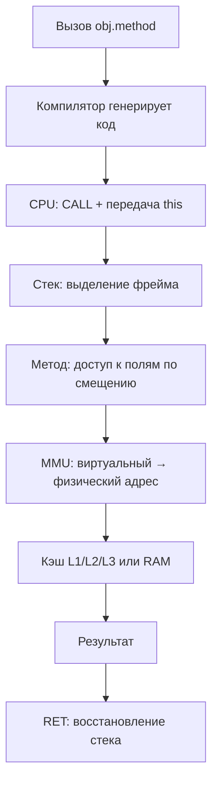
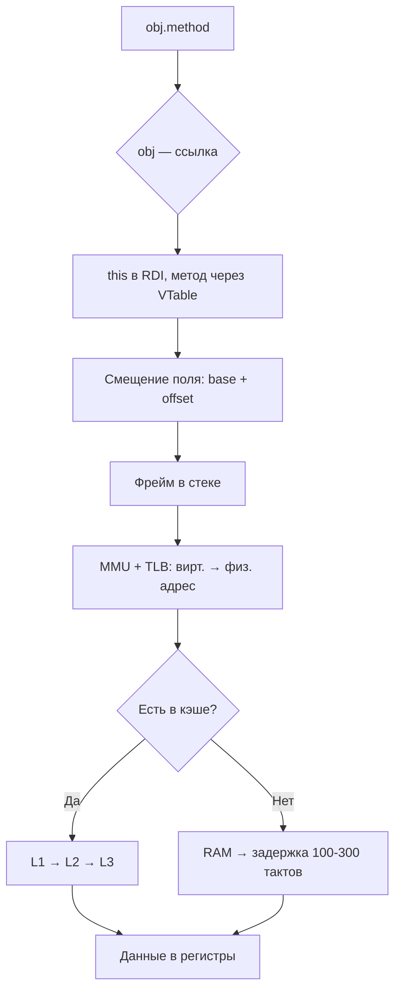
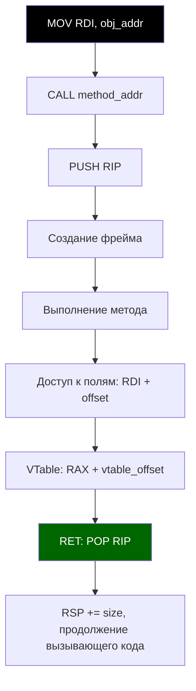

import ExternalPlayEmbed from '@site/src/components/ExternalPlayEmbed';


# Архитектура современных процессоров

<div class="article-tags">
  <span class="tag tag-required">ОБЯЗАТЕЛЬНО</span>
  <span class="tag tag-beginner">ДЛЯ НОВИЧКОВ</span>
</div>

<span class="complexity-badge">Разработчику</span>
<span class="complexity-badge">Архитектору</span>
<span class="complexity-badge">Инженеру</span>

---

## Архитектура современных процессоров

### Основы системного программирования

Если вы подзабыли, что такое процессор, память, диск — перечитайте, ведь сейчас мы погрузимся ещё ниже. Что нужно знать ещё о железе?

К слову, это уже называется **системное программирование**. Собственно, за всю такую работу и отвечает операционная система, со всеми своими службами, утилитами, менеджерами и драйверами. Но тем не менее, это знать тоже нужно.

Ниже — словарь ключевых терминов, разложенный **от общей картины к деталям**: сначала иерархия памяти и адресация, затем стек и куча, потом процессор, инструкции, ООП на железе и потоки. В конце — сводные схемы, связывающие всё в один путь от `obj.method()` до `RET`.

**Оглавление раздела:**

| Блок | О чём |
|------|--------|
| [Иерархия памяти](#иерархия-памяти) | Регистры, кэши, RAM, диск; L1/L2/L3 |
| [Адреса и трансляция](#адреса-и-трансляция) | Виртуальная/физическая память, MMU, TLB, смещения |
| [Стек и куча](#стек-и-куча) | LIFO, heap, ссылки vs указатели |
| [Стек вызовов](#стек-вызовов) | Call stack, frame, RSP/ESP, RBP/EBP |
| [Процессор: такты и регистры](#процессор-такты-и-регистры) | Clock, frequency, RIP, регистровые окна |
| [Машинные инструкции](#машинные-инструкции) | MOV, CALL, RET, JMP, PUSH/POP и др. |
| [Внутренняя работа CPU](#внутренняя-работа-cpu) | Микрооперации, адрес возврата |
| [ООП на уровне железа](#ооп-на-уровне-железа) | VTable, this, инициализация |
| [Потоки и контекст](#потоки-и-контекст) | Thread, execution context, context switch |
| [Схемы выполнения](#схема-выполнения) | Сквозной путь от вызова до возврата |

<ExternalPlayEmbed example="code-dev/processor-execution-play" title="Выполнение на процессоре" minHeight={480} />

---

### Иерархия памяти

Начнём с памяти. Память — **иерархия**, а не плоское пространство. Доступ к данным идёт по иерархии:

```
Регистры CPU →
	L1 кэш (3-4 такта) →
		L2 →
			L3 →
				RAM (100-300 тактов) →
					SSD/HDD (миллионы тактов).
```

И эти такты как раз и образуют собой работу процессора, скорость которого измеряется частотой.

**Кэши процессора** — быстрая память внутри CPU, которая хранит копии часто используемых данных и инструкций:

- **L1** — самый быстрый (~3 такта), разделён на данные и instruction;
- **L2** — медленнее (~10 тактов), общий для ядра;
- **L3** — ещё медленнее (~40 тактов), общий для всех ядер.

Если будет **промах кэша** (cache miss), то потеряем такты.

Выполнение, кстати, производится не только центральным процессором — также может выполнять код и **GPU** (графический процессор), **TPU/NPU** (для ИИ), **DMA** (прямой доступ к памяти без CPU). Но в это пока не погружаемся.

Каждый язык и архитектура имеют **модель памяти**, которая определяет, что значит «память видна» между потоками, можно ли переупорядочивать операции, как работает атомарность, волатильность, синхронизация. Если нарушить модель — будут гонки, глюки и неопределённое поведение. Поэтому и существует совместимость, и иногда что-то работает с другим языком или на другой архитектуре, но не так, как ожидается.

---

### Адреса и трансляция

Память поделена на ячейки: она представляет собой **линейную последовательность байтов**, каждый из которых имеет уникальный **адрес** (номер). Адрес — это смещение от начала памяти.

| Термин | Суть |
|--------|------|
| **Базовый адрес** | Начальный адрес области памяти (объекта, массива или сегмента). Все остальные адреса вычисляются относительно него. |
| **Смещение (Offset)** | Разница между базовым адресом структуры (например, объекта) и адресом конкретного поля. Если объект начинается по адресу `0x1000`, а поле `value` — восьмой байт, то смещение = 8. Доступ: `*(obj_addr + 8)`. |
| **Физический адрес** | Реальный адрес в оперативной памяти, по которому данные хранятся на физической микросхеме. |
| **Виртуальный адрес** | Адрес, который использует программа. MMU преобразует его в физический. |

**MMU** (Memory Management Unit) — аппаратный компонент CPU, который отвечает за преобразование виртуальных адресов в физические. Он использует таблицы страниц, поддерживает виртуальную память, защиту доступа, кэширование TLB и позволяет каждому процессу иметь изолированное адресное пространство.

**TLB** (Translation Lookaside Buffer) — кэш MMU, который хранит соответствия виртуальных и физических адресов.

**Ссылки** — указатели на адреса в памяти. Когда вы пишете `obj.method()`, на низком уровне `obj` — это указатель (тот самый адрес в куче), `method()` — вызов по смещению в VTable, а `this` — неявный первый аргумент (передаётся как this-указатель).

**Ссылка (Reference)** — абстракция указателя в высокоуровневых языках, хранящая адрес объекта в памяти. Она не позволяет прямых арифметических операций (в отличие от указателей в C++, именно поэтому ссылка это уже не указатель).

---

### Стек и куча

Программа делит память на регионы с разным назначением и скоростью доступа.

#### Стек

**Стек** — сегмент памяти по принципу **LIFO** (*Last In, First Out* — последним пришёл, первым ушёл). В нём хранят локальные переменные, параметры функций, адреса возврата и сохранённые регистры.

```text
АЛГОРИТМ СТЕК (операции)
  ПОЛОЖИТЬ_НА_СТЕК(значение)    // push — указатель стека сдвигается
  СНЯТЬ_СО_СТЕКА() → значение   // pop
КОНЕЦ

АЛГОРИТМ ВЫЗОВ_ФУНКЦИИ через стек
  ПОЛОЖИТЬ_НА_СТЕК(адрес_возврата)
  ПОЛОЖИТЬ_НА_СТЕК(аргументы...)
  ПЕРЕЙТИ_К(тело_функции)
  // после return:
  СНЯТЬ_СО_СТЕКА() → адрес_возврата
  ПЕРЕЙТИ_К(адрес_возврата)
КОНЕЦ
```

В стеке выделяется фиксированный размер на поток, доступ к нему очень быстрый (через операции **push** — толкать, **pop** — выталкивать). В нём используется автоматическое управление (он освобождается при выходе из функции). Стек расположен в верхней части виртуального адресного пространства (растёт вниз).

#### Куча

**Куча** — область памяти для динамического выделения объектов (те самые `new`, `malloc`). Управление кучей выполняется либо вручную, либо через сборщик мусора.

Куча обладает менее предсказуемой производительностью (из-за фрагментации), может расти или сжиматься в процессе выполнения. Она располагается ниже стека в адресном пространстве и управляется через менеджер памяти.

При выделении памяти в куче выделяется блок нужного размера. Блоки управляются через списки свободных/занятых областей.

```text
Высокие адреса  ──►  [ Стек ]  растёт вниз ↓
                      ...
                      [ Куча ]  растёт вверх ↑
Низкие адреса
```

---

### Стек вызовов

Стек в контексте функций — отдельная тема: здесь живут **контексты вызовов**.

| Термин | Описание |
|--------|----------|
| **Стек вызовов (Call Stack)** | Специализированное использование стека в памяти для отслеживания активных функций (методов). Тот же стек, просто используется для хранения контекста вызовов. |
| **Фрейм стека (Stack Frame)** | Блок данных в стеке, выделенный для одного вызова функции. Содержит параметры, локальные переменные, адрес возврата, сохранённые регистры, указатель на предыдущий фрейм. При выходе из функции фрейм удаляется — это и будет команда pop. |
| **Указатель стека (Stack Pointer)** | Критически важный инструмент управления стеком. При push он уменьшается, при pop — увеличивается (при этом стек растёт вниз). |
| **ESP** (x86, 32-bit) | Указывает на верх стека (последний занесённый элемент). |
| **RSP** (x86-64) | 64-битная версия ESP. |
| **Указатель фрейма (Frame Pointer, EBP/RBP)** | Указывает на начало текущего фрейма, используется для доступа к параметрам и локальным переменным по фиксированному смещению. |

Обращение к стеку происходит через **RSP/ESP**, управляемое процессором.

Стек бывает **стеком вызовов** (основной, используется всеми функциями) и **стеком потока** (каждый поток имеет свой стек).

---

### Процессор: такты и регистры

#### Время процессора

**Такт** (Clock Cycle) — один импульс тактового генератора, базовая единица времени для CPU. Да, время у него измеряется иначе, и все операции синхронизированы тактом. Как сердцебиение — и поэтому процессор является сердцем, тем самым моторчиком.

**Частота** (Clock Frequency) определяет количество тактов в секунду (Гц), например, 3.5 GHz = 3.5 миллиарда тактов/сек. Да, у процессоров такая скорость. Это определяет максимальную скорость выполнения инструкций (но не всегда, из-за конвейера, простоя и т.д.).

#### Регистры

**Регистры** — очень быстрая память внутри CPU, используемая для хранения данных, адресов, состояния. К примеру:

| Регистр | Назначение |
|---------|------------|
| **RAX** | Аккумулятор — результаты операций |
| **RIP** | Счётчик команд — адрес следующей инструкции |
| **RSP** | Указатель стека |
| **RDI, RSI** | Аргументы функций (System V AMD64 ABI) |

**Счётчик команд** (Program Counter, **RIP**) — регистр, хранящий адрес следующей инструкции для выполнения. При каждом шаге он увеличивается, а при jmp/call изменяется.

**Регистровые окна** — архитектурный приём (в SPARC): при вызове функции автоматически переключается набор регистров. Это для ускорения вызовов, избегая push/pop в стек. Современные CPU используют **переименование регистров** вместо этого.

---

### Машинные инструкции

**Инструкции** — элементарные команды, понятные процессору (MOV, ADD, CALL, JMP). Они хранятся в памяти как машинный код, в байтах, и декодируются процессором в микрооперации.

**Ассемблерные команды** — самый низкий уровень управления процессором. Они напрямую соответствуют машинному коду, который выполняет процессор.

Компилятор автоматически генерирует эти команды из C++, Java, Rust, .NET. Оптимизатор может менять порядок, удалять, заменять команды.

#### Перемещение данных

| Команда | Назначение |
|---------|------------|
| **MOV** | Копирует данные из источника в приёмник. Просто перемещение — одна из самых частых операций: загрузка значений, параметров, адресов. |
| **LEA** | Load Effective Address — вычисляет адрес, но не обращается к памяти. Используется для арифметики указателей, смещений. |
| **PUSH** / **POP** | Работа со стеком. PUSH кладёт значение на стек, RSP уменьшается; POP забирает значение со стека, RSP увеличивается. Используются при вызовах, сохранении регистров, локальных данных. |

#### Арифметика и сравнение

| Команда | Назначение |
|---------|------------|
| **ADD** / **SUB** | Сложение и вычитание; изменяют флаги (Zero Flag, Carry Flag). Используются в арифметике, инкременте, адресации. |
| **CMP** | Сравнение: вычитает два значения, обновляет флаги, но не сохраняет результат. Нужен перед условными переходами. |
| **TEST** | Побитовое И (для флагов); используется для проверки на ноль. |

#### Управление потоком выполнения

| Команда | Назначение |
|---------|------------|
| **CALL** | Вызов функции или метода. Помещает адрес возврата (следующую инструкцию) в стек (PUSH RIP), затем загружает в счётчик команд (RIP) адрес функции, переходя к телу функции. |
| **RET** | Возврат из функции. Извлекает адрес возврата из стека и загружает его в RIP, после чего продолжает выполнение с того места, откуда была вызвана функция. Автоматический финал любого метода. |
| **JMP** | Безусловный переход — мгновенно переходит на указанный адрес. Используется в циклах, GOTO, оптимизациях. |
| **JE** / **JNE** / **JL** / **JG** | Условные переходы; работают после CMP или арифметики. Реализуют if, while, for. |

#### Побитовые операции и служебные

| Команда | Назначение |
|---------|------------|
| **XOR** / **AND** / **OR** / **NOT** | Побитовые операции; используются в манипуляциях с флагами, хэшах, оптимизациях. |
| **NOP** | No Operation — ничего не делает, 1 такт простоя. Используется для выравнивания, отладки, задержек. |

> **Важное уточнение:** то, что работает на x86-64, не сработает на ARM (там другие инструкции — MOV, BL, LDR, STR и пр.).

```
Интересная задумка — можете поиграться с нейросетями в интерактиве: вы пишете в чат код на каком-либо языке, а нейросеть в ответ будет писать ассемблер. Так вы можете изучать низкий уровень работы команд.
```

---

### Внутренняя работа CPU

**Микрооперации** (Micro-ops, μops) — внутренние команды, на которые CPU разбивает сложные инструкции. Они позволяют выполнять инструкции вне порядка (out-of-order execution) и параллельно.

**Адрес возврата** (Return Address) — адрес в коде, куда нужно вернуться после завершения функции. Сохраняется в стеке при выполнении CALL.

---

### ООП на уровне железа

Объектно-ориентированный код на высоком уровне опирается на несколько низкоуровневых механизмов.

| Термин | Описание |
|--------|----------|
| **VTable** (Virtual Method Table) | Таблица указателей на реализации виртуальных методов для конкретного класса. Каждый объект с виртуальными методами содержит скрытое поле — указатель на VTable. При вызове виртуального метода: `obj->vtable[METHOD_INDEX]()` — динамическое разрешение. |
| **Виртуальный метод** | Метод, поведение которого может быть переопределено в наследнике. Вызов разрешается во время выполнения (dynamic dispatch) через VTable. К примеру, `@Override` в Java (ещё вернёмся). |
| **this** (или self) | Неявный параметр метода, указывающий на текущий экземпляр объекта. На низком уровне — первый аргумент метода (в RDI на x86-64). |
| **Инициализация** | Процесс установки начального состояния объекта или переменной. Включает присвоение значений полям, вызов конструктора, выполнение статических инициализаторов, загрузку класса. На низком уровне — запись байтов в память по нужным смещениям. |

---

### Потоки и контекст

| Термин | Описание |
|--------|----------|
| **Поток (Thread)** | Поток выполнения внутри процесса. Имеет свой стек, свои регистры, счётчики команд, но (!) общую память (кучу) с другими потоками. Позволяет выполнять несколько задач параллельно. |
| **Контекст выполнения (Execution Context)** | Совокупность данных, необходимых для выполнения кода: стек вызовов, регистры, локальные переменные, объект this. У каждого потока свой контекст. |
| **Контекст потока (Thread Context)** | Набор регистров, стека, состояния, сохранённых при переключении потоков. Сохраняется ядром ОС при **переключении контекста** (context switch). |

---

### Схема выполнения

Можно построить обобщённую схему — **сквозной путь** от вызова метода до возврата.

Текстом:

```
[Программа: obj.method()]
		↓
[Компилятор: генерирует вызов, использует VTable]
		↓
[CPU: RSP управляет стеком, RIP — счётчик команд]
		↓
[Вызов: push аргументов, CALL → RIP = адрес метода]
		↓
[Метод: фрейм в стеке, доступ к this, полям по смещению]
		↓
[Память: MMU преобразует виртуальный → физический адрес]
		↓
[Кэш: L1/L2/L3 ускоряют доступ к данным]
		↓
[Возврат: RET, RSP++, RIP = адрес возврата]
```

Схематично — верхний уровень:



Пример выше — верхнеуровневый: показывает сквозной путь от вызова до возврата с акцентом на взаимодействие программного и аппаратного уровней. Ниже — **системный уровень** с иерархией памяти, TLB, смещением, MMU:



Ещё ниже — **уровень инструкций**:



Сложнее, наверное, уже не получится — технически так и работает регистр, стек, вызов и возврат.

---
