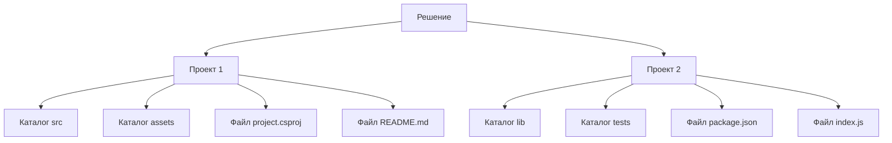

import ExternalPlayEmbed from '@site/src/components/ExternalPlayEmbed';


# Проект программного обеспечения

<div class="article-tags">
  <span class="tag tag-required">ОБЯЗАТЕЛЬНО</span>
  <span class="tag tag-beginner">ДЛЯ НОВИЧКОВ</span>
</div>

<span class="complexity-badge">Разработчику</span>
<span class="complexity-badge">Аналитику</span>
<span class="complexity-badge">Тестировщику</span>  
<span class="complexity-badge">Архитектору</span>
<span class="complexity-badge">Инженеру</span>


---

## Проект и его особенности

Программа редко ограничивается одним файлом кода. Даже простое приложение требует организации множества компонентов: исходных файлов, библиотек, конфигураций, ресурсов и инструкций для сборки. Чтобы управлять этой сложностью, разработчики используют понятие **проекта** — логической и технической единицы, объединяющей всё необходимое для создания работающей программы.

Нет, ну можно конечно написать всё в одном файле, например, создать `hello.py` и запустить его содержимое:

```python
print("Hello")
```

И это полноценная программа, да вот только для чего-то более серьёзного, требуется структура, организация и архитектура - единый проект.


---

### Проект

★ **Проект (Project)** – один программный модуль с конкретной задачей. Например, веб-сервер или мобильное приложение. У проекта есть определённая структура, характерная для фреймворка и языка программирования, но в целом, можно назвать это набором файлов, содержащих исходный код до компиляции, и набор исполняемых файлов после компиляции.

Это структурированная среда, описанная в специальных файлах, понятных как человеку, так и инструментам автоматизации. Он определяет, откуда начинать выполнение программы, какие внешние компоненты подключить, под какие платформы собирать результат и как обрабатывать ресурсы. 

Примерами проектов могут служить веб-сервер, мобильное приложение, консольная утилита или библиотека компонентов. 

Проект, его структура и настройки сохраняются в единый файл проекта, описывающий, что должно быть собрано, какие зависимости есть, какие платформы поддерживаются и т.д. Формат зависит от языка и платформы - .csproj (C#), .xcodeproj (Swift), .iml (Java), .idea, setup.py и другие.

Файл проекта хранит информацию о:

	- входных точках программы;
	- зависимостях;
	- целевых платформах;
	- правилах сборки;
	- путях к ресурсам.

Эти файлы позволяют инструментам автоматически воссоздать окружение разработки и выполнить сборку без ручного вмешательства.

Структура проекта определяется используемым языком программирования и фреймворком. Несмотря на различия между экосистемами, большинство проектов включают:

	- исходные файлы с логикой программы;
	- файлы описания зависимостей;
	- конфигурационные файлы;
	- ресурсы (изображения, звуки, шаблоны);
	- скрипты сборки и развертывания.

<ExternalPlayEmbed example="code-dev/project-structure-explorer" title="Структура проекта" minHeight={480} />

---

### Решение

В сложных системах одна задача часто требует нескольких взаимосвязанных компонентов. Для управления такими системами используется понятие решения. 

Проектов может быть несколько, и они объединяются в решение.



На примере выше, как раз решение объединяет несколько независимых, но связанных проектов. Каждый проект состоит из каталогов (для исходного кода, ресурсов, тестов и т.п.) и файлов (конфигурации, метаданных, описания зависимостей и т.д.). Структура каталогов и состав файлов зависит от языка, фреймворка и инструментов сборки, но общий принцип остаётся неизменным: проект — это организованное хранилище всего необходимого для создания исполняемой программы или библиотеки.

★ **Решение (Solution)** – набор связанных проектов для масштабных систем, к примеру, решение "Интернет-магазин" будет включать в себя и мобильное приложение, и фронтенд, и бэкенд. В Visual Studio, например, решение объединяется в файл .sln, а в IntelliJ IDEA в одном workplace (рабочем месте). Можно сказать, что решение представляет собой контейнер, в котором могут находиться один или несколько проектов. Решение хранит ссылки на проекты и настройки сборки для всех этих проектов.

Решение не содержит исходного кода напрямую, но управляет проектами.

Например, решение "Система онлайн-обучения" может включать:

	- бэкенд-проект (API на C#);
	- фронтенд-проект (React-приложение);
	- мобильное приложение (Kotlin/Swift);
	- служебные утилиты (например, миграции базы данных).

---

### Самостоятельные файлы кода

Порой код может существовать в виде единого файла, без организации в виде проекта. Отличный пример - скрипты.

Отдельные файлы с расширениями .cs, .java, .py, .js представляют собой исходные файлы программы, написанные на конкретном языке программирования. Их тоже можно открыть в IDE, но они будут работать без контекста проекта, к примеру, если есть связь с другими файлами, то могут вывестись ошибки. Для отдельных файлов нет поддержки автосборки, отладки, поэтому открывать их без проекта можно разве что для быстрого просмотра или тестирования фрагментов кода.

Эти файлы имеют расширения, соответствующие языку программирования. Их можно открыть в любой интегрированной среде разработки (IDE) или текстовом редакторе. Однако без контекста проекта такие файлы лишены многих возможностей:
	- автоматической загрузки зависимостей;
	- настройки целевой платформы;
	- конфигурации отладчика;
	- контроля версий сборки.


Если файл ссылается на другие модули или ресурсы, отсутствие проекта может привести к ошибкам. Поэтому автономные файлы чаще всего используются для:
	- быстрого прототипирования;
	- демонстрации отдельных алгоритмов;
	- выполнения разовых задач (обработка данных, автоматизация);
	- обучения основам языка.

Некоторые языки, такие как Python или JavaScript, позволяют запускать такие файлы напрямую через интерпретатор, что делает их удобными для экспериментов и небольших задач.

---

### Папка без проекта

Некоторые языки допускают работу с простыми папками, где структура проекта не строго регламентирована. Такой подход характерен для языков с динамической типизацией или минимальными требованиями к сборке.

Папка с исходным кодом представляет собой обычный каталог, содержащий исходные файлы проекта, но без файла решения или проекта. Часто встречается в проектах на таких языках, где нет строгой структуры проекта (например, Python, Node.js, Go). Многие IDE (например, VS Code) умеют открывать папку как рабочую область и автоматически определять тип проекта по наличию файлов, например package.json - Node.js.

IDE при открытии папки анализируют:

	- наличие файлов зависимостей (requirements.txt, go.mod, package-lock.json);
	- структуру каталогов;
	- расширения файлов;
	- комментарии и метаданные в коде.

Папка без явного файла проекта остаётся полноценной рабочей областью. Разработчик может выполнять запуск, отладку, рефакторинг и тестирование, как если бы проект был описан формально. Такая гибкость упрощает начало работы и снижает порог входа для новичков.

Однако при масштабировании система без явного описания проекта может стать трудноуправляемой. Отсутствие централизованного описания зависимостей или правил сборки усложняет воспроизводимость и передачу проекта другим участникам. Поэтому даже в "свободных" экосистемах со временем появляются файлы вроде Dockerfile, Makefile или build.gradle, которые берут на себя роль описания проекта.

---

## Рабочая папка и рабочая область

При работе над проектом разработчик сначала определяет рабочую директорию. Это точка входа для всех файлов исходного кода, библиотек и конфигураций. Затем создается Workspace в IDE, который ссылается на эту директорию и добавляет к ней необходимые настройки. Такой подход позволяет сохранить гибкость файловой системы и получить мощные возможности управления проектом.

Команды терминала работают непосредственно с рабочей директорией. Скрипты автоматизации используют её для поиска ресурсов и генерации отчетов. Системы контроля версий, такие как Git, отслеживают изменения именно в пределах этой папки. Правильное понимание роли рабочей директории помогает избежать ошибок при развертывании и тестировании.

Workspace в IDE предоставляет удобство навигации. Разработчик видит дерево файлов, может быстро переходить между методами и классами, использовать интеллектуальное завершение кода. Настройки Workspace сохраняют контекст работы, что позволяет возобновить процесс после перезапуска программы без потери информации.

В корпоративной среде Workplace служит платформой для координации усилий команды. Сотрудники обмениваются сообщениями, обсуждают задачи и делятся знаниями. Интеграция технических инструментов с корпоративными платформами создает единую экосистему, где код и коммуникация существуют в гармонии.

---

### Рабочая директория

**Рабочая директория** (Working Directory) — это конкретный путь к файловой системе, который операционная система или запущенная программа считает своей текущей точкой отсчета. Когда скрипт, утилита или приложение обращается к файлу по относительному пути, оно ищет этот файл именно внутри рабочей директории. Если программа не получает явного указания на полный путь, она автоматически начинает поиск в этом месте.

Этот термин используется преимущественно в контексте командных строк, скриптов и программ, работающих с файлами напрямую. При запуске терминала или консоли рабочая директория обычно совпадает с папкой, в которой был открыт этот инструмент. 

Например, если вы запустили PowerShell в папке `C:\Projects\MyApp`, то любая команда, указывающая на файл `config.json` без полного пути, будет искать его именно в `C:\Projects\MyApp`.

Рабочая директория динамична. Программа может изменить её во время выполнения с помощью специальных команд или функций. Это позволяет переключаться между разными уровнями структуры файлов без необходимости каждый раз указывать полный путь. В операционной Windows эта папка отображается как текущая директория в проводнике или в строке состояния терминала. В Linux и macOS аналогичное поведение обеспечивается через команду `pwd` для просмотра текущего пути и `cd` для её изменения.

Использование рабочей директории критически важно для переносимости кода. Скрипты, написанные с использованием относительных путей относительно рабочей директории, могут работать на разных компьютерах при условии сохранения одинаковой структуры папок. Это упрощает развертывание приложений и снижает количество ошибок, связанных с жестко заданными абсолютными путями.

---

### Рабочая область

Рабочая область (Workspace) представляет собой более высокий уровень организации данных и инструментов по сравнению с простой рабочей директорией. Это концепция, используемая в интегрированных средах разработки (IDE), таких как Visual Studio, VS Code, IntelliJ IDEA или Eclipse. 

Workspace объединяет одну или несколько рабочих директорий вместе с настройками проекта, конфигурациями сборки, списками зависимостей и историей изменений.

Когда разработчик открывает Workspace в IDE, система загружает все связанные файлы, проекты и ресурсы в единое пространство управления. Это позволяет выполнять операции, затрагивающие несколько проектов одновременно, например, глобальный поиск по коду, рефакторинг или сборку. 

Workspace хранит информацию о том, какие файлы были открыты ранее, какие вкладки активны, и какие настройки среды используются для конкретного набора задач.

В отличие от рабочей директории, которая является лишь путем к файлам на диске, Workspace содержит метаданные о проекте. Эти данные могут включать ссылки на удаленные репозитории Git, настройки линтеров, параметры компиляции и правила форматирования. Многие IDE позволяют создавать несколько Workspace для одного проекта, чтобы разделять конфигурации для разных целей, например, для разработки и тестирования.

Концепция Workspace также распространяется на управление задачами и документами. В системах типа Jira или Confluence рабочее пространство может означать набор страниц, задач и ресурсов, доступных конкретной команде. Здесь акцент делается на совместной работе и организации контента, а не только на файловых путях.

Для программиста Workspace становится центром принятия решений. Все действия, такие как создание новых файлов, изменение настроек или запуск тестов, выполняются в контексте выбранного пространства. Это обеспечивает согласованность среды и предотвращает конфликты между различными частями проекта.

---

### Различия между Workplace и Workspace

Термин Workplace имеет другое значение в профессиональной среде. Он чаще всего относится к физическому или виртуальному месту работы сотрудника, включая инструменты коммуникации, доступ к корпоративным ресурсам и организацию рабочего процесса. В контексте IT-систем Workplace может обозначать платформу для взаимодействия пользователей, такую как Microsoft Teams или Slack, где сосредоточены чаты, видеозвонки и документы.

В некоторых бизнес-приложениях Workplace используется как синоним пользовательского интерфейса или панели управления, где сотрудник выполняет свои ежедневные задачи. Это понятие шире, чем техническая рабочая область разработчика, так как оно включает человеческий фактор, процессы и организационную структуру.

Разработка ПО использует Workspace как технический термин, связанный с кодом и инструментами создания продукта. Workplace же применяется в сфере управления персоналом, корпоративной культуры и цифровой трансформации бизнеса. Путаница возникает из-за схожести названий, но сферы их применения различаются: одна касается технической реализации, другая — человеческого взаимодействия.

---
