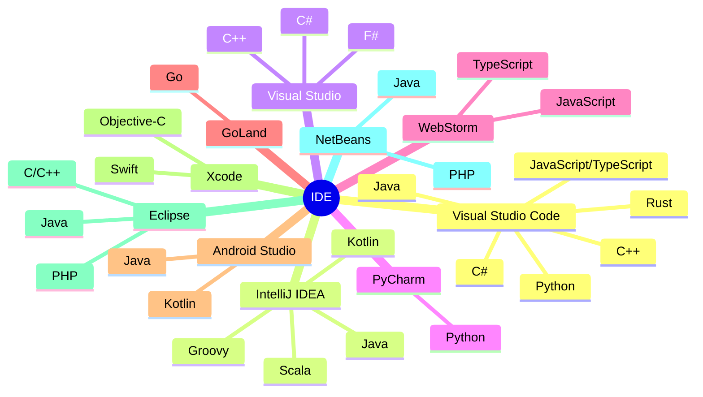
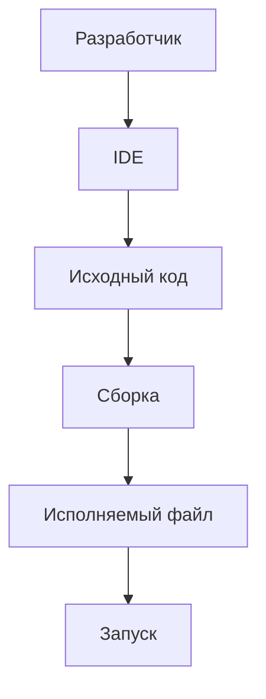
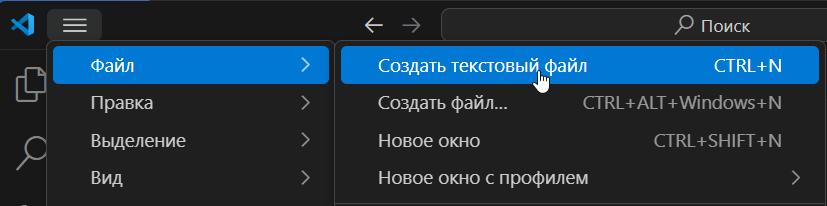
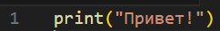

import IDEWorkspaceDemo from '@site/src/components/IDEWorkspaceDemo.jsx';

# Интегрированные среды разработки (IDE)

  ОБЯЗАТЕЛЬНО
  ДЛЯ НОВИЧКОВ

Разработчику
Аналитику
Тестировщику  
Архитектору
Инженеру

---

## Интегрированные среды разработки (IDE)

### Интегрированная среда разработки

★ **Интегрированная среда разработки (IDE, Integrated Разработка Environment)** – программа, где пишут, тестируют и запускают код. Как для писателя Word продвинутый и эффективный, так же IDE для программиста – ошибки подсвечиваются, слова дополняются, а также в комплекте идёт отладчик ошибок. 

Это программное приложение, которое предоставляет единую рабочую зону, где разработчик взаимодействует со всеми этапами жизненного цикла программы без необходимости переключаться между разрозненными утилитами.

Любому новичку следует начать с VS Code – самая простая IDE, с первого взгляда неотличима по сложности от блокнота, да и к тому же автоматически определит язык, и не возьмёт ни копейки. При запуске можно сразу установить себе расширения для нужных языков – к примеру, HTML, CSS, JavaScript, Python, C#, Java.

---

### Обучение работе с IDE

<IDEWorkspaceDemo />

  
Практическое задание

Выполните нижеследующее задание.

---

★ Давайте научимся основам.

Пример работы:

#### Шаг 1

Запускаем VS Code и создаём новый файл (Файл – Создать файл, или Создать текстовый файл):

---

#### Шаг 2

Пишем `print("Привет!")` и видим, что это просто текст:

---

#### Шаг 3

Если установить расширение, которое подсвечивает и распознаёт синтаксис Python, к примеру одноимённое (к слову, устанавливаются они через Marketplace путём простого поиска в самом VS Code):

---

#### Шаг 4

То мы увидим, как синтаксис подсветился, обозначив ключевые слова особым цветом:

---

#### Шаг 5

А если сохранить файл, к примеру в нашем случае как «Hello.py»

---

И нажать на «Запуск и отладка» - то мы увидим в нижней части окна, что программа запустилась и вывела «Привет!» - мы выполнили команду «print», которая вывела текст в кавычках.

---

К слову, можете себе сохранить чит-лист VS Code:
https://cheatsheets.zip/vscode

Так и работает IDE. Человек пишет код и может сразу проверить, работает ли он. Этот принцип работает на всех языках и во всех IDE. Можно писать где-нибудь ещё, в блокноте, на каких-то веб-страницах или Notepad++, а потом вставить код в IDE и сразу увидеть подсветку ошибок.

Говоря об ошибках, если мы вдруг начали писать с ошибками синтаксиса, допустим написав «непонятные» программе слова, то сразу увидим список проблем в нижней части консоли – IDE заботливо подскажет, на какой строчке есть ошибка, и что именно ей «не нравится». Пока ошибки не будут устранены, код не запустится.

---

### Возможности IDE

★ **Подсветка синтаксиса** – это цветовой «гид» по коду, который выполняет:

	- лексический анализ – разбивает код на «токены» - ключевые слова, переменные, строки;
	- парсинг – проверку структуры на наличие элементов (допустим, закрыты ли блоки кода или иные элементы);
	- выполняется «раскраска» в соответствии с темой (обычно есть светлая и тёмная тема);
	
★ **Автодополнение** – следующая функция IDE, которая определяет, внутри какого объекта вы находитесь (допустим, класс User), просматривает стандартные библиотеки, импортированные модули и ваши переменные, ранжирует их и отображает часто используемые варианты первыми. Допустим, мы лишь начнём печатать –«pr» и уже увидим предлагаемые варианты, нам не обязательно писать всё полностью, можем просто выбрать из списка:

★ **Отладчик** – своего рода «детектив» для ошибок, который помогает вам выяснить, почему код не работает, или почему работает не так, как хочется.

---

### Отладка

#### Шаг 1

Точки останова (не остановки, а именно точка останова – breakpoint) – вы отмечаете нужную строку в крайней точке слева:

---

#### Шаг 2

После выбора строки, точка будет отмечена, и выполнение остановится перед указанной строкой. К примеру, у вас в коде 100 строк, и вы знаете, что первые 30 работают как нужно, и ставите точку на 31-й строке, и таким образом, отслеживаете путь выполнение от 31-й до конца.

---

#### Шаг 3

Отладка происходит путём выполнения программы «шаг за шагом» (Step By Step):
	- Step Over – переход к следующей строке;
	- Step Into – заход в функцию (внутрь);
	- Step Out – выход из функции (наружу).

---

#### Шаг 4

Инспекция переменных – если вы объявляли переменные и как-то в логике задавали им значение, то программа это выведет в консоли отладки, показав текущие значения переменных, допустим, что x=5.

---

Также в IDE имеется встроенная интеграция с Git, которая обеспечивает контроль версий, отслеживая изменения, отмечая новые, измененные и удалённые файлы, показывая разницу между версиями и даже позволяя выполнять команды Git в интерфейсе, НО мы ещё не дошли до контроля версий – об этом мы поговорим позже.

Таким образом,
	- вы пишете код → подсветка помогает видеть структуру;
	- набираете user. → автодополнение предлагает user.name;
	- запускаете отладку → отладчик ловит ошибку в user.name;
	- фиксируете исправление в Git.

---

## Виды и особенности IDE

**Visual Studio Code (VS Code)** – Python, JavaScript, TypeScript, C++, Go, Rust, Java и прочие языки – можно установить плагин из маркетплейса и работать с большинством языков. Молниеносный запуск, работа на слабых ПК, поддержка Git.

Официальный сайт - https://code.visualstudio.com/

Чит-лист - https://cheatsheets.zip/vscode

**IntelliJ IDEA (JetBrains)** – Java, Kotlin, Scala, Groovy. Мощная и серьёзная IDE, умный рефакторинг, навигация по коду, поддержка микросервисов и Spring.

Официальный сайт - https://www.jetbrains.com/idea/

Чит-лист - https://cheatsheets.zip/idea

**Visual Studio** (важно – не путать с Visual Studio Code) – мощнейшая IDE для .NET с отличным отладчиком, поддержкой Git, инструментами для разработки на множество вариаций и шаблонов для языков .NET – C#, C++. F#. 

Официальный сайт - https://visualstudio.microsoft.com/ru/

**NetBeans** – Java, PHP, C/C++. Полностью бесплатная, есть неплохой визуальный редактор, но считается устаревшей.

Официальный сайт - https://netbeans.apache.org/front/main/index.html

**PyCharm** – Python. Многие научные инструменты в платной версии, но есть автодополнение, подсказки, интеграция с Docker, неплохой визуальный отладчик.

Официальный сайт - https://www.jetbrains.com/pycharm/

**Eclipse** – Java, C/C++, PHP, и даже Fortran (!). Полная кастомизация, поддержка легаси-проектов, плагины для моделирования, но старый интерфейс.

Официальный сайт - https://eclipseide.org/

**Xcode** – IDE для macOS, для Swift, Objective-C, C++. Визуальный конструктор, профилировщик памяти, инструменты для дополненной реальности.

Официальный сайт - https://developer.apple.com/xcode/

**Android Studio** – эмулятор устройств с настройкой любых разрешений, поддержка Kotlin, Java, C++, но довольно ресурсопотребляющий.

Официальный сайт - https://developer.android.com/studio

Чит-лист - https://cheatsheets.zip/android-studio

**GoLand** – для Go. Автоимпорт пакетов при наборе кода, хороший отладчик, и нет бесплатной версии.

Официальный сайт - https://www.jetbrains.com/go/

**WebStorm** – JavaScript, TypeScript, CSS. Дорогая подписка, но интеллектуальное автодополнение для React/Vue, встроенный REST-клиент для тестирования API, анализ зависимостей.

Официальный сайт - https://www.jetbrains.com/webstorm/

Чит-лист - https://cheatsheets.zip/webstorm

Существует и много других IDE, и вышеуказанный список не является «топом» - дело привычки, вкуса – кому-то удобно работать в NetBeans, а кому-то в IDEA. Для начинающих лучше пробовать скрипты в VS Code, а потом пощупать NetBeans и Visual Studio, PyCharm, WebStorm или GoLand, зависит от языка, на котором фокусируется разработчик, по мере специализации.

Важно. Для комфортной разработки лучше запастись оперативной памятью и значительным местом на диске. Желательно использовать SSD и 32 ГБ ОЗУ. В противном случае, при мощных экспериментах можно сталкиваться с вылетами или зависаниями. А вылететь, не сохранив работу – всегда больно.

  
Практическое задание

Если вы планируете учиться всем языкам по этой книге, можете заранее установить все эти IDE
 (ну, кроме Xcode, если у вас нет под рукой macOS).

---
