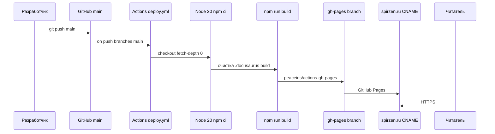

import LibraryConnectionDemo from '@site/src/components/LibraryConnectionDemo.jsx';

# Библиотека

<div class="article-tags">
  <span class="tag tag-required">ОБЯЗАТЕЛЬНО</span>
  <span class="tag tag-beginner">ДЛЯ НОВИЧКОВ</span>
</div>

<span class="complexity-badge">Разработчику</span>
<span class="complexity-badge">Аналитику</span>
<span class="complexity-badge">Тестировщику</span>  
<span class="complexity-badge">Архитектору</span>
<span class="complexity-badge">Инженеру</span>


---

## Библиотека

### Что такое библиотека?

★ **Библиотека** (англ. *library*) — **сборник подпрограмм, функций, классов или объектов**, который другие разработчики подключают при создании программного обеспечения. Это готовый код для типовых задач: математика, сеть, работа с файлами, интерфейс. Автор библиотеки уже реализовал нужное поведение; в своём проекте вы вызываете готовые API, а не пишете всё с нуля.

Термин **«библиотека подпрограмм»** одними из первых ввели Морис Уилкс, Дэвид Уилер и Стэнли Гилл в книге *Preparation of Programs for an Electronic Digital Computer* (1951). Под библиотекой они понимали набор **коротких заранее заготовленных программ** для отдельных, часто встречающихся вычислительных операций — предшественник сегодняшних `sin()`, `sort()` и модулей вроде NumPy.

*Инструментальная библиотека* — набор взаимосвязанных, повторно используемых модулей общего назначения. Один проект обычно собирает **много** таких библиотек; вместе они покрывают разные слои — от строк и дат до графики и протоколов. Подробнее о мотивации повторного использования — в разделе [повторное использование кода](./2.md#повторное-использование-кода).

Если библиотека подключена к проекту, IDE подсвечивает её API и предлагает автодополнение по сигнатурам функций и типов.

Но, чтобы такой набор заработал, библиотеки всегда нужно **подключать** к коду. Для этого нужно установить компоненты, встроить в проект, и в каждом файле с кодом, в самом начале говорить "import" или "using" в зависимости от языка. У каждого языка бывают встроенные возможности и инструменты – стандартные библиотеки. К примеру, это математические операции, ввод/вывод - их отдельно устанавливать не нужно.

<LibraryConnectionDemo />

Таким образом, мы получаем файлы с кодом, ресурсы, и библиотеки, которые собираются в проект (решение). Проект после сборки становится готовой программой.

И писать код с нуля – это словно изобретение бумаги, чернил, печатного станка для написания книги - гораздо эффективнее использовать готовые решения, то есть - библиотеки.

*Стандартные библиотеки* включены в язык, к примеру, math, os в Python, или Array, Date в JavaScript. Это базовые инструменты в мастерской по подготовке кода. Открывая IDE, мы сможем работать с ними без дополнительных загрузок.

Пользовательские библиотеки, или сторонние, это то, что написано другими разработчиками и выложено в открытый доступ. Построение приложения при помощи библиотек напоминает модульную сборку мебели в IKEA - каждый лепит своего франкенштейна. Допустим, мы хотим добавить обработку Excel-файлов? Ищем библиотеку, и подключаем к проекту.

Публичный репозиторий на GitHub сам по себе **не задаёт** право использования: смотрите файл `LICENSE` и тип лицензии (пермиссивная, copyleft). Уровни [повторного использования кода](./2.md#повторное-использование-кода) и юридические ограничения — в [лицензировании ПО](/encyclopedia/7-project/7-07-intellektualnye-prava/114).

---

## Статические и динамические библиотеки

С точки зрения ОС и сборки библиотеки делятся на **статические** и **динамические** (разделяемые, *shared*).

| | Статическая | Динамическая |
|---|-------------|--------------|
| **Когда подключается** | На этапе **компоновки** (линковки) | При **запуске** процесса или по запросу уже работающей программы |
| **Где живёт код** | Копируется (или встраивается выборочно) в исполняемый файл | Отдельный файл: `.a` / `.lib` (архив объектов) или `.dll` / `.so` / `.dylib` |
| **Плюсы** | Один файл, меньше сюрпризов на чужой машине | Одна копия в памяти для многих процессов; исправление бага в `.dll` без пересборки всех приложений |
| **Минусы** | Больше размер `.exe`; при ошибке в библиотеке — пересборка | Нужна совместимая версия на диске; возможен **конфликт версий** (DLL hell) |

**Статическая библиотека** — по сути **архив объектных файлов** (в Unix — `.a`, в Windows — `.lib`). Компоновщик соединяет нужные объектные файлы библиотеки с объектными файлами вашей программы в один исполняемый модуль. Исходники вроде Boost для C++ сначала компилируют в объекты, затем линкуют.

**Динамическая библиотека** — файл с **машинным кодом**, который загрузчик ОС подгружает в память процесса. При разработке достаточно указать компилятору имя функции и путь к библиотеке: исходный текст и даже тело функции в ваш `.exe` могут **не попасть** — в исполняемом файле остаётся только ссылка.

По **роли** для приложения динамические библиотеки часто делят так:

- **Критические** — без них программа не стартует (ядро runtime, драйвер СУБД).
- **Дополнительные и плагины** — расширяют функциональность по желанию (фильтры в аудиоредакторе, модули веб-сервера).
- **Общего пользования** (*shared*, *system*) — одна копия в памяти обслуживает много процессов (`libc`, графические стеки ОС).

Для защиты от атак на предсказуемые адреса в shared-библиотеках применяют **PIC** (position-independent code). Подробная таблица сравнения линковки, форматы файлов и выбор стратегии — в статье [Сборка, компиляция и публикация](./102.md#статическая-линковка).

---

## Библиотеки в компилируемых и интерпретируемых языках

**Компилируемые языки** (C, C++, Fortran, Go, Rust) чаще всего поставляют библиотеки как объектные файлы или готовые `.dll` / `.so`. Стандартные библиотеки C, C++, Pascal, Fortran исторически распространялись именно в виде объектных модулей, линкуемых с программой.

**Интерпретируемые языки** и платформы с VM хранят библиотеки как **исходники** или **байт-код**:

- Python — пакеты с файлами `.py` или скомпилированными `.pyc`;
- Java — `.jar` с байт-кодом для JVM;
- JavaScript в Node — модули в `node_modules`, в браузере — ES-модули или бандл.

Смысл тот же: переиспользуемый код с чётким интерфейсом; отличается только момент, когда он превращается в исполняемую форму — при сборке, при первом `import` или при запуске интерпретатора.

**Библиотека среды выполнения** (*runtime*) — отдельный класс: код, без которого не работает сам язык или платформа (GC, async, reflection). Её отличают от прикладных пакетов вроде `requests` или `lodash`.

---

## Добавление в проект

### Установка пакетов (менеджеры зависимостей)

**Система управления пакетами** (*package manager*, «пакетный менеджер») — набор инструментов для **установки, удаления, настройки и обновления** компонентов ПО. Пакет — это не только код библиотеки, но и **метаданные**: полное имя, номер версии, описание, автор, **контрольная сумма**, связи с другими пакетами (зависимости, конфликты, рекомендации). Менеджер записывает установленное в **системную базу** (реестр пакетов ОС или lock-файл проекта).

Два уровня, которые часто путают:

| Уровень | Примеры | Что ставит |
|---------|---------|------------|
| **ОС и дистрибутив** | APT (Debian/Ubuntu), DNF/Yum (RPM), pacman | Программы и библиотеки **в систему** — `nginx`, `python3`, драйверы |
| **Экосистема языка** | npm, pip, NuGet, Cargo, Composer, Gem | Зависимости **проекта** в `node_modules`, venv, `packages/` |

На уровне Linux дистрибутивы держат **официальные репозитории** (интернет или корпоративное зеркало во внутренней сети); можно подключать сторонние источники. Пакеты лежат в **репозитории** — структурированном хранилище на сервере с индексами версий и подписями. Тот же термин «репозиторий» в Git означает хранилище **истории исходников** — см. [Основы Git](/encyclopedia/4-code-dev/4-13-osnovy-raboty-s-git/1).

Вместо ручного скачивания файлов разработчики используют менеджеры пакетов — NuGet в C#, npm в JavaScript. Инструмент скачивает библиотеку и **транзитивные зависимости** (зависимости зависимостей).

Менеджер пакетов — это инструмент, предназначенный для автоматизации установки, обновления, настройки и удаления библиотек, фреймворков и других зависимостей, от которых зависит проект.

Геймеры могут сразу увидеть аналогию с модификациями - когда хотим установить, к примеру, модификации к видеоигре, мы устанавливаем менеджер модов, через который скачиваем и устанавливаем моды. Здесь так же, но игра - наш проект, а моды - библиотеки и пакеты.

Проект может использовать десятки или сотни внешних библиотек. Менеджер пакетов читает файл описания зависимостей (например, `package.json` в npm, `requirements.txt` в Python, `Cargo.toml` в Rust) и автоматически загружает нужные версии компонентов.

Если две зависимости требуют разные версии одной и той же библиотеки, менеджер пакетов пытается найти совместимую комбинацию или уведомляет о невозможности разрешить конфликт.

Некоторые менеджеры позволяют создавать изолированные среды (виртуальные окружения), чтобы зависимости одного проекта не влияли на другие.

Разработчики могут публиковать свои библиотеки в реестрах (например, npm Registry, PyPI, crates.io), откуда их легко подключить другим.

---

#### Примеры менеджеров пакетов

- **npm / Yarn / pnpm** — для JavaScript и TypeScript
- **pip / Poetry** — для Python
- **NuGet** — для .NET (C#, F#)
- **Cargo** — для Rust
- **Maven / Gradle** — для Java и Kotlin
- **Composer** — для PHP
- **RubyGems (gem)** — для Ruby
- **vcpkg / Conan** — для C++

На уровне ОС те же задачи решают **dpkg** + **APT** (DEB), **rpm** + **DNF/Yum** (RPM) — см. [упаковку .deb](/encyclopedia/8-infra-security/8-04-devops-ci-cd/214) в разделе DevOps.

Менеджеры пакетов работают преимущественно на этапе разработки и сборки. Они загружают исходный код или скомпилированные артефакты на локальную машину разработчика или сервер сборки.

---

### CDN

CDN - загрузка прямо из сети, это распределённая сеть серверов, расположенных в разных географических точках, предназначенная для быстрой и надёжной доставки статического контента конечным пользователям.

Особенно популярно в веб-разработке - вместо того, чтобы хранить библиотеку у себя (ведь, скачивая, мы храним у себя?), можно подключить её по ссылке:

```html
<script src="https://code.jquery.com/jquery-3.6.0.min.js"></script>
```

При таком решении, файлы кэшируются браузером, однако требуют соединения и работоспособности ссылки.

Таким образом,
	- разработчик создаёт каталог (папку) решения или проекта;
	- разработчик пишет код, подключает необходимые библиотеки;
	- сборщик (компилятор/интерпретатор) берёт все файлы и зависимости, проверяет их и создаёт исполняемый файл (или интерпретирует, как в JavaScript);
	- готово - программа работает.

Когда пользователь запрашивает веб-страницу, статические файлы (скрипты, стили, шрифты, изображения) загружаются не с основного сервера приложения, а с ближайшего узла CDN. Это снижает задержку и ускоряет отображение страницы.

Поскольку большая часть трафика обслуживается CDN, основной сервер тратит меньше ресурсов на отдачу повторяющихся файлов.

CDN хранит копии файлов на своих узлах. При повторных запросах файл отдаётся из кэша, без обращения к источнику. Если один узел CDN выходит из строя, запрос автоматически перенаправляется на другой.

Многие популярные библиотеки (например, React, jQuery, Bootstrap, Lodash) доступны через публичные CDN, такие как:

- **jsDelivr**
- **unpkg**
- **cdnjs**
- **Google Hosted Libraries**

Такой подход удобен для прототипирования, демонстраций или простых сайтов, но в промышленной разработке чаще используют сборку с локальными зависимостями (через менеджер пакетов), чтобы контролировать версии, минифицировать код и исключить внешние зависимости от времени выполнения.

---

## Типы библиотек

Библиотеки классифицируют по **назначению**, **уровню абстракции** и **экосистеме языка**. В открытых каталогах (например, [категория «Библиотеки программ» на Википедии](https://ru.wikipedia.org/wiki/%D0%9A%D0%B0%D1%82%D0%B5%D0%B3%D0%BE%D1%80%D0%B8%D1%8F:%D0%91%D0%B8%D0%B1%D0%BB%D0%B8%D0%BE%D1%82%D0%B5%D0%BA%D0%B8_%D0%BF%D1%80%D0%BE%D0%B3%D1%80%D0%B0%D0%BC%D0%BC)) встречаются и тематические группы, и разделы по языкам.

### По назначению (предметная область)

- **Утилитарные** — строки, даты, коллекции, парсинг. Примеры: Lodash (JavaScript), Apache Commons Lang (Java), стандартная библиотека Rust (`std`).
- **Доменные** — узкая область: 3D-графика, TCP/IP, СУБД, комплексные числа, транспортные расчёты. Примеры: Pillow, TensorFlow, `libpq`, BLAS/LAPACK.
- **Интерфейсные** — UI и визуализация: React, Vue, Qt, wxWidgets, библиотеки TUI (текстовый интерфейс в терминале).
- **Графические и мультимедийные** — отрисовка, звук, видео (OpenGL, Vulkan, SDL, FFmpeg-обёртки).
- **Параллельные и распределённые** — потоки, MPI, GPU (OpenMP, CUDA-обёртки).
- **Тестирования** — фреймворки и хелперы для модульных и интеграционных тестов (JUnit, pytest, Google Test).
- **Связующее ПО** (*middleware*) — очереди, RPC, ORM между приложением и инфраструктурой.
- **Системные** — syscall, файловая система, сеть на уровне ОС (`libc`, WinAPI, платформенные HAL).

### По экосистеме языка

Реестры и документация обычно группируют пакеты по стеку: **библиотеки Python** (PyPI), **JavaScript** (npm), **Java** (Maven Central), **C++** (vcpkg, Conan), **C#** (NuGet), **PHP** (Packagist), **Perl** (CPAN). Это удобная навигация, но одна и та же идея (например, HTTP-клиент) может иметь реализации на десятке языков.

### Свободное и проприетарное ПО

Отдельно выделяют **свободные библиотеки** (открытый исходный код, лицензии MIT, Apache, GPL) и коммерческие SDK. Перед подключением в корпоративный продукт проверяют лицензию и политику экспорта криптографии, если библиотека её содержит.

Выбор библиотеки зависит от слоя системы: UI, бизнес-логика, инфраструктура, железо — и от того, **статически** или **динамически** её допустимо встроить в поставку (см. раздел выше и [сборку](./102.md)).

---

## Жизненный цикл библиотеки в проекте

Подключение — только начало. Библиотека требует сопровождения на протяжении всего жизненного цикла проекта.

- **Обновление** — авторы выпускают новые версии с исправлениями, улучшениями и новыми возможностями. Разработчик принимает решение: обновлять сейчас, отложить или остаться на текущей версии.
- **Заморозка версий** — чтобы сборка проекта оставалась воспроизводимой, версии всех зависимостей фиксируются в специальных файлах:
  - `package-lock.json` (npm)
  - `packages.lock.json` (NuGet)
  - `requirements.txt` или `poetry.lock` (Python)
  
  Эти файлы гарантируют, что любой разработчик, клонировавший репозиторий, получит точно такой же набор библиотек.
- **Удаление** — если библиотека больше не используется, её следует удалить. Лишние зависимости увеличивают размер приложения, замедляют сборку и создают потенциальные уязвимости.

---

## Безопасность и надёжность библиотек

Сторонняя библиотека — это чужой код, выполняемый в вашем проекте. Его качество и намерения нельзя принимать на веру.

- **Проверка источника** — предпочтение отдается официальным репозиториям (npmjs.com, nuget.org, PyPI). Полезные индикаторы: количество звёзд на GitHub, частота коммитов, активность issue-трекера, наличие документации.
- **Лицензирование** — каждая библиотека распространяется под определённой лицензией. Некоторые (например, GPL) накладывают ограничения на использование в проприетарных продуктах. Перед подключением важно проверить совместимость лицензии с политикой проекта.
- **Уязвимости** — даже популярные библиотеки могут содержать ошибки, открывающие доступ злоумышленникам. Существуют инструменты для автоматического сканирования:
  - `npm audit`
  - `dotnet list package --vulnerable`
  - `safety check` (Python)
  - Snyk, Dependabot, GitHub Security Alerts

Регулярный аудит зависимостей — обязательная практика в профессиональной разработке.

---

## От библиотеки к программе

Процесс создания программы выглядит так:

1. Разработчик создаёт каталог (папку) проекта.
2. Пишет собственный код и подключает необходимые библиотеки.
3. Сборщик (компилятор, bundler или интерпретатор) объединяет:
   - Исходные файлы проекта
   - Сторонние библиотеки
   - Стандартную библиотеку языка
   - Статические ресурсы (изображения, конфигурации)
4. На выходе получается готовый артефакт: исполняемый файл, веб-пакет или скрипт, который можно запустить.

---

### 1. Создание каталога проекта

Каталог проекта — это изолированное рабочее пространство, где хранятся все файлы, необходимые для разработки, сборки и запуска программы. Хорошо организованная структура папок упрощает навигацию, совместную работу и автоматизацию.

Типичные подкаталоги:
- `src/` — исходный код приложения
- `lib/` или `vendor/` — локально размещённые сторонние библиотеки (редко используется при наличии менеджера пакетов)
- `assets/` или `public/` — статические ресурсы: изображения, шрифты, звуки
- `config/` — файлы конфигурации для разных сред (разработка, тестирование, продакшн)
- `dist/` или `build/` — выходные артефакты после сборки
- `tests/` — автоматизированные тесты

Файлы верхнего уровня часто включают:
- Манифест зависимостей (`package.json`, `Cargo.toml`, `requirements.txt`)
- Файл сборки (`Makefile`, `webpack.config.js`, `CMakeLists.txt`)
- Файл игнорирования (`.gitignore`) — исключает временные и системные файлы из контроля версий

---

### 2. Написание кода и подключение библиотек

Разработчик пишет логику приложения в файлах исходного кода. При этом он не реализует всё с нуля — вместо этого он использует:

- **Стандартную библиотеку языка** — набор базовых функций, предоставляемых самим языком (работа с файлами, строками, сетью и т.д.)
- **Сторонние библиотеки** — компоненты, созданные сообществом или компаниями (например, React для интерфейсов, Express для веб-серверов, NumPy для вычислений)

Подключение библиотек происходит двумя основными способами:
- Через **менеджер пакетов**, который загружает зависимости в локальный кэш или в папку проекта (`node_modules`, `.venv`, `target/`)
- Через **CDN**, если речь идёт о клиентском веб-коде, подключаемом напрямую в HTML (чаще в прототипах или простых сайтах)

Важно фиксировать точные версии зависимостей, чтобы гарантировать воспроизводимость сборки на разных машинах.

---

### 3. Сборка — объединение всех компонентов

Сборщик — это инструмент, который превращает разрозненные файлы в единый работоспособный артефакт. Его роль зависит от типа проекта:

- **Для компилируемых языков (C, C++, Rust)**  
  Компилятор преобразует исходный код в машинные инструкции, а линковщик объединяет объектные файлы и библиотеки в исполняемый файл.

- **Для веб-приложений (JavaScript, TypeScript)**  
  Bundler (например, Webpack, Vite, Rollup) объединяет модули, минифицирует код, встраивает статические ресурсы и генерирует HTML/CSS/JS-файлы, оптимизированные для браузера.

- **Для интерпретируемых языков (Python, Ruby)**  
  Сборка может быть минимальной — достаточно упаковать код и зависимости в архив или контейнер. Однако часто используются инструменты вроде PyInstaller или Docker для создания самодостаточных артефактов.

На этом этапе также могут выполняться:
- Проверка типов
- Линтинг (анализ стиля кода)
- Тестирование
- Генерация документации

---

### 4. Готовый артефакт

Результат сборки — это то, что можно передать пользователю или развернуть на сервере:

- **Исполняемый файл** (`.exe`, `.bin`, ELF-файл) — запускается напрямую операционной системой
- **Веб-пакет** — набор HTML, CSS, JS и медиафайлов, размещаемых на веб-сервере или CDN
- **Скрипт с зависимостями** — например, Python-приложение в виртуальном окружении или Docker-образ
- **Библиотека** — если проект сам предназначен для повторного использования, результатом может быть пакет для публикации в реестре (npm, PyPI и др.)

Этот артефакт должен быть самодостаточным: не зависеть от исходного кода, не требовать установки инструментов разработки и работать в целевой среде без дополнительной настройки.

Для статического веб-пакета (Docusaurus, Create React App) каталог `build/` часто публикует CI. Пример — [«Вселенная IT»](https://github.com/Spirzen/it-knowledge-base):



Подробный разбор workflow — [лабораторный кейс GitHub Pages](/lab/Кейсы/3), CI/CD — [глава 11](/encyclopedia/8-infra-security/8-04-devops-ci-cd/11).

---

## Источники и смежные темы

- [Библиотека (программирование)](https://ru.wikipedia.org/wiki/%D0%91%D0%B8%D0%B1%D0%BB%D0%B8%D0%BE%D1%82%D0%B5%D0%BA%D0%B0_(%D0%BF%D1%80%D0%BE%D0%B3%D1%80%D0%B0%D0%BC%D0%BC%D0%B8%D1%80%D0%BE%D0%B2%D0%B0%D0%BD%D0%B8%D0%B5)) — определение, статические и динамические библиотеки, история термина (Википедия).
- [Категория «Библиотеки программ»](https://ru.wikipedia.org/wiki/%D0%9A%D0%B0%D1%82%D0%B5%D0%B3%D0%BE%D1%80%D0%B8%D1%8F:%D0%91%D0%B8%D0%B1%D0%BB%D0%B8%D0%BE%D1%82%D0%B5%D0%BA%D0%B8_%D0%BF%D1%80%D0%BE%D0%B3%D1%80%D0%B0%D0%BC%D0%BC) — тематическая и языковая классификация примеров.
- [Повторное использование кода](https://ru.wikipedia.org/wiki/%D0%9F%D0%BE%D0%B2%D1%82%D0%BE%D1%80%D0%BD%D0%BE%D0%B5_%D0%B8%D1%81%D0%BF%D0%BE%D0%BB%D1%8C%D0%B7%D0%BE%D0%B2%D0%B0%D0%BD%D0%B8%D0%B5_%D0%BA%D0%BE%D0%B4%D0%B0) — роль библиотек в инженерии ПО.
- В энциклопедии: [модульность и повторное использование](./2.md#повторное-использование-кода), [линковка и сборка](./102.md#статическая-линковка), [фреймворки](./11.md), [публикация своей библиотеки](/encyclopedia/4-code-dev/4-14-razrabotka-i-otladka/113).

---
