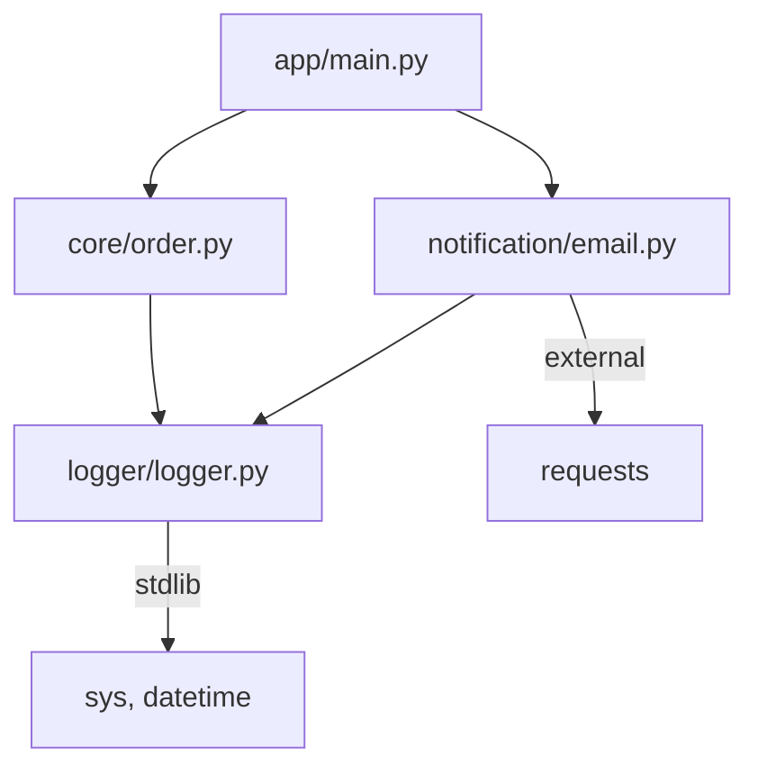
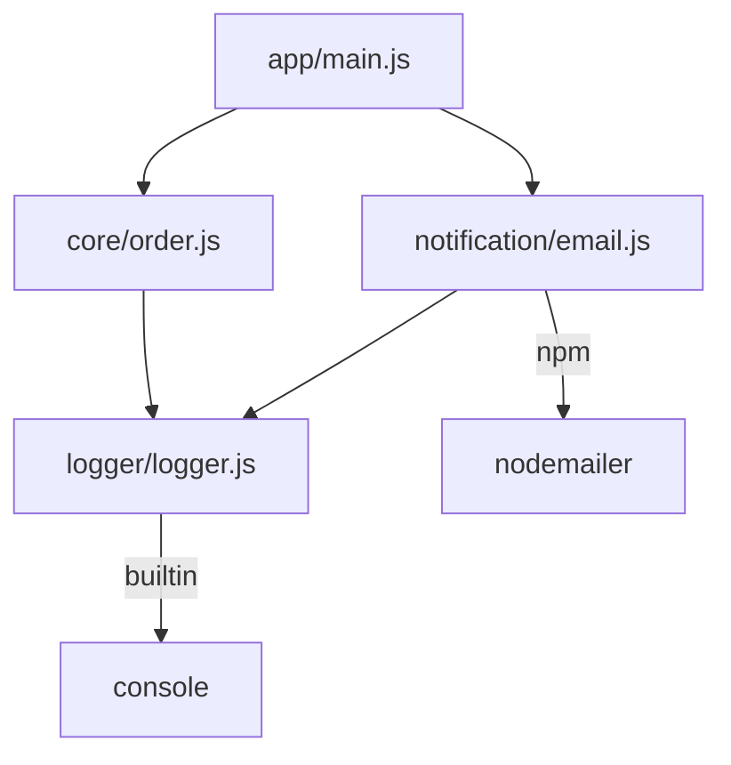
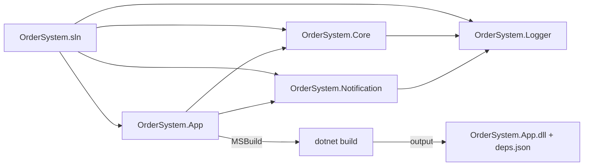
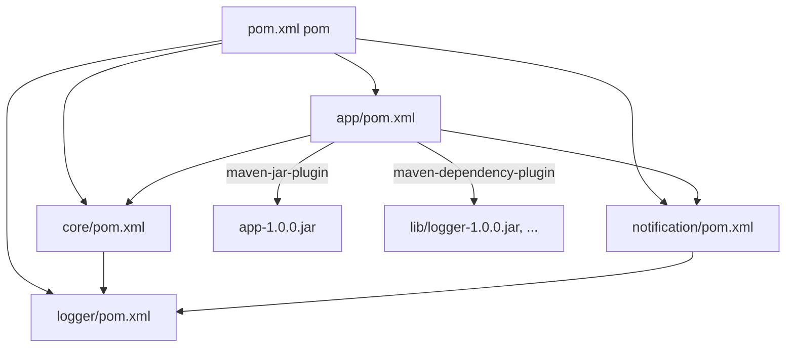
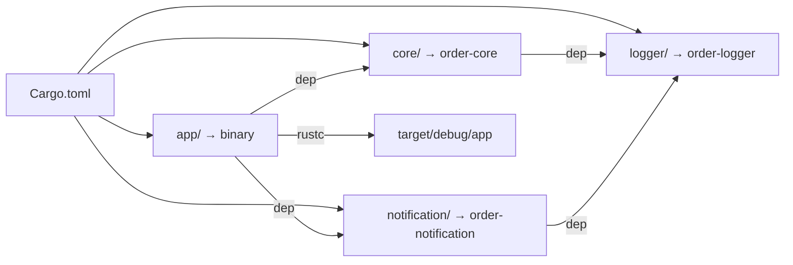
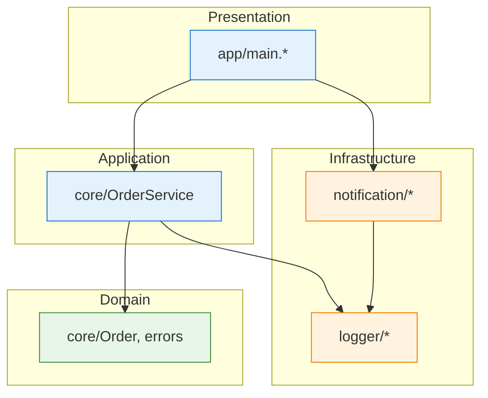
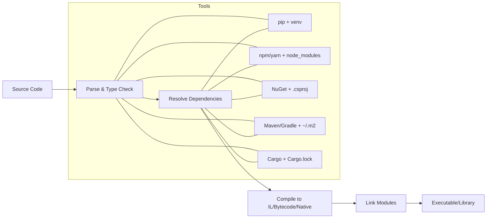

import ModuleDependencyGraph from '@site/src/components/ModuleDependencyGraph.jsx';
import ArchiStylerPlay from '@site/src/components/ArchiStylerPlay.jsx';

# Модульность и компонентный подход в разработке

<div class="article-tags">
  <span class="tag tag-required">ОБЯЗАТЕЛЬНО</span>
  <span class="tag tag-beginner">ДЛЯ НОВИЧКОВ</span>
</div>

<span class="complexity-badge">Разработчику</span>
<span class="complexity-badge">Аналитику</span>
<span class="complexity-badge">Тестировщику</span>  
<span class="complexity-badge">Архитектору</span>
<span class="complexity-badge">Инженеру</span>


## Основы модульности

### Декомпозиция и монолит

Архитектура программного обеспечения исторически развивалась от простых, линейных последовательностей инструкций — так называемых *скриптов* — к сложным, иерархически организованным системам, в которых логика и данные распределены между взаимодействующими, автономными единицами. Основным механизмом, позволившим совершить этот переход, стала **модульность**, а её концептуальное развитие — **компонентность**.

Модульность — это фундаментальная инженерная парадигма, направленная на управление сложностью. Она отражает общий принцип системного мышления: *разложение целого на части, каждая из которых реализует чётко определённую функцию и снабжена строго определённым интерфейсом взаимодействия с окружением*. Этот принцип применим в программировании, механике, электронике, биологии и других дисциплинах — однако в IT он получил наиболее формализованную и систематизированную реализацию.

<ModuleDependencyGraph />

<ArchiStylerPlay defaultPattern="layered" namespace="OrderSystem" title="Модули как классы на диаграмме" subtitle="Перетащите Handler, Repository и Entity; сравните зависимости с графом выше" />

Практический кейс - представим себе систему обработки заказов (order) с поддержкой уведомлений (notification) и логирования (logger). 

Основной use-case: PlaceOrder → создаёт заказ, логирует событие, отправляет уведомление.  

Общая структура домена (независимо от языка):
```
order-Система/
├── core/                # доменная логика (независимо от платформы)
│   ├── order.py|ts|cs…   # сущность Order, сервис OrderService
│   └── errors.py|ts…     # доменные исключения
├── logger/              # модуль логирования
│   └── logger.py|ts…
├── notification/        # модуль уведомлений
│   └── email.py|ts…
└── app/                 # точка входа
    └── main.py|ts|cs…
```

Связи:
	- app → зависит от core, logger, notification
	- core → зависит от logger (не зависит от notification)
	- notification → зависит от logger
	- logger → не имеет внешних зависимостей (ядро)

Граф зависимостей — ациклический, направленный граф (DAG), соответствует принципу зависимости от абстракций, а не от деталей.
```
     app
    /  |  \
 core  |  notification
   \   |   /
    logger
```

Сначала рассмотрим много теории, а позже - вернёмся к этому практическому кейсу.

Модульность и компонентность часто употребляются как синонимы, но между ними существует принципиальная разница, связанная с уровнем абстракции, контрактами и контекстом использования.

---

### Понятие модуля

**Модуль** — это *логически замкнутая единица исходного кода*, обладающая следующими свойствами:

1. **Автономность реализации** — внутреннее устройство модуля инкапсулировано и не влияет на корректность его внешнего поведения при соблюдении контракта.
2. **Явный интерфейс** — набор публичных сущностей, доступных для использования извне: функции, классы, переменные, типы, константы.
3. **Пространство имён** — модуль формирует собственное лексическое окружение (scope), предотвращающее конфликты имён между разными частями системы.
4. **Локальность изменений** — внесение изменений в реализацию модуля не требует перекомпиляции или перепроверки других модулей, если контракт не нарушен.

С формальной точки зрения, в большинстве современных языков программирования **модуль тождественен файлу с исходным кодом**. Например:

- В Python — файл `utils.py` автоматически становится модулем `utils`, при условии, что он содержит Python-код и не содержит синтаксических ошибок.
- В C# — файл `Logger.cs` может содержать класс `Logger`, который может быть использован вне файла через `using` при условии, что класс объявлен как `public`.
- В JavaScript (в режиме ES6) — файл `math.js`, содержащий `export function add(a, b) { … }`, становится модулем, доступным для импорта через `import { add } from './math.js'`.
- В Java — каждое объявление `public class X` должно находиться в файле `X.java`, и весь файл (а точнее — пакет, в котором находится класс) становится единицей модульности на уровне исходного кода.

Таким образом, модуль — это *физическая и логическая граница кодовой единицы*, которая может быть загружена, проанализирована и скомпилирована независимо от других частей программы.

---

### Механизм импорта и резолюции модулей

Для взаимодействия между модулями в языках предусмотрены механизмы импорта (import) и экспорта (export). Процесс резолюции модуля (module resolution) — это поиск соответствующего файла или бинарной единицы по указанному пути или имени.

#### Локальная резолюция

Наиболее простой случай — импорт модуля из того же проекта:

```python
# main.py

import utils  # интерпретатор ищет файл utils.py в том же каталоге

```

Здесь интерпретатор (например, CPython) последовательно проверяет:

- Текущую директорию скрипта.
- Директории, указанные в переменной окружения `PYTHONPATH`.
- Стандартные пути установки интерпретатора (например, `Lib/site-packages` в виртуальном окружении).

Аналогично в Node.js:

```javascript

import { compute } from './lib/math.js'; // относительный путь → файл в подкаталоге
import express from 'express';           // неполное имя → ищется в node_modules/

```

Node.js использует алгоритм, определённый в [ESM resolution specification](https://nodejs.org/api/esm.html#resolution-algorithm-specification): сначала проверяются абсолютные и относительные пути, затем — `node_modules` в текущей и родительских директориях (по принципу "вверх по дереву" до корня файловой системы).

#### Системные и внешние модули

Когда модуль не найден локально, среда выполнения или компилятор генерирует ошибку — например, `ModuleNotFoundError: No module named 'requests'` в Python. Чтобы устранить её, необходимо установить соответствующую библиотеку из внешнего источника. Для этого применяются **менеджеры зависимостей**:

| Экосистема      | Менеджер пакетов | Реестр по умолчанию           |
|-----------------|------------------|-------------------------------|
| Python          | `pip`            | PyPI (pypi.org)               |
| JavaScript/Node | `npm` / `yarn`   | npm Registry (registry.npmjs.org) |
| .NET (C#, F#)   | `NuGet`          | nuget.org                     |
| Java/Kotlin     | `Maven` / `Gradle` | Maven Central (repo1.maven.org) |

Менеджеры пакетов автоматизируют:

- Скачивание исходных или скомпилированных модулей ("пакетов").
- Разрешение зависимостей: если пакет A требует пакет B версии ≥2.1, а B требует C ≥1.0, то менеджер строит граф зависимостей и подбирает совместимые версии.
- Управление локальной кэш-структурой (например, `~/.m2/repository` для Maven, `node_modules` для npm).

Особо стоит отметить экосистему Java: в отличие от других языков, где единицей распространения может быть один файл (например, `.whl` в Python), в Java **пакет всегда распространяется как JAR-архив**, и его структура должна строго соответствовать иерархии пакетов (например, класс `com.example.util.Math` должен находиться в `com/example/util/Math.class` внутри JAR). Это требует использования **сборщиков** (build tools), таких как Maven или Gradle, которые:

- Управляют жизненным циклом сборки (compile → test → package → deploy).
- Централизуют описание зависимостей в декларативных файлах (`pom.xml`, `build.gradle`).
- Обеспечивают воспроизводимость сборки.

Таким образом, в Java модульность реализована на трёх уровнях:

1. **Исходный** — файл `.java`, класс.
2. **Пакетный** — именованная группа классов (`package com.example.service`).
3. **Модульный (Java 9+)** — механизм `module-info.java`, позволяющий явно декларировать экспорт пакетов и зависимости на уровне JVM (Project Jigsaw).

---

### Историческая эволюция модульности

Модульность — не изобретение 2000-х годов. Её корни уходят в 1960–1970-е, когда рост сложности программ потребовал новых методов проектирования.

- **1960-е** — появление понятия *подпрограммы* (subroutine) в языках вроде Fortran и ALGOL. В ALGOL-60 введено понятие *блочной структуры* и локальных переменных — зачаток инкапсуляции.
- **1970-е** — в Паскале (Wirth, 1971) и Modula-2 (1978) вводится понятие *модуля* как именованного блока кода, экспортирующего интерфейс и скрывающего реализацию. Modula-2 считается первым языком с полноценной поддержкой модульности на уровне синтаксиса.
- **1980-е** — в Ada появляются *пакеты* (packages), строго разделяющие спецификацию и тело. Это — ранний пример контрактного программирования.
- **1990-е** — в Java (1995) и C# (2000) модульность реализуется через *классы* и *пакеты/пространства имён*. Класс становится основной единицей модульности, а сборка (assembly в .NET, JAR в Java) — единицей распространения.
- **2000-е** — в JavaScript появляются неофициальные модульные системы: CommonJS (для Node.js, `require`), AMD (для браузера, `define`). Эти системы были *надстроечными* — сам язык их не поддерживал.
- **2015** — ES6 (ECMAScript 2015) вводит *нативные модули* (`import`/`export`) как часть спецификации языка.
- **2017** — Java 9 запускает Project Jigsaw: модульная система на уровне JVM (`module-info.java`), позволяющая создавать *модульные JAR-файлы* и контролировать видимость на уровне пакетов.

Эволюция шла по пути:  
**линейный скрипт → подпрограмма → файл-модуль → пакет → сборка/библиотека → платформенно-специфичный модуль (Jigsaw, .NET Assembly, ESM)**.

---

### Модульная архитектура

Модульная архитектура — это *архитектурный стиль*, при котором система разбивается на слабосвязанные, внутренне когезионные модули, взаимодействующие через чётко определённые интерфейсы.

#### Ключевые признаки

- **Слабая связность (loose coupling)** — зависимость между модулями выражается только через интерфейсы, а не через конкретные реализации или внутреннее состояние.
- **Высокая когезия (high cohesion)** — каждый модуль отвечает за одну и только одну зону ответственности (например, "работа с конфигурацией", "взаимодействие с БД", "бизнес-логика расчёта налогов").
- **Заменяемость** — модуль можно заменить альтернативной реализацией того же интерфейса без изменения остальной системы (например, `InMemoryCache` ↔ `RedisCache`).
- **Тестируемость** — модуль можно протестировать изолированно (unit test), предоставляя заглушки (mocks/stubs) для его зависимостей.

#### Типы модулей в проекте

В типичном проекте можно выделить следующие категории модулей:

| Тип модуля          | Описание                                                                 | Примеры имён/файлов                              |
|---------------------|--------------------------------------------------------------------------|--------------------------------------------------|
| **Точка входа**     | Содержит основную функцию/класс запуска.                                | `main.py`, `Program.cs`, `index.js`, `Main.java` |
| **Ядро / Domain**   | Чистая бизнес-логика, не зависящая от инфраструктуры.                    | `domain/order.py`, `core/models.ts`             |
| **Инфраструктурный**| Реализация внешних зависимостей: БД, API, файловая система.             | `infra/db/postgres.py`, `adapters/email.js`     |
| **Прикладной слой** | Оркестрация: использование ядра и инфраструктуры для реализации use-case. | `use_cases/place_order.py`                       |
| **Конфигурационный**| Модули, отвечающие за чтение и валидацию конфигурации.                  | `config.py`, `appsettings.json` + `Config.cs`   |
| **Вспомогательный** | Утилиты: форматирование, валидация, математика и т.д.                   | `utils/date.ts`, `helpers/string.py`            |
| **Тестовый**        | Не часть production-кода, но структурно — модуль.                       | `test_order.py`, `__tests__/math.test.js`       |

Заметим: файл конфигурации (например, `appsettings.json`, `config.yaml`) формально не является *модулем*, так как не содержит исполняемого кода. Однако он часто участвует в *инициализации модулей* и считается частью модульной структуры на уровне архитектуры.

---

### Модуль как единица зависимости

Важнейшим следствием модульности является **управление зависимостями**.

Если модуль A использует функциональность модуля B, то A *зависит* от B. В терминах графа: узел A имеет направленное ребро к узлу B.

- **Прямая зависимость** — A импортирует B напрямую.
- **Транзитивная зависимость** — A зависит от B, B от C ⇒ A транзитивно зависит от C.

Зависимость может быть:

- **Компиляционной** — необходима для сборки (например, интерфейс из `ILogger` в C#).
- **Выполнения** — необходима только при запуске (например, реализация `ConsoleLogger`).
- **Опциональной** — модуль может работать и без неё (feature flags, lazy loading, reflection).

Однако *отсутствие модуля, указанного в импорте, приводит к ошибке*: на этапе компиляции (C#, Java) или загрузки (Python, JS). Это делает зависимости *явными и проверяемыми* — в отличие от глобальных переменных или динамических `eval`, которые создают скрытые связи.

Таким образом, модульность обеспечивает:

- **Статическую проверяемость связей** — ошибки выявляются до выполнения.
- **Предсказуемость** — можно построить граф зависимостей и проанализировать его (циклические зависимости, "божественные" модули).
- **Управляемость** — с помощью инструментов вроде `dependency-cruiser`, `jdeps`, `dotnet-deps` можно визуализировать и оптимизировать архитектуру.

---

## Модули и компоненты

### Различие уровней абстракции

Хотя в повседневной практике термины *модуль* и *компонент* часто используются как синонимы, они принадлежат разным уровням архитектурного рассмотрения и имеют принципиальные отличия.

#### Модуль — единица разработки и компиляции

Как было показано ранее, модуль — это **единица исходного кода**, имеющая физическое воплощение в виде файла (или группы файлов с единым именем) и логическое — в виде пространства имён и интерфейса. Он существует на этапе *разработки* и *сборки*.

Модуль:

- Описывается на языке программирования.
- Обрабатывается компилятором/интерпретатором.
- Имеет статическую структуру: набор классов, функций, типов.
- Может быть подвергнут статическому анализу (линтеры, type checkers, dependency graphs).
- Не требует выполнения для своей проверки (кроме интерпретируемых языков, где синтаксис проверяется при импорте).

Пример: файл `payment_service.py`, содержащий `class PaymentService`, экспортирующий метод `process_payment(card, amount)`. Это модуль. Его можно импортировать, анализировать, тестировать отдельно.

#### Компонент — единица развёртывания и выполнения

**Компонент** — это *самодостаточная, заменяемая и развертываемая единица программного обеспечения*, которая:

- Обладает чётко определённым **контрактом** (часто формализованным: WSDL, OpenAPI, Protocol Buffers, IDL).
- Может быть **развёрнута независимо** (в отдельном процессе, контейнере, виртуальной машине).
- Взаимодействует с другими компонентами **через строго заданные интерфейсы**, обычно по сети (HTTP/gRPC/AMQP) или через IPC.
- Имеет собственный **жизненный цикл**: инициализация, обработка запросов, завершение.
- Часто предоставляет *сервис* (service), а не просто функции.

По определению IEEE Std 610.12–1990:  
> *"Component — a modular, deployable, and replaceable part of a System that encapsulates its implementation and exposes a set of interfaces".*

Исторически компоненты появились в распределённых системах. Например:

- COM-объект в Windows — двоичный компонент с интерфейсами, описанными в IDL.
- EJB (Enterprise JavaBeans) — компоненты бизнес-логики в Java EE, управляемые контейнером.
- Микросервис — наиболее современная форма компонента: изолированный процесс с REST/gRPC API.

Важное отличие:  
🔹 **Модуль** — *compile-time* понятие.  
🔹 **Компонент** — *runtime/deployment-time* понятие.

Модуль может стать компонентом — например, если `payment_service.py` обернуть в FastAPI-приложение и запустить как отдельный Docker-контейнер с `/pay` endpoint’ом. Тогда он перестаёт быть "просто модулем" и становится *компонентом системы обработки платежей*.

#### Компонентность

**Компонентность** — это принцип организации системы как совокупности слабосвязанных компонентов, взаимодействующих через чётко определённые интерфейсы. Она усиливает модульность, добавляя требования к:

- **Изолированности выполнения** — сбой в одном компоненте не должен падать всей системой.
- **Политикам взаимодействия** — асинхронность, таймауты, retry, circuit breaker.
- **Управлению версиями интерфейсов** — обратная совместимость, semantic versioning, API evolution.
- **Наблюдаемости** — логирование, метрики, трассировка должны быть единообразны во всех компонентах.

Компонентность наиболее ярко проявляется в:

- Микросервисной архитектуре.
- SOA (Service-Oriented Architecture).
- Плагинных системах (например, IDE-плагины, CMS-модули).
- Встраиваемых компонентах (Web Components, Angular Elements, React micro-frontends).

---

### Принципы проектирования модулей

Разбиение кода на модули — это не механическая операция "разрезать по функциям". Это инженерное решение, основанное на системе принципов.

#### Закон Деметры (Law of Demeter)

> *"Объект должен взаимодействовать только с ближайшими “друзьями”, а не со “всеми подряд”".*

Формулировка для модулей:  
> *Модуль A должен зависеть только от непосредственных зависимостей, а не от внутренних сущностей своих зависимостей.*

Нарушение:

```python
# ❌ Плохо: нарушает LoD
order = get_order()
customer_name = order.customer.profile.name.full_name
```

Исправление:

```python
# ✅ Хорошо: модуль Order предоставляет get_customer_name()
customer_name = order.get_customer_name()
```

Это снижает связанность и делает модуль `Order` более устойчивым к рефакторингу внутренней структуры `Customer` и `Profile`.

#### Принцип единственной ответственности (SRP, Single Responsibility Principle)

Каждый модуль должен иметь **одну, и только одну, причину для изменения**. Если модуль отвечает за "чтение конфига", "валидацию данных" и "отправку email’ов" — он делает слишком много.

Практический признак нарушения SRP: в commit message появляются союзы *"и"*, *"а также"*:
> *"Исправил парсинг YAML и добавил поддержку SMTP-аутентификации"*  
→ вероятно, модуль объединяет две зоны ответственности.

#### Принцип инверсии зависимостей (DIP, Dependency Inversion Principle)

Высокоуровневые модули не должны зависеть от низкоуровневых. Оба должны зависеть от абстракций.

Пример:

```csharp
// ❌ Зависимость от конкретной реализации
class OrderService {
    private readonly SqlOrderRepository _repo = new SqlOrderRepository();
}

// ✅ Зависимость от абстракции
interface IOrderRepository { Task<Order> GetById(int id); }

class OrderService {
    private readonly IOrderRepository _repo;
    public OrderService(IOrderRepository repo) => _repo = repo; // внедрение через DI
}
```

Модуль `OrderService` теперь не привязан к SQL — его можно тестировать с `InMemoryOrderRepository`, или подключить к MongoDB без изменения кода.

Это делает модуль *заменимым* — ключевое свойство компонентности.

#### Границы модулей

Частая ошибка — разбивать проект на модули по техническому признаку:  
`controllers/`, `models/`, `services/`, `utils/`.

Недостаток такого подхода — *распыление домена*: чтобы понять, как работает "оформление заказа", нужно открывать файлы в четырёх разных папках.

Альтернатива — **разбиение по доменным границам** (Domain-Driven Проектирование):

```
src/
├── order/
│   ├── domain/          # сущности, агрегаты, правила
│   ├── application/     # use Кейсы, DTO
│   ├── infrastructure/  # репозитории, адаптеры
│   └── interfaces/      # API, CLI, UI
├── payment/
│   └── ...
└── shared/              # общие типы, исключения
```

Такой модуль `order/` — *функционально полный*. Его можно:

- Выделить в отдельный микросервис.
- Перенести в другую кодовую базу.
- Передать другой команде разработки.

Граница модуля совпадает с *границей бизнес-контекста*.

---


### Стратегии декомпозиции

Выбор стратегии зависит от масштаба, домена и жизненного цикла системы.

#### По слоям (Layered Architecture)

Классическая трёхслойка: Presentation → Application → Domain → Infrastructure.

- ✅ Простота понимания.
- ✅ Подходит для малых и средних проектов.
- ❌ Склонна к монолитности: слои тесно связаны, трудно выделить подсистемы.
- ❌ Техническое разбиение, а не бизнес-ориентированное.

#### По доменным подсистемам (Modular Monolith)

Система остаётся в одном процессе, но структурирована как набор автономных модулей (пакетов), каждый со своей внутренней архитектурой.

- ✅ Высокая когезия внутри модулей.
- ✅ Возможность постепенного выделения микросервисов.
- ✅ Лёгкость развёртывания (один артефакт).
- ❌ Требует дисциплины: необходимо строго контролировать межмодульные зависимости (например, запрет циклов через архитектурные правила в ArchUnit, NetArchTest).

#### По функциональным фичам (Feature-Sliced Проектирование)

Популярный в веб-разработке подход (особенно в React/Vue):

```
src/
├── features/
│   ├── auth/
│   │   ├── model/    # данные, логика
│   │   ├── ui/       # компоненты
│   │   └── api/      # запросы
│   └── cart/
└── shared/
    ├── lib/
    ├── ui/
    └── api/
```

Акцент на *кросс-функциональной* организации: всё, что нужно для "авторизации", лежит рядом. Упрощает навигацию и рефакторинг.

#### По жизненному циклу

Для долгоживущих систем:  
- `core/` — стабильное ядро (редко меняется).  
- `extensions/` — модули, обновляемые независимо (через плагины, hot reload).  
- `legacy/` — миграционные мосты.

Пример: ELMA365, Creatio (BPMSoft) — ядро платформы фиксировано, а бизнес-логика реализуется в расширениях (скриптах, процессах, формах), которые можно обновлять без пересборки всей платформы.

---

### Фреймворки как поставщики модулей и компонентов

Фреймворк — это **инвертированная структура управления**, где *фреймворк вызывает код разработчика*, а не наоборот. Он определяет:

- Архитектурный каркас (MVC, MVVM, Clean Architecture).
- Готовый набор модулей (аутентификация, логирование, маршрутизация).
- Контракты для расширения (интерфейсы, хуки, события).
- Инструменты управления зависимостями и жизненным циклом.

#### Фреймворки предоставляют "строительные блоки"

Например:

- **Spring Boot (Java)** — предоставляет модули `spring-boot-starter-web`, `spring-boot-starter-Data-jpa`. Каждый — это готовый компонент с настраиваемым поведением (через `@ConfigurationProperties`, `@Bean`).
- **ASP.NET Core (C#)** — модули (`IApplicationBuilder.UseRouting()`, `UseAuthentication()`) — это middleware-компоненты, выстроенные в pipeline.
- **Angular** — компонент как ключевая единица UI: `@Component({ selector: 'app-header', ... })`. Компонент инкапсулирует шаблон, стили и логику.
- **React** — компонент как чистая функция: `function Button({ onClick, label }) { ... }`. Библиотеки (Material UI, Ant Проектирование) — это наборы переиспользуемых компонентов.

Фреймворк берёт на себя:

- Регистрацию модулей.
- Внедрение зависимостей.
- Управление конфигурацией.
- Обработку жизненного цикла (onInit, onDestroy и пр.).

#### Стандартизация интерфейсов

Хороший фреймворк определяет *интерфейсы*:

```typescript
// NestJS: любой класс с @Controller() становится частью маршрутизации
@Controller('users')
export class UsersController {
  constructor(private readonly usersService: UsersService) {}
  
  @Get()
  findAll(): User[] {
    return this.usersService.findAll();
  }
}
```

Здесь `UsersController` — модуль. Но благодаря фреймворку он автоматически становится *компонентом HTTP API*.

То же в BPMSoft (Creatio):  
- Скрипт-модуль на C# или JavaScript может быть привязан к событию формы ("После сохранения"),  
- Процесс — это компонент бизнес-логики с визуальным интерфейсом,  
- Шаблон отчёта — компонент генерации документов.

Фреймворк делает *компонентность достижимой без ручной реализации инфраструктуры*.

---

### Типичные проблемы модульных систем

#### Циклические зависимости

Ситуация: модуль A зависит от B, B — от A.  
Пример:

```python
# order.py
from payment import process_payment

def create_order():
    process_payment()  # ← зависит от payment

# payment.py
from order import Order

def process_payment():
    order = Order()  # ← зависит от order
```

Последствия:

- Невозможность инициализации (ошибка импорта в Python: `ImportError: cannot import name 'Order'`).
- Высокая связанность — изменение в одном модуле ломает другой.
- Нарушение SRP и DIP.

**Решения:**
- Ввести промежуточный интерфейс (например, `IPaymentProcessor` в домене `order`, реализованный в `payment`).
- Выделить общий модуль `shared/models.py`.
- Применить событийную архитектуру: `order` публикует `OrderCreated`, `payment` подписывается.

#### Модульный оверхед

Чрезмерная дробление:

- 50 модулей по 10 строк.
- Каждый — отдельный npm-пакет.
- Замедление сборки, рост сложности CI/CD.

**Правило:** модуль должен быть *достаточно мал*, чтобы понимать его целиком, но *достаточно велик*, чтобы оправдывать накладные расходы на управление.

#### Неявные зависимости

Когда модуль требует внешнего состояния (файл конфигурации, переменную окружения, глобальный объект), но не декларирует это явно:

```javascript
// ❌ Скрытая зависимость от process.env
export function getDatabaseUrl() {
  return `postgres://${process.env.DB_USER}@...`;
}
```

Лучше:

```javascript
// ✅ Явная зависимость через параметр или конфиг-объект
export function getDatabaseUrl(config: { user: string }) {
  return `postgres://${config.user}@...`;
}
```

Тогда модуль тестируем, заменяем и документируем.

---

## Низкоуровневый код и формальность

### Модульность в низкоуровневых языках — C, C++, Rust

В отличие от скриптовых или управляемых языков (Python, Java, C#), где модульность встроена в среду выполнения или компилятор, в системных языках границы модулей определяются как *линкером*, так и *соглашениями разработчика* — и часто требуют явного управления.

#### C — заголовочные файлы и единицы трансляции

В C модуль — это пара:

- `module.h` — **интерфейс**: объявления функций, типов, макросов.
- `module.c` — **реализация**: определения функций и статических данных.

```c
// logger.h
#ifndef LOGGER_H
#define LOGGER_H
void log_info(const char* msg);
#endif

// logger.c
#include "logger.h"
#include <stdio.h>
void log_info(const char* msg) {
    printf("[INFO] %s\n", msg);
}
```

Ключевые механизмы:

- `#include` — препроцессорная подстановка текста. Это копирование содержимого файла.
- `static` — ограничивает видимость символа в пределах единицы трансляции (`.c`-файла), реализуя инкапсуляцию на уровне объектных файлов.
- `extern` — объявление без определения, ссылка на символ из другого модуля.

**Сборка:**  
Каждый `.c`-файл компилируется в объектный файл (`logger.o`), затем `ld` (линкер) объединяет их в исполняемый файл или библиотеку.  
Если символ не найден — ошибка линковки: `undefined reference to 'log_info'`.

Таким образом, в C модульность управляется **вручную** и требует дисциплины:  
- соблюдения соглашений именования,  
- избегания глобальных переменных,  
- корректного управления `#define`-гвардами.

#### C++ — модули (C++20)

До C++20 модульность в C++ наследовала проблемы C: медленная компиляция из-за `#include`, ODR (One Definition Rule), fragility при изменении заголовков.

C++20 вводит **нативные модули** — первый крупный синтаксический шаг с 1998 года:

```cpp
// math.ixx (implementation unit)
export module math;

export int add(int a, int b) {
    return a + b;
}

// main.cpp

import math;

int main() {
    return add(2, 2); // → 4
}
```

Преимущества:

- **Нет препроцессора** — `import` ссылается на скомпилированную сигнатуру модуля (`.pcm`).
- **Чёткое разделение интерфейса/реализации** — `export` явно указывает, что доступно извне.
- **Ускорение сборки** — изменение реализации не требует перекомпиляции зависимых модулей (если интерфейс не менялся).
- **Устранение ODR-нарушений** — модуль — единая единица связывания.

Это делает C++ конкурентоспособным с Java/C# в плане масштабируемости крупных проектов (Chromium, Unreal Engine).

#### Rust

Rust изначально проектировался как модульный язык. Его система модулей — одна из самых строгих и выразительных:

- Модуль определяется ключевым словом `mod`.
- Файл `src/lib.rs` — корневой модуль библиотеки.
- Каждый файл — модуль (`src/db.rs` → модуль `db`).
- Иерархия: `mod db { mod postgres; }` → `src/db/postgres.rs`.

```rust
// src/lib.rs
pub mod utils;
pub mod db;

// src/utils.rs
pub fn now() -> u64 { /* ... */ }

// src/db/mod.rs
pub mod postgres;
// src/db/postgres.rs
use crate::utils::now; // полный путь: crate::utils::now
```

Особенности:

- `pub` — явный экспорт. Без `pub` сущность приватна даже для родительского модуля.
- `use` — сокращение путей, но не импорт как побочный эффект (в отличие от Python `import` с побочными действиями).
- `pub(crate)`, `pub(super)`, `pub(in path)` — гибкие уровни видимости.
- `#[cfg(feature = "sqlite")]` — условная компиляция модулей.

Rust также поддерживает **workspace** — композиция нескольких крейтов (crate = модуль + метаданные в `Cargo.toml`) в одном репозитории. Это позволяет строить *монорепозитории с модульной структурой*, где каждый крейт — потенциальный компонент.

---

### Функциональные языки

В функциональных языках (Haskell, OCaml, F#, Elm) модульность реализуется через **чистые функции, типы и композицию**.

#### Haskell — модули и сигнатуры

```haskell
-- Math.hs
module Math
  ( add
  , multiply
  ) where

add :: Int -> Int -> Int
add x y = x + y

multiply :: Int -> Int -> Int
multiply x y = x * y
```

Ключевые идеи:

- Модуль — единица компиляции и импорта (`import Math`).
- Экспорт явно перечисляется в списке после `module`.
- Типы — часть интерфейса: `add :: Int -> Int -> Int` гарантирует контракт.
- **Высшие типы** (`Functor`, `Monad`) — абстрактные "модули поведения", которые можно реализовать для разных типов.

Haskell позволяет определять **сигнатуры модулей** (аналог интерфейсов):

```haskell
-- Logger.hs
module Logger where
class Loggable a where
  logMsg :: a -> String

-- ConsoleLogger.hs
module ConsoleLogger where

import Logger

Data Console = MkConsole
instance Loggable Console where
  logMsg _ = "Logging to console"
```

Здесь `Logger` — *абстрактный модуль*, `ConsoleLogger` — *конкретная реализация*. Это — функциональный аналог DIP.

#### OCaml — модули как первоклассные сущности

OCaml идёт дальше: модули — *типы первого класса*.

- `module type` — сигнатура (интерфейс модуля).
- `module` — реализация.
- `functor` — функция высшего порядка над модулями.

```ocaml
(* LOGGING.mli *)
module type LOG = sig
  type t
  val log : t -> string -> unit
end

(* CONSOLE.ml *)
module Console : LOG = struct
  type t = unit
  let log () msg = print_endline msg
end

(* PREFIXED.ml *)
module Make (L : LOG) = struct
  let log_with_prefix prefix x msg =
    L.log x (prefix ^ ": " ^ msg)
end
```

`Make` — функтор: принимает модуль, удовлетворяющий `LOG`, и возвращает новый модуль. Это — параметрическая модульность: *модуль как значение*, передаваемое в функции.

Такой подход позволяет строить *генеративные архитектуры*: один и тот же алгоритм (сортировка, кэширование) может быть инстанцирован для разных стратегий логирования, хранения, сериализации — без дублирования кода.

---

### Модульность в инфраструктуре

Модульность выходит за пределы исходного кода — она пронизывает весь жизненный цикл ПО.

#### CI/CD

Современные системы сборки (GitLab CI, GitHub Actions, Azure Pipelines) поддерживают:

- **Reusable workflows** — параметризуемые фрагменты пайплайнов.
- **Composition** — вызов одного workflow из другого.
- **Conditional execution** — запуск модуля сборки только при изменении соответствующей директории (`paths: [src/order/**]`).

Пример: в monorepo можно определить:

```yaml
# .github/workflows/order.yml
name: Order Service
on:
  push:
    paths:
      - 'services/order/**'
jobs:
  test:
    runs-on: ubuntu-latest
    steps:
      - run: cd services/order && npm test
```

Это — *модуль CI*, связанный с *модулем кода*.

#### Контейнеризация

Docker-образ — это **бинарный модуль**, упакованный со всеми зависимостями:

- `FROM` — наследование базового модуля (алpine, node:20).
- `COPY` — встраивание модуля приложения.
- `ENTRYPOINT` — точка входа (аналог `main`).
- Multi-stage builds — сборка как композиция модулей: `build` → `test` → `deploy`.

```dockerfile
# Этап 1 — сборка (модуль сборки)
FROM mcr.microsoft.com/dotnet/sdk:8.0 AS build
WORKDIR /src
COPY . .
RUN dotnet publish -c Release -o /app

# Этап 2 — развёртывание (модуль выполнения)
FROM mcr.microsoft.com/dotnet/aspnet:8.0
WORKDIR /app
COPY --from=build /app .
ENTRYPOINT ["dotnet", "OrderService.dll"]
```

Каждый слой — модуль, кэшируемый и переиспользуемый.

#### Helm, Terraform, CDK

- **Helm charts** — параметризуемые Kubernetes-модули ("установи PostgreSQL с репликацией и бэкапом").
- **Terraform modules** — переиспользуемые блоки инфраструктуры:

```hcl
module "vpc" {
  source = "terraform-aws-modules/vpc/aws"
  cidr   = "10.0.0.0/16"
  azs    = ["eu-west-1a", "eu-west-1b"]
}
```

- **AWS CDK Constructs** — модули на языке программирования (TypeScript, Python), компилируемые в CloudFormation.

Таким образом, модульность становится *сквозной*: от доменной логики до облачных ресурсов.

---

### Модульность в Данные engineering и машинном обучении

В аналитических системах модульность критична из-за сложности пайплайнов и необходимости воспроизводимости.

#### Airflow — DAG-модули

Apache Airflow позволяет разбивать DAG на компоненты:

- `@task` — атомарная операция (скачать, преобразовать, загрузить).
- `TaskGroup` — логическая группировка задач (эквивалент модуля).
- `ExternalTaskSensor` — ожидание завершения модуля из другого DAG.

```python
with DAG("etl_sales") as dag:
    with TaskGroup("extract") as extract:
        fetch_db = PythonOperator(task_id="from_db", ...)
        fetch_api = SimpleHttpOperator(task_id="from_api", ...)

    transform = PythonOperator(task_id="transform", ...)
    extract >> transform
```

Здесь `extract` — модуль извлечения данных, независимый от `transform`.

#### MLflow Projects и компоненты Kubeflow

- **MLflow Project** — упакованный ML-модуль: код + `conda.yaml` + `MLproject` (точки входа).
- **Kubeflow Pipelines Components** — YAML-описание компонента:

```yaml
name: 'train-model'
inputs:
  - {name: training_data, type: Dataset}
implementation:
  container:
    image: gcr.io/my-project/train:1.0
    args: [--input, {inputPath: training_data}, --output, {outputPath: model}]
outputs:
  - {name: model, type: Model}
```

Каждый компонент — заменяемый, тестируемый, версионируемый модуль ML-пайплайна.

#### Feature Stores и модульность признаков

Современные feature stores (Feast, Tecton) позволяют определять *feature views* — модули вычисления признаков:

```python
# user_features.py
user_fv = FeatureView(
    name="user_features",
    entities=[user],
    ttl=timedelta(days=30),
    source=user_activity_source,
    schema=[
        Feature("avg_session_duration", dtype=Float32),
        Feature("login_count_7d", dtype=Int32),
    ]
)
```

Этот модуль можно:

- Использовать в offline-обучении.
- Сервить в реальном времени (online store).
- Версионировать и откатывать.

Модульность здесь — основа MLOps.

---

### Формальные основания

Модульность не интуитивна — она имеет строгие математические корни.

#### Теорема о разделении (Separation Logic)

Разработанная Хоаром и развитая О’Хирном, Separation Logic формализует рассуждения о программах с разделяемыми ресурсами:

- `P * Q` — "утверждение `P` верно в одной части памяти, `Q` — в непересекающейся".
- Модули могут рассуждать *локально*: если `P` гарантирует корректность модуля A, а `Q` — модуля B, и `P * Q` — состояние системы, то композиция корректна.

Это лежит в основе доказуемых систем: Frama-C, Viper, RustBelt.

#### Системы модульных типов

- **ML-модули (Standard ML)** — формализованы в λ<sub>mod</sub> — расширении λ-исчисления с модулями как первоклассными значениями.
- **Coq и Agda** — модули (`Module`, `Section`) используются для структурирования доказательств и переиспользования теорем.
- **Dependent types** (Idris, Lean) — типы зависят от значений, что позволяет кодировать *контракты модулей* на уровне типа:

```lean
def safe_div (n d : Nat) (h : d ≠ 0) : Nat := n / d
```

Здесь `h` — доказательство того, что `d ≠ 0`. Модуль, использующий `safe_div`, обязан предоставить это доказательство — иначе программа не скомпилируется.

#### Композиционная верификация

Если каждый модуль снабжён спецификацией (pre/post-conditions, invariants), то корректность системы выводится из корректности модулей и их интерфейсов — без полного анализа всей программы.

Пример: в Spec# (Microsoft Research) или Dafny:

```dafny
method Abs(x: int) returns (y: int)
  ensures y >= 0
{
  if x < 0 then y := -x else y := x;
}
```

Другие модули могут полагаться на `ensures y >= 0` — без изучения тела метода.

Это — предел модульности: **доверие через контракт, а не через инспекцию**.

---


## Сравнение по языкам


### Python

#### Код

```python
# logger/logger.py

import sys

from datetime import datetime

def info(msg: str):
    ts = datetime.now().isoformat()
    print(f"[INFO] {ts} {msg}", file=sys.stderr)

# notification/email.py
from logger.logger import info  # ← прямой импорт модуля

def send_email(to: str, subject: str, body: str):
    info(f"Sending email to {to}")
    # ... SMTP logic

# core/order.py
from dataclasses import dataclass
from logger.logger import info

@dataclass
class Order:
    id: int
    items: list[str]

class OrderService:
    def place_order(self, items: list[str]) -> Order:
        order = Order(id=1, items=items)
        info(f"Order {order.id} placed with {len(items)} items")
        return order

# app/main.py
from core.order import OrderService
from notification.email import send_email

if __name__ == "__main__":
    service = OrderService()
    order = service.place_order(["book", "pen"])
    send_email("user@example.com", "Order confirmed", f"ID: {order.id}")
```

#### Управление зависимостями

- **Локальные модули**: импорт по пути (`from logger.logger import ...`).  
  Поиск: текущая директория → `PYTHONPATH` → `site-packages`.
- **Внешние зависимости** — через `requirements.txt` и `pip`:
  ```txt
  # requirements.txt
  requests>=2.31.0  # если в notification нужен HTTP-запрос
  ```
  Установка: `pip install -r requirements.txt`.

#### Сборка

- Нет компиляции. Исполняемый файл — `main.py`.
- Для дистрибуции: `setup.py` или `pyproject.toml` (PEP 621):
  ```toml
  # pyproject.toml
  [build-Система]
  requires = ["setuptools"]
  [project]
  name = "order-Система"
  version = "0.1.0"
  dependencies = ["requests"]
  ```

#### Зависимости модулей (Python)



> Примечание: в Python отсутствует *явный* экспорт — всё, что не начинается с `_`, видно снаружи. Инкапсуляция — соглашение.

---

### JavaScript (ES Modules, Node.js)

#### Код

```js
// logger/logger.js
export function info(msg) {
  const ts = new Date().toISOString();
  console.log(`[INFO] ${ts} ${msg}`);
}

// notification/email.js

import { info } from '../logger/logger.js'; // ← относительный путь ОБЯЗАТЕЛЕН

export function sendEmail(to, subject, body) {
  info(`Sending email to ${to}`);
  // ... nodemailer или fetch
}

// core/order.js

import { info } from '../logger/logger.js';

export class Order {
  constructor(id, items) {
    this.id = id;
    this.items = items;
  }
}

export class OrderService {
  placeOrder(items) {
    const order = new Order(1, items);
    info(`Order ${order.id} placed with ${items.length} items`);
    return order;
  }
}

// app/main.js

import { OrderService } from '../core/order.js';
import { sendEmail } from '../notification/email.js';

const service = new OrderService();
const order = service.placeOrder(['book', 'pen']);
sendEmail('user@example.com', 'Order confirmed', `ID: ${order.id}`);
```

#### Управление зависимостями

- `package.json`:
  ```json
  {
    "name": "order-Система",
    "type": "module",
    "dependencies": {
      "nodemailer": "^6.9.13"
    }
  }
  ```
- Установка: `npm install`.
- Поиск модулей:
  - Относительные пути (`./`, `../`) → файловая система.
  - Неполные имена (`nodemailer`) → `node_modules`.

#### Сборка

- Для браузера: требуется bundler (Vite, Webpack), так как браузер не поддерживает `node_modules`.
- Для Node.js: `node app/main.js` — работает напрямую при `"type": "module"`.

#### Зависимости модулей (JS/ESM)



> Важно: расширение `.js` в `import` — обязательно по стандарту ESM (в отличие от CommonJS).

---

### C# (.NET 8, SDK-style проект)

#### Код

```csharp
// logger/ILogger.cs + Logger.cs
public interface ILogger
{
    void Info(string msg);
}

public class ConsoleLogger : ILogger
{
    public void Info(string msg) =>
        Console.WriteLine($"[INFO] {DateTime.UtcNow:O} {msg}");
}

// core/Order.cs + OrderService.cs
public record Order(int Id, string[] Items);

public class OrderService
{
    private readonly ILogger _logger;
    public OrderService(ILogger logger) => _logger = logger;

    public Order PlaceOrder(string[] items)
    {
        var order = new Order(1, items);
        _logger.Info($"Order {order.Id} placed with {items.Length} items");
        return order;
    }
}

// notification/IEmailService.cs + SmtpEmailService.cs
public interface IEmailService
{
    Task SendAsync(string to, string subject, string body);
}

public class SmtpEmailService : IEmailService
{
    private readonly ILogger _logger;
    public SmtpEmailService(ILogger logger) => _logger = logger;

    public async Task SendAsync(string to, string subject, string body)
    {
        _logger.Info($"Sending email to {to}");
        // ... SmtpClient
        await Task.CompletedTask;
    }
}

// app/Program.cs
using OrderSystem.Core;
using OrderSystem.Logger;
using OrderSystem.Notification;

var logger = new ConsoleLogger();
var orderService = new OrderService(logger);
var emailService = new SmtpEmailService(logger);

var order = orderService.PlaceOrder(["book", "pen"]);
await emailService.SendAsync("user@example.com", "Order confirmed", $"ID: {order.Id}");
```

#### Структура проекта

```
OrderSystem.sln
├── OrderSystem.Core/        // classlib
│   ├── Order.cs
│   └── OrderService.cs
├── OrderSystem.Logger/      // classlib
│   ├── ILogger.cs
│   └── ConsoleLogger.cs
├── OrderSystem.Notification/ // classlib
│   ├── IEmailService.cs
│   └── SmtpEmailService.cs
└── OrderSystem.App/         // exe
    └── Program.cs
```

#### Зависимости между проектами

`OrderSystem.App.csproj`:
```xml
<Project Sdk="Microsoft.NET.Sdk">
  <PropertyGroup>
    <OutputType>Exe</OutputType>
    <TargetFramework>net8.0</TargetFramework>
  </PropertyGroup>
  <ItemGroup>
    <ProjectReference Include="..\OrderSystem.Core\OrderSystem.Core.csproj" />
    <ProjectReference Include="..\OrderSystem.Notification\OrderSystem.Notification.csproj" />
  </ItemGroup>
</Project>
```

`OrderSystem.Core.csproj`:
```xml
<ItemGroup>
  <ProjectReference Include="..\OrderSystem.Logger\OrderSystem.Logger.csproj" />
</ItemGroup>
```

#### Сборка

- `dotnet build` → создаёт `bin/Debug/net8.0/OrderSystem.App.dll`.
- `dotnet run --project app/OrderSystem.App.csproj`.

#### Сборка и зависимости (.NET)



> Преимущество: проектные ссылки (`ProjectReference`) обеспечивают *типобезопасность на этапе компиляции* и предотвращают несовместимость версий.

---

### Java (Maven)

#### Код

```java
// logger/src/main/java/com/example/logger/Logger.java
package com.example.logger;
public interface Logger {
    void info(String msg);
}
public class ConsoleLogger implements Logger {
    public void info(String msg) {
        System.out.println("[INFO] " + java.time.Instant.now() + " " + msg);
    }
}

// core/src/main/java/com/example/core/Order.java
package com.example.core;
public record Order(int id, String[] items) {}

// core/src/main/java/com/example/core/OrderService.java
package com.example.core;

import com.example.logger.Logger;

public class OrderService {
    private final Logger logger;
    public OrderService(Logger logger) { this.logger = logger; }
    public Order placeOrder(String[] items) {
        var order = new Order(1, items);
        logger.info("Order %d placed with %d items".formatted(order.id(), items.length));
        return order;
    }
}

// notification/src/main/java/com/example/notification/EmailService.java
package com.example.notification;

import com.example.logger.Logger;

public interface EmailService {
    void send(String to, String subject, String body);
}
public class SmtpEmailService implements EmailService {
    private final Logger logger;
    public SmtpEmailService(Logger logger) { this.logger = logger; }
    public void send(String to, String subject, String body) {
        logger.info("Sending email to " + to);
        // ...
    }
}

// app/src/main/java/com/example/app/Main.java
package com.example.app;

import com.example.core.*;
import com.example.logger.*;
import com.example.notification.*;

public class Main {
    public static void main(String[] args) {
        Logger logger = new ConsoleLogger();
        OrderService orderService = new OrderService(logger);
        EmailService emailService = new SmtpEmailService(logger);
        Order order = orderService.placeOrder(new String[]{"book", "pen"});
        emailService.send("user@example.com", "Order confirmed", "ID: " + order.id());
    }
}
```

#### Структура Maven
```
order-Система/
├── pom.xml                 # агрегирующий
├── logger/pom.xml          # <groupId>com.example</groupId><artifactId>logger</artifactId>
├── core/pom.xml            # зависит от logger: <dependency><groupId>com.example</groupId><artifactId>logger</artifactId>...
├── notification/pom.xml    # зависит от logger
└── app/pom.xml             # зависит от core, notification
```

`core/pom.xml`:
```xml
<dependencies>
  <dependency>
    <groupId>com.example</groupId>
    <artifactId>logger</artifactId>
    <version>1.0.0</version>
  </dependency>
</dependencies>
```

#### Сборка

1. `mvn install` в корне → устанавливает модули в локальный репозиторий (`~/.m2/repository`).
2. `mvn compile` / `mvn package` → `target/app-1.0.0.jar`.

#### Maven multi-module и сборка



> Особенность: Maven требует *двухуровневой иерархии*: логическая (пакеты) + физическая (каталоги + `pom.xml`). Это обеспечивает воспроизводимость, но увеличивает "boilerplate".

---

### Rust (Cargo)

#### Код

```rust
// logger/src/lib.rs
pub fn info(msg: &str) {
    let now = chrono::Utc::now();
    println!("[INFO] {} {}", now.to_rfc3339(), msg);
}

// notification/src/lib.rs
use order_logger::info; // ← имя крейта, не путь!

pub fn send_email(to: &str, subject: &str, body: &str) {
    info(&format!("Sending email to {}", to));
    // ...
}

// core/src/lib.rs
use order_logger::info;

#[derive(Debug)]
pub struct Order {
    pub id: i32,
    pub items: Vec<String>,
}

pub struct OrderService;

impl OrderService {
    pub fn place_order(items: Vec<String>) -> Order {
        let order = Order { id: 1, items };
        info(&format!("Order {} placed with {} items", order.id, order.items.len()));
        order
    }
}

// app/src/main.rs
use order_core::{OrderService, Order};
use order_notification::send_email;

fn main() {
    let order = OrderService::place_order(vec!["book".into(), "pen".into()]);
    send_email("user@example.com", "Order confirmed", &format!("ID: {}", order.id));
}
```

#### Структура Cargo workspace

```
order-Система/
├── Cargo.toml              # [workspace] members = ["logger", "core", "notification", "app"]
├── logger/Cargo.toml       # [package] name = "order-logger"
├── core/Cargo.toml         # [dependencies] order-logger = { path = "../logger" }
├── notification/Cargo.toml # [dependencies] order-logger = { path = "../logger" }
└── app/Cargo.toml          # [dependencies] order-core = { path = "../core" }, ...
```

`core/Cargo.toml`:
```toml
[package]
name = "order-core"
version = "0.1.0"

[dependencies]
order-logger = { path = "../logger" }
```

#### Сборка

- `cargo build` в корне → компилирует все крейты, кэширует артефакты в `target/debug/`.
- Бинарник: `target/debug/app`.

#### Cargo workspace и крейты



> Особенности Rust:
> - Имя зависимости — `order-logger`, а не путь.  
> - `use order_logger::info` — крейт регистрируется под именем из `Cargo.toml`.  
> - Циклические зависимости между крейтами **запрещены на уровне компилятора**.

---

## Сводные диаграммы

### Архитектурные слои (единая для всех языков)  


Соответствует **Clean Architecture**: зависимости направлены внутрь, к домену.

---

### Граф сборки (обобщённый)



---
